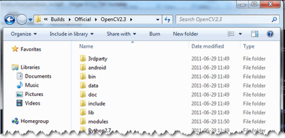

.. _Windows_Installation:

Installation in Windows
***********************

The description here was tested by the author using the Windows 7 SP1 **o**\ perating **s**\ ystem (OS). Nevertheless, it should also work on any other Windows OS too. If you encounter errors after following the steps described here feel free to contact us via our :opencv_group:`user group <>` and we will try to fix your problem.

.. note:: To use the OpenCV library you have two options:
   
   .. container:: enumeratevisibleitems
   
      - download and install our pre-built libraries
      - make your own ones from the source files.

   While the first one is easier to complete, it only works if you are coding inside the latest Microsoft Visual Studio integrated development environments and doesn't takes advantage of the most novel technologies we integrate into our library. 

Installation by using the pre-built libraries
=============================================

1. Open up a web browser and go to: http://sourceforge.net/projects/opencvlibrary/files/opencv-win/

#. Open the folder for the latest version (currently this is 2.3).

#. Choose a build you want to use and download it. The naming conventions used will show what kind of support they offer. For example:
   
   .. container:: enumeratevisibleitems
   
      * *vs2010* means the Visual Studio 
      * *win32* means that it is for 32 bit applications in the OS
      * *gpu* means that it includes the support for using your GPU in order to further increase the performance of the library).
   
   If you downloaded the source files present here see :ref:`CppTutWindowsMakeOwn`.

#. Make sure you have admin rights. Start the setup and follow the wizard. Agree to the \" License Agreement \" . 

#. Adding the OpenCV library to the system path is a good decision unless you want to play around with multiple flavors of the same OpenCV version. You will use the OpenCV library in form of *\"Dynamic-link library\"* (also known as **DLL**). Inside these are stored all the algorithms and information the OpenCV library contains. The operating system will load them only on demand during runtime. However, to do this he needs to know where they are. The systems **PATH** contains a list of folders where DLLs can be found. Add the OpenCV library path to this and the OS will know of the existence of the OpenCV binaries. Otherwise you will need to copy the used DLLs right beside the applications executable file (*exe*) for the OS to find it. 

   .. note:: 
      A good way to check your systems path folders is by using the \"*Path Editor*\" application. You can download it `from here <http://www.redfernplace.com/software-projects/patheditor/>`_. Use this if you are not sure the systems path was updated with the OpenCV entry. You can also add manually new folders to the system path by using this application. 

#. Most of the time it is a good idea to install the source files as this will allow for you to debug into the OpenCV library, if it is necessary. Therefore, just follow the default settings of the wizard and finish the installation. 

#. In the end you can check the installation at the chosen path. If you added the OpenCV Path to the system PATH inside the *Path Editor* you should see an entry with the *bin* folder of the OpenCV directory. 

Szia.

.. _CppTutWindowsMakeOwn: 

Installation by making your own libraries
=========================================

If you are building your own libraries you can either take the source files from our latest:

   .. container:: enumeratevisibleitems

      + stable/tested build - https://code.ros.org/svn/opencv/branches/
      + development build - https://code.ros.org/svn/opencv/trunk/

While the later one may contain a couple of new and experimental algorithms, performance increases and interface improvements be aware that it may also contain many-many bugs. Using the first one is recommended in most of the cases, unless you are extending the OpenCV library itself or really need to most up to date version of it. 
