.. _Windows_Visual_Studio_How_To:

How to build applications with OpenCV inside the *Microsoft Visual Studio*
**************************************************************************

Everything I describe here will apply to the C\\C++ interface of OpenCV.
I start out from the assumption that you have read and completed with success the :ref:`Windows_Installation` tutorial. Therefore, before you go any further make sure you have an OpenCV directory that contains the OpenCV header files plus binaries and you have set the environment variables as :ref:`described here <WindowsSetPathAndEnviromentVariable>`.

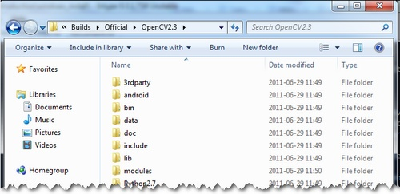

The OpenCV libraries, distributed by us, on the Microsoft Windows operating system are in a **D**\ ynamic **L**\ inked **L**\ ibraries (*DLL*). These have the advantage that all the content of the library are loaded only at runtime, on demand, and that countless programs may use the same library file. This means that if you have ten applications using the OpenCV library, no need to have around a version for each one of them. Of course you need to have the *dll* of the OpenCV on all systems where you want to run your application.

Another approach is to use static libraries that have *lib* extensions. You may build these by using our source files as described in the :ref:`Windows_Installation` tutorial. When you use this the library will be built-in inside your *exe* file.  So there is no chance that the user deletes them, for some reason. As a drawback your application will be larger one and as, it will take more time to load it during its startup.

To build an application with OpenCV you need to do two things:

.. container:: enumeratevisibleitemswithsquare

  + *Tell* to the compiler how the OpenCV library *looks*. You do this by *showing* it the header files.
  + *Tell* to the linker from where to get the functions or data structures of OpenCV, when they are needed.

    If you use the *lib* system you must set the path where the library files are and specify in which one of them to look. During the build the linker will look into these libraries and add the definitions and implementation of all *used* functions and data structures to the executable file.

    If you use the *DLL* system you must again specify all this, however now for a different reason. This is a Microsoft OS specific stuff. It seems that the linker needs to know that where in the DLL to search for the data structure or function at the runtime. This information is stored inside *lib* files. Nevertheless, they aren't static libraries. They are so called import libraries. This is why when you make some *DLLs* in Windows you will also end up with some *lib* extension libraries. The good part is that at runtime only the *DLL* is required.

To pass on all this information to the Visual Studio IDE you can either do it globally (so all your future projects will get these information) or locally (so only for you current project). The advantage of the global one is that you only need to do it once; however, it may be undesirable to clump all your projects all the time with all these information. In case of the global one how you do it depends on the Microsoft Visual Studio you use. There is a **2008 and previous versions** and a **2010 way** of doing it. Inside the global section of this tutorial I'll show what the main differences are.

The base item of a project in Visual Studio is a solution. A solution may contain multiple projects. Projects are the building blocks of an application. Every project will realize something and you will have a main project in which you can put together this project puzzle. In case of the many simple applications (like many of the tutorials will be) you do not need to break down the application into modules. In these cases your main project will be the only existing one. Now go create a new solution inside Visual studio by going through the :menuselection:`File --> New --> Project` menu selection. Choose *Win32 Console Application* as type. Enter its name and select the path where to create it. Then in the upcoming dialog make sure you create an empty project.

.. image:: images/NewProjectVisualStudio.jpg
   :alt: Which options to select
   :align: center

The *local* method
==================

Every project is built separately from the others. Due to this every project has its own rule package. Inside this rule packages are stored all the information the *IDE* needs to know to build your project. For any application there are at least two build modes: a *Release* and a *Debug* one. The *Debug* has many features that exist so you can find and resolve easier bugs inside your application. In contrast the *Release* is an optimized version, where the goal is to make the application run as fast as possible or to be as small as possible. You may figure that these modes also require different rules to use during build. Therefore, there exist different rule packages for each of your build modes. These rule packages are called inside the IDE as *project properties* and you can view and modify them by using the *Property Manger*. You can bring up this with :menuselection:`View --> Property Pages`. Expand it and you can see the existing rule packages (called *Proporty Sheets*).

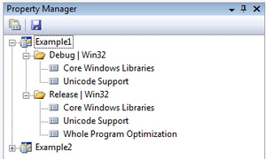

The really useful stuff of these is that you may create a rule package *once* and you can later just add it to your new projects. Create it once and reuse it later. We want to create a new *Property Sheet* that will contain all the rules that the compiler and linker needs to know. Of course we will need a separate one for the Debug and the Release Builds. Start up with the Debug one as shown in the image below:

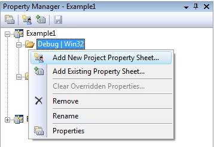

Use for example the *OpenCV_Debug* name. Then by selecting the sheet :menuselection:`Right Click --> Properties`. In the following I will show to set the OpenCV rules locally, as I find unnecessary to pollute projects with custom rules that I do not use it. Go the C++ groups General entry and under the *"Additional Include Directories"* add the path to your OpenCV include. If you don't have *"C/C++"* group, you should add any .c/.cpp file to the project.

.. code-block:: bash

   $(OPENCV_DIR)\..\..\include

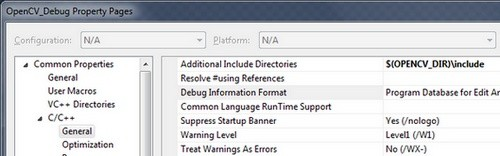

When adding third party libraries settings it is generally a good idea to use the power behind the environment variables. The full location of the OpenCV library may change on each system. Moreover, you may even end up yourself with moving the install directory for some reason. If you would give explicit paths inside your property sheet your project will end up not working when you pass it further to someone else who has a different OpenCV install path. Moreover, fixing this would require to manually modifying every explicit path. A more elegant solution is to use the environment variables. Anything that you put inside a parenthesis started with a dollar sign will be replaced at runtime with the current environment variables value. Here comes in play the environment variable setting we already made in our :ref:`previous tutorial <WindowsSetPathAndEnviromentVariable>`.

Next go to the :menuselection:`Linker --> General` and under the *"Additional Library Directories"* add the libs directory:

.. code-block:: bash

   $(OPENCV_DIR)\lib

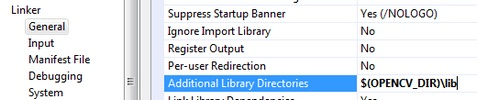

Then you need to specify the libraries in which the linker should look into. To do this go to the :menuselection:`Linker --> Input` and under the *"Additional Dependencies"* entry add the name of all modules which you want to use:

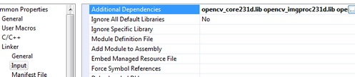

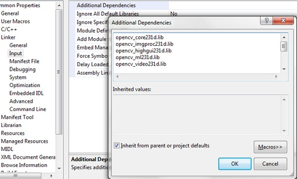

The names of the libraries are as follow:

.. code-block:: bash

   opencv_(The Name of the module)(The version Number of the library you use)d.lib

A full list, for the latest version would contain:

.. code-block:: bash

   opencv_core231d.lib
   opencv_imgproc231d.lib
   opencv_highgui231d.lib
   opencv_ml231d.lib
   opencv_video231d.lib
   opencv_features2d231d.lib
   opencv_calib3d231d.lib
   opencv_objdetect231d.lib
   opencv_contrib231d.lib
   opencv_legacy231d.lib
   opencv_flann231d.lib

The letter *d* at the end just indicates that these are the libraries required for the debug. Now click ok to save and do the same with a new property inside the Release rule section. Make sure to omit the *d* letters from the library names and to save the property sheets with the save icon above them.

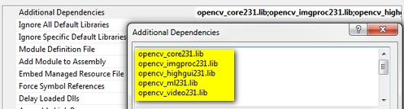

You can find your property sheets inside your projects directory. At this point it is a wise decision to back them up into some special directory, to always have them at hand in the future, whenever you create an OpenCV project. Note that for Visual Studio 2010 the file extension is *props*, while for 2008 this is *vsprops*.

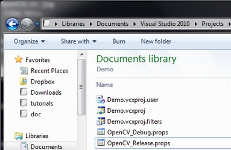

Next time when you make a new OpenCV project just use the "Add Existing Property Sheet..." menu entry inside the Property Manager to easily add the OpenCV build rules.

The *global* method
===================

In case you find to troublesome to add the property pages to each and every one of your projects you can also add this rules to a *"global property page"*. However, this applies only to the additional include and library directories. The name of the libraries to use you still need to specify manually by using for instance: a Property page.

In Visual Studio 2008 you can find this under the:  :menuselection:`Tools --> Options --> Projects and Solutions --> VC++ Directories`.

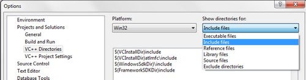

In Visual Studio 2010 this has been moved to a global property sheet which is automatically added to every project you create:

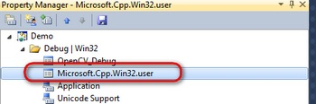

The process is the same as described in case of the local approach. Just add the include directories by using the environment variable *OPENCV_DIR*.

Test it!
========

Now to try this out download our little test :download:`source code <../../../../samples/cpp/tutorial_code/introduction/windows_visual_studio_Opencv/introduction_windows_vs.cpp>` or get it from the sample code folder of the OpenCV sources. Add this to your project and build it. Here's its content:

.. literalinclude:: ../../../../samples/cpp/tutorial_code/introduction/windows_visual_studio_Opencv/introduction_windows_vs.cpp
   :language: cpp
   :tab-width: 4
   :linenos:

You can start a Visual Studio build from two places. Either inside from the *IDE* (keyboard combination: :kbd:`Control-F5`) or by navigating to your build directory and start the application with a double click. The catch is that these two **aren't** the same. When you start it from the *IDE* its current working directory is the projects directory, while otherwise it is the folder where the application file currently is (so usually your build directory). Moreover, in case of starting from the *IDE* the console window will not close once finished. It will wait for a keystroke of yours.

.. |voila| unicode:: voil U+00E1

This is important to remember when you code inside the code open and save commands. You're resources will be saved ( and queried for at opening!!!) relatively to your working directory. This is unless you give a full, explicit path as parameter for the I/O functions. In the code above we open :download:`this OpenCV logo<../../../../samples/cpp/tutorial_code/images/opencv-logo.png>`. Before starting up the application make sure you place the image file in your current working directory. Modify the image file name inside the code to try it out on other images too. Run it and |voila|:

.. image:: images/SuccessVisualStudioWindows.jpg
   :alt: You should have this.
   :align: center

Command line arguments with Visual Studio
=========================================

Throughout some of our future tutorials you'll see that the programs main input method will be by giving a runtime argument. To do this you can just start up a commmand windows (:kbd:`cmd + Enter` in the start menu), navigate to your executable file and start it with an argument. So for example in case of my upper project this would look like:

.. code-block:: bash
   :linenos:

   D:
   CD OpenCV\MySolutionName\Release
   MySolutionName.exe exampleImage.jpg

Here I first changed my drive (if your project isn't on the OS local drive), navigated to my project and start it with an example image argument. While under Linux system it is common to fiddle around with the console window on the Microsoft Windows many people come to use it almost never. Besides, adding the same argument again and again while you are testing your application is, somewhat, a cumbersome task. Luckily, in the Visual Studio there is a menu to automate all this:

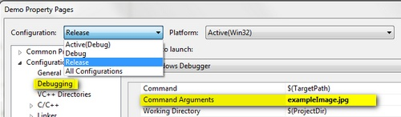

Specify here the name of the inputs and while you start your application from the Visual Studio enviroment you have automatic argument passing. In the next introductionary tutorial you'll see an in-depth explanation of the upper source code: :ref:`Display_Image`.
