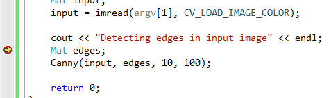
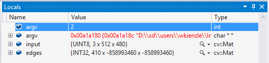
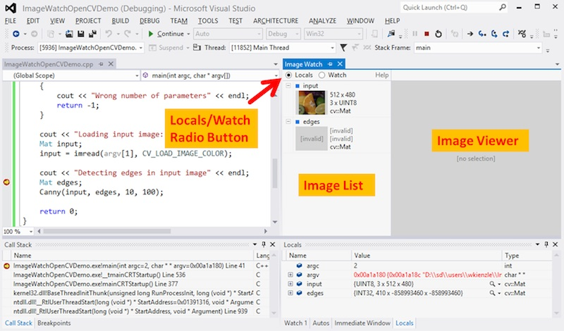
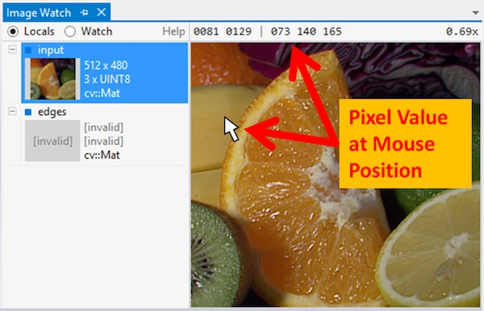
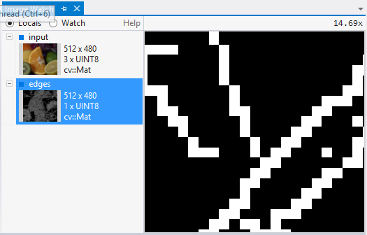
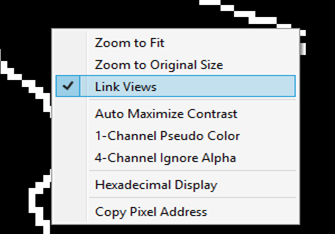
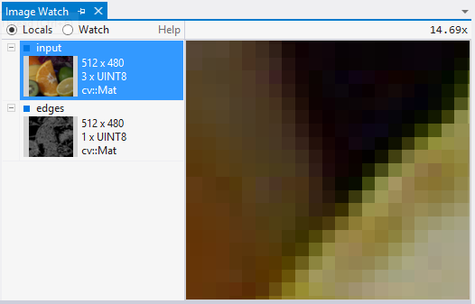
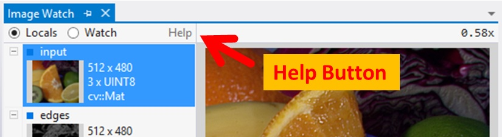

.. _Windows_Visual_Studio_Image_Watch:

Image Watch: viewing in-memory images in the Visual Studio debugger
*******************************************************************

Image Watch is a plug-in for Microsoft Visual Studio that lets you to visualize in-memory images (*cv::Mat* or *IplImage\_* objects, for example) while debugging an application. This can be helpful for tracking down bugs, or for simply understanding what a given piece of code is doing.

Prerequisites
=============

This tutorial assumes that you have the following available:

#. Visual Studio 2012 Professional (or better) with Update 1 installed. Update 1 can be downloaded `here <http://www.microsoft.com/en-us/download/details.aspx?id=35774>`_.

#. An OpenCV installation on your Windows machine (Tutorial: :ref:`Windows_Installation`).

#. Ability to create and build OpenCV projects in Visual Studio (Tutorial: :ref:`Windows_Visual_Studio_How_To`).

Installation
============

`Download <http://go.microsoft.com/fwlink/?LinkId=285460>`_ the Image Watch installer. The installer comes in a single file with extension .vsix (*Visual Studio Extension*). To launch it, simply double-click on the .vsix file in Windows Explorer. When the installer has finished, make sure to restart Visual Studio to complete the installation.

Example
========

Image Watch works with any existing project that uses OpenCV image objects (for example, *cv::Mat*). In this example, we use a minimal test program that loads an image from a file and runs an edge detector. To build the program, create a console application project in Visual Studio, name it "image-watch-demo", and insert the source code below.

.. code-block:: c++

    // Test application for the Visual Studio Image Watch Debugger extension

    #include <iostream>                        // std::cout
    #include <opencv2/core/core.hpp>           // cv::Mat
    #include <opencv2/highgui/highgui.hpp>     // cv::imread()
    #include <opencv2/imgproc/imgproc.hpp>     // cv::Canny()

    using namespace std;
    using namespace cv;

    void help()
    {
        cout
            << "----------------------------------------------------" << endl
            << "This is a test program for the Image Watch Debugger " << endl
            << "plug-in for Visual Studio. The program loads an     " << endl
            << "image from a file and runs the Canny edge detector. " << endl
            << "No output is displayed or written to disk."
            << endl
            << "Usage:"                                               << endl
            << "image-watch-demo inputimage"                          << endl
            << "----------------------------------------------------" << endl
            << endl;
    }

    int main(int argc, char *argv[])
    {
        help();

        if (argc != 2)
        {
            cout << "Wrong number of parameters" << endl;
            return -1;
        }

        cout << "Loading input image: " << argv[1] << endl;
        Mat input;
        input = imread(argv[1], CV_LOAD_IMAGE_COLOR);

        cout << "Detecting edges in input image" << endl;
        Mat edges;
        Canny(input, edges, 10, 100);

        return 0;
    }

Make sure your active solution configuration (:menuselection:`Build --> Configuration Manager`) is set to a debug build (usually called "Debug"). This should disable compiler optimizations so that viewing variables in the debugger can work reliably.

Build your solution (:menuselection:`Build --> Build Solution`, or press *F7*).

Before continuing, do not forget to add the command line argument of your input image to your project (:menuselection:`Right click on project --> Properties --> Configuration Properties --> Debugging` and then set the field ``Command Arguments`` with the location of the image).

Now set a breakpoint on the source line that says

.. code-block:: c++

    Mat edges;

To set the breakpoint, right-click on the source line and select :menuselection:`Breakpoints --> Insert Breakpoint` from the context menu.

Launch the program in the debugger (:menuselection:`Debug --> Start Debugging`, or hit *F5*). When the breakpoint is hit, the program is paused and Visual Studio displays a yellow instruction pointer at the breakpoint:

Now you can inspect the state of you program. For example, you can bring up the *Locals* window (:menuselection:`Debug --> Windows --> Locals`), which will show the names and values of the variables in the current scope:

Note that the built-in *Locals* window will display text only. This is where the Image Watch plug-in comes in. Image Watch is like another *Locals* window, but with an image viewer built into it. To bring up Image Watch, select :menuselection:`View --> Other Windows --> Image Watch`. Like Visual Studio's *Locals* window, Image Watch can dock to the Visual Studio IDE. Also, Visual Studio will remember whether you had Image Watch open, and where it was located between debugging sessions. This means you only have to do this once--the next time you start debugging, Image Watch will be back where you left it. Here's what the docked Image Watch window looks like at our breakpoint:

The radio button at the top left (*Locals/Watch*) selects what is shown in the *Image List* below: *Locals* lists all OpenCV image objects in the current scope (this list is automatically populated). *Watch* shows image expressions that have been pinned for continuous inspection (not described here, see `Image Watch documentation <http://go.microsoft.com/fwlink/?LinkId=285461>`_ for details). The image list shows basic information such as width, height, number of channels, and, if available, a thumbnail. In our example, the image list contains our two local image variables, *input* and *edges*.

If an image has a thumbnail, left-clicking on that image will select it for detailed viewing in the *Image Viewer* on the right. The viewer lets you pan (drag mouse) and zoom (mouse wheel). It also displays the pixel coordinate and value at the current mouse position.

Note that the second image in the list, *edges*, is shown as "invalid". This indicates that some data members of this image object have corrupt or invalid values (for example, a negative image width). This is expected at this point in the program, since the C++ constructor for *edges* has not run yet, and so its members have undefined values (in debug mode they are usually filled with "0xCD" bytes).

From here you can single-step through your code (:menuselection:`Debug->Step Over`, or press *F10*) and watch the pixels change: if you step once, over the *Mat edges;* statement, the *edges* image will change from "invalid" to "empty", which means that it is now in a valid state (default constructed), even though it has not been initialized yet (using *cv::Mat::create()*, for example). If you make one more step over the *cv::Canny()* call, you will see a thumbnail of the edge image appear in the image list.

Now assume you want to do a visual sanity check of the *cv::Canny()* implementation. Bring the *edges* image into the viewer by selecting it in the *Image List* and zoom into a region with a clearly defined edge:

Right-click on the *Image Viewer* to bring up the view context menu and enable :menuselection:`Link Views` (a check box next to the menu item indicates whether the option is enabled).

The :menuselection:`Link Views` feature keeps the view region fixed when flipping between images of the same size. To see how this works, select the input image from the image list--you should now see the corresponding zoomed-in region in the input image:

You may also switch back and forth between viewing input and edges with your up/down cursor keys. That way you can easily  verify that the detected edges line up nicely with the data in the input image.

More ...
====================

Image watch has a number of more advanced features, such as

#. pinning images to a *Watch* list for inspection across scopes or between debugging sessions

#. clamping, thresholding, or diff'ing images directly inside the Watch window

#. comparing an in-memory image against a reference image from a file

Please refer to the online `Image Watch Documentation <http://go.microsoft.com/fwlink/?LinkId=285461>`_ for details--you also can get to the documentation page by clicking on the *Help* link in the Image Watch window:

