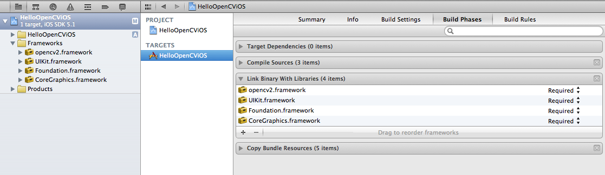
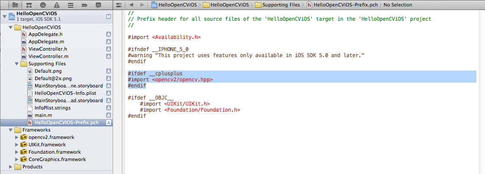
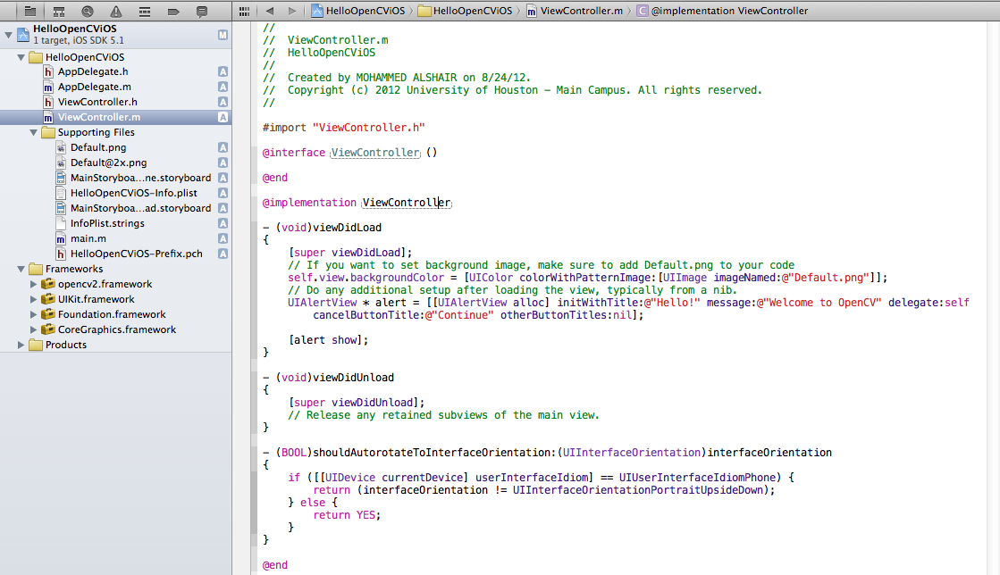
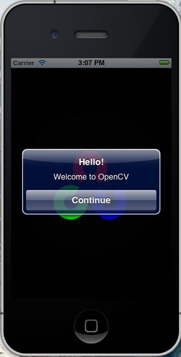

.. _OpenCViOSHelloWorld:

OpenCV iOS Hello
*******************************

Goal
====

In this tutorial we will learn how to:

.. container:: enumeratevisibleitemswithsquare

   *  Link OpenCV framework with Xcode
   *  How to write simple Hello World application using OpenCV and Xcode.

*Linking OpenCV iOS*
======================
Follow this step by step guide to link OpenCV to iOS.

1. Create a new XCode project.

2. Now we need to link *opencv2.framework* with Xcode. Select the project Navigator in the left hand panel and click on project name.

3. Under the TARGETS click on Build Phases. Expand Link Binary With Libraries option.

4. Click on Add others and go to directory where *opencv2.framework* is located and click open

5. Now you can start writing your application.

*Hello OpenCV iOS Application*
===============================

Now we will learn how to write a simple Hello World Application in Xcode using OpenCV.

.. container:: enumeratevisibleitemswithsquare

   * Link your project with OpenCV as shown in previous section.
   * Open the file named *NameOfProject-Prefix.pch* ( replace NameOfProject with name of your project) and add the following lines of code.

.. code-block:: cpp

        #ifdef __cplusplus
        #import <opencv2/opencv.hpp>
        #endif

.. container:: enumeratevisibleitemswithsquare

   * Add the following lines of code to viewDidLoad method in ViewController.m.
.. code-block:: cpp

    UIAlertView * alert = [[UIAlertView alloc] initWithTitle:@"Hello!" message:@"Welcome to OpenCV" delegate:self cancelButtonTitle:@"Continue" otherButtonTitles:nil];
    [alert show];

.. container:: enumeratevisibleitemswithsquare

   * You are good to run the project.

*Output*
=========

*Changes for XCode5+ and iOS8+*
===============================

With the newer XCode and iOS versions you need to watch out for some specific details

.. container:: enumerateattentionpoints

   * The ``*.m`` file in your project should be renamed to ``*.mm``.
   * You have to manually include AssetsLibrary.framework into your project, which is not done anymore by default.
