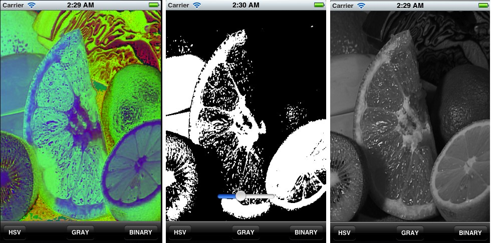

.. _OpenCViOSImageManipulation:

OpenCV iOS - Image Processing
*******************************

Goal
====

In this tutorial we will learn how to do basic image processing using OpenCV in iOS.

*Introduction*
==============

In *OpenCV* all the image processing operations are done on *Mat*. iOS uses UIImage object to display image. One of the thing is to convert UIImage object to Mat object. Below is the code to convert UIImage to Mat.

.. code-block:: cpp

   - (cv::Mat)cvMatFromUIImage:(UIImage *)image
   {
     CGColorSpaceRef colorSpace = CGImageGetColorSpace(image.CGImage);
     CGFloat cols = image.size.width;
     CGFloat rows = image.size.height;

     cv::Mat cvMat(rows, cols, CV_8UC4); // 8 bits per component, 4 channels

     CGContextRef contextRef = CGBitmapContextCreate(cvMat.data,                 // Pointer to  data
                                                    cols,                       // Width of bitmap
                                                    rows,                       // Height of bitmap
                                                    8,                          // Bits per component
                                                    cvMat.step[0],              // Bytes per row
                                                    colorSpace,                 // Colorspace
                                                    kCGImageAlphaNoneSkipLast |
                                                    kCGBitmapByteOrderDefault); // Bitmap info flags

     CGContextDrawImage(contextRef, CGRectMake(0, 0, cols, rows), image.CGImage);
     CGContextRelease(contextRef);
     CGColorSpaceRelease(colorSpace);

     return cvMat;
   }

.. code-block:: cpp

   - (cv::Mat)cvMatGrayFromUIImage:(UIImage *)image
   {
     CGColorSpaceRef colorSpace = CGImageGetColorSpace(image.CGImage);
     CGFloat cols = image.size.width;
     CGFloat rows = image.size.height;

     cv::Mat cvMat(rows, cols, CV_8UC1); // 8 bits per component, 1 channels

     CGContextRef contextRef = CGBitmapContextCreate(cvMat.data,                 // Pointer to data
                                                    cols,                       // Width of bitmap
                                                    rows,                       // Height of bitmap
                                                    8,                          // Bits per component
                                                    cvMat.step[0],              // Bytes per row
                                                    colorSpace,                 // Colorspace
                                                    kCGImageAlphaNoneSkipLast |
                                                    kCGBitmapByteOrderDefault); // Bitmap info flags

     CGContextDrawImage(contextRef, CGRectMake(0, 0, cols, rows), image.CGImage);
     CGContextRelease(contextRef);
     CGColorSpaceRelease(colorSpace);

     return cvMat;
    }

Once we obtain the Mat Object. We can do all our processing on Mat object, similar to cpp. For example if we want to convert image to gray, we can do it via below code.

.. code-block:: cpp

    cv::Mat greyMat;
    cv::cvtColor(inputMat, greyMat, CV_BGR2GRAY);

After the processing we need to convert it back to UIImage.

.. code-block:: cpp

   -(UIImage *)UIImageFromCVMat:(cv::Mat)cvMat
   {
     NSData *data = [NSData dataWithBytes:cvMat.data length:cvMat.elemSize()*cvMat.total()];
     CGColorSpaceRef colorSpace;

     if (cvMat.elemSize() == 1) {
         colorSpace = CGColorSpaceCreateDeviceGray();
     } else {
         colorSpace = CGColorSpaceCreateDeviceRGB();
     }

     CGDataProviderRef provider = CGDataProviderCreateWithCFData((__bridge CFDataRef)data);

     // Creating CGImage from cv::Mat
     CGImageRef imageRef = CGImageCreate(cvMat.cols,                                 //width
                                        cvMat.rows,                                 //height
                                        8,                                          //bits per component
                                        8 * cvMat.elemSize(),                       //bits per pixel
                                        cvMat.step[0],                            //bytesPerRow
                                        colorSpace,                                 //colorspace
                                        kCGImageAlphaNone|kCGBitmapByteOrderDefault,// bitmap info
                                        provider,                                   //CGDataProviderRef
                                        NULL,                                       //decode
                                        false,                                      //should interpolate
                                        kCGRenderingIntentDefault                   //intent
                                        );

     // Getting UIImage from CGImage
     UIImage *finalImage = [UIImage imageWithCGImage:imageRef];
     CGImageRelease(imageRef);
     CGDataProviderRelease(provider);
     CGColorSpaceRelease(colorSpace);

     return finalImage;
    }

*Output*
==================================

Check out an instance of running code with more Image Effects on `YouTube <http://www.youtube.com/watch?v=Ko3K_xdhJ1I>`_ .

.. raw:: html

  

 <iframe width="560" height="350" src="http://www.youtube.com/embed/Ko3K_xdhJ1I" frameborder="0" allowfullscreen></iframe>
  

