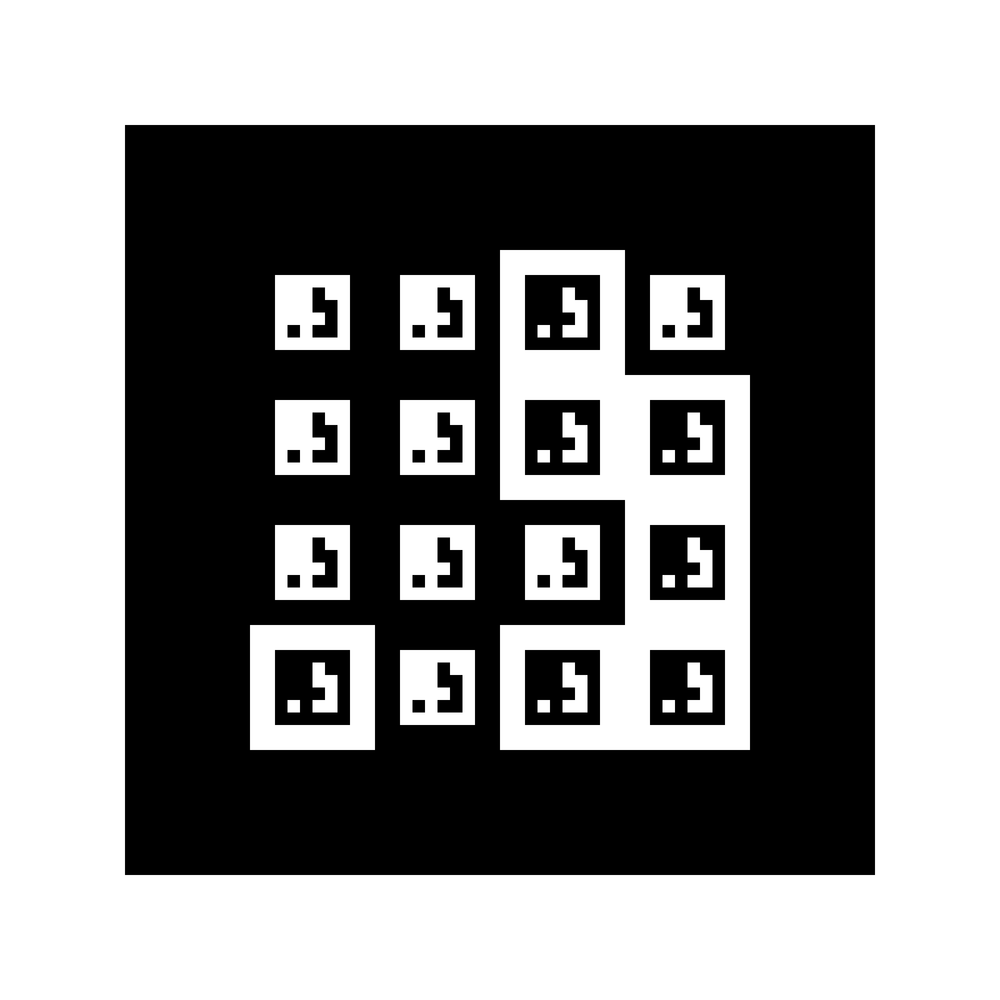

Detection of ArUco2 RArUco Markers {#tutorial_aruco2_raruco}
===================================

@prev_tutorial{tutorial_aruco2_fractals}
@next_tutorial{tutorial_aruco2_pose}

|    |    |
| -: | :- |
| Original author | Rafael Muñoz-Salinas |
| Compatibility    | OpenCV >= 5.0.0 |

RArUco markers (@cite MunozSalinas2026RArUco) are recursive fiducial markers designed specifically for long-range target tracking and UAV landing operations. A single marker ID is recursively nested within its own bit cells, maintaining identifier consistency across vastly different camera distances.

Benefits of RArUco Markers
--------------------------

- **Single Identifier Across Scales**: Unlike conventional marker boards, RArUco markers maintain the same marker ID at both extreme long range (outer marker) and very close range (inner nested markers).
- **Occlusion Tolerance**: Useful for drone landing applications where the central area of the marker may be covered or occluded by landing gear or payloads.
- **Continuous Pose Estimation**: As the camera approaches the target, smaller inner markers remain visible and usable for pose estimation even when the outer border leaves the frame.

RArUco Creation
---------------

Generate a RArUco marker image using `cv::aruco2::getRArucoMarkerImage()`.

@snippet samples/cpp/tutorial_code/objdetect/aruco2/aruco2_raruco.cpp create_raruco

The parameters are:
- `img`: Output grayscale image (`cv::Mat`).
- `dictionary`: Dictionary type used for marker encoding (e.g. `DICT_APRILTAG_16h5`).
- `id`: Marker ID.
- `depth`: Recursion level (depth >= 1).
- `bitSize`: Pixel size per bit cell.
- `innerBorders`: Separation bits between nested levels.
- `externalBorder`: If true, draws the outer white border surrounding the marker.

RArUco Detection
----------------

Detect RArUco markers using `cv::aruco2::detectRArucoMarkers()`.

@snippet samples/cpp/tutorial_code/objdetect/aruco2/aruco2_raruco.cpp detect_raruco

`detectRArucoMarkers()` automatically configures grid bit sampling (`gridBitSampling = true`) and dual color mode (`detectColorMode = 2`) to reliably decode nested bit borders and inverted inner cells across scales.

Drawing Detected RArUco Markers
-------------------------------

Visualize the detected RArUco markers using `cv::aruco2::drawFiducialMarkers()`.

@snippet samples/cpp/tutorial_code/objdetect/aruco2/aruco2_raruco.cpp draw_raruco
