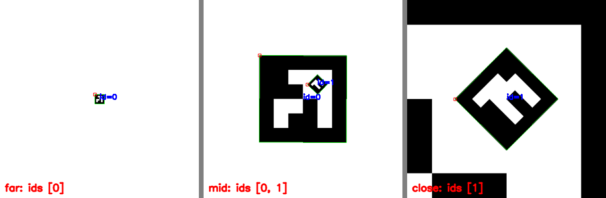
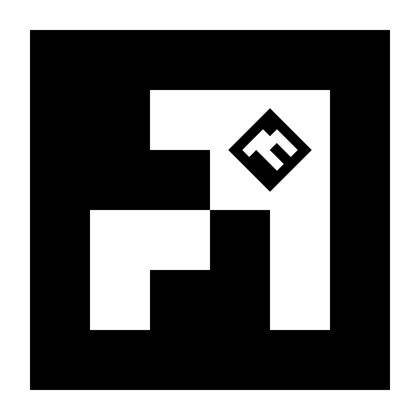
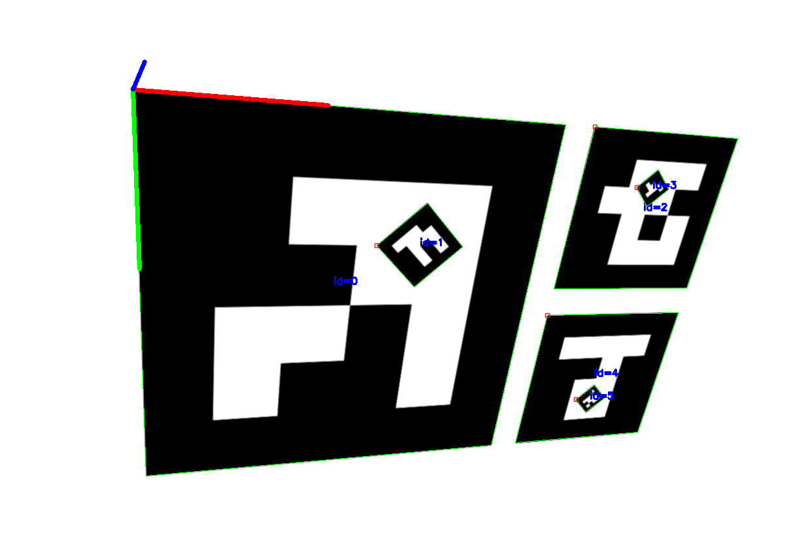

Detection of Nested ArUco Markers {#tutorial_aruco_nested_detection}
=================================

@prev_tutorial{tutorial_charuco_diamond_detection}
@next_tutorial{tutorial_aruco_calibration}

|    |    |
| -: | :- |
| Original author | Jonas Perolini |
| Compatibility   | OpenCV >= 4.7.0 |

Why nested markers
------------------

A fiducial marker of a single size has a bounded working range: a large marker is identifiable
from far away but stops fitting the camera view up close, a small one only works near the
camera. Nested markers solve this by printing a small marker inside a cell block of a large one,
so that some marker is always detectable as the camera approaches the target.

A cell that contains a nested marker is neither black nor white, which is why nested markers
require a `cv::aruco::DICT_ENCODING_CELL_RATIO` dictionary: each cell stores its expected
white pixel ratio in percent, and identification uses
`|observed - expected| <= validBitIdThreshold` per cell, exactly like binary markers.

Ratio dictionaries are a general concept: any composed marker can be described this way, and you
can build your own (see "Custom composed markers" at the end). This tutorial uses one specific,
ready-to-use implementation: the predefined nested pair dictionaries. It walks through the full
workflow:

1. pick a dictionary and print a marker,
2. detect it with your camera,
3. estimate its pose, alone or combined into a board.

The pairing rules
-----------------

The predefined nested dictionaries follow four rules. Everything else (detection, boards, pose)
is standard ArUco:

1. **Even ids are outer markers, odd ids are inner markers, and consecutive ids form one
   physical pair**: the printed marker of pair `k` shows outer id `2k` with inner id `2k + 1`
   nested inside it.
2. The outer pattern contains **exactly one uniform 2x2 cell block, always white**.
3. The inner marker is printed **rotated 45 degrees**, centered on the corner point shared by
   the block's 4 cells. Its half diagonal spans 0.7 outer cells, which makes the inner marker
   about 6 times smaller than the outer one.
4. Both patterns have **at least 4 cells of each color**, so plain bright or dark quads never
   resemble a marker.

Because of rule 2, the printed image is fully determined by the dictionary content: the image
generator only needs to locate the single white block and place the rotated inner marker there.
There is no extra layout information to store or communicate.

Three predefined dictionaries are available. As always, pick the smallest one that fits your
number of physical targets, it gives the largest safety margins:

| dictionary | pairs | ids | min separation distance |
| :- | :- | :- | :- |
| `cv::aruco::DICT_4X4_NESTED_5`  | 5  | 0..9  | 4 |
| `cv::aruco::DICT_4X4_NESTED_10` | 10 | 0..19 | 3 |
| `cv::aruco::DICT_4X4_NESTED_24` | 24 | 0..47 | 2 |

Custom sizes can be generated with `cv::aruco::generateNestedDictionary()`. The "Details"
section below explains how the separation distance is computed and why it prevents confusion.

Step 1: create and print the markers
------------------------------------

@code{.cpp}
#include <opencv2/objdetect/aruco_detector.hpp>

cv::aruco::Dictionary dictionary = cv::aruco::getPredefinedDictionary(cv::aruco::DICT_4X4_NESTED_10);
cv::Mat marker;
cv::aruco::generateImageMarkerNested(dictionary, 0, 1200, marker);  // outer id 0, inner id 1
cv::imwrite("pair_0.png", marker);
@endcode

Or in Python:

@code{.py}
import cv2 as cv
dictionary = cv.aruco.getPredefinedDictionary(cv.aruco.DICT_4X4_NESTED_10)
marker = cv.aruco.generateImageMarkerNested(dictionary, 0, 1200)
cv.imwrite("pair_0.png", marker)
@endcode

Printing checklist:

1. Print the image at 20 cm or more. The inner marker is about 6 times smaller than the outer one, so it ends up around 3.3 cm wide.
2. Keep a white margin of at least one cell (1/6 of the marker side) around the marker.

Step 2: detect with your camera
-------------------------------

Only one detector parameter changes: `cv::aruco::DetectorParameters::detectNestedMarkers`. It
keeps markers that are found inside other markers instead of discarding them.

@code{.cpp}
cv::VideoCapture cap(0);
cv::aruco::DetectorParameters params;
params.detectNestedMarkers = true;
cv::aruco::ArucoDetector detector(dictionary, params);

cv::Mat frame;
while (cap.read(frame)) {
    std::vector<std::vector<cv::Point2f>> corners, rejected;
    std::vector<int> ids;
    detector.detectMarkers(frame, corners, ids, rejected);
    cv::aruco::drawDetectedMarkers(frame, corners, ids);
    cv::imshow("nested markers", frame);
    if (cv::waitKey(1) == 27) break;
}
@endcode

Or in Python:

@code{.py}
cap = cv.VideoCapture(0)
params = cv.aruco.DetectorParameters()
params.detectNestedMarkers = True
detector = cv.aruco.ArucoDetector(dictionary, params)

while True:
    ok, frame = cap.read()
    if not ok:
        break
    corners, ids, rejected = detector.detectMarkers(frame)
    cv.aruco.drawDetectedMarkers(frame, corners, ids)
    cv.imshow("nested markers", frame)
    if cv.waitKey(1) == 27:
        break
@endcode

Point the camera at your print. From across the room you should see id 0. Walk closer and id 1
appears next to it. Very close, only id 1 remains. All other parameters keep their defaults.

Step 3: estimate the pose
-------------------------

Each detected marker returns its four corners, so each one is a pose landmark on its own. To use
them together, put both markers of a pair in one `cv::aruco::Board`.
`cv::aruco::getNestedMarkerObjectPoints()` returns their corners in a common frame: origin at the
outer marker top left corner, x right, y down, z = 0.

The code below assumes `cameraMatrix` and `distCoeffs` (Python: `camera_matrix` and `dist_coeffs`)
come from your camera calibration.

@code{.cpp}
float sideLength = 0.20f;  // printed outer side in meters
cv::Mat outerPts, innerPts;
cv::aruco::getNestedMarkerObjectPoints(dictionary, 0, sideLength, outerPts, innerPts);
cv::aruco::Board board(std::vector<cv::Mat>{outerPts, innerPts}, dictionary,
                       std::vector<int>{0, 1});

while (cap.read(frame)) {
    std::vector<std::vector<cv::Point2f>> corners, rejected;
    std::vector<int> ids;
    detector.detectMarkers(frame, corners, ids, rejected);
    cv::aruco::drawDetectedMarkers(frame, corners, ids);

    if (!ids.empty()) {
        cv::Mat objPoints, imgPoints;
        board.matchImagePoints(corners, ids, objPoints, imgPoints);

        if (objPoints.total() >= 4) {
            cv::Mat rvec, tvec;
            bool ok = cv::solvePnP(objPoints, imgPoints, cameraMatrix, distCoeffs, rvec, tvec);

            if (ok) {
                cv::drawFrameAxes(frame, cameraMatrix, distCoeffs, rvec, tvec, sideLength * 0.5f);
            }
        }
    }

    cv::imshow("nested marker pose", frame);
    if (cv::waitKey(1) == 27) break;
}
@endcode

Or in Python:

@code{.py}
import numpy as np

side_length = 0.20  # printed outer side in meters
outer_pts, inner_pts = cv.aruco.getNestedMarkerObjectPoints(dictionary, 0, side_length)
board = cv.aruco.Board([outer_pts, inner_pts], dictionary, np.array([0, 1]))

while True:
    ok, frame = cap.read()
    if not ok:
        break
    corners, ids, rejected = detector.detectMarkers(frame)
    cv.aruco.drawDetectedMarkers(frame, corners, ids)

    if ids is not None:
        obj_points, img_points = board.matchImagePoints(corners, ids)

        if len(obj_points) >= 4:
            ok, rvec, tvec = cv.solvePnP(obj_points, img_points, camera_matrix, dist_coeffs)

            if ok:
                cv.drawFrameAxes(frame, camera_matrix, dist_coeffs, rvec, tvec, side_length * 0.5)

    cv.imshow("nested marker pose", frame)
    if cv.waitKey(1) == 27:
        break
@endcode

`matchImagePoints()` uses whatever is visible: 4 points far away (outer only), 4 points up close
(inner only), 8 points in between. The pose code does not change with the distance, and the drawn
axis lets you see the fused board pose update as the visible marker changes.

Several pairs can be combined into one board. Measure where each pair sits on your object, shift
its object points accordingly and add everything to a single `cv::aruco::Board`:

Details
-------

This section explains the design. It is not needed to use the markers.

### How a marker is identified

The detector warps each square candidate to a canonical image and computes one number per cell:
the observed white pixel ratio `o`, between 0 and 1. A cell matches its expected value `r` when

    |o - r| <= T          with T = DetectorParameters::validBitIdThreshold (default 0.49)

The candidate is accepted for a dictionary entry when at most `c` cells mismatch, where
`c = maxCorrectionBits * errorCorrectionRate`. Binary markers are the special case where every
`r` is 0 or 1.

### The separation distance

Could one candidate match two different entries? Given a single cell with expected values `r`
(entry A) and `r'` (entry B). Suppose one observation `o` matches both. Then `|o - r| <= T` and
`|o - r'| <= T`. The difference between the two expected values can be defined as:

    |r - r'| = |(r - o) + (o - r')| <= |r - o| + |o - r'| <= T + T = 2T

The first step is the triangle inequality: a sum can never be larger in absolute value than the
sum of the absolute values. So if two expected values are further apart than `2T`, no single
observation can match both. Such a cell is called **separating**. The bound is tight: if
`|r - r'| <= 2T`, the observation in the middle of `r` and `r'` matches both.

The **separation distance** `D` between two entries is the number of separating cells, taking
the minimum over the 4 relative rotations, because the detector tries all 4 rotations of a
candidate. Every separating cell forces at least one error on A or on B, so a candidate accepted
by both entries would need `errors_A + errors_B >= D` while acceptance allows at most `c` errors
each. Therefore

    D >= 2c + 1   =>   no observation is ever accepted for both entries.

This is the quantity in the dictionary table above. `generateNestedDictionary()` enforces it
between all entries, and between each entry and its own rotations so the orientation is never
ambiguous. For binary markers `D` is the Hamming distance.

### Host cells and range behavior

The inner marker covers a corner triangle of each of the 4 host cells. Its size is set by
`innerHalfDiagonal`, the half diagonal of the inner marker square in outer cell units: rotated 45
degrees, the diagonals align with the cell grid and the covered triangle has area
`innerHalfDiagonal^2 / 2`. With the default 0.7 that is at most `0.245` of the cell, so a host
cell always stays within 25% of its color. A lower cell tempering of the host by the inner
marker leads to a higher detection rate of the host marker; the bound `sqrt(0.5)` on
`innerHalfDiagonal` keeps the tempering at or below a quarter of the cell.

### Orientation and corner order

`detectMarkers()` always returns the four corners in the marker's canonical order: corner 0 is
the top left corner of the marker as defined in the dictionary, whatever the rotation in the
image. For the inner marker, which is printed rotated 45 degrees, the canonical corners map to
the vertices of the rotated square: corner 0 is the left vertex, then top, right and bottom.
`getNestedMarkerObjectPoints()` returns them in exactly this order, so detected corners and
object points always correspond one to one.

### False positives

A false positive is a random square in the scene (a window, a screen, a
picture frame) that gets accepted as a marker. Host cells accept a wider range of observations than binary cells, so nested dictionaries are more exposed to false positives than a binary dictionary of the same size. In practice: keep the dictionary small. Every pattern in the predefined dictionaries also keeps at least 4 cells of each color, so plain bright or dark quads never come close to a valid marker.

You can also tighten `validBitIdThreshold` from its default 0.49 to 0.4, which narrows what each
cell accepts and rejects more false positives. The predefined dictionaries keep working:
lowering the threshold only makes cells more selective, so the separation guarantees cannot
weaken, and host cells stay within 0.25 of their color, below the threshold with margin.

### Custom composed markers

`cv::aruco::Dictionary::getCellRatiosFromImage()` measures the white ratio of each cell of any
canonical marker image. Use it to build cell-ratio dictionaries for your own composed markers:
render or scan the marker, measure the ratios, and pass them to
`cv::aruco::Dictionary::getRatioListFromCellRatios()`.
