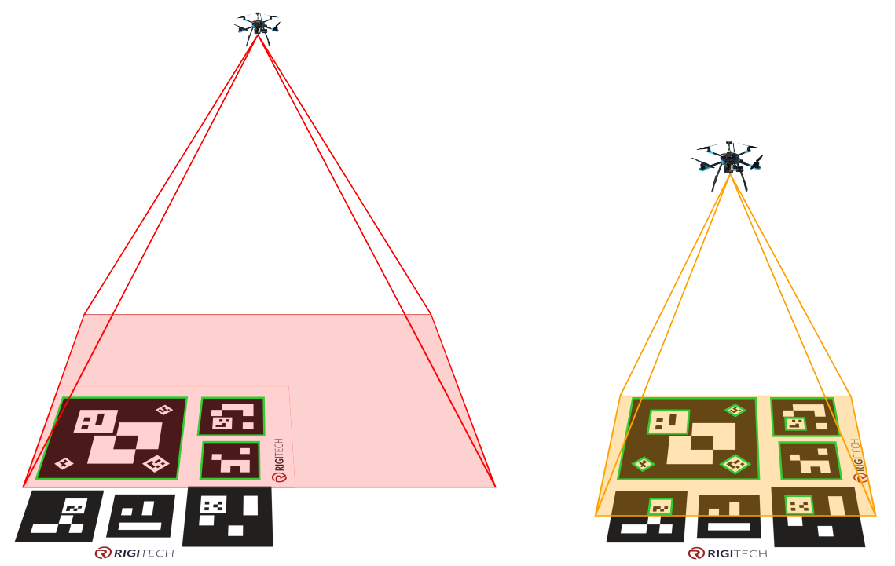
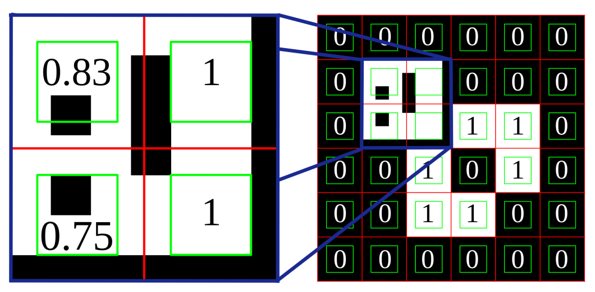
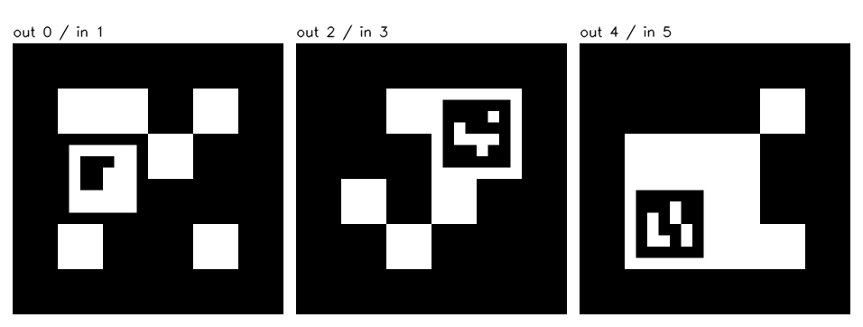
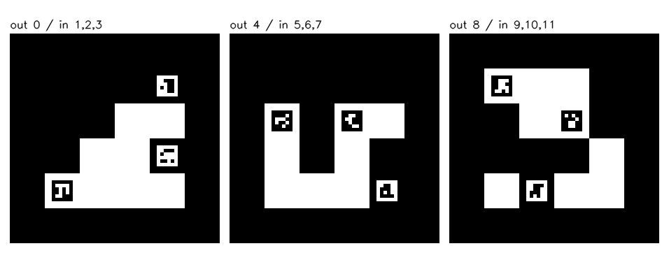

Detection of Nested ArUco Markers {#tutorial_aruco_nested_detection}
=================================

@prev_tutorial{tutorial_charuco_diamond_detection}
@next_tutorial{tutorial_aruco_calibration}

|    |    |
| -: | :- |
| Original author | Jonas Perolini |
| Compatibility   | OpenCV >= 4.14.0 |

Why nested markers
------------------

A fiducial marker of a single size has a bounded working range: a large marker is identifiable
from far away but stops fitting the camera view up close, a small one only works near the
camera. Nested markers solve this by printing a small marker inside a cell block of a large one,
so that some marker is always detectable as the camera approaches the target.

One common use case is autonomous landing, or any rendezvous where the camera moves toward a known target. From far away the drone sees the large marker. As it gets closer, the inner markers start being detected. In the final approach, the small inner markers keep the target visible.

Non-binary dictionaries
------------------

A cell from the host marker that contains an inner marker is neither black nor white, which is why nested markers
require a `cv::aruco::DICT_ENCODING_CELL_RATIO` dictionary: each cell stores its expected
white pixel ratio in percent, and identification uses
`|observed - expected| <= validBitIdThreshold` per cell, exactly like binary markers.

Ratio dictionaries are a general concept: any composed marker can be described this way, and you
can build your own (see "Custom composed markers" at the end).

The image below shows a nested ArUco marker with an
inner inverted marker. On the right: the nested marker with its bit encoding in the
center. The cell’s separation are in red and the area considered for the identification process in green.
On the left: a zoom on the inner marker with the non-binary encoding corresponding to the ratio of
white pixels inside the margins (green squares).

Tutorial overview
-----------------

This tutorial uses one specific, ready-to-use implementation: the predefined nested pair dictionaries. It walks through the full
workflow:

1. pick a dictionary and print a marker,
2. detect it with your camera,
3. estimate its pose, alone or combined into a board.

The predefined nested dictionaries are intentionally simple. They cover one level of nesting: one inner marker inside one outer marker. The inner id is tied to the outer id (`2k` and `2k + 1`), so only pairs such as `(0, 1)`, `(2, 3)` and `(4, 5)` have generated object points in one shared frame. The predefined sets are also small by design to keep a large inner marker distance. Deeper nesting, larger marker sets and mixed combinations can still be modeled manually with a custom dictionary and a custom `cv::aruco::Board`, but the predefined helpers do not define those layouts for you.

Predefined nested pair dictionaries
-----------------

The predefined nested dictionaries follow four rules. Everything else (detection, boards, pose)
is standard ArUco:

1. **Even ids are outer markers, odd ids are inner markers, and consecutive ids form one
   physical pair**: the printed marker of pair `k` shows outer id `2k` with inner id `2k + 1`
   nested inside it.
2. The outer pattern contains **exactly one uniform 2x2 cell block, always white**.
3. The inner marker is printed **rotated 45 degrees**, centered on the corner point shared by
   the block's 4 cells. Its half diagonal spans 0.7 outer cells, which makes the inner marker
   about 6 times smaller than the outer one. The rotation allows to keep the inner marker large while changing only small corner triangles of the outer marker cells.
4. Both patterns have **at least 4 cells of each color**, so plain bright or dark quads never
   resemble a marker.

Because of rule 2, the printed image is fully determined by the dictionary content: the image
generator only needs to locate the single white block and place the rotated inner marker there.
There is no extra layout information to store or communicate.

Three predefined dictionaries are available. Pick the smallest one that fits your
number of physical targets, it gives the largest safety margins:

| dictionary | pairs | ids | min separation distance |
| :- | :- | :- | :- |
| `cv::aruco::DICT_4X4_NESTED_5`  | 5  | 0..9  | 4 |
| `cv::aruco::DICT_4X4_NESTED_10` | 10 | 0..19 | 3 |
| `cv::aruco::DICT_4X4_NESTED_24` | 24 | 0..47 | 2 |

Custom sizes can be generated with `cv::aruco::generateNestedDictionary()`. The "Details"
section below explains how the separation distance is computed and why it prevents inter-marker confusion. The image below shows the markers composing the `cv::aruco::DICT_4X4_NESTED_10` predefined dictionary.

Step 1: create and print the markers
------------------------------------

@code{.cpp}
#include <opencv2/objdetect/aruco_detector.hpp>

cv::aruco::Dictionary dictionary = cv::aruco::getPredefinedDictionary(cv::aruco::DICT_4X4_NESTED_10);
cv::Mat marker;
cv::aruco::generateImageMarkerNested(dictionary, 0, 1200, marker);  // outer id 0, inner id 1
cv::imwrite("pair_0.png", marker);
@endcode

Or in Python:

@code{.py}
import cv2 as cv
dictionary = cv.aruco.getPredefinedDictionary(cv.aruco.DICT_4X4_NESTED_10)
marker = cv.aruco.generateImageMarkerNested(dictionary, 0, 1200)
cv.imwrite("pair_0.png", marker)
@endcode

Printing checklist:

1. Print the image at 20 cm or more. The inner marker is about 6 times smaller than the outer one, so it ends up around 3.3 cm wide.
2. Keep a white margin of at least one cell (1/6 of the marker side) around the marker.

Step 2: detect with your camera
-------------------------------

Only one detector parameter changes: `cv::aruco::DetectorParameters::detectNestedMarkers`. It
keeps markers that are found inside other markers instead of discarding them.

@code{.cpp}
cv::VideoCapture cap(0);
cv::aruco::DetectorParameters params;
params.detectNestedMarkers = true;
cv::aruco::ArucoDetector detector(dictionary, params);

cv::Mat frame;
while (cap.read(frame)) {
    std::vector<std::vector<cv::Point2f>> corners, rejected;
    std::vector<int> ids;
    detector.detectMarkers(frame, corners, ids, rejected);
    cv::aruco::drawDetectedMarkers(frame, corners, ids);
    cv::imshow("nested markers", frame);
    if (cv::waitKey(1) == 27) break;
}
@endcode

Or in Python:

@code{.py}
cap = cv.VideoCapture(0)
params = cv.aruco.DetectorParameters()
params.detectNestedMarkers = True
detector = cv.aruco.ArucoDetector(dictionary, params)

while True:
    ok, frame = cap.read()
    if not ok:
        break
    corners, ids, rejected = detector.detectMarkers(frame)
    cv.aruco.drawDetectedMarkers(frame, corners, ids)
    cv.imshow("nested markers", frame)
    if cv.waitKey(1) == 27:
        break
@endcode

Point the camera at your print. From across the room you should see id 0. Walk closer and id 1
appears next to it. Very close, only id 1 remains. All other parameters keep their defaults.

Step 3: estimate the pose
-------------------------

Each detected marker returns its four corners, so each one is a pose landmark on its own. To use
them together, put both markers of a pair in one `cv::aruco::Board`.
`cv::aruco::getNestedMarkerObjectPoints()` returns their corners in a common frame: origin at the
outer marker top left corner, x right, y down, z = 0.

The code below assumes `cameraMatrix` and `distCoeffs` (Python: `camera_matrix` and `dist_coeffs`)
come from your camera calibration.

@code{.cpp}
float sideLength = 0.20f;  // printed outer side in meters
cv::Mat outerPts, innerPts;
cv::aruco::getNestedMarkerObjectPoints(dictionary, 0, sideLength, outerPts, innerPts);
cv::aruco::Board board(std::vector<cv::Mat>{outerPts, innerPts}, dictionary,
                       std::vector<int>{0, 1});

while (cap.read(frame)) {
    std::vector<std::vector<cv::Point2f>> corners, rejected;
    std::vector<int> ids;
    detector.detectMarkers(frame, corners, ids, rejected);
    cv::aruco::drawDetectedMarkers(frame, corners, ids);

    if (!ids.empty()) {
        cv::Mat objPoints, imgPoints;
        board.matchImagePoints(corners, ids, objPoints, imgPoints);

        if (objPoints.total() >= 4) {
            cv::Mat rvec, tvec;
            bool ok = cv::solvePnP(objPoints, imgPoints, cameraMatrix, distCoeffs, rvec, tvec);

            if (ok) {
                cv::drawFrameAxes(frame, cameraMatrix, distCoeffs, rvec, tvec, sideLength * 0.5f);
            }
        }
    }

    cv::imshow("nested marker pose", frame);
    if (cv::waitKey(1) == 27) break;
}
@endcode

Or in Python:

@code{.py}
import numpy as np

side_length = 0.20  # printed outer side in meters
outer_pts, inner_pts = cv.aruco.getNestedMarkerObjectPoints(dictionary, 0, side_length)
board = cv.aruco.Board([outer_pts, inner_pts], dictionary, np.array([0, 1]))

while True:
    ok, frame = cap.read()
    if not ok:
        break
    corners, ids, rejected = detector.detectMarkers(frame)
    cv.aruco.drawDetectedMarkers(frame, corners, ids)

    if ids is not None:
        obj_points, img_points = board.matchImagePoints(corners, ids)

        if len(obj_points) >= 4:
            ok, rvec, tvec = cv.solvePnP(obj_points, img_points, camera_matrix, dist_coeffs)

            if ok:
                cv.drawFrameAxes(frame, camera_matrix, dist_coeffs, rvec, tvec, side_length * 0.5)

    cv.imshow("nested marker pose", frame)
    if cv.waitKey(1) == 27:
        break
@endcode

`matchImagePoints()` uses whatever is visible: 4 points far away (outer only), 4 points up close
(inner only), 8 points in between. The pose code does not change with the distance, and the drawn
axis lets you see the fused board pose update as the visible marker changes.

Several pairs can be combined into one board. Measure where each pair sits on your object, shift
its object points accordingly and add everything to a single `cv::aruco::Board`:

Details
-------

This section explains the design. It is not needed to use the markers.

### How a marker is identified

The detector warps each square candidate to a canonical image and computes one number per cell:
the observed white pixel ratio `o`, between 0 and 1. A cell matches its expected value `r` when

    |o - r| <= T          with T = DetectorParameters::validBitIdThreshold (default 0.49)

The candidate is accepted for a dictionary entry when at most `c` cells mismatch, where
`c = maxCorrectionBits * errorCorrectionRate`. Binary markers are the special case where every
`r` is 0 or 1.

### The separation distance

Could one candidate match two different entries? Take one cell whose expected value is `r1` for entry A and `r2` for entry B. If one observation `o` matches both entries, both tests are true:

    |o - r1| <= T
    |o - r2| <= T

The difference between the two expected values is bounded by:

    |r1 - r2| = |(r1 - o) + (o - r2)|
              <= |r1 - o| + |o - r2|
              <= T + T
              = 2T

The middle step is the triangle inequality: a sum can never be larger in absolute value than the
sum of the absolute values. So if two expected values are further apart than `2T`, no single
observation can match both. Such a cell is called **separating**. When
the two expected values are at most `2T` apart, an observation halfway between them matches both entries.

The **separation distance** `D` between two entries is the number of separating cells, taking
the minimum over the 4 relative rotations, because the detector tries all 4 rotations of a
candidate. Every separating cell forces at least one error on A or on B, so a candidate accepted
by both entries would need `errors_A + errors_B >= D` while acceptance allows at most `c` errors
each. Therefore

    D >= 2c + 1   =>   no observation is ever accepted for both entries.

This is the quantity in the dictionary table above. `generateNestedDictionary()` enforces it
between all entries, and between each entry and its own rotations so the orientation is never
ambiguous. For binary markers `D` is the Hamming distance.

### Host cells and range behavior

The inner marker covers a corner triangle of each of the 4 host cells. Its size is set by
`innerHalfDiagonal`, the half diagonal of the inner marker square in outer cell units: rotated 45
degrees, the diagonals align with the cell grid and the covered triangle has area
`innerHalfDiagonal^2 / 2`. With the default 0.7 that is at most `0.245` of the cell, so a host
cell always stays within 25% of its color. A lower cell tempering of the host by the inner
marker leads to a higher detection rate of the host marker; the bound `sqrt(0.5)` on
`innerHalfDiagonal` keeps the tempering at or below a quarter of the cell.

### Orientation and corner order

`detectMarkers()` always returns the four corners in the marker's canonical order: corner 0 is
the top left corner of the marker as defined in the dictionary, whatever the rotation in the
image. For the inner marker, which is printed rotated 45 degrees, the canonical corners map to
the vertices of the rotated square: corner 0 is the left vertex, then top, right and bottom.
`getNestedMarkerObjectPoints()` returns them in exactly this order, so detected corners and
object points always correspond one to one.

### False positives

A false positive is a random square in the scene (a window, a screen, a
picture frame) that gets accepted as a marker. Host cells accept a wider range of observations than binary cells, so nested dictionaries are more exposed to false positives than a binary dictionary of the same size. In practice: keep the dictionary small. Every pattern in the predefined dictionaries also keeps at least 4 cells of each color, so plain bright or dark quads never come close to a valid marker.

You can also tighten `validBitIdThreshold` from its default 0.49 to 0.4, which narrows what each
cell accepts and rejects more false positives. The predefined dictionaries keep working:
lowering the threshold only makes cells more selective, so the separation guarantees cannot
weaken, and host cells stay within 0.25 of their color, below the threshold with margin.

### Custom composed markers

`cv::aruco::Dictionary::getCellRatiosFromImage()` measures the white ratio of each cell of any
canonical marker image. Use it to build cell-ratio dictionaries for your own composed markers:
render or scan the marker, measure the ratios, and pass them to
`cv::aruco::Dictionary::getRatioListFromCellRatios()`.

The following example creates two small custom dictionaries, each with 3 printable nested
markers. In the
billboard design each printable marker has one inner marker. In the constellation design each
printable marker has several inner markers.

- **Billboard**: one child marker is printed axis-aligned inside a 2x2 cell block.
- **Constellation**: several child markers are printed in selected single cells.

The rendering code is only one possible design. The important OpenCV part is step 3: measure the
cell ratios from your generated marker images and build a `DICT_ENCODING_CELL_RATIO` dictionary.
For real dictionaries, also check the distance between inner markers and avoid very plain patterns. A simple first filter for 4x4 binary markers is to keep at least 4 cells of each color.

#### Step 1: define the custom rules

@code{.py}
import cv2 as cv
import numpy as np
from pathlib import Path

N = 4
BORDER = 1
PX = 160

def bits_from(rows):
    return np.array([[1 if c == "1" else 0 for c in row] for row in rows], np.uint8)

BILLBOARD_MARKERS = [
    dict(outer=["1101", "0010", "0000", "1001"], inner=["1110", "1100", "1100", "0000"],
         block=(0, 1), quiet_ring_is_white=False),
    dict(outer=["0111", "0011", "1010", "0100"], inner=["0001", "1000", "1111", "0010"],
         block=(2, 0), quiet_ring_is_white=True),
    dict(outer=["0001", "1110", "1110", "1111"], inner=["0010", "1010", "1001", "1101"],
         block=(0, 2), quiet_ring_is_white=True),
]

CONSTELLATION_MARKERS = [
    dict(outer=["0000", "0011", "0110", "1111"],
         children=[(["0111", "1000", "0000", "1101"], (3, 2)),
                   (["0111", "0011", "1011", "0011"], (3, 0)),
                   (["1111", "0101", "0101", "1100"], (0, 3))]),
    dict(outer=["0000", "1011", "1010", "1110"],
         children=[(["0001", "1110", "1001", "0010"], (0, 1)),
                   (["0110", "1100", "0100", "0011"], (2, 1)),
                   (["0110", "1110", "1010", "1111"], (3, 3))]),
    dict(outer=["1110", "0110", "0001", "1011"],
         children=[(["1010", "0001", "0110", "0110"], (2, 1)),
                   (["0111", "0110", "1110", "1010"], (1, 3)),
                   (["0111", "0110", "0111", "1101"], (0, 0))]),
]
@endcode

#### Step 2: generate marker images

@code{.py}

def render_binary(bits, px=PX):
    full = np.zeros((N + 2 * BORDER, N + 2 * BORDER), np.uint8)
    full[BORDER:BORDER + N, BORDER:BORDER + N] = bits
    return np.kron(full, np.full((px, px), 255, np.uint8))

def render_billboard_marker(outer_bits, block, quiet_ring_is_white, inner_image, px=PX, gap=0.25):
    image = render_binary(outer_bits, px)
    bx, by = block
    x0 = (BORDER + bx) * px
    y0 = (BORDER + by) * px
    image[y0:y0 + 2 * px, x0:x0 + 2 * px] = 255 if quiet_ring_is_white else 0

    child = inner_image.copy()
    if not quiet_ring_is_white:
        child = 255 - child
    gap_px = int(round(gap * px))
    side = 2 * px - 2 * gap_px
    child = cv.resize(child, (side, side), interpolation=cv.INTER_NEAREST)
    image[y0 + gap_px:y0 + gap_px + side, x0 + gap_px:x0 + gap_px + side] = child
    return image

def render_constellation_marker(outer_bits, children, px=PX, gap=0.2):
    image = render_binary(outer_bits, px)
    gap_px = int(round(gap * px))
    side = px - 2 * gap_px

    for child_image, (hx, hy) in children:
        child = child_image.copy()
        child = cv.resize(child, (side, side), interpolation=cv.INTER_NEAREST)
        patch = child if outer_bits[hy, hx] == 1 else 255 - child
        x0 = (BORDER + hx) * px + gap_px
        y0 = (BORDER + hy) * px + gap_px
        image[y0:y0 + side, x0:x0 + side] = patch
    return image

def make_billboard_dictionary():
    dictionary_images, sheet_items = [], []
    for spec in BILLBOARD_MARKERS:
        inner = render_binary(bits_from(spec["inner"]))
        outer = render_billboard_marker(bits_from(spec["outer"]), spec["block"],
                                        spec["quiet_ring_is_white"], inner)
        out_id = len(dictionary_images)
        dictionary_images += [outer, inner]
        sheet_items.append((outer, f"out {out_id} / in {out_id + 1}"))
    return dictionary_images, sheet_items

def make_constellation_dictionary():
    dictionary_images, sheet_items = [], []
    for spec in CONSTELLATION_MARKERS:
        outer_bits = bits_from(spec["outer"])
        children = [(render_binary(bits_from(rows)), host) for rows, host in spec["children"]]
        outer = render_constellation_marker(outer_bits, children)
        out_id = len(dictionary_images)
        dictionary_images.append(outer)
        dictionary_images.extend(child for child, host in children)
        child_ids = ",".join(str(i) for i in range(out_id + 1, out_id + 1 + len(children)))
        sheet_items.append((outer, f"out {out_id} / in {child_ids}"))
    return dictionary_images, sheet_items

examples_by_name = {
    "billboard": make_billboard_dictionary(),
    "constellation": make_constellation_dictionary(),
}
@endcode

#### Step 3: build the dictionary from the marker images

This is the central part. The marker renderer can be anything, as long as each image is a
canonical marker image with its border.

@code{.py}
def build_dictionary(images):
    rows = []
    for image in images:
        ratios = cv.aruco.Dictionary.getCellRatiosFromImage(image, N, BORDER)
        rows.append(cv.aruco.Dictionary.getRatioListFromCellRatios(ratios))
    return cv.aruco.Dictionary(np.concatenate(rows, axis=0), N, 0,
                               cv.aruco.DICT_ENCODING_CELL_RATIO)
@endcode

#### Step 4: write the dictionary and marker images

@code{.py}
def write_dictionary(dictionary, path):
    storage = cv.FileStorage(str(path), cv.FILE_STORAGE_WRITE)
    dictionary.writeDictionary(storage)
    storage.release()

def save_sheet(images, path):
    cols, rows = 3, 1
    tile, pad, header = 300, 14, 34
    sheet = np.full((rows * (tile + header + pad) + pad, cols * (tile + pad) + pad),
                    255, np.uint8)

    for idx, (image, label) in enumerate(images):
        row, col = 0, idx
        x0 = pad + col * (tile + pad)
        y0 = pad + row * (tile + header + pad)
        sheet[y0 + header:y0 + header + tile, x0:x0 + tile] = cv.resize(
            image, (tile, tile), interpolation=cv.INTER_AREA)
        cv.putText(sheet, label, (x0, y0 + header - 8),
                   cv.FONT_HERSHEY_SIMPLEX, 0.50, 0, 1, cv.LINE_AA)
    cv.imwrite(str(path), sheet)

out_dir = Path("custom_nested_output")
out_dir.mkdir(parents=True, exist_ok=True)

for name, (dictionary_images, sheet_items) in examples_by_name.items():
    dictionary = build_dictionary(dictionary_images)
    write_dictionary(dictionary, out_dir / f"{name}.yml")
    save_sheet(sheet_items, out_dir / f"{name}_sheet.png")
    for idx, (image, label) in enumerate(sheet_items):
        cv.imwrite(str(out_dir / f"{name}_marker_{idx}.png"), image)
@endcode

The sheets generated by the example contain 3 printable nested markers per dictionary:

#### Step 5: read and use the dictionary

Load the YAML file and draw detections from the camera stream. This example keeps the default
`validBitIdThreshold` value. For C++:

@code{.cpp}
#include <iostream>
#include <string>
#include <vector>
#include <opencv2/core.hpp>
#include <opencv2/highgui.hpp>
#include <opencv2/objdetect/aruco_detector.hpp>
#include <opencv2/videoio.hpp>

int main() {
    const std::string name = "billboard";  // or "constellation"
    const std::string dir = "custom_nested_output/";

    cv::FileStorage storage(dir + name + ".yml", cv::FileStorage::READ);
    cv::aruco::Dictionary dictionary;
    if (!storage.isOpened() || !dictionary.readDictionary(storage.root())) {
        std::cerr << "dictionary not found or invalid" << std::endl;
        return 1;
    }
    storage.release();

    cv::aruco::DetectorParameters params;
    params.detectNestedMarkers = true;
    params.detectInvertedMarker = true;
    params.errorCorrectionRate = 0.0;
    params.perspectiveRemovePixelPerCell = 20;

    cv::aruco::ArucoDetector detector(dictionary, params);
    cv::VideoCapture cap(0);
    if (!cap.isOpened()) {
        std::cerr << "could not open camera 0" << std::endl;
        return 1;
    }

    cv::Mat frame;
    while (cap.read(frame)) {
        std::vector<std::vector<cv::Point2f>> corners, rejected;
        std::vector<int> ids;
        detector.detectMarkers(frame, corners, ids, rejected);
        cv::aruco::drawDetectedMarkers(frame, corners, ids);

        cv::imshow("custom nested markers", frame);
        if (cv::waitKey(1) == 27) {
            break;
        }
    }
    return 0;
}
@endcode

Or in Python:

@code{.py}
import cv2 as cv

name = "billboard"  # or "constellation"
directory = "custom_nested_output"

storage = cv.FileStorage(f"{directory}/{name}.yml", cv.FILE_STORAGE_READ)
dictionary = cv.aruco.Dictionary()
if not storage.isOpened() or not dictionary.readDictionary(storage.root()):
    raise RuntimeError("dictionary not found or invalid")
storage.release()

params = cv.aruco.DetectorParameters()
params.detectNestedMarkers = True
params.detectInvertedMarker = True
params.errorCorrectionRate = 0.0
params.perspectiveRemovePixelPerCell = 20

detector = cv.aruco.ArucoDetector(dictionary, params)
cap = cv.VideoCapture(0)
if not cap.isOpened():
    raise RuntimeError("could not open camera 0")

while True:
    ok, frame = cap.read()
    if not ok:
        break

    corners, ids, rejected = detector.detectMarkers(frame)
    cv.aruco.drawDetectedMarkers(frame, corners, ids)

    cv.imshow("custom nested markers", frame)
    if cv.waitKey(1) == 27:
        break
@endcode
