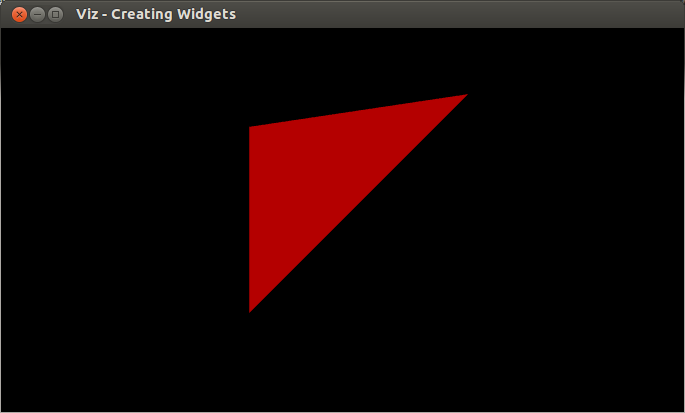

.. _creating_widgets:

Creating Widgets
****************

Goal
====

In this tutorial you will learn how to

.. container:: enumeratevisibleitemswithsquare

  * Create your own widgets using WidgetAccessor and VTK.
  * Show your widget in the visualization window.

Code
====

You can download the code from :download:`here <../../../../samples/cpp/tutorial_code/viz/creating_widgets.cpp>`.

.. code-block:: cpp

    #include <opencv2/viz.hpp>
    #include <opencv2/viz/widget_accessor.hpp>
    #include <iostream>

    #include <vtkPoints.h>
    #include <vtkTriangle.h>
    #include <vtkCellArray.h>
    #include <vtkPolyData.h>
    #include <vtkPolyDataMapper.h>
    #include <vtkIdList.h>
    #include <vtkActor.h>
    #include <vtkProp.h>

    using namespace cv;
    using namespace std;

    /**
     * @class WTriangle
     * @brief Defining our own 3D Triangle widget
     */
    class WTriangle : public viz::Widget3D
    {
        public:
            WTriangle(const Point3f &pt1, const Point3f &pt2, const Point3f &pt3, const viz::Color & color = viz::Color::white());
    };

    /**
     * @function WTriangle::WTriangle
     */
    WTriangle::WTriangle(const Point3f &pt1, const Point3f &pt2, const Point3f &pt3, const viz::Color & color)
    {
        // Create a triangle
        vtkSmartPointer<vtkPoints> points = vtkSmartPointer<vtkPoints>::New();
        points->InsertNextPoint(pt1.x, pt1.y, pt1.z);
        points->InsertNextPoint(pt2.x, pt2.y, pt2.z);
        points->InsertNextPoint(pt3.x, pt3.y, pt3.z);

        vtkSmartPointer<vtkTriangle> triangle = vtkSmartPointer<vtkTriangle>::New();
        triangle->GetPointIds()->SetId(0,0);
        triangle->GetPointIds()->SetId(1,1);
        triangle->GetPointIds()->SetId(2,2);

        vtkSmartPointer<vtkCellArray> cells = vtkSmartPointer<vtkCellArray>::New();
        cells->InsertNextCell(triangle);

        // Create a polydata object
        vtkSmartPointer<vtkPolyData> polyData = vtkSmartPointer<vtkPolyData>::New();

        // Add the geometry and topology to the polydata
        polyData->SetPoints(points);
        polyData->SetPolys(cells);

        // Create mapper and actor
        vtkSmartPointer<vtkPolyDataMapper> mapper = vtkSmartPointer<vtkPolyDataMapper>::New();
    #if VTK_MAJOR_VERSION <= 5
        mapper->SetInput(polyData);
    #else
        mapper->SetInputData(polyData);
    #endif

        vtkSmartPointer<vtkActor> actor = vtkSmartPointer<vtkActor>::New();
        actor->SetMapper(mapper);

        // Store this actor in the widget in order that visualizer can access it
        viz::WidgetAccessor::setProp(*this, actor);

        // Set the color of the widget. This has to be called after WidgetAccessor.
        setColor(color);
    }

    /**
     * @function main
     */
    int main()
    {
        /// Create a window
        viz::Viz3d myWindow("Creating Widgets");

        /// Create a triangle widget
        WTriangle tw(Point3f(0.0,0.0,0.0), Point3f(1.0,1.0,1.0), Point3f(0.0,1.0,0.0), viz::Color::red());

        /// Show widget in the visualizer window
        myWindow.showWidget("TRIANGLE", tw);

        /// Start event loop
        myWindow.spin();

        return 0;
    }

Explanation
===========

Here is the general structure of the program:

* Extend Widget3D class to create a new 3D widget.

.. code-block:: cpp

    class WTriangle : public viz::Widget3D
    {
        public:
            WTriangle(const Point3f &pt1, const Point3f &pt2, const Point3f &pt3, const viz::Color & color = viz::Color::white());
    };

* Assign a VTK actor to the widget.

.. code-block:: cpp

    // Store this actor in the widget in order that visualizer can access it
    viz::WidgetAccessor::setProp(*this, actor);

* Set color of the widget.

.. code-block:: cpp

    // Set the color of the widget. This has to be called after WidgetAccessor.
    setColor(color);

* Construct a triangle widget and display it in the window.

.. code-block:: cpp

    /// Create a triangle widget
    WTriangle tw(Point3f(0.0,0.0,0.0), Point3f(1.0,1.0,1.0), Point3f(0.0,1.0,0.0), viz::Color::red());

    /// Show widget in the visualizer window
    myWindow.showWidget("TRIANGLE", tw);

Results
=======

Here is the result of the program.

