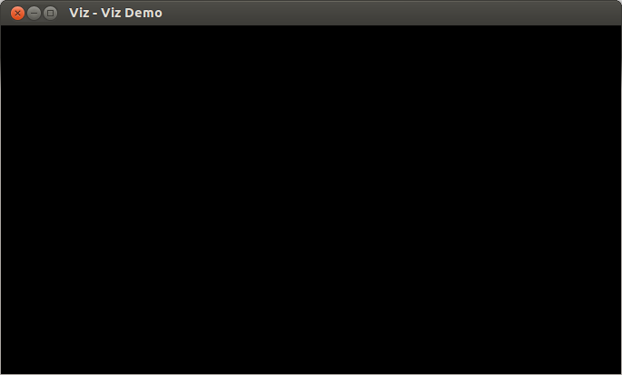

.. _launching_viz:

Launching Viz
*************

Goal
====

In this tutorial you will learn how to

.. container:: enumeratevisibleitemswithsquare

  * Open a visualization window.
  * Access a window by its name.
  * Start event loop.
  * Start event loop for a given amount of time.

Code
====

You can download the code from :download:`here <../../../../samples/cpp/tutorial_code/viz/launching_viz.cpp>`.

.. code-block:: cpp

    #include <opencv2/viz/vizcore.hpp>
    #include <iostream>

    using namespace cv;
    using namespace std;

    /**
    * @function main
    */
    int main()
    {
        /// Create a window
        viz::Viz3d myWindow("Viz Demo");

        /// Start event loop
        myWindow.spin();

        /// Event loop is over when pressed q, Q, e, E
        cout << "First event loop is over" << endl;

        /// Access window via its name
        viz::Viz3d sameWindow = viz::getWindowByName("Viz Demo");

        /// Start event loop
        sameWindow.spin();

        /// Event loop is over when pressed q, Q, e, E
        cout << "Second event loop is over" << endl;

        /// Event loop is over when pressed q, Q, e, E
        /// Start event loop once for 1 millisecond
        sameWindow.spinOnce(1, true);
        while(!sameWindow.wasStopped())
        {
            /// Interact with window

            /// Event loop for 1 millisecond
            sameWindow.spinOnce(1, true);
        }

        /// Once more event loop is stopped
        cout << "Last event loop is over" << endl;
        return 0;
    }

Explanation
===========

Here is the general structure of the program:

* Create a window.

.. code-block:: cpp

    /// Create a window
    viz::Viz3d myWindow("Viz Demo");

* Start event loop. This event loop will run until user terminates it by pressing **e**, **E**, **q**, **Q**.

.. code-block:: cpp

    /// Start event loop
    myWindow.spin();

* Access same window via its name. Since windows are implicitly shared, **sameWindow** is exactly the same with **myWindow**. If the name does not exist, a new window is created.

.. code-block:: cpp

    /// Access window via its name
    viz::Viz3d sameWindow = viz::get("Viz Demo");

* Start a controlled event loop. Once it starts, **wasStopped** is set to false. Inside the while loop, in each iteration, **spinOnce** is called to prevent event loop from completely stopping. Inside the while loop, user can execute other statements including those which interact with the window.

.. code-block:: cpp

    /// Event loop is over when pressed q, Q, e, E
    /// Start event loop once for 1 millisecond
    sameWindow.spinOnce(1, true);
    while(!sameWindow.wasStopped())
    {
        /// Interact with window

        /// Event loop for 1 millisecond
        sameWindow.spinOnce(1, true);
    }

Results
=======

Here is the result of the program.

