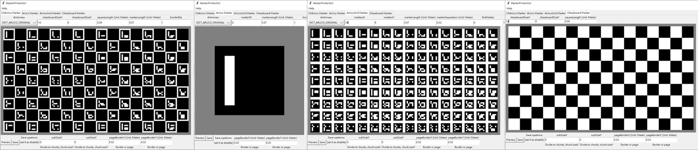

# OpenCVMarkerPrinter

## Description
This small app can save some commonly used opencv markers such as ArUco, ArUcoGrid, Chessboard and ChArUco to vector graphics file. **Supported vector graphics file format: .svg, .pdf and .ps.**



### Dependencies
#### MarkerPrinter
  * numpy
  * PIL(Pillow, for image processing)
  * cairo(for drawing vector graphic)
  * cairosvg(for svg to png)

#### MarkerPrinterGUI
  * tkinter(for GUI)

## Tutorial
#### GUI
```
python MarkerPrinterGUI.py
```

You can switch ArUco, ArUcoGrid, Chessboard and ChArUco mode at the GUI tab, then you can select dictionary from the GUI menu and modify board shape, marker size, border width... etc. at the GUI entry, finally click the preview or save button to show the marker image on the GUI window or save it to file.

#### Command-Line
##### Print help
```
python MarkerPrinter.py
```

##### Print predefined dictionary list
```
python MarkerPrinter.py --list_dictionary
```

##### Save chessboard
```
python MarkerPrinter.py --chess --file "./chess.pdf" --size_x 16 --size_y 9 --square_length 0.09
```

##### Save ArUco
```
python MarkerPrinter.py --aruco --file "./aruco.pdf" --dictionary DICT_ARUCO_ORIGINAL --marker_length 0.07 --marker_id 0 --border_bits 1
```

##### Save ArUco Grid
```
python MarkerPrinter.py --aruco_grid --file "./aruco_grid.pdf" --dictionary DICT_ARUCO_ORIGINAL --size_x 16 --size_y 9 --marker_length 0.07 --marker_separation 0.02 --first_marker 0 --border_bits 1
```

##### Save ChArUco
```
python MarkerPrinter.py --charuco --file "./charuco.pdf" --dictionary DICT_ARUCO_ORIGINAL --size_x 16 --size_y 9 --square_length 0.09 --marker_length 0.07 --border_bits 1
```

## Useful Options:
### Divde output to chunks
If you are using consumer level printer, you will suffer from not able printing too large marker, so just set chunks shape at the GUI subSize entry before saving the marker to files, it will divide output marker to chunks. If you are using command-line interface, just add --sub_size_x x --sub_size_y y as parameters.

### Page border
If you are printing the image directly, you will need add page border to protect the marker, so just set page border at the GUI pageBorder entry before saving the marker to files. If you are using command-line interface, just add --page_border_x x --page_border_y y as parameters.

### Generate aruco data:
Although there is a built-in aruco dictionary data, but if you want to update the dictionary(If aruco update predefined dictionary list), just install opencv-python and opencv-contrib-python, and than run
```
python MarkerPrinter.py --generate arucoDictBytesList.npz
```
