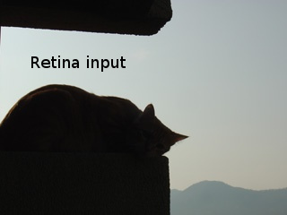
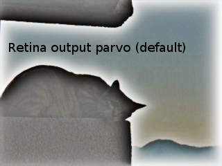
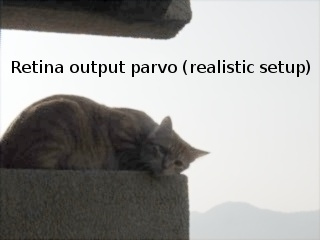

Retina : a Bio mimetic human retina model
*****************************************

.. highlight:: cpp

Retina
======
.. ocv:class:: Retina : public Algorithm

**Note** : do not forget that the retina model is included in the following namespace : *cv::bioinspired*.

Introduction
++++++++++++

Class which provides the main controls to the Gipsa/Listic labs human  retina model. This is a non separable spatio-temporal filter modelling the two main retina information channels :

* foveal vision for detailled color vision : the parvocellular pathway.

* peripheral vision for sensitive transient signals detection (motion and events) : the magnocellular pathway.

From a general point of view, this filter whitens the image spectrum and corrects luminance thanks to local adaptation. An other important property is its hability to filter out spatio-temporal noise while enhancing details.
This model originates from Jeanny Herault work [Herault2010]_. It has been involved in Alexandre Benoit phd and his current research [Benoit2010]_, [Strat2013]_ (he currently maintains this module within OpenCV). It includes the work of other Jeanny's phd student such as [Chaix2007]_ and the log polar transformations of Barthelemy Durette described in Jeanny's book.

**NOTES :**

* For ease of use in computer vision applications, the two retina channels are applied homogeneously on all the input images. This does not follow the real retina topology but this can still be done using the log sampling capabilities proposed within the class.

* Extend the retina description and code use in the tutorial/contrib section for complementary explanations.

Preliminary illustration
++++++++++++++++++++++++

As a preliminary presentation, let's start with a visual example. We propose to apply the filter on a low quality color jpeg image with backlight problems. Here is the considered input... *"Well, my eyes were able to see more that this strange black shadow..."*

Below, the retina foveal model applied on the entire image with default parameters. Here contours are enforced, halo effects are voluntary visible with this configuration. See parameters discussion below and increase horizontalCellsGain near 1 to remove them.

Below, a second retina foveal model output applied on the entire image with a parameters setup focused on naturalness perception. *"Hey, i now recognize my cat, looking at the mountains at the end of the day !"*. Here contours are enforced, luminance is corrected but halos are avoided with this configuration. The backlight effect is corrected and highlight details are still preserved. Then, even on a low quality jpeg image, if some luminance information remains, the retina is able to reconstruct a proper visual signal. Such configuration is also usefull for High Dynamic Range (*HDR*) images compression to 8bit images as discussed in [benoit2010]_ and in the demonstration codes discussed below.
As shown at the end of the page, parameters change from defaults are :

* horizontalCellsGain=0.3

* photoreceptorsLocalAdaptationSensitivity=ganglioncellsSensitivity=0.89.

As observed in this preliminary demo, the retina can be settled up with various parameters, by default, as shown on the figure above, the retina strongly reduces mean luminance energy and enforces all details of the visual scene. Luminance energy and halo effects can be modulated (exagerated to cancelled as shown on the two examples). In order to use your own parameters, you can use at least one time the *write(String fs)* method which will write a proper XML file with all default parameters. Then, tweak it on your own and reload them at any time using method *setup(String fs)*. These methods update a *Retina::RetinaParameters* member structure that is described hereafter. XML parameters file samples are shown at the end of the page.

Here is an overview of the abstract Retina interface, allocate one instance with the *createRetina* functions.::

  namespace cv{namespace bioinspired{

  class Retina : public Algorithm
  {
  public:
    // parameters setup instance
    struct RetinaParameters; // this class is detailled later

    // main method for input frame processing (all use method, can also perform High Dynamic Range tone mapping)
    void run (InputArray inputImage);

    // specific method aiming at correcting luminance only (faster High Dynamic Range tone mapping)
    void applyFastToneMapping(InputArray inputImage, OutputArray outputToneMappedImage)

    // output buffers retreival methods
    // -> foveal color vision details channel with luminance and noise correction
    void getParvo (OutputArray retinaOutput_parvo);
    void getParvoRAW (OutputArray retinaOutput_parvo);// retreive original output buffers without any normalisation
    const Mat getParvoRAW () const;// retreive original output buffers without any normalisation
    // -> peripheral monochrome motion and events (transient information) channel
    void getMagno (OutputArray retinaOutput_magno);
    void getMagnoRAW (OutputArray retinaOutput_magno); // retreive original output buffers without any normalisation
    const Mat getMagnoRAW () const;// retreive original output buffers without any normalisation

    // reset retina buffers... equivalent to closing your eyes for some seconds
    void clearBuffers ();

    // retreive input and output buffers sizes
    Size getInputSize ();
    Size getOutputSize ();

    // setup methods with specific parameters specification of global xml config file loading/write
    void setup (String retinaParameterFile="", const bool applyDefaultSetupOnFailure=true);
    void setup (FileStorage &fs, const bool applyDefaultSetupOnFailure=true);
    void setup (RetinaParameters newParameters);
    struct Retina::RetinaParameters getParameters ();
    const String printSetup ();
    virtual void write (String fs) const;
    virtual void write (FileStorage &fs) const;
    void setupOPLandIPLParvoChannel (const bool colorMode=true, const bool normaliseOutput=true, const float photoreceptorsLocalAdaptationSensitivity=0.7, const float photoreceptorsTemporalConstant=0.5, const float photoreceptorsSpatialConstant=0.53, const float horizontalCellsGain=0, const float HcellsTemporalConstant=1, const float HcellsSpatialConstant=7, const float ganglionCellsSensitivity=0.7);
    void setupIPLMagnoChannel (const bool normaliseOutput=true, const float parasolCells_beta=0, const float parasolCells_tau=0, const float parasolCells_k=7, const float amacrinCellsTemporalCutFrequency=1.2, const float V0CompressionParameter=0.95, const float localAdaptintegration_tau=0, const float localAdaptintegration_k=7);
    void setColorSaturation (const bool saturateColors=true, const float colorSaturationValue=4.0);
    void activateMovingContoursProcessing (const bool activate);
    void activateContoursProcessing (const bool activate);
  };

    // Allocators
    cv::Ptr<Retina> createRetina (Size inputSize);
    cv::Ptr<Retina> createRetina (Size inputSize, const bool colorMode, RETINA_COLORSAMPLINGMETHOD colorSamplingMethod=RETINA_COLOR_BAYER, const bool useRetinaLogSampling=false, const double reductionFactor=1.0, const double samplingStrenght=10.0);
    }} // cv and bioinspired namespaces end

.. Sample code::

   * An example on retina tone mapping can be found at opencv_source_code/samples/cpp/OpenEXRimages_HighDynamicRange_Retina_toneMapping.cpp
   * An example on retina tone mapping on video input can be found at opencv_source_code/samples/cpp/OpenEXRimages_HighDynamicRange_Retina_toneMapping.cpp
   * A complete example illustrating the retina interface can be found at opencv_source_code/samples/cpp/retinaDemo.cpp

Description
+++++++++++

Class which allows the `Gipsa <http://www.gipsa-lab.inpg.fr>`_ (preliminary work) / `Listic <http://www.listic.univ-savoie.fr>`_ (code maintainer and user) labs retina model to be used. This class allows human retina spatio-temporal image processing to be applied on still images, images sequences and video sequences. Briefly, here are the main human retina model properties:

* spectral whithening (mid-frequency details enhancement)

* high frequency spatio-temporal noise reduction (temporal noise and high frequency spatial noise are minimized)

* low frequency luminance reduction (luminance range compression) : high luminance regions do not hide details in darker regions anymore

* local logarithmic luminance compression allows details to be enhanced even in low light conditions

Use : this model can be used basically for spatio-temporal video effects but also in the aim of :

* performing texture analysis with enhanced signal to noise ratio and enhanced details robust against input images luminance ranges (check out the parvocellular retina channel output, by using the provided **getParvo** methods)

* performing motion analysis also taking benefit of the previously cited properties  (check out the magnocellular retina channel output, by using the provided **getMagno** methods)

* general image/video sequence description using either one or both channels. An example of the use of Retina in a Bag of Words approach is given in [Strat2013]_.

Literature
==========
For more information, refer to the following papers :

* Model description :

.. [Benoit2010] Benoit A., Caplier A., Durette B., Herault, J., "Using Human Visual System Modeling For Bio-Inspired Low Level Image Processing", Elsevier, Computer Vision and Image Understanding 114 (2010), pp. 758-773. DOI <http://dx.doi.org/10.1016/j.cviu.2010.01.011>

* Model use in a Bag of Words approach :

.. [Strat2013] Strat S., Benoit A., Lambert P., "Retina enhanced SIFT descriptors for video indexing", CBMI2013, Veszprém, Hungary, 2013.

* Please have a look at the reference work of Jeanny Herault that you can read in his book :

.. [Herault2010] Vision: Images, Signals and Neural Networks: Models of Neural Processing in Visual Perception (Progress in Neural Processing),By: Jeanny Herault, ISBN: 9814273686. WAPI (Tower ID): 113266891.

This retina filter code includes the research contributions of phd/research collegues from which code has been redrawn by the author :

* take a look at the *retinacolor.hpp* module to discover Brice Chaix de Lavarene phD color mosaicing/demosaicing and his reference paper:

.. [Chaix2007] B. Chaix de Lavarene, D. Alleysson, B. Durette, J. Herault (2007). "Efficient demosaicing through recursive filtering", IEEE International Conference on Image Processing ICIP 2007

* take a look at *imagelogpolprojection.hpp* to discover retina spatial log sampling which originates from Barthelemy Durette phd with Jeanny Herault. A Retina / V1 cortex projection is also proposed and originates from Jeanny's discussions. More informations in the above cited Jeanny Heraults's book.

* Meylan&al work on HDR tone mapping that is implemented as a specific method within the model :

.. [Meylan2007] L. Meylan , D. Alleysson, S. Susstrunk, "A Model of Retinal Local Adaptation for the Tone Mapping of Color Filter Array Images", Journal of Optical Society of America, A, Vol. 24, N 9, September, 1st, 2007, pp. 2807-2816

Demos and experiments !
=======================

**NOTE : Complementary to the following examples, have a look at the Retina tutorial in the tutorial/contrib section for complementary explanations.**

Take a look at the provided C++ examples provided with OpenCV :

* **samples/cpp/retinademo.cpp** shows how to use the retina module for details enhancement (Parvo channel output) and transient maps observation (Magno channel output). You can play with images, video sequences and webcam video.
    Typical uses are (provided your OpenCV installation is situated in folder *OpenCVReleaseFolder*)

    * image processing : **OpenCVReleaseFolder/bin/retinademo -image myPicture.jpg**

    * video processing : **OpenCVReleaseFolder/bin/retinademo -video myMovie.avi**

    * webcam processing: **OpenCVReleaseFolder/bin/retinademo -video**

   **Note :** This demo generates the file *RetinaDefaultParameters.xml* which contains the default parameters of the retina. Then, rename this as *RetinaSpecificParameters.xml*, adjust the parameters the way you want and reload the program to check the effect.

* **samples/cpp/OpenEXRimages_HighDynamicRange_Retina_toneMapping.cpp** shows how to use the retina to perform High Dynamic Range (HDR) luminance compression

   Then, take a HDR image using bracketing with your camera and generate an OpenEXR image and then process it using the demo.

   Typical use, supposing that you have the OpenEXR image such as *memorial.exr* (present in the samples/cpp/ folder)

   **OpenCVReleaseFolder/bin/OpenEXRimages_HighDynamicRange_Retina_toneMapping memorial.exr [optionnal: 'fast']**

      Note that some sliders are made available to allow you to play with luminance compression.

      If not using the 'fast' option, then, tone mapping is performed using the full retina model [Benoit2010]_. It includes spectral whitening that allows luminance energy to be reduced. When using the 'fast' option, then, a simpler method is used, it is an adaptation of the algorithm presented in [Meylan2007]_. This method gives also good results and is faster to process but it sometimes requires some more parameters adjustement.

Methods description
===================

Here are detailled the main methods to control the retina model

Ptr<Retina>::createRetina
+++++++++++++++++++++++++

.. ocv:function:: Ptr<cv::bioinspired::Retina> createRetina(Size inputSize)
.. ocv:function:: Ptr<cv::bioinspired::Retina> createRetina(Size inputSize, const bool colorMode, cv::bioinspired::RETINA_COLORSAMPLINGMETHOD colorSamplingMethod = cv::bioinspired::RETINA_COLOR_BAYER, const bool useRetinaLogSampling = false, const double reductionFactor = 1.0, const double samplingStrenght = 10.0 )

    Constructors from standardized interfaces : retreive a smart pointer to a Retina instance

    :param inputSize: the input frame size
    :param colorMode: the chosen processing mode : with or without color processing
    :param colorSamplingMethod: specifies which kind of color sampling will be used :

        * cv::bioinspired::RETINA_COLOR_RANDOM: each pixel position is either R, G or B in a random choice

        * cv::bioinspired::RETINA_COLOR_DIAGONAL: color sampling is RGBRGBRGB..., line 2 BRGBRGBRG..., line 3, GBRGBRGBR...

        * cv::bioinspired::RETINA_COLOR_BAYER: standard bayer sampling

    :param useRetinaLogSampling: activate retina log sampling, if true, the 2 following parameters can be used
    :param reductionFactor: only usefull if param useRetinaLogSampling=true, specifies the reduction factor of the output frame (as the center (fovea) is high resolution and corners can be underscaled, then a reduction of the output is allowed without precision leak
    :param samplingStrenght: only usefull if param useRetinaLogSampling=true, specifies the strenght of the log scale that is applied

Retina::activateContoursProcessing
++++++++++++++++++++++++++++++++++

.. ocv:function:: void Retina::activateContoursProcessing(const bool activate)

    Activate/desactivate the Parvocellular pathway processing (contours information extraction), by default, it is activated

    :param activate: true if Parvocellular (contours information extraction) output should be activated, false if not... if activated, the Parvocellular output can be retrieved using the **getParvo** methods

Retina::activateMovingContoursProcessing
++++++++++++++++++++++++++++++++++++++++

.. ocv:function:: void Retina::activateMovingContoursProcessing(const bool activate)

    Activate/desactivate the Magnocellular pathway processing (motion information extraction), by default, it is activated

    :param activate: true if Magnocellular output should be activated, false if not... if activated, the Magnocellular output can be retrieved using the **getMagno** methods

Retina::clearBuffers
++++++++++++++++++++

.. ocv:function:: void Retina::clearBuffers()

    Clears all retina buffers (equivalent to opening the eyes after a long period of eye close ;o) whatchout the temporal transition occuring just after this method call.

Retina::getParvo
++++++++++++++++

.. ocv:function:: void Retina::getParvo( OutputArray retinaOutput_parvo )
.. ocv:function:: void Retina::getParvoRAW( OutputArray retinaOutput_parvo )
.. ocv:function:: const Mat Retina::getParvoRAW() const

    Accessor of the details channel of the retina (models foveal vision). Warning, getParvoRAW methods return buffers that are not rescaled within range [0;255] while the non RAW method allows a normalized matrix to be retrieved.

    :param retinaOutput_parvo: the output buffer (reallocated if necessary), format can be :

        * a Mat, this output is rescaled for standard 8bits image processing use in OpenCV

        * RAW methods actually return a 1D matrix (encoding is R1, R2, ... Rn, G1, G2, ..., Gn, B1, B2, ...Bn), this output is the original retina filter model output, without any quantification or rescaling.

Retina::getMagno
++++++++++++++++

.. ocv:function:: void Retina::getMagno( OutputArray retinaOutput_magno )
.. ocv:function:: void Retina::getMagnoRAW( OutputArray retinaOutput_magno )
.. ocv:function:: const Mat Retina::getMagnoRAW() const

    Accessor of the motion channel of the retina (models peripheral vision). Warning, getMagnoRAW methods return buffers that are not rescaled within range [0;255] while the non RAW method allows a normalized matrix to be retrieved.

    :param retinaOutput_magno: the output buffer (reallocated if necessary), format can be :

        * a Mat, this output is rescaled for standard 8bits image processing use in OpenCV

        * RAW methods actually return a 1D matrix (encoding is M1, M2,... Mn), this output is the original retina filter model output, without any quantification or rescaling.

Retina::getInputSize
++++++++++++++++++++

.. ocv:function:: Size Retina::getInputSize()

    Retreive retina input buffer size

    :return: the retina input buffer size

Retina::getOutputSize
+++++++++++++++++++++

.. ocv:function:: Size Retina::getOutputSize()

    Retreive retina output buffer size that can be different from the input if a spatial log transformation is applied

    :return: the retina output buffer size

Retina::printSetup
++++++++++++++++++

.. ocv:function:: const String Retina::printSetup()

    Outputs a string showing the used parameters setup

    :return: a string which contains formated parameters information

Retina::run
+++++++++++

.. ocv:function:: void Retina::run(InputArray inputImage)

    Method which allows retina to be applied on an input image, after run, encapsulated retina module is ready to deliver its outputs using dedicated acccessors, see getParvo and getMagno methods

    :param inputImage: the input Mat image to be processed, can be gray level or BGR coded in any format (from 8bit to 16bits)

Retina::applyFastToneMapping
++++++++++++++++++++++++++++

.. ocv:function:: void Retina::applyFastToneMapping(InputArray inputImage, OutputArray outputToneMappedImage)

    Method which processes an image in the aim to correct its luminance : correct backlight problems, enhance details in shadows. This method is designed to perform High Dynamic Range image tone mapping (compress >8bit/pixel images to 8bit/pixel). This is a simplified version of the Retina Parvocellular model (simplified version of the run/getParvo methods call) since it does not include the spatio-temporal filter modelling the Outer Plexiform Layer of the retina that performs spectral whitening and many other stuff. However, it works great for tone mapping and in a faster way.

    Check the demos and experiments section to see examples and the way to perform tone mapping using the original retina model and the method.

    :param inputImage: the input image to process (should be coded in float format : CV_32F, CV_32FC1, CV_32F_C3, CV_32F_C4, the 4th channel won't be considered).
    :param outputToneMappedImage: the output 8bit/channel tone mapped image (CV_8U or CV_8UC3 format).

Retina::setColorSaturation
++++++++++++++++++++++++++

.. ocv:function:: void Retina::setColorSaturation(const bool saturateColors = true, const float colorSaturationValue = 4.0 )

    Activate color saturation as the final step of the color demultiplexing process -> this saturation is a sigmoide function applied to each channel of the demultiplexed image.

    :param saturateColors: boolean that activates color saturation (if true) or desactivate (if false)
    :param colorSaturationValue: the saturation factor : a simple factor applied on the chrominance buffers

Retina::setup
+++++++++++++

.. ocv:function:: void Retina::setup(String retinaParameterFile = "", const bool applyDefaultSetupOnFailure = true )
.. ocv:function:: void Retina::setup(FileStorage & fs, const bool applyDefaultSetupOnFailure = true )
.. ocv:function:: void Retina::setup(RetinaParameters newParameters)

    Try to open an XML retina parameters file to adjust current retina instance setup => if the xml file does not exist, then default setup is applied => warning, Exceptions are thrown if read XML file is not valid

    :param retinaParameterFile: the parameters filename
    :param applyDefaultSetupOnFailure: set to true if an error must be thrown on error
    :param fs: the open Filestorage which contains retina parameters
    :param newParameters: a parameters structures updated with the new target configuration. You can retreive the current parameers structure using method *Retina::RetinaParameters Retina::getParameters()* and update it before running method *setup*.

Retina::write
+++++++++++++

.. ocv:function:: void Retina::write( String fs ) const
.. ocv:function:: void Retina::write( FileStorage& fs ) const

    Write xml/yml formated parameters information

    :param fs: the filename of the xml file that will be open and writen with formatted parameters information

Retina::setupIPLMagnoChannel
++++++++++++++++++++++++++++

.. ocv:function:: void Retina::setupIPLMagnoChannel(const bool normaliseOutput = true, const float parasolCells_beta = 0, const float parasolCells_tau = 0, const float parasolCells_k = 7, const float amacrinCellsTemporalCutFrequency = 1.2, const float V0CompressionParameter = 0.95, const float localAdaptintegration_tau = 0, const float localAdaptintegration_k = 7 )

    Set parameters values for the Inner Plexiform Layer (IPL) magnocellular channel this channel processes signals output from OPL processing stage in peripheral vision, it allows motion information enhancement. It is decorrelated from the details channel. See reference papers for more details.

    :param normaliseOutput: specifies if (true) output is rescaled between 0 and 255 of not (false)
    :param parasolCells_beta: the low pass filter gain used for local contrast adaptation at the IPL level of the retina (for ganglion cells local adaptation), typical value is 0
    :param parasolCells_tau: the low pass filter time constant used for local contrast adaptation at the IPL level of the retina (for ganglion cells local adaptation), unit is frame, typical value is 0 (immediate response)
    :param parasolCells_k: the low pass filter spatial constant used for local contrast adaptation at the IPL level of the retina (for ganglion cells local adaptation), unit is pixels, typical value is 5
    :param amacrinCellsTemporalCutFrequency: the time constant of the first order high pass fiter of the magnocellular way (motion information channel), unit is frames, typical value is 1.2
    :param V0CompressionParameter: the compression strengh of the ganglion cells local adaptation output, set a value between 0.6 and 1 for best results, a high value increases more the low value sensitivity... and the output saturates faster, recommended value: 0.95
    :param localAdaptintegration_tau: specifies the temporal constant of the low pas filter involved in the computation of the local "motion mean" for the local adaptation computation
    :param localAdaptintegration_k: specifies the spatial constant of the low pas filter involved in the computation of the local "motion mean" for the local adaptation computation

Retina::setupOPLandIPLParvoChannel
++++++++++++++++++++++++++++++++++

.. ocv:function:: void Retina::setupOPLandIPLParvoChannel(const bool colorMode = true, const bool normaliseOutput = true, const float photoreceptorsLocalAdaptationSensitivity = 0.7, const float photoreceptorsTemporalConstant = 0.5, const float photoreceptorsSpatialConstant = 0.53, const float horizontalCellsGain = 0, const float HcellsTemporalConstant = 1, const float HcellsSpatialConstant = 7, const float ganglionCellsSensitivity = 0.7 )

    Setup the OPL and IPL parvo channels (see biologocal model) OPL is referred as Outer Plexiform Layer of the retina, it allows the spatio-temporal filtering which withens the spectrum and reduces spatio-temporal noise while attenuating global luminance (low frequency energy) IPL parvo is the OPL next processing stage, it refers to a part of the Inner Plexiform layer of the retina, it allows high contours sensitivity in foveal vision. See reference papers for more informations.

    :param colorMode: specifies if (true) color is processed of not (false) to then processing gray level image
    :param normaliseOutput: specifies if (true) output is rescaled between 0 and 255 of not (false)
    :param photoreceptorsLocalAdaptationSensitivity: the photoreceptors sensitivity renage is 0-1 (more log compression effect when value increases)
    :param photoreceptorsTemporalConstant: the time constant of the first order low pass filter of the photoreceptors, use it to cut high temporal frequencies (noise or fast motion), unit is frames, typical value is 1 frame
    :param photoreceptorsSpatialConstant: the spatial constant of the first order low pass filter of the photoreceptors, use it to cut high spatial frequencies (noise or thick contours), unit is pixels, typical value is 1 pixel
    :param horizontalCellsGain: gain of the horizontal cells network, if 0, then the mean value of the output is zero, if the parameter is near 1, then, the luminance is not filtered and is still reachable at the output, typicall value is 0
    :param HcellsTemporalConstant: the time constant of the first order low pass filter of the horizontal cells, use it to cut low temporal frequencies (local luminance variations), unit is frames, typical value is 1 frame, as the photoreceptors
    :param HcellsSpatialConstant: the spatial constant of the first order low pass filter of the horizontal cells, use it to cut low spatial frequencies (local luminance), unit is pixels, typical value is 5 pixel, this value is also used for local contrast computing when computing the local contrast adaptation at the ganglion cells level (Inner Plexiform Layer parvocellular channel model)
    :param ganglionCellsSensitivity: the compression strengh of the ganglion cells local adaptation output, set a value between 0.6 and 1 for best results, a high value increases more the low value sensitivity... and the output saturates faster, recommended value: 0.7

Retina::RetinaParameters
========================

.. ocv:struct:: Retina::RetinaParameters

  This structure merges all the parameters that can be adjusted threw the **Retina::setup()**, **Retina::setupOPLandIPLParvoChannel** and **Retina::setupIPLMagnoChannel** setup methods
  Parameters structure for better clarity, check explenations on the comments of methods : setupOPLandIPLParvoChannel and setupIPLMagnoChannel. ::

    class RetinaParameters{
        struct OPLandIplParvoParameters{ // Outer Plexiform Layer (OPL) and Inner Plexiform Layer Parvocellular (IplParvo) parameters
               OPLandIplParvoParameters():colorMode(true),
                  normaliseOutput(true), // specifies if (true) output is rescaled between 0 and 255 of not (false)
                  photoreceptorsLocalAdaptationSensitivity(0.7f), // the photoreceptors sensitivity renage is 0-1 (more log compression effect when value increases)
                  photoreceptorsTemporalConstant(0.5f),// the time constant of the first order low pass filter of the photoreceptors, use it to cut high temporal frequencies (noise or fast motion), unit is frames, typical value is 1 frame
                  photoreceptorsSpatialConstant(0.53f),// the spatial constant of the first order low pass filter of the photoreceptors, use it to cut high spatial frequencies (noise or thick contours), unit is pixels, typical value is 1 pixel
                  horizontalCellsGain(0.0f),//gain of the horizontal cells network, if 0, then the mean value of the output is zero, if the parameter is near 1, then, the luminance is not filtered and is still reachable at the output, typicall value is 0
                  hcellsTemporalConstant(1.f),// the time constant of the first order low pass filter of the horizontal cells, use it to cut low temporal frequencies (local luminance variations), unit is frames, typical value is 1 frame, as the photoreceptors. Reduce to 0.5 to limit retina after effects.
                  hcellsSpatialConstant(7.f),//the spatial constant of the first order low pass filter of the horizontal cells, use it to cut low spatial frequencies (local luminance), unit is pixels, typical value is 5 pixel, this value is also used for local contrast computing when computing the local contrast adaptation at the ganglion cells level (Inner Plexiform Layer parvocellular channel model)
                  ganglionCellsSensitivity(0.7f)//the compression strengh of the ganglion cells local adaptation output, set a value between 0.6 and 1 for best results, a high value increases more the low value sensitivity... and the output saturates faster, recommended value: 0.7
                  {};// default setup
               bool colorMode, normaliseOutput;
               float photoreceptorsLocalAdaptationSensitivity, photoreceptorsTemporalConstant, photoreceptorsSpatialConstant, horizontalCellsGain, hcellsTemporalConstant, hcellsSpatialConstant, ganglionCellsSensitivity;
           };
           struct IplMagnoParameters{ // Inner Plexiform Layer Magnocellular channel (IplMagno)
               IplMagnoParameters():
                  normaliseOutput(true), //specifies if (true) output is rescaled between 0 and 255 of not (false)
                  parasolCells_beta(0.f), // the low pass filter gain used for local contrast adaptation at the IPL level of the retina (for ganglion cells local adaptation), typical value is 0
                  parasolCells_tau(0.f), //the low pass filter time constant used for local contrast adaptation at the IPL level of the retina (for ganglion cells local adaptation), unit is frame, typical value is 0 (immediate response)
                  parasolCells_k(7.f), //the low pass filter spatial constant used for local contrast adaptation at the IPL level of the retina (for ganglion cells local adaptation), unit is pixels, typical value is 5
                  amacrinCellsTemporalCutFrequency(1.2f), //the time constant of the first order high pass fiter of the magnocellular way (motion information channel), unit is frames, typical value is 1.2
                  V0CompressionParameter(0.95f), the compression strengh of the ganglion cells local adaptation output, set a value between 0.6 and 1 for best results, a high value increases more the low value sensitivity... and the output saturates faster, recommended value: 0.95
                  localAdaptintegration_tau(0.f), // specifies the temporal constant of the low pas filter involved in the computation of the local "motion mean" for the local adaptation computation
                  localAdaptintegration_k(7.f) // specifies the spatial constant of the low pas filter involved in the computation of the local "motion mean" for the local adaptation computation
                  {};// default setup
               bool normaliseOutput;
               float parasolCells_beta, parasolCells_tau, parasolCells_k, amacrinCellsTemporalCutFrequency, V0CompressionParameter, localAdaptintegration_tau, localAdaptintegration_k;
           };
            struct OPLandIplParvoParameters OPLandIplParvo;
            struct IplMagnoParameters IplMagno;
    };

Retina parameters files examples
++++++++++++++++++++++++++++++++

Here is the default configuration file of the retina module. It gives results such as the first retina output shown on the top of this page.

.. code-block:: cpp

    <?xml version="1.0"?>
    <opencv_storage>
    <OPLandIPLparvo>
        <colorMode>1</colorMode>
        <normaliseOutput>1</normaliseOutput>
        <photoreceptorsLocalAdaptationSensitivity>7.5e-01</photoreceptorsLocalAdaptationSensitivity>
        <photoreceptorsTemporalConstant>9.0e-01</photoreceptorsTemporalConstant>
        <photoreceptorsSpatialConstant>5.3e-01</photoreceptorsSpatialConstant>
        <horizontalCellsGain>0.01</horizontalCellsGain>
        <hcellsTemporalConstant>0.5</hcellsTemporalConstant>
        <hcellsSpatialConstant>7.</hcellsSpatialConstant>
        <ganglionCellsSensitivity>7.5e-01</ganglionCellsSensitivity></OPLandIPLparvo>
    <IPLmagno>
        <normaliseOutput>1</normaliseOutput>
        <parasolCells_beta>0.</parasolCells_beta>
        <parasolCells_tau>0.</parasolCells_tau>
        <parasolCells_k>7.</parasolCells_k>
        <amacrinCellsTemporalCutFrequency>2.0e+00</amacrinCellsTemporalCutFrequency>
        <V0CompressionParameter>9.5e-01</V0CompressionParameter>
        <localAdaptintegration_tau>0.</localAdaptintegration_tau>
        <localAdaptintegration_k>7.</localAdaptintegration_k></IPLmagno>
    </opencv_storage>

Here is the 'realistic" setup used to obtain the second retina output shown on the top of this page.

.. code-block:: cpp

    <?xml version="1.0"?>
    <opencv_storage>
    <OPLandIPLparvo>
      <colorMode>1</colorMode>
      <normaliseOutput>1</normaliseOutput>
      <photoreceptorsLocalAdaptationSensitivity>8.9e-01</photoreceptorsLocalAdaptationSensitivity>
      <photoreceptorsTemporalConstant>9.0e-01</photoreceptorsTemporalConstant>
      <photoreceptorsSpatialConstant>5.3e-01</photoreceptorsSpatialConstant>
      <horizontalCellsGain>0.3</horizontalCellsGain>
      <hcellsTemporalConstant>0.5</hcellsTemporalConstant>
      <hcellsSpatialConstant>7.</hcellsSpatialConstant>
      <ganglionCellsSensitivity>8.9e-01</ganglionCellsSensitivity></OPLandIPLparvo>
    <IPLmagno>
      <normaliseOutput>1</normaliseOutput>
      <parasolCells_beta>0.</parasolCells_beta>
      <parasolCells_tau>0.</parasolCells_tau>
      <parasolCells_k>7.</parasolCells_k>
      <amacrinCellsTemporalCutFrequency>2.0e+00</amacrinCellsTemporalCutFrequency>
      <V0CompressionParameter>9.5e-01</V0CompressionParameter>
      <localAdaptintegration_tau>0.</localAdaptintegration_tau>
      <localAdaptintegration_k>7.</localAdaptintegration_k></IPLmagno>
    </opencv_storage>
