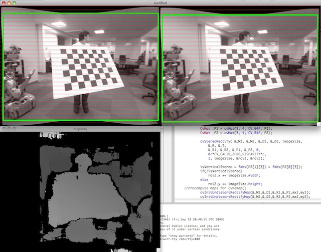

Camera Calibration and 3D Reconstruction
========================================

.. highlight:: cpp

The functions in this section use a so-called pinhole camera model. In this model, a scene view is formed by projecting 3D points into the image plane
using a perspective transformation.

.. math::

    s  \; m' = A [R|t] M'

or

.. math::

    s  \vecthree{u}{v}{1} = \vecthreethree{f_x}{0}{c_x}{0}{f_y}{c_y}{0}{0}{1}
    \begin{bmatrix}
    r_{11} & r_{12} & r_{13} & t_1  \\
    r_{21} & r_{22} & r_{23} & t_2  \\
    r_{31} & r_{32} & r_{33} & t_3
    \end{bmatrix}
    \begin{bmatrix}
    X \\
    Y \\
    Z \\
    1
    \end{bmatrix}

where:

   * :math:`(X, Y, Z)` are the coordinates of a 3D point in the world coordinate space
   * :math:`(u, v)` are the coordinates of the projection point in pixels
   * :math:`A` is a camera matrix, or a matrix of intrinsic parameters
   * :math:`(cx, cy)` is a principal point that is usually at the image center
   * :math:`fx, fy` are the focal lengths expressed in pixel units.

Thus, if an image from the camera is
scaled by a factor, all of these parameters should
be scaled (multiplied/divided, respectively) by the same factor. The
matrix of intrinsic parameters does not depend on the scene viewed. So,
once estimated, it can be re-used as long as the focal length is fixed (in
case of zoom lens). The joint rotation-translation matrix
:math:`[R|t]` is called a matrix of extrinsic parameters. It is used to describe the
camera motion around a static scene, or vice versa, rigid motion of an
object in front of a still camera. That is,
:math:`[R|t]` translates
coordinates of a point
:math:`(X, Y, Z)` to a coordinate system,
fixed with respect to the camera. The transformation above is equivalent
to the following (when
:math:`z \ne 0` ):

.. math::

    \begin{array}{l}
    \vecthree{x}{y}{z} = R  \vecthree{X}{Y}{Z} + t \\
    x' = x/z \\
    y' = y/z \\
    u = f_x*x' + c_x \\
    v = f_y*y' + c_y
    \end{array}

Real lenses usually have some distortion, mostly
radial distortion and slight tangential distortion. So, the above model
is extended as:

.. math::

    \begin{array}{l} \vecthree{x}{y}{z} = R  \vecthree{X}{Y}{Z} + t \\ x' = x/z \\ y' = y/z \\ x'' = x'  \frac{1 + k_1 r^2 + k_2 r^4 + k_3 r^6}{1 + k_4 r^2 + k_5 r^4 + k_6 r^6} + 2 p_1 x' y' + p_2(r^2 + 2 x'^2) + s_1 r^2 + s_2 r^4 \\ y'' = y'  \frac{1 + k_1 r^2 + k_2 r^4 + k_3 r^6}{1 + k_4 r^2 + k_5 r^4 + k_6 r^6} + p_1 (r^2 + 2 y'^2) + 2 p_2 x' y' + s_1 r^2 + s_2 r^4 \\ \text{where} \quad r^2 = x'^2 + y'^2  \\ u = f_x*x'' + c_x \\ v = f_y*y'' + c_y \end{array}

:math:`k_1`,
:math:`k_2`,
:math:`k_3`,
:math:`k_4`,
:math:`k_5`, and
:math:`k_6` are radial distortion coefficients.
:math:`p_1` and
:math:`p_2` are tangential distortion coefficients.
:math:`s_1`,
:math:`s_2`,
:math:`s_3`, and
:math:`s_4`, are the thin prism distortion coefficients.
Higher-order coefficients are not considered in OpenCV. In the functions below the coefficients are passed or returned as

.. math::

    (k_1, k_2, p_1, p_2[, k_3[, k_4, k_5, k_6],[s_1, s_2, s_3, s_4]])

vector. That is, if the vector contains four elements, it means that
:math:`k_3=0` .
The distortion coefficients do not depend on the scene viewed. Thus, they also belong to the intrinsic camera parameters. And they remain the same regardless of the captured image resolution.
If, for example, a camera has been calibrated on images of
``320 x 240`` resolution, absolutely the same distortion coefficients can
be used for ``640 x 480`` images from the same camera while
:math:`f_x`,
:math:`f_y`,
:math:`c_x`, and
:math:`c_y` need to be scaled appropriately.

The functions below use the above model to do the following:

 * Project 3D points to the image plane given intrinsic and extrinsic parameters.

 * Compute extrinsic parameters given intrinsic parameters, a few 3D points, and their projections.

 * Estimate intrinsic and extrinsic camera parameters from several views of a known calibration pattern (every view is described by several 3D-2D point correspondences).

 * Estimate the relative position and orientation of the stereo camera "heads" and compute the *rectification* transformation that makes the camera optical axes parallel.

.. note::

   * A calibration sample for 3 cameras in horizontal position can be found at opencv_source_code/samples/cpp/3calibration.cpp
   * A calibration sample based on a sequence of images can be found at opencv_source_code/samples/cpp/calibration.cpp
   * A calibration sample in order to do 3D reconstruction can be found at opencv_source_code/samples/cpp/build3dmodel.cpp
   * A calibration sample of an artificially generated camera and chessboard patterns can be found at opencv_source_code/samples/cpp/calibration_artificial.cpp
   * A calibration example on stereo calibration can be found at opencv_source_code/samples/cpp/stereo_calib.cpp
   * A calibration example on stereo matching can be found at opencv_source_code/samples/cpp/stereo_match.cpp

   * (Python) A camera calibration sample can be found at opencv_source_code/samples/python2/calibrate.py

calibrateCamera
---------------
Finds the camera intrinsic and extrinsic parameters from several views of a calibration pattern.

.. ocv:function:: double calibrateCamera( InputArrayOfArrays objectPoints, InputArrayOfArrays imagePoints, Size imageSize, InputOutputArray cameraMatrix, InputOutputArray distCoeffs, OutputArrayOfArrays rvecs, OutputArrayOfArrays tvecs, int flags=0, TermCriteria criteria=TermCriteria( TermCriteria::COUNT + TermCriteria::EPS, 30, DBL_EPSILON) )

.. ocv:pyfunction:: cv2.calibrateCamera(objectPoints, imagePoints, imageSize, cameraMatrix, distCoeffs[, rvecs[, tvecs[, flags[, criteria]]]]) -> retval, cameraMatrix, distCoeffs, rvecs, tvecs

.. ocv:cfunction:: double cvCalibrateCamera2( const CvMat* object_points, const CvMat* image_points, const CvMat* point_counts, CvSize image_size, CvMat* camera_matrix, CvMat* distortion_coeffs, CvMat* rotation_vectors=NULL, CvMat* translation_vectors=NULL, int flags=0, CvTermCriteria term_crit=cvTermCriteria( CV_TERMCRIT_ITER+CV_TERMCRIT_EPS,30,DBL_EPSILON) )

    :param objectPoints: In the new interface it is a vector of vectors of calibration pattern points in the calibration pattern coordinate space. The outer vector contains as many elements as the number of the pattern views. If the same calibration pattern is shown in each view and it is fully visible, all the vectors will be the same. Although, it is possible to use partially occluded patterns, or even different patterns in different views. Then, the vectors will be different. The points are 3D, but since they are in a pattern coordinate system, then, if the rig is planar, it may make sense to put the model to a XY coordinate plane so that Z-coordinate of each input object point is 0.

        In the old interface all the vectors of object points from different views are concatenated together.

    :param imagePoints: In the new interface it is a vector of vectors of the projections of calibration pattern points. ``imagePoints.size()`` and ``objectPoints.size()`` and ``imagePoints[i].size()`` must be equal to ``objectPoints[i].size()`` for each ``i``.

        In the old interface all the vectors of object points from different views are concatenated together.

    :param point_counts: In the old interface this is a vector of integers, containing as many elements, as the number of views of the calibration pattern. Each element is the number of points in each view. Usually, all the elements are the same and equal to the number of feature points on the calibration pattern.

    :param imageSize: Size of the image used only to initialize the intrinsic camera matrix.

    :param cameraMatrix: Output 3x3 floating-point camera matrix  :math:`A = \vecthreethree{f_x}{0}{c_x}{0}{f_y}{c_y}{0}{0}{1}` . If  ``CV_CALIB_USE_INTRINSIC_GUESS``  and/or  ``CV_CALIB_FIX_ASPECT_RATIO``  are specified, some or all of  ``fx, fy, cx, cy``  must be initialized before calling the function.

    :param distCoeffs: Output vector of distortion coefficients  :math:`(k_1, k_2, p_1, p_2[, k_3[, k_4, k_5, k_6],[s_1, s_2, s_3, s_4]])`  of 4, 5, 8 or 12 elements.

    :param rvecs: Output  vector  of rotation vectors (see  :ocv:func:`Rodrigues` ) estimated for each pattern view. That is, each k-th rotation vector together with the corresponding k-th translation vector (see the next output parameter description) brings the calibration pattern from the model coordinate space (in which object points are specified) to the world coordinate space, that is, a real position of the calibration pattern in the k-th pattern view (k=0.. *M* -1).

    :param tvecs: Output vector of translation vectors estimated for each pattern view.

    :param flags: Different flags that may be zero or a combination of the following values:

            * **CV_CALIB_USE_INTRINSIC_GUESS** ``cameraMatrix``  contains valid initial values of  ``fx, fy, cx, cy``  that are optimized further. Otherwise, ``(cx, cy)``  is initially set to the image center ( ``imageSize``  is used), and focal distances are computed in a least-squares fashion. Note, that if intrinsic parameters are known, there is no need to use this function just to estimate extrinsic parameters. Use  :ocv:func:`solvePnP`  instead.

            * **CV_CALIB_FIX_PRINCIPAL_POINT** The principal point is not changed during the global optimization. It stays at the center or at a different location specified when    ``CV_CALIB_USE_INTRINSIC_GUESS``  is set too.

            * **CV_CALIB_FIX_ASPECT_RATIO** The functions considers only  ``fy``  as a free parameter. The ratio  ``fx/fy``  stays the same as in the input  ``cameraMatrix`` .   When  ``CV_CALIB_USE_INTRINSIC_GUESS``  is not set, the actual input values of  ``fx``  and  ``fy``  are ignored, only their ratio is computed and used further.

            * **CV_CALIB_ZERO_TANGENT_DIST** Tangential distortion coefficients  :math:`(p_1, p_2)`  are set to zeros and stay zero.

        * **CV_CALIB_FIX_K1,...,CV_CALIB_FIX_K6** The corresponding radial distortion coefficient is not changed during the optimization. If  ``CV_CALIB_USE_INTRINSIC_GUESS``  is set, the coefficient from the supplied  ``distCoeffs``  matrix is used. Otherwise, it is set to 0.

        * **CV_CALIB_RATIONAL_MODEL** Coefficients k4, k5, and k6 are enabled. To provide the backward compatibility, this extra flag should be explicitly specified to make the calibration function use the rational model and return 8 coefficients. If the flag is not set, the function computes  and returns  only 5 distortion coefficients.

        * **CALIB_THIN_PRISM_MODEL** Coefficients s1, s2, s3 and s4 are enabled. To provide the backward compatibility, this extra flag should be explicitly specified to make the calibration function use the thin prism model and return 12 coefficients. If the flag is not set, the function computes  and returns  only 5 distortion coefficients.

        * **CALIB_FIX_S1_S2_S3_S4** The thin prism distortion coefficients are not changed during the optimization. If  ``CV_CALIB_USE_INTRINSIC_GUESS``  is set, the coefficient from the supplied  ``distCoeffs``  matrix is used. Otherwise, it is set to 0.

    :param criteria: Termination criteria for the iterative optimization algorithm.

    :param term_crit: same as ``criteria``.

The function estimates the intrinsic camera
parameters and extrinsic parameters for each of the views. The algorithm is based on [Zhang2000]_ and [BouguetMCT]_. The coordinates of 3D object points and their corresponding 2D projections
in each view must be specified. That may be achieved by using an
object with a known geometry and easily detectable feature points.
Such an object is called a calibration rig or calibration pattern,
and OpenCV has built-in support for a chessboard as a calibration
rig (see
:ocv:func:`findChessboardCorners` ). Currently, initialization
of intrinsic parameters (when ``CV_CALIB_USE_INTRINSIC_GUESS`` is not set) is only implemented for planar calibration patterns
(where Z-coordinates of the object points must be all zeros). 3D
calibration rigs can also be used as long as initial ``cameraMatrix`` is provided.

The algorithm performs the following steps:

#.
    Compute the initial intrinsic parameters (the option only available for planar calibration patterns) or read them from the input parameters. The distortion coefficients are all set to zeros initially unless some of ``CV_CALIB_FIX_K?``     are specified.

#.
    Estimate the initial camera pose as if the intrinsic parameters have been already known. This is done using
    :ocv:func:`solvePnP` .
#.
    Run the global Levenberg-Marquardt optimization algorithm to minimize the reprojection error, that is, the total sum of squared distances between the observed feature points ``imagePoints``     and the projected (using the current estimates for camera parameters and the poses) object points ``objectPoints``. See :ocv:func:`projectPoints` for details.

The function returns the final re-projection error.

.. note::

    If you use a non-square (=non-NxN) grid and    :ocv:func:`findChessboardCorners` for calibration, and ``calibrateCamera`` returns bad values (zero distortion coefficients, an image center very far from ``(w/2-0.5,h/2-0.5)``, and/or large differences between :math:`f_x` and :math:`f_y` (ratios of 10:1 or more)), then you have probably used ``patternSize=cvSize(rows,cols)`` instead of using ``patternSize=cvSize(cols,rows)`` in :ocv:func:`findChessboardCorners` .

.. seealso::

   :ocv:func:`findChessboardCorners`,
   :ocv:func:`solvePnP`,
   :ocv:func:`initCameraMatrix2D`,
   :ocv:func:`stereoCalibrate`,
   :ocv:func:`undistort`

calibrationMatrixValues
-----------------------
Computes useful camera characteristics from the camera matrix.

.. ocv:function:: void calibrationMatrixValues( InputArray cameraMatrix, Size imageSize, double apertureWidth, double apertureHeight, double& fovx, double& fovy, double& focalLength, Point2d& principalPoint, double& aspectRatio )

.. ocv:pyfunction:: cv2.calibrationMatrixValues(cameraMatrix, imageSize, apertureWidth, apertureHeight) -> fovx, fovy, focalLength, principalPoint, aspectRatio

    :param cameraMatrix: Input camera matrix that can be estimated by  :ocv:func:`calibrateCamera`  or  :ocv:func:`stereoCalibrate` .

    :param imageSize: Input image size in pixels.

    :param apertureWidth: Physical width in mm of the sensor.

    :param apertureHeight: Physical height in mm of the sensor.

    :param fovx: Output field of view in degrees along the horizontal sensor axis.

    :param fovy: Output field of view in degrees along the vertical sensor axis.

    :param focalLength: Focal length of the lens in mm.

    :param principalPoint: Principal point in mm.

    :param aspectRatio: :math:`f_y/f_x`

The function computes various useful camera characteristics from the previously estimated camera matrix.

.. note::

    Do keep in mind that the unity measure 'mm' stands for whatever unit of measure one chooses for the chessboard pitch (it can thus be any value).

composeRT
-------------
Combines two rotation-and-shift transformations.

.. ocv:function:: void composeRT( InputArray rvec1, InputArray tvec1, InputArray rvec2, InputArray tvec2, OutputArray rvec3, OutputArray tvec3, OutputArray dr3dr1=noArray(), OutputArray dr3dt1=noArray(), OutputArray dr3dr2=noArray(), OutputArray dr3dt2=noArray(), OutputArray dt3dr1=noArray(), OutputArray dt3dt1=noArray(), OutputArray dt3dr2=noArray(), OutputArray dt3dt2=noArray() )

.. ocv:pyfunction:: cv2.composeRT(rvec1, tvec1, rvec2, tvec2[, rvec3[, tvec3[, dr3dr1[, dr3dt1[, dr3dr2[, dr3dt2[, dt3dr1[, dt3dt1[, dt3dr2[, dt3dt2]]]]]]]]]]) -> rvec3, tvec3, dr3dr1, dr3dt1, dr3dr2, dr3dt2, dt3dr1, dt3dt1, dt3dr2, dt3dt2

    :param rvec1: First rotation vector.

    :param tvec1: First translation vector.

    :param rvec2: Second rotation vector.

    :param tvec2: Second translation vector.

    :param rvec3: Output rotation vector of the superposition.

    :param tvec3: Output translation vector of the superposition.

    :param d*d*: Optional output derivatives of  ``rvec3``  or  ``tvec3``  with regard to  ``rvec1``, ``rvec2``, ``tvec1`` and ``tvec2``, respectively.

The functions compute:

.. math::

    \begin{array}{l} \texttt{rvec3} =  \mathrm{rodrigues} ^{-1} \left ( \mathrm{rodrigues} ( \texttt{rvec2} )  \cdot \mathrm{rodrigues} ( \texttt{rvec1} ) \right )  \\ \texttt{tvec3} =  \mathrm{rodrigues} ( \texttt{rvec2} )  \cdot \texttt{tvec1} +  \texttt{tvec2} \end{array} ,

where :math:`\mathrm{rodrigues}` denotes a rotation vector to a rotation matrix transformation, and
:math:`\mathrm{rodrigues}^{-1}` denotes the inverse transformation. See :ocv:func:`Rodrigues` for details.

Also, the functions can compute the derivatives of the output vectors with regards to the input vectors (see :ocv:func:`matMulDeriv` ).
The functions are used inside :ocv:func:`stereoCalibrate` but can also be used in your own code where Levenberg-Marquardt or another gradient-based solver is used to optimize a function that contains a matrix multiplication.

computeCorrespondEpilines
-----------------------------
For points in an image of a stereo pair, computes the corresponding epilines in the other image.

.. ocv:function:: void computeCorrespondEpilines( InputArray points, int whichImage, InputArray F, OutputArray lines )

.. ocv:cfunction:: void cvComputeCorrespondEpilines( const CvMat* points, int which_image, const CvMat* fundamental_matrix, CvMat* correspondent_lines )

.. ocv:pyfunction:: cv2.computeCorrespondEpilines(points, whichImage, F[, lines]) -> lines

    :param points: Input points.  :math:`N \times 1`  or  :math:`1 \times N`  matrix of type  ``CV_32FC2``  or  ``vector<Point2f>`` .

    :param whichImage: Index of the image (1 or 2) that contains the  ``points`` .

    :param F: Fundamental matrix that can be estimated using  :ocv:func:`findFundamentalMat`         or  :ocv:func:`stereoRectify` .

    :param lines: Output vector of the epipolar lines corresponding to the points in the other image. Each line :math:`ax + by + c=0`  is encoded by 3 numbers  :math:`(a, b, c)` .

For every point in one of the two images of a stereo pair, the function finds the equation of the
corresponding epipolar line in the other image.

From the fundamental matrix definition (see
:ocv:func:`findFundamentalMat` ),
line
:math:`l^{(2)}_i` in the second image for the point
:math:`p^{(1)}_i` in the first image (when ``whichImage=1`` ) is computed as:

.. math::

    l^{(2)}_i = F p^{(1)}_i

And vice versa, when ``whichImage=2``,
:math:`l^{(1)}_i` is computed from
:math:`p^{(2)}_i` as:

.. math::

    l^{(1)}_i = F^T p^{(2)}_i

Line coefficients are defined up to a scale. They are normalized so that
:math:`a_i^2+b_i^2=1` .

convertPointsToHomogeneous
--------------------------
Converts points from Euclidean to homogeneous space.

.. ocv:function:: void convertPointsToHomogeneous( InputArray src, OutputArray dst )

.. ocv:pyfunction:: cv2.convertPointsToHomogeneous(src[, dst]) -> dst

    :param src: Input vector of ``N``-dimensional points.

    :param dst: Output vector of ``N+1``-dimensional points.

The function converts points from Euclidean to homogeneous space by appending 1's to the tuple of point coordinates. That is, each point ``(x1, x2, ..., xn)`` is converted to ``(x1, x2, ..., xn, 1)``.

convertPointsFromHomogeneous
----------------------------
Converts points from homogeneous to Euclidean space.

.. ocv:function:: void convertPointsFromHomogeneous( InputArray src, OutputArray dst )

.. ocv:pyfunction:: cv2.convertPointsFromHomogeneous(src[, dst]) -> dst

    :param src: Input vector of ``N``-dimensional points.

    :param dst: Output vector of ``N-1``-dimensional points.

The function converts points homogeneous to Euclidean space using perspective projection. That is, each point ``(x1, x2, ... x(n-1), xn)`` is converted to ``(x1/xn, x2/xn, ..., x(n-1)/xn)``. When ``xn=0``, the output point coordinates will be ``(0,0,0,...)``.

convertPointsHomogeneous
------------------------
Converts points to/from homogeneous coordinates.

.. ocv:function:: void convertPointsHomogeneous( InputArray src, OutputArray dst )

.. ocv:cfunction:: void cvConvertPointsHomogeneous( const CvMat* src, CvMat* dst )

    :param src: Input array or vector of 2D, 3D, or 4D points.

    :param dst: Output vector of 2D, 3D, or 4D points.

The function converts 2D or 3D points from/to homogeneous coordinates by calling either :ocv:func:`convertPointsToHomogeneous` or :ocv:func:`convertPointsFromHomogeneous`.

.. note:: The function is obsolete. Use one of the previous two functions instead.

correctMatches
--------------
Refines coordinates of corresponding points.

.. ocv:function:: void correctMatches( InputArray F, InputArray points1, InputArray points2, OutputArray newPoints1, OutputArray newPoints2 )

.. ocv:pyfunction:: cv2.correctMatches(F, points1, points2[, newPoints1[, newPoints2]]) -> newPoints1, newPoints2

.. ocv:cfunction:: void cvCorrectMatches( CvMat* F, CvMat* points1, CvMat* points2, CvMat* new_points1, CvMat* new_points2 )

    :param F: 3x3 fundamental matrix.

    :param points1: 1xN array containing the first set of points.

    :param points2: 1xN array containing the second set of points.

    :param newPoints1: The optimized points1.

    :param newPoints2: The optimized points2.

The function implements the Optimal Triangulation Method (see Multiple View Geometry for details). For each given point correspondence points1[i] <-> points2[i], and a fundamental matrix F, it computes the corrected correspondences newPoints1[i] <-> newPoints2[i] that minimize the geometric error  :math:`d(points1[i], newPoints1[i])^2 + d(points2[i],newPoints2[i])^2`  (where  :math:`d(a,b)`  is the geometric distance between points  :math:`a`  and  :math:`b` ) subject to the epipolar constraint  :math:`newPoints2^T * F * newPoints1 = 0` .

decomposeProjectionMatrix
--------------------------
Decomposes a projection matrix into a rotation matrix and a camera matrix.

.. ocv:function:: void decomposeProjectionMatrix( InputArray projMatrix, OutputArray cameraMatrix, OutputArray rotMatrix, OutputArray transVect, OutputArray rotMatrixX=noArray(), OutputArray rotMatrixY=noArray(), OutputArray rotMatrixZ=noArray(), OutputArray eulerAngles=noArray() )

.. ocv:pyfunction:: cv2.decomposeProjectionMatrix(projMatrix[, cameraMatrix[, rotMatrix[, transVect[, rotMatrixX[, rotMatrixY[, rotMatrixZ[, eulerAngles]]]]]]]) -> cameraMatrix, rotMatrix, transVect, rotMatrixX, rotMatrixY, rotMatrixZ, eulerAngles

.. ocv:cfunction:: void cvDecomposeProjectionMatrix( const CvMat * projMatr, CvMat * calibMatr, CvMat * rotMatr, CvMat * posVect, CvMat * rotMatrX=NULL, CvMat * rotMatrY=NULL, CvMat * rotMatrZ=NULL, CvPoint3D64f * eulerAngles=NULL )

    :param projMatrix: 3x4 input projection matrix P.

    :param cameraMatrix: Output 3x3 camera matrix K.

    :param rotMatrix: Output 3x3 external rotation matrix R.

    :param transVect: Output 4x1 translation vector T.

    :param rotMatrX: Optional 3x3 rotation matrix around x-axis.

    :param rotMatrY: Optional 3x3 rotation matrix around y-axis.

    :param rotMatrZ: Optional 3x3 rotation matrix around z-axis.

    :param eulerAngles: Optional three-element vector containing three Euler angles of rotation in degrees.

The function computes a decomposition of a projection matrix into a calibration and a rotation matrix and the position of a camera.

It optionally returns three rotation matrices, one for each axis, and three Euler angles that could be used in OpenGL. Note, there is always more than one sequence of rotations about the three principle axes that results in the same orientation of an object, eg. see [Slabaugh]_. Returned tree rotation matrices and corresponding three Euler angules are only one of the possible solutions.

The function is based on
:ocv:func:`RQDecomp3x3` .

drawChessboardCorners
-------------------------
Renders the detected chessboard corners.

.. ocv:function:: void drawChessboardCorners( InputOutputArray image, Size patternSize, InputArray corners, bool patternWasFound )

.. ocv:pyfunction:: cv2.drawChessboardCorners(image, patternSize, corners, patternWasFound) -> image

.. ocv:cfunction:: void cvDrawChessboardCorners( CvArr* image, CvSize pattern_size, CvPoint2D32f* corners, int count, int pattern_was_found )

    :param image: Destination image. It must be an 8-bit color image.

    :param patternSize: Number of inner corners per a chessboard row and column ``(patternSize = cv::Size(points_per_row,points_per_column))``.

    :param corners: Array of detected corners, the output of ``findChessboardCorners``.

    :param patternWasFound: Parameter indicating whether the complete board was found or not. The return value of :ocv:func:`findChessboardCorners` should be passed here.

The function draws individual chessboard corners detected either as red circles if the board was not found, or as colored corners connected with lines if the board was found.

findChessboardCorners
-------------------------
Finds the positions of internal corners of the chessboard.

.. ocv:function:: bool findChessboardCorners( InputArray image, Size patternSize, OutputArray corners, int flags=CALIB_CB_ADAPTIVE_THRESH + CALIB_CB_NORMALIZE_IMAGE )

.. ocv:pyfunction:: cv2.findChessboardCorners(image, patternSize[, corners[, flags]]) -> retval, corners

.. ocv:cfunction:: int cvFindChessboardCorners( const void* image, CvSize pattern_size, CvPoint2D32f* corners, int* corner_count=NULL, int flags=CV_CALIB_CB_ADAPTIVE_THRESH+CV_CALIB_CB_NORMALIZE_IMAGE )

    :param image: Source chessboard view. It must be an 8-bit grayscale or color image.

    :param patternSize: Number of inner corners per a chessboard row and column ``( patternSize = cvSize(points_per_row,points_per_colum) = cvSize(columns,rows) )``.

    :param corners: Output array of detected corners.

    :param flags: Various operation flags that can be zero or a combination of the following values:

            * **CV_CALIB_CB_ADAPTIVE_THRESH** Use adaptive thresholding to convert the image to black and white, rather than a fixed threshold level (computed from the average image brightness).

            * **CV_CALIB_CB_NORMALIZE_IMAGE** Normalize the image gamma with  :ocv:func:`equalizeHist`  before applying fixed or adaptive thresholding.

            * **CV_CALIB_CB_FILTER_QUADS** Use additional criteria (like contour area, perimeter, square-like shape) to filter out false quads extracted at the contour retrieval stage.

            * **CALIB_CB_FAST_CHECK** Run a fast check on the image that looks for chessboard corners, and shortcut the call if none is found. This can drastically speed up the call in the degenerate condition when no chessboard is observed.

The function attempts to determine
whether the input image is a view of the chessboard pattern and
locate the internal chessboard corners. The function returns a non-zero
value if all of the corners are found and they are placed
in a certain order (row by row, left to right in every row). Otherwise, if the function fails to find all the corners or reorder
them, it returns 0. For example, a regular chessboard has 8 x 8
squares and 7 x 7 internal corners, that is, points where the black squares touch each other.
The detected coordinates are approximate, and to determine their positions more accurately, the function calls :ocv:func:`cornerSubPix`.
You also may use the function :ocv:func:`cornerSubPix` with different parameters if returned coordinates are not accurate enough.

Sample usage of detecting and drawing chessboard corners: ::

    Size patternsize(8,6); //interior number of corners
    Mat gray = ....; //source image
    vector<Point2f> corners; //this will be filled by the detected corners

    //CALIB_CB_FAST_CHECK saves a lot of time on images
    //that do not contain any chessboard corners
    bool patternfound = findChessboardCorners(gray, patternsize, corners,
            CALIB_CB_ADAPTIVE_THRESH + CALIB_CB_NORMALIZE_IMAGE
            + CALIB_CB_FAST_CHECK);

    if(patternfound)
      cornerSubPix(gray, corners, Size(11, 11), Size(-1, -1),
        TermCriteria(CV_TERMCRIT_EPS + CV_TERMCRIT_ITER, 30, 0.1));

    drawChessboardCorners(img, patternsize, Mat(corners), patternfound);

.. note:: The function requires white space (like a square-thick border, the wider the better) around the board to make the detection more robust in various environments. Otherwise, if there is no border and the background is dark, the outer black squares cannot be segmented properly and so the square grouping and ordering algorithm fails.

findCirclesGrid
-------------------
Finds centers in the grid of circles.

.. ocv:function:: bool findCirclesGrid( InputArray image, Size patternSize, OutputArray centers, int flags=CALIB_CB_SYMMETRIC_GRID, const Ptr<FeatureDetector> &blobDetector = makePtr<SimpleBlobDetector>() )

.. ocv:pyfunction:: cv2.findCirclesGrid(image, patternSize[, centers[, flags[, blobDetector]]]) -> retval, centers

    :param image: grid view of input circles; it must be an 8-bit grayscale or color image.

    :param patternSize: number of circles per row and column ``( patternSize = Size(points_per_row, points_per_colum) )``.

    :param centers: output array of detected centers.

    :param flags: various operation flags that can be one of the following values:

            * **CALIB_CB_SYMMETRIC_GRID** uses symmetric pattern of circles.

            * **CALIB_CB_ASYMMETRIC_GRID** uses asymmetric pattern of circles.

            * **CALIB_CB_CLUSTERING** uses a special algorithm for grid detection. It is more robust to perspective distortions but much more sensitive to background clutter.

    :param blobDetector: feature detector that finds blobs like dark circles on light background.

The function attempts to determine
whether the input image contains a grid of circles. If it is, the function locates centers of the circles. The function returns a
non-zero value if all of the centers have been found and they have been placed
in a certain order (row by row, left to right in every row). Otherwise, if the function fails to find all the corners or reorder
them, it returns 0.

Sample usage of detecting and drawing the centers of circles: ::

    Size patternsize(7,7); //number of centers
    Mat gray = ....; //source image
    vector<Point2f> centers; //this will be filled by the detected centers

    bool patternfound = findCirclesGrid(gray, patternsize, centers);

    drawChessboardCorners(img, patternsize, Mat(centers), patternfound);

.. note:: The function requires white space (like a square-thick border, the wider the better) around the board to make the detection more robust in various environments.

solvePnP
------------
Finds an object pose from 3D-2D point correspondences.

.. ocv:function:: bool solvePnP( InputArray objectPoints, InputArray imagePoints, InputArray cameraMatrix, InputArray distCoeffs, OutputArray rvec, OutputArray tvec, bool useExtrinsicGuess=false, int flags=ITERATIVE )

.. ocv:pyfunction:: cv2.solvePnP(objectPoints, imagePoints, cameraMatrix, distCoeffs[, rvec[, tvec[, useExtrinsicGuess[, flags]]]]) -> retval, rvec, tvec

.. ocv:cfunction:: void cvFindExtrinsicCameraParams2( const CvMat* object_points, const CvMat* image_points, const CvMat* camera_matrix, const CvMat* distortion_coeffs, CvMat* rotation_vector, CvMat* translation_vector, int use_extrinsic_guess=0 )

    :param objectPoints: Array of object points in the object coordinate space, 3xN/Nx3 1-channel or 1xN/Nx1 3-channel, where N is the number of points.  ``vector<Point3f>``  can be also passed here.

    :param imagePoints: Array of corresponding image points, 2xN/Nx2 1-channel or 1xN/Nx1 2-channel, where N is the number of points.  ``vector<Point2f>``  can be also passed here.

    :param cameraMatrix: Input camera matrix  :math:`A = \vecthreethree{fx}{0}{cx}{0}{fy}{cy}{0}{0}{1}` .

    :param distCoeffs: Input vector of distortion coefficients  :math:`(k_1, k_2, p_1, p_2[, k_3[, k_4, k_5, k_6],[s_1, s_2, s_3, s_4]])`  of 4, 5, 8 or 12 elements. If the vector is NULL/empty, the zero distortion coefficients are assumed.

    :param rvec: Output rotation vector (see  :ocv:func:`Rodrigues` ) that, together with  ``tvec`` , brings points from the model coordinate system to the camera coordinate system.

    :param tvec: Output translation vector.

    :param useExtrinsicGuess: If true (1), the function uses the provided  ``rvec``  and  ``tvec``  values as initial approximations of the rotation and translation vectors, respectively, and further optimizes them.

    :param flags: Method for solving a PnP problem:

            *  **CV_ITERATIVE** Iterative method is based on Levenberg-Marquardt optimization. In this case the function finds such a pose that minimizes reprojection error, that is the sum of squared distances between the observed projections ``imagePoints`` and the projected (using :ocv:func:`projectPoints` ) ``objectPoints`` .
            *  **CV_P3P**  Method is based on the paper of X.S. Gao, X.-R. Hou, J. Tang, H.-F. Chang "Complete Solution Classification for the Perspective-Three-Point Problem". In this case the function requires exactly four object and image points.
            *  **CV_EPNP** Method has been introduced by F.Moreno-Noguer, V.Lepetit and P.Fua in the paper "EPnP: Efficient Perspective-n-Point Camera Pose Estimation".

The function estimates the object pose given a set of object points, their corresponding image projections, as well as the camera matrix and the distortion coefficients.

.. note::

   * An example of how to use solvePNP for planar augmented reality can be found at opencv_source_code/samples/python2/plane_ar.py

solvePnPRansac
------------------
Finds an object pose from 3D-2D point correspondences using the RANSAC scheme.

.. ocv:function:: void solvePnPRansac( InputArray objectPoints, InputArray imagePoints, InputArray cameraMatrix, InputArray distCoeffs, OutputArray rvec, OutputArray tvec, bool useExtrinsicGuess=false, int iterationsCount = 100, float reprojectionError = 8.0, int minInliersCount = 100, OutputArray inliers = noArray(), int flags = ITERATIVE )

.. ocv:pyfunction:: cv2.solvePnPRansac(objectPoints, imagePoints, cameraMatrix, distCoeffs[, rvec[, tvec[, useExtrinsicGuess[, iterationsCount[, reprojectionError[, minInliersCount[, inliers[, flags]]]]]]]]) -> rvec, tvec, inliers

    :param objectPoints: Array of object points in the object coordinate space, 3xN/Nx3 1-channel or 1xN/Nx1 3-channel, where N is the number of points.   ``vector<Point3f>``  can be also passed here.

    :param imagePoints: Array of corresponding image points, 2xN/Nx2 1-channel or 1xN/Nx1 2-channel, where N is the number of points.  ``vector<Point2f>``  can be also passed here.

    :param cameraMatrix: Input camera matrix  :math:`A = \vecthreethree{fx}{0}{cx}{0}{fy}{cy}{0}{0}{1}` .

    :param distCoeffs: Input vector of distortion coefficients  :math:`(k_1, k_2, p_1, p_2[, k_3[, k_4, k_5, k_6],[s_1, s_2, s_3, s_4]])`  of 4, 5, 8 or 12 elements. If the vector is NULL/empty, the zero distortion coefficients are assumed.

    :param rvec: Output rotation vector (see  :ocv:func:`Rodrigues` ) that, together with  ``tvec`` , brings points from the model coordinate system to the camera coordinate system.

    :param tvec: Output translation vector.

    :param useExtrinsicGuess: If true (1), the function uses the provided  ``rvec``  and  ``tvec`` values as initial approximations of the rotation and translation vectors, respectively, and further optimizes them.

    :param iterationsCount: Number of iterations.

    :param reprojectionError: Inlier threshold value used by the RANSAC procedure. The parameter value is the maximum allowed distance between the observed and computed point projections to consider it an inlier.

    :param minInliersCount: Number of inliers. If the algorithm at some stage finds more inliers than ``minInliersCount`` , it finishes.

    :param inliers: Output vector that contains indices of inliers in ``objectPoints`` and ``imagePoints`` .

    :param flags: Method for solving a PnP problem (see  :ocv:func:`solvePnP` ).

The function estimates an object pose given a set of object points, their corresponding image projections, as well as the camera matrix and the distortion coefficients. This function finds such a pose that minimizes reprojection error, that is, the sum of squared distances between the observed projections ``imagePoints`` and the projected (using
:ocv:func:`projectPoints` ) ``objectPoints``. The use of RANSAC makes the function resistant to outliers. The function is parallelized with the TBB library.

findFundamentalMat
----------------------
Calculates a fundamental matrix from the corresponding points in two images.

.. ocv:function:: Mat findFundamentalMat( InputArray points1, InputArray points2, int method=FM_RANSAC, double param1=3., double param2=0.99, OutputArray mask=noArray() )

.. ocv:pyfunction:: cv2.findFundamentalMat(points1, points2[, method[, param1[, param2[, mask]]]]) -> retval, mask

.. ocv:cfunction:: int cvFindFundamentalMat( const CvMat* points1, const CvMat* points2, CvMat* fundamental_matrix, int method=CV_FM_RANSAC, double param1=3., double param2=0.99, CvMat* status=NULL )

    :param points1: Array of  ``N``  points from the first image. The point coordinates should be floating-point (single or double precision).

    :param points2: Array of the second image points of the same size and format as  ``points1`` .

    :param method: Method for computing a fundamental matrix.

            * **CV_FM_7POINT** for a 7-point algorithm.  :math:`N = 7`
            * **CV_FM_8POINT** for an 8-point algorithm.  :math:`N \ge 8`
            * **CV_FM_RANSAC** for the RANSAC algorithm.  :math:`N \ge 8`
            * **CV_FM_LMEDS** for the LMedS algorithm.  :math:`N \ge 8`

    :param param1: Parameter used for RANSAC. It is the maximum distance from a point to an epipolar line in pixels, beyond which the point is considered an outlier and is not used for computing the final fundamental matrix. It can be set to something like 1-3, depending on the accuracy of the point localization, image resolution, and the image noise.

    :param param2: Parameter used for the RANSAC or LMedS methods only. It specifies a desirable level of confidence (probability) that the estimated matrix is correct.

    :param status: Output array of N elements, every element of which is set to 0 for outliers and to 1 for the other points. The array is computed only in the RANSAC and LMedS methods. For other methods, it is set to all 1's.

The epipolar geometry is described by the following equation:

.. math::

    [p_2; 1]^T F [p_1; 1] = 0

where
:math:`F` is a fundamental matrix,
:math:`p_1` and
:math:`p_2` are corresponding points in the first and the second images, respectively.

The function calculates the fundamental matrix using one of four methods listed above and returns
the found fundamental matrix. Normally just one matrix is found. But in case of the 7-point algorithm, the function may return up to 3 solutions (
:math:`9 \times 3` matrix that stores all 3 matrices sequentially).

The calculated fundamental matrix may be passed further to
:ocv:func:`computeCorrespondEpilines` that finds the epipolar lines
corresponding to the specified points. It can also be passed to
:ocv:func:`stereoRectifyUncalibrated` to compute the rectification transformation. ::

    // Example. Estimation of fundamental matrix using the RANSAC algorithm
    int point_count = 100;
    vector<Point2f> points1(point_count);
    vector<Point2f> points2(point_count);

    // initialize the points here ... */
    for( int i = 0; i < point_count; i++ )
    {
        points1[i] = ...;
        points2[i] = ...;
    }

    Mat fundamental_matrix =
     findFundamentalMat(points1, points2, FM_RANSAC, 3, 0.99);

findEssentialMat
------------------
Calculates an essential matrix from the corresponding points in two images.

.. ocv:function:: Mat findEssentialMat( InputArray points1, InputArray points2, double focal=1.0, Point2d pp=Point2d(0, 0), int method=RANSAC, double prob=0.999, double threshold=1.0, OutputArray mask=noArray() )

    :param points1: Array of  ``N`` ``(N >= 5)`` 2D points from the first image. The point coordinates should be floating-point (single or double precision).

    :param points2: Array of the second image points of the same size and format as  ``points1`` .

    :param focal: focal length of the camera. Note that this function assumes that ``points1`` and ``points2`` are feature points from cameras with same focal length and principle point.

    :param pp: principle point of the camera.

    :param method: Method for computing a fundamental matrix.

            * **CV_RANSAC** for the RANSAC algorithm.
            * **CV_LMEDS** for the LMedS algorithm.

    :param threshold: Parameter used for RANSAC. It is the maximum distance from a point to an epipolar line in pixels, beyond which the point is considered an outlier and is not used for computing the final fundamental matrix. It can be set to something like 1-3, depending on the accuracy of the point localization, image resolution, and the image noise.

    :param prob: Parameter used for the RANSAC or LMedS methods only. It specifies a desirable level of confidence (probability) that the estimated matrix is correct.

    :param mask: Output array of N elements, every element of which is set to 0 for outliers and to 1 for the other points. The array is computed only in the RANSAC and LMedS methods.

This function estimates essential matrix based on the five-point algorithm solver in [Nister03]_. [SteweniusCFS]_ is also a related.
The epipolar geometry is described by the following equation:

.. math::

    [p_2; 1]^T K^T E K [p_1; 1] = 0 \\

    K =
    \begin{bmatrix}
    f & 0 & x_{pp}  \\
    0 & f & y_{pp}  \\
    0 & 0 & 1
    \end{bmatrix}

where
:math:`E` is an essential matrix,
:math:`p_1` and
:math:`p_2` are corresponding points in the first and the second images, respectively.
The result of this function may be passed further to ``decomposeEssentialMat()`` or ``recoverPose()`` to recover the relative pose between cameras.

decomposeEssentialMat
-------------------------
Decompose an essential matrix to possible rotations and translation.

.. ocv:function:: void decomposeEssentialMat( InputArray E, OutputArray R1, OutputArray R2, OutputArray t )

    :param E: The input essential matrix.

    :param R1: One possible rotation matrix.

    :param R2: Another possible rotation matrix.

    :param t: One possible translation.

This function decompose an essential matrix ``E`` using svd decomposition [HartleyZ00]_. Generally 4 possible poses exists for a given ``E``.
They are
:math:`[R_1, t]`,
:math:`[R_1, -t]`,
:math:`[R_2, t]`,
:math:`[R_2, -t]`.
By decomposing ``E``, you can only get the direction of the translation, so the function returns unit ``t``.

recoverPose
---------------
Recover relative camera rotation and translation from an estimated essential matrix and the corresponding points in two images, using cheirality check.
Returns the number of inliers which pass the check.

.. ocv:function:: int recoverPose( InputArray E, InputArray points1, InputArray points2, OutputArray R, OutputArray t, double focal = 1.0, Point2d pp = Point2d(0, 0), InputOutputArray mask = noArray())

    :param E: The input essential matrix.

    :param points1: Array of  ``N``  2D points from the first image. The point coordinates should be floating-point (single or double precision).

    :param points2: Array of the second image points of the same size and format as  ``points1`` .

    :param R: Recovered relative rotation.

    :param t: Recoverd relative translation.

    :param focal: Focal length of the camera. Note that this function assumes that ``points1`` and ``points2`` are feature points from cameras with same focal length and principle point.

    :param pp: Principle point of the camera.

    :param mask: Input/output mask for inliers in ``points1`` and ``points2``.
                 If it is not empty, then it marks inliers in ``points1`` and ``points2`` for then given essential matrix ``E``.
                 Only these inliers will be used to recover pose.
                 In the output mask only inliers which pass the cheirality check.

This function decomposes an essential matrix using ``decomposeEssentialMat()`` and then verifies possible pose hypotheses by doing cheirality check.
The cheirality check basically means that the triangulated 3D points should have positive depth. Some details can be found from [Nister03]_.

This function can be used to process output ``E`` and ``mask`` from ``findEssentialMat()``.
In this scenario, ``points1`` and ``points2`` are the same input for ``findEssentialMat()``. ::

    // Example. Estimation of fundamental matrix using the RANSAC algorithm
    int point_count = 100;
    vector<Point2f> points1(point_count);
    vector<Point2f> points2(point_count);

    // initialize the points here ... */
    for( int i = 0; i < point_count; i++ )
    {
        points1[i] = ...;
        points2[i] = ...;
    }

    double focal = 1.0;
    cv::Point2d pp(0.0, 0.0);
    Mat E, R, t, mask;

    E = findEssentialMat(points1, points2, focal, pp, CV_RANSAC, 0.999, 1.0, mask);
    recoverPose(E, points1, points2, R, t, focal, pp, mask);

findHomography
------------------
Finds a perspective transformation between two planes.

.. ocv:function:: Mat findHomography( InputArray srcPoints, InputArray dstPoints, int method=0, double ransacReprojThreshold=3, OutputArray mask=noArray() )

.. ocv:pyfunction:: cv2.findHomography(srcPoints, dstPoints[, method[, ransacReprojThreshold[, mask]]]) -> retval, mask

.. ocv:cfunction:: int cvFindHomography( const CvMat* src_points, const CvMat* dst_points, CvMat* homography, int method=0, double ransacReprojThreshold=3, CvMat* mask=0 )

    :param srcPoints: Coordinates of the points in the original plane, a matrix of the type  ``CV_32FC2``  or ``vector<Point2f>`` .

    :param dstPoints: Coordinates of the points in the target plane, a matrix of the type  ``CV_32FC2``  or a  ``vector<Point2f>`` .

    :param method:  Method used to computed a homography matrix. The following methods are possible:

            * **0** - a regular method using all the points

            * **CV_RANSAC** - RANSAC-based robust method

            * **CV_LMEDS** - Least-Median robust method

    :param ransacReprojThreshold: Maximum allowed reprojection error to treat a point pair as an inlier (used in the RANSAC method only). That is, if

        .. math::

            \| \texttt{dstPoints} _i -  \texttt{convertPointsHomogeneous} ( \texttt{H} * \texttt{srcPoints} _i) \|  >  \texttt{ransacReprojThreshold}

        then the point  :math:`i`  is considered an outlier. If  ``srcPoints``  and  ``dstPoints``  are measured in pixels, it usually makes sense to set this parameter somewhere in the range of 1 to 10.

    :param mask: Optional output mask set by a robust method ( ``CV_RANSAC``  or  ``CV_LMEDS`` ).  Note that the input mask values are ignored.

The functions find and return the perspective transformation :math:`H` between the source and the destination planes:

.. math::

    s_i  \vecthree{x'_i}{y'_i}{1} \sim H  \vecthree{x_i}{y_i}{1}

so that the back-projection error

.. math::

    \sum _i \left ( x'_i- \frac{h_{11} x_i + h_{12} y_i + h_{13}}{h_{31} x_i + h_{32} y_i + h_{33}} \right )^2+ \left ( y'_i- \frac{h_{21} x_i + h_{22} y_i + h_{23}}{h_{31} x_i + h_{32} y_i + h_{33}} \right )^2

is minimized. If the parameter ``method`` is set to the default value 0, the function
uses all the point pairs to compute an initial homography estimate with a simple least-squares scheme.

However, if not all of the point pairs (
:math:`srcPoints_i`,:math:`dstPoints_i` ) fit the rigid perspective transformation (that is, there
are some outliers), this initial estimate will be poor.
In this case, you can use one of the two robust methods. Both methods, ``RANSAC`` and ``LMeDS`` , try many different random subsets
of the corresponding point pairs (of four pairs each), estimate
the homography matrix using this subset and a simple least-square
algorithm, and then compute the quality/goodness of the computed homography
(which is the number of inliers for RANSAC or the median re-projection
error for LMeDs). The best subset is then used to produce the initial
estimate of the homography matrix and the mask of inliers/outliers.

Regardless of the method, robust or not, the computed homography
matrix is refined further (using inliers only in case of a robust
method) with the Levenberg-Marquardt method to reduce the
re-projection error even more.

The method ``RANSAC`` can handle practically any ratio of outliers
but it needs a threshold to distinguish inliers from outliers.
The method ``LMeDS`` does not need any threshold but it works
correctly only when there are more than 50% of inliers. Finally,
if there are no outliers and the noise is rather small, use the default method (``method=0``).

The function is used to find initial intrinsic and extrinsic matrices.
Homography matrix is determined up to a scale. Thus, it is normalized so that
:math:`h_{33}=1` .

.. seealso::

    :ocv:func:`getAffineTransform`,
    :ocv:func:`getPerspectiveTransform`,
    :ocv:func:`estimateRigidTransform`,
    :ocv:func:`warpPerspective`,
    :ocv:func:`perspectiveTransform`

.. note::

   * A example on calculating a homography for image matching can be found at opencv_source_code/samples/cpp/video_homography.cpp

estimateAffine3D
--------------------
Computes an optimal affine transformation between two 3D point sets.

.. ocv:function:: int estimateAffine3D(InputArray src, InputArray dst, OutputArray out,  OutputArray inliers, double ransacThreshold = 3, double confidence = 0.99)

.. ocv:pyfunction:: cv2.estimateAffine3D(src, dst[, out[, inliers[, ransacThreshold[, confidence]]]]) -> retval, out, inliers

    :param src: First input 3D point set.

    :param dst: Second input 3D point set.

    :param out: Output 3D affine transformation matrix  :math:`3 \times 4` .

    :param inliers: Output vector indicating which points are inliers.

    :param ransacThreshold: Maximum reprojection error in the RANSAC algorithm to consider a point as an inlier.

    :param confidence: Confidence level, between 0 and 1, for the estimated transformation. Anything between 0.95 and 0.99 is usually good enough. Values too close to 1 can slow down the estimation significantly. Values lower than 0.8-0.9 can result in an incorrectly estimated transformation.

The function estimates an optimal 3D affine transformation between two 3D point sets using the RANSAC algorithm.

filterSpeckles
--------------
Filters off small noise blobs (speckles) in the disparity map

.. ocv:function:: void filterSpeckles( InputOutputArray img, double newVal, int maxSpeckleSize, double maxDiff, InputOutputArray buf=noArray() )

.. ocv:pyfunction:: cv2.filterSpeckles(img, newVal, maxSpeckleSize, maxDiff[, buf]) -> img, buf

    :param img: The input 16-bit signed disparity image

    :param newVal: The disparity value used to paint-off the speckles

    :param maxSpeckleSize: The maximum speckle size to consider it a speckle. Larger blobs are not affected by the algorithm

    :param maxDiff: Maximum difference between neighbor disparity pixels to put them into the same blob. Note that since StereoBM, StereoSGBM and may be other algorithms return a fixed-point disparity map, where disparity values are multiplied by 16, this scale factor should be taken into account when specifying this parameter value.

    :param buf: The optional temporary buffer to avoid memory allocation within the function.

getOptimalNewCameraMatrix
-----------------------------
Returns the new camera matrix based on the free scaling parameter.

.. ocv:function:: Mat getOptimalNewCameraMatrix( InputArray cameraMatrix, InputArray distCoeffs, Size imageSize, double alpha, Size newImgSize=Size(), Rect* validPixROI=0, bool centerPrincipalPoint=false )

.. ocv:pyfunction:: cv2.getOptimalNewCameraMatrix(cameraMatrix, distCoeffs, imageSize, alpha[, newImgSize[, centerPrincipalPoint]]) -> retval, validPixROI

.. ocv:cfunction:: void cvGetOptimalNewCameraMatrix( const CvMat* camera_matrix, const CvMat* dist_coeffs, CvSize image_size, double alpha, CvMat* new_camera_matrix, CvSize new_imag_size=cvSize(0,0), CvRect* valid_pixel_ROI=0, int center_principal_point=0 )

    :param cameraMatrix: Input camera matrix.

    :param distCoeffs: Input vector of distortion coefficients  :math:`(k_1, k_2, p_1, p_2[, k_3[, k_4, k_5, k_6],[s_1, s_2, s_3, s_4]])`  of 4, 5, 8 or 12 elements. If the vector is NULL/empty, the zero distortion coefficients are assumed.

    :param imageSize: Original image size.

    :param alpha: Free scaling parameter between 0 (when all the pixels in the undistorted image are valid) and 1 (when all the source image pixels are retained in the undistorted image). See  :ocv:func:`stereoRectify` for details.

    :param new_camera_matrix: Output new camera matrix.

    :param new_imag_size: Image size after rectification. By default,it is set to  ``imageSize`` .

    :param validPixROI: Optional output rectangle that outlines all-good-pixels region in the undistorted image. See  ``roi1, roi2``  description in  :ocv:func:`stereoRectify` .

    :param centerPrincipalPoint: Optional flag that indicates whether in the new camera matrix the principal point should be at the image center or not. By default, the principal point is chosen to best fit a subset of the source image (determined by ``alpha``) to the corrected image.

The function computes and returns
the optimal new camera matrix based on the free scaling parameter. By varying  this parameter, you may retrieve only sensible pixels ``alpha=0`` , keep all the original image pixels if there is valuable information in the corners ``alpha=1`` , or get something in between. When ``alpha>0`` , the undistortion result is likely to have some black pixels corresponding to "virtual" pixels outside of the captured distorted image. The original camera matrix, distortion coefficients, the computed new camera matrix, and ``newImageSize`` should be passed to
:ocv:func:`initUndistortRectifyMap` to produce the maps for
:ocv:func:`remap` .

initCameraMatrix2D
----------------------
Finds an initial camera matrix from 3D-2D point correspondences.

.. ocv:function:: Mat initCameraMatrix2D( InputArrayOfArrays objectPoints, InputArrayOfArrays imagePoints, Size imageSize, double aspectRatio=1.0 )

.. ocv:pyfunction:: cv2.initCameraMatrix2D(objectPoints, imagePoints, imageSize[, aspectRatio]) -> retval

.. ocv:cfunction:: void cvInitIntrinsicParams2D( const CvMat* object_points, const CvMat* image_points, const CvMat* npoints, CvSize image_size, CvMat* camera_matrix, double aspect_ratio=1. )

    :param objectPoints: Vector of vectors of the calibration pattern points in the calibration pattern coordinate space. In the old interface all the per-view vectors are concatenated. See :ocv:func:`calibrateCamera` for details.

    :param imagePoints: Vector of vectors of the projections of the calibration pattern points. In the old interface all the per-view vectors are concatenated.

    :param npoints: The integer vector of point counters for each view.

    :param imageSize: Image size in pixels used to initialize the principal point.

    :param aspectRatio: If it is zero or negative, both  :math:`f_x`  and  :math:`f_y`  are estimated independently. Otherwise,  :math:`f_x = f_y * \texttt{aspectRatio}` .

The function estimates and returns an initial camera matrix for the camera calibration process.
Currently, the function only supports planar calibration patterns, which are patterns where each object point has z-coordinate =0.

matMulDeriv
---------------
Computes partial derivatives of the matrix product for each multiplied matrix.

.. ocv:function:: void matMulDeriv( InputArray A, InputArray B, OutputArray dABdA, OutputArray dABdB )

.. ocv:pyfunction:: cv2.matMulDeriv(A, B[, dABdA[, dABdB]]) -> dABdA, dABdB

    :param A: First multiplied matrix.

    :param B: Second multiplied matrix.

    :param dABdA: First output derivative matrix  ``d(A*B)/dA``  of size  :math:`\texttt{A.rows*B.cols} \times {A.rows*A.cols}` .

    :param dABdB: Second output derivative matrix  ``d(A*B)/dB``  of size  :math:`\texttt{A.rows*B.cols} \times {B.rows*B.cols}` .

The function computes partial derivatives of the elements of the matrix product
:math:`A*B` with regard to the elements of each of the two input matrices. The function is used to compute the Jacobian matrices in
:ocv:func:`stereoCalibrate`  but can also be used in any other similar optimization function.

projectPoints
-----------------
Projects 3D points to an image plane.

.. ocv:function:: void projectPoints( InputArray objectPoints, InputArray rvec, InputArray tvec, InputArray cameraMatrix, InputArray distCoeffs, OutputArray imagePoints, OutputArray jacobian=noArray(), double aspectRatio=0 )

.. ocv:pyfunction:: cv2.projectPoints(objectPoints, rvec, tvec, cameraMatrix, distCoeffs[, imagePoints[, jacobian[, aspectRatio]]]) -> imagePoints, jacobian

.. ocv:cfunction:: void cvProjectPoints2( const CvMat* object_points, const CvMat* rotation_vector, const CvMat* translation_vector, const CvMat* camera_matrix, const CvMat* distortion_coeffs, CvMat* image_points, CvMat* dpdrot=NULL, CvMat* dpdt=NULL, CvMat* dpdf=NULL, CvMat* dpdc=NULL, CvMat* dpddist=NULL, double aspect_ratio=0 )

    :param objectPoints: Array of object points, 3xN/Nx3 1-channel or 1xN/Nx1 3-channel  (or  ``vector<Point3f>`` ), where N is the number of points in the view.

    :param rvec: Rotation vector. See  :ocv:func:`Rodrigues` for details.

    :param tvec: Translation vector.

    :param cameraMatrix: Camera matrix  :math:`A = \vecthreethree{f_x}{0}{c_x}{0}{f_y}{c_y}{0}{0}{_1}` .

    :param distCoeffs: Input vector of distortion coefficients  :math:`(k_1, k_2, p_1, p_2[, k_3[, k_4, k_5, k_6],[s_1, s_2, s_3, s_4]])`  of 4, 5, 8 or 12 elements. If the vector is NULL/empty, the zero distortion coefficients are assumed.

    :param imagePoints: Output array of image points, 2xN/Nx2 1-channel or 1xN/Nx1 2-channel, or  ``vector<Point2f>`` .

    :param jacobian: Optional output 2Nx(10+<numDistCoeffs>) jacobian matrix of derivatives of image points with respect to components of the rotation vector, translation vector, focal lengths, coordinates of the principal point and the distortion coefficients. In the old interface different components of the jacobian are returned via different output parameters.

    :param aspectRatio: Optional "fixed aspect ratio" parameter. If the parameter is not 0, the function assumes that the aspect ratio (*fx/fy*) is fixed and correspondingly adjusts the jacobian matrix.

The function computes projections of 3D
points to the image plane given intrinsic and extrinsic camera
parameters. Optionally, the function computes Jacobians - matrices
of partial derivatives of image points coordinates (as functions of all the
input parameters) with respect to the particular parameters, intrinsic and/or
extrinsic. The Jacobians are used during the global optimization
in
:ocv:func:`calibrateCamera`,
:ocv:func:`solvePnP`, and
:ocv:func:`stereoCalibrate` . The
function itself can also be used to compute a re-projection error given the
current intrinsic and extrinsic parameters.

.. note:: By setting ``rvec=tvec=(0,0,0)``  or by setting ``cameraMatrix`` to a 3x3 identity matrix, or by passing zero distortion coefficients, you can get various useful partial cases of the function. This means that you can compute the distorted coordinates for a sparse set of points or apply a perspective transformation (and also compute the derivatives) in the ideal zero-distortion setup.

reprojectImageTo3D
----------------------
Reprojects a disparity image to 3D space.

.. ocv:function:: void reprojectImageTo3D( InputArray disparity, OutputArray _3dImage, InputArray Q, bool handleMissingValues=false, int ddepth=-1 )

.. ocv:pyfunction:: cv2.reprojectImageTo3D(disparity, Q[, _3dImage[, handleMissingValues[, ddepth]]]) -> _3dImage

.. ocv:cfunction:: void cvReprojectImageTo3D( const CvArr* disparityImage, CvArr* _3dImage, const CvMat* Q, int handleMissingValues=0 )

    :param disparity: Input single-channel 8-bit unsigned, 16-bit signed, 32-bit signed or 32-bit floating-point disparity image.

    :param _3dImage: Output 3-channel floating-point image of the same size as  ``disparity`` . Each element of  ``_3dImage(x,y)``  contains 3D coordinates of the point  ``(x,y)``  computed from the disparity map.

    :param Q: :math:`4 \times 4`  perspective transformation matrix that can be obtained with  :ocv:func:`stereoRectify`.

    :param handleMissingValues: Indicates, whether the function should handle missing values (i.e. points where the disparity was not computed). If ``handleMissingValues=true``, then pixels with the minimal disparity that corresponds to the outliers (see  :ocv:funcx:`StereoMatcher::compute` ) are transformed to 3D points with a very large Z value (currently set to 10000).

    :param ddepth: The optional output array depth. If it is ``-1``, the output image will have ``CV_32F`` depth. ``ddepth`` can also be set to ``CV_16S``, ``CV_32S`` or ``CV_32F``.

The function transforms a single-channel disparity map to a 3-channel image representing a 3D surface. That is, for each pixel ``(x,y)`` andthe  corresponding disparity ``d=disparity(x,y)`` , it computes:

.. math::

    \begin{array}{l} [X \; Y \; Z \; W]^T =  \texttt{Q} *[x \; y \; \texttt{disparity} (x,y) \; 1]^T  \\ \texttt{\_3dImage} (x,y) = (X/W, \; Y/W, \; Z/W) \end{array}

The matrix ``Q`` can be an arbitrary
:math:`4 \times 4` matrix (for example, the one computed by
:ocv:func:`stereoRectify`). To reproject a sparse set of points {(x,y,d),...} to 3D space, use
:ocv:func:`perspectiveTransform` .

RQDecomp3x3
---------------
Computes an RQ decomposition of 3x3 matrices.

.. ocv:function:: Vec3d RQDecomp3x3( InputArray src, OutputArray mtxR, OutputArray mtxQ, OutputArray Qx=noArray(), OutputArray Qy=noArray(), OutputArray Qz=noArray() )

.. ocv:pyfunction:: cv2.RQDecomp3x3(src[, mtxR[, mtxQ[, Qx[, Qy[, Qz]]]]]) -> retval, mtxR, mtxQ, Qx, Qy, Qz

.. ocv:cfunction:: void cvRQDecomp3x3( const CvMat * matrixM, CvMat * matrixR, CvMat * matrixQ, CvMat * matrixQx=NULL, CvMat * matrixQy=NULL, CvMat * matrixQz=NULL, CvPoint3D64f * eulerAngles=NULL )

    :param src: 3x3 input matrix.

    :param mtxR: Output 3x3 upper-triangular matrix.

    :param mtxQ: Output 3x3 orthogonal matrix.

    :param Qx: Optional output 3x3 rotation matrix around x-axis.

    :param Qy: Optional output 3x3 rotation matrix around y-axis.

    :param Qz: Optional output 3x3 rotation matrix around z-axis.

The function computes a RQ decomposition using the given rotations. This function is used in
:ocv:func:`decomposeProjectionMatrix` to decompose the left 3x3 submatrix of a projection matrix into a camera and a rotation matrix.

It optionally returns three rotation matrices, one for each axis, and the three Euler angles in degrees (as the return value) that could be used in OpenGL. Note, there is always more than one sequence of rotations about the three principle axes that results in the same orientation of an object, eg. see [Slabaugh]_. Returned tree rotation matrices and corresponding three Euler angules are only one of the possible solutions.

Rodrigues
-------------
Converts a rotation matrix to a rotation vector or vice versa.

.. ocv:function:: void Rodrigues(InputArray src, OutputArray dst, OutputArray jacobian=noArray())

.. ocv:pyfunction:: cv2.Rodrigues(src[, dst[, jacobian]]) -> dst, jacobian

.. ocv:cfunction:: int cvRodrigues2( const CvMat* src, CvMat* dst, CvMat* jacobian=0 )

    :param src: Input rotation vector (3x1 or 1x3) or rotation matrix (3x3).

    :param dst: Output rotation matrix (3x3) or rotation vector (3x1 or 1x3), respectively.

    :param jacobian: Optional output Jacobian matrix, 3x9 or 9x3, which is a matrix of partial derivatives of the output array components with respect to the input array components.

.. math::

    \begin{array}{l} \theta \leftarrow norm(r) \\ r  \leftarrow r/ \theta \\ R =  \cos{\theta} I + (1- \cos{\theta} ) r r^T +  \sin{\theta} \vecthreethree{0}{-r_z}{r_y}{r_z}{0}{-r_x}{-r_y}{r_x}{0} \end{array}

Inverse transformation can be also done easily, since

.. math::

    \sin ( \theta ) \vecthreethree{0}{-r_z}{r_y}{r_z}{0}{-r_x}{-r_y}{r_x}{0} = \frac{R - R^T}{2}

A rotation vector is a convenient and most compact representation of a rotation matrix
(since any rotation matrix has just 3 degrees of freedom). The representation is
used in the global 3D geometry optimization procedures like
:ocv:func:`calibrateCamera`,
:ocv:func:`stereoCalibrate`, or
:ocv:func:`solvePnP` .

StereoMatcher
-------------
.. ocv:class:: StereoMatcher : public Algorithm

The base class for stereo correspondence algorithms.

StereoMatcher::compute
-----------------------
Computes disparity map for the specified stereo pair

.. ocv:function:: void StereoMatcher::compute( InputArray left, InputArray right, OutputArray disparity )

.. ocv:pyfunction:: cv2.StereoBM.compute(left, right[, disparity]) -> disparity

    :param left: Left 8-bit single-channel image.

    :param right: Right image of the same size and the same type as the left one.

    :param disparity: Output disparity map. It has the same size as the input images. Some algorithms, like StereoBM or StereoSGBM compute 16-bit fixed-point disparity map (where each disparity value has 4 fractional bits), whereas other algorithms output 32-bit floating-point disparity map.

StereoBM
--------
.. ocv:class:: StereoBM : public StereoMatcher

Class for computing stereo correspondence using the block matching algorithm, introduced and contributed to OpenCV by K. Konolige.

.. Sample code:

   (Ocl) An example for using the stereoBM matching algorithm can be found at opencv_source_code/samples/ocl/stereo_match.cpp

createStereoBM
------------------
Creates StereoBM object

.. ocv:function:: Ptr<StereoBM> createStereoBM(int numDisparities=0, int blockSize=21)

.. ocv:pyfunction:: cv2.createStereoBM([numDisparities[, blockSize]]) -> retval

    :param numDisparities: the disparity search range. For each pixel algorithm will find the best disparity from 0 (default minimum disparity) to ``numDisparities``. The search range can then be shifted by changing the minimum disparity.

    :param blockSize: the linear size of the blocks compared by the algorithm. The size should be odd (as the block is centered at the current pixel). Larger block size implies smoother, though less accurate disparity map. Smaller block size gives more detailed disparity map, but there is higher chance for algorithm to find a wrong correspondence.

The function create ``StereoBM`` object. You can then call ``StereoBM::compute()`` to compute disparity for a specific stereo pair.

StereoSGBM
----------

.. ocv:class:: StereoSGBM : public StereoMatcher

The class implements the modified H. Hirschmuller algorithm [HH08]_ that differs from the original one as follows:

 * By default, the algorithm is single-pass, which means that you consider only 5 directions instead of 8. Set ``mode=StereoSGBM::MODE_HH`` in ``createStereoSGBM`` to run the full variant of the algorithm but beware that it may consume a lot of memory.

 * The algorithm matches blocks, not individual pixels. Though, setting ``blockSize=1`` reduces the blocks to single pixels.

 * Mutual information cost function is not implemented. Instead, a simpler Birchfield-Tomasi sub-pixel metric from [BT98]_ is used. Though, the color images are supported as well.

 * Some pre- and post- processing steps from K. Konolige algorithm ``StereoBM``  are included, for example: pre-filtering (``StereoBM::PREFILTER_XSOBEL`` type) and post-filtering (uniqueness check, quadratic interpolation and speckle filtering).

.. note::

   * (Python) An example illustrating the use of the StereoSGBM matching algorithm can be found at opencv_source_code/samples/python2/stereo_match.py

createStereoSGBM
--------------------------
Creates StereoSGBM object

.. ocv:function:: Ptr<StereoSGBM> createStereoSGBM( int minDisparity, int numDisparities, int blockSize, int P1=0, int P2=0, int disp12MaxDiff=0, int preFilterCap=0, int uniquenessRatio=0, int speckleWindowSize=0, int speckleRange=0, int mode=StereoSGBM::MODE_SGBM)

.. ocv:pyfunction:: cv2.createStereoSGBM(minDisparity, numDisparities, blockSize[, P1[, P2[, disp12MaxDiff[, preFilterCap[, uniquenessRatio[, speckleWindowSize[, speckleRange[, mode]]]]]]]]) -> retval

    :param minDisparity: Minimum possible disparity value. Normally, it is zero but sometimes rectification algorithms can shift images, so this parameter needs to be adjusted accordingly.

    :param numDisparities: Maximum disparity minus minimum disparity. The value is always greater than zero. In the current implementation, this parameter must be divisible by 16.

    :param blockSize: Matched block size. It must be an odd number  ``>=1`` . Normally, it should be somewhere in  the ``3..11``  range.

    :param P1: The first parameter controlling the disparity smoothness. See below.

    :param P2: The second parameter controlling the disparity smoothness. The larger the values are, the smoother the disparity is.  ``P1``  is the penalty on the disparity change by plus or minus 1 between neighbor pixels.  ``P2``  is the penalty on the disparity change by more than 1 between neighbor pixels. The algorithm requires  ``P2 > P1`` . See  ``stereo_match.cpp``  sample where some reasonably good  ``P1``  and  ``P2``  values are shown (like  ``8*number_of_image_channels*SADWindowSize*SADWindowSize``  and  ``32*number_of_image_channels*SADWindowSize*SADWindowSize`` , respectively).

    :param disp12MaxDiff: Maximum allowed difference (in integer pixel units) in the left-right disparity check. Set it to a non-positive value to disable the check.

    :param preFilterCap: Truncation value for the prefiltered image pixels. The algorithm first computes x-derivative at each pixel and clips its value by  ``[-preFilterCap, preFilterCap]``  interval. The result values are passed to the Birchfield-Tomasi pixel cost function.

    :param uniquenessRatio: Margin in percentage by which the best (minimum) computed cost function value should "win" the second best value to consider the found match correct. Normally, a value within the 5-15 range is good enough.

    :param speckleWindowSize: Maximum size of smooth disparity regions to consider their noise speckles and invalidate. Set it to 0 to disable speckle filtering. Otherwise, set it somewhere in the 50-200 range.

    :param speckleRange: Maximum disparity variation within each connected component. If you do speckle filtering, set the parameter to a positive value, it will be implicitly multiplied by 16. Normally, 1 or 2 is good enough.

    :param mode: Set it to  ``StereoSGBM::MODE_HH``  to run the full-scale two-pass dynamic programming algorithm. It will consume O(W*H*numDisparities) bytes, which is large for 640x480 stereo and huge for HD-size pictures. By default, it is set to ``false`` .

The first constructor initializes ``StereoSGBM`` with all the default parameters. So, you only have to set ``StereoSGBM::numDisparities`` at minimum. The second constructor enables you to set each parameter to a custom value.

stereoCalibrate
-------------------
Calibrates the stereo camera.

.. ocv:function:: double stereoCalibrate( InputArrayOfArrays objectPoints, InputArrayOfArrays imagePoints1, InputArrayOfArrays imagePoints2, InputOutputArray cameraMatrix1, InputOutputArray distCoeffs1, InputOutputArray cameraMatrix2, InputOutputArray distCoeffs2, Size imageSize, OutputArray R, OutputArray T, OutputArray E, OutputArray F, int flags=CALIB_FIX_INTRINSIC ,TermCriteria criteria=TermCriteria(TermCriteria::COUNT+TermCriteria::EPS, 30, 1e-6))

.. ocv:pyfunction:: cv2.stereoCalibrate(objectPoints, imagePoints1, imagePoints2, cameraMatrix1, distCoeffs1, cameraMatrix2, distCoeffs2, imageSize[, R[, T[, E[, F[, flags[, criteria]]]]]]) -> retval, cameraMatrix1, distCoeffs1, cameraMatrix2, distCoeffs2, R, T, E, F

.. ocv:cfunction:: double cvStereoCalibrate( const CvMat* object_points, const CvMat* image_points1, const CvMat* image_points2, const CvMat* npoints, CvMat* camera_matrix1, CvMat* dist_coeffs1, CvMat* camera_matrix2, CvMat* dist_coeffs2, CvSize image_size, CvMat* R, CvMat* T, CvMat* E=0, CvMat* F=0, int flags=CV_CALIB_FIX_INTRINSIC, CvTermCriteria term_crit=cvTermCriteria( CV_TERMCRIT_ITER+CV_TERMCRIT_EPS,30,1e-6) )

    :param objectPoints: Vector of vectors of the calibration pattern points.

    :param imagePoints1: Vector of vectors of the projections of the calibration pattern points, observed by the first camera.

    :param imagePoints2: Vector of vectors of the projections of the calibration pattern points, observed by the second camera.

    :param cameraMatrix1: Input/output first camera matrix:  :math:`\vecthreethree{f_x^{(j)}}{0}{c_x^{(j)}}{0}{f_y^{(j)}}{c_y^{(j)}}{0}{0}{1}` , :math:`j = 0,\, 1` . If any of  ``CV_CALIB_USE_INTRINSIC_GUESS`` , ``CV_CALIB_FIX_ASPECT_RATIO`` , ``CV_CALIB_FIX_INTRINSIC`` , or  ``CV_CALIB_FIX_FOCAL_LENGTH``  are specified, some or all of the matrix components must be initialized. See the flags description for details.

    :param distCoeffs1: Input/output vector of distortion coefficients  :math:`(k_1, k_2, p_1, p_2[, k_3[, k_4, k_5, k_6],[s_1, s_2, s_3, s_4]])`  of 4, 5, 8 ot 12 elements. The output vector length depends on the flags.

    :param cameraMatrix2: Input/output second camera matrix. The parameter is similar to ``cameraMatrix1`` .

    :param distCoeffs2: Input/output lens distortion coefficients for the second camera. The parameter is similar to  ``distCoeffs1`` .

    :param imageSize: Size of the image used only to initialize intrinsic camera matrix.

    :param R: Output rotation matrix between the 1st and the 2nd camera coordinate systems.

    :param T: Output translation vector between the coordinate systems of the cameras.

    :param E: Output essential matrix.

    :param F: Output fundamental matrix.

    :param term_crit: Termination criteria for the iterative optimization algorithm.

    :param flags: Different flags that may be zero or a combination of the following values:

            * **CV_CALIB_FIX_INTRINSIC** Fix ``cameraMatrix?`` and  ``distCoeffs?``  so that only  ``R, T, E`` ,  and  ``F`` matrices are estimated.

            * **CV_CALIB_USE_INTRINSIC_GUESS** Optimize some or all of the intrinsic parameters according to the specified flags. Initial values are provided by the user.

            * **CV_CALIB_FIX_PRINCIPAL_POINT** Fix the principal points during the optimization.

            * **CV_CALIB_FIX_FOCAL_LENGTH** Fix :math:`f^{(j)}_x`  and  :math:`f^{(j)}_y` .

            * **CV_CALIB_FIX_ASPECT_RATIO** Optimize :math:`f^{(j)}_y` . Fix the ratio  :math:`f^{(j)}_x/f^{(j)}_y` .

            * **CV_CALIB_SAME_FOCAL_LENGTH** Enforce  :math:`f^{(0)}_x=f^{(1)}_x`  and  :math:`f^{(0)}_y=f^{(1)}_y` .

            * **CV_CALIB_ZERO_TANGENT_DIST** Set tangential distortion coefficients for each camera to zeros and fix there.

            * **CV_CALIB_FIX_K1,...,CV_CALIB_FIX_K6** Do not change the corresponding radial distortion coefficient during the optimization. If  ``CV_CALIB_USE_INTRINSIC_GUESS``  is set, the coefficient from the supplied  ``distCoeffs``  matrix is used. Otherwise, it is set to 0.

            * **CV_CALIB_RATIONAL_MODEL** Enable coefficients k4, k5, and k6. To provide the backward compatibility, this extra flag should be explicitly specified to make the calibration function use the rational model and return 8 coefficients. If the flag is not set, the function computes  and returns only 5 distortion coefficients.

            * **CALIB_THIN_PRISM_MODEL** Coefficients s1, s2, s3 and s4 are enabled. To provide the backward compatibility, this extra flag should be explicitly specified to make the calibration function use the thin prism model and return 12 coefficients. If the flag is not set, the function computes  and returns  only 5 distortion coefficients.

            * **CALIB_FIX_S1_S2_S3_S4** The thin prism distortion coefficients are not changed during the optimization. If  ``CV_CALIB_USE_INTRINSIC_GUESS``  is set, the coefficient from the supplied  ``distCoeffs``  matrix is used. Otherwise, it is set to 0.

The function estimates transformation between two cameras making a stereo pair. If you have a stereo camera where the relative position and orientation of two cameras is fixed, and if you computed poses of an object relative to the first camera and to the second camera, (R1, T1) and (R2, T2), respectively (this can be done with
:ocv:func:`solvePnP` ), then those poses definitely relate to each other. This means that, given (
:math:`R_1`,:math:`T_1` ), it should be possible to compute (
:math:`R_2`,:math:`T_2` ). You only need to know the position and orientation of the second camera relative to the first camera. This is what the described function does. It computes (
:math:`R`,:math:`T` ) so that:

.. math::

    R_2=R*R_1
    T_2=R*T_1 + T,

Optionally, it computes the essential matrix E:

.. math::

    E= \vecthreethree{0}{-T_2}{T_1}{T_2}{0}{-T_0}{-T_1}{T_0}{0} *R

where
:math:`T_i` are components of the translation vector
:math:`T` :
:math:`T=[T_0, T_1, T_2]^T` . And the function can also compute the fundamental matrix F:

.. math::

    F = cameraMatrix2^{-T} E cameraMatrix1^{-1}

Besides the stereo-related information, the function can also perform a full calibration of each of two cameras. However, due to the high dimensionality of the parameter space and noise in the input data, the function can diverge from the correct solution. If the intrinsic parameters can be estimated with high accuracy for each of the cameras individually (for example, using
:ocv:func:`calibrateCamera` ), you are recommended to do so and then pass ``CV_CALIB_FIX_INTRINSIC`` flag to the function along with the computed intrinsic parameters. Otherwise, if all the parameters are estimated at once, it makes sense to restrict some parameters, for example, pass ``CV_CALIB_SAME_FOCAL_LENGTH`` and ``CV_CALIB_ZERO_TANGENT_DIST`` flags, which is usually a reasonable assumption.

Similarly to :ocv:func:`calibrateCamera` , the function minimizes the total re-projection error for all the points in all the available views from both cameras. The function returns the final value of the re-projection error.

stereoRectify
-----------------
Computes rectification transforms for each head of a calibrated stereo camera.

.. ocv:function:: void stereoRectify( InputArray cameraMatrix1, InputArray distCoeffs1, InputArray cameraMatrix2, InputArray distCoeffs2, Size imageSize, InputArray R, InputArray T, OutputArray R1, OutputArray R2, OutputArray P1, OutputArray P2, OutputArray Q, int flags=CALIB_ZERO_DISPARITY, double alpha=-1, Size newImageSize=Size(), Rect* validPixROI1=0, Rect* validPixROI2=0 )

.. ocv:cfunction:: void cvStereoRectify( const CvMat* camera_matrix1, const CvMat* camera_matrix2, const CvMat* dist_coeffs1, const CvMat* dist_coeffs2, CvSize image_size, const CvMat* R, const CvMat* T, CvMat* R1, CvMat* R2, CvMat* P1, CvMat* P2, CvMat* Q=0, int flags=CV_CALIB_ZERO_DISPARITY, double alpha=-1, CvSize new_image_size=cvSize(0,0), CvRect* valid_pix_ROI1=0, CvRect* valid_pix_ROI2=0 )

    :param cameraMatrix1: First camera matrix.

    :param cameraMatrix2: Second camera matrix.

    :param distCoeffs1: First camera distortion parameters.

    :param distCoeffs2: Second camera distortion parameters.

    :param imageSize: Size of the image used for stereo calibration.

    :param R: Rotation matrix between the coordinate systems of the first and the second cameras.

    :param T: Translation vector between coordinate systems of the cameras.

    :param R1: Output  3x3 rectification transform (rotation matrix) for the first camera.

    :param R2: Output  3x3 rectification transform (rotation matrix) for the second camera.

    :param P1: Output  3x4 projection matrix in the new (rectified) coordinate systems for the first camera.

    :param P2: Output  3x4 projection matrix in the new (rectified) coordinate systems for the second camera.

    :param Q: Output  :math:`4 \times 4`  disparity-to-depth mapping matrix (see  :ocv:func:`reprojectImageTo3D` ).

    :param flags: Operation flags that may be zero or  ``CV_CALIB_ZERO_DISPARITY`` . If the flag is set, the function makes the principal points of each camera have the same pixel coordinates in the rectified views. And if the flag is not set, the function may still shift the images in the horizontal or vertical direction (depending on the orientation of epipolar lines) to maximize the useful image area.

    :param alpha: Free scaling parameter. If it is -1  or absent, the function performs the default scaling. Otherwise, the parameter should be between 0 and 1.  ``alpha=0``  means that the rectified images are zoomed and shifted so that only valid pixels are visible (no black areas after rectification).  ``alpha=1``  means that the rectified image is decimated and shifted so that all the pixels from the original images from the cameras are retained in the rectified images (no source image pixels are lost). Obviously, any intermediate value yields an intermediate result between those two extreme cases.

    :param newImageSize: New image resolution after rectification. The same size should be passed to  :ocv:func:`initUndistortRectifyMap` (see the  ``stereo_calib.cpp``  sample in OpenCV samples directory). When (0,0) is passed (default), it is set to the original  ``imageSize`` . Setting it to larger value can help you preserve details in the original image, especially when there is a big radial distortion.

    :param validPixROI1: Optional output rectangles inside the rectified images where all the pixels are valid. If  ``alpha=0`` , the ROIs cover the whole images. Otherwise, they are likely to be smaller (see the picture below).

    :param validPixROI2: Optional output rectangles inside the rectified images where all the pixels are valid. If  ``alpha=0`` , the ROIs cover the whole images. Otherwise, they are likely to be smaller (see the picture below).

The function computes the rotation matrices for each camera that (virtually) make both camera image planes the same plane. Consequently, this makes all the epipolar lines parallel and thus simplifies the dense stereo correspondence problem. The function takes the matrices computed by
:ocv:func:`stereoCalibrate` as input. As output, it provides two rotation matrices and also two projection matrices in the new coordinates. The function distinguishes the following two cases:

#.
    **Horizontal stereo**: the first and the second camera views are shifted relative to each other mainly along the x axis (with possible small vertical shift). In the rectified images, the corresponding epipolar lines in the left and right cameras are horizontal and have the same y-coordinate. P1 and P2 look like:

    .. math::

        \texttt{P1} = \begin{bmatrix} f & 0 & cx_1 & 0 \\ 0 & f & cy & 0 \\ 0 & 0 & 1 & 0 \end{bmatrix}

    .. math::

        \texttt{P2} = \begin{bmatrix} f & 0 & cx_2 & T_x*f \\ 0 & f & cy & 0 \\ 0 & 0 & 1 & 0 \end{bmatrix} ,

    where
    :math:`T_x`     is a horizontal shift between the cameras and
    :math:`cx_1=cx_2`     if ``CV_CALIB_ZERO_DISPARITY``     is set.

#.
    **Vertical stereo**: the first and the second camera views are shifted relative to each other mainly in vertical direction (and probably a bit in the horizontal direction too). The epipolar lines in the rectified images are vertical and have the same x-coordinate. P1 and P2 look like:

    .. math::

        \texttt{P1} = \begin{bmatrix} f & 0 & cx & 0 \\ 0 & f & cy_1 & 0 \\ 0 & 0 & 1 & 0 \end{bmatrix}

    .. math::

        \texttt{P2} = \begin{bmatrix} f & 0 & cx & 0 \\ 0 & f & cy_2 & T_y*f \\ 0 & 0 & 1 & 0 \end{bmatrix} ,

    where
    :math:`T_y`     is a vertical shift between the cameras and
    :math:`cy_1=cy_2`     if ``CALIB_ZERO_DISPARITY``     is set.

As you can see, the first three columns of ``P1`` and ``P2`` will effectively be the new "rectified" camera matrices.
The matrices, together with ``R1`` and ``R2`` , can then be passed to
:ocv:func:`initUndistortRectifyMap` to initialize the rectification map for each camera.

See below the screenshot from the ``stereo_calib.cpp`` sample. Some red horizontal lines pass through the corresponding image regions. This means that the images are well rectified, which is what most stereo correspondence algorithms rely on. The green rectangles are ``roi1`` and ``roi2`` . You see that their interiors are all valid pixels.

stereoRectifyUncalibrated
-----------------------------
Computes a rectification transform for an uncalibrated stereo camera.

.. ocv:function:: bool stereoRectifyUncalibrated( InputArray points1, InputArray points2, InputArray F, Size imgSize, OutputArray H1, OutputArray H2, double threshold=5 )

.. ocv:pyfunction:: cv2.stereoRectifyUncalibrated(points1, points2, F, imgSize[, H1[, H2[, threshold]]]) -> retval, H1, H2

.. ocv:cfunction:: int cvStereoRectifyUncalibrated( const CvMat* points1, const CvMat* points2, const CvMat* F, CvSize img_size, CvMat* H1, CvMat* H2, double threshold=5 )

    :param points1: Array of feature points in the first image.

    :param points2: The corresponding points in the second image. The same formats as in  :ocv:func:`findFundamentalMat` are supported.

    :param F: Input fundamental matrix. It can be computed from the same set of point pairs using  :ocv:func:`findFundamentalMat` .

    :param imgSize: Size of the image.

    :param H1: Output rectification homography matrix for the first image.

    :param H2: Output rectification homography matrix for the second image.

    :param threshold: Optional threshold used to filter out the outliers. If the parameter is greater than zero, all the point pairs that do not comply with the epipolar geometry (that is, the points for which  :math:`|\texttt{points2[i]}^T*\texttt{F}*\texttt{points1[i]}|>\texttt{threshold}` ) are rejected prior to computing the homographies. Otherwise,all the points are considered inliers.

The function computes the rectification transformations without knowing intrinsic parameters of the cameras and their relative position in the space, which explains the suffix "uncalibrated". Another related difference from
:ocv:func:`stereoRectify` is that the function outputs not the rectification transformations in the object (3D) space, but the planar perspective transformations encoded by the homography matrices ``H1`` and ``H2`` . The function implements the algorithm
[Hartley99]_.

.. note::

    While the algorithm does not need to know the intrinsic parameters of the cameras, it heavily depends on the epipolar geometry. Therefore, if the camera lenses have a significant distortion, it would be better to correct it before computing the fundamental matrix and calling this function. For example, distortion coefficients can be estimated for each head of stereo camera separately by using :ocv:func:`calibrateCamera` . Then, the images can be corrected using :ocv:func:`undistort` , or just the point coordinates can be corrected with :ocv:func:`undistortPoints` .

triangulatePoints
-----------------
Reconstructs points by triangulation.

.. ocv:function:: void triangulatePoints( InputArray projMatr1, InputArray projMatr2, InputArray projPoints1, InputArray projPoints2, OutputArray points4D )

.. ocv:pyfunction:: cv2.triangulatePoints(projMatr1, projMatr2, projPoints1, projPoints2[, points4D]) -> points4D

.. ocv:cfunction:: void cvTriangulatePoints(CvMat* projMatr1, CvMat* projMatr2, CvMat* projPoints1, CvMat* projPoints2, CvMat* points4D)

    :param projMatr1: 3x4 projection matrix of the first camera.

    :param projMatr2: 3x4 projection matrix of the second camera.

    :param projPoints1: 2xN array of feature points in the first image. In case of c++ version it can be also a vector of feature points or two-channel matrix of size 1xN or Nx1.

    :param projPoints2: 2xN array of corresponding points in the second image. In case of c++ version it can be also a vector of feature points or two-channel matrix of size 1xN or Nx1.

    :param points4D: 4xN array of reconstructed points in homogeneous coordinates.

The function reconstructs 3-dimensional points (in homogeneous coordinates) by using their observations with a stereo camera. Projections matrices can be obtained from :ocv:func:`stereoRectify`.

.. note::

    Keep in mind that all input data should be of float type in order for this function to work.

.. seealso::

    :ocv:func:`reprojectImageTo3D`

.. [BT98] Birchfield, S. and Tomasi, C. A pixel dissimilarity measure that is insensitive to image sampling. IEEE Transactions on Pattern Analysis and Machine Intelligence. 1998.

.. [BouguetMCT] J.Y.Bouguet. MATLAB calibration tool. http://www.vision.caltech.edu/bouguetj/calib_doc/

.. [Hartley99] Hartley, R.I., Theory and Practice of Projective Rectification. IJCV 35 2, pp 115-127 (1999)

.. [HartleyZ00] Hartley, R. and Zisserman, A. Multiple View Geomtry in Computer Vision, Cambridge University Press, 2000.

.. [HH08] Hirschmuller, H. Stereo Processing by Semiglobal Matching and Mutual Information, PAMI(30), No. 2, February 2008, pp. 328-341.

.. [Nister03] Nistér, D. An efficient solution to the five-point relative pose problem, CVPR 2003.

.. [SteweniusCFS] Stewénius, H., Calibrated Fivepoint solver. http://www.vis.uky.edu/~stewe/FIVEPOINT/

.. [Slabaugh] Slabaugh, G.G. Computing Euler angles from a rotation matrix. http://www.soi.city.ac.uk/~sbbh653/publications/euler.pdf (verified: 2013-04-15)

.. [Zhang2000] Z. Zhang. A Flexible New Technique for Camera Calibration. IEEE Transactions on Pattern Analysis and Machine Intelligence, 22(11):1330-1334, 2000.
