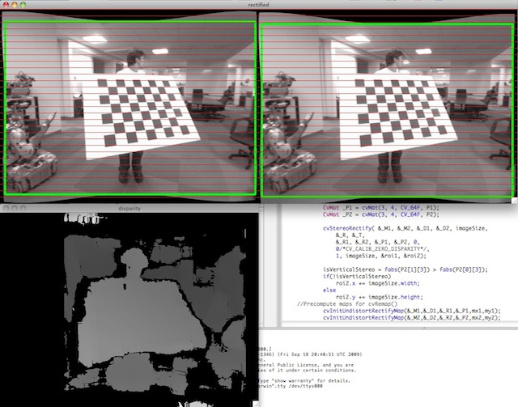

Camera Calibration and 3D Reconstruction
========================================

.. highlight:: cpp

The functions in this section use the so-called pinhole camera model. That
is, a scene view is formed by projecting 3D points into the image plane
using a perspective transformation.

.. math::

    s  \; m' = A [R|t] M'

or

.. math::

    s  \vecthree{u}{v}{1} =  \vecthreethree{f_x}{0}{c_x}{0}{f_y}{c_y}{0}{0}{1} \begin{bmatrix} r_{11} & r_{12} & r_{13} & t_1  \\ r_{21} & r_{22} & r_{23} & t_2  \\ r_{31} & r_{32} & r_{33} & t_3 \end{bmatrix} \begin{bmatrix} X \\ Y \\ Z \\ 1  \end{bmatrix}

Where
:math:`(X, Y, Z)` are the coordinates of a 3D point in the world
coordinate space,
:math:`(u, v)` are the coordinates of the projection point
in pixels.
:math:`A` is called a camera matrix, or a matrix of
intrinsic parameters.
:math:`(cx, cy)` is a principal point (that is
usually at the image center), and
:math:`fx, fy` are the focal lengths
expressed in pixel-related units. Thus, if an image from camera is
scaled by some factor, all of these parameters should
be scaled (multiplied/divided, respectively) by the same factor. The
matrix of intrinsic parameters does not depend on the scene viewed and,
once estimated, can be re-used (as long as the focal length is fixed (in
case of zoom lens)). The joint rotation-translation matrix
:math:`[R|t]` is called a matrix of extrinsic parameters. It is used to describe the
camera motion around a static scene, or vice versa, rigid motion of an
object in front of still camera. That is,
:math:`[R|t]` translates
coordinates of a point
:math:`(X, Y, Z)` to some coordinate system,
fixed with respect to the camera. The transformation above is equivalent
to the following (when
:math:`z \ne 0` ):

.. math::

    \begin{array}{l} \vecthree{x}{y}{z} = R  \vecthree{X}{Y}{Z} + t \\ x' = x/z \\ y' = y/z \\ u = f_x*x' + c_x \\ v = f_y*y' + c_y \end{array}

Real lenses usually have some distortion, mostly
radial distortion and slight tangential distortion. So, the above model
is extended as:

.. math::

    \begin{array}{l} \vecthree{x}{y}{z} = R  \vecthree{X}{Y}{Z} + t \\ x' = x/z \\ y' = y/z \\ x'' = x'  \frac{1 + k_1 r^2 + k_2 r^4 + k_3 r^6}{1 + k_4 r^2 + k_5 r^4 + k_6 r^6} + 2 p_1 x' y' + p_2(r^2 + 2 x'^2)  \\ y'' = y'  \frac{1 + k_1 r^2 + k_2 r^4 + k_3 r^6}{1 + k_4 r^2 + k_5 r^4 + k_6 r^6} + p_1 (r^2 + 2 y'^2) + 2 p_2 x' y'  \\ \text{where} \quad r^2 = x'^2 + y'^2  \\ u = f_x*x'' + c_x \\ v = f_y*y'' + c_y \end{array}

:math:`k_1`,:math:`k_2`,:math:`k_3`,:math:`k_4`,:math:`k_5`,:math:`k_6` are radial distortion coefficients,
:math:`p_1`,:math:`p_2` are tangential distortion coefficients.
Higher-order coefficients are not considered in OpenCV. In the functions below the coefficients are passed or returned as

.. math::

    (k_1, k_2, p_1, p_2[, k_3[, k_4, k_5, k_6]])

vector. That is, if the vector contains 4 elements, it means that
:math:`k_3=0` .
The distortion coefficients do not depend on the scene viewed, thus they also belong to the intrinsic camera parameters.
*And they remain the same regardless of the captured image resolution.*
That is, if, for example, a camera has been calibrated on images of
:math:`320
\times 240` resolution, absolutely the same distortion coefficients can
be used for images of
:math:`640 \times 480` resolution from the same camera (while
:math:`f_x`,:math:`f_y`,:math:`c_x` and
:math:`c_y` need to be scaled appropriately).

The functions below use the above model to

*
    Project 3D points to the image plane given intrinsic and extrinsic parameters

*
    Compute extrinsic parameters given intrinsic parameters, a few 3D points and their projections.

*
    Estimate intrinsic and extrinsic camera parameters from several views of a known calibration pattern (i.e. every view is described by several 3D-2D point correspondences).

*
    Estimate the relative position and orientation of the stereo camera "heads" and compute the
    *rectification*
    transformation that makes the camera optical axes parallel.

.. index:: calibrateCamera

cv::calibrateCamera
-------------------
.. cfunction:: double calibrateCamera( const vector<vector<Point3f> >\& objectPoints,                      const vector<vector<Point2f> >\& imagePoints,                      Size imageSize,                      Mat\& cameraMatrix, Mat\& distCoeffs,                      vector<Mat>\& rvecs, vector<Mat>\& tvecs,                      int flags=0 )

    Finds the camera intrinsic and extrinsic parameters from several views of a calibration pattern.

    :param objectPoints: The vector of vectors of points on the calibration pattern in its coordinate system, one vector per view. If the same calibration pattern is shown in each view and it's fully visible then all the vectors will be the same, although it is possible to use partially occluded patterns, or even different patterns in different views - then the vectors will be different. The points are 3D, but since they are in the pattern coordinate system, then if the rig is planar, it may have sense to put the model to the XY coordinate plane, so that Z-coordinate of each input object point is 0

    :param imagePoints: The vector of vectors of the object point projections on the calibration pattern views, one vector per a view. The projections must be in the same order as the corresponding object points.

    :param imageSize: Size of the image, used only to initialize the intrinsic camera matrix

    :param cameraMatrix: The output 3x3 floating-point camera matrix  :math:`A = \vecthreethree{f_x}{0}{c_x}{0}{f_y}{c_y}{0}{0}{1}` . If  ``CV_CALIB_USE_INTRINSIC_GUESS``  and/or  ``CV_CALIB_FIX_ASPECT_RATIO``  are specified, some or all of  ``fx, fy, cx, cy``  must be initialized before calling the function

    :param distCoeffs: The output vector of distortion coefficients  :math:`(k_1, k_2, p_1, p_2[, k_3[, k_4, k_5, k_6]])`  of 4, 5 or 8 elements

    :param rvecs: The output  vector   of rotation vectors (see  :ref:`Rodrigues2` ), estimated for each pattern view. That is, each k-th rotation vector together with the corresponding k-th translation vector (see the next output parameter description) brings the calibration pattern from the model coordinate space (in which object points are specified) to the world coordinate space, i.e. real position of the calibration pattern in the k-th pattern view (k=0.. *M* -1)

    :param tvecs: The output  vector   of translation vectors, estimated for each pattern view.

    :param flags: Different flags, may be 0 or combination of the following values:

            * **CV_CALIB_USE_INTRINSIC_GUESS** ``cameraMatrix``  contains the valid initial values of  ``fx, fy, cx, cy``  that are optimized further. Otherwise,  ``(cx, cy)``  is initially set to the image center ( ``imageSize``  is used here), and focal distances are computed in some least-squares fashion. Note, that if intrinsic parameters are known, there is no need to use this function just to estimate the extrinsic parameters. Use  :ref:`FindExtrinsicCameraParams2`  instead.

            * **CV_CALIB_FIX_PRINCIPAL_POINT** The principal point is not changed during the global optimization, it stays at the center or at the other location specified when    ``CV_CALIB_USE_INTRINSIC_GUESS``  is set too.

            * **CV_CALIB_FIX_ASPECT_RATIO** The functions considers only  ``fy``  as a free parameter, the ratio  ``fx/fy``  stays the same as in the input  ``cameraMatrix`` .   When  ``CV_CALIB_USE_INTRINSIC_GUESS``  is not set, the actual input values of  ``fx``  and  ``fy``  are ignored, only their ratio is computed and used further.

            * **CV_CALIB_ZERO_TANGENT_DIST** Tangential distortion coefficients  :math:`(p_1, p_2)`  will be set to zeros and stay zero.

        * **CV_CALIB_FIX_K1,...,CV_CALIB_FIX_K6** Do not change the corresponding radial distortion coefficient during the optimization. If  ``CV_CALIB_USE_INTRINSIC_GUESS``  is set, the coefficient from the supplied  ``distCoeffs``  matrix is used, otherwise it is set to 0.

        * **CV_CALIB_RATIONAL_MODEL** Enable coefficients k4, k5 and k6. To provide the backward compatibility, this extra flag should be explicitly specified to make the calibration function use the rational model and return 8 coefficients. If the flag is not set, the function will compute  and return   only 5 distortion coefficients.

The function estimates the intrinsic camera
parameters and extrinsic parameters for each of the views. The
coordinates of 3D object points and their correspondent 2D projections
in each view must be specified. That may be achieved by using an
object with known geometry and easily detectable feature points.
Such an object is called a calibration rig or calibration pattern,
and OpenCV has built-in support for a chessboard as a calibration
rig (see
:ref:`FindChessboardCorners` ). Currently, initialization
of intrinsic parameters (when ``CV_CALIB_USE_INTRINSIC_GUESS`` is not set) is only implemented for planar calibration patterns
(where z-coordinates of the object points must be all 0's). 3D
calibration rigs can also be used as long as initial ``cameraMatrix`` is provided.

The algorithm does the following:

#.
    First, it computes the initial intrinsic parameters (the option only available for planar calibration patterns) or reads them from the input parameters. The distortion coefficients are all set to zeros initially (unless some of ``CV_CALIB_FIX_K?``     are specified).

#.
    The initial camera pose is estimated as if the intrinsic parameters have been already known. This is done using
    :ref:`FindExtrinsicCameraParams2`
#.
    After that the global Levenberg-Marquardt optimization algorithm is run to minimize the reprojection error, i.e. the total sum of squared distances between the observed feature points ``imagePoints``     and the projected (using the current estimates for camera parameters and the poses) object points ``objectPoints``     ; see
    :ref:`ProjectPoints2`     .

The function returns the final re-projection error.
Note: if you're using a non-square (=non-NxN) grid and
:func:`findChessboardCorners` for calibration, and ``calibrateCamera`` returns
bad values (i.e. zero distortion coefficients, an image center very far from
:math:`(w/2-0.5,h/2-0.5)` , and / or large differences between
:math:`f_x` and
:math:`f_y` (ratios of
10:1 or more)), then you've probably used ``patternSize=cvSize(rows,cols)``,but should use ``patternSize=cvSize(cols,rows)`` in
:ref:`FindChessboardCorners` .

See also:
:ref:`FindChessboardCorners`,:ref:`FindExtrinsicCameraParams2`,:func:`initCameraMatrix2D`,:ref:`StereoCalibrate`,:ref:`Undistort2`
.. index:: calibrationMatrixValues

cv::calibrationMatrixValues
---------------------------
.. cfunction:: void calibrationMatrixValues( const Mat\& cameraMatrix,                              Size imageSize,                              double apertureWidth,                              double apertureHeight,                              double\& fovx,                              double\& fovy,                              double\& focalLength,                              Point2d\& principalPoint,                              double\& aspectRatio )

    Computes some useful camera characteristics from the camera matrix

    :param cameraMatrix: The input camera matrix that can be estimated by  :func:`calibrateCamera`  or  :func:`stereoCalibrate`
    :param imageSize: The input image size in pixels

    :param apertureWidth: Physical width of the sensor

    :param apertureHeight: Physical height of the sensor

    :param fovx: The output field of view in degrees along the horizontal sensor axis

    :param fovy: The output field of view in degrees along the vertical sensor axis

    :param focalLength: The focal length of the lens in mm

    :param principalPoint: The principal point in pixels

    :param aspectRatio: :math:`f_y/f_x`
The function computes various useful camera characteristics from the previously estimated camera matrix.

.. index:: composeRT

cv::composeRT
-------------
.. cfunction:: void composeRT( const Mat\& rvec1, const Mat\& tvec1,                const Mat\& rvec2, const Mat\& tvec2,                Mat\& rvec3, Mat\& tvec3 )

.. cfunction:: void composeRT( const Mat\& rvec1, const Mat\& tvec1,                const Mat\& rvec2, const Mat\& tvec2,                Mat\& rvec3, Mat\& tvec3,                Mat\& dr3dr1, Mat\& dr3dt1,                Mat\& dr3dr2, Mat\& dr3dt2,                Mat\& dt3dr1, Mat\& dt3dt1,                Mat\& dt3dr2, Mat\& dt3dt2 )

    Combines two rotation-and-shift transformations

    :param rvec1: The first rotation vector

    :param tvec1: The first translation vector

    :param rvec2: The second rotation vector

    :param tvec2: The second translation vector

    :param rvec3: The output rotation vector of the superposition

    :param tvec3: The output translation vector of the superposition

    :param d??d??: The optional output derivatives of  ``rvec3``  or  ``tvec3``  w.r.t.  ``rvec?``  or  ``tvec?``
The functions compute:

.. math::

    \begin{array}{l} \texttt{rvec3} =  \mathrm{rodrigues} ^{-1} \left ( \mathrm{rodrigues} ( \texttt{rvec2} )  \cdot \mathrm{rodrigues} ( \texttt{rvec1} ) \right )  \\ \texttt{tvec3} =  \mathrm{rodrigues} ( \texttt{rvec2} )  \cdot \texttt{tvec1} +  \texttt{tvec2} \end{array} ,

where
:math:`\mathrm{rodrigues}` denotes a rotation vector to rotation matrix transformation, and
:math:`\mathrm{rodrigues}^{-1}` denotes the inverse transformation, see
:func:`Rodrigues` .

Also, the functions can compute the derivatives of the output vectors w.r.t the input vectors (see
:func:`matMulDeriv` ).
The functions are used inside
:func:`stereoCalibrate` but can also be used in your own code where Levenberg-Marquardt or another gradient-based solver is used to optimize a function that contains matrix multiplication.

.. index:: computeCorrespondEpilines

cv::computeCorrespondEpilines
-----------------------------
.. cfunction:: void computeCorrespondEpilines( const Mat\& points,                                int whichImage, const Mat\& F,                                vector<Vec3f>\& lines )

    For points in one image of a stereo pair, computes the corresponding epilines in the other image.

    :param points: The input points.  :math:`N \times 1`  or  :math:`1 \times N`  matrix of type  ``CV_32FC2``  or  ``vector<Point2f>``
    :param whichImage: Index of the image (1 or 2) that contains the  ``points``
    :param F: The fundamental matrix that can be estimated using  :ref:`FindFundamentalMat`         or  :ref:`StereoRectify` .

    :param lines: The output vector of the corresponding to the points epipolar lines in the other image.   Each line  :math:`ax + by + c=0`  is encoded by 3 numbers  :math:`(a, b, c)`
For every point in one of the two images of a stereo-pair the function finds the equation of the
corresponding epipolar line in the other image.

From the fundamental matrix definition (see
:ref:`FindFundamentalMat` ),
line
:math:`l^{(2)}_i` in the second image for the point
:math:`p^{(1)}_i` in the first image (i.e. when ``whichImage=1`` ) is computed as:

.. math::

    l^{(2)}_i = F p^{(1)}_i

and, vice versa, when ``whichImage=2``,:math:`l^{(1)}_i` is computed from
:math:`p^{(2)}_i` as:

.. math::

    l^{(1)}_i = F^T p^{(2)}_i

Line coefficients are defined up to a scale. They are normalized, such that
:math:`a_i^2+b_i^2=1` .

.. index:: convertPointsHomogeneous

cv::convertPointsHomogeneous
----------------------------
.. cfunction:: void convertPointsHomogeneous( const Mat\& src, vector<Point3f>\& dst )

.. cfunction:: void convertPointsHomogeneous( const Mat\& src, vector<Point2f>\& dst )

    Convert points to/from homogeneous coordinates.

    :param src: The input array or vector of 2D, 3D or 4D points

    :param dst: The output vector of 2D or 2D points

The
functions convert
2D or 3D points from/to homogeneous coordinates, or simply
copy or transpose
the array. If the input array dimensionality is larger than the output, each coordinate is divided by the last coordinate:

.. math::

    \begin{array}{l} (x,y[,z],w) -> (x',y'[,z']) \\ \text{where} \\ x' = x/w  \\ y' = y/w  \\ z' = z/w  \quad \text{(if output is 3D)} \end{array}

If the output array dimensionality is larger, an extra 1 is appended to each point.  Otherwise, the input array is simply copied (with optional transposition) to the output.

.. index:: decomposeProjectionMatrix

cv::decomposeProjectionMatrix
-----------------------------
.. cfunction:: void decomposeProjectionMatrix( const Mat\& projMatrix,                                Mat\& cameraMatrix,                                Mat\& rotMatrix, Mat\& transVect )

.. cfunction:: void decomposeProjectionMatrix( const Mat\& projMatrix,                                 Mat\& cameraMatrix,                                Mat\& rotMatrix, Mat\& transVect,                                Mat\& rotMatrixX, Mat\& rotMatrixY,                                Mat\& rotMatrixZ, Vec3d\& eulerAngles )

    Decomposes the projection matrix into a rotation matrix and a camera matrix.

    :param projMatrix: The 3x4 input projection matrix P

    :param cameraMatrix: The output 3x3 camera matrix K

    :param rotMatrix: The output 3x3 external rotation matrix R

    :param transVect: The output 4x1 translation vector T

    :param rotMatrX: Optional 3x3 rotation matrix around x-axis

    :param rotMatrY: Optional 3x3 rotation matrix around y-axis

    :param rotMatrZ: Optional 3x3 rotation matrix around z-axis

    :param eulerAngles: Optional 3 points containing the three Euler angles of rotation

The function computes a decomposition of a projection matrix into a calibration and a rotation matrix and the position of the camera.

It optionally returns three rotation matrices, one for each axis, and the three Euler angles that could be used in OpenGL.

The function is based on
:ref:`RQDecomp3x3` .

.. index:: drawChessboardCorners

cv::drawChessboardCorners
-------------------------
.. cfunction:: void drawChessboardCorners( Mat\& image, Size patternSize,                            const Mat\& corners,                            bool patternWasFound )

    Renders the detected chessboard corners.

    :param image: The destination image; it must be an 8-bit color image

    :param patternSize: The number of inner corners per chessboard row and column. (patternSize = cv::Size(points _ per _ row,points _ per _ column) = cv::Size(rows,columns) )

    :param corners: The array of corners detected, this should be the output from findChessboardCorners wrapped in a cv::Mat().

    :param patternWasFound: Indicates whether the complete board was found   or not  . One may just pass the return value  :ref:`FindChessboardCorners`  here

The function draws the individual chessboard corners detected as red circles if the board was not found or as colored corners connected with lines if the board was found.

.. index:: findChessboardCorners

cv::findChessboardCorners
-------------------------
.. cfunction:: bool findChessboardCorners( const Mat\& image, Size patternSize,                            vector<Point2f>\& corners,                            int flags=CV_CALIB_CB_ADAPTIVE_THRESH+                                 CV_CALIB_CB_NORMALIZE_IMAGE )

    Finds the positions of the internal corners of the chessboard.

    :param image: Source chessboard view; it must be an 8-bit grayscale or color image

    :param patternSize: The number of inner corners per chessboard row and column
        ( patternSize = cvSize(points _ per _ row,points _ per _ colum) = cvSize(columns,rows) )

    :param corners: The output array of corners detected

    :param flags: Various operation flags, can be 0 or a combination of the following values:

            * **CV_CALIB_CB_ADAPTIVE_THRESH** use adaptive thresholding to convert the image to black and white, rather than a fixed threshold level (computed from the average image brightness).

            * **CV_CALIB_CB_NORMALIZE_IMAGE** normalize the image gamma with  :ref:`EqualizeHist`  before applying fixed or adaptive thresholding.

            * **CV_CALIB_CB_FILTER_QUADS** use additional criteria (like contour area, perimeter, square-like shape) to filter out false quads that are extracted at the contour retrieval stage.

            * **CALIB_CB_FAST_CHECK** Runs a fast check on the image that looks for chessboard corners, and shortcuts the call if none are found. This can drastically speed up the call in the degenerate condition when
                 no chessboard is observed.

The function attempts to determine
whether the input image is a view of the chessboard pattern and
locate the internal chessboard corners. The function returns a non-zero
value if all of the corners have been found and they have been placed
in a certain order (row by row, left to right in every row),
otherwise, if the function fails to find all the corners or reorder
them, it returns 0. For example, a regular chessboard has 8 x 8
squares and 7 x 7 internal corners, that is, points, where the black
squares touch each other. The coordinates detected are approximate,
and to determine their position more accurately, the user may use
the function
:ref:`FindCornerSubPix` .

Sample usage of detecting and drawing chessboard corners: ::

    Size patternsize(8,6); //interior number of corners
    Mat gray = ....; //source image
    vector<Point2f> corners; //this will be filled by the detected corners

    //CALIB_CB_FAST_CHECK saves a lot of time on images
    //that don't contain any chessboard corners
    bool patternfound = findChessboardCorners(gray, patternsize, corners,
            CALIB_CB_ADAPTIVE_THRESH + CALIB_CB_NORMALIZE_IMAGE
            + CALIB_CB_FAST_CHECK);

    if(patternfound)
      cornerSubPix(gray, corners, Size(11, 11), Size(-1, -1),
        TermCriteria(CV_TERMCRIT_EPS + CV_TERMCRIT_ITER, 30, 0.1));

    drawChessboardCorners(img, patternsize, Mat(corners), patternfound);
..

**Note:**
the function requires some white space (like a square-thick border, the wider the better) around the board to make the detection more robust in various environment (otherwise if there is no border and the background is dark, the outer black squares could not be segmented properly and so the square grouping and ordering algorithm will fail).

.. index:: findCirclesGrid

cv::findCirclesGrid
-------------------
.. cfunction:: bool findCirclesGrid( const Mat\& image, Size patternSize,                            vector<Point2f>\& centers,                            int flags=CALIB_CB_SYMMETRIC_GRID )

    Finds the centers of the cirlces' grid.

    :param image: Source circles' grid view; it must be an 8-bit grayscale or color
        image

    :param patternSize: The number of circles per grid row and column
        ( patternSize = Size( points _ per _ row, points _ per _ colum ) =
        Size( columns, rows ) )

    :param centers: The output array of centers detected

    :param flags: Various operation flags, can be one of the following values:

            * **CALIB_CB_SYMMETRIC_GRID** use symmetric pattern of circles.

            * **CALIB_CB_ASYMMETRIC_GRID** use asymmetric pattern of circles.

The function attempts to determine
whether the input image is a view of the circles' grid pattern and
locate the circles' centers. The function returns a
non-zero value if all of the centers have been found and they have been placed
in a certain order (row by row, left to right in every row),
otherwise, if the function fails to find all the corners or reorder
them, it returns 0.

Sample usage of detecting and drawing circles' centers: ::

    Size patternsize(7,7); //number of centers
    Mat gray = ....; //source image
    vector<Point2f> centers; //this will be filled by the detected centers

    bool patternfound = findCirclesGrid(gray, patternsize, centers);

    drawChessboardCorners(img, patternsize, Mat(centers), patternfound);
..

**Note:**
the function requires some white space (like a square-thick border, the wider the better) around the board to make the detection more robust in various environment.

.. index:: solvePnP

cv::solvePnP
------------
.. cfunction:: void solvePnP( const Mat\& objectPoints,               const Mat\& imagePoints,               const Mat\& cameraMatrix,               const Mat\& distCoeffs,               Mat\& rvec, Mat\& tvec,               bool useExtrinsicGuess=false )

    Finds the object pose from the 3D-2D point correspondences

    :param objectPoints: The array of object points in the object coordinate space, 3xN or Nx3 1-channel, or 1xN or Nx1 3-channel, where N is the number of points.  Can also pass  ``vector<Point3f>``  here.

    :param imagePoints: The array of corresponding image points, 2xN or Nx2 1-channel or 1xN or Nx1 2-channel, where N is the number of points.  Can also pass  ``vector<Point2f>``  here.

    :param cameraMatrix: The input camera matrix  :math:`A = \vecthreethree{fx}{0}{cx}{0}{fy}{cy}{0}{0}{1}`
    :param distCoeffs: The input vector of distortion coefficients  :math:`(k_1, k_2, p_1, p_2[, k_3[, k_4, k_5, k_6]])`  of 4, 5 or 8 elements. If the vector is NULL/empty, the zero distortion coefficients are assumed.

    :param rvec: The output rotation vector (see  :ref:`Rodrigues2` ) that (together with  ``tvec`` ) brings points from the model coordinate system to the camera coordinate system

    :param tvec: The output translation vector

    :param useExtrinsicGuess: If true (1), the function will use the provided  ``rvec``  and  ``tvec``  as the initial approximations of the rotation and translation vectors, respectively, and will further optimize them.

The function estimates the object pose given a set of object points, their corresponding image projections, as well as the camera matrix and the distortion coefficients. This function finds such a pose that minimizes reprojection error, i.e. the sum of squared distances between the observed projections ``imagePoints`` and the projected (using
:ref:`ProjectPoints2` ) ``objectPoints`` .

.. index:: findFundamentalMat

cv::findFundamentalMat
----------------------
.. cfunction:: Mat findFundamentalMat( const Mat\& points1, const Mat\& points2,                        vector<uchar>\& status, int method=FM_RANSAC,                        double param1=3., double param2=0.99 )

.. cfunction:: Mat findFundamentalMat( const Mat\& points1, const Mat\& points2,                        int method=FM_RANSAC,                        double param1=3., double param2=0.99 )

    Calculates the fundamental matrix from the corresponding points in two images.

    :param points1: Array of  ``N``  points from the first image. . The point coordinates should be floating-point (single or double precision)

    :param points2: Array of the second image points of the same size and format as  ``points1``
    :param method: Method for computing the fundamental matrix

            * **CV_FM_7POINT** for a 7-point algorithm.  :math:`N = 7`
            * **CV_FM_8POINT** for an 8-point algorithm.  :math:`N \ge 8`
            * **CV_FM_RANSAC** for the RANSAC algorithm.  :math:`N \ge 8`
            * **CV_FM_LMEDS** for the LMedS algorithm.  :math:`N \ge 8`
    :param param1: The parameter is used for RANSAC. It is the maximum distance from point to epipolar line in pixels, beyond which the point is considered an outlier and is not used for computing the final fundamental matrix. It can be set to something like 1-3, depending on the accuracy of the point localization, image resolution and the image noise

    :param param2: The parameter is used for RANSAC or LMedS methods only. It specifies the desirable level of confidence (probability) that the estimated matrix is correct

    :param status: The   output array of N elements, every element of which is set to 0 for outliers and to 1 for the other points. The array is computed only in RANSAC and LMedS methods. For other methods it is set to all 1's

The epipolar geometry is described by the following equation:

.. math::

    [p_2; 1]^T F [p_1; 1] = 0

where
:math:`F` is fundamental matrix,
:math:`p_1` and
:math:`p_2` are corresponding points in the first and the second images, respectively.

The function calculates the fundamental matrix using one of four methods listed above and returns
the found fundamental matrix
. Normally just 1 matrix is found, but in the case of 7-point algorithm the function may return up to 3 solutions (
:math:`9 \times 3` matrix that stores all 3 matrices sequentially).

The calculated fundamental matrix may be passed further to
:ref:`ComputeCorrespondEpilines` that finds the epipolar lines
corresponding to the specified points. It can also be passed to
:ref:`StereoRectifyUncalibrated` to compute the rectification transformation. ::

    // Example. Estimation of fundamental matrix using RANSAC algorithm
    int point_count = 100;
    vector<Point2f> points1(point_count);
    vector<Point2f> points2(point_count);

    // initialize the points here ... */
    for( int i = 0; i < point_count; i++ )
    {
        points1[i] = ...;
        points2[i] = ...;
    }

    Mat fundamental_matrix =
     findFundamentalMat(points1, points2, FM_RANSAC, 3, 0.99);
..

.. index:: findHomography

cv::findHomography
------------------
.. cfunction:: Mat findHomography( const Mat\& srcPoints, const Mat\& dstPoints,                    Mat\& status, int method=0,                    double ransacReprojThreshold=3 )

.. cfunction:: Mat findHomography( const Mat\& srcPoints, const Mat\& dstPoints,                    vector<uchar>\& status, int method=0,                    double ransacReprojThreshold=3 )

.. cfunction:: Mat findHomography( const Mat\& srcPoints, const Mat\& dstPoints,                    int method=0, double ransacReprojThreshold=3 )

    Finds the perspective transformation between two planes.

    :param srcPoints: Coordinates of the points in the original plane, a matrix of type  ``CV_32FC2``  or a  ``vector<Point2f>`` .

    :param dstPoints: Coordinates of the points in the target plane, a matrix of type  ``CV_32FC2``  or a  ``vector<Point2f>`` .

    :param method:  The method used to computed homography matrix; one of the following:

            * **0** a regular method using all the points

            * **CV_RANSAC** RANSAC-based robust method

            * **CV_LMEDS** Least-Median robust method

    :param ransacReprojThreshold: The maximum allowed reprojection error to treat a point pair as an inlier (used in the RANSAC method only). That is, if

        .. math::

            \| \texttt{dstPoints} _i -  \texttt{convertPointsHomogeneous} ( \texttt{H}   \texttt{srcPoints} _i) \|  >  \texttt{ransacReprojThreshold}

        then the point  :math:`i`  is considered an outlier. If  ``srcPoints``  and  ``dstPoints``  are measured in pixels, it usually makes sense to set this parameter somewhere in the range 1 to 10.

    :param status: The optional output mask set by a robust method ( ``CV_RANSAC``  or  ``CV_LMEDS`` ).  *Note that the input mask values are ignored.*

The
functions find and return
the perspective transformation
:math:`H` between the source and the destination planes:

.. math::

    s_i  \vecthree{x'_i}{y'_i}{1} \sim H  \vecthree{x_i}{y_i}{1}

So that the back-projection error

.. math::

    \sum _i \left ( x'_i- \frac{h_{11} x_i + h_{12} y_i + h_{13}}{h_{31} x_i + h_{32} y_i + h_{33}} \right )^2+ \left ( y'_i- \frac{h_{21} x_i + h_{22} y_i + h_{23}}{h_{31} x_i + h_{32} y_i + h_{33}} \right )^2

is minimized. If the parameter ``method`` is set to the default value 0, the function
uses all the point pairs to compute the initial homography estimate with a simple least-squares scheme.

However, if not all of the point pairs (
:math:`srcPoints_i`,:math:`dstPoints_i` ) fit the rigid perspective transformation (i.e. there
are some outliers), this initial estimate will be poor.
In this case one can use one of the 2 robust methods. Both methods, ``RANSAC`` and ``LMeDS`` , try many different random subsets
of the corresponding point pairs (of 4 pairs each), estimate
the homography matrix using this subset and a simple least-square
algorithm and then compute the quality/goodness of the computed homography
(which is the number of inliers for RANSAC or the median re-projection
error for LMeDs). The best subset is then used to produce the initial
estimate of the homography matrix and the mask of inliers/outliers.

Regardless of the method, robust or not, the computed homography
matrix is refined further (using inliers only in the case of a robust
method) with the Levenberg-Marquardt method in order to reduce the
re-projection error even more.

The method ``RANSAC`` can handle practically any ratio of outliers,
but it needs the threshold to distinguish inliers from outliers.
The method ``LMeDS`` does not need any threshold, but it works
correctly only when there are more than 50
%
of inliers. Finally,
if you are sure in the computed features, where can be only some
small noise present, but no outliers, the default method could be the best
choice.

The function is used to find initial intrinsic and extrinsic matrices.
Homography matrix is determined up to a scale, thus it is normalized so that
:math:`h_{33}=1` .

See also:
:ref:`GetAffineTransform`,:ref:`GetPerspectiveTransform`,:ref:`EstimateRigidMotion`,:ref:`WarpPerspective`,:ref:`PerspectiveTransform`
.. index:: getDefaultNewCameraMatrix

cv::getDefaultNewCameraMatrix
-----------------------------
.. cfunction:: Mat getDefaultNewCameraMatrix(                               const Mat\& cameraMatrix,                               Size imgSize=Size(),                               bool centerPrincipalPoint=false )

    Returns the default new camera matrix

    :param cameraMatrix: The input camera matrix

    :param imageSize: The camera view image size in pixels

    :param centerPrincipalPoint: Indicates whether in the new camera matrix the principal point should be at the image center or not

The function returns the camera matrix that is either an exact copy of the input ``cameraMatrix`` (when ``centerPrinicipalPoint=false`` ), or the modified one (when ``centerPrincipalPoint`` =true).

In the latter case the new camera matrix will be:

.. math::

    \begin{bmatrix} f_x && 0 && ( \texttt{imgSize.width} -1)*0.5  \\ 0 && f_y && ( \texttt{imgSize.height} -1)*0.5  \\ 0 && 0 && 1 \end{bmatrix} ,

where
:math:`f_x` and
:math:`f_y` are
:math:`(0,0)` and
:math:`(1,1)` elements of ``cameraMatrix`` , respectively.

By default, the undistortion functions in OpenCV (see ``initUndistortRectifyMap``,``undistort`` ) do not move the principal point. However, when you work with stereo, it's important to move the principal points in both views to the same y-coordinate (which is required by most of stereo correspondence algorithms), and maybe to the same x-coordinate too. So you can form the new camera matrix for each view, where the principal points will be at the center.

.. index:: getOptimalNewCameraMatrix

cv::getOptimalNewCameraMatrix
-----------------------------
.. cfunction:: Mat getOptimalNewCameraMatrix(      const Mat\& cameraMatrix, const Mat\& distCoeffs,      Size imageSize, double alpha, Size newImageSize=Size(),      Rect* validPixROI=0)

    Returns the new camera matrix based on the free scaling parameter

    :param cameraMatrix: The input camera matrix

    :param distCoeffs: The input vector of distortion coefficients  :math:`(k_1, k_2, p_1, p_2[, k_3[, k_4, k_5, k_6]])`  of 4, 5 or 8 elements. If the vector is NULL/empty, the zero distortion coefficients are assumed.

    :param imageSize: The original image size

    :param alpha: The free scaling parameter between 0 (when all the pixels in the undistorted image will be valid) and 1 (when all the source image pixels will be retained in the undistorted image); see  :ref:`StereoRectify`
    :param newCameraMatrix: The output new camera matrix.

    :param newImageSize: The image size after rectification. By default it will be set to  ``imageSize`` .

    :param validPixROI: The optional output rectangle that will outline all-good-pixels region in the undistorted image. See  ``roi1, roi2``  description in  :ref:`StereoRectify`
The function computes
and returns
the optimal new camera matrix based on the free scaling parameter. By varying  this parameter the user may retrieve only sensible pixels ``alpha=0`` , keep all the original image pixels if there is valuable information in the corners ``alpha=1`` , or get something in between. When ``alpha>0`` , the undistortion result will likely have some black pixels corresponding to "virtual" pixels outside of the captured distorted image. The original camera matrix, distortion coefficients, the computed new camera matrix and the ``newImageSize`` should be passed to
:ref:`InitUndistortRectifyMap` to produce the maps for
:ref:`Remap` .

.. index:: initCameraMatrix2D

cv::initCameraMatrix2D
----------------------
.. cfunction:: Mat initCameraMatrix2D( const vector<vector<Point3f> >\& objectPoints,                        const vector<vector<Point2f> >\& imagePoints,                        Size imageSize, double aspectRatio=1.)

    Finds the initial camera matrix from the 3D-2D point correspondences

    :param objectPoints: The vector of vectors of the object points. See  :func:`calibrateCamera`
    :param imagePoints: The vector of vectors of the corresponding image points. See  :func:`calibrateCamera`
    :param imageSize: The image size in pixels; used to initialize the principal point

    :param aspectRatio: If it is zero or negative, both  :math:`f_x`  and  :math:`f_y`  are estimated independently. Otherwise  :math:`f_x = f_y * \texttt{aspectRatio}`
The function estimates and returns the initial camera matrix for camera calibration process.
Currently, the function only supports planar calibration patterns, i.e. patterns where each object point has z-coordinate =0.

.. index:: initUndistortRectifyMap

cv::initUndistortRectifyMap
---------------------------
.. cfunction:: void initUndistortRectifyMap( const Mat\& cameraMatrix,                           const Mat\& distCoeffs, const Mat\& R,                           const Mat\& newCameraMatrix,                           Size size, int m1type,                           Mat\& map1, Mat\& map2 )

    Computes the undistortion and rectification transformation map.

    :param cameraMatrix: The input camera matrix  :math:`A=\vecthreethree{f_x}{0}{c_x}{0}{f_y}{c_y}{0}{0}{1}`
    :param distCoeffs: The input vector of distortion coefficients  :math:`(k_1, k_2, p_1, p_2[, k_3[, k_4, k_5, k_6]])`  of 4, 5 or 8 elements. If the vector is NULL/empty, the zero distortion coefficients are assumed.

    :param R: The optional rectification transformation in object space (3x3 matrix).  ``R1``  or  ``R2`` , computed by  :ref:`StereoRectify`  can be passed here. If the matrix is  empty  , the identity transformation is assumed

    :param newCameraMatrix: The new camera matrix  :math:`A'=\vecthreethree{f_x'}{0}{c_x'}{0}{f_y'}{c_y'}{0}{0}{1}`
    :param size: The undistorted image size

    :param m1type: The type of the first output map, can be  ``CV_32FC1``  or  ``CV_16SC2`` . See  :func:`convertMaps`
    :param map1: The first output map

    :param map2: The second output map

The function computes the joint undistortion+rectification transformation and represents the result in the form of maps for
:ref:`Remap` . The undistorted image will look like the original, as if it was captured with a camera with camera matrix ``=newCameraMatrix`` and zero distortion. In the case of monocular camera ``newCameraMatrix`` is usually equal to ``cameraMatrix`` , or it can be computed by
:ref:`GetOptimalNewCameraMatrix` for a better control over scaling. In the case of stereo camera ``newCameraMatrix`` is normally set to ``P1`` or ``P2`` computed by
:ref:`StereoRectify` .

Also, this new camera will be oriented differently in the coordinate space, according to ``R`` . That, for example, helps to align two heads of a stereo camera so that the epipolar lines on both images become horizontal and have the same y- coordinate (in the case of horizontally aligned stereo camera).

The function actually builds the maps for the inverse mapping algorithm that is used by
:ref:`Remap` . That is, for each pixel
:math:`(u, v)` in the destination (corrected and rectified) image the function computes the corresponding coordinates in the source image (i.e. in the original image from camera). The process is the following:

.. math::

    \begin{array}{l} x  \leftarrow (u - {c'}_x)/{f'}_x  \\ y  \leftarrow (v - {c'}_y)/{f'}_y  \\{[X\,Y\,W]} ^T  \leftarrow R^{-1}*[x \, y \, 1]^T  \\ x'  \leftarrow X/W  \\ y'  \leftarrow Y/W  \\ x"  \leftarrow x' (1 + k_1 r^2 + k_2 r^4 + k_3 r^6) + 2p_1 x' y' + p_2(r^2 + 2 x'^2)  \\ y"  \leftarrow y' (1 + k_1 r^2 + k_2 r^4 + k_3 r^6) + p_1 (r^2 + 2 y'^2) + 2 p_2 x' y'  \\ map_x(u,v)  \leftarrow x" f_x + c_x  \\ map_y(u,v)  \leftarrow y" f_y + c_y \end{array}

where
:math:`(k_1, k_2, p_1, p_2[, k_3])` are the distortion coefficients.

In the case of a stereo camera this function is called twice, once for each camera head, after
:ref:`StereoRectify` , which in its turn is called after
:ref:`StereoCalibrate` . But if the stereo camera was not calibrated, it is still possible to compute the rectification transformations directly from the fundamental matrix using
:ref:`StereoRectifyUncalibrated` . For each camera the function computes homography ``H`` as the rectification transformation in pixel domain, not a rotation matrix ``R`` in 3D space. The ``R`` can be computed from ``H`` as

.. math::

    \texttt{R} =  \texttt{cameraMatrix} ^{-1}  \cdot \texttt{H} \cdot \texttt{cameraMatrix}

where the ``cameraMatrix`` can be chosen arbitrarily.

.. index:: matMulDeriv

cv::matMulDeriv
---------------
.. cfunction:: void matMulDeriv( const Mat\& A, const Mat\& B, Mat\& dABdA, Mat\& dABdB )

    Computes partial derivatives of the matrix product w.r.t each multiplied matrix

    :param A: The first multiplied matrix

    :param B: The second multiplied matrix

    :param dABdA: The first output derivative matrix  ``d(A*B)/dA``  of size  :math:`\texttt{A.rows*B.cols} \times {A.rows*A.cols}`
    :param dABdA: The second output derivative matrix  ``d(A*B)/dB``  of size  :math:`\texttt{A.rows*B.cols} \times {B.rows*B.cols}`
The function computes the partial derivatives of the elements of the matrix product
:math:`A*B` w.r.t. the elements of each of the two input matrices. The function is used to compute Jacobian matrices in
:func:`stereoCalibrate` , but can also be used in any other similar optimization function.

.. index:: projectPoints

cv::projectPoints
-----------------
.. cfunction:: void projectPoints( const Mat\& objectPoints,                    const Mat\& rvec, const Mat\& tvec,                    const Mat\& cameraMatrix,                    const Mat\& distCoeffs,                    vector<Point2f>\& imagePoints )

.. cfunction:: void projectPoints( const Mat\& objectPoints,                    const Mat\& rvec, const Mat\& tvec,                    const Mat\& cameraMatrix,                    const Mat\& distCoeffs,                    vector<Point2f>\& imagePoints,                    Mat\& dpdrot, Mat\& dpdt, Mat\& dpdf,                    Mat\& dpdc, Mat\& dpddist,                    double aspectRatio=0 )

    Project 3D points on to an image plane.

    :param objectPoints: The array of object points, 3xN or Nx3 1-channel or 1xN or Nx1 3-channel  (or  ``vector<Point3f>`` )  , where N is the number of points in the view

    :param rvec: The rotation vector, see  :ref:`Rodrigues2`
    :param tvec: The translation vector

    :param cameraMatrix: The camera matrix  :math:`A = \vecthreethree{f_x}{0}{c_x}{0}{f_y}{c_y}{0}{0}{_1}`
    :param distCoeffs: The input vector of distortion coefficients  :math:`(k_1, k_2, p_1, p_2[, k_3[, k_4, k_5, k_6]])`  of 4, 5 or 8 elements. If the vector is NULL/empty, the zero distortion coefficients are assumed.

    :param imagePoints: The output array of image points, 2xN or Nx2 1-channel or 1xN or Nx1 2-channel  (or  ``vector<Point2f>`` )

    :param dpdrot: Optional 2Nx3 matrix of derivatives of image points with respect to components of the rotation vector

    :param dpdt: Optional 2Nx3 matrix of derivatives of image points with respect to components of the translation vector

    :param dpdf: Optional 2Nx2 matrix of derivatives of image points with respect to  :math:`f_x`  and  :math:`f_y`
    :param dpdc: Optional 2Nx2 matrix of derivatives of image points with respect to  :math:`c_x`  and  :math:`c_y`
    :param dpddist: Optional 2Nx4 matrix of derivatives of image points with respect to distortion coefficients

The function computes projections of 3D
points to the image plane given intrinsic and extrinsic camera
parameters. Optionally, the function computes jacobians - matrices
of partial derivatives of image points coordinates (as functions of all the
input parameters) with respect to the particular parameters, intrinsic and/or
extrinsic. The jacobians are used during the global optimization
in
:ref:`CalibrateCamera2`,:ref:`FindExtrinsicCameraParams2` and
:ref:`StereoCalibrate` . The
function itself can also used to compute re-projection error given the
current intrinsic and extrinsic parameters.

Note, that by setting ``rvec=tvec=(0,0,0)`` , or by setting ``cameraMatrix`` to 3x3 identity matrix, or by passing zero distortion coefficients, you can get various useful partial cases of the function, i.e. you can compute the distorted coordinates for a sparse set of points, or apply a perspective transformation (and also compute the derivatives) in the ideal zero-distortion setup etc.

.. index:: reprojectImageTo3D

cv::reprojectImageTo3D
----------------------
.. cfunction:: void reprojectImageTo3D( const Mat\& disparity,                         Mat\& _3dImage, const Mat\& Q,                         bool handleMissingValues=false )

    Reprojects disparity image to 3D space.

    :param disparity: The input single-channel 16-bit signed or 32-bit floating-point disparity image

    :param _3dImage: The output 3-channel floating-point image of the same size as  ``disparity`` .
         Each element of  ``_3dImage(x,y)``  will contain the 3D coordinates of the point  ``(x,y)`` , computed from the disparity map.

    :param Q: The  :math:`4 \times 4`  perspective transformation matrix that can be obtained with  :ref:`StereoRectify`
    :param handleMissingValues: If true, when the pixels with the minimal disparity (that corresponds to the outliers; see  :ref:`FindStereoCorrespondenceBM` ) will be transformed to 3D points with some very large Z value (currently set to 10000)

The function transforms 1-channel disparity map to 3-channel image representing a 3D surface. That is, for each pixel ``(x,y)`` and the corresponding disparity ``d=disparity(x,y)`` it computes:

.. math::

    \begin{array}{l} [X \; Y \; Z \; W]^T =  \texttt{Q} *[x \; y \; \texttt{disparity} (x,y) \; 1]^T  \\ \texttt{\_3dImage} (x,y) = (X/W, \; Y/W, \; Z/W) \end{array}

The matrix ``Q`` can be arbitrary
:math:`4 \times 4` matrix, e.g. the one computed by
:ref:`StereoRectify` . To reproject a sparse set of points {(x,y,d),...} to 3D space, use
:ref:`PerspectiveTransform` .

.. index:: RQDecomp3x3

cv::RQDecomp3x3
---------------
.. cfunction:: void RQDecomp3x3( const Mat\& M, Mat\& R, Mat\& Q )

.. cfunction:: Vec3d RQDecomp3x3( const Mat\& M, Mat\& R, Mat\& Q,                   Mat\& Qx, Mat\& Qy, Mat\& Qz )

    Computes the 'RQ' decomposition of 3x3 matrices.

    :param M: The 3x3 input matrix

    :param R: The output 3x3 upper-triangular matrix

    :param Q: The output 3x3 orthogonal matrix

    :param Qx: Optional 3x3 rotation matrix around x-axis

    :param Qy: Optional 3x3 rotation matrix around y-axis

    :param Qz: Optional 3x3 rotation matrix around z-axis

The function computes a RQ decomposition using the given rotations. This function is used in
:ref:`DecomposeProjectionMatrix` to decompose the left 3x3 submatrix of a projection matrix into a camera and a rotation matrix.

It optionally returns three rotation matrices, one for each axis, and the three Euler angles
(as the return value)
that could be used in OpenGL.

.. index:: Rodrigues

cv::Rodrigues
-------------
.. cfunction:: void Rodrigues(const Mat\& src, Mat\& dst)

.. cfunction:: void Rodrigues(const Mat\& src, Mat\& dst, Mat\& jacobian)

    Converts a rotation matrix to a rotation vector or vice versa.

    :param src: The input rotation vector (3x1 or 1x3) or rotation matrix (3x3)

    :param dst: The output rotation matrix (3x3) or rotation vector (3x1 or 1x3), respectively

    :param jacobian: Optional output Jacobian matrix, 3x9 or 9x3 - partial derivatives of the output array components with respect to the input array components

.. math::

    \begin{array}{l} \theta \leftarrow norm(r) \\ r  \leftarrow r/ \theta \\ R =  \cos{\theta} I + (1- \cos{\theta} ) r r^T +  \sin{\theta} \vecthreethree{0}{-r_z}{r_y}{r_z}{0}{-r_x}{-r_y}{r_x}{0} \end{array}

Inverse transformation can also be done easily, since

.. math::

    \sin ( \theta ) \vecthreethree{0}{-r_z}{r_y}{r_z}{0}{-r_x}{-r_y}{r_x}{0} = \frac{R - R^T}{2}

A rotation vector is a convenient and most-compact representation of a rotation matrix
(since any rotation matrix has just 3 degrees of freedom). The representation is
used in the global 3D geometry optimization procedures like
:ref:`CalibrateCamera2`,:ref:`StereoCalibrate` or
:ref:`FindExtrinsicCameraParams2` .

.. index:: StereoBM

.. _StereoBM:

StereoBM
--------
.. ctype:: StereoBM

The class for computing stereo correspondence using block matching algorithm. ::

    // Block matching stereo correspondence algorithmclass StereoBM
    {
        enum { NORMALIZED_RESPONSE = CV_STEREO_BM_NORMALIZED_RESPONSE,
            BASIC_PRESET=CV_STEREO_BM_BASIC,
            FISH_EYE_PRESET=CV_STEREO_BM_FISH_EYE,
            NARROW_PRESET=CV_STEREO_BM_NARROW };

        StereoBM();
        // the preset is one of ..._PRESET above.
        // ndisparities is the size of disparity range,
        // in which the optimal disparity at each pixel is searched for.
        // SADWindowSize is the size of averaging window used to match pixel blocks
        //    (larger values mean better robustness to noise, but yield blurry disparity maps)
        StereoBM(int preset, int ndisparities=0, int SADWindowSize=21);
        // separate initialization function
        void init(int preset, int ndisparities=0, int SADWindowSize=21);
        // computes the disparity for the two rectified 8-bit single-channel images.
        // the disparity will be 16-bit signed (fixed-point) or 32-bit floating-point image of the same size as left.
        void operator()( const Mat& left, const Mat& right, Mat& disparity, int disptype=CV_16S );

        Ptr<CvStereoBMState> state;
    };
..

The class is a C++ wrapper for
and the associated functions. In particular, ``StereoBM::operator ()`` is the wrapper for
:ref:`FindStereoCorrespondceBM` . See the respective descriptions.

.. index:: StereoSGBM

.. _StereoSGBM:

StereoSGBM
----------
.. ctype:: StereoSGBM

The class for computing stereo correspondence using semi-global block matching algorithm. ::

    class StereoSGBM
    {
        StereoSGBM();
        StereoSGBM(int minDisparity, int numDisparities, int SADWindowSize,
                   int P1=0, int P2=0, int disp12MaxDiff=0,
                   int preFilterCap=0, int uniquenessRatio=0,
                   int speckleWindowSize=0, int speckleRange=0,
                   bool fullDP=false);
        virtual ~StereoSGBM();

        virtual void operator()(const Mat& left, const Mat& right, Mat& disp);

        int minDisparity;
        int numberOfDisparities;
        int SADWindowSize;
        int preFilterCap;
        int uniquenessRatio;
        int P1, P2;
        int speckleWindowSize;
        int speckleRange;
        int disp12MaxDiff;
        bool fullDP;

        ...
    };
..

The class implements modified H. Hirschmuller algorithm
HH08
. The main differences between the implemented algorithm and the original one are:

*
    by default the algorithm is single-pass, i.e. instead of 8 directions we only consider 5. Set ``fullDP=true``     to run the full variant of the algorithm (which could consume
    *a lot*
    of memory)

*
    the algorithm matches blocks, not individual pixels (though, by setting ``SADWindowSize=1``     the blocks are reduced to single pixels)

*
    mutual information cost function is not implemented. Instead, we use a simpler Birchfield-Tomasi sub-pixel metric from
    BT96
    , though the color images are supported as well.

*
    we include some pre- and post- processing steps from K. Konolige algorithm
    :ref:`FindStereoCorrespondceBM`     , such as pre-filtering ( ``CV_STEREO_BM_XSOBEL``     type) and post-filtering (uniqueness check, quadratic interpolation and speckle filtering)

.. index:: StereoSGBM::StereoSGBM

cv::StereoSGBM::StereoSGBM
--------------------------
.. cfunction:: StereoSGBM::StereoSGBM()

.. cfunction:: StereoSGBM::StereoSGBM(              int minDisparity, int numDisparities, int SADWindowSize,             int P1=0, int P2=0, int disp12MaxDiff=0,             int preFilterCap=0, int uniquenessRatio=0,             int speckleWindowSize=0, int speckleRange=0,             bool fullDP=false)

    StereoSGBM constructors

    :param minDisparity: The minimum possible disparity value. Normally it is 0, but sometimes rectification algorithms can shift images, so this parameter needs to be adjusted accordingly

    :param numDisparities: This is maximum disparity minus minimum disparity. Always greater than 0. In the current implementation this parameter must be divisible by 16.

    :param SADWindowSize: The matched block size. Must be an odd number  ``>=1`` . Normally, it should be somewhere in  ``3..11``  range

    .

    :param P1, P2: Parameters that control disparity smoothness. The larger the values, the smoother the disparity.  ``P1``  is the penalty on the disparity change by plus or minus 1 between neighbor pixels.  ``P2``  is the penalty on the disparity change by more than 1 between neighbor pixels. The algorithm requires  ``P2 > P1`` . See  ``stereo_match.cpp``  sample where some reasonably good  ``P1``  and  ``P2``  values are shown (like  ``8*number_of_image_channels*SADWindowSize*SADWindowSize``  and  ``32*number_of_image_channels*SADWindowSize*SADWindowSize`` , respectively).

    :param disp12MaxDiff: Maximum allowed difference (in integer pixel units) in the left-right disparity check. Set it to non-positive value to disable the check.

    :param preFilterCap: Truncation value for the prefiltered image pixels. The algorithm first computes x-derivative at each pixel and clips its value by  ``[-preFilterCap, preFilterCap]``  interval. The result values are passed to the Birchfield-Tomasi pixel cost function.

    :param uniquenessRatio: The margin in percents by which the best (minimum) computed cost function value should "win" the second best value to consider the found match correct. Normally, some value within 5-15 range is good enough

    :param speckleWindowSize: Maximum size of smooth disparity regions to consider them noise speckles and invdalidate. Set it to 0 to disable speckle filtering. Otherwise, set it somewhere in 50-200 range.

    :param speckleRange: Maximum disparity variation within each connected component. If you do speckle filtering, set it to some positive value, multiple of 16. Normally, 16 or 32 is good enough.

    :param fullDP: Set it to  ``true``  to run full-scale 2-pass dynamic programming algorithm. It will consume O(W*H*numDisparities) bytes, which is large for 640x480 stereo and huge for HD-size pictures. By default this is  ``false``
The first constructor initializes ``StereoSGBM`` with all the default parameters (so actually one will only have to set ``StereoSGBM::numberOfDisparities`` at minimum). The second constructor allows you to set each parameter to a custom value.

.. index:: StereoSGBM::operator ()

cv::StereoSGBM::operator ()
---------------------------
.. cfunction:: void SGBM::operator()(const Mat\& left, const Mat\& right, Mat\& disp)

    Computes disparity using SGBM algorithm for a rectified stereo pair

    :param left: The left image, 8-bit single-channel or 3-channel.

    :param right: The right image of the same size and the same type as the left one.

    :param disp: The output disparity map. It will be 16-bit signed single-channel image of the same size as the input images. It will contain scaled by 16 disparity values, so that to get the floating-point disparity map, you will need to divide each  ``disp``  element by 16.

The method executes SGBM algorithm on a rectified stereo pair. See ``stereo_match.cpp`` OpenCV sample on how to prepare the images and call the method. Note that the method is not constant, thus you should not use the same ``StereoSGBM`` instance from within different threads simultaneously.

.. index:: stereoCalibrate

cv::stereoCalibrate
-------------------
.. cfunction:: double stereoCalibrate( const vector<vector<Point3f> >\& objectPoints,                      const vector<vector<Point2f> >\& imagePoints1,                      const vector<vector<Point2f> >\& imagePoints2,                      Mat\& cameraMatrix1, Mat\& distCoeffs1,                      Mat\& cameraMatrix2, Mat\& distCoeffs2,                      Size imageSize, Mat\& R, Mat\& T,                      Mat\& E, Mat\& F,                      TermCriteria term_crit = TermCriteria(TermCriteria::COUNT+                         TermCriteria::EPS, 30, 1e-6),                      int flags=CALIB_FIX_INTRINSIC )

    Calibrates stereo camera.

    :param objectPoints: The vector of vectors of points on the calibration pattern in its coordinate system, one vector per view. If the same calibration pattern is shown in each view and it's fully visible then all the vectors will be the same, although it is possible to use partially occluded patterns, or even different patterns in different views - then the vectors will be different. The points are 3D, but since they are in the pattern coordinate system, then if the rig is planar, it may have sense to put the model to the XY coordinate plane, so that Z-coordinate of each input object point is 0

    :param imagePoints1: The vector of vectors of the object point projections on the calibration pattern views from the 1st camera, one vector per a view. The projections must be in the same order as the corresponding object points.

    :param imagePoints2: The vector of vectors of the object point projections on the calibration pattern views from the 2nd camera, one vector per a view. The projections must be in the same order as the corresponding object points.

    :param cameraMatrix1: The input/output first camera matrix:  :math:`\vecthreethree{f_x^{(j)}}{0}{c_x^{(j)}}{0}{f_y^{(j)}}{c_y^{(j)}}{0}{0}{1}` ,  :math:`j = 0,\, 1` . If any of  ``CV_CALIB_USE_INTRINSIC_GUESS`` ,    ``CV_CALIB_FIX_ASPECT_RATIO`` ,  ``CV_CALIB_FIX_INTRINSIC``  or  ``CV_CALIB_FIX_FOCAL_LENGTH``  are specified, some or all of the matrices' components must be initialized; see the flags description

    :param distCoeffs: The input/output vector of distortion coefficients  :math:`(k_1, k_2, p_1, p_2[, k_3[, k_4, k_5, k_6]])`  of 4, 5 or 8 elements.  On output vector length depends on the flags.

    :param cameraMatrix2: The input/output second camera matrix, as cameraMatrix1.

    :param distCoeffs2: The input/output lens distortion coefficients for the second camera, as  ``distCoeffs1`` .

    :param imageSize: Size of the image, used only to initialize intrinsic camera matrix.

    :param R: The output rotation matrix between the 1st and the 2nd cameras' coordinate systems.

    :param T: The output translation vector between the cameras' coordinate systems.

    :param E: The   output essential matrix.

    :param F: The   output fundamental matrix.

    :param term_crit: The termination criteria for the iterative optimization algorithm.

    :param flags: Different flags, may be 0 or combination of the following values:

            * **CV_CALIB_FIX_INTRINSIC** If it is set,  ``cameraMatrix?`` , as well as  ``distCoeffs?``  are fixed, so that only  ``R, T, E``  and  ``F``  are estimated.

            * **CV_CALIB_USE_INTRINSIC_GUESS** The flag allows the function to optimize some or all of the intrinsic parameters, depending on the other flags, but the initial values are provided by the user.

            * **CV_CALIB_FIX_PRINCIPAL_POINT** The principal points are fixed during the optimization.

            * **CV_CALIB_FIX_FOCAL_LENGTH** :math:`f^{(j)}_x`  and  :math:`f^{(j)}_y`  are fixed.

            * **CV_CALIB_FIX_ASPECT_RATIO** :math:`f^{(j)}_y`  is optimized, but the ratio  :math:`f^{(j)}_x/f^{(j)}_y`  is fixed.

            * **CV_CALIB_SAME_FOCAL_LENGTH** Enforces  :math:`f^{(0)}_x=f^{(1)}_x`  and  :math:`f^{(0)}_y=f^{(1)}_y`
            * **CV_CALIB_ZERO_TANGENT_DIST** Tangential distortion coefficients for each camera are set to zeros and fixed there.

            * **CV_CALIB_FIX_K1,...,CV_CALIB_FIX_K6** Do not change the corresponding radial distortion coefficient during the optimization. If  ``CV_CALIB_USE_INTRINSIC_GUESS``  is set, the coefficient from the supplied  ``distCoeffs``  matrix is used, otherwise it is set to 0.

            * **CV_CALIB_RATIONAL_MODEL** Enable coefficients k4, k5 and k6. To provide the backward compatibility, this extra flag should be explicitly specified to make the calibration function use the rational model and return 8 coefficients. If the flag is not set, the function will compute  and return   only 5 distortion coefficients.

The function estimates transformation between the 2 cameras making a stereo pair. If we have a stereo camera, where the relative position and orientation of the 2 cameras is fixed, and if we computed poses of an object relative to the fist camera and to the second camera, (R1, T1) and (R2, T2), respectively (that can be done with
:ref:`FindExtrinsicCameraParams2` ), obviously, those poses will relate to each other, i.e. given (
:math:`R_1`,:math:`T_1` ) it should be possible to compute (
:math:`R_2`,:math:`T_2` ) - we only need to know the position and orientation of the 2nd camera relative to the 1st camera. That's what the described function does. It computes (
:math:`R`,:math:`T` ) such that:

.. math::

    R_2=R*R_1
    T_2=R*T_1 + T,

Optionally, it computes the essential matrix E:

.. math::

    E= \vecthreethree{0}{-T_2}{T_1}{T_2}{0}{-T_0}{-T_1}{T_0}{0} *R

where
:math:`T_i` are components of the translation vector
:math:`T` :
:math:`T=[T_0, T_1, T_2]^T` . And also the function can compute the fundamental matrix F:

.. math::

    F = cameraMatrix2^{-T} E cameraMatrix1^{-1}

Besides the stereo-related information, the function can also perform full calibration of each of the 2 cameras. However, because of the high dimensionality of the parameter space and noise in the input data the function can diverge from the correct solution. Thus, if intrinsic parameters can be estimated with high accuracy for each of the cameras individually (e.g. using
:ref:`CalibrateCamera2` ), it is recommended to do so and then pass ``CV_CALIB_FIX_INTRINSIC`` flag to the function along with the computed intrinsic parameters. Otherwise, if all the parameters are estimated at once, it makes sense to restrict some parameters, e.g. pass ``CV_CALIB_SAME_FOCAL_LENGTH`` and ``CV_CALIB_ZERO_TANGENT_DIST`` flags, which are usually reasonable assumptions.

Similarly to
:ref:`CalibrateCamera2` , the function minimizes the total re-projection error for all the points in all the available views from both cameras.
The function returns the final value of the re-projection error.

.. index:: stereoRectify

cv::stereoRectify
-----------------
.. cfunction:: void stereoRectify( const Mat\& cameraMatrix1, const Mat\& distCoeffs1,                    const Mat\& cameraMatrix2, const Mat\& distCoeffs2,                    Size imageSize, const Mat\& R, const Mat\& T,                    Mat\& R1, Mat\& R2, Mat\& P1, Mat\& P2, Mat\& Q,                    int flags=CALIB_ZERO_DISPARITY )

.. cfunction:: void stereoRectify( const Mat\& cameraMatrix1, const Mat\& distCoeffs1,                    const Mat\& cameraMatrix2, const Mat\& distCoeffs2,                    Size imageSize, const Mat\& R, const Mat\& T,                    Mat\& R1, Mat\& R2, Mat\& P1, Mat\& P2, Mat\& Q,                    double alpha, Size newImageSize=Size(),                    Rect* roi1=0, Rect* roi2=0,                    int flags=CALIB_ZERO_DISPARITY )

    Computes rectification transforms for each head of a calibrated stereo camera.

    :param cameraMatrix1, cameraMatrix2: The camera matrices  :math:`\vecthreethree{f_x^{(j)}}{0}{c_x^{(j)}}{0}{f_y^{(j)}}{c_y^{(j)}}{0}{0}{1}` .

    :param distCoeffs: The input vectors of distortion coefficients  :math:`(k_1, k_2, p_1, p_2[, k_3[, k_4, k_5, k_6]])`  of 4, 5 or 8 elements each. If the vectors are NULL/empty, the zero distortion coefficients are assumed.

    :param imageSize: Size of the image used for stereo calibration.

    :param R: The rotation matrix between the 1st and the 2nd cameras' coordinate systems.

    :param T: The translation vector between the cameras' coordinate systems.

    :param R1, R2: The output  :math:`3 \times 3`  rectification transforms (rotation matrices) for the first and the second cameras, respectively.

    :param P1, P2: The output  :math:`3 \times 4`  projection matrices in the new (rectified) coordinate systems.

    :param Q: The output  :math:`4 \times 4`  disparity-to-depth mapping matrix, see  :func:`reprojectImageTo3D` .

    :param flags: The operation flags; may be 0 or  ``CV_CALIB_ZERO_DISPARITY`` . If the flag is set, the function makes the principal points of each camera have the same pixel coordinates in the rectified views. And if the flag is not set, the function may still shift the images in horizontal or vertical direction (depending on the orientation of epipolar lines) in order to maximize the useful image area.

    :param alpha: The free scaling parameter. If it is -1  or absent  , the functions performs some default scaling. Otherwise the parameter should be between 0 and 1.  ``alpha=0``  means that the rectified images will be zoomed and shifted so that only valid pixels are visible (i.e. there will be no black areas after rectification).  ``alpha=1``  means that the rectified image will be decimated and shifted so that all the pixels from the original images from the cameras are retained in the rectified images, i.e. no source image pixels are lost. Obviously, any intermediate value yields some intermediate result between those two extreme cases.

    :param newImageSize: The new image resolution after rectification. The same size should be passed to  :ref:`InitUndistortRectifyMap` , see the  ``stereo_calib.cpp``  sample in OpenCV samples directory. By default, i.e. when (0,0) is passed, it is set to the original  ``imageSize`` . Setting it to larger value can help you to preserve details in the original image, especially when there is big radial distortion.

    :param roi1, roi2: The optional output rectangles inside the rectified images where all the pixels are valid. If  ``alpha=0`` , the ROIs will cover the whole images, otherwise they likely be smaller, see the picture below

The function computes the rotation matrices for each camera that (virtually) make both camera image planes the same plane. Consequently, that makes all the epipolar lines parallel and thus simplifies the dense stereo correspondence problem. On input the function takes the matrices computed by
:func:`stereoCalibrate` and on output it gives 2 rotation matrices and also 2 projection matrices in the new coordinates. The 2 cases are distinguished by the function are:

#.
    Horizontal stereo, when 1st and 2nd camera views are shifted relative to each other mainly along the x axis (with possible small vertical shift). Then in the rectified images the corresponding epipolar lines in left and right cameras will be horizontal and have the same y-coordinate. P1 and P2 will look as:

    .. math::

        \texttt{P1} = \begin{bmatrix} f & 0 & cx_1 & 0 \\ 0 & f & cy & 0 \\ 0 & 0 & 1 & 0 \end{bmatrix}

    .. math::

        \texttt{P2} = \begin{bmatrix} f & 0 & cx_2 & T_x*f \\ 0 & f & cy & 0 \\ 0 & 0 & 1 & 0 \end{bmatrix} ,

    where
    :math:`T_x`     is horizontal shift between the cameras and
    :math:`cx_1=cx_2`     if ``CV_CALIB_ZERO_DISPARITY``     is set.

#.
    Vertical stereo, when 1st and 2nd camera views are shifted relative to each other mainly in vertical direction (and probably a bit in the horizontal direction too). Then the epipolar lines in the rectified images will be vertical and have the same x coordinate. P2 and P2 will look as:

    .. math::

        \texttt{P1} = \begin{bmatrix} f & 0 & cx & 0 \\ 0 & f & cy_1 & 0 \\ 0 & 0 & 1 & 0 \end{bmatrix}

    .. math::

        \texttt{P2} = \begin{bmatrix} f & 0 & cx & 0 \\ 0 & f & cy_2 & T_y*f \\ 0 & 0 & 1 & 0 \end{bmatrix} ,

    where
    :math:`T_y`     is vertical shift between the cameras and
    :math:`cy_1=cy_2`     if ``CALIB_ZERO_DISPARITY``     is set.

As you can see, the first 3 columns of ``P1`` and ``P2`` will effectively be the new "rectified" camera matrices.
The matrices, together with ``R1`` and ``R2`` , can then be passed to
:ref:`InitUndistortRectifyMap` to initialize the rectification map for each camera.

Below is the screenshot from ``stereo_calib.cpp`` sample. Some red horizontal lines, as you can see, pass through the corresponding image regions, i.e. the images are well rectified (which is what most stereo correspondence algorithms rely on). The green rectangles are ``roi1`` and ``roi2`` - indeed, their interior are all valid pixels.

.. index:: stereoRectifyUncalibrated

cv::stereoRectifyUncalibrated
-----------------------------
.. cfunction:: bool stereoRectifyUncalibrated( const Mat\& points1,                                const Mat\& points2,                                const Mat\& F, Size imgSize,                                Mat\& H1, Mat\& H2,                                double threshold=5 )

    Computes rectification transform for uncalibrated stereo camera.

    :param points1, points2: The 2 arrays of corresponding 2D points. The same formats as in  :ref:`FindFundamentalMat`  are supported

    :param F: The input fundamental matrix. It can be computed from the same set of point pairs using  :ref:`FindFundamentalMat` .

    :param imageSize: Size of the image.

    :param H1, H2: The output rectification homography matrices for the first and for the second images.

    :param threshold: The optional threshold used to filter out the outliers. If the parameter is greater than zero, then all the point pairs that do not comply the epipolar geometry well enough (that is, the points for which  :math:`|\texttt{points2[i]}^T*\texttt{F}*\texttt{points1[i]}|>\texttt{threshold}` ) are rejected prior to computing the homographies.
        Otherwise all the points are considered inliers.

The function computes the rectification transformations without knowing intrinsic parameters of the cameras and their relative position in space, hence the suffix "Uncalibrated". Another related difference from
:ref:`StereoRectify` is that the function outputs not the rectification transformations in the object (3D) space, but the planar perspective transformations, encoded by the homography matrices ``H1`` and ``H2`` . The function implements the algorithm
Hartley99
.

Note that while the algorithm does not need to know the intrinsic parameters of the cameras, it heavily depends on the epipolar geometry. Therefore, if the camera lenses have significant distortion, it would better be corrected before computing the fundamental matrix and calling this function. For example, distortion coefficients can be estimated for each head of stereo camera separately by using
:ref:`CalibrateCamera2` and then the images can be corrected using
:ref:`Undistort2` , or just the point coordinates can be corrected with
:ref:`UndistortPoints` .

.. index:: undistort

cv::undistort
-------------
.. cfunction:: void undistort( const Mat\& src, Mat\& dst, const Mat\& cameraMatrix,                const Mat\& distCoeffs, const Mat\& newCameraMatrix=Mat() )

    Transforms an image to compensate for lens distortion.

    :param src: The input (distorted) image

    :param dst: The output (corrected) image; will have the same size and the same type as  ``src``
    :param cameraMatrix: The input camera matrix  :math:`A = \vecthreethree{f_x}{0}{c_x}{0}{f_y}{c_y}{0}{0}{1}`
    :param distCoeffs: The input vector of distortion coefficients  :math:`(k_1, k_2, p_1, p_2[, k_3[, k_4, k_5, k_6]])`  of 4, 5 or 8 elements. If the vector is NULL/empty, the zero distortion coefficients are assumed.

    :param newCameraMatrix: Camera matrix of the distorted image. By default it is the same as  ``cameraMatrix`` , but you may additionally scale and shift the result by using some different matrix

The function transforms the image to compensate radial and tangential lens distortion.

The function is simply a combination of
:ref:`InitUndistortRectifyMap` (with unity ``R`` ) and
:ref:`Remap` (with bilinear interpolation). See the former function for details of the transformation being performed.

Those pixels in the destination image, for which there is no correspondent pixels in the source image, are filled with 0's (black color).

The particular subset of the source image that will be visible in the corrected image can be regulated by ``newCameraMatrix`` . You can use
:ref:`GetOptimalNewCameraMatrix` to compute the appropriate ``newCameraMatrix`` , depending on your requirements.

The camera matrix and the distortion parameters can be determined using
:ref:`CalibrateCamera2` . If the resolution of images is different from the used at the calibration stage,
:math:`f_x, f_y, c_x` and
:math:`c_y` need to be scaled accordingly, while the distortion coefficients remain the same.

.. index:: undistortPoints

cv::undistortPoints
-------------------
.. cfunction:: void undistortPoints( const Mat\& src, vector<Point2f>\& dst,                      const Mat\& cameraMatrix, const Mat\& distCoeffs,                      const Mat\& R=Mat(), const Mat\& P=Mat())

.. cfunction:: void undistortPoints( const Mat\& src, Mat\& dst,                      const Mat\& cameraMatrix, const Mat\& distCoeffs,                      const Mat\& R=Mat(), const Mat\& P=Mat())

    Computes the ideal point coordinates from the observed point coordinates.

    :param src: The observed point coordinates, 1xN or Nx1 2-channel (CV _ 32FC2 or CV _ 64FC2).

    :param dst: The output ideal point coordinates, after undistortion and reverse perspective transformation .

    :param cameraMatrix: The camera matrix  :math:`\vecthreethree{f_x}{0}{c_x}{0}{f_y}{c_y}{0}{0}{1}`
    :param distCoeffs: The input vector of distortion coefficients  :math:`(k_1, k_2, p_1, p_2[, k_3[, k_4, k_5, k_6]])`  of 4, 5 or 8 elements. If the vector is NULL/empty, the zero distortion coefficients are assumed.

    :param R: The rectification transformation in object space (3x3 matrix).  ``R1``  or  ``R2`` , computed by  :func:`StereoRectify`  can be passed here. If the matrix is empty, the identity transformation is used

    :param P: The new camera matrix (3x3) or the new projection matrix (3x4).  ``P1``  or  ``P2`` , computed by  :func:`StereoRectify`  can be passed here. If the matrix is empty, the identity new camera matrix is used

The function is similar to
:ref:`Undistort2` and
:ref:`InitUndistortRectifyMap` , but it operates on a sparse set of points instead of a raster image. Also the function does some kind of reverse transformation to
:ref:`ProjectPoints2` (in the case of 3D object it will not reconstruct its 3D coordinates, of course; but for a planar object it will, up to a translation vector, if the proper ``R`` is specified). ::

    // (u,v) is the input point, (u', v') is the output point
    // camera_matrix=[fx 0 cx; 0 fy cy; 0 0 1]
    // P=[fx' 0 cx' tx; 0 fy' cy' ty; 0 0 1 tz]
    x" = (u - cx)/fx
    y" = (v - cy)/fy
    (x',y') = undistort(x",y",dist_coeffs)
    [X,Y,W]T = R*[x' y' 1]T
    x = X/W, y = Y/W
    u' = x*fx' + cx'
    v' = y*fy' + cy',
..

where undistort() is approximate iterative algorithm that estimates the normalized original point coordinates out of the normalized distorted point coordinates ("normalized" means that the coordinates do not depend on the camera matrix).

The function can be used both for a stereo camera head or for monocular camera (when R is
empty
).
