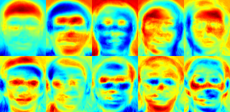
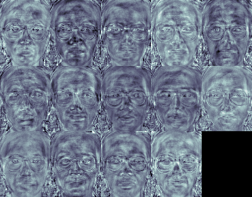
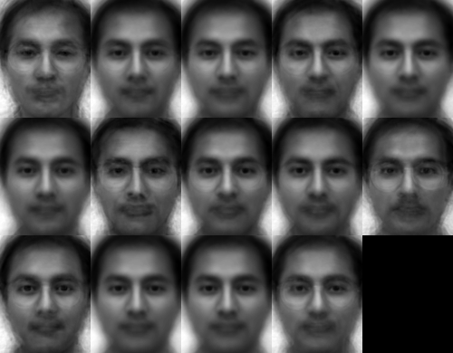
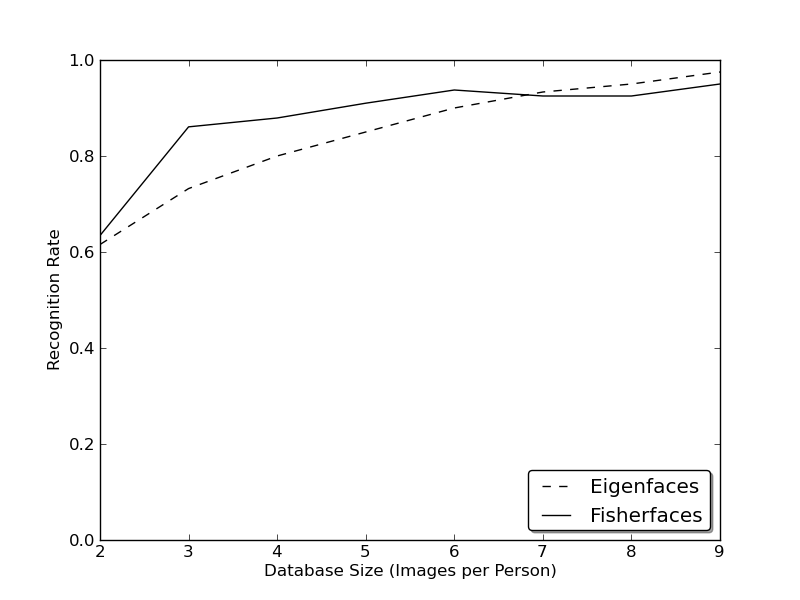
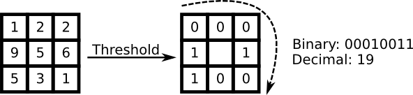
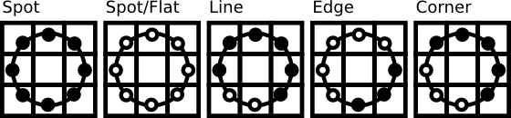
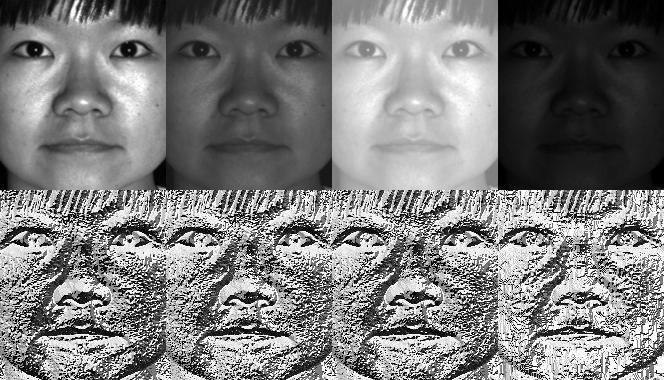

Face Recognition with OpenCV
############################

.. contents:: Table of Contents
   :depth: 3

Introduction
============

`OpenCV (Open Source Computer Vision) <http://opencv.org>`_ is a popular computer vision library started by `Intel <http://www.intel.com>`_ in 1999. The cross-platform library sets its focus on real-time image processing and includes patent-free implementations of the latest computer vision algorithms. In 2008 `Willow Garage <http://www.willowgarage.com>`_ took over support and OpenCV 2.3.1 now comes with a programming interface to C, C++, `Python <http://www.python.org>`_ and `Android <http://www.android.com>`_. OpenCV is released under a BSD license so it is used in academic projects and commercial products alike.

OpenCV 2.4 now comes with the very new :ocv:class:`FaceRecognizer` class for face recognition, so you can start experimenting with face recognition right away. This document is the guide I've wished for, when I was working myself into face recognition. It shows you how to perform face recognition with :ocv:class:`FaceRecognizer` in OpenCV (with full source code listings) and gives you an introduction into the algorithms behind. I'll also show how to create the visualizations you can find in many publications, because a lot of people asked for.

The currently available algorithms are:

* Eigenfaces (see :ocv:func:`createEigenFaceRecognizer`)
* Fisherfaces (see :ocv:func:`createFisherFaceRecognizer`)
* Local Binary Patterns Histograms (see :ocv:func:`createLBPHFaceRecognizer`)

You don't need to copy and paste the source code examples from this page, because they are available in the ``src`` folder coming with this documentation. If you have built OpenCV with the samples turned on, chances are good you have them compiled already! Although it might be interesting for very advanced users, I've decided to leave the implementation details out as I am afraid they confuse new users.

All code in this document is released under the `BSD license <http://www.opensource.org/licenses/bsd-license>`_, so feel free to use it for your projects.

Face Recognition
================

Face recognition is an easy task for humans. Experiments in [Tu06]_ have shown, that even one to three day old babies are able to distinguish between known faces. So how hard could it be for a computer? It turns out we know little about human recognition to date. Are inner features (eyes, nose, mouth) or outer features (head shape, hairline) used for a successful face recognition? How do we analyze an image and how does the brain encode it? It was shown by `David Hubel <http://en.wikipedia.org/wiki/David_H._Hubel>`_ and `Torsten Wiesel <http://en.wikipedia.org/wiki/Torsten_Wiesel>`_, that our brain has specialized nerve cells responding to specific local features of a scene, such as lines, edges, angles or movement. Since we don't see the world as scattered pieces, our visual cortex must somehow combine the different sources of information into useful patterns. Automatic face recognition is all about extracting those meaningful features from an image, putting them into a useful representation and performing some kind of classification on them.

Face recognition based on the geometric features of a face is probably the most intuitive approach to face recognition. One of the first automated face recognition systems was described in [Kanade73]_: marker points (position of eyes, ears, nose, ...) were used to build a feature vector (distance between the points, angle between them, ...). The recognition was performed by calculating the euclidean distance between feature vectors of a probe and reference image. Such a method is robust against changes in illumination by its nature, but has a huge drawback: the accurate registration of the marker points is complicated, even with state of the art algorithms. Some of the latest work on geometric face recognition was carried out in [Bru92]_. A 22-dimensional feature vector was used and experiments on large datasets have shown, that geometrical features alone my not carry enough information for face recognition.

The Eigenfaces method described in [TP91]_ took a holistic approach to face recognition: A facial image is a point from a high-dimensional image space and a lower-dimensional representation is found, where classification becomes easy. The lower-dimensional subspace is found with Principal Component Analysis, which identifies the axes with maximum variance. While this kind of transformation is optimal from a reconstruction standpoint, it doesn't take any class labels into account. Imagine a situation where the variance is generated from external sources, let it be light. The axes with maximum variance do not necessarily contain any discriminative information at all, hence a classification becomes impossible. So a class-specific projection with a Linear Discriminant Analysis was applied to face recognition in [BHK97]_. The basic idea is to minimize the variance within a class, while maximizing the variance between the classes at the same time.

Recently various methods for a local feature extraction emerged. To avoid the high-dimensionality of the input data only local regions of an image are described, the extracted features are (hopefully) more robust against partial occlusion, illumation and small sample size. Algorithms used for a local feature extraction are Gabor Wavelets ([Wiskott97]_), Discrete Cosinus Transform ([Messer06]_) and Local Binary Patterns ([AHP04]_). It's still an open research question what's the best way to preserve spatial information when applying a local feature extraction, because spatial information is potentially useful information.

Face Database
==============

Let's get some data to experiment with first. I don't want to do a toy example here. We are doing face recognition, so you'll need some face images! You can either create your own dataset or start with one of the available face databases, `http://face-rec.org/databases/ <http://face-rec.org/databases>`_ gives you an up-to-date overview. Three interesting databases are (parts of the description are quoted from `http://face-rec.org <http://face-rec.org>`_):

* `AT&T Facedatabase <http://www.cl.cam.ac.uk/research/dtg/attarchive/facedatabase.html>`_ The AT&T Facedatabase, sometimes also referred to as *ORL Database of Faces*, contains ten different images of each of 40 distinct subjects. For some subjects, the images were taken at different times, varying the lighting, facial expressions (open / closed eyes, smiling / not smiling) and facial details (glasses / no glasses). All the images were taken against a dark homogeneous background with the subjects in an upright, frontal position (with tolerance for some side movement).

* `Yale Facedatabase A <http://vision.ucsd.edu/content/yale-face-database>`_, also known as Yalefaces. The AT&T Facedatabase is good for initial tests, but it's a fairly easy database. The Eigenfaces method already has a 97% recognition rate on it, so you won't see any great improvements with other algorithms. The Yale Facedatabase A (also known as Yalefaces) is a more appropriate dataset for initial experiments, because the recognition problem is harder. The database consists of 15 people (14 male, 1 female) each with 11 grayscale images sized :math:`320 \times 243` pixel. There are changes in the light conditions (center light, left light, right light), facial expressions (happy, normal, sad, sleepy, surprised, wink) and glasses (glasses, no-glasses).

  The original images are not cropped and aligned. Please look into the :ref:`appendixft` for a Python script, that does the job for you.

* `Extended Yale Facedatabase B <http://vision.ucsd.edu/~leekc/ExtYaleDatabase/ExtYaleB.html>`_ The Extended Yale Facedatabase B contains 2414 images of 38 different people in its cropped version. The focus of this database is set on extracting features that are robust to illumination, the images have almost no variation in emotion/occlusion/... . I personally think, that this dataset is too large for the experiments I perform in this document. You better use the `AT&T Facedatabase <http://www.cl.cam.ac.uk/research/dtg/attarchive/facedatabase.html>`_ for intial testing. A first version of the Yale Facedatabase B was used in [BHK97]_ to see how the Eigenfaces and Fisherfaces method perform under heavy illumination changes. [Lee05]_ used the same setup to take 16128 images of 28 people. The Extended Yale Facedatabase B is the merge of the two databases, which is now known as Extended Yalefacedatabase B.

Preparing the data
-------------------

Once we have acquired some data, we'll need to read it in our program. In the demo applications I have decided to read the images from a very simple CSV file. Why? Because it's the simplest platform-independent approach I can think of. However, if you know a simpler solution please ping me about it. Basically all the CSV file needs to contain are lines composed of a ``filename`` followed by a ``;`` followed by the ``label`` (as *integer number*), making up a line like this:

.. code-block:: none

    /path/to/image.ext;0

Let's dissect the line. ``/path/to/image.ext`` is the path to an image, probably something like this if you are in Windows: ``C:/faces/person0/image0.jpg``. Then there is the separator ``;`` and finally we assign the label ``0`` to the image. Think of the label as the subject (the person) this image belongs to, so same subjects (persons) should have the same label.

Download the AT&T Facedatabase from AT&T Facedatabase and the corresponding CSV file from at.txt, which looks like this (file is without ... of course):

.. code-block:: none

    ./at/s1/1.pgm;0
    ./at/s1/2.pgm;0
    ...
    ./at/s2/1.pgm;1
    ./at/s2/2.pgm;1
    ...
    ./at/s40/1.pgm;39
    ./at/s40/2.pgm;39

Imagine I have extracted the files to ``D:/data/at`` and have downloaded the CSV file to ``D:/data/at.txt``. Then you would simply need to Search & Replace ``./`` with ``D:/data/``. You can do that in an editor of your choice, every sufficiently advanced editor can do this. Once you have a CSV file with valid filenames and labels, you can run any of the demos by passing the path to the CSV file as parameter:

.. code-block:: none

    facerec_demo.exe D:/data/at.txt

Creating the CSV File
+++++++++++++++++++++

You don't really want to create the CSV file by hand. I have prepared you a little Python script ``create_csv.py`` (you find it at ``src/create_csv.py`` coming with this tutorial) that automatically creates you a CSV file. If you have your images in hierarchie like this (``/basepath/<subject>/<image.ext>``):

.. code-block:: none

    philipp@mango:~/facerec/data/at$ tree
    .
    |-- s1
    |   |-- 1.pgm
    |   |-- ...
    |   |-- 10.pgm
    |-- s2
    |   |-- 1.pgm
    |   |-- ...
    |   |-- 10.pgm
    ...
    |-- s40
    |   |-- 1.pgm
    |   |-- ...
    |   |-- 10.pgm

Then simply call create_csv.py with the path to the folder, just like this and you could save the output:

.. code-block:: none

    philipp@mango:~/facerec/data$ python create_csv.py
    at/s13/2.pgm;0
    at/s13/7.pgm;0
    at/s13/6.pgm;0
    at/s13/9.pgm;0
    at/s13/5.pgm;0
    at/s13/3.pgm;0
    at/s13/4.pgm;0
    at/s13/10.pgm;0
    at/s13/8.pgm;0
    at/s13/1.pgm;0
    at/s17/2.pgm;1
    at/s17/7.pgm;1
    at/s17/6.pgm;1
    at/s17/9.pgm;1
    at/s17/5.pgm;1
    at/s17/3.pgm;1
    [...]

Please see the :ref:`appendixft` for additional informations.

Eigenfaces
==========

The problem with the image representation we are given is its high dimensionality. Two-dimensional :math:`p \times q` grayscale images span a :math:`m = pq`-dimensional vector space, so an image with :math:`100 \times 100` pixels lies in a :math:`10,000`-dimensional image space already. The question is: Are all dimensions equally useful for us? We can only make a decision if there's any variance in data, so what we are looking for are the components that account for most of the information. The Principal Component Analysis (PCA) was independently proposed by `Karl Pearson <http://en.wikipedia.org/wiki/Karl_Pearson>`_ (1901) and `Harold Hotelling <http://en.wikipedia.org/wiki/Harold_Hotelling>`_ (1933) to turn a set of possibly correlated variables into a smaller set of uncorrelated variables. The idea is, that a high-dimensional dataset is often described by correlated variables and therefore only a few meaningful dimensions account for most of the information. The PCA method finds the directions with the greatest variance in the data, called principal components.

Algorithmic Description
-----------------------

Let :math:`X = \{ x_{1}, x_{2}, \ldots, x_{n} \}` be a random vector with observations :math:`x_i \in R^{d}`.

1. Compute the mean :math:`\mu`

  .. math::

    \mu = \frac{1}{n} \sum_{i=1}^{n} x_{i}

2. Compute the the Covariance Matrix `S`

  .. math::

    S = \frac{1}{n} \sum_{i=1}^{n} (x_{i} - \mu) (x_{i} - \mu)^{T}`

3. Compute the eigenvalues :math:`\lambda_{i}` and eigenvectors :math:`v_{i}` of :math:`S`

  .. math::

    S v_{i} = \lambda_{i} v_{i}, i=1,2,\ldots,n

4. Order the eigenvectors descending by their eigenvalue. The :math:`k` principal components are the eigenvectors corresponding to the :math:`k` largest eigenvalues.

The :math:`k` principal components of the observed vector :math:`x` are then given by:

.. math::

    y = W^{T} (x - \mu)

where :math:`W = (v_{1}, v_{2}, \ldots, v_{k})`.

The reconstruction from the PCA basis is given by:

.. math::

    x = W y + \mu

where :math:`W = (v_{1}, v_{2}, \ldots, v_{k})`.

The Eigenfaces method then performs face recognition by:

* Projecting all training samples into the PCA subspace.
* Projecting the query image into the PCA subspace.
* Finding the nearest neighbor between the projected training images and the projected query image.

Still there's one problem left to solve. Imagine we are given :math:`400` images sized :math:`100 \times 100` pixel. The Principal Component Analysis solves the covariance matrix :math:`S = X X^{T}`, where :math:`{size}(X) = 10000 \times 400` in our example. You would end up with a :math:`10000 \times 10000` matrix, roughly :math:`0.8 GB`. Solving this problem isn't feasible, so we'll need to apply a trick. From your linear algebra lessons you know that a :math:`M \times N` matrix with :math:`M > N` can only have :math:`N - 1` non-zero eigenvalues. So it's possible to take the eigenvalue decomposition :math:`S = X^{T} X` of size :math:`N \times N` instead:

.. math::

    X^{T} X v_{i} = \lambda_{i} v{i}

and get the original eigenvectors of :math:`S = X X^{T}` with a left multiplication of the data matrix:

.. math::

    X X^{T} (X v_{i}) = \lambda_{i} (X v_{i})

The resulting eigenvectors are orthogonal, to get orthonormal eigenvectors they need to be normalized to unit length. I don't want to turn this into a publication, so please look into [Duda01]_ for the derivation and proof of the equations.

Eigenfaces in OpenCV
--------------------

For the first source code example, I'll go through it with you. I am first giving you the whole source code listing, and after this we'll look at the most important lines in detail. Please note: every source code listing is commented in detail, so you should have no problems following it.

.. literalinclude:: src/facerec_eigenfaces.cpp
   :language: cpp
   :linenos:

The source code for this demo application is also available in the ``src`` folder coming with this documentation:

* :download:`src/facerec_eigenfaces.cpp <src/facerec_eigenfaces.cpp>`

I've used the jet colormap, so you can see how the grayscale values are distributed within the specific Eigenfaces. You can see, that the Eigenfaces do not only encode facial features, but also the illumination in the images (see the left light in Eigenface \#4, right light in Eigenfaces \#5):

We've already seen, that we can reconstruct a face from its lower dimensional approximation. So let's see how many Eigenfaces are needed for a good reconstruction. I'll do a subplot with :math:`10,30,\ldots,310` Eigenfaces:

.. code-block:: cpp

    // Display or save the image reconstruction at some predefined steps:
    for(int num_components = 10; num_components < 300; num_components+=15) {
        // slice the eigenvectors from the model
        Mat evs = Mat(W, Range::all(), Range(0, num_components));
        Mat projection = subspaceProject(evs, mean, images[0].reshape(1,1));
        Mat reconstruction = subspaceReconstruct(evs, mean, projection);
        // Normalize the result:
        reconstruction = norm_0_255(reconstruction.reshape(1, images[0].rows));
        // Display or save:
        if(argc == 2) {
            imshow(format("eigenface_reconstruction_%d", num_components), reconstruction);
        } else {
            imwrite(format("%s/eigenface_reconstruction_%d.png", output_folder.c_str(), num_components), reconstruction);
        }
    }

10 Eigenvectors are obviously not sufficient for a good image reconstruction, 50 Eigenvectors may already be sufficient to encode important facial features. You'll get a good reconstruction with approximately 300 Eigenvectors for the AT&T Facedatabase. There are rule of thumbs how many Eigenfaces you should choose for a successful face recognition, but it heavily depends on the input data. [Zhao03]_ is the perfect point to start researching for this:

.. image:: img/eigenface_reconstruction_opencv.png
    :align: center

Fisherfaces
============

The Principal Component Analysis (PCA), which is the core of the Eigenfaces method, finds a linear combination of features that maximizes the total variance in data. While this is clearly a powerful way to represent data, it doesn't consider any classes and so a lot of discriminative information *may* be lost when throwing components away. Imagine a situation where the variance in your data is generated by an external source, let it be the light. The components identified by a PCA do not necessarily contain any discriminative information at all, so the projected samples are smeared together and a classification becomes impossible (see `http://www.bytefish.de/wiki/pca_lda_with_gnu_octave <http://www.bytefish.de/wiki/pca_lda_with_gnu_octave>`_ for an example).

The Linear Discriminant Analysis performs a class-specific dimensionality reduction and was invented by the great statistician `Sir R. A. Fisher <http://en.wikipedia.org/wiki/Ronald_Fisher>`_. He successfully used it for classifying flowers in his 1936 paper *The use of multiple measurements in taxonomic problems* [Fisher36]_. In order to find the combination of features that separates best between classes the Linear Discriminant Analysis maximizes the ratio of between-classes to within-classes scatter, instead of maximizing the overall scatter. The idea is simple: same classes should cluster tightly together, while different classes are as far away as possible from each other in the lower-dimensional representation. This was also recognized by `Belhumeur <http://www.cs.columbia.edu/~belhumeur/>`_, `Hespanha <http://www.ece.ucsb.edu/~hespanha/>`_ and `Kriegman <http://cseweb.ucsd.edu/~kriegman/>`_ and so they applied a Discriminant Analysis to face recognition in [BHK97]_.

Algorithmic Description
-----------------------

Let :math:`X` be a random vector with samples drawn from :math:`c` classes:

.. math::
    :nowrap:

    \begin{align*}
        X & = & \{X_1,X_2,\ldots,X_c\} \\
        X_i & = & \{x_1, x_2, \ldots, x_n\}
    \end{align*}

The scatter matrices :math:`S_{B}` and `S_{W}` are calculated as:

.. math::
    :nowrap:

    \begin{align*}
        S_{B} & = & \sum_{i=1}^{c} N_{i} (\mu_i - \mu)(\mu_i - \mu)^{T} \\
        S_{W} & = & \sum_{i=1}^{c} \sum_{x_{j} \in X_{i}} (x_j - \mu_i)(x_j - \mu_i)^{T}
    \end{align*}

, where :math:`\mu` is the total mean:

.. math::

        \mu = \frac{1}{N} \sum_{i=1}^{N} x_i

And :math:`\mu_i` is the mean of class :math:`i \in \{1,\ldots,c\}`:

.. math::

        \mu_i = \frac{1}{|X_i|} \sum_{x_j \in X_i} x_j

Fisher's classic algorithm now looks for a projection :math:`W`, that maximizes the class separability criterion:

.. math::

        W_{opt} = \operatorname{arg\,max}_{W} \frac{|W^T S_B W|}{|W^T S_W W|}

Following [BHK97]_, a solution for this optimization problem is given by solving the General Eigenvalue Problem:

.. math::
    :nowrap:

    \begin{align*}
        S_{B} v_{i} & = & \lambda_{i} S_w v_{i} \nonumber \\
        S_{W}^{-1} S_{B} v_{i} & = & \lambda_{i} v_{i}
    \end{align*}

There's one problem left to solve: The rank of :math:`S_{W}` is at most :math:`(N-c)`, with :math:`N` samples and :math:`c` classes. In pattern recognition problems the number of samples :math:`N` is almost always samller than the dimension of the input data (the number of pixels), so the scatter matrix :math:`S_{W}` becomes singular (see [RJ91]_). In [BHK97]_ this was solved by performing a Principal Component Analysis on the data and projecting the samples into the :math:`(N-c)`-dimensional space. A Linear Discriminant Analysis was then performed on the reduced data, because :math:`S_{W}` isn't singular anymore.

The optimization problem can then be rewritten as:

.. math::
    :nowrap:

    \begin{align*}
        W_{pca} & = & \operatorname{arg\,max}_{W} |W^T S_T W| \\
        W_{fld} & = & \operatorname{arg\,max}_{W} \frac{|W^T W_{pca}^T S_{B} W_{pca} W|}{|W^T W_{pca}^T S_{W} W_{pca} W|}
    \end{align*}

The transformation matrix :math:`W`, that projects a sample into the :math:`(c-1)`-dimensional space is then given by:

.. math::

        W = W_{fld}^{T} W_{pca}^{T}

Fisherfaces in OpenCV
---------------------

.. literalinclude:: src/facerec_fisherfaces.cpp
   :language: cpp
   :linenos:

The source code for this demo application is also available in the ``src`` folder coming with this documentation:

* :download:`src/facerec_fisherfaces.cpp <src/facerec_fisherfaces.cpp>`

For this example I am going to use the Yale Facedatabase A, just because the plots are nicer. Each Fisherface has the same length as an original image, thus it can be displayed as an image. The demo shows (or saves) the first, at most 16 Fisherfaces:

The Fisherfaces method learns a class-specific transformation matrix, so the they do not capture illumination as obviously as the Eigenfaces method. The Discriminant Analysis instead finds the facial features to discriminate between the persons. It's important to mention, that the performance of the Fisherfaces heavily depends on the input data as well. Practically said: if you learn the Fisherfaces for well-illuminated pictures only and you try to recognize faces in bad-illuminated scenes, then method is likely to find the wrong components (just because those features may not be predominant on bad illuminated images). This is somewhat logical, since the method had no chance to learn the illumination.

The Fisherfaces allow a reconstruction of the projected image, just like the Eigenfaces did. But since we only identified the features to distinguish between subjects, you can't expect a nice reconstruction of the original image. For the Fisherfaces method we'll project the sample image onto each of the Fisherfaces instead. So you'll have a nice visualization, which feature each of the Fisherfaces describes:

.. code-block:: cpp

    // Display or save the image reconstruction at some predefined steps:
    for(int num_component = 0; num_component < min(16, W.cols); num_component++) {
        // Slice the Fisherface from the model:
        Mat ev = W.col(num_component);
        Mat projection = subspaceProject(ev, mean, images[0].reshape(1,1));
        Mat reconstruction = subspaceReconstruct(ev, mean, projection);
        // Normalize the result:
        reconstruction = norm_0_255(reconstruction.reshape(1, images[0].rows));
        // Display or save:
        if(argc == 2) {
            imshow(format("fisherface_reconstruction_%d", num_component), reconstruction);
        } else {
            imwrite(format("%s/fisherface_reconstruction_%d.png", output_folder.c_str(), num_component), reconstruction);
        }
    }

The differences may be subtle for the human eyes, but you should be able to see some differences:

Local Binary Patterns Histograms
================================

Eigenfaces and Fisherfaces take a somewhat holistic approach to face recognition. You treat your data as a vector somewhere in a high-dimensional image space. We all know high-dimensionality is bad, so a lower-dimensional subspace is identified, where (probably) useful information is preserved. The Eigenfaces approach maximizes the total scatter, which can lead to problems if the variance is generated by an external source, because components with a maximum variance over all classes aren't necessarily useful for classification (see `http://www.bytefish.de/wiki/pca_lda_with_gnu_octave <http://www.bytefish.de/wiki/pca_lda_with_gnu_octave>`_). So to preserve some discriminative information we applied a Linear Discriminant Analysis and optimized as described in the Fisherfaces method. The Fisherfaces method worked great... at least for the constrained scenario we've assumed in our model.

Now real life isn't perfect. You simply can't guarantee perfect light settings in your images or 10 different images of a person. So what if there's only one image for each person? Our covariance estimates for the subspace *may* be horribly wrong, so will the recognition. Remember the Eigenfaces method had a 96% recognition rate on the AT&T Facedatabase? How many images do we actually need to get such useful estimates? Here are the Rank-1 recognition rates of the Eigenfaces and Fisherfaces method on the AT&T Facedatabase, which is a fairly easy image database:

So in order to get good recognition rates you'll need at least 8(+-1) images for each person and the Fisherfaces method doesn't really help here. The above experiment is a 10-fold cross validated result carried out with the facerec framework at: `https://github.com/bytefish/facerec <https://github.com/bytefish/facerec>`_. This is not a publication, so I won't back these figures with a deep mathematical analysis. Please have a look into [KM01]_ for a detailed analysis of both methods, when it comes to small training datasets.

So some research concentrated on extracting local features from images. The idea is to not look at the whole image as a high-dimensional vector, but describe only local features of an object. The features you extract this way will have a low-dimensionality implicitly. A fine idea! But you'll soon observe the image representation we are given doesn't only suffer from illumination variations. Think of things like scale, translation or rotation in images - your local description has to be at least a bit robust against those things. Just like :ocv:class:`SIFT`, the Local Binary Patterns methodology has its roots in 2D texture analysis. The basic idea of Local Binary Patterns is to summarize the local structure in an image by comparing each pixel with its neighborhood. Take a pixel as center and threshold its neighbors against. If the intensity of the center pixel is greater-equal its neighbor, then denote it with 1 and 0 if not. You'll end up with a binary number for each pixel, just like 11001111. So with 8 surrounding pixels you'll end up with 2^8 possible combinations, called *Local Binary Patterns* or sometimes referred to as *LBP codes*. The first LBP operator described in literature actually used a fixed 3 x 3 neighborhood just like this:

Algorithmic Description
-----------------------

A more formal description of the LBP operator can be given as:

.. math::

    LBP(x_c, y_c) = \sum_{p=0}^{P-1} 2^p s(i_p - i_c)

, with :math:`(x_c, y_c)` as central pixel with intensity :math:`i_c`; and :math:`i_n` being the intensity of the the neighbor pixel. :math:`s` is the sign function defined as:

.. math::
    :nowrap:

    \begin{equation}
    s(x) =
    \begin{cases}
    1 & \text{if $x \geq 0$}\\
    0 & \text{else}
    \end{cases}
    \end{equation}

This description enables you to capture very fine grained details in images. In fact the authors were able to compete with state of the art results for texture classification. Soon after the operator was published it was noted, that a fixed neighborhood fails to encode details differing in scale. So the operator was extended to use a variable neighborhood in [AHP04]_. The idea is to align an abritrary number of neighbors on a circle with a variable radius, which enables to capture the following neighborhoods:

For a given Point :math:`(x_c,y_c)` the position of the neighbor :math:`(x_p,y_p), p \in P` can be calculated by:

.. math::
    :nowrap:

    \begin{align*}
    x_{p} & = & x_c + R \cos({\frac{2\pi p}{P}})\\
    y_{p} & = & y_c - R \sin({\frac{2\pi p}{P}})
    \end{align*}

Where :math:`R` is the radius of the circle and :math:`P` is the number of sample points.

The operator is an extension to the original LBP codes, so it's sometimes called *Extended LBP* (also referred to as *Circular LBP*) . If a points coordinate on the circle doesn't correspond to image coordinates, the point get's interpolated. Computer science has a bunch of clever interpolation schemes, the OpenCV implementation does a bilinear interpolation:

.. math::
    :nowrap:

    \begin{align*}
    f(x,y) \approx \begin{bmatrix}
        1-x & x \end{bmatrix} \begin{bmatrix}
        f(0,0) & f(0,1) \\
        f(1,0) & f(1,1) \end{bmatrix} \begin{bmatrix}
        1-y \\
        y \end{bmatrix}.
    \end{align*}

By definition the LBP operator is robust against monotonic gray scale transformations. We can easily verify this by looking at the LBP image of an artificially modified image (so you see what an LBP image looks like!):

So what's left to do is how to incorporate the spatial information in the face recognition model. The representation proposed by Ahonen et. al [AHP04]_ is to divide the LBP image into :math:`m` local regions and extract a histogram from each. The spatially enhanced feature vector is then obtained by concatenating the local histograms (**not merging them**). These histograms are called *Local Binary Patterns Histograms*.

Local Binary Patterns Histograms in OpenCV
------------------------------------------

.. literalinclude:: src/facerec_lbph.cpp
   :language: cpp
   :linenos:

The source code for this demo application is also available in the ``src`` folder coming with this documentation:

* :download:`src/facerec_lbph.cpp <src/facerec_lbph.cpp>`

Conclusion
==========

You've learned how to use the new :ocv:class:`FaceRecognizer` in real applications. After reading the document you also know how the algorithms work, so now it's time for you to experiment with the available algorithms. Use them, improve them and let the OpenCV community participate!

Credits
=======

This document wouldn't be possible without the kind permission to use the face images of the *AT&T Database of Faces* and the *Yale Facedatabase A/B*.

The Database of Faces
---------------------

** Important: when using these images, please give credit to "AT&T Laboratories, Cambridge." **

The Database of Faces, formerly *The ORL Database of Faces*, contains a set of face images taken between April 1992 and April 1994. The database was used in the context of a face recognition project carried out in collaboration with the Speech, Vision and Robotics Group of the Cambridge University Engineering Department.

There are ten different images of each of 40 distinct subjects. For some subjects, the images were taken at different times, varying the lighting, facial expressions (open / closed eyes, smiling / not smiling) and facial details (glasses / no glasses). All the images were taken against a dark homogeneous background with the subjects in an upright, frontal position (with tolerance for some side movement).

The files are in PGM format. The size of each image is 92x112 pixels, with 256 grey levels per pixel. The images are organised in 40 directories (one for each subject), which have names of the form sX, where X indicates the subject number (between 1 and 40). In each of these directories, there are ten different images of that subject, which have names of the form Y.pgm, where Y is the image number for that subject (between 1 and 10).

A copy of the database can be retrieved from: `http://www.cl.cam.ac.uk/research/dtg/attarchive/pub/data/att_faces.zip <http://www.cl.cam.ac.uk/research/dtg/attarchive/pub/data/att_faces.zip>`_.

Yale Facedatabase A
-------------------

*With the permission of the authors I am allowed to show a small number of images (say subject 1 and all the variations) and all images such as Fisherfaces and Eigenfaces from either Yale Facedatabase A or the Yale Facedatabase B.*

The Yale Face Database A (size 6.4MB) contains 165 grayscale images in GIF format of 15 individuals. There are 11 images per subject, one per different facial expression or configuration: center-light, w/glasses, happy, left-light, w/no glasses, normal, right-light, sad, sleepy, surprised, and wink. (Source: `http://cvc.yale.edu/projects/yalefaces/yalefaces.html <http://cvc.yale.edu/projects/yalefaces/yalefaces.html>`_)

Yale Facedatabase B
--------------------

*With the permission of the authors I am allowed to show a small number of images (say subject 1 and all the variations) and all images such as Fisherfaces and Eigenfaces from either Yale Facedatabase A or the Yale Facedatabase B.*

The extended Yale Face Database B contains 16128 images of 28 human subjects under 9 poses and 64 illumination conditions. The data format of this database is the same as the Yale Face Database B. Please refer to the homepage of the Yale Face Database B (or one copy of this page) for more detailed information of the data format.

You are free to use the extended Yale Face Database B for research purposes. All publications which use this database should acknowledge the use of "the Exteded Yale Face Database B" and reference Athinodoros Georghiades, Peter Belhumeur, and David Kriegman's paper, "From Few to Many: Illumination Cone Models for Face Recognition under Variable Lighting and Pose", PAMI, 2001, `[bibtex] <http://vision.ucsd.edu/~leekc/ExtYaleDatabase/athosref.html>`_.

The extended database as opposed to the original Yale Face Database B with 10 subjects was first reported by Kuang-Chih Lee, Jeffrey Ho, and David Kriegman in "Acquiring Linear Subspaces for Face Recognition under Variable Lighting, PAMI, May, 2005 `[pdf] <http://vision.ucsd.edu/~leekc/papers/9pltsIEEE.pdf>`_." All test image data used in the experiments are manually aligned, cropped, and then re-sized to 168x192 images. If you publish your experimental results with the cropped images, please reference the PAMI2005 paper as well. (Source: `http://vision.ucsd.edu/~leekc/ExtYaleDatabase/ExtYaleB.html <http://vision.ucsd.edu/~leekc/ExtYaleDatabase/ExtYaleB.html>`_)

Literature
==========

.. [AHP04] Ahonen, T., Hadid, A., and Pietikainen, M. *Face Recognition with Local Binary Patterns.* Computer Vision - ECCV 2004 (2004), 469–481.

.. [BHK97] Belhumeur, P. N., Hespanha, J., and Kriegman, D. *Eigenfaces vs. Fisherfaces: Recognition Using Class Specific Linear Projection.* IEEE Transactions on Pattern Analysis and Machine Intelligence 19, 7 (1997), 711–720.

.. [Bru92] Brunelli, R., Poggio, T. *Face Recognition through Geometrical Features.* European Conference on Computer Vision (ECCV) 1992, S. 792–800.

.. [Duda01] Duda, Richard O. and Hart, Peter E. and Stork, David G., *Pattern Classification* (2nd Edition) 2001.

.. [Fisher36] Fisher, R. A. *The use of multiple measurements in taxonomic problems.* Annals Eugen. 7 (1936), 179–188.

.. [GBK01] Georghiades, A.S. and Belhumeur, P.N. and Kriegman, D.J., *From Few to Many: Illumination Cone Models for Face Recognition under Variable Lighting and Pose* IEEE Transactions on Pattern Analysis and Machine Intelligence 23, 6 (2001), 643-660.

.. [Kanade73] Kanade, T. *Picture processing system by computer complex and recognition of human faces.* PhD thesis, Kyoto University, November 1973

.. [KM01] Martinez, A and Kak, A. *PCA versus LDA* IEEE Transactions on Pattern Analysis and Machine Intelligence, Vol. 23, No.2, pp. 228-233, 2001.

.. [Lee05] Lee, K., Ho, J., Kriegman, D. *Acquiring Linear Subspaces for Face Recognition under Variable Lighting.* In: IEEE Transactions on Pattern Analysis and Machine Intelligence (PAMI) 27 (2005), Nr. 5

.. [Messer06] Messer, K. et al. *Performance Characterisation of Face Recognition Algorithms and Their Sensitivity to Severe Illumination Changes.* In: In: ICB, 2006, S. 1–11.

.. [RJ91] S. Raudys and  A.K. Jain.  *Small  sample  size  effects in statistical  pattern  recognition: Recommendations for  practitioneers.* - IEEE Transactions on Pattern Analysis and Machine Intelligence 13, 3 (1991), 252-264.

.. [Tan10] Tan, X., and Triggs, B. *Enhanced local texture feature sets for face recognition under difficult lighting conditions.* IEEE Transactions on Image Processing 19 (2010), 1635–650.

.. [TP91] Turk, M., and Pentland, A. *Eigenfaces for recognition.* Journal of Cognitive Neuroscience 3 (1991), 71–86.

.. [Tu06] Chiara Turati, Viola Macchi Cassia, F. S., and Leo, I. *Newborns face recognition: Role of inner and outer facial features. Child Development* 77, 2 (2006), 297–311.

.. [Wiskott97] Wiskott, L., Fellous, J., Krüger, N., Malsburg, C. *Face Recognition By Elastic Bunch Graph Matching.* IEEE Transactions on Pattern Analysis and Machine Intelligence 19 (1997), S. 775–779

.. [Zhao03] Zhao, W., Chellappa, R., Phillips, P., and Rosenfeld, A. Face recognition: A literature survey. ACM Computing Surveys (CSUR) 35, 4 (2003), 399–458.

.. _appendixft:

Appendix
========

Creating the CSV File
---------------------

You don't really want to create the CSV file by hand. I have prepared you a little Python script ``create_csv.py`` (you find it at ``/src/create_csv.py`` coming with this tutorial) that automatically creates you a CSV file. If you have your images in hierarchie like this (``/basepath/<subject>/<image.ext>``):

.. code-block:: none

    philipp@mango:~/facerec/data/at$ tree
    .
    |-- s1
    |   |-- 1.pgm
    |   |-- ...
    |   |-- 10.pgm
    |-- s2
    |   |-- 1.pgm
    |   |-- ...
    |   |-- 10.pgm
    ...
    |-- s40
    |   |-- 1.pgm
    |   |-- ...
    |   |-- 10.pgm

Then simply call ``create_csv.py`` with the path to the folder, just like this and you could save the output:

.. code-block:: none

    philipp@mango:~/facerec/data$ python create_csv.py
    at/s13/2.pgm;0
    at/s13/7.pgm;0
    at/s13/6.pgm;0
    at/s13/9.pgm;0
    at/s13/5.pgm;0
    at/s13/3.pgm;0
    at/s13/4.pgm;0
    at/s13/10.pgm;0
    at/s13/8.pgm;0
    at/s13/1.pgm;0
    at/s17/2.pgm;1
    at/s17/7.pgm;1
    at/s17/6.pgm;1
    at/s17/9.pgm;1
    at/s17/5.pgm;1
    at/s17/3.pgm;1
    [...]

Here is the script, if you can't find it:

.. literalinclude:: ./src/create_csv.py
   :language: python
   :linenos:

Aligning Face Images
---------------------

An accurate alignment of your image data is especially important in tasks like emotion detection, were you need as much detail as possible. Believe me... You don't want to do this by hand. So I've prepared you a tiny Python script. The code is really easy to use. To scale, rotate and crop the face image you just need to call *CropFace(image, eye_left, eye_right, offset_pct, dest_sz)*, where:

* *eye_left* is the position of the left eye
* *eye_right* is the position of the right eye
* *offset_pct* is the percent of the image you want to keep next to the eyes (horizontal, vertical direction)
* *dest_sz* is the size of the output image

If you are using the same *offset_pct* and *dest_sz* for your images, they are all aligned at the eyes.

.. literalinclude:: ./src/crop_face.py
   :language: python
   :linenos:

Imagine we are given `this photo of Arnold Schwarzenegger <http://en.wikipedia.org/wiki/File:Arnold_Schwarzenegger_edit%28ws%29.jpg>`_, which is under a Public Domain license. The (x,y)-position of the eyes is approximately *(252,364)* for the left and *(420,366)* for the right eye. Now you only need to define the horizontal offset, vertical offset and the size your scaled, rotated & cropped face should have.

Here are some examples:

+---------------------------------+----------------------------------------------------------------------------+
| Configuration                   | Cropped, Scaled, Rotated Face                                              |
+=================================+============================================================================+
| 0.1 (10%), 0.1 (10%), (200,200) | .. image:: ./img/tutorial/gender_classification/arnie_10_10_200_200.jpg    |
+---------------------------------+----------------------------------------------------------------------------+
| 0.2 (20%), 0.2 (20%), (200,200) | .. image:: ./img/tutorial/gender_classification/arnie_20_20_200_200.jpg    |
+---------------------------------+----------------------------------------------------------------------------+
| 0.3 (30%), 0.3 (30%), (200,200) | .. image:: ./img/tutorial/gender_classification/arnie_30_30_200_200.jpg    |
+---------------------------------+----------------------------------------------------------------------------+
| 0.2 (20%), 0.2 (20%), (70,70)   | .. image:: ./img/tutorial/gender_classification/arnie_20_20_70_70.jpg      |
+---------------------------------+----------------------------------------------------------------------------+

CSV for the AT&T Facedatabase
------------------------------

.. literalinclude:: etc/at.txt
   :language: none
   :linenos:
