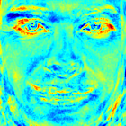
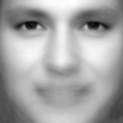
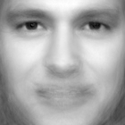

Gender Classification with OpenCV
=================================

.. contents:: Table of Contents
   :depth: 3

Introduction
------------

A lot of people interested in face recognition, also want to know how to perform image classification tasks like:

* Gender Classification (Gender Detection)
* Emotion Classification (Emotion Detection)
* Glasses Classification (Glasses Detection)
* ...

This is has become very, very easy with the new :ocv:class:`FaceRecognizer` class. In this tutorial I'll show you how to perform gender classification with OpenCV on a set of face images. You'll also learn how to align your images to enhance the recognition results. If you want to do emotion classification instead of gender classification, all you need to do is to update is your training data and the configuration you pass to the demo.

Prerequisites
--------------

For gender classification of faces, you'll need some images of male and female faces first. I've decided to search faces of celebrities using `Google Images <http://www.google.com/images>`_ with the faces filter turned on (my god, they have great algorithms at `Google <http://www.google.com>`_!). My database has 8 male and 5 female subjects, each with 10 images. Here are the names, if you don't know who to search:

* Angelina Jolie
* Arnold Schwarzenegger
* Brad Pitt
* Emma Watson
* George Clooney
* Jennifer Lopez
* Johnny Depp
* Justin Timberlake
* Katy Perry
* Keanu Reeves
* Naomi Watts
* Patrick Stewart
* Tom Cruise

Once you have acquired some images, you'll need to read them. In the demo application I have decided to read the images from a very simple CSV file. Why? Because it's the simplest platform-independent approach I can think of. However, if you know a simpler solution please ping me about it. Basically all the CSV file needs to contain are lines composed of a ``filename`` followed by a ``;`` followed by the ``label`` (as *integer number*), making up a line like this:

.. code-block:: none

    /path/to/image.ext;0

Let's dissect the line. ``/path/to/image.ext`` is the path to an image, probably something like this if you are in Windows: ``C:/faces/person0/image0.jpg``. Then there is the separator ``;`` and finally we assign a label ``0`` to the image. Think of the label as the subject (the person, the gender or whatever comes to your mind). In the gender classification scenario, the label is the gender the person has. I'll give the label ``0`` to *male* persons and the label ``1`` is for *female* subjects. So my CSV file looks like this:

.. code-block:: none

  /home/philipp/facerec/data/gender/male/keanu_reeves/keanu_reeves_01.jpg;0
  /home/philipp/facerec/data/gender/male/keanu_reeves/keanu_reeves_02.jpg;0
  /home/philipp/facerec/data/gender/male/keanu_reeves/keanu_reeves_03.jpg;0
  ...
  /home/philipp/facerec/data/gender/female/katy_perry/katy_perry_01.jpg;1
  /home/philipp/facerec/data/gender/female/katy_perry/katy_perry_02.jpg;1
  /home/philipp/facerec/data/gender/female/katy_perry/katy_perry_03.jpg;1
  ...
  /home/philipp/facerec/data/gender/male/brad_pitt/brad_pitt_01.jpg;0
  /home/philipp/facerec/data/gender/male/brad_pitt/brad_pitt_02.jpg;0
  /home/philipp/facerec/data/gender/male/brad_pitt/brad_pitt_03.jpg;0
  ...
  /home/philipp/facerec/data/gender/female/emma_watson/emma_watson_08.jpg;1
  /home/philipp/facerec/data/gender/female/emma_watson/emma_watson_02.jpg;1
  /home/philipp/facerec/data/gender/female/emma_watson/emma_watson_03.jpg;1

All images for this example were chosen to have a frontal face perspective. They have been cropped, scaled and rotated to be aligned at the eyes, just like this set of George Clooney images:

.. image:: ../img/tutorial/gender_classification/clooney_set.png
    :align: center

You really don't want to create the CSV file by hand. And you really don't want scale, rotate & translate the images manually. I have prepared you two Python scripts ``create_csv.py`` and ``crop_face.py``, you can find them in the ``src`` folder coming with this documentation. You'll see how to use them in the :ref:`appendixfgc`.

Fisherfaces for Gender Classification
--------------------------------------

If you want to decide whether a person is *male* or *female*, you have to learn the discriminative features of both classes. The Eigenfaces method is based on the Principal Component Analysis, which is an unsupervised statistical model and not suitable for this task. Please see the Face Recognition tutorial for insights into the algorithms. The Fisherfaces instead yields a class-specific linear projection, so it is much better suited for the gender classification task. `http://www.bytefish.de/blog/gender_classification <http://www.bytefish.de/blog/gender_classification>`_  shows the recognition rate of the Fisherfaces method for gender classification.

The Fisherfaces method achieves a 98% recognition rate in a subject-independent cross-validation. A subject-independent cross-validation means *images of the person under test are never used for learning the model*. And could you believe it: you can simply use the facerec_fisherfaces demo, that's inlcuded in OpenCV.

Fisherfaces in OpenCV
---------------------

The source code for this demo application is also available in the ``src`` folder coming with this documentation:

* :download:`src/facerec_fisherfaces.cpp <../src/facerec_fisherfaces.cpp>`

.. literalinclude:: ../src/facerec_fisherfaces.cpp
   :language: cpp
   :linenos:

Running the Demo
----------------

If you are in Windows, then simply start the demo by running (from command line):

.. code-block:: none

    facerec_fisherfaces.exe C:/path/to/your/csv.ext

If you are in Linux, then simply start the demo by running:

.. code-block:: none

    ./facerec_fisherfaces /path/to/your/csv.ext

If you don't want to display the images, but save them, then pass the desired path to the demo. It works like this in Windows:

.. code-block:: none

    facerec_fisherfaces.exe C:/path/to/your/csv.ext C:/path/to/store/results/at

And in Linux:

.. code-block:: none

    ./facerec_fisherfaces /path/to/your/csv.ext /path/to/store/results/at

Results
-------

If you run the program with your CSV file as parameter, you'll see the Fisherface that separates between male and female images. I've decided to apply a Jet colormap in this demo, so you can see which features the method identifies:

The demo also shows the average face of the male and female training images you have passed:

Moreover it the demo should yield the prediction for the correct gender:

.. code-block:: none

    Predicted class = 1 / Actual class = 1.

And for advanced users I have also shown the Eigenvalue for the Fisherface:

.. code-block:: none

    Eigenvalue #0 = 152.49493

And the Fisherfaces reconstruction:

I hope this gives you an idea how to approach gender classification and the other image classification tasks.

.. _appendixfgc:

Appendix
--------

Creating the CSV File
+++++++++++++++++++++

You don't really want to create the CSV file by hand. I have prepared you a little Python script ``create_csv.py`` (you find it at ``/src/create_csv.py`` coming with this tutorial) that automatically creates you a CSV file. If you have your images in hierarchie like this (``/basepath/<subject>/<image.ext>``):

.. code-block:: none

    philipp@mango:~/facerec/data/at$ tree
    .
    |-- s1
    |   |-- 1.pgm
    |   |-- ...
    |   |-- 10.pgm
    |-- s2
    |   |-- 1.pgm
    |   |-- ...
    |   |-- 10.pgm
    ...
    |-- s40
    |   |-- 1.pgm
    |   |-- ...
    |   |-- 10.pgm

Then simply call ``create_csv.py`` with the path to the folder, just like this and you could save the output:

.. code-block:: none

    philipp@mango:~/facerec/data$ python create_csv.py
    at/s13/2.pgm;0
    at/s13/7.pgm;0
    at/s13/6.pgm;0
    at/s13/9.pgm;0
    at/s13/5.pgm;0
    at/s13/3.pgm;0
    at/s13/4.pgm;0
    at/s13/10.pgm;0
    at/s13/8.pgm;0
    at/s13/1.pgm;0
    at/s17/2.pgm;1
    at/s17/7.pgm;1
    at/s17/6.pgm;1
    at/s17/9.pgm;1
    at/s17/5.pgm;1
    at/s17/3.pgm;1
    [...]

Here is the script, if you can't find it:

.. literalinclude:: ../src/create_csv.py
   :language: python
   :linenos:

Aligning Face Images
++++++++++++++++++++

An accurate alignment of your image data is especially important in tasks like emotion detection, were you need as much detail as possible. Believe me... You don't want to do this by hand. So I've prepared you a tiny Python script. The code is really easy to use. To scale, rotate and crop the face image you just need to call *CropFace(image, eye_left, eye_right, offset_pct, dest_sz)*, where:

* *eye_left* is the position of the left eye
* *eye_right* is the position of the right eye
* *offset_pct* is the percent of the image you want to keep next to the eyes (horizontal, vertical direction)
* *dest_sz* is the size of the output image

If you are using the same *offset_pct* and *dest_sz* for your images, they are all aligned at the eyes.

.. literalinclude:: ../src/crop_face.py
   :language: python
   :linenos:

Imagine we are given `this photo of Arnold Schwarzenegger <http://en.wikipedia.org/wiki/File:Arnold_Schwarzenegger_edit%28ws%29.jpg>`_, which is under a Public Domain license. The (x,y)-position of the eyes is approximately *(252,364)* for the left and *(420,366)* for the right eye. Now you only need to define the horizontal offset, vertical offset and the size your scaled, rotated & cropped face should have.

Here are some examples:

+---------------------------------+----------------------------------------------------------------------------+
| Configuration                   | Cropped, Scaled, Rotated Face                                              |
+=================================+============================================================================+
| 0.1 (10%), 0.1 (10%), (200,200) | .. image:: ../img/tutorial/gender_classification/arnie_10_10_200_200.jpg   |
+---------------------------------+----------------------------------------------------------------------------+
| 0.2 (20%), 0.2 (20%), (200,200) | .. image:: ../img/tutorial/gender_classification/arnie_20_20_200_200.jpg   |
+---------------------------------+----------------------------------------------------------------------------+
| 0.3 (30%), 0.3 (30%), (200,200) | .. image:: ../img/tutorial/gender_classification/arnie_30_30_200_200.jpg   |
+---------------------------------+----------------------------------------------------------------------------+
| 0.2 (20%), 0.2 (20%), (70,70)   | .. image:: ../img/tutorial/gender_classification/arnie_20_20_70_70.jpg     |
+---------------------------------+----------------------------------------------------------------------------+
