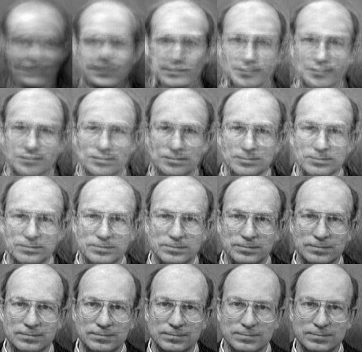

Saving and Loading a FaceRecognizer
===================================

Introduction
------------

Saving and loading a :ocv:class:`FaceRecognizer` is very important. Training a FaceRecognizer can be a very time-intense task, plus it's often impossible to ship the whole face database to the user of your product. The task of saving and loading a FaceRecognizer is easy with :ocv:class:`FaceRecognizer`. You only have to call :ocv:func:`FaceRecognizer::load` for loading and :ocv:func:`FaceRecognizer::save` for saving a :ocv:class:`FaceRecognizer`.

I'll adapt the Eigenfaces example from the :doc:`../facerec_tutorial`: Imagine we want to learn the Eigenfaces of the `AT&T Facedatabase <http://www.cl.cam.ac.uk/research/dtg/attarchive/facedatabase.html>`_, store the model to a YAML file and then load it again.

From the loaded model, we'll get a prediction, show the mean, Eigenfaces and the image reconstruction.

Using FaceRecognizer::save and FaceRecognizer::load
-----------------------------------------------------

The source code for this demo application is also available in the ``src`` folder coming with this documentation:

* :download:`src/facerec_save_load.cpp <../src/facerec_save_load.cpp>`

.. literalinclude:: ../src/facerec_save_load.cpp
   :language: cpp
   :linenos:

Results
-------

``eigenfaces_at.yml`` then contains the model state, we'll simply look at the first 10 lines with ``head eigenfaces_at.yml``:

.. code-block:: none

  philipp@mango:~/github/libfacerec-build$ head eigenfaces_at.yml
  %YAML:1.0
  num_components: 399
  mean: !!opencv-matrix
     rows: 1
     cols: 10304
     dt: d
     data: [ 8.5558897243107765e+01, 8.5511278195488714e+01,
         8.5854636591478695e+01, 8.5796992481203006e+01,
         8.5952380952380949e+01, 8.6162907268170414e+01,
         8.6082706766917283e+01, 8.5776942355889716e+01,

And here is the Reconstruction, which is the same as the original:

