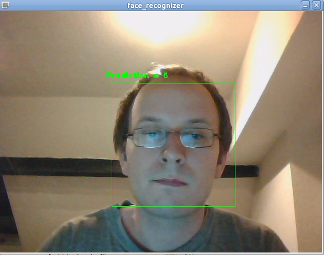

Face Recognition in Videos with OpenCV
=======================================

.. contents:: Table of Contents
   :depth: 3

Introduction
------------

Whenever you hear the term *face recognition*, you instantly think of surveillance in videos. So performing face recognition in videos (e.g. webcam) is one of the most requested features I have got. I have heard your cries, so here it is. An application, that shows you how to do face recognition in videos! For the face detection part we'll use the awesome :ocv:class:`CascadeClassifier` and we'll use :ocv:class:`FaceRecognizer` for face recognition. This example uses the Fisherfaces method for face recognition, because it is robust against large changes in illumination.

Here is what the final application looks like. As you can see I am only writing the id of the recognized person above the detected face (by the way this id is Arnold Schwarzenegger for my data set):

This demo is a basis for your research and it shows you how to implement face recognition in videos. You probably want to extend the application and make it more sophisticated: You could combine the id with the name, then show the confidence of the prediction, recognize the emotion... and and and. But before you send mails, asking what these Haar-Cascade thing is or what a CSV is: Make sure you have read the entire tutorial. It's all explained in here. If you just want to scroll down to the code, please note:

* The available Haar-Cascades for face detection are located in the ``data`` folder of your OpenCV installation! One of the available Haar-Cascades for face detection is for example ``/path/to/opencv/data/haarcascades/haarcascade_frontalface_default.xml``.

I encourage you to experiment with the application. Play around with the available :ocv:class:`FaceRecognizer` implementations, try the available cascades in OpenCV and see if you can improve your results!

Prerequisites
--------------

You want to do face recognition, so you need some face images to learn a :ocv:class:`FaceRecognizer` on. I have decided to reuse the images from the gender classification example: :doc:`facerec_gender_classification`.

I have the following celebrities in my training data set:

* Angelina Jolie
* Arnold Schwarzenegger
* Brad Pitt
* George Clooney
* Johnny Depp
* Justin Timberlake
* Katy Perry
* Keanu Reeves
* Patrick Stewart
* Tom Cruise

In the demo I have decided to read the images from a very simple CSV file. Why? Because it's the simplest platform-independent approach I can think of. However, if you know a simpler solution please ping me about it. Basically all the CSV file needs to contain are lines composed of a ``filename`` followed by a ``;`` followed by the ``label`` (as *integer number*), making up a line like this:

.. code-block:: none

    /path/to/image.ext;0

Let's dissect the line. ``/path/to/image.ext`` is the path to an image, probably something like this if you are in Windows: ``C:/faces/person0/image0.jpg``. Then there is the separator ``;`` and finally we assign a label ``0`` to the image. Think of the label as the subject (the person, the gender or whatever comes to your mind). In the face recognition scenario, the label is the person this image belongs to. In the gender classification scenario, the label is the gender the person has. So my CSV file looks like this:

.. code-block:: none

    /home/philipp/facerec/data/c/keanu_reeves/keanu_reeves_01.jpg;0
    /home/philipp/facerec/data/c/keanu_reeves/keanu_reeves_02.jpg;0
    /home/philipp/facerec/data/c/keanu_reeves/keanu_reeves_03.jpg;0
    ...
    /home/philipp/facerec/data/c/katy_perry/katy_perry_01.jpg;1
    /home/philipp/facerec/data/c/katy_perry/katy_perry_02.jpg;1
    /home/philipp/facerec/data/c/katy_perry/katy_perry_03.jpg;1
    ...
    /home/philipp/facerec/data/c/brad_pitt/brad_pitt_01.jpg;2
    /home/philipp/facerec/data/c/brad_pitt/brad_pitt_02.jpg;2
    /home/philipp/facerec/data/c/brad_pitt/brad_pitt_03.jpg;2
    ...
    /home/philipp/facerec/data/c1/crop_arnold_schwarzenegger/crop_08.jpg;6
    /home/philipp/facerec/data/c1/crop_arnold_schwarzenegger/crop_05.jpg;6
    /home/philipp/facerec/data/c1/crop_arnold_schwarzenegger/crop_02.jpg;6
    /home/philipp/facerec/data/c1/crop_arnold_schwarzenegger/crop_03.jpg;6

All images for this example were chosen to have a frontal face perspective. They have been cropped, scaled and rotated to be aligned at the eyes, just like this set of George Clooney images:

.. image:: ../img/tutorial/gender_classification/clooney_set.png
    :align: center

Face Recongition from Videos
-----------------------------

The source code for the demo is available in the ``src`` folder coming with this documentation:

* :download:`src/facerec_video.cpp <../src/facerec_video.cpp>`

This demo uses the :ocv:class:`CascadeClassifier`:

.. literalinclude:: ../src/facerec_video.cpp
   :language: cpp
   :linenos:

Running the Demo
----------------

You'll need:

* The path to a valid Haar-Cascade for detecting a face with a :ocv:class:`CascadeClassifier`.
* The path to a valid CSV File for learning a :ocv:class:`FaceRecognizer`.
* A webcam and its device id (you don't know the device id? Simply start from 0 on and see what happens).

If you are in Windows, then simply start the demo by running (from command line):

.. code-block:: none

    facerec_video.exe <C:/path/to/your/haar_cascade.xml> <C:/path/to/your/csv.ext> <video device>

If you are in Linux, then simply start the demo by running:

.. code-block:: none

    ./facerec_video </path/to/your/haar_cascade.xml> </path/to/your/csv.ext> <video device>

An example. If the haar-cascade is at ``C:/opencv/data/haarcascades/haarcascade_frontalface_default.xml``, the CSV file is at ``C:/facerec/data/celebrities.txt`` and I have a webcam with deviceId ``1``, then I would call the demo with:

.. code-block:: none

    facerec_video.exe C:/opencv/data/haarcascades/haarcascade_frontalface_default.xml C:/facerec/data/celebrities.txt 1

That's it.

Results
-------

Enjoy!

Appendix
--------

Creating the CSV File
+++++++++++++++++++++

You don't really want to create the CSV file by hand. I have prepared you a little Python script ``create_csv.py`` (you find it at ``/src/create_csv.py`` coming with this tutorial) that automatically creates you a CSV file. If you have your images in hierarchie like this (``/basepath/<subject>/<image.ext>``):

.. code-block:: none

    philipp@mango:~/facerec/data/at$ tree
    .
    |-- s1
    |   |-- 1.pgm
    |   |-- ...
    |   |-- 10.pgm
    |-- s2
    |   |-- 1.pgm
    |   |-- ...
    |   |-- 10.pgm
    ...
    |-- s40
    |   |-- 1.pgm
    |   |-- ...
    |   |-- 10.pgm

Then simply call ``create_csv.py`` with the path to the folder, just like this and you could save the output:

.. code-block:: none

    philipp@mango:~/facerec/data$ python create_csv.py
    at/s13/2.pgm;0
    at/s13/7.pgm;0
    at/s13/6.pgm;0
    at/s13/9.pgm;0
    at/s13/5.pgm;0
    at/s13/3.pgm;0
    at/s13/4.pgm;0
    at/s13/10.pgm;0
    at/s13/8.pgm;0
    at/s13/1.pgm;0
    at/s17/2.pgm;1
    at/s17/7.pgm;1
    at/s17/6.pgm;1
    at/s17/9.pgm;1
    at/s17/5.pgm;1
    at/s17/3.pgm;1
    [...]

Here is the script, if you can't find it:

.. literalinclude:: ../src/create_csv.py
   :language: python
   :linenos:

Aligning Face Images
++++++++++++++++++++

An accurate alignment of your image data is especially important in tasks like emotion detection, were you need as much detail as possible. Believe me... You don't want to do this by hand. So I've prepared you a tiny Python script. The code is really easy to use. To scale, rotate and crop the face image you just need to call *CropFace(image, eye_left, eye_right, offset_pct, dest_sz)*, where:

* *eye_left* is the position of the left eye
* *eye_right* is the position of the right eye
* *offset_pct* is the percent of the image you want to keep next to the eyes (horizontal, vertical direction)
* *dest_sz* is the size of the output image

If you are using the same *offset_pct* and *dest_sz* for your images, they are all aligned at the eyes.

.. literalinclude:: ../src/crop_face.py
   :language: python
   :linenos:

Imagine we are given `this photo of Arnold Schwarzenegger <http://en.wikipedia.org/wiki/File:Arnold_Schwarzenegger_edit%28ws%29.jpg>`_, which is under a Public Domain license. The (x,y)-position of the eyes is approximately *(252,364)* for the left and *(420,366)* for the right eye. Now you only need to define the horizontal offset, vertical offset and the size your scaled, rotated & cropped face should have.

Here are some examples:

+---------------------------------+----------------------------------------------------------------------------+
| Configuration                   | Cropped, Scaled, Rotated Face                                              |
+=================================+============================================================================+
| 0.1 (10%), 0.1 (10%), (200,200) | .. image:: ../img/tutorial/gender_classification/arnie_10_10_200_200.jpg   |
+---------------------------------+----------------------------------------------------------------------------+
| 0.2 (20%), 0.2 (20%), (200,200) | .. image:: ../img/tutorial/gender_classification/arnie_20_20_200_200.jpg   |
+---------------------------------+----------------------------------------------------------------------------+
| 0.3 (30%), 0.3 (30%), (200,200) | .. image:: ../img/tutorial/gender_classification/arnie_30_30_200_200.jpg   |
+---------------------------------+----------------------------------------------------------------------------+
| 0.2 (20%), 0.2 (20%), (70,70)   | .. image:: ../img/tutorial/gender_classification/arnie_20_20_70_70.jpg     |
+---------------------------------+----------------------------------------------------------------------------+
