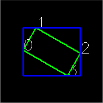

Basic Structures
================

.. highlight:: cpp

DataType
--------
.. ocv:class:: DataType

Template "trait" class for OpenCV primitive data types. A primitive OpenCV data type is one of ``unsigned char``, ``bool``, ``signed char``, ``unsigned short``, ``signed short``, ``int``, ``float``, ``double``, or a tuple of values of one of these types, where all the values in the tuple have the same type. Any primitive type from the list can be defined by an identifier in the form ``CV_<bit-depth>{U|S|F}C(<number_of_channels>)``, for example: ``uchar`` ~ ``CV_8UC1``, 3-element floating-point tuple ~ ``CV_32FC3``, and so on. A universal OpenCV structure that is able to store a single instance of such a primitive data type is
:ocv:class:`Vec`. Multiple instances of such a type can be stored in a ``std::vector``, ``Mat``, ``Mat_``, ``SparseMat``, ``SparseMat_``, or any other container that is able to store ``Vec`` instances.

The ``DataType`` class is basically used to provide a description of such primitive data types without adding any fields or methods to the corresponding classes (and it is actually impossible to add anything to primitive C/C++ data types). This technique is known in C++ as class traits. It is not ``DataType`` itself that is used but its specialized versions, such as: ::

    template<> class DataType<uchar>
    {
        typedef uchar value_type;
        typedef int work_type;
        typedef uchar channel_type;
        enum { channel_type = CV_8U, channels = 1, fmt='u', type = CV_8U };
    };
    ...
    template<typename _Tp> DataType<std::complex<_Tp> >
    {
        typedef std::complex<_Tp> value_type;
        typedef std::complex<_Tp> work_type;
        typedef _Tp channel_type;
        // DataDepth is another helper trait class
        enum { depth = DataDepth<_Tp>::value, channels=2,
            fmt=(channels-1)*256+DataDepth<_Tp>::fmt,
            type=CV_MAKETYPE(depth, channels) };
    };
    ...

The main purpose of this class is to convert compilation-time type information to an OpenCV-compatible data type identifier, for example: ::

    // allocates a 30x40 floating-point matrix
    Mat A(30, 40, DataType<float>::type);

    Mat B = Mat_<std::complex<double> >(3, 3);
    // the statement below will print 6, 2 /*, that is depth == CV_64F, channels == 2 */
    cout << B.depth() << ", " << B.channels() << endl;

So, such traits are used to tell OpenCV which data type you are working with, even if such a type is not native to OpenCV. For example, the matrix ``B`` initialization above is compiled because OpenCV defines the proper specialized template class ``DataType<complex<_Tp> >`` . This mechanism is also useful (and used in OpenCV this way) for generic algorithms implementations.

Point\_
-------
.. ocv:class:: Point_

::

    template<typename _Tp> class CV_EXPORTS Point_
    {
    public:
        typedef _Tp value_type;

        // various constructors
        Point_();
        Point_(_Tp _x, _Tp _y);
        Point_(const Point_& pt);
        Point_(const CvPoint& pt);
        Point_(const CvPoint2D32f& pt);
        Point_(const Size_<_Tp>& sz);
        Point_(const Vec<_Tp, 2>& v);

        Point_& operator = (const Point_& pt);
        //! conversion to another data type
        template<typename _Tp2> operator Point_<_Tp2>() const;

        //! conversion to the old-style C structures
        operator CvPoint() const;
        operator CvPoint2D32f() const;
        operator Vec<_Tp, 2>() const;

        //! dot product
        _Tp dot(const Point_& pt) const;
        //! dot product computed in double-precision arithmetics
        double ddot(const Point_& pt) const;
        //! cross-product
        double cross(const Point_& pt) const;
        //! checks whether the point is inside the specified rectangle
        bool inside(const Rect_<_Tp>& r) const;

        _Tp x, y; //< the point coordinates
    };

Template class for 2D points specified by its coordinates
:math:`x` and
:math:`y` .
An instance of the class is interchangeable with C structures, ``CvPoint`` and ``CvPoint2D32f`` . There is also a cast operator to convert point coordinates to the specified type. The conversion from floating-point coordinates to integer coordinates is done by rounding. Commonly, the conversion uses this
operation for each of the coordinates. Besides the class members listed in the declaration above, the following operations on points are implemented: ::

        pt1 = pt2 + pt3;
        pt1 = pt2 - pt3;
        pt1 = pt2 * a;
        pt1 = a * pt2;
        pt1 += pt2;
        pt1 -= pt2;
        pt1 *= a;
        double value = norm(pt); // L2 norm
        pt1 == pt2;
        pt1 != pt2;

For your convenience, the following type aliases are defined: ::

    typedef Point_<int> Point2i;
    typedef Point2i Point;
    typedef Point_<float> Point2f;
    typedef Point_<double> Point2d;

Example: ::

    Point2f a(0.3f, 0.f), b(0.f, 0.4f);
    Point pt = (a + b)*10.f;
    cout << pt.x << ", " << pt.y << endl;

Point3\_
--------
.. ocv:class:: Point3_

::

    template<typename _Tp> class CV_EXPORTS Point3_
    {
    public:
        typedef _Tp value_type;

        // various constructors
        Point3_();
        Point3_(_Tp _x, _Tp _y, _Tp _z);
        Point3_(const Point3_& pt);
        explicit Point3_(const Point_<_Tp>& pt);
        Point3_(const CvPoint3D32f& pt);
        Point3_(const Vec<_Tp, 3>& v);

        Point3_& operator = (const Point3_& pt);
        //! conversion to another data type
        template<typename _Tp2> operator Point3_<_Tp2>() const;
        //! conversion to the old-style CvPoint...
        operator CvPoint3D32f() const;
        //! conversion to cv::Vec<>
        operator Vec<_Tp, 3>() const;

        //! dot product
        _Tp dot(const Point3_& pt) const;
        //! dot product computed in double-precision arithmetics
        double ddot(const Point3_& pt) const;
        //! cross product of the 2 3D points
        Point3_ cross(const Point3_& pt) const;

        _Tp x, y, z; //< the point coordinates
    };

Template class for 3D points specified by its coordinates
:math:`x`,
:math:`y` and
:math:`z` .
An instance of the class is interchangeable with the C structure ``CvPoint2D32f`` . Similarly to ``Point_`` , the coordinates of 3D points can be converted to another type. The vector arithmetic and comparison operations are also supported.

The following ``Point3_<>`` aliases are available: ::

    typedef Point3_<int> Point3i;
    typedef Point3_<float> Point3f;
    typedef Point3_<double> Point3d;

Size\_
------
.. ocv:class:: Size_

::

    template<typename _Tp> class CV_EXPORTS Size_
    {
    public:
        typedef _Tp value_type;

        //! various constructors
        Size_();
        Size_(_Tp _width, _Tp _height);
        Size_(const Size_& sz);
        Size_(const CvSize& sz);
        Size_(const CvSize2D32f& sz);
        Size_(const Point_<_Tp>& pt);

        Size_& operator = (const Size_& sz);
        //! the area (width*height)
        _Tp area() const;

        //! conversion of another data type.
        template<typename _Tp2> operator Size_<_Tp2>() const;

        //! conversion to the old-style OpenCV types
        operator CvSize() const;
        operator CvSize2D32f() const;

        _Tp width, height; // the width and the height
    };

Template class for specifying the size of an image or rectangle. The class includes two members called ``width`` and ``height``. The structure can be converted to and from the old OpenCV structures
``CvSize`` and ``CvSize2D32f`` . The same set of arithmetic and comparison operations as for ``Point_`` is available.

OpenCV defines the following ``Size_<>`` aliases: ::

    typedef Size_<int> Size2i;
    typedef Size2i Size;
    typedef Size_<float> Size2f;

Rect\_
------
.. ocv:class:: Rect_

::

    template<typename _Tp> class CV_EXPORTS Rect_
    {
    public:
        typedef _Tp value_type;

        //! various constructors
        Rect_();
        Rect_(_Tp _x, _Tp _y, _Tp _width, _Tp _height);
        Rect_(const Rect_& r);
        Rect_(const CvRect& r);
        Rect_(const Point_<_Tp>& org, const Size_<_Tp>& sz);
        Rect_(const Point_<_Tp>& pt1, const Point_<_Tp>& pt2);

        Rect_& operator = ( const Rect_& r );
        //! the top-left corner
        Point_<_Tp> tl() const;
        //! the bottom-right corner
        Point_<_Tp> br() const;

        //! size (width, height) of the rectangle
        Size_<_Tp> size() const;
        //! area (width*height) of the rectangle
        _Tp area() const;

        //! conversion to another data type
        template<typename _Tp2> operator Rect_<_Tp2>() const;
        //! conversion to the old-style CvRect
        operator CvRect() const;

        //! checks whether the rectangle contains the point
        bool contains(const Point_<_Tp>& pt) const;

        _Tp x, y, width, height; //< the top-left corner, as well as width and height of the rectangle
    };

Template class for 2D rectangles, described by the following parameters:

* Coordinates of the top-left corner. This is a default interpretation of ``Rect_::x`` and ``Rect_::y`` in OpenCV. Though, in your algorithms you may count ``x`` and ``y`` from the bottom-left corner.
* Rectangle width and height.

OpenCV typically assumes that the top and left boundary of the rectangle are inclusive, while the right and bottom boundaries are not. For example, the method ``Rect_::contains`` returns ``true`` if

.. math::

    x  \leq pt.x < x+width,
          y  \leq pt.y < y+height

Virtually every loop over an image
ROI in OpenCV (where ROI is specified by ``Rect_<int>`` ) is implemented as: ::

    for(int y = roi.y; y < roi.y + rect.height; y++)
        for(int x = roi.x; x < roi.x + rect.width; x++)
        {
            // ...
        }

In addition to the class members, the following operations on rectangles are implemented:

*
    :math:`\texttt{rect} = \texttt{rect} \pm \texttt{point}`     (shifting a rectangle by a certain offset)

*
    :math:`\texttt{rect} = \texttt{rect} \pm \texttt{size}`     (expanding or shrinking a rectangle by a certain amount)

* ``rect += point, rect -= point, rect += size, rect -= size``     (augmenting operations)

* ``rect = rect1 & rect2``     (rectangle intersection)

* ``rect = rect1 | rect2``     (minimum area rectangle containing ``rect2``     and ``rect3``     )

* ``rect &= rect1, rect |= rect1``     (and the corresponding augmenting operations)

* ``rect == rect1, rect != rect1``     (rectangle comparison)

This is an example how the partial ordering on rectangles can be established (rect1
:math:`\subseteq` rect2): ::

    template<typename _Tp> inline bool
    operator <= (const Rect_<_Tp>& r1, const Rect_<_Tp>& r2)
    {
        return (r1 & r2) == r1;
    }

For your convenience, the ``Rect_<>`` alias is available: ::

    typedef Rect_<int> Rect;

RotatedRect
-----------
.. ocv:class:: RotatedRect

::

    class CV_EXPORTS RotatedRect
    {
    public:
        //! various constructors
        RotatedRect();
        RotatedRect(const Point2f& center, const Size2f& size, float angle);
        RotatedRect(const CvBox2D& box);

        //! returns 4 vertices of the rectangle
        void points(Point2f pts[]) const;
        //! returns the minimal up-right rectangle containing the rotated rectangle
        Rect boundingRect() const;
        //! conversion to the old-style CvBox2D structure
        operator CvBox2D() const;

        Point2f center; //< the rectangle mass center
        Size2f size;    //< width and height of the rectangle
        float angle;    //< the rotation angle. When the angle is 0, 90, 180, 270 etc., the rectangle becomes an up-right rectangle.
    };

The class represents rotated (i.e. not up-right) rectangles on a plane. Each rectangle is specified by the center point (mass center), length of each side (represented by cv::Size2f structure) and the rotation angle in degrees.

    .. ocv:function:: RotatedRect::RotatedRect()
    .. ocv:function:: RotatedRect::RotatedRect(const Point2f& center, const Size2f& size, float angle)

        :param center: The rectangle mass center.
        :param size: Width and height of the rectangle.
        :param angle: The rotation angle in a clockwise direction. When the angle is 0, 90, 180, 270 etc., the rectangle becomes an up-right rectangle.
        :param box: The rotated rectangle parameters as the obsolete CvBox2D structure.

    .. ocv:function:: void RotatedRect::points( Point2f pts[] ) const
    .. ocv:function:: Rect RotatedRect::boundingRect() const

        :param pts: The points array for storing rectangle vertices.

The sample below demonstrates how to use RotatedRect:

::

    Mat image(200, 200, CV_8UC3, Scalar(0));
    RotatedRect rRect = RotatedRect(Point2f(100,100), Size2f(100,50), 30);

    Point2f vertices[4];
    rRect.points(vertices);
    for (int i = 0; i < 4; i++)
        line(image, vertices[i], vertices[(i+1)%4], Scalar(0,255,0));

    Rect brect = rRect.boundingRect();
    rectangle(image, brect, Scalar(255,0,0));

    imshow("rectangles", image);
    waitKey(0);

.. seealso::

    :ocv:func:`CamShift` ,
    :ocv:func:`fitEllipse` ,
    :ocv:func:`minAreaRect` ,
    :ocv:struct:`CvBox2D`

TermCriteria
------------
.. ocv:class:: TermCriteria

::

    class CV_EXPORTS TermCriteria
    {
    public:
        enum
        {
            COUNT=1, //!< the maximum number of iterations or elements to compute
            MAX_ITER=COUNT, //!< ditto
            EPS=2 //!< the desired accuracy or change in parameters at which the iterative algorithm stops
        };

        //! default constructor
        TermCriteria();
        //! full constructor
        TermCriteria(int type, int maxCount, double epsilon);
        //! conversion from CvTermCriteria
        TermCriteria(const CvTermCriteria& criteria);
        //! conversion to CvTermCriteria
        operator CvTermCriteria() const;

        int type; //!< the type of termination criteria: COUNT, EPS or COUNT + EPS
        int maxCount; // the maximum number of iterations/elements
        double epsilon; // the desired accuracy
    };

The class defining termination criteria for iterative algorithms. You can initialize it by default constructor and then override any parameters, or the structure may be fully initialized using the advanced variant of the constructor.

TermCriteria::TermCriteria
--------------------------
The constructors.

.. ocv:function:: TermCriteria::TermCriteria()

.. ocv:function:: TermCriteria::TermCriteria(int type, int maxCount, double epsilon)

    :param type: The type of termination criteria: ``TermCriteria::COUNT``, ``TermCriteria::EPS`` or ``TermCriteria::COUNT`` + ``TermCriteria::EPS``.

    :param maxCount: The maximum number of iterations or elements to compute.

    :param epsilon: The desired accuracy or change in parameters at which the iterative algorithm stops.

    :param criteria: Termination criteria in the deprecated ``CvTermCriteria`` format.

Matx
----
.. ocv:class:: Matx

Template class for small matrices whose type and size are known at compilation time: ::

    template<typename _Tp, int m, int n> class Matx {...};

    typedef Matx<float, 1, 2> Matx12f;
    typedef Matx<double, 1, 2> Matx12d;
    ...
    typedef Matx<float, 1, 6> Matx16f;
    typedef Matx<double, 1, 6> Matx16d;

    typedef Matx<float, 2, 1> Matx21f;
    typedef Matx<double, 2, 1> Matx21d;
    ...
    typedef Matx<float, 6, 1> Matx61f;
    typedef Matx<double, 6, 1> Matx61d;

    typedef Matx<float, 2, 2> Matx22f;
    typedef Matx<double, 2, 2> Matx22d;
    ...
    typedef Matx<float, 6, 6> Matx66f;
    typedef Matx<double, 6, 6> Matx66d;

If you need a more flexible type, use :ocv:class:`Mat` . The elements of the matrix ``M`` are accessible using the ``M(i,j)`` notation. Most of the common matrix operations (see also
:ref:`MatrixExpressions` ) are available. To do an operation on ``Matx`` that is not implemented, you can easily convert the matrix to
``Mat`` and backwards. ::

    Matx33f m(1, 2, 3,
              4, 5, 6,
              7, 8, 9);
    cout << sum(Mat(m*m.t())) << endl;

Vec
---
.. ocv:class:: Vec

Template class for short numerical vectors, a partial case of :ocv:class:`Matx`: ::

    template<typename _Tp, int n> class Vec : public Matx<_Tp, n, 1> {...};

    typedef Vec<uchar, 2> Vec2b;
    typedef Vec<uchar, 3> Vec3b;
    typedef Vec<uchar, 4> Vec4b;

    typedef Vec<short, 2> Vec2s;
    typedef Vec<short, 3> Vec3s;
    typedef Vec<short, 4> Vec4s;

    typedef Vec<int, 2> Vec2i;
    typedef Vec<int, 3> Vec3i;
    typedef Vec<int, 4> Vec4i;

    typedef Vec<float, 2> Vec2f;
    typedef Vec<float, 3> Vec3f;
    typedef Vec<float, 4> Vec4f;
    typedef Vec<float, 6> Vec6f;

    typedef Vec<double, 2> Vec2d;
    typedef Vec<double, 3> Vec3d;
    typedef Vec<double, 4> Vec4d;
    typedef Vec<double, 6> Vec6d;

It is possible to convert ``Vec<T,2>`` to/from ``Point_``, ``Vec<T,3>`` to/from ``Point3_`` , and ``Vec<T,4>`` to :ocv:struct:`CvScalar` or :ocv:class:`Scalar_`. Use ``operator[]`` to access the elements of ``Vec``.

All the expected vector operations are also implemented:

* ``v1 = v2 + v3``
* ``v1 = v2 - v3``
* ``v1 = v2 * scale``
* ``v1 = scale * v2``
* ``v1 = -v2``
* ``v1 += v2`` and other augmenting operations
* ``v1 == v2, v1 != v2``
* ``norm(v1)``  (euclidean norm)

The ``Vec`` class is commonly used to describe pixel types of multi-channel arrays. See :ocv:class:`Mat` for details.

Scalar\_
--------
.. ocv:class:: Scalar_

Template class for a 4-element vector derived from Vec.

::

    template<typename _Tp> class CV_EXPORTS Scalar_ : public Vec<_Tp, 4>
    {
    public:
        //! various constructors
        Scalar_();
        Scalar_(_Tp v0, _Tp v1, _Tp v2=0, _Tp v3=0);
        Scalar_(const CvScalar& s);
        Scalar_(_Tp v0);

        //! returns a scalar with all elements set to v0
        static Scalar_<_Tp> all(_Tp v0);
        //! conversion to the old-style CvScalar
        operator CvScalar() const;

        //! conversion to another data type
        template<typename T2> operator Scalar_<T2>() const;

        //! per-element product
        Scalar_<_Tp> mul(const Scalar_<_Tp>& t, double scale=1 ) const;

        // returns (v0, -v1, -v2, -v3)
        Scalar_<_Tp> conj() const;

        // returns true iff v1 == v2 == v3 == 0
        bool isReal() const;
    };

    typedef Scalar_<double> Scalar;

Being derived from ``Vec<_Tp, 4>`` , ``Scalar_`` and ``Scalar`` can be used just as typical 4-element vectors. In addition, they can be converted to/from ``CvScalar`` . The type ``Scalar`` is widely used in OpenCV to pass pixel values.

Range
-----
.. ocv:class:: Range

Template class specifying a continuous subsequence (slice) of a sequence.

::

    class CV_EXPORTS Range
    {
    public:
        Range();
        Range(int _start, int _end);
        Range(const CvSlice& slice);
        int size() const;
        bool empty() const;
        static Range all();
        operator CvSlice() const;

        int start, end;
    };

The class is used to specify a row or a column span in a matrix (
:ocv:class:`Mat` ) and for many other purposes. ``Range(a,b)`` is basically the same as ``a:b`` in Matlab or ``a..b`` in Python. As in Python, ``start`` is an inclusive left boundary of the range and ``end`` is an exclusive right boundary of the range. Such a half-opened interval is usually denoted as
:math:`[start,end)` .

The static method ``Range::all()`` returns a special variable that means "the whole sequence" or "the whole range", just like " ``:`` " in Matlab or " ``...`` " in Python. All the methods and functions in OpenCV that take ``Range`` support this special ``Range::all()`` value. But, of course, in case of your own custom processing, you will probably have to check and handle it explicitly: ::

    void my_function(..., const Range& r, ....)
    {
        if(r == Range::all()) {
            // process all the data
        }
        else {
            // process [r.start, r.end)
        }
    }

KeyPoint
--------
.. ocv:class:: KeyPoint

  Data structure for salient point detectors.

  .. ocv:member:: Point2f pt

     coordinates of the keypoint

  .. ocv:member:: float size

     diameter of the meaningful keypoint neighborhood

  .. ocv:member:: float angle

     computed orientation of the keypoint (-1 if not applicable). Its possible values are in a range [0,360) degrees. It is measured relative to image coordinate system (y-axis is directed downward), ie in clockwise.

  .. ocv:member:: float response

     the response by which the most strong keypoints have been selected. Can be used for further sorting or subsampling

  .. ocv:member:: int octave

     octave (pyramid layer) from which the keypoint has been extracted

  .. ocv:member:: int class_id

     object id that can be used to clustered keypoints by an object they belong to

KeyPoint::KeyPoint
------------------
The keypoint constructors

.. ocv:function:: KeyPoint::KeyPoint()

.. ocv:function:: KeyPoint::KeyPoint(Point2f _pt, float _size, float _angle=-1, float _response=0, int _octave=0, int _class_id=-1)

.. ocv:function:: KeyPoint::KeyPoint(float x, float y, float _size, float _angle=-1, float _response=0, int _octave=0, int _class_id=-1)

.. ocv:pyfunction:: cv2.KeyPoint([x, y, _size[, _angle[, _response[, _octave[, _class_id]]]]]) -> <KeyPoint object>

    :param x: x-coordinate of the keypoint

    :param y: y-coordinate of the keypoint

    :param _pt: x & y coordinates of the keypoint

    :param _size: keypoint diameter

    :param _angle: keypoint orientation

    :param _response: keypoint detector response on the keypoint (that is, strength of the keypoint)

    :param _octave: pyramid octave in which the keypoint has been detected

    :param _class_id: object id

DMatch
------
.. ocv:class:: DMatch

Class for matching keypoint descriptors: query descriptor index,
train descriptor index, train image index, and distance between descriptors. ::

    class DMatch
    {
    public:
        DMatch() : queryIdx(-1), trainIdx(-1), imgIdx(-1),
                   distance(std::numeric_limits<float>::max()) {}
        DMatch( int _queryIdx, int _trainIdx, float _distance ) :
                queryIdx(_queryIdx), trainIdx(_trainIdx), imgIdx(-1),
                distance(_distance) {}
        DMatch( int _queryIdx, int _trainIdx, int _imgIdx, float _distance ) :
                queryIdx(_queryIdx), trainIdx(_trainIdx), imgIdx(_imgIdx),
                distance(_distance) {}

        int queryIdx; // query descriptor index
        int trainIdx; // train descriptor index
        int imgIdx;   // train image index

        float distance;

        // less is better
        bool operator<( const DMatch &m ) const;
    };

.. _Ptr:

Ptr
---
.. ocv:class:: Ptr

Template class for smart reference-counting pointers ::

    template<typename _Tp> class Ptr
    {
    public:
        // default constructor
        Ptr();
        // constructor that wraps the object pointer
        Ptr(_Tp* _obj);
        // destructor: calls release()
        ~Ptr();
        // copy constructor; increments ptr's reference counter
        Ptr(const Ptr& ptr);
        // assignment operator; decrements own reference counter
        // (with release()) and increments ptr's reference counter
        Ptr& operator = (const Ptr& ptr);
        // increments reference counter
        void addref();
        // decrements reference counter; when it becomes 0,
        // delete_obj() is called
        void release();
        // user-specified custom object deletion operation.
        // by default, "delete obj;" is called
        void delete_obj();
        // returns true if obj == 0;
        bool empty() const;

        // provide access to the object fields and methods
        _Tp* operator -> ();
        const _Tp* operator -> () const;

        // return the underlying object pointer;
        // thanks to the methods, the Ptr<_Tp> can be
        // used instead of _Tp*
        operator _Tp* ();
        operator const _Tp*() const;
    protected:
        // the encapsulated object pointer
        _Tp* obj;
        // the associated reference counter
        int* refcount;
    };

The ``Ptr<_Tp>`` class is a template class that wraps pointers of the corresponding type. It is
similar to ``shared_ptr`` that is part of the Boost library
(http://www.boost.org/doc/libs/1_40_0/libs/smart_ptr/shared_ptr.htm) and also part of the
`C++0x <http://en.wikipedia.org/wiki/C++0x>`_ standard.

This class provides the following options:

*
    Default constructor, copy constructor, and assignment operator for an arbitrary C++ class
    or a C structure. For some objects, like files, windows, mutexes, sockets, and others, a copy
    constructor or an assignment operator are difficult to define. For some other objects, like
    complex classifiers in OpenCV, copy constructors are absent and not easy to implement. Finally,
    some of complex OpenCV and your own data structures may be written in C.
    However, copy constructors and default constructors can simplify programming a lot.Besides,
    they are often required (for example, by STL containers). By wrapping a pointer to such a
    complex object ``TObj`` to ``Ptr<TObj>``, you automatically get all of the necessary
    constructors and the assignment operator.

*
    *O(1)* complexity of the above-mentioned operations. While some structures, like ``std::vector``,
    provide a copy constructor and an assignment operator, the operations may take a considerable
    amount of time if the data structures are large. But if the structures are put into ``Ptr<>``,
    the overhead is small and independent of the data size.

*
    Automatic destruction, even for C structures. See the example below with ``FILE*``.

*
    Heterogeneous collections of objects. The standard STL and most other C++ and OpenCV containers
    can store only objects of the same type and the same size. The classical solution to store objects
    of different types in the same container is to store pointers to the base class ``base_class_t*``
    instead but then you loose the automatic memory management. Again, by using ``Ptr<base_class_t>()``
    instead of the raw pointers, you can solve the problem.

The ``Ptr`` class treats the wrapped object as a black box. The reference counter is allocated and
managed separately. The only thing the pointer class needs to know about the object is how to
deallocate it. This knowledge is encapsulated in the ``Ptr::delete_obj()`` method that is called when
the reference counter becomes 0. If the object is a C++ class instance, no additional coding is
needed, because the default implementation of this method calls ``delete obj;``. However, if the
object is deallocated in a different way, the specialized method should be created. For example,
if you want to wrap ``FILE``, the ``delete_obj`` may be implemented as follows: ::

    template<> inline void Ptr<FILE>::delete_obj()
    {
        fclose(obj); // no need to clear the pointer afterwards,
                     // it is done externally.
    }
    ...

    // now use it:
    Ptr<FILE> f(fopen("myfile.txt", "r"));
    if(f.empty())
        throw ...;
    fprintf(f, ....);
    ...
    // the file will be closed automatically by the Ptr<FILE> destructor.

.. note:: The reference increment/decrement operations are implemented as atomic operations,
          and therefore it is normally safe to use the classes in multi-threaded applications.
          The same is true for :ocv:class:`Mat` and other C++ OpenCV classes that operate on
          the reference counters.

Ptr::Ptr
--------
Various Ptr constructors.

.. ocv:function:: Ptr::Ptr()
.. ocv:function:: Ptr::Ptr(_Tp* _obj)
.. ocv:function:: Ptr::Ptr(const Ptr& ptr)

    :param _obj: Object for copy.
    :param ptr: Object for copy.

Ptr::~Ptr
---------
The Ptr destructor.

.. ocv:function:: Ptr::~Ptr()

Ptr::operator =
----------------
Assignment operator.

.. ocv:function:: Ptr& Ptr::operator = (const Ptr& ptr)

    :param ptr: Object for assignment.

Decrements own reference counter (with ``release()``) and increments ptr's reference counter.

Ptr::addref
-----------
Increments reference counter.

.. ocv:function:: void Ptr::addref()

Ptr::release
------------
Decrements reference counter; when it becomes 0, ``delete_obj()`` is called.

.. ocv:function:: void Ptr::release()

Ptr::delete_obj
---------------
User-specified custom object deletion operation. By default, ``delete obj;`` is called.

.. ocv:function:: void Ptr::delete_obj()

Ptr::empty
----------
Returns true if obj == 0;

bool empty() const;

Ptr::operator ->
----------------
Provide access to the object fields and methods.

.. ocv:function:: template<typename _Tp> _Tp* Ptr::operator -> ()
.. ocv:function:: template<typename _Tp> const _Tp* Ptr::operator -> () const

Ptr::operator _Tp*
------------------
Returns the underlying object pointer. Thanks to the methods, the ``Ptr<_Tp>`` can be used instead
of ``_Tp*``.

.. ocv:function:: template<typename _Tp> Ptr::operator _Tp* ()
.. ocv:function:: template<typename _Tp> Ptr::operator const _Tp*() const

Mat
---
.. ocv:class:: Mat

OpenCV C++ n-dimensional dense array class
::

    class CV_EXPORTS Mat
    {
    public:
        // ... a lot of methods ...
        ...

        /*! includes several bit-fields:
             - the magic signature
             - continuity flag
             - depth
             - number of channels
         */
        int flags;
        //! the array dimensionality, >= 2
        int dims;
        //! the number of rows and columns or (-1, -1) when the array has more than 2 dimensions
        int rows, cols;
        //! pointer to the data
        uchar* data;

        //! pointer to the reference counter;
        // when array points to user-allocated data, the pointer is NULL
        int* refcount;

        // other members
        ...
    };

The class ``Mat`` represents an n-dimensional dense numerical single-channel or multi-channel array. It can be used to store real or complex-valued vectors and matrices, grayscale or color images, voxel volumes, vector fields, point clouds, tensors, histograms (though, very high-dimensional histograms may be better stored in a ``SparseMat`` ). The data layout of the array
:math:`M` is defined by the array ``M.step[]``, so that the address of element
:math:`(i_0,...,i_{M.dims-1})`, where
:math:`0\leq i_k<M.size[k]`, is computed as:

.. math::

    addr(M_{i_0,...,i_{M.dims-1}}) = M.data + M.step[0]*i_0 + M.step[1]*i_1 + ... + M.step[M.dims-1]*i_{M.dims-1}

In case of a 2-dimensional array, the above formula is reduced to:

.. math::

    addr(M_{i,j}) = M.data + M.step[0]*i + M.step[1]*j

Note that ``M.step[i] >= M.step[i+1]`` (in fact, ``M.step[i] >= M.step[i+1]*M.size[i+1]`` ). This means that 2-dimensional matrices are stored row-by-row, 3-dimensional matrices are stored plane-by-plane, and so on. ``M.step[M.dims-1]`` is minimal and always equal to the element size ``M.elemSize()`` .

So, the data layout in ``Mat`` is fully compatible with ``CvMat``, ``IplImage``, and ``CvMatND`` types from OpenCV 1.x. It is also compatible with the majority of dense array types from the standard toolkits and SDKs, such as Numpy (ndarray), Win32 (independent device bitmaps), and others, that is, with any array that uses *steps* (or *strides*) to compute the position of a pixel. Due to this compatibility, it is possible to make a ``Mat`` header for user-allocated data and process it in-place using OpenCV functions.

There are many different ways to create a ``Mat`` object. The most popular options are listed below:

*

    Use the ``create(nrows, ncols, type)``   method or the similar ``Mat(nrows, ncols, type[, fillValue])``     constructor. A new array of the specified size and type is allocated. ``type``     has the same meaning as in the ``cvCreateMat``     method.
    For example, ``CV_8UC1``     means a 8-bit single-channel array, ``CV_32FC2``     means a 2-channel (complex) floating-point array, and so on.

    ::

        // make a 7x7 complex matrix filled with 1+3j.
        Mat M(7,7,CV_32FC2,Scalar(1,3));
        // and now turn M to a 100x60 15-channel 8-bit matrix.
        // The old content will be deallocated
        M.create(100,60,CV_8UC(15));

    ..

    As noted in the introduction to this chapter, ``create()`` allocates only  a new array when the shape or type of the current array are different from the specified ones.

*

    Create a multi-dimensional array:

    ::

        // create a 100x100x100 8-bit array
        int sz[] = {100, 100, 100};
        Mat bigCube(3, sz, CV_8U, Scalar::all(0));

    ..

    It passes the number of dimensions =1 to the ``Mat`` constructor but the created array will be 2-dimensional with the number of columns set to 1. So, ``Mat::dims``     is always >= 2 (can also be 0 when the array is empty).

*

    Use a copy constructor or assignment operator where there can be an array or expression on the right side (see below). As noted in the introduction, the array assignment is an O(1) operation because it only copies the header and increases the reference counter. The ``Mat::clone()``     method can be used to get a full (deep) copy of the array when you need it.

*

    Construct a header for a part of another array. It can be a single row, single column, several rows, several columns, rectangular region in the array (called a *minor* in algebra) or a diagonal. Such operations are also O(1) because the new header references the same data. You can actually modify a part of the array using this feature, for example:

    ::

        // add the 5-th row, multiplied by 3 to the 3rd row
        M.row(3) = M.row(3) + M.row(5)*3;

        // now copy the 7-th column to the 1-st column
        // M.col(1) = M.col(7); // this will not work
        Mat M1 = M.col(1);
        M.col(7).copyTo(M1);

        // create a new 320x240 image
        Mat img(Size(320,240),CV_8UC3);
        // select a ROI
        Mat roi(img, Rect(10,10,100,100));
        // fill the ROI with (0,255,0) (which is green in RGB space);
        // the original 320x240 image will be modified
        roi = Scalar(0,255,0);

    ..

    Due to the additional ``datastart`` and ``dataend`` members, it is possible to compute a relative sub-array position in the main *container* array using ``locateROI()``:

    ::

        Mat A = Mat::eye(10, 10, CV_32S);
        // extracts A columns, 1 (inclusive) to 3 (exclusive).
        Mat B = A(Range::all(), Range(1, 3));
        // extracts B rows, 5 (inclusive) to 9 (exclusive).
        // that is, C ~ A(Range(5, 9), Range(1, 3))
        Mat C = B(Range(5, 9), Range::all());
        Size size; Point ofs;
        C.locateROI(size, ofs);
        // size will be (width=10,height=10) and the ofs will be (x=1, y=5)

    ..

    As in case of whole matrices, if you need a deep copy, use the ``clone()`` method of the extracted sub-matrices.

*

    Make a header for user-allocated data. It can be useful to do the following:

    #.
        Process "foreign" data using OpenCV (for example, when you implement a DirectShow* filter or a processing module for ``gstreamer``, and so on). For example:

        ::

            void process_video_frame(const unsigned char* pixels,
                                     int width, int height, int step)
            {
                Mat img(height, width, CV_8UC3, pixels, step);
                GaussianBlur(img, img, Size(7,7), 1.5, 1.5);
            }

        ..

    #.
        Quickly initialize small matrices and/or get a super-fast element access.

        ::

            double m[3][3] = {{a, b, c}, {d, e, f}, {g, h, i}};
            Mat M = Mat(3, 3, CV_64F, m).inv();

        ..

    Partial yet very common cases of this *user-allocated data* case are conversions from ``CvMat`` and ``IplImage`` to ``Mat``. For this purpose, there are special constructors taking pointers to ``CvMat``     or ``IplImage`` and the optional flag indicating whether to copy the data or not.

        Backward conversion from ``Mat`` to ``CvMat`` or ``IplImage`` is provided via cast operators ``Mat::operator CvMat() const`` and ``Mat::operator IplImage()``. The operators do NOT copy the data.

    ::

        IplImage* img = cvLoadImage("greatwave.jpg", 1);
        Mat mtx(img); // convert IplImage* -> Mat
        CvMat oldmat = mtx; // convert Mat -> CvMat
        CV_Assert(oldmat.cols == img->width && oldmat.rows == img->height &&
            oldmat.data.ptr == (uchar*)img->imageData && oldmat.step == img->widthStep);

    ..

*

    Use MATLAB-style array initializers, ``zeros(), ones(), eye()``, for example:

    ::

        // create a double-precision identity martix and add it to M.
        M += Mat::eye(M.rows, M.cols, CV_64F);

    ..

*

    Use a comma-separated initializer:

    ::

        // create a 3x3 double-precision identity matrix
        Mat M = (Mat_<double>(3,3) << 1, 0, 0, 0, 1, 0, 0, 0, 1);

    ..

    With this approach, you first call a constructor of the :ocv:class:`Mat_`  class with the proper parameters, and then you just put ``<<``     operator followed by comma-separated values that can be constants, variables, expressions, and so on. Also, note the extra parentheses required to avoid compilation errors.

Once the array is created, it is automatically managed via a reference-counting mechanism. If the array header is built on top of user-allocated data, you should handle the data by yourself.
The array data is deallocated when no one points to it. If you want to release the data pointed by a array header before the array destructor is called, use ``Mat::release()`` .

The next important thing to learn about the array class is element access. This manual already described how to compute an address of each array element. Normally, you are not required to use the formula directly in the code. If you know the array element type (which can be retrieved using the method ``Mat::type()`` ), you can access the element
:math:`M_{ij}` of a 2-dimensional array as: ::

    M.at<double>(i,j) += 1.f;

assuming that M is a double-precision floating-point array. There are several variants of the method ``at`` for a different number of dimensions.

If you need to process a whole row of a 2D array, the most efficient way is to get the pointer to the row first, and then just use the plain C operator ``[]`` : ::

    // compute sum of positive matrix elements
    // (assuming that M isa double-precision matrix)
    double sum=0;
    for(int i = 0; i < M.rows; i++)
    {
        const double* Mi = M.ptr<double>(i);
        for(int j = 0; j < M.cols; j++)
            sum += std::max(Mi[j], 0.);
    }

Some operations, like the one above, do not actually depend on the array shape. They just process elements of an array one by one (or elements from multiple arrays that have the same coordinates, for example, array addition). Such operations are called *element-wise*. It makes sense to check whether all the input/output arrays are continuous, namely, have no gaps at the end of each row. If yes, process them as a long single row: ::

    // compute the sum of positive matrix elements, optimized variant
    double sum=0;
    int cols = M.cols, rows = M.rows;
    if(M.isContinuous())
    {
        cols *= rows;
        rows = 1;
    }
    for(int i = 0; i < rows; i++)
    {
        const double* Mi = M.ptr<double>(i);
        for(int j = 0; j < cols; j++)
            sum += std::max(Mi[j], 0.);
    }

In case of the continuous matrix, the outer loop body is executed just once. So, the overhead is smaller, which is especially noticeable in case of small matrices.

Finally, there are STL-style iterators that are smart enough to skip gaps between successive rows: ::

    // compute sum of positive matrix elements, iterator-based variant
    double sum=0;
    MatConstIterator_<double> it = M.begin<double>(), it_end = M.end<double>();
    for(; it != it_end; ++it)
        sum += std::max(*it, 0.);

The matrix iterators are random-access iterators, so they can be passed to any STL algorithm, including ``std::sort()`` .

.. note::

   * An example demonstrating the serial out capabilities of cv::Mat can be found at opencv_source_code/samples/cpp/cout_mat.cpp

.. _MatrixExpressions:

Matrix Expressions
------------------

This is a list of implemented matrix operations that can be combined in arbitrary complex expressions
(here ``A``, ``B`` stand for matrices ( ``Mat`` ), ``s`` for a scalar ( ``Scalar`` ),
``alpha`` for a real-valued scalar ( ``double`` )):

*
    Addition, subtraction, negation:
    ``A+B, A-B, A+s, A-s, s+A, s-A, -A``

*
    Scaling:
    ``A*alpha``

*
    Per-element multiplication and division:
    ``A.mul(B), A/B, alpha/A``

*
    Matrix multiplication:
    ``A*B``

*
    Transposition:
    ``A.t()`` (means ``A``\ :sup:`T`)

*
    Matrix inversion and pseudo-inversion, solving linear systems and least-squares problems:

    ``A.inv([method])`` (~ ``A``\ :sup:`-1`) ``,   A.inv([method])*B`` (~ ``X: AX=B``)

*
    Comparison:
    ``A cmpop B, A cmpop alpha, alpha cmpop A``, where ``cmpop`` is one of ``:  >, >=, ==, !=, <=, <``. The result of comparison is an 8-bit single channel mask whose elements are set to 255 (if the particular element or pair of elements satisfy the condition) or 0.

*
    Bitwise logical operations: ``A logicop B, A logicop s, s logicop A, ~A``, where ``logicop`` is one of ``:  &, |, ^``.

*
    Element-wise minimum and maximum:
    ``min(A, B), min(A, alpha), max(A, B), max(A, alpha)``

*
    Element-wise absolute value:
    ``abs(A)``

*
    Cross-product, dot-product:
    ``A.cross(B)``
    ``A.dot(B)``

*
    Any function of matrix or matrices and scalars that returns a matrix or a scalar, such as ``norm``, ``mean``, ``sum``, ``countNonZero``, ``trace``, ``determinant``, ``repeat``, and others.

*
    Matrix initializers ( ``Mat::eye(), Mat::zeros(), Mat::ones()`` ), matrix comma-separated initializers, matrix constructors and operators that extract sub-matrices (see :ocv:class:`Mat` description).

*
    ``Mat_<destination_type>()`` constructors to cast the result to the proper type.

.. note:: Comma-separated initializers and probably some other operations may require additional explicit ``Mat()`` or ``Mat_<T>()`` constructor calls to resolve a possible ambiguity.

Here are examples of matrix expressions:

::

    // compute pseudo-inverse of A, equivalent to A.inv(DECOMP_SVD)
    SVD svd(A);
    Mat pinvA = svd.vt.t()*Mat::diag(1./svd.w)*svd.u.t();

    // compute the new vector of parameters in the Levenberg-Marquardt algorithm
    x -= (A.t()*A + lambda*Mat::eye(A.cols,A.cols,A.type())).inv(DECOMP_CHOLESKY)*(A.t()*err);

    // sharpen image using "unsharp mask" algorithm
    Mat blurred; double sigma = 1, threshold = 5, amount = 1;
    GaussianBlur(img, blurred, Size(), sigma, sigma);
    Mat lowConstrastMask = abs(img - blurred) < threshold;
    Mat sharpened = img*(1+amount) + blurred*(-amount);
    img.copyTo(sharpened, lowContrastMask);

..

Below is the formal description of the ``Mat`` methods.

Mat::Mat
--------
Various Mat constructors

.. ocv:function:: Mat::Mat()

.. ocv:function:: Mat::Mat(int rows, int cols, int type)

.. ocv:function:: Mat::Mat(Size size, int type)

.. ocv:function:: Mat::Mat(int rows, int cols, int type, const Scalar& s)

.. ocv:function:: Mat::Mat(Size size, int type, const Scalar& s)

.. ocv:function:: Mat::Mat(const Mat& m)

.. ocv:function:: Mat::Mat(int rows, int cols, int type, void* data, size_t step=AUTO_STEP)

.. ocv:function:: Mat::Mat(Size size, int type, void* data, size_t step=AUTO_STEP)

.. ocv:function:: Mat::Mat( const Mat& m, const Range& rowRange, const Range& colRange=Range::all() )

.. ocv:function:: Mat::Mat(const Mat& m, const Rect& roi)

.. ocv:function:: template<typename T, int n> explicit Mat::Mat(const Vec<T, n>& vec, bool copyData=true)

.. ocv:function:: template<typename T, int m, int n> explicit Mat::Mat(const Matx<T, m, n>& vec, bool copyData=true)

.. ocv:function:: template<typename T> explicit Mat::Mat(const vector<T>& vec, bool copyData=false)

.. ocv:function:: Mat::Mat(int ndims, const int* sizes, int type)

.. ocv:function:: Mat::Mat(int ndims, const int* sizes, int type, const Scalar& s)

.. ocv:function:: Mat::Mat(int ndims, const int* sizes, int type, void* data, const size_t* steps=0)

.. ocv:function:: Mat::Mat(const Mat& m, const Range* ranges)

    :param ndims: Array dimensionality.

    :param rows: Number of rows in a 2D array.

    :param cols: Number of columns in a 2D array.

    :param roi: Region of interest.

    :param size: 2D array size:  ``Size(cols, rows)`` . In the  ``Size()``  constructor, the number of rows and the number of columns go in the reverse order.

    :param sizes: Array of integers specifying an n-dimensional array shape.

    :param type: Array type. Use  ``CV_8UC1, ..., CV_64FC4``  to create 1-4 channel matrices, or  ``CV_8UC(n), ..., CV_64FC(n)``  to create multi-channel (up to  ``CV_MAX_CN``  channels) matrices.

    :param s: An optional value to initialize each matrix element with. To set all the matrix elements to the particular value after the construction, use the assignment operator  ``Mat::operator=(const Scalar& value)`` .

    :param data: Pointer to the user data. Matrix constructors that take  ``data``  and  ``step``  parameters do not allocate matrix data. Instead, they just initialize the matrix header that points to the specified data, which means that no data is copied. This operation is very efficient and can be used to process external data using OpenCV functions. The external data is not automatically deallocated, so you should take care of it.

    :param step: Number of bytes each matrix row occupies. The value should include the padding bytes at the end of each row, if any. If the parameter is missing (set to  ``AUTO_STEP`` ), no padding is assumed and the actual step is calculated as  ``cols*elemSize()`` . See  :ocv:func:`Mat::elemSize` .

    :param steps: Array of  ``ndims-1``  steps in case of a multi-dimensional array (the last step is always set to the element size). If not specified, the matrix is assumed to be continuous.

    :param m: Array that (as a whole or partly) is assigned to the constructed matrix. No data is copied by these constructors. Instead, the header pointing to  ``m``  data or its sub-array is constructed and associated with it. The reference counter, if any, is incremented. So, when you modify the matrix formed using such a constructor, you also modify the corresponding elements of  ``m`` . If you want to have an independent copy of the sub-array, use  ``Mat::clone()`` .

    :param img: Pointer to the old-style  ``IplImage``  image structure. By default, the data is shared between the original image and the new matrix. But when  ``copyData``  is set, the full copy of the image data is created.

    :param vec: STL vector whose elements form the matrix. The matrix has a single column and the number of rows equal to the number of vector elements. Type of the matrix matches the type of vector elements. The constructor can handle arbitrary types, for which there is a properly declared  :ocv:class:`DataType` . This means that the vector elements must be primitive numbers or uni-type numerical tuples of numbers. Mixed-type structures are not supported. The corresponding constructor is explicit. Since STL vectors are not automatically converted to  ``Mat``  instances, you should write  ``Mat(vec)``  explicitly. Unless you copy the data into the matrix ( ``copyData=true`` ), no new elements will be added to the vector because it can potentially yield vector data reallocation, and, thus, the matrix data pointer will be invalid.

    :param copyData: Flag to specify whether the underlying data of the STL vector or the old-style  ``CvMat``  or  ``IplImage``  should be copied to (``true``) or shared with (``false``) the newly constructed matrix. When the data is copied, the allocated buffer is managed using  ``Mat`` reference counting mechanism. While the data is shared, the reference counter is NULL, and you should not deallocate the data until the matrix is not destructed.

    :param rowRange: Range of the  ``m`` rows to take. As usual, the range start is inclusive and the range end is exclusive. Use  ``Range::all()``  to take all the rows.

    :param colRange: Range of the  ``m`` columns to take. Use  ``Range::all()``  to take all the columns.

    :param ranges: Array of selected ranges of  ``m``  along each dimensionality.

These are various constructors that form a matrix. As noted in the :ref:`AutomaticAllocation`,
often the default constructor is enough, and the proper matrix will be allocated by an OpenCV function. The constructed matrix can further be assigned to another matrix or matrix expression or can be allocated with
:ocv:func:`Mat::create` . In the former case, the old content is de-referenced.

Mat::~Mat
---------
The Mat destructor.

.. ocv:function:: Mat::~Mat()

The matrix destructor calls :ocv:func:`Mat::release` .

Mat::operator =
---------------
Provides matrix assignment operators.

.. ocv:function:: Mat& Mat::operator = (const Mat& m)

.. ocv:function:: Mat& Mat::operator =( const MatExpr& expr )

.. ocv:function:: Mat& Mat::operator = (const Scalar& s)

    :param m: Assigned, right-hand-side matrix. Matrix assignment is an O(1) operation. This means that no data is copied but the data is shared and the reference counter, if any, is incremented. Before assigning new data, the old data is de-referenced via  :ocv:func:`Mat::release` .

    :param expr: Assigned matrix expression object. As opposite to the first form of the assignment operation, the second form can reuse already allocated matrix if it has the right size and type to fit the matrix expression result. It is automatically handled by the real function that the matrix expressions is expanded to. For example,  ``C=A+B``  is expanded to  ``add(A, B, C)``, and  :func:`add`  takes care of automatic  ``C``  reallocation.

    :param s: Scalar assigned to each matrix element. The matrix size or type is not changed.

These are available assignment operators. Since they all are very different, make sure to read the operator parameters description.

Mat::row
--------
Creates a matrix header for the specified matrix row.

.. ocv:function:: Mat Mat::row(int y) const

    :param y: A 0-based row index.

The method makes a new header for the specified matrix row and returns it. This is an O(1) operation, regardless of the matrix size. The underlying data of the new matrix is shared with the original matrix. Here is the example of one of the classical basic matrix processing operations, ``axpy``, used by LU and many other algorithms: ::

    inline void matrix_axpy(Mat& A, int i, int j, double alpha)
    {
        A.row(i) += A.row(j)*alpha;
    }

.. note::

    In the current implementation, the following code does not work as expected: ::

        Mat A;
        ...
        A.row(i) = A.row(j); // will not work

    This happens because ``A.row(i)`` forms a temporary header that is further assigned to another header. Remember that each of these operations is O(1), that is, no data is copied. Thus, the above assignment is not true if you may have expected the j-th row to be copied to the i-th row. To achieve that, you should either turn this simple assignment into an expression or use the :ocv:func:`Mat::copyTo` method: ::

        Mat A;
        ...
        // works, but looks a bit obscure.
        A.row(i) = A.row(j) + 0;

        // this is a bit longer, but the recommended method.
        A.row(j).copyTo(A.row(i));

Mat::col
--------
Creates a matrix header for the specified matrix column.

.. ocv:function:: Mat Mat::col(int x) const

    :param x: A 0-based column index.

The method makes a new header for the specified matrix column and returns it. This is an O(1) operation, regardless of the matrix size. The underlying data of the new matrix is shared with the original matrix. See also the
:ocv:func:`Mat::row` description.

Mat::rowRange
-------------
Creates a matrix header for the specified row span.

.. ocv:function:: Mat Mat::rowRange(int startrow, int endrow) const

.. ocv:function:: Mat Mat::rowRange(const Range& r) const

    :param startrow: An inclusive 0-based start index of the row span.

    :param endrow: An exclusive 0-based ending index of the row span.

    :param r: :ocv:class:`Range` structure containing both the start and the end indices.

The method makes a new header for the specified row span of the matrix. Similarly to
:ocv:func:`Mat::row` and
:ocv:func:`Mat::col` , this is an O(1) operation.

Mat::colRange
-------------
Creates a matrix header for the specified column span.

.. ocv:function:: Mat Mat::colRange(int startcol, int endcol) const

.. ocv:function:: Mat Mat::colRange(const Range& r) const

    :param startcol: An inclusive 0-based start index of the column span.

    :param endcol: An exclusive 0-based ending index of the column span.

    :param r: :ocv:class:`Range`  structure containing both the start and the end indices.

The method makes a new header for the specified column span of the matrix. Similarly to
:ocv:func:`Mat::row` and
:ocv:func:`Mat::col` , this is an O(1) operation.

Mat::diag
---------
Extracts a diagonal from a matrix, or creates a diagonal matrix.

.. ocv:function:: Mat Mat::diag( int d=0 ) const

.. ocv:function:: static Mat Mat::diag( const Mat& d )

    :param d: Single-column matrix that forms a diagonal matrix or index of the diagonal, with the following values:

        * **d=0** is the main diagonal.

        * **d>0** is a diagonal from the lower half. For example,  ``d=1``  means the diagonal is set immediately below the main one.

        * **d<0** is a diagonal from the upper half. For example,  ``d=1``  means the diagonal is set immediately above the main one.

The method makes a new header for the specified matrix diagonal. The new matrix is represented as a single-column matrix. Similarly to
:ocv:func:`Mat::row` and
:ocv:func:`Mat::col` , this is an O(1) operation.

Mat::clone
----------
Creates a full copy of the array and the underlying data.

.. ocv:function:: Mat Mat::clone() const

The method creates a full copy of the array. The original ``step[]`` is not taken into account. So, the array copy is a continuous array occupying ``total()*elemSize()`` bytes.

Mat::copyTo
-----------
Copies the matrix to another one.

.. ocv:function:: void Mat::copyTo( OutputArray m ) const
.. ocv:function:: void Mat::copyTo( OutputArray m, InputArray mask ) const

    :param m: Destination matrix. If it does not have a proper size or type before the operation, it is reallocated.

    :param mask: Operation mask. Its non-zero elements indicate which matrix elements need to be copied.

The method copies the matrix data to another matrix. Before copying the data, the method invokes ::

    m.create(this->size(), this->type);

so that the destination matrix is reallocated if needed. While ``m.copyTo(m);`` works flawlessly, the function does not handle the case of a partial overlap between the source and the destination matrices.

When the operation mask is specified, and the ``Mat::create`` call shown above reallocated the matrix, the newly allocated matrix is initialized with all zeros before copying the data.

.. _Mat::convertTo:

Mat::convertTo
--------------
Converts an array to another data type with optional scaling.

.. ocv:function:: void Mat::convertTo( OutputArray m, int rtype, double alpha=1, double beta=0 ) const

    :param m: output matrix; if it does not have a proper size or type before the operation, it is reallocated.

    :param rtype: desired output matrix type or, rather, the depth since the number of channels are the same as the input has; if ``rtype``  is negative, the output matrix will have the same type as the input.

    :param alpha: optional scale factor.

    :param beta: optional delta added to the scaled values.

The method converts source pixel values to the target data type. ``saturate_cast<>`` is applied at the end to avoid possible overflows:

.. math::

    m(x,y) = saturate \_ cast<rType>( \alpha (*this)(x,y) +  \beta )

Mat::assignTo
-------------
Provides a functional form of ``convertTo``.

.. ocv:function:: void Mat::assignTo( Mat& m, int type=-1 ) const

    :param m: Destination array.

    :param type: Desired destination array depth (or -1 if it should be the same as the source type).

This is an internally used method called by the
:ref:`MatrixExpressions` engine.

Mat::setTo
----------
Sets all or some of the array elements to the specified value.

.. ocv:function:: Mat& Mat::setTo( InputArray value, InputArray mask=noArray() )

    :param value: Assigned scalar converted to the actual array type.

    :param mask: Operation mask of the same size as  ``*this``. This is an advanced variant of the ``Mat::operator=(const Scalar& s)`` operator.

Mat::reshape
------------
Changes the shape and/or the number of channels of a 2D matrix without copying the data.

.. ocv:function:: Mat Mat::reshape(int cn, int rows=0) const

    :param cn: New number of channels. If the parameter is 0, the number of channels remains the same.

    :param rows: New number of rows. If the parameter is 0, the number of rows remains the same.

The method makes a new matrix header for ``*this`` elements. The new matrix may have a different size and/or different number of channels. Any combination is possible if:

*
    No extra elements are included into the new matrix and no elements are excluded. Consequently, the product ``rows*cols*channels()``     must stay the same after the transformation.

*
    No data is copied. That is, this is an O(1) operation. Consequently, if you change the number of rows, or the operation changes the indices of elements row  in some other way, the matrix must be continuous. See
    :ocv:func:`Mat::isContinuous` .

For example, if there is a set of 3D points stored as an STL vector, and you want to represent the points as a ``3xN`` matrix, do the following: ::

    std::vector<Point3f> vec;
    ...

    Mat pointMat = Mat(vec). // convert vector to Mat, O(1) operation
                      reshape(1). // make Nx3 1-channel matrix out of Nx1 3-channel.
                                  // Also, an O(1) operation
                         t(); // finally, transpose the Nx3 matrix.
                              // This involves copying all the elements

Mat::t
------
Transposes a matrix.

.. ocv:function:: MatExpr Mat::t() const

The method performs matrix transposition by means of matrix expressions. It does not perform the actual transposition but returns a temporary matrix transposition object that can be further used as a part of more complex matrix expressions or can be assigned to a matrix: ::

    Mat A1 = A + Mat::eye(A.size(), A.type)*lambda;
    Mat C = A1.t()*A1; // compute (A + lambda*I)^t * (A + lamda*I)

Mat::inv
--------
Inverses a matrix.

.. ocv:function:: MatExpr Mat::inv(int method=DECOMP_LU) const

    :param method: Matrix inversion method. Possible values are the following:

        * **DECOMP_LU** is the LU decomposition. The matrix must be non-singular.

        * **DECOMP_CHOLESKY** is the Cholesky  :math:`LL^T`  decomposition for symmetrical positively defined matrices only. This type is about twice faster than LU on big matrices.

        * **DECOMP_SVD** is the SVD decomposition. If the matrix is singular or even non-square, the pseudo inversion is computed.

The method performs a matrix inversion by means of matrix expressions. This means that a temporary matrix inversion object is returned by the method and can be used further as a part of more complex matrix expressions or can be assigned to a matrix.

Mat::mul
--------
Performs an element-wise multiplication or division of the two matrices.

.. ocv:function:: MatExpr Mat::mul(InputArray m, double scale=1) const

    :param m: Another array of the same type and the same size as ``*this``, or a matrix expression.

    :param scale: Optional scale factor.

The method returns a temporary object encoding per-element array multiplication, with optional scale. Note that this is not a matrix multiplication that corresponds to a simpler "*" operator.

Example: ::

    Mat C = A.mul(5/B); // equivalent to divide(A, B, C, 5)

Mat::cross
----------
Computes a cross-product of two 3-element vectors.

.. ocv:function:: Mat Mat::cross(InputArray m) const

    :param m: Another cross-product operand.

The method computes a cross-product of two 3-element vectors. The vectors must be 3-element floating-point vectors of the same shape and size. The result is another 3-element vector of the same shape and type as operands.

Mat::dot
--------
Computes a dot-product of two vectors.

.. ocv:function:: double Mat::dot(InputArray m) const

    :param m: another dot-product operand.

The method computes a dot-product of two matrices. If the matrices are not single-column or single-row vectors, the top-to-bottom left-to-right scan ordering is used to treat them as 1D vectors. The vectors must have the same size and type. If the matrices have more than one channel, the dot products from all the channels are summed together.

Mat::zeros
----------
Returns a zero array of the specified size and type.

.. ocv:function:: static MatExpr Mat::zeros(int rows, int cols, int type)
.. ocv:function:: static MatExpr Mat::zeros(Size size, int type)
.. ocv:function:: static MatExpr Mat::zeros( int ndims, const int* sz, int type )

    :param ndims: Array dimensionality.

    :param rows: Number of rows.

    :param cols: Number of columns.

    :param size: Alternative to the matrix size specification ``Size(cols, rows)``  .

    :param sz: Array of integers specifying the array shape.

    :param type: Created matrix type.

The method returns a Matlab-style zero array initializer. It can be used to quickly form a constant array as a function parameter, part of a matrix expression, or as a matrix initializer. ::

    Mat A;
    A = Mat::zeros(3, 3, CV_32F);

In the example above, a new matrix is allocated only if ``A`` is not a 3x3 floating-point matrix. Otherwise, the existing matrix ``A`` is filled with zeros.

Mat::ones
-------------
Returns an array of all 1's of the specified size and type.

.. ocv:function:: static MatExpr Mat::ones(int rows, int cols, int type)
.. ocv:function:: static MatExpr Mat::ones(Size size, int type)
.. ocv:function:: static MatExpr Mat::ones( int ndims, const int* sz, int type )

    :param ndims: Array dimensionality.

    :param rows: Number of rows.

    :param cols: Number of columns.

    :param size: Alternative to the matrix size specification  ``Size(cols, rows)``  .

    :param sz: Array of integers specifying the array shape.

    :param type: Created matrix type.

The method returns a Matlab-style 1's array initializer, similarly to
:ocv:func:`Mat::zeros`. Note that using this method you can initialize an array with an arbitrary value, using the following Matlab idiom: ::

    Mat A = Mat::ones(100, 100, CV_8U)*3; // make 100x100 matrix filled with 3.

The above operation does not form a 100x100 matrix of 1's and then multiply it by 3. Instead, it just remembers the scale factor (3 in this case) and use it when actually invoking the matrix initializer.

Mat::eye
------------
Returns an identity matrix of the specified size and type.

.. ocv:function:: static MatExpr Mat::eye(int rows, int cols, int type)
.. ocv:function:: static MatExpr Mat::eye(Size size, int type)

    :param rows: Number of rows.

    :param cols: Number of columns.

    :param size: Alternative matrix size specification as  ``Size(cols, rows)`` .

    :param type: Created matrix type.

The method returns a Matlab-style identity matrix initializer, similarly to
:ocv:func:`Mat::zeros`. Similarly to
:ocv:func:`Mat::ones`, you can use a scale operation to create a scaled identity matrix efficiently: ::

    // make a 4x4 diagonal matrix with 0.1's on the diagonal.
    Mat A = Mat::eye(4, 4, CV_32F)*0.1;

Mat::create
---------------
Allocates new array data if needed.

.. ocv:function:: void Mat::create(int rows, int cols, int type)
.. ocv:function:: void Mat::create(Size size, int type)
.. ocv:function:: void Mat::create(int ndims, const int* sizes, int type)

    :param ndims: New array dimensionality.

    :param rows: New number of rows.

    :param cols: New number of columns.

    :param size: Alternative new matrix size specification:  ``Size(cols, rows)``

    :param sizes: Array of integers specifying a new array shape.

    :param type: New matrix type.

This is one of the key ``Mat`` methods. Most new-style OpenCV functions and methods that produce arrays call this method for each output array. The method uses the following algorithm:

#.
    If the current array shape and the type match the new ones, return immediately. Otherwise, de-reference the previous data by calling
    :ocv:func:`Mat::release`.

#.
    Initialize the new header.

#.
    Allocate the new data of ``total()*elemSize()``     bytes.

#.
    Allocate the new, associated with the data, reference counter and set it to 1.

Such a scheme makes the memory management robust and efficient at the same time and helps avoid extra typing for you. This means that usually there is no need to explicitly allocate output arrays. That is, instead of writing: ::

    Mat color;
    ...
    Mat gray(color.rows, color.cols, color.depth());
    cvtColor(color, gray, COLOR_BGR2GRAY);

you can simply write: ::

    Mat color;
    ...
    Mat gray;
    cvtColor(color, gray, COLOR_BGR2GRAY);

because ``cvtColor`` , as well as the most of OpenCV functions, calls ``Mat::create()`` for the output array internally.

Mat::addref
-----------
Increments the reference counter.

.. ocv:function:: void Mat::addref()

The method increments the reference counter associated with the matrix data. If the matrix header points to an external data set (see
:ocv:func:`Mat::Mat` ), the reference counter is NULL, and the method has no effect in this case. Normally, to avoid memory leaks, the method should not be called explicitly. It is called implicitly by the matrix assignment operator. The reference counter increment is an atomic operation on the platforms that support it. Thus, it is safe to operate on the same matrices asynchronously in different threads.

Mat::release
------------
Decrements the reference counter and deallocates the matrix if needed.

.. ocv:function:: void Mat::release()

The method decrements the reference counter associated with the matrix data. When the reference counter reaches 0, the matrix data is deallocated and the data and the reference counter pointers are set to NULL's. If the matrix header points to an external data set (see
:ocv:func:`Mat::Mat` ), the reference counter is NULL, and the method has no effect in this case.

This method can be called manually to force the matrix data deallocation. But since this method is automatically called in the destructor, or by any other method that changes the data pointer, it is usually not needed. The reference counter decrement and check for 0 is an atomic operation on the platforms that support it. Thus, it is safe to operate on the same matrices asynchronously in different threads.

Mat::resize
-----------
Changes the number of matrix rows.

.. ocv:function:: void Mat::resize( size_t sz )
.. ocv:function:: void Mat::resize( size_t sz, const Scalar& s )

    :param sz: New number of rows.
    :param s: Value assigned to the newly added elements.

The methods change the number of matrix rows. If the matrix is reallocated, the first ``min(Mat::rows, sz)`` rows are preserved. The methods emulate the corresponding methods of the STL vector class.

Mat::reserve
------------
Reserves space for the certain number of rows.

.. ocv:function:: void Mat::reserve( size_t sz )

    :param sz: Number of rows.

The method reserves space for ``sz`` rows. If the matrix already has enough space to store ``sz`` rows, nothing happens. If the matrix is reallocated, the first ``Mat::rows`` rows are preserved. The method emulates the corresponding method of the STL vector class.

Mat::push_back
--------------
Adds elements to the bottom of the matrix.

.. ocv:function:: template<typename T> void Mat::push_back(const T& elem)

.. ocv:function:: void Mat::push_back( const Mat& m )

    :param elem: Added element(s).
    :param m: Added line(s).

The methods add one or more elements to the bottom of the matrix. They emulate the corresponding method of the STL vector class. When ``elem`` is ``Mat`` , its type and the number of columns must be the same as in the container matrix.

Mat::pop_back
-------------
Removes elements from the bottom of the matrix.

.. ocv:function:: template<typename T> void Mat::pop_back(size_t nelems=1)

    :param nelems: Number of removed rows. If it is greater than the total number of rows, an exception is thrown.

The method removes one or more rows from the bottom of the matrix.

Mat::locateROI
--------------
Locates the matrix header within a parent matrix.

.. ocv:function:: void Mat::locateROI( Size& wholeSize, Point& ofs ) const

    :param wholeSize: Output parameter that contains the size of the whole matrix containing ``*this`` as a part.

    :param ofs: Output parameter that contains an offset of  ``*this``  inside the whole matrix.

After you extracted a submatrix from a matrix using
:ocv:func:`Mat::row`,
:ocv:func:`Mat::col`,
:ocv:func:`Mat::rowRange`,
:ocv:func:`Mat::colRange` , and others, the resultant submatrix points just to the part of the original big matrix. However, each submatrix contains information (represented by ``datastart`` and ``dataend`` fields) that helps reconstruct the original matrix size and the position of the extracted submatrix within the original matrix. The method ``locateROI`` does exactly that.

Mat::adjustROI
--------------
Adjusts a submatrix size and position within the parent matrix.

.. ocv:function:: Mat& Mat::adjustROI( int dtop, int dbottom, int dleft, int dright )

    :param dtop: Shift of the top submatrix boundary upwards.

    :param dbottom: Shift of the bottom submatrix boundary downwards.

    :param dleft: Shift of the left submatrix boundary to the left.

    :param dright: Shift of the right submatrix boundary to the right.

The method is complimentary to
:ocv:func:`Mat::locateROI` . The typical use of these functions is to determine the submatrix position within the parent matrix and then shift the position somehow. Typically, it can be required for filtering operations when pixels outside of the ROI should be taken into account. When all the method parameters are positive, the ROI needs to grow in all directions by the specified amount, for example: ::

    A.adjustROI(2, 2, 2, 2);

In this example, the matrix size is increased by 4 elements in each direction. The matrix is shifted by 2 elements to the left and 2 elements up, which brings in all the necessary pixels for the filtering with the 5x5 kernel.

``adjustROI`` forces the adjusted ROI to be inside of the parent matrix that is boundaries of the adjusted ROI are constrained by boundaries of the parent matrix. For example, if the submatrix ``A`` is located in the first row of a parent matrix and you called ``A.adjustROI(2, 2, 2, 2)`` then ``A`` will not be increased in the upward direction.

The function is used internally by the OpenCV filtering functions, like
:ocv:func:`filter2D` , morphological operations, and so on.

.. seealso:: :ocv:func:`copyMakeBorder`

Mat::operator()
---------------
Extracts a rectangular submatrix.

.. ocv:function:: Mat Mat::operator()( Range rowRange, Range colRange ) const

.. ocv:function:: Mat Mat::operator()( const Rect& roi ) const

.. ocv:function:: Mat Mat::operator()( const Range* ranges ) const

    :param rowRange: Start and end row of the extracted submatrix. The upper boundary is not included. To select all the rows, use ``Range::all()``.

    :param colRange: Start and end column of the extracted submatrix. The upper boundary is not included. To select all the columns, use  ``Range::all()``.

    :param roi: Extracted submatrix specified as a rectangle.

    :param ranges: Array of selected ranges along each array dimension.

The operators make a new header for the specified sub-array of ``*this`` . They are the most generalized forms of
:ocv:func:`Mat::row`,
:ocv:func:`Mat::col`,
:ocv:func:`Mat::rowRange`, and
:ocv:func:`Mat::colRange` . For example, ``A(Range(0, 10), Range::all())`` is equivalent to ``A.rowRange(0, 10)`` . Similarly to all of the above, the operators are O(1) operations, that is, no matrix data is copied.

Mat::total
----------
Returns the total number of array elements.

.. ocv:function:: size_t Mat::total() const

The method returns the number of array elements (a number of pixels if the array represents an image).

Mat::isContinuous
-----------------
Reports whether the matrix is continuous or not.

.. ocv:function:: bool Mat::isContinuous() const

The method returns ``true`` if the matrix elements are stored continuously without gaps at the end of each row. Otherwise, it returns ``false``. Obviously, ``1x1`` or ``1xN`` matrices are always continuous. Matrices created with
:ocv:func:`Mat::create` are always continuous. But if you extract a part of the matrix using
:ocv:func:`Mat::col`,
:ocv:func:`Mat::diag` , and so on, or constructed a matrix header for externally allocated data, such matrices may no longer have this property.

The continuity flag is stored as a bit in the ``Mat::flags`` field and is computed automatically when you construct a matrix header. Thus, the continuity check is a very fast operation, though theoretically it could be done as follows: ::

    // alternative implementation of Mat::isContinuous()
    bool myCheckMatContinuity(const Mat& m)
    {
        //return (m.flags & Mat::CONTINUOUS_FLAG) != 0;
        return m.rows == 1 || m.step == m.cols*m.elemSize();
    }

The method is used in quite a few of OpenCV functions. The point is that element-wise operations (such as arithmetic and logical operations, math functions, alpha blending, color space transformations, and others) do not depend on the image geometry. Thus, if all the input and output arrays are continuous, the functions can process them as very long single-row vectors. The example below illustrates how an alpha-blending function can be implemented. ::

    template<typename T>
    void alphaBlendRGBA(const Mat& src1, const Mat& src2, Mat& dst)
    {
        const float alpha_scale = (float)std::numeric_limits<T>::max(),
                    inv_scale = 1.f/alpha_scale;

        CV_Assert( src1.type() == src2.type() &&
                   src1.type() == CV_MAKETYPE(DataType<T>::depth, 4) &&
                   src1.size() == src2.size());
        Size size = src1.size();
        dst.create(size, src1.type());

        // here is the idiom: check the arrays for continuity and,
        // if this is the case,
        // treat the arrays as 1D vectors
        if( src1.isContinuous() && src2.isContinuous() && dst.isContinuous() )
        {
            size.width *= size.height;
            size.height = 1;
        }
        size.width *= 4;

        for( int i = 0; i < size.height; i++ )
        {
            // when the arrays are continuous,
            // the outer loop is executed only once
            const T* ptr1 = src1.ptr<T>(i);
            const T* ptr2 = src2.ptr<T>(i);
            T* dptr = dst.ptr<T>(i);

            for( int j = 0; j < size.width; j += 4 )
            {
                float alpha = ptr1[j+3]*inv_scale, beta = ptr2[j+3]*inv_scale;
                dptr[j] = saturate_cast<T>(ptr1[j]*alpha + ptr2[j]*beta);
                dptr[j+1] = saturate_cast<T>(ptr1[j+1]*alpha + ptr2[j+1]*beta);
                dptr[j+2] = saturate_cast<T>(ptr1[j+2]*alpha + ptr2[j+2]*beta);
                dptr[j+3] = saturate_cast<T>((1 - (1-alpha)*(1-beta))*alpha_scale);
            }
        }
    }

This approach, while being very simple, can boost the performance of a simple element-operation by 10-20 percents, especially if the image is rather small and the operation is quite simple.

Another OpenCV idiom in this function, a call of
:ocv:func:`Mat::create` for the destination array, that allocates the destination array unless it already has the proper size and type. And while the newly allocated arrays are always continuous, you still need to check the destination array because :ocv:func:`Mat::create` does not always allocate a new matrix.

Mat::elemSize
-------------
Returns  the matrix element size in bytes.

.. ocv:function:: size_t Mat::elemSize() const

The method returns the matrix element size in bytes. For example, if the matrix type is ``CV_16SC3`` , the method returns ``3*sizeof(short)`` or 6.

Mat::elemSize1
--------------
Returns the size of each matrix element channel in bytes.

.. ocv:function:: size_t Mat::elemSize1() const

The method returns the matrix element channel size in bytes, that is, it ignores the number of channels. For example, if the matrix type is ``CV_16SC3`` , the method returns ``sizeof(short)`` or 2.

Mat::type
---------
Returns the type of a matrix element.

.. ocv:function:: int Mat::type() const

The method returns a matrix element type. This is an identifier compatible with the ``CvMat`` type system, like ``CV_16SC3`` or 16-bit signed 3-channel array, and so on.

Mat::depth
----------
Returns the depth of a matrix element.

.. ocv:function:: int Mat::depth() const

The method returns the identifier of the matrix element depth (the type of each individual channel). For example, for a 16-bit signed element array, the method returns ``CV_16S`` . A complete list of matrix types contains the following values:

* ``CV_8U``     - 8-bit unsigned integers ( ``0..255``     )

* ``CV_8S``     - 8-bit signed integers ( ``-128..127``     )

* ``CV_16U``     - 16-bit unsigned integers ( ``0..65535``     )

* ``CV_16S``     - 16-bit signed integers ( ``-32768..32767``     )

* ``CV_32S``     - 32-bit signed integers ( ``-2147483648..2147483647``     )

* ``CV_32F``     - 32-bit floating-point numbers ( ``-FLT_MAX..FLT_MAX, INF, NAN``     )

* ``CV_64F``     - 64-bit floating-point numbers ( ``-DBL_MAX..DBL_MAX, INF, NAN``     )

Mat::channels
-------------
Returns the number of matrix channels.

.. ocv:function:: int Mat::channels() const

The method returns the number of matrix channels.

Mat::step1
----------
Returns a normalized step.

.. ocv:function:: size_t Mat::step1( int i=0 ) const

The method returns a matrix step divided by
:ocv:func:`Mat::elemSize1()` . It can be useful to quickly access an arbitrary matrix element.

Mat::size
---------
Returns a matrix size.

.. ocv:function:: Size Mat::size() const

The method returns a matrix size: ``Size(cols, rows)`` . When the matrix is more than 2-dimensional, the returned size is (-1, -1).

Mat::empty
----------
Returns ``true`` if the array has no elements.

.. ocv:function:: bool Mat::empty() const

The method returns ``true`` if ``Mat::total()`` is 0 or if ``Mat::data`` is NULL. Because of ``pop_back()`` and ``resize()`` methods ``M.total() == 0`` does not imply that ``M.data == NULL`` .

Mat::ptr
--------
Returns a pointer to the specified matrix row.

.. ocv:function:: uchar* Mat::ptr(int i0=0)

.. ocv:function:: const uchar* Mat::ptr(int i0=0) const

.. ocv:function:: template<typename _Tp> _Tp* Mat::ptr(int i0=0)

.. ocv:function:: template<typename _Tp> const _Tp* Mat::ptr(int i0=0) const

    :param i0: A 0-based row index.

The methods return ``uchar*`` or typed pointer to the specified matrix row. See the sample in
:ocv:func:`Mat::isContinuous` to know how to use these methods.

Mat::at
-------
Returns a reference to the specified array element.

.. ocv:function:: template<typename T> T& Mat::at(int i) const

.. ocv:function:: template<typename T> const T& Mat::at(int i) const

.. ocv:function:: template<typename T> T& Mat::at(int i, int j)

.. ocv:function:: template<typename T> const T& Mat::at(int i, int j) const

.. ocv:function:: template<typename T> T& Mat::at(Point pt)

.. ocv:function:: template<typename T> const T& Mat::at(Point pt) const

.. ocv:function:: template<typename T> T& Mat::at(int i, int j, int k)

.. ocv:function:: template<typename T> const T& Mat::at(int i, int j, int k) const

.. ocv:function:: template<typename T> T& Mat::at(const int* idx)

.. ocv:function:: template<typename T> const T& Mat::at(const int* idx) const

    :param i: Index along the dimension 0
    :param j: Index along the dimension 1
    :param k: Index along the dimension 2

    :param pt: Element position specified as  ``Point(j,i)`` .

    :param idx: Array of  ``Mat::dims``  indices.

The template methods return a reference to the specified array element. For the sake of higher performance, the index range checks are only performed in the Debug configuration.

Note that the variants with a single index (i) can be used to access elements of single-row or single-column 2-dimensional arrays. That is, if, for example, ``A`` is a ``1 x N`` floating-point matrix and ``B`` is an ``M x 1`` integer matrix, you can simply write ``A.at<float>(k+4)`` and ``B.at<int>(2*i+1)`` instead of ``A.at<float>(0,k+4)`` and ``B.at<int>(2*i+1,0)`` , respectively.

The example below initializes a Hilbert matrix: ::

    Mat H(100, 100, CV_64F);
    for(int i = 0; i < H.rows; i++)
        for(int j = 0; j < H.cols; j++)
            H.at<double>(i,j)=1./(i+j+1);

Mat::begin
--------------
Returns the matrix iterator and sets it to the first matrix element.

.. ocv:function:: template<typename _Tp> MatIterator_<_Tp> Mat::begin()

.. ocv:function:: template<typename _Tp> MatConstIterator_<_Tp> Mat::begin() const

The methods return the matrix read-only or read-write iterators. The use of matrix iterators is very similar to the use of bi-directional STL iterators. In the example below, the alpha blending function is rewritten using the matrix iterators: ::

    template<typename T>
    void alphaBlendRGBA(const Mat& src1, const Mat& src2, Mat& dst)
    {
        typedef Vec<T, 4> VT;

        const float alpha_scale = (float)std::numeric_limits<T>::max(),
                    inv_scale = 1.f/alpha_scale;

        CV_Assert( src1.type() == src2.type() &&
                   src1.type() == DataType<VT>::type &&
                   src1.size() == src2.size());
        Size size = src1.size();
        dst.create(size, src1.type());

        MatConstIterator_<VT> it1 = src1.begin<VT>(), it1_end = src1.end<VT>();
        MatConstIterator_<VT> it2 = src2.begin<VT>();
        MatIterator_<VT> dst_it = dst.begin<VT>();

        for( ; it1 != it1_end; ++it1, ++it2, ++dst_it )
        {
            VT pix1 = *it1, pix2 = *it2;
            float alpha = pix1[3]*inv_scale, beta = pix2[3]*inv_scale;
            *dst_it = VT(saturate_cast<T>(pix1[0]*alpha + pix2[0]*beta),
                         saturate_cast<T>(pix1[1]*alpha + pix2[1]*beta),
                         saturate_cast<T>(pix1[2]*alpha + pix2[2]*beta),
                         saturate_cast<T>((1 - (1-alpha)*(1-beta))*alpha_scale));
        }
    }

Mat::end
------------
Returns the matrix iterator and sets it to the after-last matrix element.

.. ocv:function:: template<typename _Tp> MatIterator_<_Tp> Mat::end()

.. ocv:function:: template<typename _Tp> MatConstIterator_<_Tp> Mat::end() const

The methods return the matrix read-only or read-write iterators, set to the point following the last matrix element.

Mat\_
-----
.. ocv:class:: Mat_

Template matrix class derived from
:ocv:class:`Mat` . ::

    template<typename _Tp> class Mat_ : public Mat
    {
    public:
        // ... some specific methods
        //         and
        // no new extra fields
    };

The class ``Mat_<_Tp>`` is a "thin" template wrapper on top of the ``Mat`` class. It does not have any extra data fields. Nor this class nor ``Mat`` has any virtual methods. Thus, references or pointers to these two classes can be freely but carefully converted one to another. For example: ::

    // create a 100x100 8-bit matrix
    Mat M(100,100,CV_8U);
    // this will be compiled fine. no any data conversion will be done.
    Mat_<float>& M1 = (Mat_<float>&)M;
    // the program is likely to crash at the statement below
    M1(99,99) = 1.f;

While ``Mat`` is sufficient in most cases, ``Mat_`` can be more convenient if you use a lot of element access operations and if you know matrix type at the compilation time. Note that ``Mat::at<_Tp>(int y, int x)`` and ``Mat_<_Tp>::operator ()(int y, int x)`` do absolutely the same and run at the same speed, but the latter is certainly shorter: ::

    Mat_<double> M(20,20);
    for(int i = 0; i < M.rows; i++)
        for(int j = 0; j < M.cols; j++)
            M(i,j) = 1./(i+j+1);
    Mat E, V;
    eigen(M,E,V);
    cout << E.at<double>(0,0)/E.at<double>(M.rows-1,0);

To use ``Mat_`` for multi-channel images/matrices, pass ``Vec`` as a ``Mat_`` parameter: ::

    // allocate a 320x240 color image and fill it with green (in RGB space)
    Mat_<Vec3b> img(240, 320, Vec3b(0,255,0));
    // now draw a diagonal white line
    for(int i = 0; i < 100; i++)
        img(i,i)=Vec3b(255,255,255);
    // and now scramble the 2nd (red) channel of each pixel
    for(int i = 0; i < img.rows; i++)
        for(int j = 0; j < img.cols; j++)
            img(i,j)[2] ^= (uchar)(i ^ j);

InputArray
----------
.. ocv:class:: InputArray

This is the proxy class for passing read-only input arrays into OpenCV functions. It is defined as ::

    typedef const _InputArray& InputArray;

where ``_InputArray`` is a class that can be constructed from ``Mat``, ``Mat_<T>``, ``Matx<T, m, n>``, ``std::vector<T>``, ``std::vector<std::vector<T> >`` or ``std::vector<Mat>``. It can also be constructed from a matrix expression.

Since this is mostly implementation-level class, and its interface may change in future versions, we do not describe it in details. There are a few key things, though, that should be kept in mind:

  * When you see in the reference manual or in OpenCV source code a function that takes ``InputArray``, it means that you can actually pass ``Mat``, ``Matx``, ``vector<T>`` etc. (see above the complete list).

  * Optional input arguments: If some of the input arrays may be empty, pass ``cv::noArray()`` (or simply ``cv::Mat()`` as you probably did before).

  * The class is designed solely for passing parameters. That is, normally you *should not* declare class members, local and global variables of this type.

  * If you want to design your own function or a class method that can operate of arrays of multiple types, you can use ``InputArray`` (or ``OutputArray``) for the respective parameters. Inside a function you should use ``_InputArray::getMat()`` method to construct a matrix header for the array (without copying data). ``_InputArray::kind()`` can be used to distinguish ``Mat`` from ``vector<>`` etc., but normally it is not needed.

Here is how you can use a function that takes ``InputArray`` ::

    std::vector<Point2f> vec;
    // points or a circle
    for( int i = 0; i < 30; i++ )
        vec.push_back(Point2f((float)(100 + 30*cos(i*CV_PI*2/5)),
                              (float)(100 - 30*sin(i*CV_PI*2/5))));
    cv::transform(vec, vec, cv::Matx23f(0.707, -0.707, 10, 0.707, 0.707, 20));

That is, we form an STL vector containing points, and apply in-place affine transformation to the vector using the 2x3 matrix created inline as ``Matx<float, 2, 3>`` instance.

Here is how such a function can be implemented (for simplicity, we implement a very specific case of it, according to the assertion statement inside) ::

    void myAffineTransform(InputArray _src, OutputArray _dst, InputArray _m)
    {
        // get Mat headers for input arrays. This is O(1) operation,
        // unless _src and/or _m are matrix expressions.
        Mat src = _src.getMat(), m = _m.getMat();
        CV_Assert( src.type() == CV_32FC2 && m.type() == CV_32F && m.size() == Size(3, 2) );

        // [re]create the output array so that it has the proper size and type.
        // In case of Mat it calls Mat::create, in case of STL vector it calls vector::resize.
        _dst.create(src.size(), src.type());
        Mat dst = _dst.getMat();

        for( int i = 0; i < src.rows; i++ )
            for( int j = 0; j < src.cols; j++ )
            {
                Point2f pt = src.at<Point2f>(i, j);
                dst.at<Point2f>(i, j) = Point2f(m.at<float>(0, 0)*pt.x +
                                                m.at<float>(0, 1)*pt.y +
                                                m.at<float>(0, 2),
                                                m.at<float>(1, 0)*pt.x +
                                                m.at<float>(1, 1)*pt.y +
                                                m.at<float>(1, 2));
            }
    }

There is another related type, ``InputArrayOfArrays``, which is currently defined as a synonym for ``InputArray``: ::

    typedef InputArray InputArrayOfArrays;

It denotes function arguments that are either vectors of vectors or vectors of matrices. A separate synonym is needed to generate Python/Java etc. wrappers properly. At the function implementation level their use is similar, but ``_InputArray::getMat(idx)`` should be used to get header for the idx-th component of the outer vector and ``_InputArray::size().area()`` should be used to find the number of components (vectors/matrices) of the outer vector.

OutputArray
-----------
.. ocv:class:: OutputArray : public InputArray

This type is very similar to ``InputArray`` except that it is used for input/output and output function parameters. Just like with ``InputArray``, OpenCV users should not care about ``OutputArray``, they just pass ``Mat``, ``vector<T>`` etc. to the functions. The same limitation as for ``InputArray``: **Do not explicitly create OutputArray instances** applies here too.

If you want to make your function polymorphic (i.e. accept different arrays as output parameters), it is also not very difficult. Take the sample above as the reference. Note that ``_OutputArray::create()`` needs to be called before ``_OutputArray::getMat()``. This way you guarantee that the output array is properly allocated.

Optional output parameters. If you do not need certain output array to be computed and returned to you, pass ``cv::noArray()``, just like you would in the case of optional input array. At the implementation level, use ``_OutputArray::needed()`` to check if certain output array needs to be computed or not.

There are several synonyms for ``OutputArray`` that are used to assist automatic Python/Java/... wrapper generators: ::

    typedef OutputArray OutputArrayOfArrays;
    typedef OutputArray InputOutputArray;
    typedef OutputArray InputOutputArrayOfArrays;

NAryMatIterator
---------------
.. ocv:class:: NAryMatIterator

n-ary multi-dimensional array iterator. ::

    class CV_EXPORTS NAryMatIterator
    {
    public:
        //! the default constructor
        NAryMatIterator();
        //! the full constructor taking arbitrary number of n-dim matrices
        NAryMatIterator(const Mat** arrays, Mat* planes, int narrays=-1);
        //! the separate iterator initialization method
        void init(const Mat** arrays, Mat* planes, int narrays=-1);

        //! proceeds to the next plane of every iterated matrix
        NAryMatIterator& operator ++();
        //! proceeds to the next plane of every iterated matrix (postfix increment operator)
        NAryMatIterator operator ++(int);

        ...
        int nplanes; // the total number of planes
    };

Use the class to implement unary, binary, and, generally, n-ary element-wise operations on multi-dimensional arrays. Some of the arguments of an n-ary function may be continuous arrays, some may be not. It is possible to use conventional
``MatIterator`` 's for each array but incrementing all of the iterators after each small operations may be a big overhead. In this case consider using ``NAryMatIterator`` to iterate through several matrices simultaneously as long as they have the same geometry (dimensionality and all the dimension sizes are the same). On each iteration ``it.planes[0]``, ``it.planes[1]`` , ... will be the slices of the corresponding matrices.

The example below illustrates how you can compute a normalized and threshold 3D color histogram: ::

    void computeNormalizedColorHist(const Mat& image, Mat& hist, int N, double minProb)
    {
        const int histSize[] = {N, N, N};

        // make sure that the histogram has a proper size and type
        hist.create(3, histSize, CV_32F);

        // and clear it
        hist = Scalar(0);

        // the loop below assumes that the image
        // is a 8-bit 3-channel. check it.
        CV_Assert(image.type() == CV_8UC3);
        MatConstIterator_<Vec3b> it = image.begin<Vec3b>(),
                                 it_end = image.end<Vec3b>();
        for( ; it != it_end; ++it )
        {
            const Vec3b& pix = *it;
            hist.at<float>(pix[0]*N/256, pix[1]*N/256, pix[2]*N/256) += 1.f;
        }

        minProb *= image.rows*image.cols;
        Mat plane;
        NAryMatIterator it(&hist, &plane, 1);
        double s = 0;
        // iterate through the matrix. on each iteration
        // it.planes[*] (of type Mat) will be set to the current plane.
        for(int p = 0; p < it.nplanes; p++, ++it)
        {
            threshold(it.planes[0], it.planes[0], minProb, 0, THRESH_TOZERO);
            s += sum(it.planes[0])[0];
        }

        s = 1./s;
        it = NAryMatIterator(&hist, &plane, 1);
        for(int p = 0; p < it.nplanes; p++, ++it)
            it.planes[0] *= s;
    }

SparseMat
---------
.. ocv:class:: SparseMat

The class ``SparseMat`` represents multi-dimensional sparse numerical arrays. Such a sparse array can store elements of any type that
:ocv:class:`Mat` can store. *Sparse* means that only non-zero elements are stored (though, as a result of operations on a sparse matrix, some of its stored elements can actually become 0. It is up to you to detect such elements and delete them using ``SparseMat::erase`` ). The non-zero elements are stored in a hash table that grows when it is filled so that the search time is O(1) in average (regardless of whether element is there or not). Elements can be accessed using the following methods:

*
    Query operations (``SparseMat::ptr`` and the higher-level ``SparseMat::ref``, ``SparseMat::value`` and ``SparseMat::find``), for example:

    ::

            const int dims = 5;
            int size[] = {10, 10, 10, 10, 10};
            SparseMat sparse_mat(dims, size, CV_32F);
            for(int i = 0; i < 1000; i++)
            {
                int idx[dims];
                for(int k = 0; k < dims; k++)
                    idx[k] = rand()
                sparse_mat.ref<float>(idx) += 1.f;
            }

    ..

*
    Sparse matrix iterators. They are similar to ``MatIterator`` but different from :ocv:class:`NAryMatIterator`. That is, the iteration loop is familiar to STL users:

    ::

            // prints elements of a sparse floating-point matrix
            // and the sum of elements.
            SparseMatConstIterator_<float>
                it = sparse_mat.begin<float>(),
                it_end = sparse_mat.end<float>();
            double s = 0;
            int dims = sparse_mat.dims();
            for(; it != it_end; ++it)
            {
                // print element indices and the element value
                const SparseMat::Node* n = it.node();
                printf("(");
                for(int i = 0; i < dims; i++)
                    printf("%d%s", n->idx[i], i < dims-1 ? ", " : ")");
                printf(": %g\n", it.value<float>());
                s += *it;
            }
            printf("Element sum is %g\n", s);

    ..

    If you run this loop, you will notice that elements are not enumerated in a logical order (lexicographical, and so on). They come in the same order as they are stored in the hash table (semi-randomly). You may collect pointers to the nodes and sort them to get the proper ordering. Note, however, that pointers to the nodes may become invalid when you add more elements to the matrix. This may happen due to possible buffer reallocation.

*
    Combination of the above 2 methods when you need to process 2 or more sparse matrices simultaneously. For example, this is how you can compute unnormalized cross-correlation of the 2 floating-point sparse matrices:

    ::

            double cross_corr(const SparseMat& a, const SparseMat& b)
            {
                const SparseMat *_a = &a, *_b = &b;
                // if b contains less elements than a,
                // it is faster to iterate through b
                if(_a->nzcount() > _b->nzcount())
                    std::swap(_a, _b);
                SparseMatConstIterator_<float> it = _a->begin<float>(),
                                               it_end = _a->end<float>();
                double ccorr = 0;
                for(; it != it_end; ++it)
                {
                    // take the next element from the first matrix
                    float avalue = *it;
                    const Node* anode = it.node();
                    // and try to find an element with the same index in the second matrix.
                    // since the hash value depends only on the element index,
                    // reuse the hash value stored in the node
                    float bvalue = _b->value<float>(anode->idx,&anode->hashval);
                    ccorr += avalue*bvalue;
                }
                return ccorr;
            }

    ..

SparseMat::SparseMat
--------------------
Various SparseMat constructors.

.. ocv:function:: SparseMat::SparseMat()
.. ocv:function:: SparseMat::SparseMat( int dims, const int* _sizes, int _type )
.. ocv:function:: SparseMat::SparseMat( const SparseMat& m )
.. ocv:function:: SparseMat::SparseMat( const Mat& m )

    :param m: Source matrix for copy constructor. If m is dense matrix (ocv:class:`Mat`) then it will be converted to sparse representation.
    :param dims: Array dimensionality.
    :param _sizes: Sparce matrix size on all dementions.
    :param _type: Sparse matrix data type.

SparseMat::~SparseMat
---------------------
SparseMat object destructor.

.. ocv:function:: SparseMat::~SparseMat()

SparseMat::operator=
--------------------
Provides sparse matrix assignment operators.

.. ocv:function:: SparseMat& SparseMat::operator = (const SparseMat& m)
.. ocv:function:: SparseMat& SparseMat::operator = (const Mat& m)

    :param m: Matrix for assignment.

The last variant is equivalent to the corresponding constructor with try1d=false.

SparseMat::clone
----------------
Creates a full copy of the matrix.

.. ocv:function:: SparseMat SparseMat::clone() const

SparseMat::copyTo
-----------------
Copy all the data to the destination matrix.The destination will be reallocated if needed.

.. ocv:function:: void SparseMat::copyTo( SparseMat& m ) const
.. ocv:function:: void SparseMat::copyTo( Mat& m ) const

    :param m: Target for copiing.

The last variant converts 1D or 2D sparse matrix to dense 2D matrix. If the sparse matrix is 1D, the result will be a single-column matrix.

SparceMat::convertTo
--------------------
Convert sparse matrix with possible type change and scaling.

.. ocv:function:: void SparseMat::convertTo( SparseMat& m, int rtype, double alpha=1 ) const
.. ocv:function:: void SparseMat::convertTo( Mat& m, int rtype, double alpha=1, double beta=0 ) const

    :param m: Destination matrix.
    :param rtype: Destination matrix type.
    :param alpha: Conversion multiplier.

The first version converts arbitrary sparse matrix to dense matrix and multiplies all the matrix elements by the specified scalar.
The second versiob converts sparse matrix to dense matrix with optional type conversion and scaling.
When rtype=-1, the destination element type will be the same as the sparse matrix element type.
Otherwise, rtype will specify the depth and the number of channels will remain the same as in the sparse matrix.

SparseMat:create
----------------
Reallocates sparse matrix. If it was already of the proper size and type, it is simply cleared with clear(), otherwise,
the old matrix is released (using release()) and the new one is allocated.

.. ocv:function:: void SparseMat::create(int dims, const int* _sizes, int _type)

    :param dims: Array dimensionality.
    :param _sizes: Sparce matrix size on all dementions.
    :param _type: Sparse matrix data type.

SparseMat::clear
----------------
Sets all the matrix elements to 0, which means clearing the hash table.

.. ocv:function:: void SparseMat::clear()

SparseMat::addref
-----------------
Manually increases reference counter to the header.

.. ocv:function:: void SparseMat::addref()

SparseMat::release
------------------
Decreses the header reference counter when it reaches 0. The header and all the underlying data are deallocated.

.. ocv:function:: void SparseMat::release()

SparseMat::CvSparseMat *
------------------------
Converts sparse matrix to the old-style representation. All the elements are copied.

.. ocv:function:: SparseMat::operator CvSparseMat*() const

SparseMat::elemSize
-------------------
Size of each element in bytes (the matrix nodes will be bigger because of element indices and other SparseMat::Node elements).

.. ocv:function:: size_t SparseMat::elemSize() const

SparseMat::elemSize1
--------------------
elemSize()/channels().

.. ocv:function::  size_t SparseMat::elemSize() const

SparseMat::type
---------------
Returns the type of a matrix element.

.. ocv:function:: int SparseMat::type() const

The method returns a sparse matrix element type. This is an identifier compatible with the ``CvMat`` type system, like ``CV_16SC3`` or 16-bit signed 3-channel array, and so on.

SparseMat::depth
----------------
Returns the depth of a sparse matrix element.

.. ocv:function:: int SparseMat::depth() const

The method returns the identifier of the matrix element depth (the type of each individual channel). For example, for a 16-bit signed 3-channel array, the method returns ``CV_16S``

* ``CV_8U``     - 8-bit unsigned integers ( ``0..255``     )

* ``CV_8S``     - 8-bit signed integers ( ``-128..127``     )

* ``CV_16U``     - 16-bit unsigned integers ( ``0..65535``     )

* ``CV_16S``     - 16-bit signed integers ( ``-32768..32767``     )

* ``CV_32S``     - 32-bit signed integers ( ``-2147483648..2147483647``     )

* ``CV_32F``     - 32-bit floating-point numbers ( ``-FLT_MAX..FLT_MAX, INF, NAN``     )

* ``CV_64F``     - 64-bit floating-point numbers ( ``-DBL_MAX..DBL_MAX, INF, NAN``     )

SparseMat::channels
-------------------
Returns the number of matrix channels.

.. ocv:function:: int SparseMat::channels() const

The method returns the number of matrix channels.

SparseMat::size
---------------
Returns the array of sizes or matrix size by i dimension and 0 if the matrix is not allocated.

.. ocv:function:: const int* SparseMat::size() const
.. ocv:function:: int SparseMat::size(int i) const

    :param i: Dimention index.

SparseMat::dims
---------------
Returns the matrix dimensionality.

.. ocv:function:: int SparseMat::dims() const

SparseMat::nzcount
------------------
Returns the number of non-zero elements.

.. ocv:function:: size_t SparseMat::nzcount() const

SparseMat::hash
---------------
Compute element hash value from the element indices.

.. ocv:function:: size_t SparseMat::hash(int i0) const
.. ocv:function:: size_t SparseMat::hash(int i0, int i1) const
.. ocv:function:: size_t SparseMat::hash(int i0, int i1, int i2) const
.. ocv:function:: size_t SparseMat::hash(const int* idx) const

    :param i0: The first dimension index.
    :param i1: The second dimension index.
    :param i2: The third dimension index.
    :param idx: Array of element indices for multidimensional matices.

SparseMat::ptr
--------------
Low-level element-access functions, special variants for 1D, 2D, 3D cases, and the generic one for n-D case.

.. ocv:function:: uchar* SparseMat::ptr(int i0, bool createMissing, size_t* hashval=0)
.. ocv:function:: uchar* SparseMat::ptr(int i0, int i1, bool createMissing, size_t* hashval=0)
.. ocv:function:: uchar* SparseMat::ptr(int i0, int i1, int i2, bool createMissing, size_t* hashval=0)
.. ocv:function:: uchar* SparseMat::ptr(const int* idx, bool createMissing, size_t* hashval=0)

    :param i0: The first dimension index.
    :param i1: The second dimension index.
    :param i2: The third dimension index.
    :param idx: Array of element indices for multidimensional matices.
    :param createMissing: Create new element with 0 value if it does not exist in SparseMat.

Return pointer to the matrix element. If the element is there (it is non-zero), the pointer to it is returned.
If it is not there and ``createMissing=false``, NULL pointer is returned. If it is not there and ``createMissing=true``,
the new elementis created and initialized with 0. Pointer to it is returned. If the optional hashval pointer is not ``NULL``,
the element hash value is not computed but ``hashval`` is taken instead.

SparseMat::erase
----------------
Erase the specified matrix element. When there is no such an element, the methods do nothing.

.. ocv:function:: void SparseMat::erase(int i0, int i1, size_t* hashval=0)
.. ocv:function:: void SparseMat::erase(int i0, int i1, int i2, size_t* hashval=0)
.. ocv:function:: void SparseMat::erase(const int* idx, size_t* hashval=0)

    :param i0: The first dimension index.
    :param i1: The second dimension index.
    :param i2: The third dimension index.
    :param idx: Array of element indices for multidimensional matices.

SparseMat\_
-----------
.. ocv:class:: SparseMat_

Template sparse n-dimensional array class derived from
:ocv:class:`SparseMat` ::

    template<typename _Tp> class SparseMat_ : public SparseMat
    {
    public:
        typedef SparseMatIterator_<_Tp> iterator;
        typedef SparseMatConstIterator_<_Tp> const_iterator;

        // constructors;
        // the created matrix will have data type = DataType<_Tp>::type
        SparseMat_();
        SparseMat_(int dims, const int* _sizes);
        SparseMat_(const SparseMat& m);
        SparseMat_(const SparseMat_& m);
        SparseMat_(const Mat& m);
        SparseMat_(const CvSparseMat* m);
        // assignment operators; data type conversion is done when necessary
        SparseMat_& operator = (const SparseMat& m);
        SparseMat_& operator = (const SparseMat_& m);
        SparseMat_& operator = (const Mat& m);

        // equivalent to the correspoding parent class methods
        SparseMat_ clone() const;
        void create(int dims, const int* _sizes);
        operator CvSparseMat*() const;

        // overriden methods that do extra checks for the data type
        int type() const;
        int depth() const;
        int channels() const;

        // more convenient element access operations.
        // ref() is retained (but <_Tp> specification is not needed anymore);
        // operator () is equivalent to SparseMat::value<_Tp>
        _Tp& ref(int i0, size_t* hashval=0);
        _Tp operator()(int i0, size_t* hashval=0) const;
        _Tp& ref(int i0, int i1, size_t* hashval=0);
        _Tp operator()(int i0, int i1, size_t* hashval=0) const;
        _Tp& ref(int i0, int i1, int i2, size_t* hashval=0);
        _Tp operator()(int i0, int i1, int i2, size_t* hashval=0) const;
        _Tp& ref(const int* idx, size_t* hashval=0);
        _Tp operator()(const int* idx, size_t* hashval=0) const;

        // iterators
        SparseMatIterator_<_Tp> begin();
        SparseMatConstIterator_<_Tp> begin() const;
        SparseMatIterator_<_Tp> end();
        SparseMatConstIterator_<_Tp> end() const;
    };

``SparseMat_`` is a thin wrapper on top of :ocv:class:`SparseMat` created in the same way as ``Mat_`` .
It simplifies notation of some operations. ::

    int sz[] = {10, 20, 30};
    SparseMat_<double> M(3, sz);
    ...
    M.ref(1, 2, 3) = M(4, 5, 6) + M(7, 8, 9);

Algorithm
---------
.. ocv:class:: Algorithm

::

    class CV_EXPORTS_W Algorithm
    {
    public:
        Algorithm();
        virtual ~Algorithm();
        string name() const;

        template<typename _Tp> typename ParamType<_Tp>::member_type get(const string& name) const;
        template<typename _Tp> typename ParamType<_Tp>::member_type get(const char* name) const;

        CV_WRAP int getInt(const string& name) const;
        CV_WRAP double getDouble(const string& name) const;
        CV_WRAP bool getBool(const string& name) const;
        CV_WRAP string getString(const string& name) const;
        CV_WRAP Mat getMat(const string& name) const;
        CV_WRAP vector<Mat> getMatVector(const string& name) const;
        CV_WRAP Ptr<Algorithm> getAlgorithm(const string& name) const;

        void set(const string& name, int value);
        void set(const string& name, double value);
        void set(const string& name, bool value);
        void set(const string& name, const string& value);
        void set(const string& name, const Mat& value);
        void set(const string& name, const vector<Mat>& value);
        void set(const string& name, const Ptr<Algorithm>& value);
        template<typename _Tp> void set(const string& name, const Ptr<_Tp>& value);

        CV_WRAP void setInt(const string& name, int value);
        CV_WRAP void setDouble(const string& name, double value);
        CV_WRAP void setBool(const string& name, bool value);
        CV_WRAP void setString(const string& name, const string& value);
        CV_WRAP void setMat(const string& name, const Mat& value);
        CV_WRAP void setMatVector(const string& name, const vector<Mat>& value);
        CV_WRAP void setAlgorithm(const string& name, const Ptr<Algorithm>& value);
        template<typename _Tp> void setAlgorithm(const string& name, const Ptr<_Tp>& value);

        void set(const char* name, int value);
        void set(const char* name, double value);
        void set(const char* name, bool value);
        void set(const char* name, const string& value);
        void set(const char* name, const Mat& value);
        void set(const char* name, const vector<Mat>& value);
        void set(const char* name, const Ptr<Algorithm>& value);
        template<typename _Tp> void set(const char* name, const Ptr<_Tp>& value);

        void setInt(const char* name, int value);
        void setDouble(const char* name, double value);
        void setBool(const char* name, bool value);
        void setString(const char* name, const string& value);
        void setMat(const char* name, const Mat& value);
        void setMatVector(const char* name, const vector<Mat>& value);
        void setAlgorithm(const char* name, const Ptr<Algorithm>& value);
        template<typename _Tp> void setAlgorithm(const char* name, const Ptr<_Tp>& value);

        CV_WRAP string paramHelp(const string& name) const;
        int paramType(const char* name) const;
        CV_WRAP int paramType(const string& name) const;
        CV_WRAP void getParams(CV_OUT vector<string>& names) const;

        virtual void write(FileStorage& fs) const;
        virtual void read(const FileNode& fn);

        typedef Algorithm* (*Constructor)(void);
        typedef int (Algorithm::*Getter)() const;
        typedef void (Algorithm::*Setter)(int);

        CV_WRAP static void getList(CV_OUT vector<string>& algorithms);
        CV_WRAP static Ptr<Algorithm> _create(const string& name);
        template<typename _Tp> static Ptr<_Tp> create(const string& name);

        virtual AlgorithmInfo* info() const /* TODO: make it = 0;*/ { return 0; }
    };

This is a base class for all more or less complex algorithms in OpenCV, especially for classes of algorithms, for which there can be multiple implementations. The examples are stereo correspondence (for which there are algorithms like block matching, semi-global block matching, graph-cut etc.), background subtraction (which can be done using mixture-of-gaussians models, codebook-based algorithm etc.), optical flow (block matching, Lucas-Kanade, Horn-Schunck etc.).

The class provides the following features for all derived classes:

    * so called "virtual constructor". That is, each Algorithm derivative is registered at program start and you can get the list of registered algorithms and create instance of a particular algorithm by its name (see ``Algorithm::create``). If you plan to add your own algorithms, it is good practice to add a unique prefix to your algorithms to distinguish them from other algorithms.

    * setting/retrieving algorithm parameters by name. If you used video capturing functionality from OpenCV highgui module, you are probably familar with ``cvSetCaptureProperty()``, ``cvGetCaptureProperty()``, ``VideoCapture::set()`` and ``VideoCapture::get()``. ``Algorithm`` provides similar method where instead of integer id's you specify the parameter names as text strings. See ``Algorithm::set`` and ``Algorithm::get`` for details.

    * reading and writing parameters from/to XML or YAML files. Every Algorithm derivative can store all its parameters and then read them back. There is no need to re-implement it each time.

Here is example of SIFT use in your application via Algorithm interface: ::

    #include "opencv2/opencv.hpp"
    #include "opencv2/nonfree.hpp"

    ...

    initModule_nonfree(); // to load SURF/SIFT etc.

    Ptr<Feature2D> sift = Algorithm::create<Feature2D>("Feature2D.SIFT");

    FileStorage fs("sift_params.xml", FileStorage::READ);
    if( fs.isOpened() ) // if we have file with parameters, read them
    {
        sift->read(fs["sift_params"]);
        fs.release();
    }
    else // else modify the parameters and store them; user can later edit the file to use different parameters
    {
        sift->set("contrastThreshold", 0.01f); // lower the contrast threshold, compared to the default value

        {
        WriteStructContext ws(fs, "sift_params", CV_NODE_MAP);
        sift->write(fs);
        }
    }

    Mat image = imread("myimage.png", 0), descriptors;
    vector<KeyPoint> keypoints;
    (*sift)(image, noArray(), keypoints, descriptors);

Algorithm::name
---------------
Returns the algorithm name

.. ocv:function:: String Algorithm::name() const

Algorithm::get
--------------
Returns the algorithm parameter

.. ocv:function:: template<typename _Tp> typename ParamType<_Tp>::member_type Algorithm::get(const String& name) const

    :param name: The parameter name.

The method returns value of the particular parameter. Since the compiler can not deduce the type of the returned parameter, you should specify it explicitly in angle brackets. Here are the allowed forms of get:

    * myalgo.get<int>("param_name")
    * myalgo.get<double>("param_name")
    * myalgo.get<bool>("param_name")
    * myalgo.get<String>("param_name")
    * myalgo.get<Mat>("param_name")
    * myalgo.get<vector<Mat> >("param_name")
    * myalgo.get<Algorithm>("param_name") (it returns Ptr<Algorithm>).

In some cases the actual type of the parameter can be cast to the specified type, e.g. integer parameter can be cast to double, ``bool`` can be cast to ``int``. But "dangerous" transformations (string<->number, double->int, 1x1 Mat<->number, ...) are not performed and the method will throw an exception. In the case of ``Mat`` or ``vector<Mat>`` parameters the method does not clone the matrix data, so do not modify the matrices. Use ``Algorithm::set`` instead - slower, but more safe.

Algorithm::set
--------------
Sets the algorithm parameter

.. ocv:function:: void Algorithm::set(const String& name, int value)
.. ocv:function:: void Algorithm::set(const String& name, double value)
.. ocv:function:: void Algorithm::set(const String& name, bool value)
.. ocv:function:: void Algorithm::set(const String& name, const String& value)
.. ocv:function:: void Algorithm::set(const String& name, const Mat& value)
.. ocv:function:: void Algorithm::set(const String& name, const vector<Mat>& value)
.. ocv:function:: void Algorithm::set(const String& name, const Ptr<Algorithm>& value)

    :param name: The parameter name.
    :param value: The parameter value.

The method sets value of the particular parameter. Some of the algorithm parameters may be declared as read-only. If you try to set such a parameter, you will get exception with the corresponding error message.

Algorithm::write
----------------
Stores algorithm parameters in a file storage

.. ocv:function:: void Algorithm::write(FileStorage& fs) const

    :param fs: File storage.

The method stores all the algorithm parameters (in alphabetic order) to the file storage. The method is virtual. If you define your own Algorithm derivative, your can override the method and store some extra information. However, it's rarely needed. Here are some examples:

 * SIFT feature detector (from nonfree module). The class only stores algorithm parameters and no keypoints or their descriptors. Therefore, it's enough to store the algorithm parameters, which is what ``Algorithm::write()`` does. Therefore, there is no dedicated ``SIFT::write()``.

 * Background subtractor (from video module). It has the algorithm parameters and also it has the current background model. However, the background model is not stored. First, it's rather big. Then, if you have stored the background model, it would likely become irrelevant on the next run (because of shifted camera, changed background, different lighting etc.). Therefore, ``BackgroundSubtractorMOG`` and ``BackgroundSubtractorMOG2`` also rely on the standard ``Algorithm::write()`` to store just the algorithm parameters.

 * Expectation Maximization (from ml module). The algorithm finds mixture of gaussians that approximates user data best of all. In this case the model may be re-used on the next run to test new data against the trained statistical model. So EM needs to store the model. However, since the model is described by a few parameters that are available as read-only algorithm parameters (i.e. they are available via ``EM::get()``), EM also relies on ``Algorithm::write()`` to store both EM parameters and the model (represented by read-only algorithm parameters).

Algorithm::read
---------------
Reads algorithm parameters from a file storage

.. ocv:function:: void Algorithm::read(const FileNode& fn)

    :param fn: File node of the file storage.

The method reads all the algorithm parameters from the specified node of a file storage. Similarly to ``Algorithm::write()``, if you implement an algorithm that needs to read some extra data and/or re-compute some internal data, you may override the method.

Algorithm::getList
------------------
Returns the list of registered algorithms

.. ocv:function:: void Algorithm::getList(vector<String>& algorithms)

    :param algorithms: The output vector of algorithm names.

This static method returns the list of registered algorithms in alphabetical order. Here is how to use it ::

    vector<String> algorithms;
    Algorithm::getList(algorithms);
    cout << "Algorithms: " << algorithms.size() << endl;
    for (size_t i=0; i < algorithms.size(); i++)
        cout << algorithms[i] << endl;

Algorithm::create
-----------------
Creates algorithm instance by name

.. ocv:function:: template<typename _Tp> Ptr<_Tp> Algorithm::create(const String& name)

    :param name: The algorithm name, one of the names returned by ``Algorithm::getList()``.

This static method creates a new instance of the specified algorithm. If there is no such algorithm, the method will silently return null pointer (that can be checked by ``Ptr::empty()`` method). Also, you should specify the particular ``Algorithm`` subclass as ``_Tp`` (or simply ``Algorithm`` if you do not know it at that point). ::

    Ptr<BackgroundSubtractor> bgfg = Algorithm::create<BackgroundSubtractor>("BackgroundSubtractor.MOG2");

.. note:: This is important note about seemingly mysterious behavior of ``Algorithm::create()`` when it returns NULL while it should not. The reason is simple - ``Algorithm::create()`` resides in OpenCV`s core module and the algorithms are implemented in other modules. If you create algorithms dynamically, C++ linker may decide to throw away the modules where the actual algorithms are implemented, since you do not call any functions from the modules. To avoid this problem, you need to call ``initModule_<modulename>();`` somewhere in the beginning of the program before ``Algorithm::create()``. For example, call ``initModule_nonfree()`` in order to use SURF/SIFT, call ``initModule_ml()`` to use expectation maximization etc.

Creating Own Algorithms
-----------------------

The above methods are usually enough for users. If you want to make your own algorithm, derived from ``Algorithm``, you should basically follow a few conventions and add a little semi-standard piece of code to your class:

 * Make a class and specify ``Algorithm`` as its base class.
 * The algorithm parameters should be the class members. See ``Algorithm::get()`` for the list of possible types of the parameters.
 * Add public virtual method ``AlgorithmInfo* info() const;`` to your class.
 * Add constructor function, ``AlgorithmInfo`` instance and implement the ``info()`` method. The simplest way is to take  http://code.opencv.org/projects/opencv/repository/revisions/master/entry/modules/ml/src/ml_init.cpp as the reference and modify it according to the list of your parameters.
 * Add some public function (e.g. ``initModule_<mymodule>()``) that calls info() of your algorithm and put it into the same source file as ``info()`` implementation. This is to force C++ linker to include this object file into the target application. See ``Algorithm::create()`` for details.
