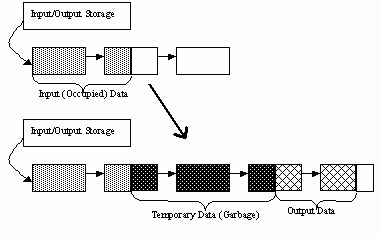
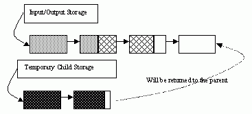

Dynamic Structures
================== 

.. highlight:: c

The section describes OpenCV 1.x API for creating growable sequences and other dynamic data structures allocated in ``CvMemStorage``. If you use the new C++, Python, Java etc interface, you will unlikely need this functionality. Use ``std::vector`` or other high-level data structures.

CvMemStorage
------------

.. ocv:struct:: CvMemStorage

A storage for various OpenCV dynamic data structures, such as ``CvSeq``, ``CvSet`` etc.

    .. ocv:member:: CvMemBlock* bottom
    
        the first memory block in the double-linked list of blocks
    
    .. ocv:member:: CvMemBlock* top
        
        the current partially allocated memory block in the list of blocks
    
    .. ocv:member:: CvMemStorage* parent
    
        the parent storage (if any) from which the new memory blocks are borrowed.
        
    .. ocv:member:: int free_space
    
        number of free bytes in the ``top`` block
        
    .. ocv:member:: int block_size
    
        the total size of the memory blocks

Memory storage is a low-level structure used to store dynamically growing data structures such as sequences, contours, graphs, subdivisions, etc. It is organized as a list of memory blocks of equal size - 
``bottom`` field is the beginning of the list of blocks and ``top`` is the currently used block, but not necessarily the last block of the list. All blocks between ``bottom`` and ``top``, not including the
latter, are considered fully occupied; all blocks between ``top`` and the last block, not including  ``top``, are considered free and ``top`` itself is partly ocupied - ``free_space`` contains the number of free bytes left in the end of ``top``.

A new memory buffer that may be allocated explicitly by :ocv:cfunc:`MemStorageAlloc` function or implicitly by higher-level functions, such as :ocv:cfunc:`SeqPush`,  :ocv:cfunc:`GraphAddEdge` etc. 

The buffer is put in the end of already allocated space in the ``top`` memory block, if there is enough free space. After allocation, ``free_space`` is decreased by the size of the allocated buffer plus some padding to keep the proper alignment. When the allocated buffer does not fit into the available portion of 
``top``, the next storage block from the list is taken as ``top`` and  ``free_space`` is reset to the whole block size prior to the allocation.

If there are no more free blocks, a new block is allocated (or borrowed from the parent, see :ocv:cfunc:`CreateChildMemStorage`) and added to the end of list. Thus, the storage behaves as a stack with ``bottom`` indicating bottom of the stack and the pair (``top``, ``free_space``)
indicating top of the stack. The stack top may be saved via :ocv:cfunc:`SaveMemStoragePos`, restored via 
:ocv:cfunc:`RestoreMemStoragePos`, or reset via :ocv:cfunc:`ClearMemStorage`.

CvMemBlock
----------

.. ocv:struct:: CvMemBlock

The structure :ocv:struct:`CvMemBlock` represents a single block of memory storage. The actual data in the memory blocks follows the header.

CvMemStoragePos
---------------

.. ocv:struct:: CvMemStoragePos

The structure stores the position in the memory storage. It is used by :ocv:cfunc:`SaveMemStoragePos` and  :ocv:cfunc:`RestoreMemStoragePos`.

CvSeq
-----

.. ocv:struct:: CvSeq

Dynamically growing sequence.

    .. ocv:member:: int flags
    
        sequence flags, including the sequence signature (CV_SEQ_MAGIC_VAL or CV_SET_MAGIC_VAL), type of the elements and some other information about the sequence.
        
    .. ocv:member:: int header_size
    
        size of the sequence header. It should be sizeof(CvSeq) at minimum. See :ocv:cfunc:`CreateSeq`.
        
    .. ocv:member:: CvSeq* h_prev
    .. ocv:member:: CvSeq* h_next
    .. ocv:member:: CvSeq* v_prev
    .. ocv:member:: CvSeq* v_next
    
        pointers to another sequences in a sequence tree. Sequence trees are used to store hierarchical contour structures, retrieved by :ocv:cfunc:`FindContours`

    .. ocv:member:: int total
    
        the number of sequence elements
        
    .. ocv:member:: int elem_size
    
        size of each sequence element in bytes
        
    .. ocv:member:: CvMemStorage* storage
    
        memory storage where the sequence resides. It can be a NULL pointer.
        
    .. ocv:member:: CvSeqBlock* first
    
        pointer to the first data block

The structure ``CvSeq`` is a base for all of OpenCV dynamic data structures.        
There are two types of sequences - dense and sparse. The base type for dense
sequences is  :ocv:struct:`CvSeq` and such sequences are used to represent
growable 1d arrays - vectors, stacks, queues, and deques. They have no gaps
in the middle - if an element is removed from the middle or inserted
into the middle of the sequence, the elements from the closer end are
shifted. Sparse sequences have  :ocv:struct:`CvSet` as a base class and they are
discussed later in more detail. They are sequences of nodes; each may be either occupied or free as indicated by the node flag. Such sequences are used for unordered data structures such as sets of elements, graphs, hash tables and so forth.

CvSlice
-------

.. ocv:struct:: CvSlice

  A sequence slice. In C++ interface the class :ocv:class:`Range` should be used instead.

  .. ocv:member:: int start_index
    
    inclusive start index of the sequence slice
        
  .. ocv:member:: int end_index
    
    exclusive end index of the sequence slice
	
There are helper functions to construct the slice and to compute its length:

.. ocv:cfunction:: CvSlice cvSlice( int start, int end )

::

    #define CV_WHOLE_SEQ_END_INDEX 0x3fffffff
    #define CV_WHOLE_SEQ  cvSlice(0, CV_WHOLE_SEQ_END_INDEX)

..

.. ocv:cfunction:: int cvSliceLength( CvSlice slice, const CvSeq* seq )

  Calculates the sequence slice length

Some of functions that operate on sequences take a ``CvSlice slice`` parameter that is often set to the whole sequence (CV_WHOLE_SEQ) by default. Either of the ``start_index`` and  ``end_index`` may be negative or exceed the sequence length. If they are equal, the slice is considered empty (i.e., contains no elements). Because sequences are treated as circular structures, the slice may select a
few elements in the end of a sequence followed by a few elements at the beginning of the sequence. For example,  ``cvSlice(-2, 3)`` in the case of a 10-element sequence will select a 5-element slice, containing the pre-last (8th), last (9th), the very first (0th), second (1th) and third (2nd)
elements. The functions normalize the slice argument in the following way:

  #. :ocv:cfunc:`SliceLength` is called to determine the length of the slice,
  #. ``start_index`` of the slice is normalized similarly to the argument of :ocv:cfunc:`GetSeqElem` (i.e., negative indices are allowed). The actual slice to process starts at the normalized  ``start_index`` and lasts :ocv:cfunc:`SliceLength` elements (again, assuming the sequence is a circular structure).

If a function does not accept a slice argument, but you want to process only a part of the sequence, the sub-sequence may be extracted using the :ocv:cfunc:`SeqSlice` function, or stored into a continuous
buffer with :ocv:cfunc:`CvtSeqToArray` (optionally, followed by :ocv:cfunc:`MakeSeqHeaderForArray`).

CvSet
-----

.. ocv:struct:: CvSet

The structure ``CvSet`` is a base for OpenCV 1.x sparse data structures. It is derived from  :ocv:struct:`CvSeq` and includes an additional member ``free_elems`` - a list of free nodes. Every node of the set, whether free or not, is an element of the underlying sequence. While there are no restrictions on elements of dense sequences, the set (and derived structures) elements must start with an integer field and be able to fit CvSetElem structure, because these two fields (an integer followed by a pointer) are required for the organization of a node set with the list of free nodes. If a node is free, the ``flags``
field is negative (the most-significant bit, or MSB, of the field is set), and the ``next_free`` points to the next free node (the first free node is referenced by the ``free_elems`` field of :ocv:struct:`CvSet`). And if a node is occupied, the ``flags`` field is positive and contains the node index that may be retrieved using the (``set_elem->flags & CV_SET_ELEM_IDX_MASK``) expressions, the rest of the node content is determined by the user. In particular, the occupied nodes are not linked as the free nodes are, so the second field can be used for such a link as well as for some different purpose. The macro ``CV_IS_SET_ELEM(set_elem_ptr)`` can be used to determined whether the specified node is occupied or not.

Initially the set and the free node list are empty. When a new node is requested from the set, it is taken from the list of free nodes, which is then updated. If the list appears to be empty, a new sequence block is allocated and all the nodes within the block are joined in the list of free nodes. Thus, the ``total``
field of the set is the total number of nodes both occupied and free. When an occupied node is released, it is added to the list of free nodes. The node released last will be occupied first.

``CvSet`` is used to represent graphs (:ocv:struct:`CvGraph`), sparse multi-dimensional arrays (:ocv:struct:`CvSparseMat`), and planar subdivisions (:ocv:struct:`CvSubdiv2D`).

CvGraph
-------
.. ocv:struct:: CvGraph

The structure ``CvGraph`` is a base for graphs used in OpenCV 1.x. It inherits from 
:ocv:struct:`CvSet`, that is, it is considered as a set of vertices. Besides, it contains another set as a member, a set of graph edges. Graphs in OpenCV are represented using adjacency lists format.

CvGraphScanner
--------------

.. ocv:struct:: CvGraphScanner

The structure ``CvGraphScanner`` is used for depth-first graph traversal. See discussion of the functions below.

CvTreeNodeIterator
------------------

.. ocv:struct:: CvTreeNodeIterator

The structure ``CvTreeNodeIterator`` is used to traverse trees of sequences.

ClearGraph
----------
Clears a graph.

.. ocv:cfunction:: void cvClearGraph( CvGraph* graph )

    :param graph: Graph

The function removes all vertices and edges from a graph. The function has O(1) time complexity.

ClearMemStorage
---------------
Clears memory storage.

.. ocv:cfunction:: void cvClearMemStorage( CvMemStorage* storage )

    :param storage: Memory storage

The function resets the top (free space boundary) of the storage to the very beginning. This function does not deallocate any memory. If the storage has a parent, the function returns
all blocks to the parent.

ClearSeq
--------
Clears a sequence.

.. ocv:cfunction:: void cvClearSeq( CvSeq* seq )

    :param seq: Sequence

The function removes all elements from a sequence. The function does not return the memory to the storage block, but this memory is reused later when new elements are added to the sequence. The function has
'O(1)' time complexity.

.. note:: It is impossible to deallocate a sequence, i.e. free space in the memory storage occupied by the sequence. Instead, call :ocv:cfunc:`ClearMemStorage` or :ocv:cfunc:`ReleaseMemStorage` from time to time somewhere in a top-level processing loop.

ClearSet
--------
Clears a set.

.. ocv:cfunction:: void cvClearSet( CvSet* setHeader )

    :param setHeader: Cleared set

The function removes all elements from set. It has O(1) time complexity.

CloneGraph
----------
Clones a graph.

.. ocv:cfunction:: CvGraph* cvCloneGraph(  const CvGraph* graph, CvMemStorage* storage )

    :param graph: The graph to copy

    :param storage: Container for the copy

The function creates a full copy of the specified graph. If the
graph vertices or edges have pointers to some external data, it can still be
shared between the copies. The vertex and edge indices in the new graph
may be different from the original because the function defragments
the vertex and edge sets.

CloneSeq
--------
Creates a copy of a sequence.

.. ocv:cfunction:: CvSeq* cvCloneSeq(  const CvSeq* seq, CvMemStorage* storage=NULL )
.. ocv:pyoldfunction:: cv.CloneSeq(seq, storage)-> None

    :param seq: Sequence

    :param storage: The destination storage block to hold the new sequence header and the copied data, if any. If it is NULL, the function uses the storage block containing the input sequence.

The function makes a complete copy of the input sequence and returns it.

The call ``cvCloneSeq( seq, storage )`` is equivalent to ``cvSeqSlice( seq, CV_WHOLE_SEQ, storage, 1 )``.

CreateChildMemStorage
---------------------
Creates child memory storage.

.. ocv:cfunction:: CvMemStorage* cvCreateChildMemStorage(CvMemStorage* parent)

    :param parent: Parent memory storage

The function creates a child memory
storage that is similar to simple memory storage except for the
differences in the memory allocation/deallocation mechanism. When a
child storage needs a new block to add to the block list, it tries
to get this block from the parent. The first unoccupied parent block
available is taken and excluded from the parent block list. If no blocks
are available, the parent either allocates a block or borrows one from
its own parent, if any. In other words, the chain, or a more complex
structure, of memory storages where every storage is a child/parent of
another is possible. When a child storage is released or even cleared,
it returns all blocks to the parent. In other aspects, child storage
is the same as simple storage.

Child storage is useful in the following situation. Imagine
that the user needs to process dynamic data residing in a given storage area and
put the result back to that same storage area. With the simplest approach,
when temporary data is resided in the same storage area as the input and
output data, the storage area will look as follows after processing:

Dynamic data processing without using child storage

That is, garbage appears in the middle of the storage. However, if
one creates a child memory storage at the beginning of processing,
writes temporary data there, and releases the child storage at the end,
no garbage will appear in the source/destination storage:

Dynamic data processing using a child storage

CreateGraph
-----------
Creates an empty graph.

.. ocv:cfunction:: CvGraph* cvCreateGraph(  int graph_flags, int header_size, int vtx_size, int edge_size, CvMemStorage* storage )

    :param graph_flags: Type of the created graph. Usually, it is either  ``CV_SEQ_KIND_GRAPH``  for generic unoriented graphs and ``CV_SEQ_KIND_GRAPH | CV_GRAPH_FLAG_ORIENTED``  for generic oriented graphs.

    :param header_size: Graph header size; may not be less than  ``sizeof(CvGraph)``

    :param vtx_size: Graph vertex size; the custom vertex structure must start with  :ocv:struct:`CvGraphVtx`  (use  ``CV_GRAPH_VERTEX_FIELDS()`` )

    :param edge_size: Graph edge size; the custom edge structure must start with  :ocv:struct:`CvGraphEdge`  (use  ``CV_GRAPH_EDGE_FIELDS()`` )

    :param storage: The graph container

The function creates an empty graph and returns a pointer to it.

CreateGraphScanner
------------------
Creates structure for depth-first graph traversal.

.. ocv:cfunction:: CvGraphScanner*  cvCreateGraphScanner(  CvGraph* graph, CvGraphVtx* vtx=NULL, int mask=CV_GRAPH_ALL_ITEMS )
    

    :param graph: Graph

    :param vtx: Initial vertex to start from. If NULL, the traversal starts from the first vertex (a vertex with the minimal index in the sequence of vertices).

    :param mask: Event mask indicating which events are of interest to the user (where  :ocv:cfunc:`NextGraphItem`  function returns control to the user) It can be  ``CV_GRAPH_ALL_ITEMS``  (all events are of interest) or a combination of the following flags:

            * **CV_GRAPH_VERTEX** stop at the graph vertices visited for the first time 
            
            * **CV_GRAPH_TREE_EDGE** stop at tree edges ( ``tree edge``  is the edge connecting the last visited vertex and the vertex to be visited next) 
            
            * **CV_GRAPH_BACK_EDGE** stop at back edges ( ``back edge``  is an edge connecting the last visited vertex with some of its ancestors in the search tree) 
            
            * **CV_GRAPH_FORWARD_EDGE** stop at forward edges ( ``forward edge``  is an edge conecting the last visited vertex with some of its descendants in the search tree. The forward edges are only possible during oriented graph traversal) 
            
            * **CV_GRAPH_CROSS_EDGE** stop at cross edges ( ``cross edge``  is an edge connecting different search trees or branches of the same tree. The  ``cross edges``  are only possible during oriented graph traversal) 
            
            * **CV_GRAPH_ANY_EDGE** stop at any edge ( ``tree, back, forward`` , and  ``cross edges`` ) 
            
            * **CV_GRAPH_NEW_TREE** stop in the beginning of every new search tree. When the traversal procedure visits all vertices and edges reachable from the initial vertex (the visited vertices together with tree edges make up a tree), it searches for some unvisited vertex in the graph and resumes the traversal process from that vertex. Before starting a new tree (including the very first tree when  ``cvNextGraphItem``  is called for the first time) it generates a  ``CV_GRAPH_NEW_TREE``  event. For unoriented graphs, each search tree corresponds to a connected component of the graph. 
            
            * **CV_GRAPH_BACKTRACKING** stop at every already visited vertex during backtracking - returning to already visited vertexes of the traversal tree.

The function creates a structure for depth-first graph traversal/search. The initialized structure is used in the 
:ocv:cfunc:`NextGraphItem`
function - the incremental traversal procedure.

CreateMemStorage
----------------
Creates memory storage.

.. ocv:cfunction:: CvMemStorage* cvCreateMemStorage( int blockSize=0 )
.. ocv:pyoldfunction:: cv.CreateMemStorage(blockSize=0) -> memstorage
    

    :param blockSize: Size of the storage blocks in bytes. If it is 0, the block size is set to a default value - currently it is  about 64K.

The function creates an empty memory storage. See 
:ocv:struct:`CvMemStorage`
description.

CreateSeq
---------
Creates a sequence.

.. ocv:cfunction:: CvSeq* cvCreateSeq(  int seqFlags, int headerSize, int elemSize, CvMemStorage* storage)
    

    :param seqFlags: Flags of the created sequence. If the sequence is not passed to any function working with a specific type of sequences, the sequence value may be set to 0, otherwise the appropriate type must be selected from the list of predefined sequence types.

    :param headerSize: Size of the sequence header; must be greater than or equal to  ``sizeof(CvSeq)`` . If a specific type or its extension is indicated, this type must fit the base type header.

    :param elemSize: Size of the sequence elements in bytes. The size must be consistent with the sequence type. For example, for a sequence of points to be created, the element type    ``CV_SEQ_ELTYPE_POINT``  should be specified and the parameter  ``elemSize``  must be equal to  ``sizeof(CvPoint)`` .

    :param storage: Sequence location

The function creates a sequence and returns
the pointer to it. The function allocates the sequence header in
the storage block as one continuous chunk and sets the structure
fields 
``flags``
, 
``elemSize``
, 
``headerSize``
, and
``storage``
to passed values, sets 
``delta_elems``
to the
default value (that may be reassigned using the 
:ocv:cfunc:`SetSeqBlockSize`
function), and clears other header fields, including the space following
the first 
``sizeof(CvSeq)``
bytes.

CreateSet
---------
Creates an empty set.

.. ocv:cfunction:: CvSet* cvCreateSet(  int set_flags, int header_size, int elem_size, CvMemStorage* storage )

    :param set_flags: Type of the created set

    :param header_size: Set header size; may not be less than  ``sizeof(CvSet)``

    :param elem_size: Set element size; may not be less than  :ocv:struct:`CvSetElem`

    :param storage: Container for the set

The function creates an empty set with a specified header size and element size, and returns the pointer to the set. This function is just a thin layer on top of 
:ocv:cfunc:`CreateSeq`.

CvtSeqToArray
-------------
Copies a sequence to one continuous block of memory.

.. ocv:cfunction:: void* cvCvtSeqToArray(  const CvSeq* seq, void* elements, CvSlice slice=CV_WHOLE_SEQ )

    :param seq: Sequence

    :param elements: Pointer to the destination array that must be large enough. It should be a pointer to data, not a matrix header.

    :param slice: The sequence portion to copy to the array

The function copies the entire sequence or subsequence to the specified buffer and returns the pointer to the buffer.

EndWriteSeq
-----------
Finishes the process of writing a sequence.

.. ocv:cfunction:: CvSeq* cvEndWriteSeq( CvSeqWriter* writer )

    :param writer: Writer state

The function finishes the writing process and
returns the pointer to the written sequence. The function also truncates
the last incomplete sequence block to return the remaining part of the
block to memory storage. After that, the sequence can be read and
modified safely. See 
:ocv:cfunc:`StartWriteSeq`
and 
:ocv:cfunc:`StartAppendToSeq`

FindGraphEdge
-------------
Finds an edge in a graph.

.. ocv:cfunction:: CvGraphEdge* cvFindGraphEdge( const CvGraph* graph, int start_idx, int end_idx )

    :param graph: Graph

    :param start_idx: Index of the starting vertex of the edge

    :param end_idx: Index of the ending vertex of the edge. For an unoriented graph, the order of the vertex parameters does not matter.
	
::

    #define cvGraphFindEdge cvFindGraphEdge

..

The function finds the graph edge connecting two specified vertices and returns a pointer to it or NULL if the edge does not exist.

FindGraphEdgeByPtr
------------------
Finds an edge in a graph by using its pointer.

.. ocv:cfunction:: CvGraphEdge* cvFindGraphEdgeByPtr(  const CvGraph* graph, const CvGraphVtx* startVtx, const CvGraphVtx* endVtx )

    :param graph: Graph

    :param startVtx: Pointer to the starting vertex of the edge

    :param endVtx: Pointer to the ending vertex of the edge. For an unoriented graph, the order of the vertex parameters does not matter.
	
::

    #define cvGraphFindEdgeByPtr cvFindGraphEdgeByPtr

..

The function finds the graph edge connecting two specified vertices and returns pointer to it or NULL if the edge does not exists.

FlushSeqWriter
--------------
Updates sequence headers from the writer.

.. ocv:cfunction:: void cvFlushSeqWriter( CvSeqWriter* writer )

    :param writer: Writer state

The function is intended to enable the user to
read sequence elements, whenever required, during the writing process,
e.g., in order to check specific conditions. The function updates the
sequence headers to make reading from the sequence possible. The writer
is not closed, however, so that the writing process can be continued at
any time. If an algorithm requires frequent flushes, consider using
:ocv:cfunc:`SeqPush`
instead.

GetGraphVtx
-----------
Finds a graph vertex by using its index.

.. ocv:cfunction:: CvGraphVtx* cvGetGraphVtx(  CvGraph* graph, int vtx_idx )

    :param graph: Graph

    :param vtx_idx: Index of the vertex

The function finds the graph vertex by using its index and returns the pointer to it or NULL if the vertex does not belong to the graph.

GetSeqElem
----------
Returns a pointer to a sequence element according to its index.

.. ocv:cfunction:: char* cvGetSeqElem( const CvSeq* seq, int index )

    :param seq: Sequence

    :param index: Index of element
	
::

    #define CV_GET_SEQ_ELEM( TYPE, seq, index )  (TYPE*)cvGetSeqElem( (CvSeq*)(seq), (index) )

..

The function finds the element with the given
index in the sequence and returns the pointer to it. If the element
is not found, the function returns 0. The function supports negative
indices, where -1 stands for the last sequence element, -2 stands for
the one before last, etc. If the sequence is most likely to consist of
a single sequence block or the desired element is likely to be located
in the first block, then the macro
``CV_GET_SEQ_ELEM( elemType, seq, index )``
should be used, where the parameter 
``elemType``
is the
type of sequence elements ( 
:ocv:struct:`CvPoint`
for example), the parameter
``seq``
is a sequence, and the parameter 
``index``
is the index
of the desired element. The macro checks first whether the desired element
belongs to the first block of the sequence and returns it if it does;
otherwise the macro calls the main function 
``GetSeqElem``
. Negative
indices always cause the 
:ocv:cfunc:`GetSeqElem`
call. The function has O(1)
time complexity assuming that the number of blocks is much smaller than the
number of elements.

GetSeqReaderPos
---------------
Returns the current reader position.

.. ocv:cfunction:: int cvGetSeqReaderPos( CvSeqReader* reader )

    :param reader: Reader state

The function returns the current reader position (within 0 ... 
``reader->seq->total``
- 1).

GetSetElem
----------
Finds a set element by its index.

.. ocv:cfunction:: CvSetElem* cvGetSetElem(  const CvSet* setHeader, int index )

    :param setHeader: Set

    :param index: Index of the set element within a sequence

The function finds a set element by its index. The function returns the pointer to it or 0 if the index is invalid or the corresponding node is free. The function supports negative indices as it uses 
:ocv:cfunc:`GetSeqElem`
to locate the node.

GraphAddEdge
------------
Adds an edge to a graph.

.. ocv:cfunction:: int cvGraphAddEdge(  CvGraph* graph, int start_idx, int end_idx, const CvGraphEdge* edge=NULL, CvGraphEdge** inserted_edge=NULL )

    :param graph: Graph

    :param start_idx: Index of the starting vertex of the edge

    :param end_idx: Index of the ending vertex of the edge. For an unoriented graph, the order of the vertex parameters does not matter.

    :param edge: Optional input parameter, initialization data for the edge

    :param inserted_edge: Optional output parameter to contain the address of the inserted edge

The function connects two specified vertices. The function returns 1 if the edge has been added successfully, 0 if the edge connecting the two vertices exists already and -1 if either of the vertices was not found, the starting and the ending vertex are the same, or there is some other critical situation. In the latter case (i.e., when the result is negative), the function also reports an error by default.

GraphAddEdgeByPtr
-----------------
Adds an edge to a graph by using its pointer.

.. ocv:cfunction:: int cvGraphAddEdgeByPtr(  CvGraph* graph, CvGraphVtx* start_vtx, CvGraphVtx* end_vtx, const CvGraphEdge* edge=NULL, CvGraphEdge** inserted_edge=NULL )

    :param graph: Graph

    :param start_vtx: Pointer to the starting vertex of the edge

    :param end_vtx: Pointer to the ending vertex of the edge. For an unoriented graph, the order of the vertex parameters does not matter.

    :param edge: Optional input parameter, initialization data for the edge

    :param inserted_edge: Optional output parameter to contain the address of the inserted edge within the edge set

The function connects two specified vertices. The
function returns 1 if the edge has been added successfully, 0 if the
edge connecting the two vertices exists already, and -1 if either of the
vertices was not found, the starting and the ending vertex are the same
or there is some other critical situation. In the latter case (i.e., when
the result is negative), the function also reports an error by default.

GraphAddVtx
-----------
Adds a vertex to a graph.

.. ocv:cfunction:: int cvGraphAddVtx(  CvGraph* graph, const CvGraphVtx* vtx=NULL, CvGraphVtx** inserted_vtx=NULL )

    :param graph: Graph

    :param vtx: Optional input argument used to initialize the added vertex (only user-defined fields beyond  ``sizeof(CvGraphVtx)``  are copied)

    :param inserted_vertex: Optional output argument. If not  ``NULL`` , the address of the new vertex is written here.

The function adds a vertex to the graph and returns the vertex index.

GraphEdgeIdx
------------
Returns the index of a graph edge.

.. ocv:cfunction:: int cvGraphEdgeIdx(  CvGraph* graph, CvGraphEdge* edge )

    :param graph: Graph

    :param edge: Pointer to the graph edge

The function returns the index of a graph edge.

GraphRemoveEdge
---------------
Removes an edge from a graph.

.. ocv:cfunction:: void cvGraphRemoveEdge(  CvGraph* graph, int start_idx, int end_idx )

    :param graph: Graph

    :param start_idx: Index of the starting vertex of the edge

    :param end_idx: Index of the ending vertex of the edge. For an unoriented graph, the order of the vertex parameters does not matter.

The function removes the edge connecting two specified vertices. If the vertices are not connected [in that order], the function does nothing.

GraphRemoveEdgeByPtr
--------------------
Removes an edge from a graph by using its pointer.

.. ocv:cfunction:: void cvGraphRemoveEdgeByPtr(  CvGraph* graph, CvGraphVtx* start_vtx, CvGraphVtx* end_vtx )

    :param graph: Graph

    :param start_vtx: Pointer to the starting vertex of the edge

    :param end_vtx: Pointer to the ending vertex of the edge. For an unoriented graph, the order of the vertex parameters does not matter.

The function removes the edge connecting two specified vertices. If the vertices are not connected [in that order], the function does nothing.

GraphRemoveVtx
--------------
Removes a vertex from a graph.

.. ocv:cfunction:: int cvGraphRemoveVtx(  CvGraph* graph, int index )

    :param graph: Graph

    :param vtx_idx: Index of the removed vertex

The function removes a vertex from a graph
together with all the edges incident to it. The function reports an error
if the input vertex does not belong to the graph. The return value is the
number of edges deleted, or -1 if the vertex does not belong to the graph.

GraphRemoveVtxByPtr
-------------------
Removes a vertex from a graph by using its pointer.

.. ocv:cfunction:: int cvGraphRemoveVtxByPtr(  CvGraph* graph, CvGraphVtx* vtx )

    :param graph: Graph

    :param vtx: Pointer to the removed vertex

The function removes a vertex from the graph by using its pointer together with all the edges incident to it. The function reports an error if the vertex does not belong to the graph. The return value is the number of edges deleted, or -1 if the vertex does not belong to the graph.

GraphVtxDegree
--------------
Counts the number of edges indicent to the vertex.

.. ocv:cfunction:: int cvGraphVtxDegree( const CvGraph* graph, int vtxIdx )

    :param graph: Graph

    :param vtxIdx: Index of the graph vertex

The function returns the number of edges incident to the specified vertex, both incoming and outgoing. To count the edges, the following code is used:

::

    CvGraphEdge* edge = vertex->first; int count = 0;
    while( edge )
    {
        edge = CV_NEXT_GRAPH_EDGE( edge, vertex );
        count++;
    }

..

The macro 
``CV_NEXT_GRAPH_EDGE( edge, vertex )``
returns the edge incident to 
``vertex``
that follows after 
``edge``
.

GraphVtxDegreeByPtr
-------------------
Finds an edge in a graph.

.. ocv:cfunction:: int cvGraphVtxDegreeByPtr(  const CvGraph* graph, const CvGraphVtx* vtx )

    :param graph: Graph

    :param vtx: Pointer to the graph vertex

The function returns the number of edges incident to the specified vertex, both incoming and outcoming.

GraphVtxIdx
-----------
Returns the index of a graph vertex.

.. ocv:cfunction:: int cvGraphVtxIdx(  CvGraph* graph, CvGraphVtx* vtx )

    :param graph: Graph

    :param vtx: Pointer to the graph vertex

The function returns the index of a graph vertex.

InitTreeNodeIterator
--------------------
Initializes the tree node iterator.

.. ocv:cfunction:: void cvInitTreeNodeIterator(  CvTreeNodeIterator* tree_iterator, const void* first, int max_level )

    :param tree_iterator: Tree iterator initialized by the function

    :param first: The initial node to start traversing from

    :param max_level: The maximal level of the tree ( ``first``  node assumed to be at the first level) to traverse up to. For example, 1 means that only nodes at the same level as  ``first``  should be visited, 2 means that the nodes on the same level as  ``first``  and their direct children should be visited, and so forth.

The function initializes the tree iterator. The tree is traversed in depth-first order.

InsertNodeIntoTree
------------------
Adds a new node to a tree.

.. ocv:cfunction:: void cvInsertNodeIntoTree(  void* node, void* parent, void* frame )

    :param node: The inserted node

    :param parent: The parent node that is already in the tree

    :param frame: The top level node. If  ``parent``  and  ``frame``  are the same, the  ``v_prev``  field of  ``node``  is set to NULL rather than  ``parent`` .

The function adds another node into tree. The function does not allocate any memory, it can only modify links of the tree nodes.

MakeSeqHeaderForArray
---------------------
Constructs a sequence header for an array.

.. ocv:cfunction:: CvSeq* cvMakeSeqHeaderForArray(  int seq_type, int header_size, int elem_size, void* elements, int total, CvSeq* seq, CvSeqBlock* block )

    :param seq_type: Type of the created sequence

    :param header_size: Size of the header of the sequence. Parameter sequence must point to the structure of that size or greater

    :param elem_size: Size of the sequence elements

    :param elements: Elements that will form a sequence

    :param total: Total number of elements in the sequence. The number of array elements must be equal to the value of this parameter.

    :param seq: Pointer to the local variable that is used as the sequence header

    :param block: Pointer to the local variable that is the header of the single sequence block

The function initializes a sequence
header for an array. The sequence header as well as the sequence block are
allocated by the user (for example, on stack). No data is copied by the
function. The resultant sequence will consists of a single block and
have NULL storage pointer; thus, it is possible to read its elements,
but the attempts to add elements to the sequence will raise an error in
most cases.

MemStorageAlloc
---------------
Allocates a memory buffer in a storage block.

.. ocv:cfunction:: void* cvMemStorageAlloc(  CvMemStorage* storage, size_t size )

    :param storage: Memory storage

    :param size: Buffer size

The function allocates a memory buffer in
a storage block. The buffer size must not exceed the storage block size,
otherwise a runtime error is raised. The buffer address is aligned by
``CV_STRUCT_ALIGN=sizeof(double)``
(for the moment) bytes.

MemStorageAllocString
---------------------
Allocates a text string in a storage block.

.. ocv:cfunction:: CvString cvMemStorageAllocString(CvMemStorage* storage, const char* ptr, int len=-1)

    :param storage: Memory storage

    :param ptr: The string

    :param len: Length of the string (not counting the ending  ``NUL`` ) . If the parameter is negative, the function computes the length.
	
::

    typedef struct CvString
    {
        int len;
        char* ptr;
    }
    CvString;

..

The function creates copy of the string
in memory storage. It returns the structure that contains user-passed
or computed length of the string and pointer to the copied string.

NextGraphItem
-------------
Executes one or more steps of the graph traversal procedure.

.. ocv:cfunction:: int cvNextGraphItem( CvGraphScanner* scanner )

    :param scanner: Graph traversal state. It is updated by this function.

The function traverses through the graph
until an event of interest to the user (that is, an event, specified
in the 
``mask``
in the 
:ocv:cfunc:`CreateGraphScanner`
call) is met or the
traversal is completed. In the first case, it returns one of the events
listed in the description of the 
``mask``
parameter above and with
the next call it resumes the traversal. In the latter case, it returns
``CV_GRAPH_OVER``
(-1). When the event is 
``CV_GRAPH_VERTEX``
,
``CV_GRAPH_BACKTRACKING``
, or 
``CV_GRAPH_NEW_TREE``
,
the currently observed vertex is stored in 
``scanner-:math:`>`vtx``
. And if the
event is edge-related, the edge itself is stored at 
``scanner-:math:`>`edge``
,
the previously visited vertex - at 
``scanner-:math:`>`vtx``
and the other ending
vertex of the edge - at 
``scanner-:math:`>`dst``
.

NextTreeNode
------------
Returns the currently observed node and moves the iterator toward the next node.

.. ocv:cfunction:: void* cvNextTreeNode( CvTreeNodeIterator* tree_iterator )

    :param tree_iterator: Tree iterator initialized by the function

The function returns the currently observed node and then updates the
iterator - moving it toward the next node. In other words, the function
behavior is similar to the 
``*p++``
expression on a typical C
pointer or C++ collection iterator. The function returns NULL if there
are no more nodes.

PrevTreeNode
------------
Returns the currently observed node and moves the iterator toward the previous node.

.. ocv:cfunction:: void* cvPrevTreeNode( CvTreeNodeIterator* tree_iterator )

    :param tree_iterator: Tree iterator initialized by the function

The function returns the currently observed node and then updates
the iterator - moving it toward the previous node. In other words,
the function behavior is similar to the 
``*p--``
expression on a
typical C pointer or C++ collection iterator. The function returns NULL
if there are no more nodes.

ReleaseGraphScanner
-------------------
Completes the graph traversal procedure.

.. ocv:cfunction:: void cvReleaseGraphScanner( CvGraphScanner** scanner )

    :param scanner: Double pointer to graph traverser

The function completes the graph traversal procedure and releases the traverser state.

ReleaseMemStorage
-----------------
Releases memory storage.

.. ocv:cfunction:: void cvReleaseMemStorage( CvMemStorage** storage )

    :param storage: Pointer to the released storage

The function deallocates all storage memory
blocks or returns them to the parent, if any. Then it deallocates the
storage header and clears the pointer to the storage. All child storage 
associated with a given parent storage block must be released before the 
parent storage block is released.

RestoreMemStoragePos
--------------------
Restores memory storage position.

.. ocv:cfunction:: void cvRestoreMemStoragePos( CvMemStorage* storage, CvMemStoragePos* pos)

    :param storage: Memory storage

    :param pos: New storage top position

The function restores the position of the storage top from the parameter 
``pos``
. This function and the function 
``cvClearMemStorage``
are the only methods to release memory occupied in memory blocks. Note again that there is no way to free memory in the middle of an occupied portion of a storage block.

SaveMemStoragePos
-----------------
Saves memory storage position.

.. ocv:cfunction:: void cvSaveMemStoragePos( const CvMemStorage* storage, CvMemStoragePos* pos)

    :param storage: Memory storage

    :param pos: The output position of the storage top

The function saves the current position
of the storage top to the parameter 
``pos``
. The function
``cvRestoreMemStoragePos``
can further retrieve this position.

SeqElemIdx
----------
Returns the index of a specific sequence element.

.. ocv:cfunction:: int cvSeqElemIdx(  const CvSeq* seq, const void* element, CvSeqBlock** block=NULL )

    :param seq: Sequence

    :param element: Pointer to the element within the sequence

    :param block: Optional argument. If the pointer is not  ``NULL`` , the address of the sequence block that contains the element is stored in this location.

The function returns the index of a sequence element or a negative number if the element is not found.

SeqInsert
---------
Inserts an element in the middle of a sequence.

.. ocv:cfunction:: char* cvSeqInsert(  CvSeq* seq, int beforeIndex, void* element=NULL )

    :param seq: Sequence

    :param beforeIndex: Index before which the element is inserted. Inserting before 0 (the minimal allowed value of the parameter) is equal to  :ocv:cfunc:`SeqPushFront`  and inserting before  ``seq->total``  (the maximal allowed value of the parameter) is equal to  :ocv:cfunc:`SeqPush` .

    :param element: Inserted element

The function shifts the sequence elements from the inserted position to the nearest end of the sequence and copies the 
``element``
content there if the pointer is not NULL. The function returns a pointer to the inserted element.

SeqInsertSlice
--------------
Inserts an array in the middle of a sequence.

.. ocv:cfunction:: void cvSeqInsertSlice(  CvSeq* seq, int beforeIndex, const CvArr* fromArr )

    :param seq: Sequence 
    
    :param beforeIndex: Index before which the array is inserted
    
    :param fromArr: The array to take elements from

The function inserts all 
``fromArr``
array elements at the specified position of the sequence. The array
``fromArr``
can be a matrix or another sequence.

SeqInvert
---------
Reverses the order of sequence elements.

.. ocv:cfunction:: void cvSeqInvert( CvSeq* seq )
    
    :param seq: Sequence 
    
The function reverses the sequence in-place - the first element becomes the last one, the last element becomes the first one and so forth.

SeqPop
------
Removes an element from the end of a sequence.

.. ocv:cfunction:: void cvSeqPop(  CvSeq* seq, void* element=NULL )
    
    :param seq: Sequence 
    
    :param element: Optional parameter . If the pointer is not zero, the function copies the removed element to this location. 
    
The function removes an element from a sequence. The function reports an error if the sequence is already empty. The function has O(1) complexity.

SeqPopFront
-----------
Removes an element from the beginning of a sequence.

.. ocv:cfunction:: void cvSeqPopFront(   CvSeq* seq, void* element=NULL )

    :param seq: Sequence

    :param element: Optional parameter. If the pointer is not zero, the function copies the removed element to this location.

The function removes an element from the beginning of a sequence. The function reports an error if the sequence is already empty. The function has O(1) complexity.

SeqPopMulti
-----------
Removes several elements from either end of a sequence.

.. ocv:cfunction:: void cvSeqPopMulti(  CvSeq* seq, void* elements, int count, int in_front=0 )

    :param seq: Sequence

    :param elements: Removed elements

    :param count: Number of elements to pop

    :param in_front: The flags specifying which end of the modified sequence. 
         
            * **CV_BACK** the elements are added to the end of the sequence 
            
            * **CV_FRONT** the elements are added to the beginning of the sequence

The function removes several elements from either end of the sequence. If the number of the elements to be removed exceeds the total number of elements in the sequence, the function removes as many elements as possible.

SeqPush
-------
Adds an element to the end of a sequence.

.. ocv:cfunction:: char* cvSeqPush(  CvSeq* seq, void* element=NULL )

    :param seq: Sequence

    :param element: Added element

The function adds an element to the end of a sequence and returns a pointer to the allocated element. If the input 
``element``
is NULL, the function simply allocates a space for one more element.

The following code demonstrates how to create a new sequence using this function:

::

    CvMemStorage* storage = cvCreateMemStorage(0);
    CvSeq* seq = cvCreateSeq( CV_32SC1, /* sequence of integer elements */
                              sizeof(CvSeq), /* header size - no extra fields */
                              sizeof(int), /* element size */
                              storage /* the container storage */ );
    int i;
    for( i = 0; i < 100; i++ )
    {
        int* added = (int*)cvSeqPush( seq, &i );
        printf( "
    }
    
    ...
    /* release memory storage in the end */
    cvReleaseMemStorage( &storage );

..

The function has O(1) complexity, but there is a faster method for writing large sequences (see 
:ocv:cfunc:`StartWriteSeq`
and related functions).

SeqPushFront
------------
Adds an element to the beginning of a sequence.

.. ocv:cfunction:: char* cvSeqPushFront( CvSeq* seq, void* element=NULL )

    :param seq: Sequence

    :param element: Added element

The function is similar to 
:ocv:cfunc:`SeqPush`
but it adds the new element to the beginning of the sequence. The function has O(1) complexity.

SeqPushMulti
------------
Pushes several elements to either end of a sequence.

.. ocv:cfunction:: void cvSeqPushMulti(  CvSeq* seq, void* elements, int count, int in_front=0 )

    :param seq: Sequence

    :param elements: Added elements

    :param count: Number of elements to push

    :param in_front: The flags specifying which end of the modified sequence. 
         
            * **CV_BACK** the elements are added to the end of the sequence 
            
            * **CV_FRONT** the elements are added to the beginning of the sequence

The function adds several elements to either
end of a sequence. The elements are added to the sequence in the same
order as they are arranged in the input array but they can fall into
different sequence blocks.

SeqRemove
---------
Removes an element from the middle of a sequence.

.. ocv:cfunction:: void cvSeqRemove(  CvSeq* seq, int index )

    :param seq: Sequence

    :param index: Index of removed element

The function removes elements with the given
index. If the index is out of range the function reports an error. An
attempt to remove an element from an empty sequence is a special
case of this situation. The function removes an element by shifting
the sequence elements between the nearest end of the sequence and the
``index``
-th position, not counting the latter.

SeqRemoveSlice
--------------
Removes a sequence slice.

.. ocv:cfunction:: void cvSeqRemoveSlice( CvSeq* seq, CvSlice slice )

    :param seq: Sequence

    :param slice: The part of the sequence to remove

The function removes a slice from the sequence.

SeqSearch
---------
Searches for an element in a sequence.

.. ocv:cfunction:: char* cvSeqSearch( CvSeq* seq, const void* elem, CvCmpFunc func,                    int is_sorted, int* elem_idx, void* userdata=NULL )

    :param seq: The sequence

    :param elem: The element to look for

    :param func: The comparison function that returns negative, zero or positive value depending on the relationships among the elements (see also  :ocv:cfunc:`SeqSort` )

    :param is_sorted: Whether the sequence is sorted or not

    :param elem_idx: Output parameter; index of the found element

    :param userdata: The user parameter passed to the compasion function; helps to avoid global variables in some cases

::

    /* a < b ? -1 : a > b ? 1 : 0 */
    typedef int (CV_CDECL* CvCmpFunc)(const void* a, const void* b, void* userdata);

..

The function searches for the element in the sequence. If
the sequence is sorted, a binary O(log(N)) search is used; otherwise, a
simple linear search is used. If the element is not found, the function
returns a NULL pointer and the index is set to the number of sequence
elements if a linear search is used, or to the smallest index
``i, seq(i)>elem``
.

SeqSlice
--------
Makes a separate header for a sequence slice.

.. ocv:cfunction:: CvSeq* cvSeqSlice(  const CvSeq* seq, CvSlice slice, CvMemStorage* storage=NULL, int copy_data=0 )

    :param seq: Sequence

    :param slice: The part of the sequence to be extracted

    :param storage: The destination storage block to hold the new sequence header and the copied data, if any. If it is NULL, the function uses the storage block containing the input sequence.

    :param copy_data: The flag that indicates whether to copy the elements of the extracted slice ( ``copy_data!=0`` ) or not ( ``copy_data=0`` )

The function creates a sequence that represents the specified slice of the input sequence. The new sequence either shares the elements with the original sequence or has its own copy of the elements. So if one needs to process a part of sequence but the processing function does not have a slice parameter, the required sub-sequence may be extracted using this function.

SeqSort
-------
Sorts sequence element using the specified comparison function.

.. ocv:cfunction:: void cvSeqSort( CvSeq* seq, CvCmpFunc func, void* userdata=NULL )

    :param seq: The sequence to sort

    :param func: The comparison function that returns a negative, zero, or positive value depending on the relationships among the elements (see the above declaration and the example below) - a similar function is used by  ``qsort``  from C runline except that in the latter,  ``userdata``  is not used

    :param userdata: The user parameter passed to the compasion function; helps to avoid global variables in some cases
	
::

    /* a < b ? -1 : a > b ? 1 : 0 */
    typedef int (CV_CDECL* CvCmpFunc)(const void* a, const void* b, void* userdata);

..

The function sorts the sequence in-place using the specified criteria. Below is an example of using this function:

::

    /* Sort 2d points in top-to-bottom left-to-right order */
    static int cmp_func( const void* _a, const void* _b, void* userdata )
    {
        CvPoint* a = (CvPoint*)_a;
        CvPoint* b = (CvPoint*)_b;
        int y_diff = a->y - b->y;
        int x_diff = a->x - b->x;
        return y_diff ? y_diff : x_diff;
    }
    
    ...
    
    CvMemStorage* storage = cvCreateMemStorage(0);
    CvSeq* seq = cvCreateSeq( CV_32SC2, sizeof(CvSeq), sizeof(CvPoint), storage );
    int i;
    
    for( i = 0; i < 10; i++ )
    {
        CvPoint pt;
        pt.x = rand() 
        pt.y = rand() 
        cvSeqPush( seq, &pt );
    }
    
    cvSeqSort( seq, cmp_func, 0 /* userdata is not used here */ );
    
    /* print out the sorted sequence */
    for( i = 0; i < seq->total; i++ )
    {
        CvPoint* pt = (CvPoint*)cvSeqElem( seq, i );
        printf( "(
    }
    
    cvReleaseMemStorage( &storage );

..

SetAdd
------
Occupies a node in the set.

.. ocv:cfunction:: int cvSetAdd(  CvSet* setHeader, CvSetElem* elem=NULL, CvSetElem** inserted_elem=NULL )

    :param setHeader: Set

    :param elem: Optional input argument, an inserted element. If not NULL, the function copies the data to the allocated node (the MSB of the first integer field is cleared after copying).

    :param inserted_elem: Optional output argument; the pointer to the allocated cell

The function allocates a new node, optionally copies
input element data to it, and returns the pointer and the index to the
node. The index value is taken from the lower bits of the 
``flags``
field of the node. The function has O(1) complexity; however, there exists
a faster function for allocating set nodes (see 
:ocv:cfunc:`SetNew`
).

SetNew
------
Adds an element to a set (fast variant).

.. ocv:cfunction:: CvSetElem* cvSetNew( CvSet* setHeader )

    :param setHeader: Set

The function is an inline lightweight variant of 
:ocv:cfunc:`SetAdd`
. It occupies a new node and returns a pointer to it rather than an index.

SetRemove
---------
Removes an element from a set.

.. ocv:cfunction:: void cvSetRemove(  CvSet* setHeader, int index )

    :param setHeader: Set

    :param index: Index of the removed element

The function removes an element with a specified
index from the set. If the node at the specified location is not occupied,
the function does nothing. The function has O(1) complexity; however,
:ocv:cfunc:`SetRemoveByPtr`
provides a quicker way to remove a set element
if it is located already.

SetRemoveByPtr
--------------
Removes a set element based on its pointer.

.. ocv:cfunction:: void cvSetRemoveByPtr(  CvSet* setHeader, void* elem )

    :param setHeader: Set

    :param elem: Removed element

The function is an inline lightweight variant of 
:ocv:cfunc:`SetRemove`
that requires an element pointer. The function does not check whether the node is occupied or not - the user should take care of that.

SetSeqBlockSize
---------------
Sets up sequence block size.

.. ocv:cfunction:: void cvSetSeqBlockSize(  CvSeq* seq, int deltaElems )

    :param seq: Sequence

    :param deltaElems: Desirable sequence block size for elements

The function affects memory allocation
granularity. When the free space in the sequence buffers has run out,
the function allocates the space for 
``deltaElems``
sequence
elements. If this block immediately follows the one previously allocated,
the two blocks are concatenated; otherwise, a new sequence block is
created. Therefore, the bigger the parameter is, the lower the possible
sequence fragmentation, but the more space in the storage block is wasted. When
the sequence is created, the parameter 
``deltaElems``
is set to
the default value of about 1K. The function can be called any time after
the sequence is created and affects future allocations. The function
can modify the passed value of the parameter to meet memory storage
constraints.

SetSeqReaderPos
---------------
Moves the reader to the specified position.

.. ocv:cfunction:: void cvSetSeqReaderPos(  CvSeqReader* reader, int index, int is_relative=0 )

    :param reader: Reader state

    :param index: The destination position. If the positioning mode is used (see the next parameter), the actual position will be  ``index``  mod  ``reader->seq->total`` .

    :param is_relative: If it is not zero, then  ``index``  is a relative to the current position

The function moves the read position to an absolute position or relative to the current position.

StartAppendToSeq
----------------
Initializes the process of writing data to a sequence.

.. ocv:cfunction:: void cvStartAppendToSeq(  CvSeq* seq, CvSeqWriter* writer )

    :param seq: Pointer to the sequence

    :param writer: Writer state; initialized by the function

The function initializes the process of
writing data to a sequence. Written elements are added to the end of the
sequence by using the
``CV_WRITE_SEQ_ELEM( written_elem, writer )``
macro. Note
that during the writing process, other operations on the sequence may
yield an incorrect result or even corrupt the sequence (see description of
:ocv:cfunc:`FlushSeqWriter`
, which helps to avoid some of these problems).

StartReadSeq
------------
Initializes the process of sequential reading from a sequence.

.. ocv:cfunction:: void cvStartReadSeq(  const CvSeq* seq, CvSeqReader* reader, int reverse=0 )

    :param seq: Sequence

    :param reader: Reader state; initialized by the function

    :param reverse: Determines the direction of the sequence traversal. If  ``reverse``  is 0, the reader is positioned at the first sequence element; otherwise it is positioned at the last element.

The function initializes the reader state. After
that, all the sequence elements from the first one down to the last one
can be read by subsequent calls of the macro
``CV_READ_SEQ_ELEM( read_elem, reader )``
in the case of forward reading and by using
``CV_REV_READ_SEQ_ELEM( read_elem, reader )``
in the case of reverse
reading. Both macros put the sequence element to 
``read_elem``
and
move the reading pointer toward the next element. A circular structure
of sequence blocks is used for the reading process, that is, after the
last element has been read by the macro 
``CV_READ_SEQ_ELEM``
, the
first element is read when the macro is called again. The same applies to
``CV_REV_READ_SEQ_ELEM``
. There is no function to finish the reading
process, since it neither changes the sequence nor creates any temporary
buffers. The reader field 
``ptr``
points to the current element of
the sequence that is to be read next. The code below demonstrates how
to use the sequence writer and reader.

::

    CvMemStorage* storage = cvCreateMemStorage(0);
    CvSeq* seq = cvCreateSeq( CV_32SC1, sizeof(CvSeq), sizeof(int), storage );
    CvSeqWriter writer;
    CvSeqReader reader;
    int i;
    
    cvStartAppendToSeq( seq, &writer );
    for( i = 0; i < 10; i++ )
    {
        int val = rand()
        CV_WRITE_SEQ_ELEM( val, writer );
        printf("
    }
    cvEndWriteSeq( &writer );
    
    cvStartReadSeq( seq, &reader, 0 );
    for( i = 0; i < seq->total; i++ )
    {
        int val;
    #if 1
        CV_READ_SEQ_ELEM( val, reader );
        printf("
    #else /* alternative way, that is prefferable if sequence elements are large,
             or their size/type is unknown at compile time */
        printf("
        CV_NEXT_SEQ_ELEM( seq->elem_size, reader );
    #endif
    }
    ...
    
    cvReleaseStorage( &storage );

..

StartWriteSeq
-------------
Creates a new sequence and initializes a writer for it.

.. ocv:cfunction:: void cvStartWriteSeq(  int seq_flags, int header_size, int elem_size, CvMemStorage* storage, CvSeqWriter* writer )

    :param seq_flags: Flags of the created sequence. If the sequence is not passed to any function working with a specific type of sequences, the sequence value may be equal to 0; otherwise the appropriate type must be selected from the list of predefined sequence types.

    :param header_size: Size of the sequence header. The parameter value may not be less than  ``sizeof(CvSeq)`` . If a certain type or extension is specified, it must fit within the base type header.

    :param elem_size: Size of the sequence elements in bytes; must be consistent with the sequence type. For example, if a sequence of points is created (element type  ``CV_SEQ_ELTYPE_POINT``  ), then the parameter  ``elem_size``  must be equal to  ``sizeof(CvPoint)`` .

    :param storage: Sequence location

    :param writer: Writer state; initialized by the function

The function is a combination of
:ocv:cfunc:`CreateSeq`
and 
:ocv:cfunc:`StartAppendToSeq`
. The pointer to the
created sequence is stored at
``writer->seq``
and is also returned by the
:ocv:cfunc:`EndWriteSeq`
function that should be called at the end.

TreeToNodeSeq
-------------
Gathers all node pointers to a single sequence.

.. ocv:cfunction:: CvSeq* cvTreeToNodeSeq(  const void* first, int header_size, CvMemStorage* storage )

    :param first: The initial tree node

    :param header_size: Header size of the created sequence (sizeof(CvSeq) is the most frequently used value)

    :param storage: Container for the sequence

The function puts pointers of all nodes reacheable from  ``first`` into a single sequence. The pointers are written sequentially in the depth-first order.

