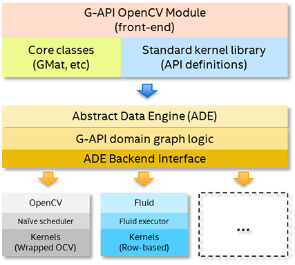

# High-level design overview {#gapi_hld}

[TOC]

# G-API High-level design overview

G-API is a heterogeneous framework and provides an unified API to
program image processing pipelines with a number of supported
backends.

The key design idea is to keep pipeline code itself platform-neutral
while specifying which kernels to use and which devices to utilize
using extra parameters at graph compile (configuration) time. This
requirement has led to the following architecture:

<!-- FIXME: Render from dot directly -->

There are three layers in this architecture:
* **API Layer** -- this is the top layer, which implements G-API
  public interface, its building blocks and semantics.
  When user constructs a pipeline with G-API, he interacts with this
  layer directly, and the entities the user operates on (like cv::GMat
  or cv::GComputation) are provided by this layer.
* **Graph Compiler Layer** -- this is the intermediate layer which
  unrolls user computation into a graph and then applies a number of
  transformations to it (e.g. optimizations). This layer is built atop
  of [ADE Framework](@ref gapi_detail_ade).
* **Backends Layer** -- this is the lowest level layer, which lists a
  number of _Backends_. In contrast with the above two layers,
  backends are highly coupled with low-level platform details, with
  every backend standing for every platform. A backend operates on a
  processed graph (coming from the graph compiler) and executes this
  graph optimally for a specific platform or device.

# API layer {#gapi_api_layer}

API layer is what user interacts with when defining and using a
pipeline (a Computation in G-API terms). API layer defines a set of
G-API _dynamic_ objects which can be used as inputs, outputs, and
intermediate data objects within a graph:
* cv::GMat
* cv::GScalar
* cv::GArray (template class)

API layer specifies a list of Operations which are defined on these
data objects -- so called kernels. See G-API [core](@ref gapi_core)
and [imgproc](@ref gapi_imgproc) namespaces for details on which
operations G-API provides by default.

G-API is not limited to these operations only -- users can define
their own kernels easily using a special macro G_TYPED_KERNEL().

API layer is also responsible for marshalling and storing operation
parameters on pipeline creation. In addition to the aforementioned
G-API dynamic objects, operations may also accept arbitrary
parameters (more on this [here](@ref gapi_detail_params)), so API
layer captures its values and stores internally upon the moment of
execution.

Finally, cv::GComputation and cv::GCompiled are the remaining
important components of API layer. The former wraps a series of G-API
expressions into an object (graph), and the latter is a product of
graph _compilation_ (see [this chapter](@ref gapi_detail_compiler) for
details).

# Graph compiler layer {#gapi_compiler}

Every G-API computation is compiled before it executes. Compilation
process is triggered in two ways:
* _implicitly_, when cv::GComputation::apply() is used. In this case,
  graph compilation is then immediately followed by execution.
* _explicitly_, when cv::GComputation::compile() is used. In this case,
  a cv::GCompiled object is returned which then can be invoked as a
  C++ functor.

The first way is recommended for cases when input data format is not
known in advance -- e.g. when it comes from an arbitrary input file.
The second way is recommended for deployment (production) scenarios
where input data characteristics are usually predefined.

Graph compilation process is built atop of ADE Framework. Initially, a
bipartite graph is generated from expressions captured by API layer.
This graph contains nodes of two types: _Data_ and _Operations_. Graph
always starts and ends with a Data node(s), with Operations nodes
in-between. Every Operation node has inputs and outputs, both are Data
nodes.

After the initial graph is generated, it is actually processed by a
number of graph transformations, called _passes_. ADE Framework acts
as a compiler pass management engine, and passes are written
specifically for G-API.

There are different passes which check graph validity, refine details
on operations and data, organize nodes into clusters ("Islands") based
on affinity or user-specified regioning[TBD], and more. Backends also
are able to inject backend-specific passes into the compilation
process, see more on this in the [dedicated chapter](@ref gapi_detail_meta).

Result of graph compilation is a compiled object, represented by class
cv::GCompiled. A new cv::GCompiled object is always created regardless
if there was an explicit or implicit compilation request (see
above). Actual graph execution happens within cv::GCompiled and is
determined by backends which participated in the graph compilation.

@sa cv::GComputation::apply(), cv::GComputation::compile(), cv::GCompiled

# Backends layer {#gapi_backends}

The above diagram lists two backends, _OpenCV_ and _Fluid_. _OpenCV_
is so-called "reference backend", which implements G-API operations
using plain old OpenCV functions. This backend is useful for
prototyping on a familiar development system. _Fluid_ is a plugin for
cache-efficient execution on CPU -- it implements a different
execution policy and operates with its own, special kernels. Fluid
backend allows to achieve less memory footprint and better memory
locality when running on CPU.

There may be more backends available, e.g. Halide, OpenCL, etc. --
G-API provides an uniform internal API to develop backends so any
enthusiast or a company are free to scale G-API on a new platform or
accelerator. In terms of OpenCV infrastructure, every new backend is a
new distinct OpenCV module, which extends G-API when build as a part
of OpenCV.

# Graph execution {#gapi_compiled}

The way graph executed is defined by backends selected for
compilation. In fact, every backend builds its own execution script as
the final stage of graph compilation process, when an executable
(compiled) object is being generated. For example, in OpenCV backend,
this script is just a topologically-sorted sequence of OpenCV
functions to call; for Fluid backend, it is a similar thing -- a
topologically sorted list of _Agents_ processing lines of input on
every iteration.

Graph execution is triggered in two ways:
* via cv::GComputation::apply(), with graph compiled in-place exactly
  for the given input data;
* via cv::GCompiled::operator()(), when the graph has been precompiled.

Both methods are polimorphic and take a variadic number of arguments,
with validity checks performed in runtime. If a number, shapes, and
formats of passed data objects differ from expected, a run-time
exception is thrown. G-API also provides _typed_ wrappers to move
these checks to the compile time -- see `cv::GComputationT<>`.

G-API graph execution is declared stateless -- it means that a
compiled functor (cv::GCompiled) acts like a pure C++ function and
provides the same result for the same set of input arguments.

Both execution methods take \f$N+M\f$ parameters, where \f$N\f$ is a
number of inputs, and \f$M\f$ is a number of outputs on which a
cv::GComputation is defined. Note that while G-API types (cv::GMat,
etc) are used in definition, the execution methods accept OpenCV's
traditional data types (like cv::Mat) which hold actual data -- see
table in [parameter marshalling](@ref gapi_detail_params).

@sa @ref gapi_impl, @ref gapi_kernel_api
