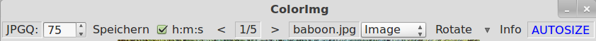

Designing controls for the buttonbar (Mode: WITH_QT) 
****************************************************

In previous versions of OpenCV you can see a fixed number of controls inside a buttonbar. Let us call these controls standard controls. Each version of OpenCV, which was compiled with an activated option WITH_QT delivers a buttonbar like the following:

Each of these standard controls is of type QAction and contains an icon as you can see in the image above. The last icon for the properties window is greyed out if there is nothing in the source code using it.

Starting with OpenCV 2.4.4 you can compose a buttonbar yourself and this is done by an interpreted \*.cfg file. This file is based on XML-Format and contains a complete description for buttonbars of several OpenCV windows.
Compared with the former standard buttonbar you are free to set a new order inside the buttonbar and - more important - you can add controls which can communicate with a self written application. One example for this purpose is the example application buttonsqt.cpp.  
The HighGUI module tries to find a \*.cfg file, whose name is fitting to the executable and is expected in the same directory. Let us first assume, that you start an example program like kmeans without an existing file kmeans.cfg. In such a case you may be disappointed because the buttonbar is no longer present, but you get it back quite easy by writing kmeans.cfg yourself:

.. code-block:: xml

   <?xml version="1.0"?>
   <!-- kmeans.cfg -->
   <opencv_storage>
    <!-- configuration to get all standard controls - just modify window name  -->
    <Wnd1>
      "clusters"
      "$Zoom"
      "$Panning"
      "$SaveImg"
      "$PropWnd"
    </Wnd1>
   </opencv_storage>

All lines between <Wnd1></Wnd1> are for configuring the buttonbar of one window. The first line inside <Wnd1></Wnd1> is equivalent to the window title. If cv::namedWindow("clusters") is used in the source code "clusters" has to be the first line in <Wnd1></Wnd1> block. 
The command $Zoom generates the first 4 icons of the former standard buttonbar. Followed by $Panning containing 4 further icons. With the line $SaveImage you generate the floppy disk icon and $PropWnd represents the external properies window which is greyed as long as you do not use specific code.

.. code-block:: xml

   <Wnd1>
      "clusters"
      "CV_WINDOW_NORMAL 25,50 700*600"
      "#$Zoom"
      "#$Panning"
      "$SaveImg"
      "$PropWnd"
   </Wnd1>

You can use the comment char # to deactivate some of standard controls programmed inside /modules/highgui/src/window_QT.cpp.  In this case only two standard controls (and nothing else) would remain active.
Additonal you can define for each window it's initial mode,position and size. With a line like "CV_WINDOW_NORMAL 25,50 700*600" the window mode is possibly changed away from "AUTOSIZE" to predefined values. 
In this case we have defined an window offset x=25,y=50 and a window size of 700*600 Pixel.

Please try to make a \*.cfg for the delaunay executable and test it with activated/decactivated lines inside <Wnd1></Wnd1>.

Let us now have a look on an example with user interaction by buttons additional to keystrokes. You find the complete source code of this example in /samples/cpp/buttonsqt.cpp

The executable of the example ist called buttonsqt and so we need a file buttonsqt.cfg which you can find in /samples/cpp like the source code:

.. code-block:: xml

    <?xml version="1.0"?>
    <opencv_storage>

    <MinimumVersion>"2.4.3"</MinimumVersion>
    <ReduceValue>4</ReduceValue>
    <verboseLevel>0</verboseLevel>

    <LanguageTransTab>
      <!-- name on left side, content to display in the control on right side  -->
      "LoadImg" "Laden"
      "SaveImg" "Speichern"
      "PrevImg" " &lt; "
      "NextImg" " &gt; "
      "S:" "[[font color=blue]Farb[/font][font size=3.0]s&auml;tti[/font][font color=green size=3.0]gung[/font]]"
      "[Help]" "Hilfe"
    </LanguageTransTab>

    <!-- configurations for specific windows.  Each window may get a buttonbar  -->
    <Wnd1>
      "ColorImg"
      "$Label JPGQ:"
      "$Spin JPGQ 0,100,75"
      "$Button SaveImg"
      "$CheckBox h:m:s true"
      "$Button PrevImg"
      "$Label"
      "$Button NextImg"
      "$Label"
      "$Combo ComboSrc Image,Camera,Video"
      "$Menue Rotate 90,180,-90,FlipVert,FlipHorz"
      "$Button Info"
      "$Label"
      "$StatusLine xy RGB WidthHeight Viewport Zoom"
      "$applyLanguage"
    </Wnd1>

    <Wnd2>
      "Saturation"
      "#$Zoom"
      "#$Panning"
      "$SaveImg"
      "$PropWnd"
      "$Label S:"
      "$SliderSpin Sat 0,100,35 emit"
      "$CheckText [Help] ;w44"
      "$CheckText Histo false ;w44"
      "$Edit E1 QLineEdit Field ; w270 left"
      "$StatusLine filename Zoom xy RGB"
      "$applyLanguage"
    </Wnd2>

    <Wnd3>
	"Dummy"
	"$Zoom"
	"$Panning"
	"$SaveImg"
	"$PropWnd"
    </Wnd3>

    </opencv_storage>

All lines between <Wnd1></Wnd1> are for configuring the buttonbar and statusline of one window. The first line inside <Wnd1></Wnd1> is equivalent here to cv::namedWindow("ColorImg", WinMode); inside the source code.
An unused configuration for all standard controls is inside <Wnd3></Wnd3> because there is no window with the name "Dummy". You find some used standard controls (with icons) inside <Wnd2></Wnd2>

Let use take a closer look to the buttonbar of the window "ColorImg" now ( here inside <Wnd1></Wnd1> ). 
All lines behind "ColorImg" define special commands to generate Qt-Controls. 

Each line is composed in the following way:

[command] [name] [params] [options]

Each command begins with $ and they generate different types of classes in window_QT.cpp source code.

in the moment the following commands for generating controls are available:

$Label	 $Edit	 $Button	 $CheckBox	 $Spin	 $SliderSpin	 $Combo	 $Menu 

For the purpose of display there exists a language translation table. So each [name] may have a displayed equivalent possibly consisting out of more than one word, while [name] has to consist out of one word.

The description for labels differ a little bit. Reading or modification access to labels is done just by the index of the element - so even [name] is optional.

What are the Qt classes behind the used commands ?

* QLabel    - The only control without [name] but with support for different colors and fonts (here: $Label JPGQ: )
 
* QSpinBox  - SpinBox with lower, upper, and default value (here: $Spin JPGQ 0,100,75 ). To read out the active value the defined [name] "JPGQ" is necessary, followed by the lower/upper limit and the default value.

* QAction   - This control can work like a button without icon and we use the command $Button e.g. followed by "SaveImg" as the [name] of the button. 

* QCheckBox - Control to set (and display) a binary status. Here we define [name] h:m:s and set an activated state with "true" as parameter.

* QComboBox - Behind the [name] ComboSrc we define e.g. three default values: Image,Camera,Video each of it can be selected.

* QMenue    - Behind the [name] Rotate we define some "," separated default values.

If you use $Button as a command, the internal used class is QAction like it is done for all standard controls. But each standard control has a defined icon, while $Button does not require / support any icons.
All controls of type QAction appear as contex menue by pressing the right mouse button. QAction controls have only a border if you roll on.

The buttonbar we composed inside  <Wnd1></Wnd1> looks in this way:

How does it work ?
===================
  
To see the layout of a buttonbar it is sufficient to create a \*.cfg file with window names which are fitting. All the layout things are done inside the HighGUI module. So in the first approach no source code change is necessary.
But this is only sencefull in case of the mentioned standard controls $Zoom $Panning $SaveImg $PropWnd. How can we read or modify the content of buttonbar controls and how is that done in the source code ?

Let us analyze the following four lines:

"$Button PrevImg"

"$Label"

"$Button NextImg"

"$Label"
  
As we can see in the image, the names PrevImg and NextImg are translated for purpose of display into the symbols "<" and ">". This is done by entries between <LanguageTransTab></LanguageTransTab>. Between the prev/next buttons we want to display the image number in relation to total. 
Labels do not need to have a name so for access we just use the index of occurency.

.. code-block:: cpp

    void UpdateContent( string strpos, string name )
    {
	try {
	    setButtonBarContent("ColorImg", EMOD_Label, 1, (char *) strpos.c_str());
	    setButtonBarContent("ColorImg", EMOD_Label, 2, (char *) name.c_str());
	}
	catch (const std::exception &e)
	{
	    std::cout << "setButtonBarContent Error: " << e.what() << endl;
	}
    }

.. code-block:: cpp

    string strPos = cv::format("%d/%d", idx+1, cnt );
    UpdateContent( strPos, nameVec[idx] ); // set content of a two label fields in "ColorImg"

We see how the image number and imagename are set to label fields. 

How do the HighGUI module and the application interact ?
========================================================

When the HighGUI module is compiled, nothing is known about your application and so a direct communication is not possible. But a pressed button is registered inside the HighGUI module and leeds to a filled vector element. 
The application periodically looks for registered commands inside HighGUI. For this purpose the following code sequence  is applied:

.. code-block:: cpp

        //------------------------ some events from window "ColorImg"  ?
        string strCmd = "";
        cv::getCommandVec("ColorImg", stringVec, csBuffer );
        if ( strlen(csBuffer) > 0  )
        {
            strCmd = string(csBuffer);
        }
        for ( int j=0; j < stringVec.size() ; j++ )
        {
          if ( stringVec[j] == "h:m:s|1"  ) USE_hms  = true;
          if ( stringVec[j] == "h:m:s|0"  ) USE_hms  = false;

          // ------------- content of SpinField :
          int ipos = stringVec[j].find("JPGQ");
          if ( ipos >= 0 )
          {
	    ipos = stringVec[j].find("|");
	    iSaveQ = atoi(&stringVec[j][ipos+1]);
          }   
        }
    
        if (strCmd == "PrevImg") iKey = 'p';
        if (strCmd == "NextImg") iKey = 'n';
        if (strCmd == "SaveImg") iKey = 's';
        if ( iKey == 'p')
        {
            idx--;
            if (idx < 0) idx = 0;
            displayStatusBar("ColorImg","Loading previous image .....", 500 );
        }

The central function cv::getCommandVec("ColorImg", stringVec, csBuffer ) does two things. The first one is to fetch an existing command. The second one is to read out all control contents and save it in stringVec[].
The whole code sequence works inside a time loop with a cycle time set by 
iKey = cv::waitKey(5);

What happens if we use QSpinBox and change the value of jpeg Quality ? No command is triggered in this case, but iSaveQ is changed. May be you press "SaveImg" ( "$Button SaveImg" ) to save the displayed image with the specific quality.
But keep in mind $SaveImg to be a command (generating the floppy disk icon ) and so completly different from a name. 

Let us now have a look on the lines between <Wnd2></Wnd2> adressing window "Saturation".

The first two icons belong to  "$SaveImg"  and  "$PropWnd" both are OpenCV standard controls.
The next line inside <Wnd2></Wnd2> is 

"$SliderSpin Sat 0,100,35 emit"

$SliderSpin generates two controls. The first one is QSlider and right from it you can see QSpinBox. Both controls are glued with another by the signal/slot mechanism of Qt.
The word emit in the line "$SliderSpin Sat 0,100,35 emit" is very important because a command is set. So we see any change in "Saturation" at once. That is the decisive difference towards "$Spin JPGQ 0,100,75"
So an additional "emit" forces an immediate action. 

"$CheckText [Help] ;w44"
works like a button but delivers a different optical output.

A modification of it is given by the line
"$CheckText Histo false ;w44"
In this case we get a dual state button similar to QCheckBox but with different look and feel.

Finaly we get a QLineEdit control by using:
"$Edit E1 QLineEdit ; w270 left"
 

Translation of strings
======================

As you have seen in the pictures (or by starting buttonsqt) you can compose a QLabel field with different font sizes and colors. To trigger a translation two conditions have to be fullfilled:

an entry like 
   "S:"    	"[[font color=blue]Farb[/font][font size=3.0]s&auml;tti[/font][font color=green size=3.0]gung[/font]]"
has to exist, and the translation command "$applyLanguage" has to be a line inside the description.

We have to distiguish between the name of a control and the displayed string:

   "PrevImg" " &lt; "

   "NextImg" " &gt; "
  
The names are PrevImg or NextImg but we see the symbols "<" or ">" displayed according to XML-Syntax.
Qt uses HTML-Syntax for the content of QLabel.  To configure that inside XML we use the brackets [] instead of the <> HTML-tagging.

Suggestion: Change the output of "Farbsättigung" to get more experienced with it !

Setting the statusbar content
=============================

While moving the mouse across an OpenCV window, you see some informations in the statusbar.
Propably you are familiar with an output consisting out of coordinate position and color value.
To increase the flexibility of such an output you can define a line like the following now:

   "$StatusLine xy RGB WidthHeight Viewport Zoom"

The first two components xy and RGB have been used in previous OpenCV versions. Now you can use predefined components
or a component of your own. 

* WidthHeight corresponds to the image size in pixels
* Viewport corresponds to the displayed image size in pixels  (skipped in case of AUTOSIZE)
* Zoom contains the scale in percentage

If we can´t resize the window we are in AUTOSIZE Mode and so we see 100% as fixed Zoom output.
The default definition (without entry in \*.cfg ) is:
 
   xy RGB Zoom 

Let us have a look on the statusline of the window saturation:

  "$StatusLine filename Zoom xy RGB"

How becomes filename a part of the statusline ?
This cannot be done without information from the application and so there is a function call

   cv::setMapContent("Saturation", "filename", (char * ) nameVec[idx].c_str() );

In this way you can set any information to the statusline together with position specific one.

Just use 

   cv::displayStatusBar(  winname, text, delayms )

if you want to set a new text in the statusbar.

