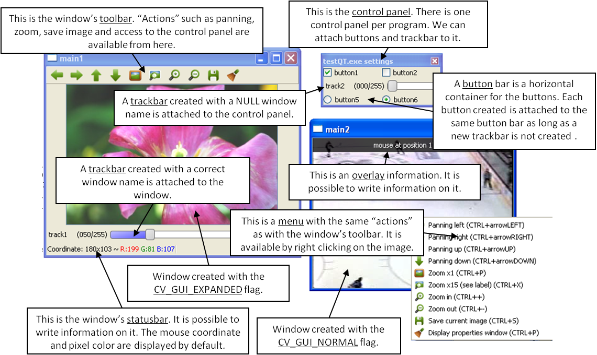

Qt New Functions
================
.. highlight:: cpp

This figure explains new functionality implemented with Qt* GUI. The new GUI provides a statusbar, a toolbar, and a control panel. The control panel can have trackbars and buttonbars attached to it.

*
    To attach a trackbar, the window name parameter must be NULL.

*
    To attach a buttonbar, a button must be created.
    If the last bar attached to the control panel is a buttonbar, the new button is added to the right of the last button.
    If the last bar attached to the control panel is a trackbar, or the control panel is empty, a new buttonbar is created. Then, a new button is attached to it.

The following code is an example used to generate the figure. ::

    int main(int argc, char *argv[])
        int value = 50;
        int value2 = 0;

        cvNamedWindow("main1",CV_WINDOW_NORMAL);
        cvNamedWindow("main2",CV_WINDOW_AUTOSIZE | CV_GUI_NORMAL);

        cvCreateTrackbar( "track1", "main1", &value, 255,  NULL);//OK tested
        char* nameb1 = "button1";
        char* nameb2 = "button2";
        cvCreateButton(nameb1,callbackButton,nameb1,CV_CHECKBOX,1);

        cvCreateButton(nameb2,callbackButton,nameb2,CV_CHECKBOX,0);
        cvCreateTrackbar( "track2", NULL, &value2, 255, NULL);
        cvCreateButton("button5",callbackButton1,NULL,CV_RADIOBOX,0);
        cvCreateButton("button6",callbackButton2,NULL,CV_RADIOBOX,1);

        cvSetMouseCallback( "main2",on_mouse,NULL );

        IplImage* img1 = cvLoadImage("files/flower.jpg");
        IplImage* img2 = cvCreateImage(cvGetSize(img1),8,3);
        CvCapture* video = cvCaptureFromFile("files/hockey.avi");
        IplImage* img3 = cvCreateImage(cvGetSize(cvQueryFrame(video)),8,3);

        while(cvWaitKey(33) != 27)
        {
            cvAddS(img1,cvScalarAll(value),img2);
            cvAddS(cvQueryFrame(video),cvScalarAll(value2),img3);
            cvShowImage("main1",img2);
            cvShowImage("main2",img3);
        }

        cvDestroyAllWindows();
        cvReleaseImage(&img1);
        cvReleaseImage(&img2);
        cvReleaseImage(&img3);
        cvReleaseCapture(&video);
        return 0;
    }

.. index:: setWindowProperty

.. _setWindowProperty:

setWindowProperty
---------------------
.. c:function:: void setWindowProperty(const string& name, int prop_id, double prop_value)

    Changes parameters of a window dynamically.

    :param name: Name of the window.

    :param prop_id: Window property to edit. The following operation flags are available:
        
            * **CV_WND_PROP_FULLSCREEN** Change if the window is fullscreen ( ``CV_WINDOW_NORMAL``  or  ``CV_WINDOW_FULLSCREEN`` ).
            
            * **CV_WND_PROP_AUTOSIZE** Change if the window is resizable (texttt {CV\_WINDOW\_NORMAL}  or   ``CV_WINDOW_AUTOSIZE`` ).
            
            * **CV_WND_PROP_ASPECTRATIO** Change if the aspect ratio of the image is preserved  (texttt {CV\_WINDOW\_FREERATIO}  or  ``CV_WINDOW_KEEPRATIO`` ).
            

    :param prop_value: New value of the window property. The following operation flags are available:
        
            * **CV_WINDOW_NORMAL** Change the window to normal size or make the window resizable.
            
            * **CV_WINDOW_AUTOSIZE** Constrain the size by the displayed image. The window is not resizable.
            
            * **CV_WINDOW_FULLSCREEN** Change the window to fullscreen.
            
            * **CV_WINDOW_FREERATIO** Make the window resizable without any ratio constraints.
            
            * **CV_WINDOW_KEEPRATIO** Make the window resizable, but preserve the proportions of the displayed image.
            

The function ``setWindowProperty``  enables changing properties of a window.

.. index:: getWindowProperty

getWindowProperty
---------------------
.. c:function:: void  getWindowProperty(const char* name, int prop_id)

    Provides parameters of a window.

    :param name: Name of the window.

    :param prop_id: Window property to retrive. The following operation flags are available:
        
            * **CV_WND_PROP_FULLSCREEN** Change if the window is fullscreen ( ``CV_WINDOW_NORMAL``  or  ``CV_WINDOW_FULLSCREEN`` ).
            
            * **CV_WND_PROP_AUTOSIZE** Change if the window is resizable (texttt {CV\_WINDOW\_NORMAL}  or   ``CV_WINDOW_AUTOSIZE`` ).
            
            * **CV_WND_PROP_ASPECTRATIO** Change if the aspect ratio of the image is preserved  (texttt {CV\_WINDOW\_FREERATIO}  or  ``CV_WINDOW_KEEPRATIO`` ).
            

See
:ref:`setWindowProperty` to know the meaning of the returned values.

The function ``getWindowProperty``  returns properties of a window.

.. index:: fontQt

.. _fontQt:

fontQt
----------
.. c:function:: CvFont fontQt(const string& nameFont, int pointSize  = -1, Scalar color = Scalar::all(0), int weight = CV_FONT_NORMAL,  int style = CV_STYLE_NORMAL, int spacing = 0)

    Creates the font to draw a text on an image.

    :param nameFont: Name of the font. The name should match the name of a system font (such as *Times*). If the font is not found, a default one is used.

    :param pointSize: Size of the font. If not specified, equal zero or negative, the point size of the font is set to a system-dependent default value. Generally, this is 12 points.

    :param color: Color of the font in BGRA --  A = 255 is fully transparent. Use the macro ``CV _ RGB`` for simplicity.

    :param weight: Font weight. The following operation flags are available:
        
            * **CV_FONT_LIGHT** Weight of 25
            
            * **CV_FONT_NORMAL** Weight of 50
            
            * **CV_FONT_DEMIBOLD** Weight of 63
            
            * **CV_FONT_BOLD** Weight of 75
            
            * **CV_FONT_BLACK** Weight of 87

            You can also specify a positive integer for better control.

    :param style: Font style. The following operation flags are available:
        
            * **CV_STYLE_NORMAL** Normal font
            
            * **CV_STYLE_ITALIC** Italic font
            
            * **CV_STYLE_OBLIQUE** Oblique font
            
    :param spacing: Spacing between characters. It can be negative or positive.

The function ``fontQt`` creates a ``CvFont`` object. This ``CvFont`` is not compatible with ``putText`` .

A basic usage of this function is the following: ::

    CvFont font = fontQt(''Times'');
    addText( img1, ``Hello World !'', Point(50,50), font);

.. index:: addText

addText
-----------
.. c:function:: void addText(const Mat& img, const string& text, Point location, CvFont *font)

    Creates the font to draw a text on an image.

    :param img: Image where the text should be drawn.

    :param text: Text to write on an image.

    :param location: Point(x,y) where the text should start on an image.

    :param font: Font to use to draw a text.

The function ``addText`` draws
*text*
on an image
*img*
using a specific font
*font*
(see example
:ref:`fontQt` )

.. index:: displayOverlay

displayOverlay
------------------
.. c:function:: void displayOverlay(const string& name, const string& text, int delay)

    Displays a  text on a window image as an overlay for a specified duration.  

    :param name: Name of the window.

    :param text: Overlay text to write on a window image.

    :param delay: The period (in milliseconds), during which the overlay text is displayed. If this function is called before the previous overlay text timed out, the timer is restarted and the text is updated. If this value is zero, the text never disappears.

The function ``displayOverlay`` displays useful information/tips on top of the window for a certain amount of time *delay*. The function does not modify the image, displayed in the window, that is, after the specified delay the original content of the window is restored.

.. index:: displayStatusBar

displayStatusBar
--------------------
.. c:function:: void displayStatusBar(const string& name, const string& text, int delay)

    Displays a text on the window statusbar during the specified period of time.

    :param name: Name of the window.

    :param text: Text to write on the window statusbar.

    :param delay: Duration (in milliseconds) to display the text. If this function is called before the previous text timed out, the timer is restarted and the text is updated. If this value is zero, the text never disappears.

The function ``displayOverlay`` displays useful information/tips on top of the window for a certain amount of time
*delay*
. This information is displayed on the window statubar (the window must be created with the ``CV_GUI_EXPANDED`` flags).

.. index:: createOpenGLCallback

createOpenGLCallback
------------------------

.. c:function:: void createOpenGLCallback( const string& window_name, OpenGLCallback callbackOpenGL, void* userdata CV_DEFAULT(NULL), double angle CV_DEFAULT(-1), double zmin CV_DEFAULT(-1), double zmax CV_DEFAULT(-1)

    Creates a callback function called to draw OpenGL on top the the image display by ``windowname``.

    :param window_name: Name of the window.

    :param callbackOpenGL: Pointer to the function to be called every frame. This function should be prototyped as  ``void Foo(*void);`` .

    :param userdata: Pointer passed to the callback function.  *(Optional)*

    :param angle: Parameter specifying the field of view angle, in degrees, in the y direction. Default value is 45 degrees. *(Optional)*

    :param zmin: Parameter specifying the distance from the viewer to the near clipping plane (always positive). Default value is 0.01. *(Optional)*

    :param zmax: Parameter specifying the distance from the viewer to the far clipping plane (always positive). Default value is 1000. *(Optional)*

The function ``createOpenGLCallback`` can be used to draw 3D data on the window.  An example of callback could be: ::

    void on_opengl(void* param)
    {
        glLoadIdentity();

        glTranslated(0.0, 0.0, -1.0);

        glRotatef( 55, 1, 0, 0 );
        glRotatef( 45, 0, 1, 0 );
        glRotatef( 0, 0, 0, 1 );

        static const int coords[6][4][3] = {
            { { +1, -1, -1 }, { -1, -1, -1 }, { -1, +1, -1 }, { +1, +1, -1 } },
            { { +1, +1, -1 }, { -1, +1, -1 }, { -1, +1, +1 }, { +1, +1, +1 } },
            { { +1, -1, +1 }, { +1, -1, -1 }, { +1, +1, -1 }, { +1, +1, +1 } },
            { { -1, -1, -1 }, { -1, -1, +1 }, { -1, +1, +1 }, { -1, +1, -1 } },
            { { +1, -1, +1 }, { -1, -1, +1 }, { -1, -1, -1 }, { +1, -1, -1 } },
            { { -1, -1, +1 }, { +1, -1, +1 }, { +1, +1, +1 }, { -1, +1, +1 } }
        };

        for (int i = 0; i < 6; ++i) {
                    glColor3ub( i*20, 100+i*10, i*42 );
                    glBegin(GL_QUADS);
                    for (int j = 0; j < 4; ++j) {
                            glVertex3d(0.2 * coords[i][j][0], 0.2 * coords[i][j][1], 0.2 * coords[i][j][2]);
                    }
                    glEnd();
        }
    }

.. index:: saveWindowParameters

saveWindowParameters
------------------------

.. c:function:: void saveWindowParameters(const string& name)

    Saves parameters of the window ``windowname`` .

    :param name: Name of the window.

The function ``saveWindowParameters`` saves size, location, flags,  trackbars value, zoom and panning location of the window
``window_name`` .

.. index:: loadWindowParameters

loadWindowParameters
------------------------

.. c:function:: void loadWindowParameters(const string& name)

    Loads parameters of the window ``windowname`` .

    :param name: Name of the window.

The function ``loadWindowParameters`` loads size, location, flags, trackbars value, zoom and panning location of the window
``window_name`` .

.. index:: createButton

createButton
----------------

.. c:function:: createButton( const string& button_name CV_DEFAULT(NULL),ButtonCallback on_change CV_DEFAULT(NULL), void* userdata CV_DEFAULT(NULL), int button_type CV_DEFAULT(CV_PUSH_BUTTON), int initial_button_state CV_DEFAULT(0))

    Creates a callback function called to draw OpenGL on top of the image display by ``windowname`` .

    :param  button_name: Name of the button.

    :param on_change: Pointer to the function to be called every time the button changes its state. This function should be prototyped as  ``void Foo(int state,*void);`` .  *state*  is the current state of the button. It could be -1 for a push button, 0 or 1 for a check/radio box button.

    :param userdata: Pointer passed to the callback function.  *(Optional)*

The ``button_type`` parameter can be any of the following:
    * (Optional -- Will be a push button by default.)??

    * **CV_PUSH_BUTTON** Push button

    * **CV_CHECKBOX** Checkbox button

    * **CV_RADIOBOX** Radiobox button. The radiobox on the same buttonbar (same line) are exclusive, that is only one can be selected at a time.

    * **initial_button_state** Default state of the button. Use for checkbox and radiobox. Its value could be 0 or 1.  *(Optional)*

The function ``createButton`` attaches a button to the control panel. Each button is added to a buttonbar to the right of the last button.
A new buttonbar is created if nothing was attached to the control panel before, or if the last element attached to the control panel was a trackbar.

Here are various examples of the ``createButton`` function call: ::

    createButton(NULL,callbackButton);//create a push button "button 0", that will call callbackButton.
    createButton("button2",callbackButton,NULL,CV_CHECKBOX,0);
    createButton("button3",callbackButton,&value);
    createButton("button5",callbackButton1,NULL,CV_RADIOBOX);
    createButton("button6",callbackButton2,NULL,CV_PUSH_BUTTON,1);

..

