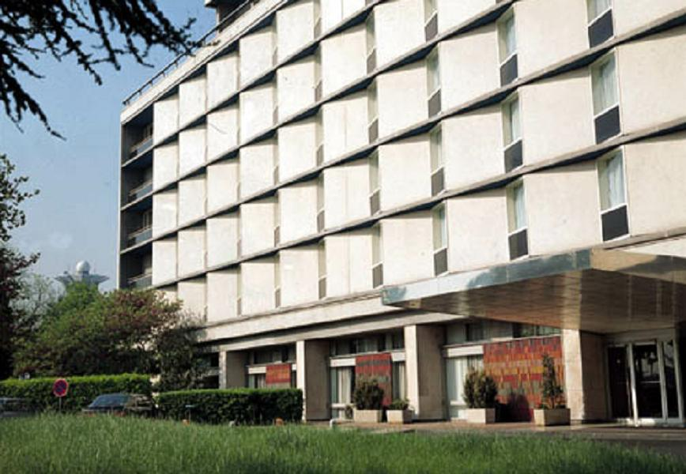
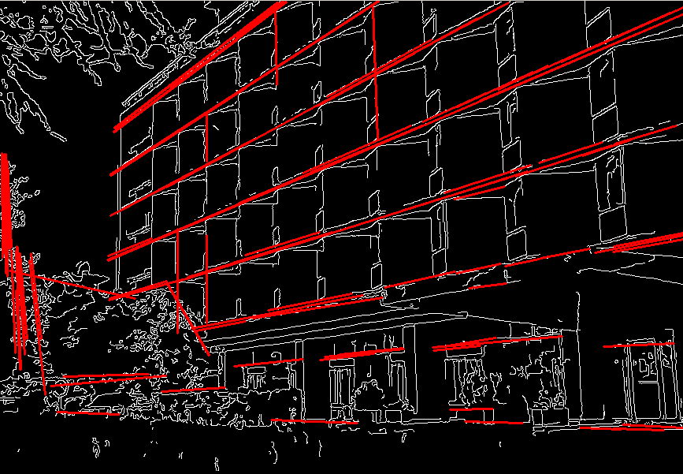
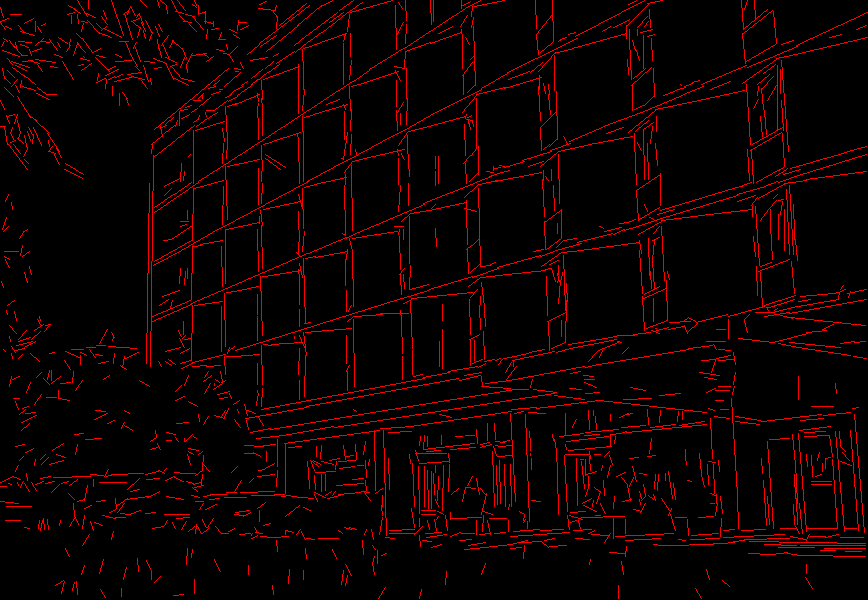

Feature Detection
=================

.. highlight:: cpp

Canny
---------
Finds edges in an image using the [Canny86]_ algorithm.

.. ocv:function:: void Canny( InputArray image, OutputArray edges, double threshold1, double threshold2, int apertureSize=3, bool L2gradient=false )

.. ocv:pyfunction:: cv2.Canny(image, threshold1, threshold2[, edges[, apertureSize[, L2gradient]]]) -> edges

.. ocv:cfunction:: void cvCanny( const CvArr* image, CvArr* edges, double threshold1, double threshold2, int aperture_size=3 )

    :param image: 8-bit input image.

    :param edges: output edge map; single channels 8-bit image, which has the same size as  ``image`` .

    :param threshold1: first threshold for the hysteresis procedure.

    :param threshold2: second threshold for the hysteresis procedure.

    :param apertureSize: aperture size for the :ocv:func:`Sobel` operator.

    :param L2gradient: a flag, indicating whether a more accurate  :math:`L_2`  norm  :math:`=\sqrt{(dI/dx)^2 + (dI/dy)^2}`  should be used to calculate the image gradient magnitude ( ``L2gradient=true`` ), or whether the default  :math:`L_1`  norm  :math:`=|dI/dx|+|dI/dy|`  is enough ( ``L2gradient=false`` ).

The function finds edges in the input image ``image`` and marks them in the output map ``edges`` using the Canny algorithm. The smallest value between ``threshold1`` and ``threshold2`` is used for edge linking. The largest value is used to find initial segments of strong edges. See
http://en.wikipedia.org/wiki/Canny_edge_detector

.. note::

   * An example on using the canny edge detector can be found at opencv_source_code/samples/cpp/edge.cpp

   * (Python) An example on using the canny edge detector can be found at opencv_source_code/samples/python/edge.py

cornerEigenValsAndVecs
----------------------
Calculates eigenvalues and eigenvectors of image blocks for corner detection.

.. ocv:function:: void cornerEigenValsAndVecs( InputArray src, OutputArray dst, int blockSize, int ksize, int borderType=BORDER_DEFAULT )

.. ocv:pyfunction:: cv2.cornerEigenValsAndVecs(src, blockSize, ksize[, dst[, borderType]]) -> dst

.. ocv:cfunction:: void cvCornerEigenValsAndVecs( const CvArr* image, CvArr* eigenvv, int block_size, int aperture_size=3 )

    :param src: Input single-channel 8-bit or floating-point image.

    :param dst: Image to store the results. It has the same size as  ``src``  and the type  ``CV_32FC(6)`` .

    :param blockSize: Neighborhood size (see details below).

    :param ksize: Aperture parameter for the  :ocv:func:`Sobel`  operator.

    :param borderType: Pixel extrapolation method. See  :ocv:func:`borderInterpolate` .

For every pixel
:math:`p` , the function ``cornerEigenValsAndVecs`` considers a ``blockSize`` :math:`\times` ``blockSize`` neighborhood
:math:`S(p)` . It calculates the covariation matrix of derivatives over the neighborhood as:

.. math::

    M =  \begin{bmatrix} \sum _{S(p)}(dI/dx)^2 &  \sum _{S(p)}dI/dx dI/dy  \\ \sum _{S(p)}dI/dx dI/dy &  \sum _{S(p)}(dI/dy)^2 \end{bmatrix}

where the derivatives are computed using the
:ocv:func:`Sobel` operator.

After that, it finds eigenvectors and eigenvalues of
:math:`M` and stores them in the destination image as
:math:`(\lambda_1, \lambda_2, x_1, y_1, x_2, y_2)` where

* :math:`\lambda_1, \lambda_2` are the non-sorted eigenvalues of :math:`M`

* :math:`x_1, y_1` are the eigenvectors corresponding to :math:`\lambda_1`

* :math:`x_2, y_2` are the eigenvectors corresponding to :math:`\lambda_2`

The output of the function can be used for robust edge or corner detection.

.. seealso::

    :ocv:func:`cornerMinEigenVal`,
    :ocv:func:`cornerHarris`,
    :ocv:func:`preCornerDetect`

.. note::

   * (Python) An example on how to use eigenvectors and eigenvalues to estimate image texture flow direction can be found at opencv_source_code/samples/python2/texture_flow.py

cornerHarris
------------
Harris corner detector.

.. ocv:function:: void cornerHarris( InputArray src, OutputArray dst, int blockSize, int ksize, double k, int borderType=BORDER_DEFAULT )

.. ocv:pyfunction:: cv2.cornerHarris(src, blockSize, ksize, k[, dst[, borderType]]) -> dst

.. ocv:cfunction:: void cvCornerHarris( const CvArr* image, CvArr* harris_response, int block_size, int aperture_size=3, double k=0.04 )

    :param src: Input single-channel 8-bit or floating-point image.

    :param dst: Image to store the Harris detector responses. It has the type  ``CV_32FC1``  and the same size as  ``src`` .

    :param blockSize: Neighborhood size (see the details on  :ocv:func:`cornerEigenValsAndVecs` ).

    :param ksize: Aperture parameter for the  :ocv:func:`Sobel`  operator.

    :param k: Harris detector free parameter. See the formula below.

    :param borderType: Pixel extrapolation method. See  :ocv:func:`borderInterpolate` .

The function runs the Harris corner detector on the image. Similarly to
:ocv:func:`cornerMinEigenVal` and
:ocv:func:`cornerEigenValsAndVecs` , for each pixel
:math:`(x, y)` it calculates a
:math:`2\times2` gradient covariance matrix
:math:`M^{(x,y)}` over a
:math:`\texttt{blockSize} \times \texttt{blockSize}` neighborhood. Then, it computes the following characteristic:

.. math::

    \texttt{dst} (x,y) =  \mathrm{det} M^{(x,y)} - k  \cdot \left ( \mathrm{tr} M^{(x,y)} \right )^2

Corners in the image can be found as the local maxima of this response map.

cornerMinEigenVal
-----------------
Calculates the minimal eigenvalue of gradient matrices for corner detection.

.. ocv:function:: void cornerMinEigenVal( InputArray src, OutputArray dst, int blockSize, int ksize=3, int borderType=BORDER_DEFAULT )

.. ocv:pyfunction:: cv2.cornerMinEigenVal(src, blockSize[, dst[, ksize[, borderType]]]) -> dst

.. ocv:cfunction:: void cvCornerMinEigenVal( const CvArr* image, CvArr* eigenval, int block_size, int aperture_size=3 )

    :param src: Input single-channel 8-bit or floating-point image.

    :param dst: Image to store the minimal eigenvalues. It has the type  ``CV_32FC1``  and the same size as  ``src`` .

    :param blockSize: Neighborhood size (see the details on  :ocv:func:`cornerEigenValsAndVecs` ).

    :param ksize: Aperture parameter for the  :ocv:func:`Sobel`  operator.

    :param borderType: Pixel extrapolation method. See  :ocv:func:`borderInterpolate` .

The function is similar to
:ocv:func:`cornerEigenValsAndVecs` but it calculates and stores only the minimal eigenvalue of the covariance matrix of derivatives, that is,
:math:`\min(\lambda_1, \lambda_2)` in terms of the formulae in the
:ocv:func:`cornerEigenValsAndVecs` description.

cornerSubPix
----------------
Refines the corner locations.

.. ocv:function:: void cornerSubPix( InputArray image, InputOutputArray corners, Size winSize, Size zeroZone, TermCriteria criteria )

.. ocv:pyfunction:: cv2.cornerSubPix(image, corners, winSize, zeroZone, criteria) -> corners

.. ocv:cfunction:: void cvFindCornerSubPix( const CvArr* image, CvPoint2D32f* corners, int count, CvSize win, CvSize zero_zone, CvTermCriteria criteria )

    :param image: Input image.

    :param corners: Initial coordinates of the input corners and refined coordinates provided for output.

    :param winSize: Half of the side length of the search window. For example, if  ``winSize=Size(5,5)`` , then a  :math:`5*2+1 \times 5*2+1 = 11 \times 11`  search window is used.

    :param zeroZone: Half of the size of the dead region in the middle of the search zone over which the summation in the formula below is not done. It is used sometimes to avoid possible singularities of the autocorrelation matrix. The value of (-1,-1) indicates that there is no such a size.

    :param criteria: Criteria for termination of the iterative process of corner refinement. That is, the process of corner position refinement stops either after ``criteria.maxCount`` iterations or when the corner position moves by less than ``criteria.epsilon`` on some iteration.

The function iterates to find the sub-pixel accurate location of corners or radial saddle points, as shown on the figure below.

.. image:: pics/cornersubpix.png

Sub-pixel accurate corner locator is based on the observation that every vector from the center
:math:`q` to a point
:math:`p` located within a neighborhood of
:math:`q` is orthogonal to the image gradient at
:math:`p` subject to image and measurement noise. Consider the expression:

.. math::

    \epsilon _i = {DI_{p_i}}^T  \cdot (q - p_i)

where
:math:`{DI_{p_i}}` is an image gradient at one of the points
:math:`p_i` in a neighborhood of
:math:`q` . The value of
:math:`q` is to be found so that
:math:`\epsilon_i` is minimized. A system of equations may be set up with
:math:`\epsilon_i` set to zero:

.. math::

    \sum _i(DI_{p_i}  \cdot {DI_{p_i}}^T) -  \sum _i(DI_{p_i}  \cdot {DI_{p_i}}^T  \cdot p_i)

where the gradients are summed within a neighborhood ("search window") of
:math:`q` . Calling the first gradient term
:math:`G` and the second gradient term
:math:`b` gives:

.. math::

    q = G^{-1}  \cdot b

The algorithm sets the center of the neighborhood window at this new center
:math:`q` and then iterates until the center stays within a set threshold.

goodFeaturesToTrack
-------------------
Determines strong corners on an image.

.. ocv:function:: void goodFeaturesToTrack( InputArray image, OutputArray corners, int maxCorners, double qualityLevel, double minDistance, InputArray mask=noArray(), int blockSize=3, bool useHarrisDetector=false, double k=0.04 )

.. ocv:pyfunction:: cv2.goodFeaturesToTrack(image, maxCorners, qualityLevel, minDistance[, corners[, mask[, blockSize[, useHarrisDetector[, k]]]]]) -> corners

.. ocv:cfunction:: void cvGoodFeaturesToTrack( const CvArr* image, CvArr* eig_image, CvArr* temp_image, CvPoint2D32f* corners, int* corner_count, double quality_level, double min_distance, const CvArr* mask=NULL, int block_size=3, int use_harris=0, double k=0.04 )

    :param image: Input 8-bit or floating-point 32-bit, single-channel image.

    :param eig_image: The parameter is ignored.

    :param temp_image: The parameter is ignored.

    :param corners: Output vector of detected corners.

    :param maxCorners: Maximum number of corners to return. If there are more corners than are found, the strongest of them is returned.

    :param qualityLevel: Parameter characterizing the minimal accepted quality of image corners. The parameter value is multiplied by the best corner quality measure, which is the minimal eigenvalue (see  :ocv:func:`cornerMinEigenVal` ) or the Harris function response (see  :ocv:func:`cornerHarris` ). The corners with the quality measure less than the product are rejected. For example, if the best corner has the quality measure = 1500, and the  ``qualityLevel=0.01`` , then all the corners with the quality measure less than 15 are rejected.

    :param minDistance: Minimum possible Euclidean distance between the returned corners.

    :param mask: Optional region of interest. If the image is not empty (it needs to have the type  ``CV_8UC1``  and the same size as  ``image`` ), it  specifies the region in which the corners are detected.

    :param blockSize: Size of an average block for computing a derivative covariation matrix over each pixel neighborhood. See  :ocv:func:`cornerEigenValsAndVecs` .

    :param useHarrisDetector: Parameter indicating whether to use a Harris detector (see :ocv:func:`cornerHarris`) or :ocv:func:`cornerMinEigenVal`.

    :param k: Free parameter of the Harris detector.

The function finds the most prominent corners in the image or in the specified image region, as described in [Shi94]_:

#.
    Function calculates the corner quality measure at every source image pixel using the
    :ocv:func:`cornerMinEigenVal`     or
    :ocv:func:`cornerHarris` .

#.
    Function performs a non-maximum suppression (the local maximums in *3 x 3* neighborhood are retained).

#.
    The corners with the minimal eigenvalue less than
    :math:`\texttt{qualityLevel} \cdot \max_{x,y} qualityMeasureMap(x,y)`   are rejected.

#.
    The remaining corners are sorted by the quality measure in the descending order.

#.
    Function throws away each corner for which there is a stronger corner at a distance less than ``maxDistance``.

The function can be used to initialize a point-based tracker of an object.

.. note:: If the function is called with different values ``A`` and ``B`` of the parameter ``qualityLevel`` , and ``A`` > {B}, the vector of returned corners with ``qualityLevel=A`` will be the prefix of the output vector with ``qualityLevel=B`` .

.. seealso::

    :ocv:func:`cornerMinEigenVal`,
    :ocv:func:`cornerHarris`,
    :ocv:func:`calcOpticalFlowPyrLK`,
    :ocv:func:`estimateRigidTransform`,

HoughCircles
------------
Finds circles in a grayscale image using the Hough transform.

.. ocv:function:: void HoughCircles( InputArray image, OutputArray circles, int method, double dp, double minDist, double param1=100, double param2=100, int minRadius=0, int maxRadius=0 )

.. ocv:cfunction:: CvSeq* cvHoughCircles( CvArr* image, void* circle_storage, int method, double dp, double min_dist, double param1=100, double param2=100, int min_radius=0, int max_radius=0 )

.. ocv:pyfunction:: cv2.HoughCircles(image, method, dp, minDist[, circles[, param1[, param2[, minRadius[, maxRadius]]]]]) -> circles

    :param image: 8-bit, single-channel, grayscale input image.

    :param circles: Output vector of found circles. Each vector is encoded as a 3-element floating-point vector  :math:`(x, y, radius)` .

    :param circle_storage: In C function this is a memory storage that will contain the output sequence of found circles.

    :param method: Detection method to use. Currently, the only implemented method is  ``CV_HOUGH_GRADIENT`` , which is basically  *21HT* , described in  [Yuen90]_.

    :param dp: Inverse ratio of the accumulator resolution to the image resolution. For example, if  ``dp=1`` , the accumulator has the same resolution as the input image. If  ``dp=2`` , the accumulator has half as big width and height.

    :param minDist: Minimum distance between the centers of the detected circles. If the parameter is too small, multiple neighbor circles may be falsely detected in addition to a true one. If it is too large, some circles may be missed.

    :param param1: First method-specific parameter. In case of  ``CV_HOUGH_GRADIENT`` , it is the higher threshold of the two passed to  the :ocv:func:`Canny`  edge detector (the lower one is twice smaller).

    :param param2: Second method-specific parameter. In case of  ``CV_HOUGH_GRADIENT`` , it is the accumulator threshold for the circle centers at the detection stage. The smaller it is, the more false circles may be detected. Circles, corresponding to the larger accumulator values, will be returned first.

    :param minRadius: Minimum circle radius.

    :param maxRadius: Maximum circle radius.

The function finds circles in a grayscale image using a modification of the Hough transform.

Example: ::

    #include <opencv2/imgproc.hpp>
    #include <opencv2/highgui.hpp>
    #include <math.h>

    using namespace cv;

    int main(int argc, char** argv)
    {
        Mat img, gray;
        if( argc != 2 && !(img=imread(argv[1], 1)).data)
            return -1;
        cvtColor(img, gray, COLOR_BGR2GRAY);
        // smooth it, otherwise a lot of false circles may be detected
        GaussianBlur( gray, gray, Size(9, 9), 2, 2 );
        vector<Vec3f> circles;
        HoughCircles(gray, circles, HOUGH_GRADIENT,
                     2, gray->rows/4, 200, 100 );
        for( size_t i = 0; i < circles.size(); i++ )
        {
             Point center(cvRound(circles[i][0]), cvRound(circles[i][1]));
             int radius = cvRound(circles[i][2]);
             // draw the circle center
             circle( img, center, 3, Scalar(0,255,0), -1, 8, 0 );
             // draw the circle outline
             circle( img, center, radius, Scalar(0,0,255), 3, 8, 0 );
        }
        namedWindow( "circles", 1 );
        imshow( "circles", img );
        return 0;
    }

.. note:: Usually the function detects the centers of circles well. However, it may fail to find correct radii. You can assist to the function by specifying the radius range ( ``minRadius`` and ``maxRadius`` ) if you know it. Or, you may ignore the returned radius, use only the center, and find the correct radius using an additional procedure.

.. seealso::

    :ocv:func:`fitEllipse`,
    :ocv:func:`minEnclosingCircle`

.. note::

   * An example using the Hough circle detector can be found at opencv_source_code/samples/cpp/houghcircles.cpp

HoughLines
----------
Finds lines in a binary image using the standard Hough transform.

.. ocv:function:: void HoughLines( InputArray image, OutputArray lines, double rho, double theta, int threshold, double srn=0, double stn=0, double min_theta=0, double max_theta=CV_PI )

.. ocv:pyfunction:: cv2.HoughLines(image, rho, theta, threshold[, lines[, srn[, stn[, min_theta[, max_theta]]]]]) -> lines

.. ocv:cfunction:: CvSeq* cvHoughLines2( CvArr* image, void* line_storage, int method, double rho, double theta, int threshold, double param1=0, double param2=0, double min_theta=0, double max_theta=CV_PI )

    :param image: 8-bit, single-channel binary source image. The image may be modified by the function.

    :param lines: Output vector of lines. Each line is represented by a two-element vector  :math:`(\rho, \theta)` .  :math:`\rho`  is the distance from the coordinate origin  :math:`(0,0)`  (top-left corner of the image).  :math:`\theta`  is the line rotation angle in radians ( :math:`0 \sim \textrm{vertical line}, \pi/2 \sim \textrm{horizontal line}` ).

    :param rho: Distance resolution of the accumulator in pixels.

    :param theta: Angle resolution of the accumulator in radians.

    :param threshold: Accumulator threshold parameter. Only those lines are returned that get enough votes ( :math:`>\texttt{threshold}` ).

    :param srn: For the multi-scale Hough transform, it is a divisor for the distance resolution  ``rho`` . The coarse accumulator distance resolution is  ``rho``  and the accurate accumulator resolution is  ``rho/srn`` . If both  ``srn=0``  and  ``stn=0`` , the classical Hough transform is used. Otherwise, both these parameters should be positive.

    :param stn: For the multi-scale Hough transform, it is a divisor for the distance resolution  ``theta``.

    :param min_theta: For standard and multi-scale Hough transform, minimum angle to check for lines. Must fall between 0 and max_theta.

    :param max_theta: For standard and multi-scale Hough transform, maximum angle to check for lines. Must fall between min_theta and CV_PI.

    :param method: One of the following Hough transform variants:

            * **CV_HOUGH_STANDARD** classical or standard Hough transform. Every line is represented by two floating-point numbers  :math:`(\rho, \theta)` , where  :math:`\rho`  is a distance between (0,0) point and the line, and  :math:`\theta`  is the angle between x-axis and the normal to the line. Thus, the matrix must be (the created sequence will be) of  ``CV_32FC2``  type

            * **CV_HOUGH_PROBABILISTIC** probabilistic Hough transform (more efficient in case if the picture contains a few long linear segments). It returns line segments rather than the whole line. Each segment is represented by starting and ending points, and the matrix must be (the created sequence will be) of  the ``CV_32SC4``  type.

            * **CV_HOUGH_MULTI_SCALE** multi-scale variant of the classical Hough transform. The lines are encoded the same way as  ``CV_HOUGH_STANDARD``.

    :param param1: First method-dependent parameter:

        *  For the classical Hough transform, it is not used (0).

        *  For the probabilistic Hough transform, it is the minimum line length.

        *  For the multi-scale Hough transform, it is ``srn``.

    :param param2: Second method-dependent parameter:

        *  For the classical Hough transform, it is not used (0).

        *  For the probabilistic Hough transform, it is the maximum gap between line segments lying on the same line to treat them as a single line segment (that is, to join them).

        *  For the multi-scale Hough transform, it is ``stn``.

The function implements the standard or standard multi-scale Hough transform algorithm for line detection.  See http://homepages.inf.ed.ac.uk/rbf/HIPR2/hough.htm for a good explanation of Hough transform.
See also the example in :ocv:func:`HoughLinesP` description.

.. note::

   * An example using the Hough line detector can be found at opencv_source_code/samples/cpp/houghlines.cpp

HoughLinesP
-----------
Finds line segments in a binary image using the probabilistic Hough transform.

.. ocv:function:: void HoughLinesP( InputArray image, OutputArray lines, double rho, double theta, int threshold, double minLineLength=0, double maxLineGap=0 )

.. ocv:pyfunction:: cv2.HoughLinesP(image, rho, theta, threshold[, lines[, minLineLength[, maxLineGap]]]) -> lines

    :param image: 8-bit, single-channel binary source image. The image may be modified by the function.

    :param lines: Output vector of lines. Each line is represented by a 4-element vector  :math:`(x_1, y_1, x_2, y_2)` , where  :math:`(x_1,y_1)`  and  :math:`(x_2, y_2)`  are the ending points of each detected line segment.

    :param rho: Distance resolution of the accumulator in pixels.

    :param theta: Angle resolution of the accumulator in radians.

    :param threshold: Accumulator threshold parameter. Only those lines are returned that get enough votes ( :math:`>\texttt{threshold}` ).

    :param minLineLength: Minimum line length. Line segments shorter than that are rejected.

    :param maxLineGap: Maximum allowed gap between points on the same line to link them.

The function implements the probabilistic Hough transform algorithm for line detection, described in
[Matas00]_. See the line detection example below: ::

    /* This is a standalone program. Pass an image name as the first parameter
    of the program.  Switch between standard and probabilistic Hough transform
    by changing "#if 1" to "#if 0" and back */
    #include <opencv2/imgproc.hpp>
    #include <opencv2/highgui.hpp>

    using namespace cv;

    int main(int argc, char** argv)
    {
        Mat src, dst, color_dst;
        if( argc != 2 || !(src=imread(argv[1], 0)).data)
            return -1;

        Canny( src, dst, 50, 200, 3 );
        cvtColor( dst, color_dst, COLOR_GRAY2BGR );

    #if 0
        vector<Vec2f> lines;
        HoughLines( dst, lines, 1, CV_PI/180, 100 );

        for( size_t i = 0; i < lines.size(); i++ )
        {
            float rho = lines[i][0];
            float theta = lines[i][1];
            double a = cos(theta), b = sin(theta);
            double x0 = a*rho, y0 = b*rho;
            Point pt1(cvRound(x0 + 1000*(-b)),
                      cvRound(y0 + 1000*(a)));
            Point pt2(cvRound(x0 - 1000*(-b)),
                      cvRound(y0 - 1000*(a)));
            line( color_dst, pt1, pt2, Scalar(0,0,255), 3, 8 );
        }
    #else
        vector<Vec4i> lines;
        HoughLinesP( dst, lines, 1, CV_PI/180, 80, 30, 10 );
        for( size_t i = 0; i < lines.size(); i++ )
        {
            line( color_dst, Point(lines[i][0], lines[i][1]),
                Point(lines[i][2], lines[i][3]), Scalar(0,0,255), 3, 8 );
        }
    #endif
        namedWindow( "Source", 1 );
        imshow( "Source", src );

        namedWindow( "Detected Lines", 1 );
        imshow( "Detected Lines", color_dst );

        waitKey(0);
        return 0;
    }

This is a sample picture the function parameters have been tuned for:

And this is the output of the above program in case of the probabilistic Hough transform:

.. seealso::

    :ocv:class:`LineSegmentDetector`

LineSegmentDetector
-------------------
Line segment detector class, following the algorithm described at [Rafael12]_.

.. ocv:class:: LineSegmentDetector : public Algorithm

createLineSegmentDetector
-------------------------
Creates a smart pointer to a LineSegmentDetector object and initializes it.

.. ocv:function:: Ptr<LineSegmentDetector> createLineSegmentDetector(int _refine = LSD_REFINE_STD, double _scale = 0.8, double _sigma_scale = 0.6, double _quant = 2.0, double _ang_th = 22.5, double _log_eps = 0, double _density_th = 0.7, int _n_bins = 1024)

    :param _refine: The way found lines will be refined:

        * **LSD_REFINE_NONE** - No refinement applied.

        * **LSD_REFINE_STD**  - Standard refinement is applied. E.g. breaking arches into smaller straighter line approximations.

        * **LSD_REFINE_ADV**  - Advanced refinement. Number of false alarms is calculated, lines are refined through increase of precision, decrement in size, etc.

    :param scale: The scale of the image that will be used to find the lines. Range (0..1].

    :param sigma_scale: Sigma for Gaussian filter. It is computed as sigma = _sigma_scale/_scale.

    :param quant: Bound to the quantization error on the gradient norm.

    :param ang_th: Gradient angle tolerance in degrees.

    :param log_eps: Detection threshold: -log10(NFA) > log_eps. Used only when advancent refinement is chosen.

    :param density_th: Minimal density of aligned region points in the enclosing rectangle.

    :param n_bins: Number of bins in pseudo-ordering of gradient modulus.

The LineSegmentDetector algorithm is defined using the standard values. Only advanced users may want to edit those, as to tailor it for their own application.

LineSegmentDetector::detect
---------------------------
Finds lines in the input image. See the lsd_lines.cpp sample for possible usage.

.. ocv:function:: void LineSegmentDetector::detect(const InputArray _image, OutputArray _lines, OutputArray width = noArray(), OutputArray prec = noArray(), OutputArray nfa = noArray())

    :param _image A grayscale (CV_8UC1) input image.
        If only a roi needs to be selected, use ::
        lsd_ptr->detect(image(roi), lines, ...);
        lines += Scalar(roi.x, roi.y, roi.x, roi.y);

    :param lines: A vector of Vec4i elements specifying the beginning and ending point of a line. Where Vec4i is (x1, y1, x2, y2), point 1 is the start, point 2 - end. Returned lines are strictly oriented depending on the gradient.

    :param width: Vector of widths of the regions, where the lines are found. E.g. Width of line.

    :param prec: Vector of precisions with which the lines are found.

    :param nfa: Vector containing number of false alarms in the line region, with precision of 10%. The bigger the value, logarithmically better the detection.

        * -1 corresponds to 10 mean false alarms

        * 0 corresponds to 1 mean false alarm

        * 1 corresponds to 0.1 mean false alarms

    This vector will be calculated only when the objects type is LSD_REFINE_ADV.

This is the output of the default parameters of the algorithm on the above shown image.

.. note::

   * An example using the LineSegmentDetector can be found at opencv_source_code/samples/cpp/lsd_lines.cpp

LineSegmentDetector::drawSegments
---------------------------------
Draws the line segments on a given image.

.. ocv:function:: void LineSegmentDetector::drawSegments(InputOutputArray _image, InputArray lines)

    :param image: The image, where the liens will be drawn. Should be bigger or equal to the image, where the lines were found.

    :param lines: A vector of the lines that needed to be drawn.

LineSegmentDetector::compareSegments
------------------------------------
Draws two groups of lines in blue and red, counting the non overlapping (mismatching) pixels.

.. ocv:function:: int LineSegmentDetector::compareSegments(const Size& size, InputArray lines1, InputArray lines2, InputOutputArray _image = noArray())

    :param size: The size of the image, where lines1 and lines2 were found.

    :param lines1: The first group of lines that needs to be drawn. It is visualized in blue color.

    :param lines2: The second group of lines. They visualized in red color.

    :param image: Optional image, where the lines will be drawn. The image should be color in order for lines1 and lines2 to be drawn in the above mentioned colors.

preCornerDetect
---------------
Calculates a feature map for corner detection.

.. ocv:function:: void preCornerDetect( InputArray src, OutputArray dst, int ksize, int borderType=BORDER_DEFAULT )

.. ocv:pyfunction:: cv2.preCornerDetect(src, ksize[, dst[, borderType]]) -> dst

.. ocv:cfunction:: void cvPreCornerDetect( const CvArr* image, CvArr* corners, int aperture_size=3 )

    :param src: Source single-channel 8-bit of floating-point image.

    :param dst: Output image that has the type  ``CV_32F``  and the same size as  ``src`` .

    :param ksize: Aperture size of the :ocv:func:`Sobel` .

    :param borderType: Pixel extrapolation method. See  :ocv:func:`borderInterpolate` .

The function calculates the complex spatial derivative-based function of the source image

.. math::

    \texttt{dst} = (D_x  \texttt{src} )^2  \cdot D_{yy}  \texttt{src} + (D_y  \texttt{src} )^2  \cdot D_{xx}  \texttt{src} - 2 D_x  \texttt{src} \cdot D_y  \texttt{src} \cdot D_{xy}  \texttt{src}

where
:math:`D_x`,:math:`D_y` are the first image derivatives,
:math:`D_{xx}`,:math:`D_{yy}` are the second image derivatives, and
:math:`D_{xy}` is the mixed derivative.

The corners can be found as local maximums of the functions, as shown below: ::

    Mat corners, dilated_corners;
    preCornerDetect(image, corners, 3);
    // dilation with 3x3 rectangular structuring element
    dilate(corners, dilated_corners, Mat(), 1);
    Mat corner_mask = corners == dilated_corners;

.. [Canny86] J. Canny. *A Computational Approach to Edge Detection*, IEEE Trans. on Pattern Analysis and Machine Intelligence, 8(6), pp. 679-698 (1986).

.. [Matas00] Matas, J. and Galambos, C. and Kittler, J.V., *Robust Detection of Lines Using the Progressive Probabilistic Hough Transform*. CVIU 78 1, pp 119-137 (2000)

.. [Shi94] J. Shi and C. Tomasi. *Good Features to Track*. Proceedings of the IEEE Conference on Computer Vision and Pattern Recognition, pages 593-600, June 1994.

.. [Yuen90] Yuen, H. K. and Princen, J. and Illingworth, J. and Kittler, J., *Comparative study of Hough transform methods for circle finding*. Image Vision Comput. 8 1, pp 71–77 (1990)

.. [Rafael12] Rafael Grompone von Gioi, Jérémie Jakubowicz, Jean-Michel Morel, and Gregory Randall, LSD: a Line Segment Detector, Image Processing On Line, vol. 2012. http://dx.doi.org/10.5201/ipol.2012.gjmr-lsd
