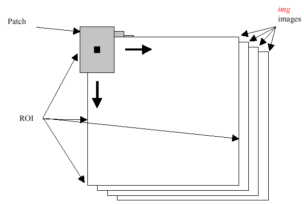

Histograms
==========

.. highlight:: cpp

calcHist
------------
Calculates a histogram of a set of arrays.

.. ocv:function:: void calcHist( const Mat* arrays, int narrays, const int* channels, InputArray mask,               OutputArray hist, int dims, const int* histSize, const float** ranges, bool uniform=true,               bool accumulate=false )

.. ocv:function:: void calcHist( const Mat* arrays, int narrays, const int* channels, InputArray mask,               SparseMat& hist, int dims, const int* histSize, const float** ranges, bool uniform=true, bool accumulate=false )

.. ocv:pyfunction:: cv2.calcHist(images, channels, mask, histSize, ranges[, hist[, accumulate]]) -> hist

.. ocv:cfunction:: void cvCalcHist( IplImage** image, CvHistogram* hist, int accumulate=0, const CvArr* mask=NULL )
.. ocv:pyoldfunction:: cv.CalcHist(image, hist, accumulate=0, mask=None)-> None

    :param arrays: Source arrays. They all should have the same depth,  ``CV_8U``  or  ``CV_32F`` , and the same size. Each of them can have an arbitrary number of channels.

    :param narrays: Number of source arrays.

    :param channels: List of the  ``dims``  channels used to compute the histogram. The first array channels are numerated from 0 to  ``arrays[0].channels()-1`` , the second array channels are counted from  ``arrays[0].channels()``  to  ``arrays[0].channels() + arrays[1].channels()-1``,  and so on.

    :param mask: Optional mask. If the matrix is not empty, it must be an 8-bit array of the same size as  ``arrays[i]`` . The non-zero mask elements mark the array elements counted in the histogram.

    :param hist: Output histogram, which is a dense or sparse  ``dims`` -dimensional array.

    :param dims: Histogram dimensionality that must be positive and not greater than  ``CV_MAX_DIMS`` (equal to 32 in the current OpenCV version).

    :param histSize: Array of histogram sizes in each dimension.

    :param ranges: Array of the ``dims``  arrays of the histogram bin boundaries in each dimension. When the histogram is uniform ( ``uniform`` =true), then for each dimension  ``i``  it is enough to specify the lower (inclusive) boundary  :math:`L_0`  of the 0-th histogram bin and the upper (exclusive) boundary  :math:`U_{\texttt{histSize}[i]-1}`  for the last histogram bin  ``histSize[i]-1`` . That is, in case of a uniform histogram each of  ``ranges[i]``  is an array of 2 elements. When the histogram is not uniform ( ``uniform=false`` ), then each of  ``ranges[i]``  contains  ``histSize[i]+1``  elements:  :math:`L_0, U_0=L_1, U_1=L_2, ..., U_{\texttt{histSize[i]}-2}=L_{\texttt{histSize[i]}-1}, U_{\texttt{histSize[i]}-1}` . The array elements, that are not between  :math:`L_0`  and  :math:`U_{\texttt{histSize[i]}-1}` , are not counted in the histogram.

    :param uniform: Flag indicatinfg whether the histogram is uniform or not (see above).

    :param accumulate: Accumulation flag. If it is set, the histogram is not cleared in the beginning when it is allocated. This feature enables you to compute a single histogram from several sets of arrays, or to update the histogram in time.

The functions ``calcHist`` calculate the histogram of one or more
arrays. The elements of a tuple used to increment
a histogram bin are taken from the corresponding
input arrays at the same location. The sample below shows how to compute a 2D Hue-Saturation histogram for a color image. ::

    #include <cv.h>
    #include <highgui.h>

    using namespace cv;

    int main( int argc, char** argv )
    {
        Mat src, hsv;
        if( argc != 2 || !(src=imread(argv[1], 1)).data )
            return -1;

        cvtColor(src, hsv, CV_BGR2HSV);

        // Quantize the hue to 30 levels
        // and the saturation to 32 levels
        int hbins = 30, sbins = 32;
        int histSize[] = {hbins, sbins};
        // hue varies from 0 to 179, see cvtColor
        float hranges[] = { 0, 180 };
        // saturation varies from 0 (black-gray-white) to
        // 255 (pure spectrum color)
        float sranges[] = { 0, 256 };
        const float* ranges[] = { hranges, sranges };
        MatND hist;
        // we compute the histogram from the 0-th and 1-st channels
        int channels[] = {0, 1};

        calcHist( &hsv, 1, channels, Mat(), // do not use mask
                 hist, 2, histSize, ranges,
                 true, // the histogram is uniform
                 false );
        double maxVal=0;
        minMaxLoc(hist, 0, &maxVal, 0, 0);

        int scale = 10;
        Mat histImg = Mat::zeros(sbins*scale, hbins*10, CV_8UC3);

        for( int h = 0; h < hbins; h++ )
            for( int s = 0; s < sbins; s++ )
            {
                float binVal = hist.at<float>(h, s);
                int intensity = cvRound(binVal*255/maxVal);
                rectangle( histImg, Point(h*scale, s*scale),
                            Point( (h+1)*scale - 1, (s+1)*scale - 1),
                            Scalar::all(intensity),
                            CV_FILLED );
            }

        namedWindow( "Source", 1 );
        imshow( "Source", src );

        namedWindow( "H-S Histogram", 1 );
        imshow( "H-S Histogram", histImg );
        waitKey();
    }

calcBackProject
-------------------
Calculates the back projection of a histogram.

.. ocv:function:: void calcBackProject( const Mat* arrays, int narrays, const int* channels, InputArray hist, OutputArray backProject, const float** ranges, double scale=1, bool uniform=true )

.. ocv:function:: void calcBackProject( const Mat* arrays, int narrays, const int* channels, const SparseMat& hist, OutputArray backProject, const float** ranges, double scale=1, bool uniform=true )

.. ocv:pyfunction:: cv2.calcBackProject(images, channels, hist, ranges[, dst[, scale]]) -> dst

.. ocv:cfunction:: void cvCalcBackProject( IplImage** image, CvArr* backProject, const CvHistogram* hist )
.. ocv:pyoldfunction:: cv.CalcBackProject(image, backProject, hist)-> None

    :param arrays: Source arrays. They all should have the same depth,  ``CV_8U``  or  ``CV_32F`` , and the same size. Each of them can have an arbitrary number of channels.

    :param narrays: Number of source arrays.

    :param channels: The list of channels used to compute the back projection. The number of channels must match the histogram dimensionality. The first array channels are numerated from 0 to  ``arrays[0].channels()-1`` , the second array channels are counted from  ``arrays[0].channels()``  to  ``arrays[0].channels() + arrays[1].channels()-1``,  and so on.

    :param hist: Input histogram that can be dense or sparse.

    :param backProject: Destination back projection aray that is a single-channel array of the same size and depth as  ``arrays[0]`` .
    
    :param ranges: Array of arrays of the histogram bin boundaries in each dimension. See  :ocv:func:`calcHist` .
    
    :param scale: Optional scale factor for the output back projection.

    :param uniform: Flag indicating whether the histogram is uniform or not (see above).

The functions ``calcBackProject`` calculate the back project of the histogram. That is, similarly to ``calcHist`` , at each location ``(x, y)`` the function collects the values from the selected channels in the input images and finds the corresponding histogram bin. But instead of incrementing it, the function reads the bin value, scales it by ``scale`` , and stores in ``backProject(x,y)`` . In terms of statistics, the function computes probability of each element value in respect with the empirical probability distribution represented by the histogram. See how, for example, you can find and track a bright-colored object in a scene:

#.
    Before tracking, show the object to the camera so that it covers almost the whole frame. Calculate a hue histogram. The histogram may have strong maximums, corresponding to the dominant colors in the object.

#.
    When tracking, calculate a back projection of a hue plane of each input video frame using that pre-computed histogram. Threshold the back projection to suppress weak colors. It may also make sense to suppress pixels with non-sufficient color saturation and too dark or too bright pixels.

#.
    Find connected components in the resulting picture and choose, for example, the largest component.

This is an approximate algorithm of the
:ocv:func:`CamShift` color object tracker.

.. seealso:: :ocv:func:`calcHist`
.. _compareHist:

compareHist
-----------
Compares two histograms.

.. ocv:function:: double compareHist( InputArray H1, InputArray H2, int method )

.. ocv:function:: double compareHist( const SparseMat& H1,  const SparseMat& H2, int method )

.. ocv:pyfunction:: cv2.compareHist(H1, H2, method) -> retval

.. ocv:cfunction:: double cvCompareHist( const CvHistogram* hist1, const CvHistogram* hist2, int method )
.. ocv:pyoldfunction:: cv.CompareHist(hist1, hist2, method)->float

    :param H1: First compared histogram.

    :param H2: Second compared histogram of the same size as  ``H1`` .
    
    :param method: Comparison method that could be one of the following:

            * **CV_COMP_CORREL**     Correlation

            * **CV_COMP_CHISQR**     Chi-Square

            * **CV_COMP_INTERSECT**     Intersection

            * **CV_COMP_BHATTACHARYYA**     Bhattacharyya distance

The functions ``compareHist`` compare two dense or two sparse histograms using the specified method:

* Correlation (method=CV\_COMP\_CORREL)

    .. math::

        d(H_1,H_2) =  \frac{\sum_I (H_1(I) - \bar{H_1}) (H_2(I) - \bar{H_2})}{\sqrt{\sum_I(H_1(I) - \bar{H_1})^2 \sum_I(H_2(I) - \bar{H_2})^2}}

    where

    .. math::

        \bar{H_k} =  \frac{1}{N} \sum _J H_k(J)

    and
    :math:`N`     is a total number of histogram bins.

* Chi-Square (method=CV\_COMP\_CHISQR)

    .. math::

        d(H_1,H_2) =  \sum _I  \frac{\left(H_1(I)-H_2(I)\right)^2}{H_1(I)}

* Intersection (method=CV\_COMP\_INTERSECT)

    .. math::

        d(H_1,H_2) =  \sum _I  \min (H_1(I), H_2(I))

* Bhattacharyya distance (method=CV\_COMP\_BHATTACHARYYA)

    .. math::

        d(H_1,H_2) =  \sqrt{1 - \frac{1}{\sqrt{\bar{H_1} \bar{H_2} N^2}} \sum_I \sqrt{H_1(I) \cdot H_2(I)}}

The function returns
:math:`d(H_1, H_2)` .

While the function works well with 1-, 2-, 3-dimensional dense histograms, it may not be suitable for high-dimensional sparse histograms. In such histograms,  because of aliasing and sampling problems, the coordinates of non-zero histogram bins can slightly shift. To compare such histograms or more general sparse configurations of weighted points, consider using the
:ocv:func:`EMD` function.

EMD
------
Computes the "minimal work" distance between two weighted point configurations.

.. ocv:function:: float EMD( InputArray signature1, InputArray signature2, int distType, InputArray cost=noArray(), float* lowerBound=0, OutputArray flow=noArray() )

.. ocv:cfunction:: float cvCalcEMD2( const CvArr* signature1, const CvArr* signature2, int distType, CvDistanceFunction distFunc=NULL, const CvArr* cost=NULL, CvArr* flow=NULL, float* lowerBound=NULL, void* userdata=NULL )
.. ocv:pyoldfunction:: cv.CalcEMD2(signature1, signature2, distType, distFunc=None, cost=None, flow=None, lowerBound=None, userdata=None) -> float

    :param signature1: First signature, a  :math:`\texttt{size1}\times \texttt{dims}+1`  floating-point matrix. Each row stores the point weight followed by the point coordinates. The matrix is allowed to have a single column (weights only) if the user-defined cost matrix is used.

    :param signature2: Second signature of the same format as  ``signature1`` , though the number of rows may be different. The total weights may be different. In this case an extra "dummy" point is added to either  ``signature1``  or  ``signature2`` .

    :param distType: Used metric.  ``CV_DIST_L1, CV_DIST_L2`` , and  ``CV_DIST_C``  stand for one of the standard metrics.  ``CV_DIST_USER``  means that a pre-calculated cost matrix ``cost``  is used.

    :param distFunc: Custom distance function supported by the old interface. ``CvDistanceFunction`` is defined as: ::
        
            typedef float (CV_CDECL * CvDistanceFunction)( const float* a,
                                const float* b, void* userdata );
        
        where ``a`` and ``b`` are point coordinates and ``userdata`` is the same as the last parameter.
        
    :param cost: User-defined  :math:`\texttt{size1}\times \texttt{size2}`  cost matrix. Also, if a cost matrix is used, lower boundary  ``lowerBound``  cannot be calculated because it needs a metric function.

    :param lowerBound: Optional input/output parameter: lower boundary of a distance between the two signatures that is a distance between mass centers. The lower boundary may not be calculated if the user-defined cost matrix is used, the total weights of point configurations are not equal, or if the signatures consist of weights only (the signature matrices have a single column). You  **must**  initialize  ``*lowerBound`` . If the calculated distance between mass centers is greater or equal to  ``*lowerBound``  (it means that the signatures are far enough), the function does not calculate EMD. In any case  ``*lowerBound``  is set to the calculated distance between mass centers on return. Thus, if you want to calculate both distance between mass centers and EMD,  ``*lowerBound``  should be set to 0.

    :param flow: Resultant  :math:`\texttt{size1} \times \texttt{size2}`  flow matrix:  :math:`\texttt{flow}_{i,j}`  is a flow from  :math:`i`  -th point of  ``signature1``  to  :math:`j` -th point of  ``signature2``  .
    
    :param userdata: Optional pointer directly passed to the custom distance function.

The function computes the earth mover distance and/or a lower boundary of the distance between the two weighted point configurations. One of the applications described in [RubnerSept98]_ is multi-dimensional histogram comparison for image retrieval. EMD is a transportation problem that is solved using some modification of a simplex algorithm, thus the complexity is exponential in the worst case, though, on average it is much faster. In the case of a real metric the lower boundary can be calculated even faster (using linear-time algorithm) and it can be used to determine roughly whether the two signatures are far enough so that they cannot relate to the same object.

equalizeHist
----------------
Equalizes the histogram of a grayscale image.

.. ocv:function:: void equalizeHist( InputArray src, OutputArray dst )

.. ocv:pyfunction:: cv2.equalizeHist(src[, dst]) -> dst

.. ocv:cfunction:: void cvEqualizeHist( const CvArr* src, CvArr* dst )

    :param src: Source 8-bit single channel image.

    :param dst: Destination image of the same size and type as  ``src`` .

The function equalizes the histogram of the input image using the following algorithm:

#.
    Calculate the histogram
    :math:`H`     for ``src``  .

#.
    Normalize the histogram so that the sum of histogram bins is 255.

#.
    Compute the integral of the histogram:

    .. math::

        H'_i =  \sum _{0  \le j < i} H(j)

#.
    Transform the image using
    :math:`H'`     as a look-up table:
    :math:`\texttt{dst}(x,y) = H'(\texttt{src}(x,y))`

The algorithm normalizes the brightness and increases the contrast of the image.

Extra Histogram Functions (C API)
---------------------------------

The rest of the section describes additional C functions operating on ``CvHistogram``.

CalcBackProjectPatch
--------------------
Locates a template within an image by using a histogram comparison.

.. ocv:cfunction:: void cvCalcBackProjectPatch( IplImage** images, CvArr* dst, CvSize patch_size, CvHistogram* hist, int method, double factor )

.. ocv:pyoldfunction:: cv.CalcBackProjectPatch(images, dst, patchSize, hist, method, factor)-> None
    
    :param images: Source images (though, you may pass CvMat** as well).     
    
    :param dst: Destination image. 
    
    :param patch_size: Size of the patch slid though the source image. 
    
    :param hist: Histogram. 
    
    :param method: Comparison method passed to  :ocv:cfunc:`CompareHist`  (see the function description). 
    
    :param factor: Normalization factor for histograms that affects the normalization scale of the destination image. Pass 1 if not sure. 
    
The function calculates the back projection by comparing histograms of the source image patches with the given histogram. The function is similar to :ocv:func:`matchTemplate`, but instead of comparing the raster patch with all its possible positions within the search window, the function ``CalcBackProjectPatch`` compares histograms. See the algorithm diagram below:

CalcProbDensity
---------------
Divides one histogram by another.

.. ocv:cfunction:: void  cvCalcProbDensity(  const CvHistogram* hist1, const CvHistogram* hist2, CvHistogram* dsthist, double scale=255 )

.. ocv:pyoldfunction:: cv.CalcProbDensity(hist1, hist2, dsthist, scale=255)-> None
    
    :param hist1: First histogram (the divisor). 
    
    :param hist2: Second histogram. 
    
    :param dsthist: Destination histogram. 
    
    :param scale: Scale factor for the destination histogram. 
    
The function calculates the object probability density from two histograms as:

.. math::

    \texttt{disthist} (I)= \forkthree{0}{if $\texttt{hist1}(I)=0$}{\texttt{scale}}{if $\texttt{hist1}(I) \ne 0$ and $\texttt{hist2}(I) > \texttt{hist1}(I)$}{\frac{\texttt{hist2}(I) \cdot \texttt{scale}}{\texttt{hist1}(I)}}{if $\texttt{hist1}(I) \ne 0$ and $\texttt{hist2}(I) \le \texttt{hist1}(I)$} 

ClearHist
---------
Clears the histogram.

.. ocv:cfunction:: void cvClearHist( CvHistogram* hist )
.. ocv:pyoldfunction:: cv.ClearHist(hist)-> None

    :param hist: Histogram. 

The function sets all of the histogram bins to 0 in case of a dense histogram and removes all histogram bins in case of a sparse array.

CopyHist
--------
Copies a histogram.

.. ocv:cfunction:: void cvCopyHist( const CvHistogram* src, CvHistogram** dst )

    :param src: Source histogram. 
    
    :param dst: Pointer to the destination histogram. 
    
The function makes a copy of the histogram. If the second histogram pointer ``*dst`` is NULL, a new histogram of the same size as  ``src`` is created. Otherwise, both histograms must have equal types and sizes. Then the function copies the bin values of the source histogram to the destination histogram and sets the same bin value ranges as in ``src``.

.. _createhist:

CreateHist
----------
Creates a histogram.

.. ocv:cfunction:: CvHistogram* cvCreateHist( int dims, int* sizes, int type, float** ranges=NULL, int uniform=1 )

.. ocv:pyoldfunction:: cv.CreateHist(dims, type, ranges, uniform=1) -> hist

    :param dims: Number of histogram dimensions. 
    
    :param sizes: Array of the histogram dimension sizes. 
    
    :param type: Histogram representation format.  ``CV_HIST_ARRAY``  means that the histogram data is represented as a multi-dimensional dense array CvMatND.  ``CV_HIST_SPARSE``  means that histogram data is represented as a multi-dimensional sparse array ``CvSparseMat``. 
    
    :param ranges: Array of ranges for the histogram bins. Its meaning depends on the  ``uniform``  parameter value. The ranges are used when the histogram is calculated or backprojected to determine which histogram bin corresponds to which value/tuple of values from the input image(s). 
    
    :param uniform: Uniformity flag. If not zero, the histogram has evenly
        spaced bins and for every  :math:`0<=i<cDims`   ``ranges[i]`` 
        is an array of two numbers: lower and upper boundaries for the i-th
        histogram dimension.
        The whole range [lower,upper] is then split
        into  ``dims[i]``  equal parts to determine the  ``i``-th  input
        tuple value ranges for every histogram bin. And if  ``uniform=0`` ,
        then  the ``i``-th  element of the ``ranges``  array contains ``dims[i]+1``  elements: :math:`\texttt{lower}_0, \texttt{upper}_0, 
        \texttt{lower}_1, \texttt{upper}_1 = \texttt{lower}_2,
        ...
        \texttt{upper}_{dims[i]-1}` 
        where :math:`\texttt{lower}_j`  and  :math:`\texttt{upper}_j` 
        are lower and upper
        boundaries of  the ``i``-th  input tuple value for  the ``j``-th 
        bin, respectively. In either case, the input values that are beyond
        the specified range for a histogram bin are not counted by :ocv:cfunc:`CalcHist`  and filled with 0 by :ocv:cfunc:`CalcBackProject`.
    
The function creates a histogram of the specified size and returns a pointer to the created histogram. If the array ``ranges`` is 0, the histogram bin ranges must be specified later via the function  :ocv:cfunc:`SetHistBinRanges`. Though :ocv:cfunc:`CalcHist` and :ocv:cfunc:`CalcBackProject` may process 8-bit images without setting bin ranges, they assume they are equally spaced in 0 to 255 bins.

GetHistValue\_?D
----------------
Returns a pointer to the histogram bin.

.. ocv:cfunction:: float cvGetHistValue_1D(CvHistogram hist, int idx0)

.. ocv:cfunction:: float cvGetHistValue_2D(CvHistogram hist, int idx0, int idx1)

.. ocv:cfunction:: float cvGetHistValue_3D(CvHistogram hist, int idx0, int idx1, int idx2)

.. ocv:cfunction:: float cvGetHistValue_nD(CvHistogram hist, int idx)
    
    :param hist: Histogram. 
    
    :param idx0: 0-th index. 
    
    :param idx1: 1-st index.
    
    :param idx2: 2-nd index.
    
    :param idx: Array of indices. 

::

    #define cvGetHistValue_1D( hist, idx0 ) 
        ((float*)(cvPtr1D( (hist)->bins, (idx0), 0 ))
    #define cvGetHistValue_2D( hist, idx0, idx1 ) 
        ((float*)(cvPtr2D( (hist)->bins, (idx0), (idx1), 0 )))
    #define cvGetHistValue_3D( hist, idx0, idx1, idx2 ) 
        ((float*)(cvPtr3D( (hist)->bins, (idx0), (idx1), (idx2), 0 )))
    #define cvGetHistValue_nD( hist, idx ) 
        ((float*)(cvPtrND( (hist)->bins, (idx), 0 )))    

..

The macros ``GetHistValue`` return a pointer to the specified bin of the 1D, 2D, 3D, or N-D histogram. In case of a sparse histogram, the function creates a new bin and sets it to 0, unless it exists already.

GetMinMaxHistValue
------------------
Finds the minimum and maximum histogram bins.

.. ocv:cfunction:: void cvGetMinMaxHistValue(  const CvHistogram* hist, float* min_value, float* max_value, int* min_idx=NULL, int* max_idx=NULL )
    
.. ocv:pyoldfunction:: cv.GetMinMaxHistValue(hist)-> (minValue, maxValue, minIdx, maxIdx)

    :param hist: Histogram.
    
    :param min_value: Pointer to the minimum value of the histogram. 
    
    :param max_value: Pointer to the maximum value of the histogram. 
    
    :param min_idx: Pointer to the array of coordinates for the minimum. 
    
    :param max_idx: Pointer to the array of coordinates for the maximum. 
    
The function finds the minimum and maximum histogram bins and their positions. All of output arguments are optional. Among several extremas with the same value the ones with the minimum index (in the lexicographical order) are returned. In case of several maximums or minimums, the earliest in the lexicographical order (extrema locations) is returned.

MakeHistHeaderForArray
----------------------
Makes a histogram out of an array.

.. ocv:cfunction:: CvHistogram*  cvMakeHistHeaderForArray(  int dims, int* sizes, CvHistogram* hist, float* data, float** ranges=NULL, int uniform=1 )
    
    :param dims: Number of the histogram dimensions. 
    
    :param sizes: Array of the histogram dimension sizes. 
    
    :param hist: Histogram header initialized by the function. 
    
    :param data: Array used to store histogram bins. 
    
    :param ranges: Histogram bin ranges. See  :ocv:cfunc:`CreateHist` for details.
    
    :param uniform: Uniformity flag. See  :ocv:cfunc:`CreateHist` for details.
    
The function initializes the histogram, whose header and bins are allocated by the user. :ocv:cfunc:`ReleaseHist` does not need to be called afterwards. Only dense histograms can be initialized this way. The function returns ``hist``.

NormalizeHist
-------------
Normalizes the histogram.

.. ocv:cfunction:: void cvNormalizeHist( CvHistogram* hist, double factor )
.. ocv:pyoldfunction:: cv.NormalizeHist(hist, factor)-> None
    
    :param hist: Pointer to the histogram. 
    
    :param factor: Normalization factor. 
    
The function normalizes the histogram bins by scaling them so that the sum of the bins becomes equal to  ``factor``.

QueryHistValue*D
----------------
Queries the value of the histogram bin.

.. ocv:cfunction:: float QueryHistValue_1D(CvHistogram hist, int idx0)
.. ocv:cfunction:: float QueryHistValue_2D(CvHistogram hist, int idx0, int idx1)
.. ocv:cfunction:: float QueryHistValue_3D(CvHistogram hist, int idx0, int idx1, int idx2)
.. ocv:cfunction:: float QueryHistValue_nD(CvHistogram hist, const int* idx)

.. ocv:pyoldfunction:: cv.QueryHistValue_1D(hist, idx0) -> float
.. ocv:pyoldfunction:: cv.QueryHistValue_2D(hist, idx0, idx1) -> float
.. ocv:pyoldfunction:: cv.QueryHistValue_3D(hist, idx0, idx1, idx2) -> float
.. ocv:pyoldfunction:: cv.QueryHistValueND(hist, idx) -> float

    :param hist: Histogram. 
    
    :param idx0: 0-th index.
    
    :param idx1: 1-st index.
    
    :param idx2: 2-nd index.
    
    :param idx: Array of indices. 

The macros return the value of the specified bin of the 1D, 2D, 3D, or N-D histogram. In case of a sparse histogram, the function returns 0. If the bin is not present in the histogram, no new bin is created.

ReleaseHist
-----------
Releases the histogram.

.. ocv:cfunction:: void cvReleaseHist( CvHistogram** hist )
    
    :param hist: Double pointer to the released histogram. 
    
The function releases the histogram (header and the data). The pointer to the histogram is cleared by the function. If ``*hist`` pointer is already ``NULL``, the function does nothing.

SetHistBinRanges
----------------
Sets the bounds of the histogram bins.

.. ocv:cfunction:: void cvSetHistBinRanges(  CvHistogram* hist, float** ranges, int uniform=1 )

    :param hist: Histogram. 
    
    :param ranges: Array of bin ranges arrays. See  :ocv:cfunc:`CreateHist` for details.
    
    :param uniform: Uniformity flag. See  :ocv:cfunc:`CreateHist` for details. 
    
This is a standalone function for setting bin ranges in the histogram. For a more detailed description of the parameters ``ranges`` and ``uniform``, see the :ocv:cfunc:`CalcHist` function that can initialize the ranges as well. Ranges for the histogram bins must be set before the histogram is calculated or the backproject of the histogram is calculated.

ThreshHist
----------
Thresholds the histogram.

.. ocv:cfunction:: void cvThreshHist( CvHistogram* hist, double threshold )
.. ocv:pyoldfunction:: cv.ThreshHist(hist, threshold)-> None
    
    :param hist: Pointer to the histogram. 
    
    :param threshold: Threshold level. 
    
The function clears histogram bins that are below the specified threshold.

CalcPGH
-------
Calculates a pair-wise geometrical histogram for a contour.

.. ocv:cfunction:: void cvCalcPGH( const CvSeq* contour, CvHistogram* hist )
.. ocv:pyoldfunction:: cv.CalcPGH(contour, hist)-> None
    
    :param contour: Input contour. Currently, only integer point coordinates are allowed. 
    
    :param hist: Calculated histogram. It must be two-dimensional. 
    
The function calculates a 2D pair-wise geometrical histogram (PGH), described in [Iivarinen97]_ for the contour. The algorithm considers every pair of contour
edges. The angle between the edges and the minimum/maximum distances
are determined for every pair. To do this, each of the edges in turn
is taken as the base, while the function loops through all the other
edges. When the base edge and any other edge are considered, the minimum
and maximum distances from the points on the non-base edge and line of
the base edge are selected. The angle between the edges defines the row
of the histogram in which all the bins that correspond to the distance
between the calculated minimum and maximum distances are incremented
(that is, the histogram is transposed relatively to the definition in the original paper). The histogram can be used for contour matching.

.. [RubnerSept98] Y. Rubner. C. Tomasi, L.J. Guibas. *The Earth Mover’s Distance as a Metric for Image Retrieval*. Technical Report STAN-CS-TN-98-86, Department of Computer Science, Stanford University, September 1998.

.. [Iivarinen97] Jukka Iivarinen, Markus Peura, Jaakko Srel, and Ari Visa. *Comparison of Combined Shape Descriptors for Irregular Objects*, 8th British Machine Vision Conference, BMVC'97. http://www.cis.hut.fi/research/IA/paper/publications/bmvc97/bmvc97.html
