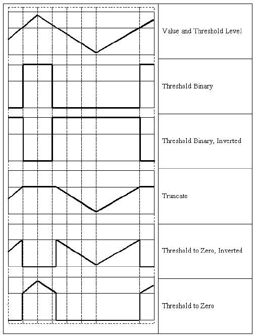

Miscellaneous Image Transformations
===================================

.. highlight:: cpp

adaptiveThreshold
---------------------
Applies an adaptive threshold to an array.

.. ocv:function:: void adaptiveThreshold( InputArray src, OutputArray dst, double maxValue,                        int adaptiveMethod, int thresholdType,                        int blockSize, double C )

.. ocv:pyfunction:: cv2.adaptiveThreshold(src, maxValue, adaptiveMethod, thresholdType, blockSize, C[, dst]) -> dst

.. ocv:cfunction:: void cvAdaptiveThreshold( const CvArr* src, CvArr* dst, double max_value, int adaptive_method=CV_ADAPTIVE_THRESH_MEAN_C, int threshold_type=CV_THRESH_BINARY, int block_size=3, double param1=5 )

.. ocv:pyoldfunction:: cv.AdaptiveThreshold(src, dst, maxValue, adaptive_method=CV_ADAPTIVE_THRESH_MEAN_C, thresholdType=CV_THRESH_BINARY, blockSize=3, param1=5)-> None

    :param src: Source 8-bit single-channel image.

    :param dst: Destination image of the same size and the same type as  ``src`` .

    :param maxValue: Non-zero value assigned to the pixels for which the condition is satisfied. See the details below.

    :param adaptiveMethod: Adaptive thresholding algorithm to use, ``ADAPTIVE_THRESH_MEAN_C``  or  ``ADAPTIVE_THRESH_GAUSSIAN_C`` . See the details below.

    :param thresholdType: Thresholding type that must be either  ``THRESH_BINARY``  or  ``THRESH_BINARY_INV`` .

    :param blockSize: Size of a pixel neighborhood that is used to calculate a threshold value for the pixel: 3, 5, 7, and so on.

    :param C: Constant subtracted from the mean or weighted mean (see the details below). Normally, it is positive but may be zero or negative as well.

The function transforms a grayscale image to a binary image according to the formulae:

    * **THRESH_BINARY**

        .. math::

             dst(x,y) =  \fork{\texttt{maxValue}}{if $src(x,y) > T(x,y)$}{0}{otherwise}

    * **THRESH_BINARY_INV**

        .. math::

             dst(x,y) =  \fork{0}{if $src(x,y) > T(x,y)$}{\texttt{maxValue}}{otherwise}

where
:math:`T(x,y)` is a threshold calculated individually for each pixel.

*
    For the method ``ADAPTIVE_THRESH_MEAN_C``  , the threshold value
    :math:`T(x,y)`     is a mean of the
    :math:`\texttt{blockSize} \times \texttt{blockSize}`     neighborhood of
    :math:`(x, y)`     minus ``C``     .

*
    For the method ``ADAPTIVE_THRESH_GAUSSIAN_C`` , the threshold value
    :math:`T(x, y)`     is a weighted sum (cross-correlation with a Gaussian window) of the
    :math:`\texttt{blockSize} \times \texttt{blockSize}`     neighborhood of
    :math:`(x, y)`      minus ``C``     . The default sigma (standard deviation) is used for the specified ``blockSize``   . See
    :ocv:func:`getGaussianKernel`     .

The function can process the image in-place.

.. seealso::

    :ocv:func:`threshold`,
    :ocv:func:`blur`,
    :ocv:func:`GaussianBlur`

cvtColor
------------
Converts an image from one color space to another.

.. ocv:function:: void cvtColor( InputArray src, OutputArray dst, int code, int dstCn=0 )

.. ocv:pyfunction:: cv2.cvtColor(src, code[, dst[, dstCn]]) -> dst

.. ocv:cfunction:: void cvCvtColor( const CvArr* src, CvArr* dst, int code )
.. ocv:pyoldfunction:: cv.CvtColor(src, dst, code)-> None

    :param src: Source image: 8-bit unsigned, 16-bit unsigned ( ``CV_16UC...`` ), or single-precision floating-point.

    :param dst: Destination image of the same size and depth as  ``src`` .

    :param code: Color space conversion code. See the description below.

    :param dstCn: Number of channels in the destination image. If the parameter is 0, the number of the channels is derived automatically from  ``src``  and   ``code`` .

The function converts an input image from one color
space to another. In case of a transformation to-from RGB color space, the order of the channels should be specified explicitly (RGB or BGR).
Note that the default color format in OpenCV is often referred to as RGB but it is actually BGR (the bytes are reversed). So the first byte in a standard (24-bit) color image will be an 8-bit Blue component, the second byte will be Green, and the third byte will be Red. The fourth, fifth, and sixth bytes would then be the second pixel (Blue, then Green, then Red), and so on.

The conventional ranges for R, G, and B channel values are:

*
    0 to 255 for ``CV_8U``     images

*
    0 to 65535 for ``CV_16U``     images

*
    0 to 1 for ``CV_32F``     images

In case of linear transformations, the range does not matter.
But in case of a non-linear transformation, an input RGB image should be normalized to the proper value range to get the correct results, for example, for RGB
:math:`\rightarrow` L*u*v* transformation. For example, if you have a 32-bit floating-point image directly converted from an 8-bit image without any scaling, then it will have the 0..255 value range instead of 0..1 assumed by the function. So, before calling ``cvtColor`` , you need first to scale the image down: ::

    img *= 1./255;
    cvtColor(img, img, CV_BGR2Luv);

If you use ``cvtColor`` with 8-bit images, the conversion will have some information lost. For many applications, this will not be noticeable but it is recommended to use 32-bit images in applications that need the full range of colors or that convert an image before an operation and then convert back.

The function can do the following transformations:

*
    Transformations within RGB space like adding/removing the alpha channel, reversing the channel order, conversion to/from 16-bit RGB color (R5:G6:B5 or R5:G5:B5), as well as conversion to/from grayscale using:

    .. math::

        \text{RGB[A] to Gray:} \quad Y  \leftarrow 0.299  \cdot R + 0.587  \cdot G + 0.114  \cdot B

    and

    .. math::

        \text{Gray to RGB[A]:} \quad R  \leftarrow Y, G  \leftarrow Y, B  \leftarrow Y, A  \leftarrow 0

    The conversion from a RGB image to gray is done with:

    ::

        cvtColor(src, bwsrc, CV_RGB2GRAY);

    ..

    More advanced channel reordering can also be done with
    :ocv:func:`mixChannels`     .

*
    RGB
    :math:`\leftrightarrow`     CIE XYZ.Rec 709 with D65 white point ( ``CV_BGR2XYZ, CV_RGB2XYZ, CV_XYZ2BGR, CV_XYZ2RGB``     ):

    .. math::

        \begin{bmatrix} X  \\ Y  \\ Z
          \end{bmatrix} \leftarrow \begin{bmatrix} 0.412453 & 0.357580 & 0.180423 \\ 0.212671 & 0.715160 & 0.072169 \\ 0.019334 & 0.119193 & 0.950227
          \end{bmatrix} \cdot \begin{bmatrix} R  \\ G  \\ B
          \end{bmatrix}

    .. math::

        \begin{bmatrix} R  \\ G  \\ B
          \end{bmatrix} \leftarrow \begin{bmatrix} 3.240479 & -1.53715 & -0.498535 \\ -0.969256 &  1.875991 & 0.041556 \\ 0.055648 & -0.204043 & 1.057311
          \end{bmatrix} \cdot \begin{bmatrix} X  \\ Y  \\ Z
          \end{bmatrix}

    :math:`X`,    :math:`Y`     and
    :math:`Z`     cover the whole value range (in case of floating-point images,
    :math:`Z`     may exceed 1).

*
    RGB
    :math:`\leftrightarrow`     YCrCb JPEG (or YCC) ( ``CV_BGR2YCrCb, CV_RGB2YCrCb, CV_YCrCb2BGR, CV_YCrCb2RGB``     )

    .. math::

        Y  \leftarrow 0.299  \cdot R + 0.587  \cdot G + 0.114  \cdot B

    .. math::

        Cr  \leftarrow (R-Y)  \cdot 0.713 + delta

    .. math::

        Cb  \leftarrow (B-Y)  \cdot 0.564 + delta

    .. math::

        R  \leftarrow Y + 1.403  \cdot (Cr - delta)

    .. math::

        G  \leftarrow Y - 0.344  \cdot (Cr - delta) - 0.714  \cdot (Cb - delta)

    .. math::

        B  \leftarrow Y + 1.773  \cdot (Cb - delta)

    where

    .. math::

        delta =  \left \{ \begin{array}{l l} 128 &  \mbox{for 8-bit images} \\ 32768 &  \mbox{for 16-bit images} \\ 0.5 &  \mbox{for floating-point images} \end{array} \right .

    Y, Cr, and Cb cover the whole value range.

*
    RGB :math:`\leftrightarrow` HSV ( ``CV_BGR2HSV, CV_RGB2HSV, CV_HSV2BGR, CV_HSV2RGB``     )
      In case of 8-bit and 16-bit images,
      R, G, and B are converted to the floating-point format and scaled to fit the 0 to 1 range.

    .. math::

        V  \leftarrow max(R,G,B)

    .. math::

        S  \leftarrow \fork{\frac{V-min(R,G,B)}{V}}{if $V \neq 0$}{0}{otherwise}

    .. math::

        H  \leftarrow \forkthree{{60(G - B)}/{(V-min(R,G,B))}}{if $V=R$}{{120+60(B - R)}/{(V-min(R,G,B))}}{if $V=G$}{{240+60(R - G)}/{(V-min(R,G,B))}}{if $V=B$}

    If
    :math:`H<0`     then
    :math:`H \leftarrow H+360`  . On output
    :math:`0 \leq V \leq 1`,    :math:`0 \leq S \leq 1`,    :math:`0 \leq H \leq 360`     .

    The values are then converted to the destination data type:

    * 8-bit images

        .. math::

            V  \leftarrow 255 V, S  \leftarrow 255 S, H  \leftarrow H/2  \text{(to fit to 0 to 255)}

    * 16-bit images (currently not supported)

        .. math::

            V <- 65535 V, S <- 65535 S, H <- H

    * 32-bit images
        H, S, and V are left as is

*
    RGB :math:`\leftrightarrow` HLS ( ``CV_BGR2HLS, CV_RGB2HLS, CV_HLS2BGR, CV_HLS2RGB`` ).
      In case of 8-bit and 16-bit images,
      R, G, and B are converted to the floating-point format and scaled to fit the 0 to 1 range.

    .. math::

        V_{max}  \leftarrow {max}(R,G,B)

    .. math::

        V_{min}  \leftarrow {min}(R,G,B)

    .. math::

        L  \leftarrow \frac{V_{max} + V_{min}}{2}

    .. math::

        S  \leftarrow \fork { \frac{V_{max} - V_{min}}{V_{max} + V_{min}} }{if  $L < 0.5$ }
            { \frac{V_{max} - V_{min}}{2 - (V_{max} + V_{min})} }{if  $L \ge 0.5$ }

    .. math::

        H  \leftarrow \forkthree {{60(G - B)}/{S}}{if  $V_{max}=R$ }
          {{120+60(B - R)}/{S}}{if  $V_{max}=G$ }
          {{240+60(R - G)}/{S}}{if  $V_{max}=B$ }

    If
    :math:`H<0`     then
    :math:`H \leftarrow H+360`  . On output
    :math:`0 \leq L \leq 1`,    :math:`0 \leq S \leq 1`,    :math:`0 \leq H \leq 360`     .

    The values are then converted to the destination data type:

    * 8-bit images

        .. math::

            V  \leftarrow 255 \cdot V, S  \leftarrow 255 \cdot S, H  \leftarrow H/2 \; \text{(to fit to 0 to 255)}

    * 16-bit images (currently not supported)

        .. math::

            V <- 65535 \cdot V, S <- 65535 \cdot S, H <- H

    * 32-bit images
        H, S, V are left as is

*
    RGB :math:`\leftrightarrow` CIE L*a*b* ( ``CV_BGR2Lab, CV_RGB2Lab, CV_Lab2BGR, CV_Lab2RGB`` ).
      In case of 8-bit and 16-bit images,
      R, G, and B are converted to the floating-point format and scaled to fit the 0 to 1 range.

    .. math::

        \vecthree{X}{Y}{Z} \leftarrow \vecthreethree{0.412453}{0.357580}{0.180423}{0.212671}{0.715160}{0.072169}{0.019334}{0.119193}{0.950227} \cdot \vecthree{R}{G}{B}

    .. math::

        X  \leftarrow X/X_n,  \text{where} X_n = 0.950456

    .. math::

        Z  \leftarrow Z/Z_n,  \text{where} Z_n = 1.088754

    .. math::

        L  \leftarrow \fork{116*Y^{1/3}-16}{for $Y>0.008856$}{903.3*Y}{for $Y \le 0.008856$}

    .. math::

        a  \leftarrow 500 (f(X)-f(Y)) + delta

    .. math::

        b  \leftarrow 200 (f(Y)-f(Z)) + delta

    where

    .. math::

        f(t)= \fork{t^{1/3}}{for $t>0.008856$}{7.787 t+16/116}{for $t\leq 0.008856$}

    and

    .. math::

        delta =  \fork{128}{for 8-bit images}{0}{for floating-point images}

    This outputs
    :math:`0 \leq L \leq 100`,    :math:`-127 \leq a \leq 127`,    :math:`-127 \leq b \leq 127`  . The values are then converted to the destination data type:

    * 8-bit images

        .. math::

            L  \leftarrow L*255/100, \; a  \leftarrow a + 128, \; b  \leftarrow b + 128

    * 16-bit images
        (currently not supported)

    * 32-bit images
        L, a, and b are left as is

*
    RGB :math:`\leftrightarrow` CIE L*u*v* ( ``CV_BGR2Luv, CV_RGB2Luv, CV_Luv2BGR, CV_Luv2RGB`` ).
      In case of 8-bit and 16-bit images,
      R, G, and B are converted to the floating-point format and scaled to fit 0 to 1 range.

    .. math::

        \vecthree{X}{Y}{Z} \leftarrow \vecthreethree{0.412453}{0.357580}{0.180423}{0.212671}{0.715160}{0.072169}{0.019334}{0.119193}{0.950227} \cdot \vecthree{R}{G}{B}

    .. math::

        L  \leftarrow \fork{116 Y^{1/3}}{for $Y>0.008856$}{903.3 Y}{for $Y\leq 0.008856$}

    .. math::

        u'  \leftarrow 4*X/(X + 15*Y + 3 Z)

    .. math::

        v'  \leftarrow 9*Y/(X + 15*Y + 3 Z)

    .. math::

        u  \leftarrow 13*L*(u' - u_n)  \quad \text{where} \quad u_n=0.19793943

    .. math::

        v  \leftarrow 13*L*(v' - v_n)  \quad \text{where} \quad v_n=0.46831096

    This outputs
    :math:`0 \leq L \leq 100`,    :math:`-134 \leq u \leq 220`,    :math:`-140 \leq v \leq 122`     .

    The values are then converted to the destination data type:

    * 8-bit images

        .. math::

            L  \leftarrow 255/100 L, \; u  \leftarrow 255/354 (u + 134), \; v  \leftarrow 255/256 (v + 140)

    * 16-bit images
        (currently not supported)

    * 32-bit images
        L, u, and v are left as is

    The above formulae for converting RGB to/from various color spaces have been taken from multiple sources on the web, primarily from the Charles Poynton site
    http://www.poynton.com/ColorFAQ.html

*
    Bayer :math:`\rightarrow`     RGB ( ``CV_BayerBG2BGR, CV_BayerGB2BGR, CV_BayerRG2BGR, CV_BayerGR2BGR, CV_BayerBG2RGB, CV_BayerGB2RGB, CV_BayerRG2RGB, CV_BayerGR2RGB``     ). The Bayer pattern is widely used in CCD and CMOS cameras. It enables you to get color pictures from a single plane where R,G, and B pixels (sensors of a particular component) are interleaved as follows:

    .. image:: pics/bayer.png

    The output RGB components of a pixel are interpolated from 1, 2, or
    4 neighbors of the pixel having the same color. There are several
    modifications of the above pattern that can be achieved by shifting
    the pattern one pixel left and/or one pixel up. The two letters
    :math:`C_1`     and
    :math:`C_2`     in the conversion constants ``CV_Bayer``     :math:`C_1 C_2`     ``2BGR``     and ``CV_Bayer``     :math:`C_1 C_2`     ``2RGB``     indicate the particular pattern
    type. These are components from the second row, second and third
    columns, respectively. For example, the above pattern has a very
    popular "BG" type.

distanceTransform
---------------------
Calculates the distance to the closest zero pixel for each pixel of the source image.

.. ocv:function:: void distanceTransform( InputArray src, OutputArray dst, int distanceType, int maskSize )

.. ocv:function:: void distanceTransform( InputArray src, OutputArray dst, OutputArray labels, int distanceType, int maskSize, int labelType=DIST_LABEL_CCOMP )

.. ocv:pyfunction:: cv2.distanceTransform(src, distanceType, maskSize[, dst]) -> dst

.. ocv:cfunction:: void cvDistTransform( const CvArr* src, CvArr* dst, int distance_type=CV_DIST_L2, int mask_size=3, const float* mask=NULL, CvArr* labels=NULL, int labelType=CV_DIST_LABEL_CCOMP )

.. ocv:pyoldfunction:: cv.DistTransform(src, dst, distance_type=CV_DIST_L2, mask_size=3, mask=None, labels=None) -> None

    :param src: 8-bit, single-channel (binary) source image.

    :param dst: Output image with calculated distances. It is a 32-bit floating-point, single-channel image of the same size as  ``src`` .

    :param distanceType: Type of distance. It can be  ``CV_DIST_L1, CV_DIST_L2`` , or  ``CV_DIST_C`` .

    :param maskSize: Size of the distance transform mask. It can be 3, 5, or  ``CV_DIST_MASK_PRECISE``  (the latter option is only supported by the first function). In case of the ``CV_DIST_L1``  or  ``CV_DIST_C``  distance type, the parameter is forced to 3 because a  :math:`3\times 3`  mask gives the same result as  :math:`5\times 5`  or any larger aperture.

    :param labels: Optional output 2D array of labels (the discrete Voronoi diagram). It has the type  ``CV_32SC1``  and the same size as  ``src`` . See the details below.

    :param labelType: Type of the label array to build. If ``labelType==DIST_LABEL_CCOMP`` then each connected component of zeros in ``src`` (as well as all the non-zero pixels closest to the connected component) will be assigned the same label. If ``labelType==DIST_LABEL_PIXEL`` then each zero pixel (and all the non-zero pixels closest to it) gets its own label.

The functions ``distanceTransform`` calculate the approximate or precise
distance from every binary image pixel to the nearest zero pixel.
For zero image pixels, the distance will obviously be zero.

When ``maskSize == CV_DIST_MASK_PRECISE`` and ``distanceType == CV_DIST_L2`` , the function runs the algorithm described in [Felzenszwalb04]_. This algorithm is parallelized with the TBB library.

In other cases, the algorithm
[Borgefors86]_
is used. This means that
for a pixel the function finds the shortest path to the nearest zero pixel
consisting of basic shifts: horizontal,
vertical, diagonal, or knight's move (the latest is available for a
:math:`5\times 5` mask). The overall distance is calculated as a sum of these
basic distances. Since the distance function should be symmetric,
all of the horizontal and vertical shifts must have the same cost (denoted as ``a`` ), all the diagonal shifts must have the
same cost (denoted as ``b`` ), and all knight's moves must have
the same cost (denoted as ``c`` ). For the ``CV_DIST_C`` and ``CV_DIST_L1`` types, the distance is calculated precisely,
whereas for ``CV_DIST_L2`` (Euclidean distance) the distance
can be calculated only with a relative error (a
:math:`5\times 5` mask
gives more accurate results). For ``a``,``b`` , and ``c`` , OpenCV uses the values suggested in the original paper:

.. table::

    ==============  ===================  ======================
    ``CV_DIST_C``   :math:`(3\times 3)`  a = 1, b = 1 \
    ==============  ===================  ======================
    ``CV_DIST_L1``  :math:`(3\times 3)`  a = 1, b = 2 \
    ``CV_DIST_L2``  :math:`(3\times 3)`  a=0.955, b=1.3693 \
    ``CV_DIST_L2``  :math:`(5\times 5)`  a=1, b=1.4, c=2.1969 \
    ==============  ===================  ======================

Typically, for a fast, coarse distance estimation ``CV_DIST_L2``, a
:math:`3\times 3` mask is used. For a more accurate distance estimation ``CV_DIST_L2`` , a
:math:`5\times 5` mask or the precise algorithm is used.
Note that both the precise and the approximate algorithms are linear on the number of pixels.

The second variant of the function does not only compute the minimum distance for each pixel
:math:`(x, y)` but also identifies the nearest connected
component consisting of zero pixels (``labelType==DIST_LABEL_CCOMP``) or the nearest zero pixel (``labelType==DIST_LABEL_PIXEL``). Index of the component/pixel is stored in
:math:`\texttt{labels}(x, y)` .
When ``labelType==DIST_LABEL_CCOMP``, the function automatically finds connected components of zero pixels in the input image and marks them with distinct labels. When ``labelType==DIST_LABEL_CCOMP``, the function scans through the input image and marks all the zero pixels with distinct labels.

In this mode, the complexity is still linear.
That is, the function provides a very fast way to compute the Voronoi diagram for a binary image.
Currently, the second variant can use only the approximate distance transform algorithm, i.e. ``maskSize=CV_DIST_MASK_PRECISE`` is not supported yet.

floodFill
-------------
Fills a connected component with the given color.

.. ocv:function:: int floodFill( InputOutputArray image, Point seedPoint, Scalar newVal, Rect* rect=0, Scalar loDiff=Scalar(), Scalar upDiff=Scalar(), int flags=4 )

.. ocv:function:: int floodFill( InputOutputArray image, InputOutputArray mask, Point seedPoint, Scalar newVal, Rect* rect=0, Scalar loDiff=Scalar(), Scalar upDiff=Scalar(), int flags=4 )

.. ocv:pyfunction:: cv2.floodFill(image, mask, seedPoint, newVal[, loDiff[, upDiff[, flags]]]) -> retval, rect

.. ocv:cfunction:: void cvFloodFill( CvArr* image, CvPoint seed_point, CvScalar new_val, CvScalar lo_diff=cvScalarAll(0), CvScalar up_diff=cvScalarAll(0), CvConnectedComp* comp=NULL, int flags=4, CvArr* mask=NULL )
.. ocv:pyoldfunction:: cv.FloodFill(image, seed_point, new_val, lo_diff=(0, 0, 0, 0), up_diff=(0, 0, 0, 0), flags=4, mask=None)-> comp

    :param image: Input/output 1- or 3-channel, 8-bit, or floating-point image. It is modified by the function unless the  ``FLOODFILL_MASK_ONLY``  flag is set in the second variant of the function. See the details below.

    :param mask: (For the second function only) Operation mask that should be a single-channel 8-bit image, 2 pixels wider and 2 pixels taller. The function uses and updates the mask, so you take responsibility of initializing the  ``mask``  content. Flood-filling cannot go across non-zero pixels in the mask. For example, an edge detector output can be used as a mask to stop filling at edges. It is possible to use the same mask in multiple calls to the function to make sure the filled area does not overlap.

        .. note:: Since the mask is larger than the filled image, a pixel  :math:`(x, y)`  in  ``image``  corresponds to the pixel  :math:`(x+1, y+1)`  in the  ``mask`` .

    :param seed: Starting point.

    :param newVal: New value of the repainted domain pixels.

    :param loDiff: Maximal lower brightness/color difference between the currently observed pixel and one of its neighbors belonging to the component, or a seed pixel being added to the component.

    :param upDiff: Maximal upper brightness/color difference between the currently observed pixel and one of its neighbors belonging to the component, or a seed pixel being added to the component.

    :param rect: Optional output parameter set by the function to the minimum bounding rectangle of the repainted domain.

    :param flags: Operation flags. Lower bits contain a connectivity value, 4 (default) or 8, used within the function. Connectivity determines which neighbors of a pixel are considered. Upper bits can be 0 or a combination of the following flags:

            * **FLOODFILL_FIXED_RANGE** If set, the difference between the current pixel and seed pixel is considered. Otherwise, the difference between neighbor pixels is considered (that is, the range is floating).

            * **FLOODFILL_MASK_ONLY**  If set, the function does not change the image ( ``newVal``  is ignored), but fills the mask.  The flag can be used for the second variant only.

The functions ``floodFill`` fill a connected component starting from the seed point with the specified color. The connectivity is determined by the color/brightness closeness of the neighbor pixels. The pixel at
:math:`(x,y)` is considered to belong to the repainted domain if:

*
    .. math::

        \texttt{src} (x',y')- \texttt{loDiff} \leq \texttt{src} (x,y)  \leq \texttt{src} (x',y')+ \texttt{upDiff}

    in case of a grayscale image and floating range

*

    .. math::

        \texttt{src} ( \texttt{seed} .x, \texttt{seed} .y)- \texttt{loDiff} \leq \texttt{src} (x,y)  \leq \texttt{src} ( \texttt{seed} .x, \texttt{seed} .y)+ \texttt{upDiff}

    in case of a grayscale image and fixed range

*

    .. math::

        \texttt{src} (x',y')_r- \texttt{loDiff} _r \leq \texttt{src} (x,y)_r \leq \texttt{src} (x',y')_r+ \texttt{upDiff} _r,

    .. math::

        \texttt{src} (x',y')_g- \texttt{loDiff} _g \leq \texttt{src} (x,y)_g \leq \texttt{src} (x',y')_g+ \texttt{upDiff} _g

    and

    .. math::

        \texttt{src} (x',y')_b- \texttt{loDiff} _b \leq \texttt{src} (x,y)_b \leq \texttt{src} (x',y')_b+ \texttt{upDiff} _b

    in case of a color image and floating range

*

    .. math::

        \texttt{src} ( \texttt{seed} .x, \texttt{seed} .y)_r- \texttt{loDiff} _r \leq \texttt{src} (x,y)_r \leq \texttt{src} ( \texttt{seed} .x, \texttt{seed} .y)_r+ \texttt{upDiff} _r,

    .. math::

        \texttt{src} ( \texttt{seed} .x, \texttt{seed} .y)_g- \texttt{loDiff} _g \leq \texttt{src} (x,y)_g \leq \texttt{src} ( \texttt{seed} .x, \texttt{seed} .y)_g+ \texttt{upDiff} _g

    and

    .. math::

        \texttt{src} ( \texttt{seed} .x, \texttt{seed} .y)_b- \texttt{loDiff} _b \leq \texttt{src} (x,y)_b \leq \texttt{src} ( \texttt{seed} .x, \texttt{seed} .y)_b+ \texttt{upDiff} _b

    in case of a color image and fixed range

where
:math:`src(x',y')` is the value of one of pixel neighbors that is already known to belong to the component. That is, to be added to the connected component, a color/brightness of the pixel should be close enough to:

*
    Color/brightness of one of its neighbors that already belong to the connected component in case of a floating range.

*
    Color/brightness of the seed point in case of a fixed range.

Use these functions to either mark a connected component with the specified color in-place, or build a mask and then extract the contour, or copy the region to another image, and so on. Various modes of the function are demonstrated in the ``floodfill.cpp`` sample.

.. seealso:: :ocv:func:`findContours`

integral
------------
Calculates the integral of an image.

.. ocv:function:: void integral( InputArray src, OutputArray sum, int sdepth=-1 )

.. ocv:function:: void integral( InputArray src, OutputArray sum, OutputArray sqsum, int sdepth=-1 )

.. ocv:function:: void integral( InputArray src, OutputArray sum, OutputArray sqsum, OutputArray tilted, int sdepth=-1 )

.. ocv:pyfunction:: cv2.integral(src[, sum[, sdepth]]) -> sum

.. ocv:pyfunction:: cv2.integral2(src[, sum[, sqsum[, sdepth]]]) -> sum, sqsum

.. ocv:pyfunction:: cv2.integral3(src[, sum[, sqsum[, tilted[, sdepth]]]]) -> sum, sqsum, tilted

.. ocv:cfunction:: void cvIntegral( const CvArr* image, CvArr* sum, CvArr* sqsum=NULL, CvArr* tilted_sum=NULL )

.. ocv:pyoldfunction:: cv.Integral(image, sum, sqsum=None, tiltedSum=None)-> None

    :param image: Source image as :math:`W \times H` , 8-bit or floating-point (32f or 64f).

    :param sum: Integral image as  :math:`(W+1)\times (H+1)` , 32-bit integer or floating-point (32f or 64f).

    :param sqsum: Integral image for squared pixel values. It is :math:`(W+1)\times (H+1)`, double-precision floating-point (64f) array.

    :param tilted: Integral for the image rotated by 45 degrees. It is :math:`(W+1)\times (H+1)` array  with the same data type as ``sum``.

    :param sdepth: Desired depth of the integral and the tilted integral images,  ``CV_32S``, ``CV_32F``,  or  ``CV_64F``.

The functions calculate one or more integral images for the source image as follows:

.. math::

    \texttt{sum} (X,Y) =  \sum _{x<X,y<Y}  \texttt{image} (x,y)

.. math::

    \texttt{sqsum} (X,Y) =  \sum _{x<X,y<Y}  \texttt{image} (x,y)^2

.. math::

    \texttt{tilted} (X,Y) =  \sum _{y<Y,abs(x-X+1) \leq Y-y-1}  \texttt{image} (x,y)

Using these integral images, you can calculate sa um, mean, and standard deviation over a specific up-right or rotated rectangular region of the image in a constant time, for example:

.. math::

    \sum _{x_1 \leq x < x_2,  \, y_1  \leq y < y_2}  \texttt{image} (x,y) =  \texttt{sum} (x_2,y_2)- \texttt{sum} (x_1,y_2)- \texttt{sum} (x_2,y_1)+ \texttt{sum} (x_1,y_1)

It makes possible to do a fast blurring or fast block correlation with a variable window size, for example. In case of multi-channel images, sums for each channel are accumulated independently.

As a practical example, the next figure shows the calculation of the integral of a straight rectangle ``Rect(3,3,3,2)`` and of a tilted rectangle ``Rect(5,1,2,3)`` . The selected pixels in the original ``image`` are shown, as well as the relative pixels in the integral images ``sum`` and ``tilted`` .

.. image:: pics/integral.png

threshold
-------------
Applies a fixed-level threshold to each array element.

.. ocv:function:: double threshold( InputArray src, OutputArray dst, double thresh, double maxval, int type )

.. ocv:pyfunction:: cv2.threshold(src, thresh, maxval, type[, dst]) -> retval, dst

.. ocv:cfunction:: double cvThreshold( const CvArr* src, CvArr* dst, double threshold, double max_value, int threshold_type )

.. ocv:pyoldfunction:: cv.Threshold(src, dst, threshold, maxValue, thresholdType)-> None

    :param src: Source array (single-channel, 8-bit of 32-bit floating point).

    :param dst: Destination array of the same size and type as  ``src`` .

    :param thresh: Threshold value.

    :param maxVal: Maximum value to use with the  ``THRESH_BINARY``  and  ``THRESH_BINARY_INV``  thresholding types.

    :param thresholdType: Thresholding type (see the details below).

The function applies fixed-level thresholding
to a single-channel array. The function is typically used to get a
bi-level (binary) image out of a grayscale image (
:ocv:func:`compare` could
be also used for this purpose) or for removing a noise, that is, filtering
out pixels with too small or too large values. There are several
types of thresholding supported by the function. They are determined by ``thresholdType`` :

    * **THRESH_BINARY**

        .. math::

              \texttt{dst} (x,y) =  \fork{\texttt{maxVal}}{if $\texttt{src}(x,y) > \texttt{thresh}$}{0}{otherwise}

    * **THRESH_BINARY_INV**

        .. math::

              \texttt{dst} (x,y) =  \fork{0}{if $\texttt{src}(x,y) > \texttt{thresh}$}{\texttt{maxVal}}{otherwise}

    * **THRESH_TRUNC**

        .. math::

              \texttt{dst} (x,y) =  \fork{\texttt{threshold}}{if $\texttt{src}(x,y) > \texttt{thresh}$}{\texttt{src}(x,y)}{otherwise}

    * **THRESH_TOZERO**

        .. math::

              \texttt{dst} (x,y) =  \fork{\texttt{src}(x,y)}{if $\texttt{src}(x,y) > \texttt{thresh}$}{0}{otherwise}

    * **THRESH_TOZERO_INV**

        .. math::

              \texttt{dst} (x,y) =  \fork{0}{if $\texttt{src}(x,y) > \texttt{thresh}$}{\texttt{src}(x,y)}{otherwise}

Also, the special value ``THRESH_OTSU`` may be combined with
one of the above values. In this case, the function determines the optimal threshold
value using the Otsu's algorithm and uses it instead of the specified ``thresh`` .
The function returns the computed threshold value.
Currently, the Otsu's method is implemented only for 8-bit images.

.. seealso::

    :ocv:func:`adaptiveThreshold`,
    :ocv:func:`findContours`,
    :ocv:func:`compare`,
    :ocv:func:`min`,
    :ocv:func:`max`

watershed
-------------
Performs a marker-based image segmentation using the watershed algorithm.

.. ocv:function:: void watershed( InputArray image, InputOutputArray markers )

.. ocv:cfunction:: void cvWatershed( const CvArr* image, CvArr* markers )

.. ocv:pyfunction:: cv2.watershed(image, markers) -> None

    :param image: Input 8-bit 3-channel image.

    :param markers: Input/output 32-bit single-channel image (map) of markers. It should have the same size as  ``image`` .

The function implements one of the variants of watershed, non-parametric marker-based segmentation algorithm, described in [Meyer92]_.

Before passing the image to the function, you have to roughly outline the desired regions in the image ``markers`` with positive (``>0``) indices. So, every region is represented as one or more connected components with the pixel values 1, 2, 3, and so on. Such markers can be retrieved from a binary mask using :ocv:func:`findContours` and :ocv:func:`drawContours` (see the ``watershed.cpp`` demo). The markers are "seeds" of the future image regions. All the other pixels in ``markers`` , whose relation to the outlined regions is not known and should be defined by the algorithm, should be set to 0's. In the function output, each pixel in markers is set to a value of the "seed" components or to -1 at boundaries between the regions.

Visual demonstration and usage example of the function can be found in the OpenCV samples directory (see the ``watershed.cpp`` demo).

.. note:: Any two neighbor connected components are not necessarily separated by a watershed boundary (-1's pixels); for example, they can touch each other in the initial marker image passed to the function.

.. seealso:: :ocv:func:`findContours`

grabCut
-------
Runs the GrabCut algorithm.

.. ocv:function:: void grabCut( InputArray img, InputOutputArray mask, Rect rect, InputOutputArray bgdModel, InputOutputArray fgdModel, int iterCount, int mode=GC_EVAL )

.. ocv:pyfunction:: cv2.grabCut(img, mask, rect, bgdModel, fgdModel, iterCount[, mode]) -> None

    :param image: Input 8-bit 3-channel image.

    :param mask: Input/output 8-bit single-channel mask. The mask is initialized by the function when  ``mode`` is set to ``GC_INIT_WITH_RECT``. Its elements may have one of following values:

        * **GC_BGD** defines an obvious background pixels.

        * **GC_FGD** defines an obvious foreground (object) pixel.

        * **GC_PR_BGD** defines a possible background pixel.

        * **GC_PR_BGD** defines a possible foreground pixel.

    :param rect: ROI containing a segmented object. The pixels outside of the ROI are marked as "obvious background". The parameter is only used when  ``mode==GC_INIT_WITH_RECT`` .

    :param bgdModel: Temporary array for the background model. Do not modify it while you are processing the same image.

    :param fgdModel: Temporary arrays for the foreground model. Do not modify it while you are processing the same image.

    :param iterCount: Number of iterations the algorithm should make before returning the result. Note that the result can be refined with further calls with  ``mode==GC_INIT_WITH_MASK``  or  ``mode==GC_EVAL`` .

    :param mode: Operation mode that could be one of the following:

        * **GC_INIT_WITH_RECT**     The function initializes the state and the mask using the provided rectangle. After that it runs  ``iterCount``  iterations of the algorithm.

        * **GC_INIT_WITH_MASK**     The function initializes the state using the provided mask. Note that  ``GC_INIT_WITH_RECT``  and  ``GC_INIT_WITH_MASK``  can be combined. Then, all the pixels outside of the ROI are automatically initialized with  ``GC_BGD`` .

        * **GC_EVAL**     The value means that the algorithm should just resume.

The function implements the `GrabCut image segmentation algorithm <http://en.wikipedia.org/wiki/GrabCut>`_.
See the sample ``grabcut.cpp`` to learn how to use the function.

.. [Borgefors86] Borgefors, Gunilla, *Distance transformations in digital images*. Comput. Vision Graph. Image Process. 34 3, pp 344–371 (1986)

.. [Felzenszwalb04] Felzenszwalb, Pedro F. and Huttenlocher, Daniel P. *Distance Transforms of Sampled Functions*, TR2004-1963, TR2004-1963 (2004)

.. [Meyer92] Meyer, F. *Color Image Segmentation*, ICIP92, 1992

.. [Telea04] Alexandru Telea, *An Image Inpainting Technique Based on the Fast Marching Method*. Journal of Graphics, GPU, and Game Tools 9 1, pp 23-34 (2004)
