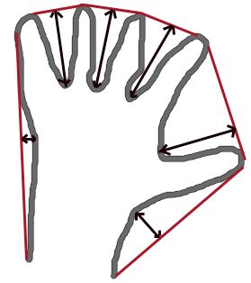
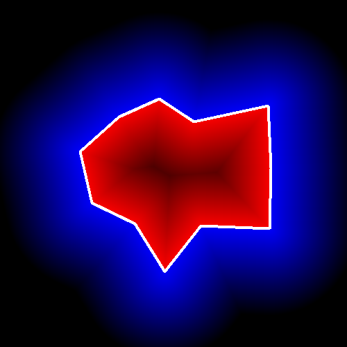

Structural Analysis and Shape Descriptors
=========================================

.. highlight:: cpp

moments
-----------
Calculates all of the moments up to the third order of a polygon or rasterized shape.

.. ocv:function:: Moments moments( InputArray array, bool binaryImage=false )

.. ocv:pyfunction:: cv2.moments(array[, binaryImage]) -> retval

.. ocv:cfunction:: void cvMoments( const CvArr* array, CvMoments* moments, int binary=0 )
.. ocv:pyoldfunction:: cv.Moments(array, binary=0) -> moments

    :param array: Raster image (single-channel, 8-bit or floating-point 2D array) or an array ( :math:`1 \times N`  or  :math:`N \times 1` ) of 2D points (``Point``  or  ``Point2f`` ).

    :param binaryImage: If it is true, all non-zero image pixels are treated as 1's. The parameter is used for images only.
    
    :param moments: Output moments.

The function computes moments, up to the 3rd order, of a vector shape or a rasterized shape. The results are returned in the structure ``Moments`` defined as: ::

    class Moments
    {
    public:
        Moments();
        Moments(double m00, double m10, double m01, double m20, double m11,
                double m02, double m30, double m21, double m12, double m03 );
        Moments( const CvMoments& moments );
        operator CvMoments() const;

In case of a raster image, the spatial moments :math:`\texttt{Moments::m}_{ji}` are computed as:

.. math::

    \texttt{m} _{ji}= \sum _{x,y}  \left ( \texttt{array} (x,y)  \cdot x^j  \cdot y^i \right )

The central moments
:math:`\texttt{Moments::mu}_{ji}` are computed as:

.. math::

    \texttt{mu} _{ji}= \sum _{x,y}  \left ( \texttt{array} (x,y)  \cdot (x -  \bar{x} )^j  \cdot (y -  \bar{y} )^i \right )

where
:math:`(\bar{x}, \bar{y})` is the mass center:

.. math::

    \bar{x} = \frac{\texttt{m}_{10}}{\texttt{m}_{00}} , \; \bar{y} = \frac{\texttt{m}_{01}}{\texttt{m}_{00}}

The normalized central moments
:math:`\texttt{Moments::nu}_{ij}` are computed as:

.. math::

    \texttt{nu} _{ji}= \frac{\texttt{mu}_{ji}}{\texttt{m}_{00}^{(i+j)/2+1}} .

.. note::

    :math:`\texttt{mu}_{00}=\texttt{m}_{00}`,
    :math:`\texttt{nu}_{00}=1` 
    :math:`\texttt{nu}_{10}=\texttt{mu}_{10}=\texttt{mu}_{01}=\texttt{mu}_{10}=0` , hence the values are not stored.

The moments of a contour are defined in the same way but computed using the Green's formula (see http://en.wikipedia.org/wiki/Green_theorem). So, due to a limited raster resolution, the moments computed for a contour are slightly different from the moments computed for the same rasterized contour.

.. seealso::

    :ocv:func:`contourArea`,
    :ocv:func:`arcLength`

HuMoments
-------------
Calculates seven Hu invariants.

.. ocv:function:: void HuMoments( const Moments& moments, double* hu )

.. ocv:pyfunction:: cv2.HuMoments(m) -> hu

.. ocv:cfunction:: void cvGetHuMoments( const CvMoments* moments, CvHuMoments* hu )

.. ocv:pyoldfunction:: cv.GetHuMoments(moments) -> hu

    :param moments: Input moments computed with  :ocv:func:`moments` .
    :param hu: Output Hu invariants.

The function calculates seven Hu invariants (introduced in [Hu62]_; see also
http://en.wikipedia.org/wiki/Image_moment) defined as:

.. math::

    \begin{array}{l} hu[0]= \eta _{20}+ \eta _{02} \\ hu[1]=( \eta _{20}- \eta _{02})^{2}+4 \eta _{11}^{2} \\ hu[2]=( \eta _{30}-3 \eta _{12})^{2}+ (3 \eta _{21}- \eta _{03})^{2} \\ hu[3]=( \eta _{30}+ \eta _{12})^{2}+ ( \eta _{21}+ \eta _{03})^{2} \\ hu[4]=( \eta _{30}-3 \eta _{12})( \eta _{30}+ \eta _{12})[( \eta _{30}+ \eta _{12})^{2}-3( \eta _{21}+ \eta _{03})^{2}]+(3 \eta _{21}- \eta _{03})( \eta _{21}+ \eta _{03})[3( \eta _{30}+ \eta _{12})^{2}-( \eta _{21}+ \eta _{03})^{2}] \\ hu[5]=( \eta _{20}- \eta _{02})[( \eta _{30}+ \eta _{12})^{2}- ( \eta _{21}+ \eta _{03})^{2}]+4 \eta _{11}( \eta _{30}+ \eta _{12})( \eta _{21}+ \eta _{03}) \\ hu[6]=(3 \eta _{21}- \eta _{03})( \eta _{21}+ \eta _{03})[3( \eta _{30}+ \eta _{12})^{2}-( \eta _{21}+ \eta _{03})^{2}]-( \eta _{30}-3 \eta _{12})( \eta _{21}+ \eta _{03})[3( \eta _{30}+ \eta _{12})^{2}-( \eta _{21}+ \eta _{03})^{2}] \\ \end{array}

where
:math:`\eta_{ji}` stands for
:math:`\texttt{Moments::nu}_{ji}` .

These values are proved to be invariants to the image scale, rotation, and reflection except the seventh one, whose sign is changed by reflection. This invariance is proved with the assumption of infinite image resolution. In case of raster images, the computed Hu invariants for the original and transformed images are a bit different.

.. seealso:: :ocv:func:`matchShapes`

findContours
----------------
Finds contours in a binary image.

.. ocv:function:: void findContours( InputOutputArray image, OutputArrayOfArrays contours,                   OutputArray hierarchy, int mode, int method, Point offset=Point())

.. ocv:function:: void findContours( InputOutputArray image, OutputArrayOfArrays contours, int mode, int method, Point offset=Point())

.. ocv:cfunction:: int cvFindContours( CvArr* image, CvMemStorage* storage, CvSeq** firstContour, int headerSize=sizeof(CvContour), int mode=CV_RETR_LIST, int method=CV_CHAIN_APPROX_SIMPLE, CvPoint offset=cvPoint(0, 0) )
.. ocv:pyoldfunction:: cv.FindContours(image, storage, mode=CV_RETR_LIST, method=CV_CHAIN_APPROX_SIMPLE, offset=(0, 0)) -> cvseq

    :param image: Source, an 8-bit single-channel image. Non-zero pixels are treated as 1's. Zero pixels remain 0's, so the image is treated as  ``binary`` . You can use  :ocv:func:`compare` ,  :ocv:func:`inRange` ,  :ocv:func:`threshold` ,  :ocv:func:`adaptiveThreshold` ,  :ocv:func:`Canny` , and others to create a binary image out of a grayscale or color one. The function modifies the  ``image``  while extracting the contours.

    :param contours: Detected contours. Each contour is stored as a vector of points.

    :param hiararchy: Optional output vector containing information about the image topology. It has as many elements as the number of contours. For each contour  ``contours[i]`` , the elements  ``hierarchy[i][0]`` ,  ``hiearchy[i][1]`` ,  ``hiearchy[i][2]`` , and  ``hiearchy[i][3]``  are set to 0-based indices in  ``contours``  of the next and previous contours at the same hierarchical level: the first child contour and the parent contour, respectively. If for a contour  ``i``  there are no next, previous, parent, or nested contours, the corresponding elements of  ``hierarchy[i]``  will be negative.

    :param mode: Contour retrieval mode.

            * **CV_RETR_EXTERNAL** retrieves only the extreme outer contours. It sets  ``hierarchy[i][2]=hierarchy[i][3]=-1``  for all the contours.

            * **CV_RETR_LIST** retrieves all of the contours without establishing any hierarchical relationships.

            * **CV_RETR_CCOMP** retrieves all of the contours and organizes them into a two-level hierarchy. At the top level, there are external boundaries of the components. At the second level, there are boundaries of the holes. If there is another contour inside a hole of a connected component, it is still put at the top level.

            * **CV_RETR_TREE** retrieves all of the contours and reconstructs a full hierarchy of nested contours. This full hierarchy is built and shown in the OpenCV  ``contours.c``  demo.

    :param method: Contour approximation method.

            * **CV_CHAIN_APPROX_NONE** stores absolutely all the contour points. That is, any 2 subsequent points ``(x1,y1)`` and ``(x2,y2)`` of the contour will be either horizontal, vertical or diagonal neighbors, that is, ``max(abs(x1-x2),abs(y2-y1))==1``.

            * **CV_CHAIN_APPROX_SIMPLE** compresses horizontal, vertical, and diagonal segments and leaves only their end points. For example, an up-right rectangular contour is encoded with 4 points.

            * **CV_CHAIN_APPROX_TC89_L1,CV_CHAIN_APPROX_TC89_KCOS** applies one of the flavors of the Teh-Chin chain approximation algorithm. See  [TehChin89]_ for details.

    :param offset: Optional offset by which every contour point is shifted. This is useful if the contours are extracted from the image ROI and then they should be analyzed in the whole image context.

The function retrieves contours from the binary image using the algorithm
[Suzuki85]_. The contours are a useful tool for shape analysis and object detection and recognition. See ``squares.c`` in the OpenCV sample directory.

.. note:: Source ``image`` is modified by this function.

drawContours
----------------
Draws contours outlines or filled contours.

.. ocv:function:: void drawContours( InputOutputArray image, InputArrayOfArrays contours,                   int contourIdx, const Scalar& color, int thickness=1, int lineType=8, InputArray hierarchy=noArray(), int maxLevel=INT_MAX, Point offset=Point() )

.. ocv:pyfunction:: cv2.drawContours(image, contours, contourIdx, color[, thickness[, lineType[, hierarchy[, maxLevel[, offset]]]]]) -> None

.. ocv:cfunction:: void cvDrawContours( CvArr *img, CvSeq* contour, CvScalar externalColor, CvScalar holeColor, int maxLevel, int thickness=1, int lineType=8 )
.. ocv:pyoldfunction:: cv.DrawContours(img, contour, externalColor, holeColor, maxLevel, thickness=1, lineType=8, offset=(0, 0))-> None

    :param image: Destination image.

    :param contours: All the input contours. Each contour is stored as a point vector.

    :param contourIdx: Parameter indicating a contour to draw. If it is negative, all the contours are drawn.

    :param color: Color of the contours.
    
    :param thickness: Thickness of lines the contours are drawn with. If it is negative (for example,  ``thickness=CV_FILLED`` ), the contour interiors are
        drawn.

    :param lineType: Line connectivity. See  :ocv:func:`line`  for details.

    :param hierarchy: Optional information about hierarchy. It is only needed if you want to draw only some of the  contours (see  ``maxLevel`` ).

    :param maxLevel: Maximal level for drawn contours. If it is 0, only
        the specified contour is drawn. If it is 1, the function draws the contour(s) and all the nested contours. If it is 2, the function draws the contours, all the nested contours, all the nested-to-nested contours, and so on. This parameter is only taken into account when there is  ``hierarchy``  available.

    :param offset: Optional contour shift parameter. Shift all the drawn contours by the specified  :math:`\texttt{offset}=(dx,dy)` .

The function draws contour outlines in the image if
:math:`\texttt{thickness} \ge 0` or fills the area bounded by the contours if
:math:`\texttt{thickness}<0` . The example below shows how to retrieve connected components from the binary image and label them: ::

    #include "cv.h"
    #include "highgui.h"

    using namespace cv;

    int main( int argc, char** argv )
    {
        Mat src;
        // the first command-line parameter must be a filename of the binary
        // (black-n-white) image
        if( argc != 2 || !(src=imread(argv[1], 0)).data)
            return -1;

        Mat dst = Mat::zeros(src.rows, src.cols, CV_8UC3);

        src = src > 1;
        namedWindow( "Source", 1 );
        imshow( "Source", src );

        vector<vector<Point> > contours;
        vector<Vec4i> hierarchy;

        findContours( src, contours, hierarchy,
            CV_RETR_CCOMP, CV_CHAIN_APPROX_SIMPLE );

        // iterate through all the top-level contours,
        // draw each connected component with its own random color
        int idx = 0;
        for( ; idx >= 0; idx = hierarchy[idx][0] )
        {
            Scalar color( rand()&255, rand()&255, rand()&255 );
            drawContours( dst, contours, idx, color, CV_FILLED, 8, hierarchy );
        }

        namedWindow( "Components", 1 );
        imshow( "Components", dst );
        waitKey(0);
    }

approxPolyDP
----------------
Approximates a polygonal curve(s) with the specified precision.

.. ocv:function:: void approxPolyDP( InputArray curve, OutputArray approxCurve, double epsilon, bool closed )

.. ocv:pyfunction:: cv2.approxPolyDP(curve, epsilon, closed[, approxCurve]) -> approxCurve

.. ocv:cfunction:: CvSeq* cvApproxPoly( const void* curve, int headerSize, CvMemStorage* storage, int method, double epsilon, int recursive=0 )

    :param curve: Input vector of a 2D point stored in:
        
        * ``std::vector`` or ``Mat`` (C++ interface)
        
        * ``Nx2`` numpy array (Python interface)
        
        * ``CvSeq`` or `` ``CvMat`` (C interface) 

    :param approxCurve: Result of the approximation. The type should match the type of the input curve. In case of C interface the approximated curve is stored in the memory storage and pointer to it is returned.

    :param epsilon: Parameter specifying the approximation accuracy. This is the maximum distance between the original curve and its approximation.

    :param closed: If true, the approximated curve is closed (its first and last vertices are connected). Otherwise, it is not closed.
    
    :param headerSize: Header size of the approximated curve. Normally, ``sizeof(CvContour)`` is used.
    
    :param storage: Memory storage where the approximated curve is stored.
    
    :param method: Contour approximation algorithm. Only ``CV_POLY_APPROX_DP`` is supported.
    
    :param recursive: Recursion flag. If it is non-zero and ``curve`` is ``CvSeq*``, the function ``cvApproxPoly`` approximates all the contours accessible from ``curve`` by ``h_next`` and ``v_next`` links.

The functions ``approxPolyDP`` approximate a curve or a polygon with another curve/polygon with less vertices so that the distance between them is less or equal to the specified precision. It uses the Douglas-Peucker algorithm
http://en.wikipedia.org/wiki/Ramer-Douglas-Peucker_algorithm

See http://code.ros.org/svn/opencv/trunk/opencv/samples/cpp/contours.cpp for the function usage model.

ApproxChains
-------------
Approximates Freeman chain(s) with a polygonal curve.

.. ocv:cfunction:: CvSeq* cvApproxChains( CvSeq* chain, CvMemStorage* storage, int method=CV_CHAIN_APPROX_SIMPLE, double parameter=0, int minimalPerimeter=0, int recursive=0 )

.. ocv:pyoldfunction:: cv.ApproxChains(chain, storage, method=CV_CHAIN_APPROX_SIMPLE, parameter=0, minimalPerimeter=0, recursive=0)-> contours
    
    :param chain: Pointer to the approximated Freeman chain that can refer to other chains.     
    
    :param storage: Storage location for the resulting polylines. 
    
    :param method: Approximation method (see the description of the function  :ocv:cfunc:`FindContours` ). 
    
    :param parameter: Method parameter (not used now). 
    
    :param minimalPerimeter: Approximates only those contours whose perimeters are not less than  ``minimal_perimeter`` . Other chains are removed from the resulting structure.   
    
    :param recursive: Recursion flag. If it is non-zero, the function approximates all chains that can be obtained from  ``chain``  by using the  ``h_next``  or  ``v_next`` links. Otherwise, the single input chain is approximated.
    
This is a standalone contour approximation routine, not represented in the new interface. When :ocv:cfunc:`FindContours` retrieves contours as Freeman chains, it calls the function to get approximated contours, represented as polygons.

arcLength
-------------
Calculates a contour perimeter or a curve length.

.. ocv:function:: double arcLength( InputArray curve, bool closed )

.. ocv:pyfunction:: cv2.arcLength(curve, closed) -> retval

.. ocv:cfunction:: double cvArcLength( const void* curve, CvSlice slice=CV_WHOLE_SEQ, int isClosed=-1 )
.. ocv:pyoldfunction:: cv.ArcLength(curve, slice=CV_WHOLE_SEQ, isClosed=-1)-> double

    :param curve: Input vector of 2D points, stored in ``std::vector`` or ``Mat``.

    :param closed: Flag indicating whether the curve is closed or not.

The function computes a curve length or a closed contour perimeter.

boundingRect
----------------
Calculates the up-right bounding rectangle of a point set.

.. ocv:function:: Rect boundingRect( InputArray points )

.. ocv:pyfunction:: cv2.boundingRect(points) -> retval

.. ocv:cfunction:: CvRect cvBoundingRect( CvArr* points, int update=0 )
.. ocv:pyoldfunction:: cv.BoundingRect(points, update=0)-> CvRect

    :param points: Input 2D point set, stored in ``std::vector`` or ``Mat``.

The function calculates and returns the minimal up-right bounding rectangle for the specified point set.

contourArea
---------------
Calculates a contour area.

.. ocv:function:: double contourArea( InputArray contour, bool oriented=false )

.. ocv:pyfunction:: cv2.contourArea(contour[, oriented]) -> retval

.. ocv:cfunction:: double cvContourArea( const CvArr* contour, CvSlice slice=CV_WHOLE_SEQ )
.. ocv:pyoldfunction:: cv.ContourArea(contour, slice=CV_WHOLE_SEQ)-> double

    :param contour: Input vector of 2D points (contour vertices), stored in ``std::vector`` or ``Mat``.
    :param orientation: Oriented area flag. If it is true, the function returns a signed area value, depending on the contour orientation (clockwise or counter-clockwise). Using this feature you can determine orientation of a contour by taking the sign of an area. By default, the parameter is ``false``, which means that the absolute value is returned.

The function computes a contour area. Similarly to
:ocv:func:`moments` , the area is computed using the Green formula. Thus, the returned area and the number of non-zero pixels, if you draw the contour using
:ocv:func:`drawContours` or
:ocv:func:`fillPoly` , can be different.

Example: ::

    vector<Point> contour;
    contour.push_back(Point2f(0, 0));
    contour.push_back(Point2f(10, 0));
    contour.push_back(Point2f(10, 10));
    contour.push_back(Point2f(5, 4));

    double area0 = contourArea(contour);
    vector<Point> approx;
    approxPolyDP(contour, approx, 5, true);
    double area1 = contourArea(approx);

    cout << "area0 =" << area0 << endl <<
            "area1 =" << area1 << endl <<
            "approx poly vertices" << approx.size() << endl;

convexHull
--------------
Finds the convex hull of a point set.

.. ocv:function:: void convexHull( InputArray points, OutputArray hull, bool clockwise=false, bool returnPoints=true )

.. ocv:pyfunction:: cv2.convexHull(points[, hull[, returnPoints[, clockwise]]]) -> hull

.. ocv:cfunction:: CvSeq* cvConvexHull2( const CvArr* input, void* storage=NULL, int orientation=CV_CLOCKWISE, int returnPoints=0 )

.. ocv:pyoldfunction:: cv.ConvexHull2(points, storage, orientation=CV_CLOCKWISE, returnPoints=0)-> convexHull

    :param points: Input 2D point set, stored in ``std::vector`` or ``Mat``.

    :param hull: Output convex hull. It is either an integer vector of indices or vector of points. In the first case, the ``hull`` elements are 0-based indices of the convex hull points in the original array (since the set of convex hull points is a subset of the original point set). In the second case, ``hull`` elements aree the convex hull points themselves.
    
    :param storage: Output memory storage in the old API (``cvConvexHull2`` returns a sequence containing the convex hull points or their indices).

    :param clockwise: Orientation flag. If it is true, the output convex hull is oriented clockwise. Otherwise, it is oriented counter-clockwise. The usual screen coordinate system is assumed so that the origin is at the top-left corner, x axis is oriented to the right, and y axis is oriented downwards.
    
    :param orientation: Convex hull orientation parameter in the old API, ``CV_CLOCKWISE`` or ``CV_COUNTERCLOCKWISE``.
    
    :param returnPoints: Operation flag. In case of a matrix, when the flag is true, the function returns convex hull points. Otherwise, it returns indices of the convex hull points. When the output array is ``std::vector``, the flag is ignored, and the output depends on the type of the vector: ``std::vector<int>`` implies ``returnPoints=true``, ``std::vector<Point>`` implies ``returnPoints=false``.

The functions find the convex hull of a 2D point set using the Sklansky's algorithm
[Sklansky82]_
that has
*O(N logN)* complexity in the current implementation. See the OpenCV sample ``convexhull.cpp`` that demonstrates the usage of different function variants.

ConvexityDefects
----------------
Finds the convexity defects of a contour.

.. ocv:cfunction:: CvSeq* cvConvexityDefects(  const CvArr* contour, const CvArr* convexhull, CvMemStorage* storage=NULL )

.. ocv:pyoldfunction:: cv.ConvexityDefects(contour, convexhull, storage)-> convexityDefects

    :param contour: Input contour. 
    
    :param convexhull: Convex hull obtained using  :ocv:cfunc:`ConvexHull2`  that should contain pointers or indices to the contour points, not the hull points themselves (the  ``returnPoints``  parameter in  :ocv:cfunc:`ConvexHull2`  should be zero). 
    
    :param storage: Container for the output sequence of convexity defects. If it is NULL, the contour or hull (in that order) storage is used. 
    
The function finds all convexity defects of the input contour and returns a sequence of the ``CvConvexityDefect`` structures, where ``CvConvexityDetect`` is defined as: ::

     struct CvConvexityDefect
     {
        CvPoint* start; // point of the contour where the defect begins
        CvPoint* end; // point of the contour where the defect ends
        CvPoint* depth_point; // the farthest from the convex hull point within the defect
        float depth; // distance between the farthest point and the convex hull
     };

The figure below displays convexity defects of a hand contour:

fitEllipse
--------------
Fits an ellipse around a set of 2D points.

.. ocv:function:: RotatedRect fitEllipse( InputArray points )

.. ocv:pyfunction:: cv2.fitEllipse(points) -> retval

.. ocv:cfunction:: CvBox2D cvFitEllipse2( const CvArr* points )
.. ocv:pyoldfunction:: cv.FitEllipse2(points)-> Box2D

    :param points: Input 2D point set, stored in:
    
        * ``std::vector<>`` or ``Mat`` (C++ interface)

        * ``CvSeq*`` or ``CvMat*`` (C interface)

        * Nx2 numpy array (Python interface)

The function calculates the ellipse that fits (in a least-squares sense) a set of 2D points best of all. It returns the rotated rectangle in which the ellipse is inscribed. The algorithm [Fitzgibbon95]_ is used.

fitLine
-----------
Fits a line to a 2D or 3D point set.

.. ocv:function:: void fitLine( InputArray points, OutputArray line, int distType, double param, double reps, double aeps )

.. ocv:pyfunction:: cv2.fitLine(points, distType, param, reps, aeps) -> line

.. ocv:cfunction:: void cvFitLine( const CvArr* points, int distType, double param, double reps, double aeps, float* line )
.. ocv:pyoldfunction:: cv.FitLine(points, distType, param, reps, aeps) -> line

    :param points: Input vector of 2D or 3D points, stored in ``std::vector<>`` or ``Mat``.

    :param line: Output line parameters. In case of 2D fitting, it should be a vector of 4 elements (like ``Vec4f``) - ``(vx, vy, x0, y0)``,  where  ``(vx, vy)``  is a normalized vector collinear to the line and  ``(x0, y0)``  is a point on the line. In case of 3D fitting, it should be a vector of 6 elements (like  ``Vec6f``) - ``(vx, vy, vz, x0, y0, z0)``, where ``(vx, vy, vz)`` is a normalized vector collinear to the line and ``(x0, y0, z0)`` is a point on the line.

    :param distType: Distance used by the M-estimator (see the discussion below).

    :param param: Numerical parameter ( ``C`` ) for some types of distances. If it is 0, an optimal value is chosen.

    :param reps: Sufficient accuracy for the radius (distance between the coordinate origin and the line).
    
    :param aeps: Sufficient accuracy for the angle. 0.01 would be a good default value for ``reps`` and ``aeps``.

The function ``fitLine`` fits a line to a 2D or 3D point set by minimizing
:math:`\sum_i \rho(r_i)` where
:math:`r_i` is a distance between the
:math:`i^{th}` point, the line and
:math:`\rho(r)` is a distance function, one of the following:

* distType=CV\_DIST\_L2

    .. math::

        \rho (r) = r^2/2  \quad \text{(the simplest and the fastest least-squares method)}

* distType=CV\_DIST\_L1

    .. math::

        \rho (r) = r

* distType=CV\_DIST\_L12

    .. math::

        \rho (r) = 2  \cdot ( \sqrt{1 + \frac{r^2}{2}} - 1)

* distType=CV\_DIST\_FAIR

    .. math::

        \rho \left (r \right ) = C^2  \cdot \left (  \frac{r}{C} -  \log{\left(1 + \frac{r}{C}\right)} \right )  \quad \text{where} \quad C=1.3998

* distType=CV\_DIST\_WELSCH

    .. math::

        \rho \left (r \right ) =  \frac{C^2}{2} \cdot \left ( 1 -  \exp{\left(-\left(\frac{r}{C}\right)^2\right)} \right )  \quad \text{where} \quad C=2.9846

* distType=CV\_DIST\_HUBER

    .. math::

        \rho (r) =  \fork{r^2/2}{if $r < C$}{C \cdot (r-C/2)}{otherwise} \quad \text{where} \quad C=1.345

The algorithm is based on the M-estimator (
http://en.wikipedia.org/wiki/M-estimator
) technique that iteratively fits the line using the weighted least-squares algorithm. After each iteration the weights
:math:`w_i` are adjusted to be inversely proportional to
:math:`\rho(r_i)` .

isContourConvex
-------------------
Tests a contour convexity.

.. ocv:function:: bool isContourConvex( InputArray contour )

.. ocv:pyfunction:: cv2.isContourConvex(contour) -> retval

.. ocv:cfunction:: int cvCheckContourConvexity( const CvArr* contour )
.. ocv:pyoldfunction:: cv.CheckContourConvexity(contour)-> int

    :param contour: Input vector of 2D points, stored in:
    
            * ``std::vector<>`` or ``Mat`` (C++ interface)

            * ``CvSeq*`` or ``CvMat*`` (C interface)

            * Nx2 numpy array (Python interface)

The function tests whether the input contour is convex or not. The contour must be simple, that is, without self-intersections. Otherwise, the function output is undefined.

minAreaRect
---------------
Finds a rotated rectangle of the minimum area enclosing the input 2D point set.

.. ocv:function:: RotatedRect minAreaRect( InputArray points )

.. ocv:pyfunction:: cv2.minAreaRect(points) -> retval

.. ocv:cfunction:: CvBox2D cvMinAreaRect2( const CvArr* points, CvMemStorage* storage=NULL )

.. ocv:pyoldfunction:: cv.MinAreaRect2(points, storage=None)-> CvBox2D

    :param points: Input vector of 2D points, stored in:
    
        * ``std::vector<>`` or ``Mat`` (C++ interface)
        
        * ``CvSeq*`` or ``CvMat*`` (C interface)
        
        * Nx2 numpy array (Python interface)

The function calculates and returns the minimum-area bounding rectangle (possibly rotated) for a specified point set. See the OpenCV sample ``minarea.cpp`` .

minEnclosingCircle
----------------------
Finds a circle of the minimum area enclosing a 2D point set.

.. ocv:function:: void minEnclosingCircle( InputArray points, Point2f& center, float& radius )

.. ocv:pyfunction:: cv2.minEnclosingCircle(points, center, radius) -> None

.. ocv:cfunction:: int cvMinEnclosingCircle( const CvArr* points, CvPoint2D32f* center, float* radius )

.. ocv:pyoldfunction:: cv.MinEnclosingCircle(points)-> (int, center, radius)

    :param points: Input vector of 2D points, stored in:
    
        * ``std::vector<>`` or ``Mat`` (C++ interface)
        
        * ``CvSeq*`` or ``CvMat*`` (C interface)
        
        * Nx2 numpy array (Python interface)

    :param center: Output center of the circle.

    :param radius: Output radius of the circle.

The function finds the minimal enclosing circle of a 2D point set using an iterative algorithm. See the OpenCV sample ``minarea.cpp`` .

matchShapes
---------------
Compares two shapes.

.. ocv:function:: double matchShapes( InputArray object1, InputArray object2, int method, double parameter=0 )

.. ocv:pyfunction:: cv2.matchShapes(contour1, contour2, method, parameter) -> retval

.. ocv:cfunction:: double cvMatchShapes( const void* object1, const void* object2, int method, double parameter=0 )
.. ocv:pyoldfunction:: cv.MatchShapes(object1, object2, method, parameter=0)-> None

    :param object1: First contour or grayscale image.

    :param object2: Second contour or grayscale image.

    :param method: Comparison method: ``CV_CONTOUR_MATCH_I1`` , \ ``CV_CONTOURS_MATCH_I2`` \
        or ``CV_CONTOURS_MATCH_I3``  (see the details below).

    :param parameter: Method-specific parameter (not supported now).

The function compares two shapes. All three implemented methods use the Hu invariants (see
:ocv:func:`HuMoments` ) as follows (
:math:`A` denotes ``object1``,:math:`B` denotes ``object2`` ):

* method=CV\_CONTOUR\_MATCH\_I1

    .. math::

        I_1(A,B) =  \sum _{i=1...7}  \left |  \frac{1}{m^A_i} -  \frac{1}{m^B_i} \right |

* method=CV\_CONTOUR\_MATCH\_I2

    .. math::

        I_2(A,B) =  \sum _{i=1...7}  \left | m^A_i - m^B_i  \right |

* method=CV\_CONTOUR\_MATCH\_I3

    .. math::

        I_3(A,B) =  \sum _{i=1...7}  \frac{ \left| m^A_i - m^B_i \right| }{ \left| m^A_i \right| }

where

.. math::

    \begin{array}{l} m^A_i =  \mathrm{sign} (h^A_i)  \cdot \log{h^A_i} \\ m^B_i =  \mathrm{sign} (h^B_i)  \cdot \log{h^B_i} \end{array}

and
:math:`h^A_i, h^B_i` are the Hu moments of
:math:`A` and
:math:`B` , respectively.

pointPolygonTest
--------------------
Performs a point-in-contour test.

.. ocv:function:: double pointPolygonTest( InputArray contour, Point2f pt, bool measureDist )

.. ocv:pyfunction:: cv2.pointPolygonTest(contour, pt, measureDist) -> retval

.. ocv:cfunction:: double cvPointPolygonTest( const CvArr* contour, CvPoint2D32f pt, int measureDist )
.. ocv:pyoldfunction:: cv.PointPolygonTest(contour, pt, measureDist)-> double

    :param contour: Input contour.

    :param pt: Point tested against the contour.

    :param measureDist: If true, the function estimates the signed distance from the point to the nearest contour edge. Otherwise, the function only checks if the point is inside a contour or not.

The function determines whether the
point is inside a contour, outside, or lies on an edge (or coincides
with a vertex). It returns positive (inside), negative (outside), or zero (on an edge) value,
correspondingly. When ``measureDist=false`` , the return value
is +1, -1, and 0, respectively. Otherwise, the return value
is a signed distance between the point and the nearest contour
edge.

See below a sample output of the function where each image pixel is tested against the contour.

.. [Fitzgibbon95] Andrew W. Fitzgibbon, R.B.Fisher. *A Buyer's Guide to Conic Fitting*. Proc.5th British Machine Vision Conference, Birmingham, pp. 513-522, 1995.

.. [Hu62] M. Hu. *Visual Pattern Recognition by Moment Invariants*, IRE Transactions on Information Theory, 8:2, pp. 179-187, 1962.

.. [Sklansky82] Sklansky, J., *Finding the Convex Hull of a Simple Polygon*. PRL 1 $number, pp 79-83 (1982)

.. [Suzuki85] Suzuki, S. and Abe, K., *Topological Structural Analysis of Digitized Binary Images by Border Following*. CVGIP 30 1, pp 32-46 (1985)

.. [TehChin89] Teh, C.H. and Chin, R.T., *On the Detection of Dominant Points on Digital Curve*. PAMI 11 8, pp 859-872 (1989)
