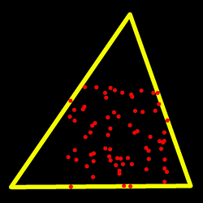
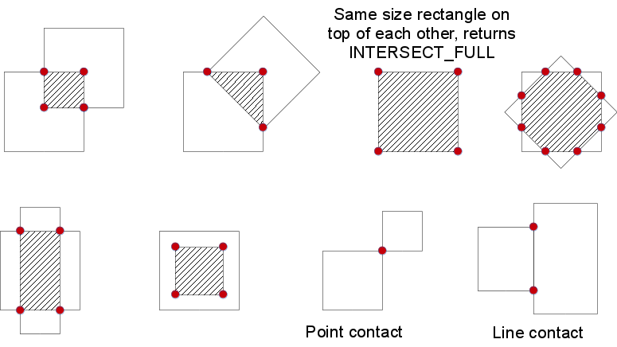

Structural Analysis and Shape Descriptors
=========================================

.. highlight:: cpp

moments
-----------
Calculates all of the moments up to the third order of a polygon or rasterized shape.

.. ocv:function:: Moments moments( InputArray array, bool binaryImage=false )

.. ocv:pyfunction:: cv2.moments(array[, binaryImage]) -> retval

.. ocv:cfunction:: void cvMoments( const CvArr* arr, CvMoments* moments, int binary=0 )

    :param array: Raster image (single-channel, 8-bit or floating-point 2D array) or an array ( :math:`1 \times N`  or  :math:`N \times 1` ) of 2D points (``Point``  or  ``Point2f`` ).

    :param binaryImage: If it is true, all non-zero image pixels are treated as 1's. The parameter is used for images only.

    :param moments: Output moments.

The function computes moments, up to the 3rd order, of a vector shape or a rasterized shape. The results are returned in the structure ``Moments`` defined as: ::

    class Moments
    {
    public:
        Moments();
        Moments(double m00, double m10, double m01, double m20, double m11,
                double m02, double m30, double m21, double m12, double m03 );
        Moments( const CvMoments& moments );
        operator CvMoments() const;

        // spatial moments
        double  m00, m10, m01, m20, m11, m02, m30, m21, m12, m03;
        // central moments
        double  mu20, mu11, mu02, mu30, mu21, mu12, mu03;
        // central normalized moments
        double  nu20, nu11, nu02, nu30, nu21, nu12, nu03;
    }

In case of a raster image, the spatial moments :math:`\texttt{Moments::m}_{ji}` are computed as:

.. math::

    \texttt{m} _{ji}= \sum _{x,y}  \left ( \texttt{array} (x,y)  \cdot x^j  \cdot y^i \right )

The central moments
:math:`\texttt{Moments::mu}_{ji}` are computed as:

.. math::

    \texttt{mu} _{ji}= \sum _{x,y}  \left ( \texttt{array} (x,y)  \cdot (x -  \bar{x} )^j  \cdot (y -  \bar{y} )^i \right )

where
:math:`(\bar{x}, \bar{y})` is the mass center:

.. math::

    \bar{x} = \frac{\texttt{m}_{10}}{\texttt{m}_{00}} , \; \bar{y} = \frac{\texttt{m}_{01}}{\texttt{m}_{00}}

The normalized central moments
:math:`\texttt{Moments::nu}_{ij}` are computed as:

.. math::

    \texttt{nu} _{ji}= \frac{\texttt{mu}_{ji}}{\texttt{m}_{00}^{(i+j)/2+1}} .

.. note::

    :math:`\texttt{mu}_{00}=\texttt{m}_{00}`,
    :math:`\texttt{nu}_{00}=1`
    :math:`\texttt{nu}_{10}=\texttt{mu}_{10}=\texttt{mu}_{01}=\texttt{mu}_{10}=0` , hence the values are not stored.

The moments of a contour are defined in the same way but computed using the Green's formula (see http://en.wikipedia.org/wiki/Green_theorem). So, due to a limited raster resolution, the moments computed for a contour are slightly different from the moments computed for the same rasterized contour.

.. note::

     Since the contour moments are computed using Green formula, you may get seemingly odd results for contours with self-intersections, e.g. a zero area (``m00``) for butterfly-shaped contours.

.. seealso::

    :ocv:func:`contourArea`,
    :ocv:func:`arcLength`

HuMoments
-------------
Calculates seven Hu invariants.

.. ocv:function:: void HuMoments( const Moments& m, OutputArray hu )

.. ocv:function:: void HuMoments( const Moments& moments, double hu[7] )

.. ocv:pyfunction:: cv2.HuMoments(m[, hu]) -> hu

.. ocv:cfunction:: void cvGetHuMoments( CvMoments* moments, CvHuMoments* hu_moments )

    :param moments: Input moments computed with  :ocv:func:`moments` .
    :param hu: Output Hu invariants.

The function calculates seven Hu invariants (introduced in [Hu62]_; see also
http://en.wikipedia.org/wiki/Image_moment) defined as:

.. math::

    \begin{array}{l} hu[0]= \eta _{20}+ \eta _{02} \\ hu[1]=( \eta _{20}- \eta _{02})^{2}+4 \eta _{11}^{2} \\ hu[2]=( \eta _{30}-3 \eta _{12})^{2}+ (3 \eta _{21}- \eta _{03})^{2} \\ hu[3]=( \eta _{30}+ \eta _{12})^{2}+ ( \eta _{21}+ \eta _{03})^{2} \\ hu[4]=( \eta _{30}-3 \eta _{12})( \eta _{30}+ \eta _{12})[( \eta _{30}+ \eta _{12})^{2}-3( \eta _{21}+ \eta _{03})^{2}]+(3 \eta _{21}- \eta _{03})( \eta _{21}+ \eta _{03})[3( \eta _{30}+ \eta _{12})^{2}-( \eta _{21}+ \eta _{03})^{2}] \\ hu[5]=( \eta _{20}- \eta _{02})[( \eta _{30}+ \eta _{12})^{2}- ( \eta _{21}+ \eta _{03})^{2}]+4 \eta _{11}( \eta _{30}+ \eta _{12})( \eta _{21}+ \eta _{03}) \\ hu[6]=(3 \eta _{21}- \eta _{03})( \eta _{21}+ \eta _{03})[3( \eta _{30}+ \eta _{12})^{2}-( \eta _{21}+ \eta _{03})^{2}]-( \eta _{30}-3 \eta _{12})( \eta _{21}+ \eta _{03})[3( \eta _{30}+ \eta _{12})^{2}-( \eta _{21}+ \eta _{03})^{2}] \\ \end{array}

where
:math:`\eta_{ji}` stands for
:math:`\texttt{Moments::nu}_{ji}` .

These values are proved to be invariants to the image scale, rotation, and reflection except the seventh one, whose sign is changed by reflection. This invariance is proved with the assumption of infinite image resolution. In case of raster images, the computed Hu invariants for the original and transformed images are a bit different.

.. seealso:: :ocv:func:`matchShapes`

connectedComponents
-----------------------
computes the connected components labeled image of boolean image ``image`` with 4 or 8 way connectivity - returns N, the total number of labels [0, N-1] where 0 represents the background label.  ltype specifies the output label image type, an important consideration based on the total number of labels or alternatively the total number of pixels in the source image.

.. ocv:function:: int connectedComponents(InputArray image, OutputArray labels, int connectivity = 8, int ltype=CV_32S)

.. ocv:function:: int connectedComponentsWithStats(InputArray image, OutputArray labels, OutputArray stats, OutputArray centroids, int connectivity = 8, int ltype=CV_32S)

    :param image: the image to be labeled

    :param labels: destination labeled image

    :param connectivity: 8 or 4 for 8-way or 4-way connectivity respectively

    :param ltype: output image label type.  Currently CV_32S and CV_16U are supported.

    :param statsv: statistics output for each label, including the background label, see below for available statistics.  Statistics are accessed via statsv(label, COLUMN) where available columns are defined below.

        * **CC_STAT_LEFT** The leftmost (x) coordinate which is the inclusive start of the bounding box in the horizontal
          direction.

        * **CC_STAT_TOP**  The topmost (y) coordinate which is the inclusive start of the bounding box in the vertical
          direction.

        * **CC_STAT_WIDTH** The horizontal size of the bounding box

        * **CC_STAT_HEIGHT** The vertical size of the bounding box

        * **CC_STAT_AREA** The total area (in pixels) of the connected component

    :param centroids: floating point centroid (x,y) output for each label, including the background label

findContours
----------------
Finds contours in a binary image.

.. ocv:function:: void findContours( InputOutputArray image, OutputArrayOfArrays contours, OutputArray hierarchy, int mode, int method, Point offset=Point())

.. ocv:function:: void findContours( InputOutputArray image, OutputArrayOfArrays contours, int mode, int method, Point offset=Point())

.. ocv:pyfunction:: cv2.findContours(image, mode, method[, contours[, hierarchy[, offset]]]) -> image, contours, hierarchy

.. ocv:cfunction:: int cvFindContours( CvArr* image, CvMemStorage* storage, CvSeq** first_contour, int header_size=sizeof(CvContour), int mode=CV_RETR_LIST, int method=CV_CHAIN_APPROX_SIMPLE, CvPoint offset=cvPoint(0,0) )

    :param image: Source, an 8-bit single-channel image. Non-zero pixels are treated as 1's. Zero pixels remain 0's, so the image is treated as  ``binary`` . You can use  :ocv:func:`compare` ,  :ocv:func:`inRange` ,  :ocv:func:`threshold` ,  :ocv:func:`adaptiveThreshold` ,  :ocv:func:`Canny` , and others to create a binary image out of a grayscale or color one. The function modifies the  ``image``  while extracting the contours. If mode equals to ``CV_RETR_CCOMP`` or ``CV_RETR_FLOODFILL``, the input can also be a 32-bit integer image of labels (``CV_32SC1``).

    :param contours: Detected contours. Each contour is stored as a vector of points.

    :param hierarchy: Optional output vector, containing information about the image topology. It has as many elements as the number of contours. For each i-th contour  ``contours[i]`` , the elements  ``hierarchy[i][0]`` ,  ``hiearchy[i][1]`` ,  ``hiearchy[i][2]`` , and  ``hiearchy[i][3]``  are set to 0-based indices in  ``contours``  of the next and previous contours at the same hierarchical level, the first child contour and the parent contour, respectively. If for the contour  ``i``  there are no next, previous, parent, or nested contours, the corresponding elements of  ``hierarchy[i]``  will be negative.

    :param mode: Contour retrieval mode (if you use Python see also a note below).

            * **CV_RETR_EXTERNAL** retrieves only the extreme outer contours. It sets  ``hierarchy[i][2]=hierarchy[i][3]=-1``  for all the contours.

            * **CV_RETR_LIST** retrieves all of the contours without establishing any hierarchical relationships.

            * **CV_RETR_CCOMP** retrieves all of the contours and organizes them into a two-level hierarchy. At the top level, there are external boundaries of the components. At the second level, there are boundaries of the holes. If there is another contour inside a hole of a connected component, it is still put at the top level.

            * **CV_RETR_TREE** retrieves all of the contours and reconstructs a full hierarchy of nested contours. This full hierarchy is built and shown in the OpenCV  ``contours.c``  demo.

    :param method: Contour approximation method (if you use Python see also a note below).

            * **CV_CHAIN_APPROX_NONE** stores absolutely all the contour points. That is, any 2 subsequent points ``(x1,y1)`` and ``(x2,y2)`` of the contour will be either horizontal, vertical or diagonal neighbors, that is, ``max(abs(x1-x2),abs(y2-y1))==1``.

            * **CV_CHAIN_APPROX_SIMPLE** compresses horizontal, vertical, and diagonal segments and leaves only their end points. For example, an up-right rectangular contour is encoded with 4 points.

            * **CV_CHAIN_APPROX_TC89_L1,CV_CHAIN_APPROX_TC89_KCOS** applies one of the flavors of the Teh-Chin chain approximation algorithm. See  [TehChin89]_ for details.

    :param offset: Optional offset by which every contour point is shifted. This is useful if the contours are extracted from the image ROI and then they should be analyzed in the whole image context.

The function retrieves contours from the binary image using the algorithm
[Suzuki85]_. The contours are a useful tool for shape analysis and object detection and recognition. See ``squares.c`` in the OpenCV sample directory.

.. note:: Source ``image`` is modified by this function. Also, the function does not take into account 1-pixel border of the image (it's filled with 0's and used for neighbor analysis in the algorithm), therefore the contours touching the image border will be clipped.

.. note:: If you use the new Python interface then the ``CV_`` prefix has to be omitted in contour retrieval mode and contour approximation method parameters (for example, use ``cv2.RETR_LIST`` and ``cv2.CHAIN_APPROX_NONE`` parameters). If you use the old Python interface then these parameters have the ``CV_`` prefix (for example, use ``cv.CV_RETR_LIST`` and ``cv.CV_CHAIN_APPROX_NONE``).

.. note::

   * An example using the findContour functionality can be found at opencv_source_code/samples/cpp/contours2.cpp
   * An example using findContours to clean up a background segmentation result at opencv_source_code/samples/cpp/segment_objects.cpp

   * (Python) An example using the findContour functionality can be found at opencv_source/samples/python2/contours.py
   * (Python) An example of detecting squares in an image can be found at opencv_source/samples/python2/squares.py

approxPolyDP
----------------
Approximates a polygonal curve(s) with the specified precision.

.. ocv:function:: void approxPolyDP( InputArray curve, OutputArray approxCurve, double epsilon, bool closed )

.. ocv:pyfunction:: cv2.approxPolyDP(curve, epsilon, closed[, approxCurve]) -> approxCurve

.. ocv:cfunction:: CvSeq* cvApproxPoly( const void* src_seq, int header_size, CvMemStorage* storage, int method, double eps, int recursive=0 )

    :param curve: Input vector of a 2D point stored in:

        * ``std::vector`` or ``Mat`` (C++ interface)

        * ``Nx2`` numpy array (Python interface)

        * ``CvSeq`` or `` ``CvMat`` (C interface)

    :param approxCurve: Result of the approximation. The type should match the type of the input curve. In case of C interface the approximated curve is stored in the memory storage and pointer to it is returned.

    :param epsilon: Parameter specifying the approximation accuracy. This is the maximum distance between the original curve and its approximation.

    :param closed: If true, the approximated curve is closed (its first and last vertices are connected). Otherwise, it is not closed.

    :param header_size: Header size of the approximated curve. Normally, ``sizeof(CvContour)`` is used.

    :param storage: Memory storage where the approximated curve is stored.

    :param method: Contour approximation algorithm. Only ``CV_POLY_APPROX_DP`` is supported.

    :param recursive: Recursion flag. If it is non-zero and ``curve`` is ``CvSeq*``, the function ``cvApproxPoly`` approximates all the contours accessible from ``curve`` by ``h_next`` and ``v_next`` links.

The functions ``approxPolyDP`` approximate a curve or a polygon with another curve/polygon with less vertices so that the distance between them is less or equal to the specified precision. It uses the Douglas-Peucker algorithm
http://en.wikipedia.org/wiki/Ramer-Douglas-Peucker_algorithm

See https://github.com/Itseez/opencv/tree/master/samples/cpp/contours2.cpp for the function usage model.

ApproxChains
-------------
Approximates Freeman chain(s) with a polygonal curve.

.. ocv:cfunction:: CvSeq* cvApproxChains( CvSeq* src_seq, CvMemStorage* storage, int method=CV_CHAIN_APPROX_SIMPLE, double parameter=0, int minimal_perimeter=0, int recursive=0 )

    :param src_seq: Pointer to the approximated Freeman chain that can refer to other chains.

    :param storage: Storage location for the resulting polylines.

    :param method: Approximation method (see the description of the function  :ocv:cfunc:`FindContours` ).

    :param parameter: Method parameter (not used now).

    :param minimal_perimeter: Approximates only those contours whose perimeters are not less than  ``minimal_perimeter`` . Other chains are removed from the resulting structure.

    :param recursive: Recursion flag. If it is non-zero, the function approximates all chains that can be obtained from  ``chain``  by using the  ``h_next``  or  ``v_next`` links. Otherwise, the single input chain is approximated.

This is a standalone contour approximation routine, not represented in the new interface. When :ocv:cfunc:`FindContours` retrieves contours as Freeman chains, it calls the function to get approximated contours, represented as polygons.

arcLength
-------------
Calculates a contour perimeter or a curve length.

.. ocv:function:: double arcLength( InputArray curve, bool closed )

.. ocv:pyfunction:: cv2.arcLength(curve, closed) -> retval

.. ocv:cfunction:: double cvArcLength( const void* curve, CvSlice slice=CV_WHOLE_SEQ, int is_closed=-1 )

    :param curve: Input vector of 2D points, stored in ``std::vector`` or ``Mat``.

    :param closed: Flag indicating whether the curve is closed or not.

The function computes a curve length or a closed contour perimeter.

boundingRect
----------------
Calculates the up-right bounding rectangle of a point set.

.. ocv:function:: Rect boundingRect( InputArray points )

.. ocv:pyfunction:: cv2.boundingRect(points) -> retval

.. ocv:cfunction:: CvRect cvBoundingRect( CvArr* points, int update=0 )

    :param points: Input 2D point set, stored in ``std::vector`` or ``Mat``.

The function calculates and returns the minimal up-right bounding rectangle for the specified point set.

contourArea
---------------
Calculates a contour area.

.. ocv:function:: double contourArea( InputArray contour, bool oriented=false )

.. ocv:pyfunction:: cv2.contourArea(contour[, oriented]) -> retval

.. ocv:cfunction:: double cvContourArea( const CvArr* contour, CvSlice slice=CV_WHOLE_SEQ, int oriented=0 )

    :param contour: Input vector of 2D points (contour vertices), stored in ``std::vector`` or ``Mat``.

    :param oriented: Oriented area flag. If it is true, the function returns a signed area value, depending on the contour orientation (clockwise or counter-clockwise). Using this feature you can determine orientation of a contour by taking the sign of an area. By default, the parameter is ``false``, which means that the absolute value is returned.

The function computes a contour area. Similarly to
:ocv:func:`moments` , the area is computed using the Green formula. Thus, the returned area and the number of non-zero pixels, if you draw the contour using
:ocv:func:`drawContours` or
:ocv:func:`fillPoly` , can be different.
Also, the function will most certainly give a wrong results for contours with self-intersections.

Example: ::

    vector<Point> contour;
    contour.push_back(Point2f(0, 0));
    contour.push_back(Point2f(10, 0));
    contour.push_back(Point2f(10, 10));
    contour.push_back(Point2f(5, 4));

    double area0 = contourArea(contour);
    vector<Point> approx;
    approxPolyDP(contour, approx, 5, true);
    double area1 = contourArea(approx);

    cout << "area0 =" << area0 << endl <<
            "area1 =" << area1 << endl <<
            "approx poly vertices" << approx.size() << endl;

convexHull
--------------
Finds the convex hull of a point set.

.. ocv:function:: void convexHull( InputArray points, OutputArray hull, bool clockwise=false, bool returnPoints=true )

.. ocv:pyfunction:: cv2.convexHull(points[, hull[, clockwise[, returnPoints]]]) -> hull

.. ocv:cfunction:: CvSeq* cvConvexHull2( const CvArr* input, void* hull_storage=NULL, int orientation=CV_CLOCKWISE, int return_points=0 )

    :param points: Input 2D point set, stored in ``std::vector`` or ``Mat``.

    :param hull: Output convex hull. It is either an integer vector of indices or vector of points. In the first case, the ``hull`` elements are 0-based indices of the convex hull points in the original array (since the set of convex hull points is a subset of the original point set). In the second case, ``hull`` elements are the convex hull points themselves.

    :param hull_storage: Output memory storage in the old API (``cvConvexHull2`` returns a sequence containing the convex hull points or their indices).

    :param clockwise: Orientation flag. If it is true, the output convex hull is oriented clockwise. Otherwise, it is oriented counter-clockwise. The assumed coordinate system has its X axis pointing to the right, and its Y axis pointing upwards.

    :param orientation: Convex hull orientation parameter in the old API, ``CV_CLOCKWISE`` or ``CV_COUNTERCLOCKWISE``.

    :param returnPoints: Operation flag. In case of a matrix, when the flag is true, the function returns convex hull points. Otherwise, it returns indices of the convex hull points. When the output array is ``std::vector``, the flag is ignored, and the output depends on the type of the vector: ``std::vector<int>`` implies ``returnPoints=true``, ``std::vector<Point>`` implies ``returnPoints=false``.

The functions find the convex hull of a 2D point set using the Sklansky's algorithm
[Sklansky82]_
that has
*O(N logN)* complexity in the current implementation. See the OpenCV sample ``convexhull.cpp`` that demonstrates the usage of different function variants.

.. note::

   * An example using the convexHull functionality can be found at opencv_source_code/samples/cpp/convexhull.cpp

convexityDefects
----------------
Finds the convexity defects of a contour.

.. ocv:function:: void convexityDefects( InputArray contour, InputArray convexhull, OutputArray convexityDefects )

.. ocv:pyfunction:: cv2.convexityDefects(contour, convexhull[, convexityDefects]) -> convexityDefects

.. ocv:cfunction:: CvSeq* cvConvexityDefects(  const CvArr* contour, const CvArr* convexhull, CvMemStorage* storage=NULL )

    :param contour: Input contour.

    :param convexhull: Convex hull obtained using  :ocv:func:`convexHull`  that should contain indices of the contour points that make the hull.

    :param convexityDefects: The output vector of convexity defects. In C++ and the new Python/Java interface each convexity defect is represented as 4-element integer vector (a.k.a. ``cv::Vec4i``): ``(start_index, end_index, farthest_pt_index, fixpt_depth)``, where indices are 0-based indices in the original contour of the convexity defect beginning, end and the farthest point, and ``fixpt_depth`` is fixed-point approximation (with 8 fractional bits) of the distance between the farthest contour point and the hull. That is, to get the floating-point value of the depth will be ``fixpt_depth/256.0``. In C interface convexity defect is represented by ``CvConvexityDefect`` structure - see below.

    :param storage: Container for the output sequence of convexity defects. If it is NULL, the contour or hull (in that order) storage is used.

The function finds all convexity defects of the input contour and returns a sequence of the ``CvConvexityDefect`` structures, where ``CvConvexityDetect`` is defined as: ::

     struct CvConvexityDefect
     {
        CvPoint* start; // point of the contour where the defect begins
        CvPoint* end; // point of the contour where the defect ends
        CvPoint* depth_point; // the farthest from the convex hull point within the defect
        float depth; // distance between the farthest point and the convex hull
     };

The figure below displays convexity defects of a hand contour:

.. image:: pics/defects.png

fitEllipse
--------------
Fits an ellipse around a set of 2D points.

.. ocv:function:: RotatedRect fitEllipse( InputArray points )

.. ocv:pyfunction:: cv2.fitEllipse(points) -> retval

.. ocv:cfunction:: CvBox2D cvFitEllipse2( const CvArr* points )

    :param points: Input 2D point set, stored in:

        * ``std::vector<>`` or ``Mat`` (C++ interface)

        * ``CvSeq*`` or ``CvMat*`` (C interface)

        * Nx2 numpy array (Python interface)

The function calculates the ellipse that fits (in a least-squares sense) a set of 2D points best of all. It returns the rotated rectangle in which the ellipse is inscribed. The algorithm [Fitzgibbon95]_ is used.
Developer should keep in mind that it is possible that the returned ellipse/rotatedRect data contains negative indices, due to the data points being close to the border of the containing Mat element.

.. note::

   * An example using the fitEllipse technique can be found at opencv_source_code/samples/cpp/fitellipse.cpp

fitLine
-----------
Fits a line to a 2D or 3D point set.

.. ocv:function:: void fitLine( InputArray points, OutputArray line, int distType, double param, double reps, double aeps )

.. ocv:pyfunction:: cv2.fitLine(points, distType, param, reps, aeps[, line]) -> line

.. ocv:cfunction:: void cvFitLine( const CvArr* points, int dist_type, double param, double reps, double aeps, float* line )

    :param points: Input vector of 2D or 3D points, stored in ``std::vector<>`` or ``Mat``.

    :param line: Output line parameters. In case of 2D fitting, it should be a vector of 4 elements (like ``Vec4f``) - ``(vx, vy, x0, y0)``,  where  ``(vx, vy)``  is a normalized vector collinear to the line and  ``(x0, y0)``  is a point on the line. In case of 3D fitting, it should be a vector of 6 elements (like  ``Vec6f``) - ``(vx, vy, vz, x0, y0, z0)``, where ``(vx, vy, vz)`` is a normalized vector collinear to the line and ``(x0, y0, z0)`` is a point on the line.

    :param distType: Distance used by the M-estimator (see the discussion below).

    :param param: Numerical parameter ( ``C`` ) for some types of distances. If it is 0, an optimal value is chosen.

    :param reps: Sufficient accuracy for the radius (distance between the coordinate origin and the line).

    :param aeps: Sufficient accuracy for the angle. 0.01 would be a good default value for ``reps`` and ``aeps``.

The function ``fitLine`` fits a line to a 2D or 3D point set by minimizing
:math:`\sum_i \rho(r_i)` where
:math:`r_i` is a distance between the
:math:`i^{th}` point, the line and
:math:`\rho(r)` is a distance function, one of the following:

* distType=CV\_DIST\_L2

    .. math::

        \rho (r) = r^2/2  \quad \text{(the simplest and the fastest least-squares method)}

* distType=CV\_DIST\_L1

    .. math::

        \rho (r) = r

* distType=CV\_DIST\_L12

    .. math::

        \rho (r) = 2  \cdot ( \sqrt{1 + \frac{r^2}{2}} - 1)

* distType=CV\_DIST\_FAIR

    .. math::

        \rho \left (r \right ) = C^2  \cdot \left (  \frac{r}{C} -  \log{\left(1 + \frac{r}{C}\right)} \right )  \quad \text{where} \quad C=1.3998

* distType=CV\_DIST\_WELSCH

    .. math::

        \rho \left (r \right ) =  \frac{C^2}{2} \cdot \left ( 1 -  \exp{\left(-\left(\frac{r}{C}\right)^2\right)} \right )  \quad \text{where} \quad C=2.9846

* distType=CV\_DIST\_HUBER

    .. math::

        \rho (r) =  \fork{r^2/2}{if $r < C$}{C \cdot (r-C/2)}{otherwise} \quad \text{where} \quad C=1.345

The algorithm is based on the M-estimator (
http://en.wikipedia.org/wiki/M-estimator
) technique that iteratively fits the line using the weighted least-squares algorithm. After each iteration the weights
:math:`w_i` are adjusted to be inversely proportional to
:math:`\rho(r_i)` .

.. Sample code:

   * (Python) An example of robust line fitting can be found at opencv_source_code/samples/python2/fitline.py

isContourConvex
-------------------
Tests a contour convexity.

.. ocv:function:: bool isContourConvex( InputArray contour )

.. ocv:pyfunction:: cv2.isContourConvex(contour) -> retval

.. ocv:cfunction:: int cvCheckContourConvexity( const CvArr* contour )

    :param contour: Input vector of 2D points, stored in:

            * ``std::vector<>`` or ``Mat`` (C++ interface)

            * ``CvSeq*`` or ``CvMat*`` (C interface)

            * Nx2 numpy array (Python interface)

The function tests whether the input contour is convex or not. The contour must be simple, that is, without self-intersections. Otherwise, the function output is undefined.

minAreaRect
---------------
Finds a rotated rectangle of the minimum area enclosing the input 2D point set.

.. ocv:function:: RotatedRect minAreaRect( InputArray points )

.. ocv:pyfunction:: cv2.minAreaRect(points) -> retval

.. ocv:cfunction:: CvBox2D cvMinAreaRect2( const CvArr* points, CvMemStorage* storage=NULL )

    :param points: Input vector of 2D points, stored in:

        * ``std::vector<>`` or ``Mat`` (C++ interface)

        * ``CvSeq*`` or ``CvMat*`` (C interface)

        * Nx2 numpy array (Python interface)

The function calculates and returns the minimum-area bounding rectangle (possibly rotated) for a specified point set. See the OpenCV sample ``minarea.cpp`` .
Developer should keep in mind that the returned rotatedRect can contain negative indices when data is close the the containing Mat element boundary.

boxPoints
-----------
Finds the four vertices of a rotated rect. Useful to draw the rotated rectangle.

.. ocv:function:: void boxPoints(RotatedRect box, OutputArray points)

.. ocv:pyfunction:: cv2.boxPoints(box[, points]) -> points

.. ocv:cfunction:: void cvBoxPoints( CvBox2D box, CvPoint2D32f pt[4] )

    :param box: The input rotated rectangle. It may be the output of .. ocv:function:: minAreaRect.

    :param points: The output array of four vertices of rectangles.

The function finds the four vertices of a rotated rectangle. This function is useful to draw the rectangle. In C++, instead of using this function, you can directly use box.points() method. Please visit the `tutorial on bounding rectangle <http://docs.opencv.org/doc/tutorials/imgproc/shapedescriptors/bounding_rects_circles/bounding_rects_circles.html#bounding-rects-circles>`_ for more information.

minEnclosingTriangle
----------------------
Finds a triangle of minimum area enclosing a 2D point set and returns its area.

.. ocv:function:: double minEnclosingTriangle( InputArray points, OutputArray triangle )

.. ocv:pyfunction:: cv2.minEnclosingTriangle(points[, triangle]) -> retval, triangle

    :param points: Input vector of 2D points with depth ``CV_32S`` or ``CV_32F``, stored in:

            * ``std::vector<>`` or ``Mat`` (C++ interface)

            * Nx2 numpy array (Python interface)

    :param triangle: Output vector of three 2D points defining the vertices of the triangle. The depth of the OutputArray must be ``CV_32F``.

The function finds a triangle of minimum area enclosing the given set of 2D points and returns its area. The output for a given 2D point set is shown in the image below. 2D points are depicted in *red* and the enclosing triangle in *yellow*.

The implementation of the algorithm is based on O'Rourke's [ORourke86]_ and Klee and Laskowski's [KleeLaskowski85]_ papers. O'Rourke provides a
:math:`\theta(n)`
algorithm for finding the minimal enclosing triangle of a 2D convex polygon with ``n`` vertices. Since the :ocv:func:`minEnclosingTriangle` function takes a 2D point set as input an additional preprocessing step of computing the convex hull of the 2D point set is required. The complexity of the :ocv:func:`convexHull` function is
:math:`O(n log(n))` which is higher than
:math:`\theta(n)`.
Thus the overall complexity of the function is
:math:`O(n log(n))`.

.. note:: See ``opencv_source/samples/cpp/minarea.cpp`` for a usage example.

minEnclosingCircle
----------------------
Finds a circle of the minimum area enclosing a 2D point set.

.. ocv:function:: void minEnclosingCircle( InputArray points, Point2f& center, float& radius )

.. ocv:pyfunction:: cv2.minEnclosingCircle(points) -> center, radius

.. ocv:cfunction:: int cvMinEnclosingCircle( const CvArr* points, CvPoint2D32f* center, float* radius )

    :param points: Input vector of 2D points, stored in:

        * ``std::vector<>`` or ``Mat`` (C++ interface)

        * ``CvSeq*`` or ``CvMat*`` (C interface)

        * Nx2 numpy array (Python interface)

    :param center: Output center of the circle.

    :param radius: Output radius of the circle.

The function finds the minimal enclosing circle of a 2D point set using an iterative algorithm. See the OpenCV sample ``minarea.cpp`` .

matchShapes
---------------
Compares two shapes.

.. ocv:function:: double matchShapes( InputArray contour1, InputArray contour2, int method, double parameter )

.. ocv:pyfunction:: cv2.matchShapes(contour1, contour2, method, parameter) -> retval

.. ocv:cfunction:: double cvMatchShapes( const void* object1, const void* object2, int method, double parameter=0 )

    :param object1: First contour or grayscale image.

    :param object2: Second contour or grayscale image.

    :param method: Comparison method: ``CV_CONTOURS_MATCH_I1`` , \ ``CV_CONTOURS_MATCH_I2`` \
        or ``CV_CONTOURS_MATCH_I3``  (see the details below).

    :param parameter: Method-specific parameter (not supported now).

The function compares two shapes. All three implemented methods use the Hu invariants (see
:ocv:func:`HuMoments` ) as follows (
:math:`A` denotes ``object1``,:math:`B` denotes ``object2`` ):

* method=CV_CONTOURS_MATCH_I1

    .. math::

        I_1(A,B) =  \sum _{i=1...7}  \left |  \frac{1}{m^A_i} -  \frac{1}{m^B_i} \right |

* method=CV_CONTOURS_MATCH_I2

    .. math::

        I_2(A,B) =  \sum _{i=1...7}  \left | m^A_i - m^B_i  \right |

* method=CV_CONTOURS_MATCH_I3

    .. math::

        I_3(A,B) =  \max _{i=1...7}  \frac{ \left| m^A_i - m^B_i \right| }{ \left| m^A_i \right| }

where

.. math::

    \begin{array}{l} m^A_i =  \mathrm{sign} (h^A_i)  \cdot \log{h^A_i} \\ m^B_i =  \mathrm{sign} (h^B_i)  \cdot \log{h^B_i} \end{array}

and
:math:`h^A_i, h^B_i` are the Hu moments of
:math:`A` and
:math:`B` , respectively.

pointPolygonTest
--------------------
Performs a point-in-contour test.

.. ocv:function:: double pointPolygonTest( InputArray contour, Point2f pt, bool measureDist )

.. ocv:pyfunction:: cv2.pointPolygonTest(contour, pt, measureDist) -> retval

.. ocv:cfunction:: double cvPointPolygonTest( const CvArr* contour, CvPoint2D32f pt, int measure_dist )

    :param contour: Input contour.

    :param pt: Point tested against the contour.

    :param measureDist: If true, the function estimates the signed distance from the point to the nearest contour edge. Otherwise, the function only checks if the point is inside a contour or not.

The function determines whether the
point is inside a contour, outside, or lies on an edge (or coincides
with a vertex). It returns positive (inside), negative (outside), or zero (on an edge) value,
correspondingly. When ``measureDist=false`` , the return value
is +1, -1, and 0, respectively. Otherwise, the return value
is a signed distance between the point and the nearest contour
edge.

See below a sample output of the function where each image pixel is tested against the contour.

.. image:: pics/pointpolygon.png

.. [Fitzgibbon95] Andrew W. Fitzgibbon, R.B.Fisher. *A Buyer's Guide to Conic Fitting*. Proc.5th British Machine Vision Conference, Birmingham, pp. 513-522, 1995.

.. [Hu62] M. Hu. *Visual Pattern Recognition by Moment Invariants*, IRE Transactions on Information Theory, 8:2, pp. 179-187, 1962.

.. [KleeLaskowski85] Klee, V. and Laskowski, M.C., *Finding the smallest triangles containing a given convex polygon*, Journal of Algorithms, vol. 6, no. 3, pp. 359-375 (1985)

.. [ORourke86] O’Rourke, J., Aggarwal, A., Maddila, S., and Baldwin, M., *An optimal algorithm for finding minimal enclosing triangles*, Journal of Algorithms, vol. 7, no. 2, pp. 258-269 (1986)

.. [Sklansky82] Sklansky, J., *Finding the Convex Hull of a Simple Polygon*. PRL 1 $number, pp 79-83 (1982)

.. [Suzuki85] Suzuki, S. and Abe, K., *Topological Structural Analysis of Digitized Binary Images by Border Following*. CVGIP 30 1, pp 32-46 (1985)

.. [TehChin89] Teh, C.H. and Chin, R.T., *On the Detection of Dominant Points on Digital Curve*. PAMI 11 8, pp 859-872 (1989)

rotatedRectangleIntersection
-------------------------------
Finds out if there is any intersection between two rotated rectangles. If there is then the vertices of the interesecting region are returned as well.

.. ocv:function:: int rotatedRectangleIntersection( const RotatedRect& rect1, const RotatedRect& rect2, OutputArray intersectingRegion  )
.. ocv:pyfunction:: cv2.rotatedRectangleIntersection( rect1, rect2 ) -> retval, intersectingRegion

    :param rect1: First rectangle

    :param rect2: Second rectangle

    :param intersectingRegion: The output array of the verticies of the intersecting region. It returns at most 8 vertices. Stored as ``std::vector<cv::Point2f>`` or ``cv::Mat`` as Mx1 of type CV_32FC2.

    :param pointCount: The number of vertices.

The following values are returned by the function:

    * INTERSECT_NONE=0 - No intersection

    * INTERSECT_PARTIAL=1 - There is a partial intersection

    * INTERSECT_FULL=2 - One of the rectangle is fully enclosed in the other

Below are some examples of intersection configurations. The hatched pattern indicates the intersecting region and the red vertices are returned by the function.

