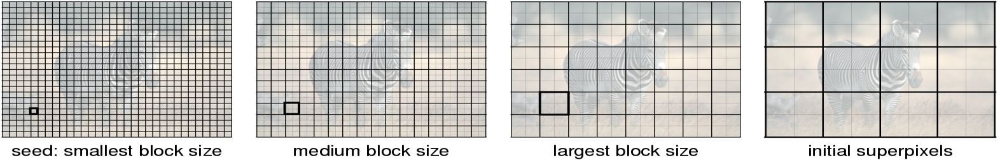
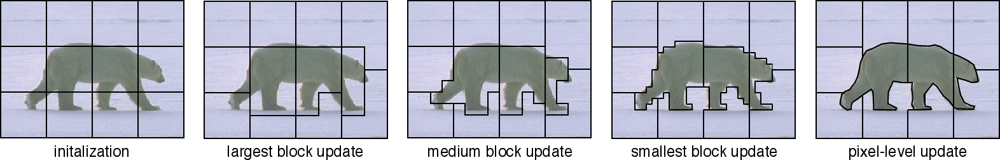
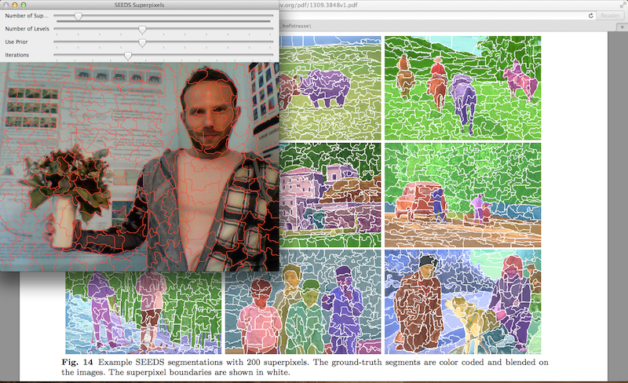

Superpixels
===========

SuperpixelSEEDS
---------------
.. ocv:class:: SuperpixelSEEDS : public Algorithm

Class implementing the SEEDS (Superpixels Extracted via Energy-Driven Sampling) superpixels algorithm described in [VBRV14]_. The algorithm uses an efficient hill-climbing algorithm to optimize the superpixels' energy function that is based on color histograms and a boundary term, which is optional. The energy function encourages superpixels to be of the same color, and if the boundary term is activated, the superpixels have smooth boundaries and are of similar shape. In practice it starts from a regular grid of superpixels and moves the pixels or blocks of pixels at the boundaries to refine the solution. The algorithm runs in real-time using a single CPU.

.. [VBRV14] Michael Van den Bergh, Xavier Boix, Gemma Roig, Luc Van Gool: SEEDS: Superpixels Extracted via Energy-Driven Sampling. International Journal of Computer Vision (IJCV), 2014.

.. highlight:: cpp

SuperpixelSEEDS::createSuperpixelSEEDS()
----------------------------------------
Initializes a SuperpixelSEEDS object.

.. ocv:function:: SuperpixelSEEDS::createSuperpixelSEEDS(int image_width, int image_height, int image_channels, int num_superpixels, int num_levels, int use_prior = 2, int histogram_bins=5, bool double_step = false)

.. ocv:pyfunction:: cv2.SuperpixelSEEDS.createSuperpixelSEEDS(image_width, image_height, image_channels, num_superpixels, num_levels, use_prior = 2, histogram_bins=5, double_step = false) -> <SuperpixelSEEDS object>

    :param image_width: Image width.

    :param image_height: Image height.

    :param image_channels: Number of channels of the image.

    :param num_superpixels: Desired number of superpixels. Note that the actual number may be smaller due to restrictions (depending on the image size and num_levels). Use getNumberOfSuperpixels() to get the actual number.

    :param num_levels: Number of block levels. The more levels, the more accurate is the segmentation, but needs more memory and CPU time.

    :param prior: enable 3x3 shape smoothing term if >0. A larger value leads to smoother shapes. prior must be in the range [0, 5].

    :param histogram_bins: Number of histogram bins.

    :param double_step:  If true, iterate each block level twice for higher accuracy.

The function initializes a SuperpixelSEEDS object for the input ``image``. It stores the parameters of the image: ``image_width``, ``image_height`` and ``image_channels``. It also sets the parameters of the SEEDS superpixel algorithm, which are: ``num_superpixels``, ``num_levels``, ``use_prior``, ``histogram_bins`` and ``double_step``.

The number of levels in ``num_levels`` defines the amount of block levels that the algorithm use in the optimization. The initialization is a grid, in which the superpixels are equally distributed through the width and the height of the image. The larger blocks correspond to the superpixel size, and the levels with smaller blocks are formed by dividing the larger blocks into 2 x 2 blocks of pixels, recursively until the smaller block level. An example of initialization of 4 block levels is illustrated in the following figure.

SuperpixelSEEDS::iterate()
--------------------------
Calculates the superpixel segmentation on a given image with the initialized parameters in the SuperpixelSEEDS object. This function can be called again for other images without the need of initializing the algorithm with createSuperpixelSEEDS(). This save the computational cost of allocating memory for all the structures of the algorithm.

.. ocv:function:: void SuperpixelSEEDS::iterate(InputArray img, int num_iterations=4)

.. ocv:pyfunction:: cv2.SuperpixelSEEDS.iterate(image, num_iterations)

    :param img: Input image. Supported formats: CV_8U, CV_16U, CV_32F. Image size & number of channels must match with the initialized image size & channels with the function createSuperpixelSEEDS().

    :param num_iterations:  Number of pixel level iterations. Higher number improves the result.

The function computes the superpixels segmentation of an image with the parameters initialized with the function createSuperpixelSEEDS(). The algorithms starts from a grid of superpixels and then refines the boundaries by proposing updates of blocks of pixels that lie at the boundaries from large to smaller size, finalizing with proposing pixel updates. An illustrative example can be seen below.

SuperpixelSEEDS::getNumberOfSuperpixels()
-----------------------------------------
Calculates the superpixel segmentation on a given image stored in SuperpixelSEEDS object.

.. ocv:function:: void SuperpixelSEEDS::getNumberOfSuperpixels(InputArray img, int num_iterations=4)

.. ocv:pyfunction:: cv2.SuperpixelSEEDS.getNumberOfSuperpixels(img, num_iterations=4)

    :param img: Input image. Supported formats: CV_8U, CV_16U, CV_32F image size & number of channels must match with the initialized image size & channels with the function createSuperpixelSEEDS().

    :param num_iterations:  Number of pixel level iterations. Higher number improves the result.

The function computes the superpixels segmentation of an image with the parameters initialized with the function createSuperpixelSEEDS().

SuperpixelSEEDS::getLabels()
----------------------------
Returns the segmentation labeling of the image. Each label represents a superpixel, and each pixel is assigned to one superpixel label.

.. ocv:function:: void SuperpixelSEEDS::getLabels(OutputArray labels_out)

.. ocv:pyfunction:: cv2.SuperpixelSEEDS.getLabels(labels_out)

    :param labels_out: Return: A CV_32UC1 integer array containing the labels of the superpixel segmentation. The labels are in the range [0, getNumberOfSuperpixels()].

The function returns an image with ssthe labels of the superpixel segmentation. The labels are in the range [0, getNumberOfSuperpixels()].

SuperpixelSEEDS::getLabelContourMask()
--------------------------------------
Returns the mask of the superpixel segmentation stored in SuperpixelSEEDS object.

.. ocv:function:: void SuperpixelSEEDS::getLabelContourMask(OutputArray image, bool thick_line = false)

.. ocv:pyfunction:: cv2.SuperpixelSEEDS.getLabelContourMask(image, thick_line = false)

    :param image: Return: CV_8UC1 image mask where -1 indicates that the pixel is a superpixel border, and 0 otherwise.

    :param thick_line:  If false, the border is only one pixel wide, otherwise all pixels at the border are masked.

The function return the boundaries of the superpixel segmentation.

.. note::

   * (Python) A demo on how to generate superpixels in images from the webcam can be found at opencv_source_code/samples/python2/seeds.py

   * (cpp) A demo on how to generate superpixels in images from the webcam can be found at opencv_source_code/samples/cpp/seeds.cpp. By adding a file image as a command line argument, the static image will be used instead of the webcam.

   * It will show a window with the video from the webcam with the superpixel boundaries marked in red (see below). At the top of the window there are 4 slides, from which the user can change on-the-fly the number of superpixels, the number of block levels, the strength of the boundary prior term to modify the shape, and the number of iterations at pixel level. This is useful to play with the parameters and set them to the user convenience. In the console the frame-rate of the algorithm is indicated.

