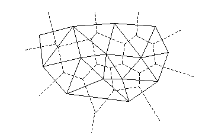

Planar Subdivisions (C API)
============================

.. highlight:: c

CvSubdiv2D
----------

.. ocv:struct:: CvSubdiv2D

Planar subdivision.

::

    #define CV_SUBDIV2D_FIELDS()    \
        CV_GRAPH_FIELDS()           \
        int  quad_edges;            \
        int  is_geometry_valid;     \
        CvSubdiv2DEdge recent_edge; \
        CvPoint2D32f  topleft;      \
        CvPoint2D32f  bottomright;
    
    typedef struct CvSubdiv2D
    {
        CV_SUBDIV2D_FIELDS()
    }
    CvSubdiv2D;

..

Planar subdivision is the subdivision of a plane into a set of
non-overlapped regions (facets) that cover the whole plane. The above
structure describes a subdivision built on a 2D point set, where the points
are linked together and form a planar graph, which, together with a few
edges connecting the exterior subdivision points (namely, convex hull points)
with infinity, subdivides a plane into facets by its edges.

For every subdivision, there is a dual subdivision in which facets and
points (subdivision vertices) swap their roles. This means that a facet is
treated as a vertex (called a virtual point below) of the dual subdivision and
the original subdivision vertices become facets. In the figure below, the
original subdivision is marked with solid lines and dual subdivision -
with dotted lines.

OpenCV subdivides a plane into triangles using the Delaunay's
algorithm. Subdivision is built iteratively starting from a dummy
triangle that includes all the subdivision points for sure. In this
case, the dual subdivision is a Voronoi diagram of the input 2D point set. The
subdivisions can be used for the 3D piece-wise transformation of a plane,
morphing, fast location of points on the plane, building special graphs
(such as NNG,RNG), and so forth.

CvQuadEdge2D
------------

.. ocv:struct:: CvQuadEdge2D

Quad-edge of a planar subdivision.

::

    /* one of edges within quad-edge, lower 2 bits is index (0..3)
       and upper bits are quad-edge pointer */
    typedef long CvSubdiv2DEdge;
    
    /* quad-edge structure fields */
    #define CV_QUADEDGE2D_FIELDS()     \
        int flags;                     \
        struct CvSubdiv2DPoint* pt[4]; \
        CvSubdiv2DEdge  next[4];
    
    typedef struct CvQuadEdge2D
    {
        CV_QUADEDGE2D_FIELDS()
    }
    CvQuadEdge2D;

..

Quad-edge is a basic element of a subdivision containing four edges (e, eRot, reversed e, and reversed eRot):

.. image:: pics/quadedge.png

CvSubdiv2DPoint
---------------

.. ocv:struct:: CvSubdiv2DPoint

Point of an original or dual subdivision.

::

    #define CV_SUBDIV2D_POINT_FIELDS()\
        int            flags;      \
        CvSubdiv2DEdge first;      \
        CvPoint2D32f   pt;         \
        int id;
    
    #define CV_SUBDIV2D_VIRTUAL_POINT_FLAG (1 << 30)
    
    typedef struct CvSubdiv2DPoint
    {
        CV_SUBDIV2D_POINT_FIELDS()
    }
    CvSubdiv2DPoint;

..

* id
    This integer can be used to index auxiliary data associated with each vertex of the planar subdivision.

CalcSubdivVoronoi2D
-------------------
Calculates the coordinates of the Voronoi diagram cells.

.. ocv:cfunction:: void cvCalcSubdivVoronoi2D(  CvSubdiv2D* subdiv )
.. ocv:pyoldfunction:: cv.CalcSubdivVoronoi2D(subdiv)-> None

    :param subdiv: Delaunay subdivision, in which all the points are already added.

The function calculates the coordinates
of virtual points. All virtual points corresponding to a vertex of the
original subdivision form (when connected together) a boundary of the Voronoi
cell at that point.

ClearSubdivVoronoi2D
--------------------
Removes all virtual points.

.. ocv:cfunction:: void cvClearSubdivVoronoi2D( CvSubdiv2D* subdiv )
.. ocv:pyoldfunction:: cv.ClearSubdivVoronoi2D(subdiv)-> None

    :param subdiv: Delaunay subdivision.

The function removes all of the virtual points. It
is called internally in 
:ocv:cfunc:`CalcSubdivVoronoi2D`
if the subdivision
was modified after the previous call to the function.

CreateSubdivDelaunay2D
----------------------
Creates an empty Delaunay triangulation.

.. ocv:cfunction:: CvSubdiv2D* cvCreateSubdivDelaunay2D(  CvRect rect, CvMemStorage* storage )
.. ocv:pyoldfunction:: cv.CreateSubdivDelaunay2D(rect, storage)-> emptyDelaunayTriangulation

    :param rect: Rectangle that includes all of the 2D points that are to be added to the subdivision.

    :param storage: Container for the subdivision.

The function creates an empty Delaunay
subdivision where 2D points can be added using the function
:ocv:cfunc:`SubdivDelaunay2DInsert`
. All of the points to be added must be within
the specified rectangle, otherwise a runtime error is raised.

Note that the triangulation is a single large triangle that covers the given rectangle.  Hence the three vertices of this triangle are outside the rectangle 
``rect``
.

FindNearestPoint2D
------------------
Finds the subdivision vertex closest to the given point.

.. ocv:cfunction:: CvSubdiv2DPoint* cvFindNearestPoint2D(  CvSubdiv2D* subdiv, CvPoint2D32f pt )
.. ocv:pyoldfunction:: cv.FindNearestPoint2D(subdiv, pt)-> point

    :param subdiv: Delaunay or another subdivision.

    :param pt: Input point.

The function is another function that
locates the input point within the subdivision. It finds the subdivision vertex that
is the closest to the input point. It is not necessarily one of vertices
of the facet containing the input point, though the facet (located using
:ocv:cfunc:`Subdiv2DLocate`
) is used as a starting
point. The function returns a pointer to the found subdivision vertex.

Subdiv2DEdgeDst
---------------
Returns the edge destination.

.. ocv:cfunction:: CvSubdiv2DPoint* cvSubdiv2DEdgeDst(  CvSubdiv2DEdge edge )
.. ocv:pyoldfunction:: cv.Subdiv2DEdgeDst(edge)-> point

    :param edge: Subdivision edge (not a quad-edge).

The function returns the edge destination. The
returned pointer may be NULL if the edge is from a dual subdivision and
the virtual point coordinates are not calculated yet. The virtual points
can be calculated using the function 
:ocv:cfunc:`CalcSubdivVoronoi2D`.

Subdiv2DGetEdge
---------------
Returns one of the edges related to the given edge.

.. ocv:cfunction:: CvSubdiv2DEdge  cvSubdiv2DGetEdge( CvSubdiv2DEdge edge, CvNextEdgeType type )
.. ocv:pyoldfunction:: cv.Subdiv2DGetEdge(edge, type)-> CvSubdiv2DEdge

    :param edge: Subdivision edge (not a quad-edge).

    :param type: Parameter specifying which of the related edges to return. The following values are possible:

        * **CV_NEXT_AROUND_ORG** next around the edge origin ( ``eOnext``  on the picture below if  ``e``  is the input edge)

        * **CV_NEXT_AROUND_DST** next around the edge vertex ( ``eDnext`` )

        * **CV_PREV_AROUND_ORG** previous around the edge origin (reversed  ``eRnext`` )

        * **CV_PREV_AROUND_DST** previous around the edge destination (reversed  ``eLnext`` )

        * **CV_NEXT_AROUND_LEFT** next around the left facet ( ``eLnext`` )

        * **CV_NEXT_AROUND_RIGHT** next around the right facet ( ``eRnext`` )

        * **CV_PREV_AROUND_LEFT** previous around the left facet (reversed  ``eOnext`` )

        * **CV_PREV_AROUND_RIGHT** previous around the right facet (reversed  ``eDnext`` )

.. image:: pics/quadedge.png

The function returns one of the edges related to the input edge.

Subdiv2DNextEdge
----------------
Returns next edge around the edge origin.

.. ocv:cfunction:: CvSubdiv2DEdge  cvSubdiv2DNextEdge( CvSubdiv2DEdge edge )
.. ocv:pyoldfunction:: cv.Subdiv2DNextEdge(edge)-> CvSubdiv2DEdge

    :param edge: Subdivision edge (not a quad-edge).

The function returns the next edge around the edge origin: 
``eOnext``
on the picture above if 
``e``
is the input edge).

Subdiv2DLocate
--------------
Returns the location of a point within a Delaunay triangulation.

.. ocv:cfunction:: CvSubdiv2DPointLocation  cvSubdiv2DLocate(  CvSubdiv2D* subdiv, CvPoint2D32f pt, CvSubdiv2DEdge* edge, CvSubdiv2DPoint** vertex=NULL )
.. ocv:pyoldfunction:: cv.Subdiv2DLocate(subdiv, pt) -> (loc, where)

    :param subdiv: Delaunay or another subdivision.

    :param pt: Point to locate.

    :param edge: Output edge that the point belongs to or is located to the right of it.

    :param vertex: Optional output vertex double pointer the input point coincides with.

The function locates the input point within the subdivision. There are five cases:

*
    The point falls into some facet. The function returns 
    ``CV_PTLOC_INSIDE``
    and 
    ``*edge``
    will contain one of edges of the facet.

*
    The point falls onto the edge. The function returns 
    ``CV_PTLOC_ON_EDGE``
    and 
    ``*edge``
    will contain this edge.

*
    The point coincides with one of the subdivision vertices. The function returns 
    ``CV_PTLOC_VERTEX``
    and 
    ``*vertex``
    will contain a pointer to the vertex.

*
    The point is outside the subdivision reference rectangle. The function returns 
    ``CV_PTLOC_OUTSIDE_RECT``
    and no pointers are filled.

*
    One of input arguments is invalid. A runtime error is raised or, if silent or "parent" error processing mode is selected, 
    ``CV_PTLOC_ERROR``
    is returnd.

Subdiv2DRotateEdge
------------------
Returns another edge of the same quad-edge.

.. ocv:cfunction:: CvSubdiv2DEdge  cvSubdiv2DRotateEdge(  CvSubdiv2DEdge edge, int rotate )
.. ocv:pyoldfunction:: cv.Subdiv2DRotateEdge(edge, rotate)-> CvSubdiv2DEdge

    :param edge: Subdivision edge (not a quad-edge).

    :param rotate: Parameter specifying which of the edges of the same quad-edge as the input one to return. The following values are possible:

            * **0** the input edge ( ``e``  on the picture below if  ``e``  is the input edge)

            * **1** the rotated edge ( ``eRot`` )

            * **2** the reversed edge (reversed  ``e``  (in green))

            * **3** the reversed rotated edge (reversed  ``eRot``  (in green))

The function returns one of the edges of the same quad-edge as the input edge.

SubdivDelaunay2DInsert
----------------------
Inserts a single point into a Delaunay triangulation.

.. ocv:cfunction:: CvSubdiv2DPoint*  cvSubdivDelaunay2DInsert(  CvSubdiv2D* subdiv, CvPoint2D32f pt)
.. ocv:pyoldfunction:: cv.SubdivDelaunay2DInsert(subdiv, pt)-> point

    :param subdiv: Delaunay subdivision created by the function  :ocv:cfunc:`CreateSubdivDelaunay2D`.

    :param pt: Inserted point.

The function inserts a single point into a subdivision and modifies the subdivision topology appropriately. If a point with the same coordinates exists already, no new point is added. The function returns a pointer to the allocated point. No virtual point coordinates are calculated at this stage.

