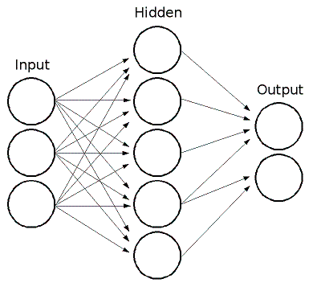
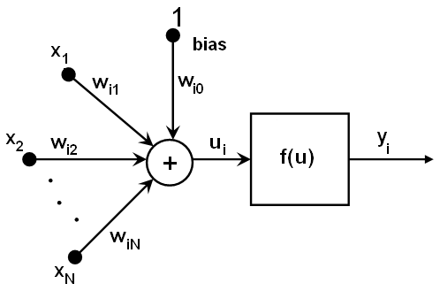

Neural Networks
===============

.. highlight:: cpp

ML implements feed-forward artificial neural networks or, more particularly, multi-layer perceptrons (MLP), the most commonly used type of neural networks. MLP consists of the input layer, output layer, and one or more hidden layers. Each layer of MLP includes one or more neurons directionally linked with the neurons from the previous and the next layer. The example below represents a 3-layer perceptron with three inputs, two outputs, and the hidden layer including five neurons:

All the neurons in MLP are similar. Each of them has several input links (it takes the output values from several neurons in the previous layer as input) and several output links (it passes the response to several neurons in the next layer). The values retrieved from the previous layer are summed up with certain weights, individual for each neuron, plus the bias term. The sum is transformed using the activation function
:math:`f` that may be also different for different neurons. 

In other words, given the outputs
:math:`x_j` of the layer
:math:`n` , the outputs
:math:`y_i` of the layer
:math:`n+1` are computed as:

.. math::

    u_i =  \sum _j (w^{n+1}_{i,j}*x_j) + w^{n+1}_{i,bias}

.. math::

    y_i = f(u_i)

Different activation functions may be used. ML implements three standard functions:

*
    Identity function ( ``CvANN_MLP::IDENTITY``     ):
    :math:`f(x)=x`
*
    Symmetrical sigmoid ( ``CvANN_MLP::SIGMOID_SYM``     ):
    :math:`f(x)=\beta*(1-e^{-\alpha x})/(1+e^{-\alpha x}`     ), which is the default choice for MLP. The standard sigmoid with
    :math:`\beta =1, \alpha =1`     is shown below:

    .. image:: pics/sigmoid_bipolar.png

*
    Gaussian function ( ``CvANN_MLP::GAUSSIAN``     ):
    :math:`f(x)=\beta e^{-\alpha x*x}`     , which is not completely supported at the moment.

In ML, all the neurons have the same activation functions, with the same free parameters (
:math:`\alpha, \beta` ) that are specified by user and are not altered by the training algorithms.

So, the whole trained network works as follows: 

#. Take the feature vector as input. The vector size is equal to the size of the input layer.

#. Pass values as input to the first hidden layer.

#. Compute outputs of the hidden layer using the weights and the activation functions.

#. Pass outputs further downstream until you compute the output layer.

So, to compute the network, you need to know all the
weights
:math:`w^{n+1)}_{i,j}` . The weights are computed by the training
algorithm. The algorithm takes a training set, multiple input vectors
with the corresponding output vectors, and iteratively adjusts the
weights to enable the network to give the desired response to the
provided input vectors.

The larger the network size (the number of hidden layers and their sizes) is,
the more the potential network flexibility is. The error on the
training set could be made arbitrarily small. But at the same time the
learned network also "learns" the noise present in the training set,
so the error on the test set usually starts increasing after the network
size reaches a limit. Besides, the larger networks are trained much
longer than the smaller ones, so it is reasonable to pre-process the data,
using
:ocv:func:`PCA::operator ()` or similar technique, and train a smaller network
on only essential features.

Another MPL feature is an inability to handle categorical
data as is. However, there is a workaround. If a certain feature in the
input or output (in case of ``n`` -class classifier for
:math:`n>2` ) layer is categorical and can take
:math:`M>2` different values, it makes sense to represent it as a binary tuple of ``M`` elements, where the ``i`` -th element is 1 if and only if the
feature is equal to the ``i`` -th value out of ``M`` possible. It
increases the size of the input/output layer but speeds up the
training algorithm convergence and at the same time enables "fuzzy" values
of such variables, that is, a tuple of probabilities instead of a fixed value.

ML implements two algorithms for training MLP's. The first algorithm is a classical
random sequential back-propagation algorithm.
The second (default) one is a batch RPROP algorithm.

References:

*
    http://en.wikipedia.org/wiki/Backpropagation
    . Wikipedia article about the back-propagation algorithm.

*
    Y. LeCun, L. Bottou, G.B. Orr and K.-R. Muller, *Efficient backprop*, in Neural Networks---Tricks of the Trade, Springer Lecture Notes in Computer Sciences 1524, pp.5-50, 1998.

.. _RPROP93:

*
    [RPROP93] M. Riedmiller and H. Braun, *A Direct Adaptive Method for Faster Backpropagation Learning: The RPROP Algorithm*, Proc. ICNN, San Francisco (1993).

CvANN_MLP_TrainParams
---------------------
.. ocv:class:: CvANN_MLP_TrainParams

Parameters of the MLP training algorithm. You can initialize the structure by a constructor or the individual parameters can be adjusted after the structure is created.

The back-propagation algorithm parameters:

.. ocv:member:: double bp_dw_scale

    Strength of the weight gradient term. The recommended value is about 0.1.

.. ocv:member:: double bp_moment_scale

    Strength of the momentum term (the difference between weights on the 2 previous iterations). This parameter provides some inertia to smooth the random fluctuations of the weights. It can vary from 0 (the feature is disabled) to 1 and beyond. The value 0.1 or so is good enough

The RPROP algorithm parameters (see :ref:`[RPROP93] <RPROP93>` for details):

.. ocv:member:: double rp_dw0

    Initial value :math:`\Delta_0` of update-values :math:`\Delta_{ij}`.

.. ocv:member:: double rp_dw_plus

    Increase factor :math:`\eta^+`. It must be >1.

.. ocv:member:: double rp_dw_minus

    Decrease factor :math:`\eta^-`. It must be <1.

.. ocv:member:: double rp_dw_min

    Update-values lower limit :math:`\Delta_{min}`. It must be positive.

.. ocv:member:: double rp_dw_max

    Update-values upper limit :math:`\Delta_{max}`. It must be >1.

CvANN_MLP_TrainParams::CvANN_MLP_TrainParams
--------------------------------------------
The constructors.

.. ocv:function:: CvANN_MLP_TrainParams::CvANN_MLP_TrainParams()

.. ocv:function:: CvANN_MLP_TrainParams::CvANN_MLP_TrainParams( CvTermCriteria term_crit, int train_method, double param1, double param2=0 )

    :param term_crit: Termination criteria of the training algorithm. You can specify the maximum number of iterations (``max_iter``) and/or how much the error could change between the iterations to make the algorithm continue (``epsilon``).

    :param train_method: Training method of the MLP. Possible values are:

        * **CvANN_MLP_TrainParams::BACKPROP** The back-propagation algorithm.

        * **CvANN_MLP_TrainParams::RPROP** The RPROP algorithm.

    :param param1: Parameter of the training method. It is ``rp_dw0`` for ``RPROP`` and ``bp_dw_scale`` for ``BACKPROP``.

    :param param2: Parameter of the training method. It is ``rp_dw_min`` for ``RPROP`` and ``bp_moment_scale`` for ``BACKPROP``.

By default the RPROP algorithm is used:

::

    CvANN_MLP_TrainParams::CvANN_MLP_TrainParams()
    {
        term_crit = cvTermCriteria( CV_TERMCRIT_ITER + CV_TERMCRIT_EPS, 1000, 0.01 );
        train_method = RPROP;
        bp_dw_scale = bp_moment_scale = 0.1;
        rp_dw0 = 0.1; rp_dw_plus = 1.2; rp_dw_minus = 0.5;
        rp_dw_min = FLT_EPSILON; rp_dw_max = 50.;
    }

CvANN_MLP
---------
.. ocv:class:: CvANN_MLP

MLP model.   

Unlike many other models in ML that are constructed and trained at once, in the MLP model these steps are separated. First, a network with the specified topology is created using the non-default constructor or the method :ocv:func:`CvANN_MLP::create`. All the weights are set to zeros. Then, the network is trained using a set of input and output vectors. The training procedure can be repeated more than once, that is, the weights can be adjusted based on the new training data.

CvANN_MLP::CvANN_MLP
--------------------
The constructors.

.. ocv:function:: CvANN_MLP::CvANN_MLP()

.. ocv:cfunction:: CvANN_MLP::CvANN_MLP( const CvMat* layerSizes, int activateFunc=CvANN_MLP::SIGMOID_SYM, double fparam1=0, double fparam2=0 )

The advanced constructor allows to create MLP with the specified topology. See :ocv:func:`CvANN_MLP::create` for details.

CvANN_MLP::create
-----------------
Constructs MLP with the specified topology.

.. ocv:function:: void CvANN_MLP::create( const Mat& layerSizes, int activateFunc=CvANN_MLP::SIGMOID_SYM, double fparam1=0, double fparam2=0 )

.. ocv:cfunction:: void CvANN_MLP::create( const CvMat* layerSizes, int activateFunc=CvANN_MLP::SIGMOID_SYM, double fparam1=0, double fparam2=0 )

    :param layerSizes: Integer vector specifying the number of neurons in each layer including the input and output layers.

    :param activateFunc: Parameter specifying the activation function for each neuron: one of  ``CvANN_MLP::IDENTITY``, ``CvANN_MLP::SIGMOID_SYM``, and ``CvANN_MLP::GAUSSIAN``.

    :param fparam1/fparam2: Free parameters of the activation function, :math:`\alpha` and :math:`\beta`, respectively. See the formulas in the introduction section.

The method creates an MLP network with the specified topology and assigns the same activation function to all the neurons.

CvANN_MLP::train
----------------
Trains/updates MLP.

.. ocv:function:: int CvANN_MLP::train( const Mat& inputs, const Mat& outputs, const Mat& sampleWeights, const Mat& sampleIdx=Mat(), CvANN_MLP_TrainParams params = CvANN_MLP_TrainParams(), int flags=0 )

.. ocv:cfunction:: int CvANN_MLP::train( const CvMat* inputs, const CvMat* outputs, const CvMat* sampleWeights, const CvMat* sampleIdx=0, CvANN_MLP_TrainParams params = CvANN_MLP_TrainParams(), int flags=0 )

    :param inputs: Floating-point matrix of input vectors, one vector per row.

    :param outputs: Floating-point matrix of the corresponding output vectors, one vector per row.

    :param sampleWeights: (RPROP only) Optional floating-point vector of weights for each sample. Some samples may be more important than others for training. You may want to raise the weight of certain classes to find the right balance between hit-rate and false-alarm rate, and so on.

    :param sampleIdx: Optional integer vector indicating the samples (rows of ``inputs`` and ``outputs``) that are taken into account.

    :param params: Training parameters. See the :ocv:class:`CvANN_MLP_TrainParams` description.

    :param flags: Various parameters to control the training algorithm. A combination of the following parameters is possible:

            * **UPDATE_WEIGHTS** Algorithm updates the network weights, rather than computes them from scratch. In the latter case the weights are initialized using the Nguyen-Widrow algorithm.

            * **NO_INPUT_SCALE** Algorithm does not normalize the input vectors. If this flag is not set, the training algorithm normalizes each input feature independently, shifting its mean value to 0 and making the standard deviation equal to 1. If the network is assumed to be updated frequently, the new training data could be much different from original one. In this case, you should take care of proper normalization.

            * **NO_OUTPUT_SCALE** Algorithm does not normalize the output vectors. If the flag is not set, the training algorithm normalizes each output feature independently, by transforming it to the certain range depending on the used activation function.

This method applies the specified training algorithm to computing/adjusting the network weights. It returns the number of done iterations.

CvANN_MLP::predict
------------------
Predicts responses for input samples.

.. ocv:function:: float CvANN_MLP::predict( const Mat& inputs, Mat& outputs ) const

.. ocv:cfunction:: float CvANN_MLP::predict( const CvMat* inputs, CvMat* outputs ) const

    :param inputs: Input samples.

    :param outputs: Predicted responses for corresponding samples.

The method returns a dummy value which should be ignored.

CvANN_MLP::get_layer_count
--------------------------
Returns the number of layers in the MLP.

.. ocv:function:: int CvANN_MLP::get_layer_count()

CvANN_MLP::get_layer_sizes
--------------------------
Returns numbers of neurons in each layer of the MLP.

.. ocv:cfunction:: const CvMat* CvANN_MLP::get_layer_sizes()

The method returns the integer vector specifying the number of neurons in each layer including the input and output layers of the MLP.

CvANN_MLP::get_weights
----------------------
Returns neurons weights of the particular layer.

.. ocv:function:: double* CvANN_MLP::get_weights(int layer)

    :param layer: Index of the particular layer.
