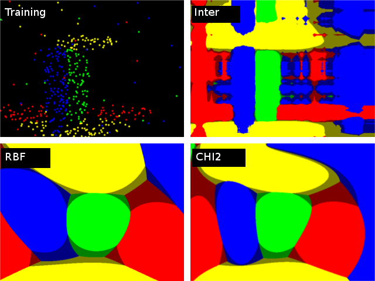

Support Vector Machines
=======================

.. highlight:: cpp

Originally, support vector machines (SVM) was a technique for building an optimal binary (2-class) classifier. Later the technique was extended to regression and clustering problems. SVM is a partial case of kernel-based methods. It maps feature vectors into a higher-dimensional space using a kernel function and builds an optimal linear discriminating function in this space or an optimal hyper-plane that fits into the training data. In case of SVM, the kernel is not defined explicitly. Instead, a distance between any 2 points in the hyper-space needs to be defined.

The solution is optimal, which means that the margin between the separating hyper-plane and the nearest feature vectors from both classes (in case of 2-class classifier) is maximal. The feature vectors that are the closest to the hyper-plane are called *support vectors*, which means that the position of other vectors does not affect the hyper-plane (the decision function).

SVM implementation in OpenCV is based on [LibSVM]_.

.. [Burges98] C. Burges. *A tutorial on support vector machines for pattern recognition*, Knowledge Discovery and Data Mining 2(2), 1998 (available online at http://citeseer.ist.psu.edu/burges98tutorial.html)

.. [LibSVM] C.-C. Chang and C.-J. Lin. *LIBSVM: a library for support vector machines*, ACM Transactions on Intelligent Systems and Technology, 2:27:1--27:27, 2011. (http://www.csie.ntu.edu.tw/~cjlin/papers/libsvm.pdf)

ParamGrid
-----------
.. ocv:class:: ParamGrid

  The structure represents the logarithmic grid range of statmodel parameters. It is used for optimizing statmodel accuracy by varying model parameters, the accuracy estimate being computed by cross-validation.

  .. ocv:member:: double ParamGrid::minVal

     Minimum value of the statmodel parameter.

  .. ocv:member:: double ParamGrid::maxVal

     Maximum value of the statmodel parameter.

  .. ocv:member:: double ParamGrid::logStep

     Logarithmic step for iterating the statmodel parameter.

The grid determines the following iteration sequence of the statmodel parameter values:

.. math::

    (minVal, minVal*step, minVal*{step}^2, \dots,  minVal*{logStep}^n),

where :math:`n` is the maximal index satisfying

.. math::

    \texttt{minVal} * \texttt{logStep} ^n <  \texttt{maxVal}

The grid is logarithmic, so ``logStep`` must always be greater then 1.

ParamGrid::ParamGrid
------------------------
The constructors.

.. ocv:function:: ParamGrid::ParamGrid()

.. ocv:function:: ParamGrid::ParamGrid( double minVal, double maxVal, double logStep )

The full constructor initializes corresponding members. The default constructor creates a dummy grid:

::

    ParamGrid::ParamGrid()
    {
        minVal = maxVal = 0;
        logStep = 1;
    }

SVM::Params
-----------
.. ocv:class:: SVM::Params

SVM training parameters.

The structure must be initialized and passed to the training method of :ocv:class:`SVM`.

SVM::Params::Params
------------------------
The constructors

.. ocv:function:: SVM::Params::Params()

.. ocv:function:: SVM::Params::Params( int svmType, int kernelType, double degree, double gamma, double coef0, double Cvalue, double nu, double p, const Mat& classWeights, TermCriteria termCrit )

    :param svmType: Type of a SVM formulation. Possible values are:

        * **SVM::C_SVC** C-Support Vector Classification. ``n``-class classification (``n`` :math:`\geq` 2), allows imperfect separation of classes with penalty multiplier ``C`` for outliers.

        * **SVM::NU_SVC** :math:`\nu`-Support Vector Classification. ``n``-class classification with possible imperfect separation. Parameter :math:`\nu`  (in the range 0..1, the larger the value, the smoother the decision boundary) is used instead of ``C``.

        * **SVM::ONE_CLASS** Distribution Estimation (One-class SVM). All the training data are from the same class, SVM builds a boundary that separates the class from the rest of the feature space.

        * **SVM::EPS_SVR** :math:`\epsilon`-Support Vector Regression. The distance between feature vectors from the training set and the fitting hyper-plane must be less than ``p``. For outliers the penalty multiplier ``C`` is used.

        * **SVM::NU_SVR** :math:`\nu`-Support Vector Regression. :math:`\nu` is used instead of ``p``.

        See [LibSVM]_ for details.

    :param kernelType: Type of a SVM kernel. Possible values are:

        * **SVM::LINEAR** Linear kernel. No mapping is done, linear discrimination (or regression) is done in the original feature space. It is the fastest option. :math:`K(x_i, x_j) = x_i^T x_j`.

        * **SVM::POLY** Polynomial kernel: :math:`K(x_i, x_j) = (\gamma x_i^T x_j + coef0)^{degree}, \gamma > 0`.

        * **SVM::RBF** Radial basis function (RBF), a good choice in most cases. :math:`K(x_i, x_j) = e^{-\gamma ||x_i - x_j||^2}, \gamma > 0`.

        * **SVM::SIGMOID** Sigmoid kernel: :math:`K(x_i, x_j) = \tanh(\gamma x_i^T x_j + coef0)`.

        * **SVM::CHI2** Exponential Chi2 kernel, similar to the RBF kernel: :math:`K(x_i, x_j) = e^{-\gamma \chi^2(x_i,x_j)}, \chi^2(x_i,x_j) = (x_i-x_j)^2/(x_i+x_j), \gamma > 0`.

        * **SVM::INTER** Histogram intersection kernel. A fast kernel. :math:`K(x_i, x_j) = min(x_i,x_j)`.

    :param degree: Parameter ``degree`` of a kernel function (POLY).

    :param gamma: Parameter :math:`\gamma` of a kernel function (POLY / RBF / SIGMOID / CHI2).

    :param coef0: Parameter ``coef0`` of a kernel function (POLY / SIGMOID).

    :param Cvalue: Parameter ``C`` of a SVM optimization problem (C_SVC / EPS_SVR / NU_SVR).

    :param nu: Parameter :math:`\nu` of a SVM optimization problem (NU_SVC / ONE_CLASS / NU_SVR).

    :param p: Parameter :math:`\epsilon` of a SVM optimization problem (EPS_SVR).

    :param classWeights: Optional weights in the C_SVC problem , assigned to particular classes. They are multiplied by ``C`` so the parameter ``C`` of class ``#i`` becomes ``classWeights(i) * C``. Thus these weights affect the misclassification penalty for different classes. The larger weight, the larger penalty on misclassification of data from the corresponding class.

    :param termCrit: Termination criteria of the iterative SVM training procedure which solves a partial case of constrained quadratic optimization problem. You can specify tolerance and/or the maximum number of iterations.

The default constructor initialize the structure with following values:

::

    SVMParams::SVMParams() :
        svmType(SVM::C_SVC), kernelType(SVM::RBF), degree(0),
        gamma(1), coef0(0), C(1), nu(0), p(0), classWeights(0)
    {
        termCrit = TermCriteria( TermCriteria::MAX_ITER+TermCriteria::EPS, 1000, FLT_EPSILON );
    }

A comparison of different kernels on the following 2D test case with four classes. Four C_SVC SVMs have been trained (one against rest) with auto_train. Evaluation on three different kernels (CHI2, INTER, RBF). The color depicts the class with max score. Bright means max-score > 0, dark means max-score < 0.

SVM
-----
.. ocv:class:: SVM : public StatModel

Support Vector Machines.

.. note::

   * (Python) An example of digit recognition using SVM can be found at opencv_source/samples/python2/digits.py
   * (Python) An example of grid search digit recognition using SVM can be found at opencv_source/samples/python2/digits_adjust.py
   * (Python) An example of video digit recognition using SVM can be found at opencv_source/samples/python2/digits_video.py

SVM::create
------------
Creates empty model

.. ocv:function:: Ptr<SVM> SVM::create(const Params& p=Params(), const Ptr<Kernel>& customKernel=Ptr<Kernel>())

    :param p: SVM parameters
    :param customKernel: the optional custom kernel to use. It must implement ``SVM::Kernel`` interface.

Use ``StatModel::train`` to train the model, ``StatModel::train<RTrees>(traindata, params)`` to create and train the model, ``StatModel::load<RTrees>(filename)`` to load the pre-trained model. Since SVM has several parameters, you may want to find the best parameters for your problem. It can be done with ``SVM::trainAuto``.

SVM::trainAuto
-----------------
Trains an SVM with optimal parameters.

.. ocv:function:: bool SVM::trainAuto( const Ptr<TrainData>& data, int kFold = 10, ParamGrid Cgrid = SVM::getDefaultGrid(SVM::C), ParamGrid gammaGrid  = SVM::getDefaultGrid(SVM::GAMMA), ParamGrid pGrid = SVM::getDefaultGrid(SVM::P), ParamGrid nuGrid = SVM::getDefaultGrid(SVM::NU), ParamGrid coeffGrid = SVM::getDefaultGrid(SVM::COEF), ParamGrid degreeGrid = SVM::getDefaultGrid(SVM::DEGREE), bool balanced=false)

    :param data: the training data that can be constructed using ``TrainData::create`` or ``TrainData::loadFromCSV``.

    :param kFold: Cross-validation parameter. The training set is divided into ``kFold`` subsets. One subset is used to test the model, the others form the train set. So, the SVM algorithm is executed ``kFold`` times.

    :param \*Grid: Iteration grid for the corresponding SVM parameter.

    :param balanced: If ``true`` and the problem is 2-class classification then the method creates more balanced cross-validation subsets that is proportions between classes in subsets are close to such proportion in the whole train dataset.

The method trains the SVM model automatically by choosing the optimal
parameters ``C``, ``gamma``, ``p``, ``nu``, ``coef0``, ``degree`` from
``SVM::Params``. Parameters are considered optimal
when the cross-validation estimate of the test set error
is minimal.

If there is no need to optimize a parameter, the corresponding grid step should be set to any value less than or equal to 1. For example, to avoid optimization in ``gamma``, set ``gammaGrid.step = 0``, ``gammaGrid.minVal``, ``gamma_grid.maxVal`` as arbitrary numbers. In this case, the value ``params.gamma`` is taken for ``gamma``.

And, finally, if the optimization in a parameter is required but
the corresponding grid is unknown, you may call the function :ocv:func:`SVM::getDefaulltGrid`. To generate a grid, for example, for ``gamma``, call ``SVM::getDefaulltGrid(SVM::GAMMA)``.

This function works for the classification
(``params.svmType=SVM::C_SVC`` or ``params.svmType=SVM::NU_SVC``)
as well as for the regression
(``params.svmType=SVM::EPS_SVR`` or ``params.svmType=SVM::NU_SVR``). If ``params.svmType=SVM::ONE_CLASS``, no optimization is made and the usual SVM with parameters specified in ``params`` is executed.

SVM::getDefaulltGrid
-----------------------
Generates a grid for SVM parameters.

.. ocv:function:: ParamGrid SVM::getDefaulltGrid( int param_id )

    :param param_id: SVM parameters IDs that must be one of the following:

            * **SVM::C**

            * **SVM::GAMMA**

            * **SVM::P**

            * **SVM::NU**

            * **SVM::COEF**

            * **SVM::DEGREE**

        The grid is generated for the parameter with this ID.

The function generates a grid for the specified parameter of the SVM algorithm. The grid may be passed to the function :ocv:func:`SVM::trainAuto`.

SVM::getParams
-----------------
Returns the current SVM parameters.

.. ocv:function:: SVM::Params SVM::getParams() const

This function may be used to get the optimal parameters obtained while automatically training ``SVM::trainAuto``.

SVM::getSupportVectors
--------------------------
Retrieves all the support vectors

.. ocv:function:: Mat SVM::getSupportVectors() const

The method returns all the support vector as floating-point matrix, where support vectors are stored as matrix rows.

SVM::getDecisionFunction
--------------------------
Retrieves the decision function

.. ocv:function:: double SVM::getDecisionFunction(int i, OutputArray alpha, OutputArray svidx) const

    :param i: the index of the decision function. If the problem solved is regression, 1-class or 2-class classification, then there will be just one decision function and the index should always be 0. Otherwise, in the case of N-class classification, there will be N*(N-1)/2 decision functions.

    :param alpha: the optional output vector for weights, corresponding to different support vectors. In the case of linear SVM all the alpha's will be 1's.

    :param svidx: the optional output vector of indices of support vectors within the matrix of support vectors (which can be retrieved by ``SVM::getSupportVectors``). In the case of linear SVM each decision function consists of a single "compressed" support vector.

The method returns ``rho`` parameter of the decision function, a scalar subtracted from the weighted sum of kernel responses.

Prediction with SVM
--------------------

StatModel::predict(samples, results, flags) should be used. Pass ``flags=StatModel::RAW_OUTPUT`` to get the raw response from SVM (in the case of regression, 1-class or 2-class classification problem).
