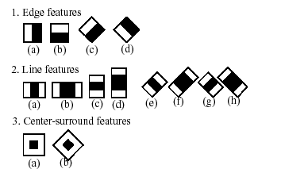

Cascade Classification
======================

.. highlight:: cpp

Haar Feature-based Cascade Classifier for Object Detection
----------------------------------------------------------

The object detector described below has been initially proposed by Paul Viola [Viola01]_ and improved by Rainer Lienhart [Lienhart02]_.

First, a classifier (namely a *cascade of boosted classifiers working with haar-like features*) is trained with a few hundred sample views of a particular object (i.e., a face or a car), called positive examples, that are scaled to the same size (say, 20x20), and negative examples - arbitrary images of the same size.

After a classifier is trained, it can be applied to a region of interest (of the same size as used during the training) in an input image. The classifier outputs a "1" if the region is likely to show the object (i.e., face/car), and "0" otherwise. To search for the object in the whole image one can move the search window across the image and check every location using the classifier. The classifier is designed so that it can be easily "resized" in order to be able to find the objects of interest at different sizes, which is more efficient than resizing the image itself. So, to find an object of an unknown size in the image the scan procedure should be done several times at different scales.

The word "cascade" in the classifier name means that the resultant classifier consists of several simpler classifiers (*stages*) that are applied subsequently to a region of interest until at some stage the candidate is rejected or all the stages are passed. The word "boosted" means that the classifiers at every stage of the cascade are complex themselves and they are built out of basic classifiers using one of four different ``boosting`` techniques (weighted voting). Currently Discrete Adaboost, Real Adaboost, Gentle Adaboost and Logitboost are supported. The basic classifiers are decision-tree classifiers with at least 2 leaves. Haar-like features are the input to the basic classifiers, and are calculated as described below. The current algorithm uses the following Haar-like features:

The feature used in a particular classifier is specified by its shape (1a, 2b etc.), position within the region of interest and the scale (this scale is not the same as the scale used at the detection stage, though these two scales are multiplied). For example, in the case of the third line feature (2c) the response is calculated as the difference between the sum of image pixels under the rectangle covering the whole feature (including the two white stripes and the black stripe in the middle) and the sum of the image pixels under the black stripe multiplied by 3 in order to compensate for the differences in the size of areas. The sums of pixel values over a rectangular regions are calculated rapidly using integral images (see below and the :ocv:func:`integral` description).

To see the object detector at work, have a look at the facedetect demo:
http://code.opencv.org/projects/opencv/repository/revisions/master/entry/samples/cpp/dbt_face_detection.cpp

The following reference is for the detection part only. There is a separate application called  ``opencv_traincascade`` that can train a cascade of boosted classifiers from a set of samples.

.. note:: In the new C++ interface it is also possible to use LBP (local binary pattern) features in addition to Haar-like features.

.. [Viola01] Paul Viola and Michael J. Jones. Rapid Object Detection using a Boosted Cascade of Simple Features. IEEE CVPR, 2001. The paper is available online at http://research.microsoft.com/en-us/um/people/viola/Pubs/Detect/violaJones_CVPR2001.pdf

.. [Lienhart02] Rainer Lienhart and Jochen Maydt. An Extended Set of Haar-like Features for Rapid Object Detection. IEEE ICIP 2002, Vol. 1, pp. 900-903, Sep. 2002. This paper, as well as the extended technical report, can be retrieved at http://www.multimedia-computing.de/mediawiki//images/5/52/MRL-TR-May02-revised-Dec02.pdf

FeatureEvaluator
----------------
.. ocv:class:: FeatureEvaluator

Base class for computing feature values in cascade classifiers. ::

    class CV_EXPORTS FeatureEvaluator
    {
    public:
        enum { HAAR = 0, LBP = 1 }; // supported feature types
        virtual ~FeatureEvaluator(); // destructor
        virtual bool read(const FileNode& node);
        virtual Ptr<FeatureEvaluator> clone() const;
        virtual int getFeatureType() const;

        virtual bool setImage(const Mat& img, Size origWinSize);
        virtual bool setWindow(Point p);

        virtual double calcOrd(int featureIdx) const;
        virtual int calcCat(int featureIdx) const;

        static Ptr<FeatureEvaluator> create(int type);
    };

FeatureEvaluator::read
--------------------------
Reads parameters of features from the ``FileStorage`` node.

.. ocv:function:: bool FeatureEvaluator::read(const FileNode& node)

    :param node: File node from which the feature parameters are read.

FeatureEvaluator::clone
---------------------------
Returns a full copy of the feature evaluator.

.. ocv:function:: Ptr<FeatureEvaluator> FeatureEvaluator::clone() const

FeatureEvaluator::getFeatureType
------------------------------------
Returns the feature type (``HAAR`` or ``LBP`` for now).

.. ocv:function:: int FeatureEvaluator::getFeatureType() const

FeatureEvaluator::setImage
------------------------------
Assigns an image to feature evaluator.

.. ocv:function:: bool FeatureEvaluator::setImage(const Mat& img, Size origWinSize)

    :param img: Matrix of the type   ``CV_8UC1``  containing an image where the features are computed.

    :param origWinSize: Size of training images.

The method assigns an image, where the features will be computed, to the feature evaluator.

FeatureEvaluator::setWindow
-------------------------------
Assigns a window in the current image where the features will be computed.

.. ocv:function:: bool FeatureEvaluator::setWindow(Point p)

    :param p: Upper left point of the window where the features are computed. Size of the window is equal to the size of training images.

FeatureEvaluator::calcOrd
-----------------------------
Computes the value of an ordered (numerical) feature.

.. ocv:function:: double FeatureEvaluator::calcOrd(int featureIdx) const

    :param featureIdx: Index of the feature whose value is computed.

The function returns the computed value of an ordered feature.

FeatureEvaluator::calcCat
-----------------------------
Computes the value of a categorical feature.

.. ocv:function:: int FeatureEvaluator::calcCat(int featureIdx) const

    :param featureIdx: Index of the feature whose value is computed.

The function returns the computed label of a categorical feature, which is the value from [0,... (number of categories - 1)].

FeatureEvaluator::create
----------------------------
Constructs the feature evaluator.

.. ocv:function:: Ptr<FeatureEvaluator> FeatureEvaluator::create(int type)

    :param type: Type of features evaluated by cascade (``HAAR`` or ``LBP`` for now).

CascadeClassifier
-----------------
.. ocv:class:: CascadeClassifier

Cascade classifier class for object detection.

CascadeClassifier::CascadeClassifier
----------------------------------------
Loads a classifier from a file.

.. ocv:function:: CascadeClassifier::CascadeClassifier(const String& filename)

.. ocv:pyfunction:: cv2.CascadeClassifier([filename]) -> <CascadeClassifier object>

    :param filename: Name of the file from which the classifier is loaded.

CascadeClassifier::empty
----------------------------
Checks whether the classifier has been loaded.

.. ocv:function:: bool CascadeClassifier::empty() const

.. ocv:pyfunction:: cv2.CascadeClassifier.empty() -> retval

CascadeClassifier::load
---------------------------
Loads a classifier from a file.

.. ocv:function:: bool CascadeClassifier::load(const String& filename)

.. ocv:pyfunction:: cv2.CascadeClassifier.load(filename) -> retval

    :param filename: Name of the file from which the classifier is loaded. The file may contain an old HAAR classifier trained by the haartraining application or a new cascade classifier trained by the traincascade application.

CascadeClassifier::read
---------------------------
Reads a classifier from a FileStorage node.

.. ocv:function:: bool CascadeClassifier::read(const FileNode& node)

.. note:: The file may contain a new cascade classifier (trained traincascade application) only.

CascadeClassifier::detectMultiScale
---------------------------------------
Detects objects of different sizes in the input image. The detected objects are returned as a list of rectangles.

.. ocv:function:: void CascadeClassifier::detectMultiScale( const Mat& image, vector<Rect>& objects, double scaleFactor=1.1, int minNeighbors=3, int flags=0, Size minSize=Size(), Size maxSize=Size())
.. ocv:function:: void CascadeClassifier::detectMultiScale( const Mat& image, vector<Rect>& objects, vector<int>& numDetections, double scaleFactor=1.1, int minNeighbors=3, int flags=0, Size minSize=Size(), Size maxSize=Size())

.. ocv:pyfunction:: cv2.CascadeClassifier.detectMultiScale(image[, scaleFactor[, minNeighbors[, flags[, minSize[, maxSize]]]]]) -> objects
.. ocv:pyfunction:: cv2.CascadeClassifier.detectMultiScale(image[, scaleFactor[, minNeighbors[, flags[, minSize[, maxSize[, outputRejectLevels]]]]]]) -> objects, rejectLevels, levelWeights

.. ocv:cfunction:: CvSeq* cvHaarDetectObjects( const CvArr* image, CvHaarClassifierCascade* cascade, CvMemStorage* storage, double scale_factor=1.1, int min_neighbors=3, int flags=0, CvSize min_size=cvSize(0,0), CvSize max_size=cvSize(0,0) )

    :param cascade: Haar classifier cascade (OpenCV 1.x API only). It can be loaded from XML or YAML file using :ocv:cfunc:`Load`. When the cascade is not needed anymore, release it using ``cvReleaseHaarClassifierCascade(&cascade)``.

    :param image: Matrix of the type   ``CV_8U``  containing an image where objects are detected.

    :param objects: Vector of rectangles where each rectangle contains the detected object, the rectangles may be partially outside the original image.

    :param numDetections: Vector of detection numbers for the corresponding objects. An object's number of detections is the number of neighboring positively classified rectangles that were joined together to form the object.

    :param scaleFactor: Parameter specifying how much the image size is reduced at each image scale.

    :param minNeighbors: Parameter specifying how many neighbors each candidate rectangle should have to retain it.

    :param flags: Parameter with the same meaning for an old cascade as in the function ``cvHaarDetectObjects``. It is not used for a new cascade.

    :param minSize: Minimum possible object size. Objects smaller than that are ignored.

    :param maxSize: Maximum possible object size. Objects larger than that are ignored.

The function is parallelized with the TBB library.

.. note::

   * (Python) A face detection example using cascade classifiers can be found at opencv_source_code/samples/python2/facedetect.py

CascadeClassifier::setImage
-------------------------------
Sets an image for detection.

.. ocv:function:: bool CascadeClassifier::setImage( Ptr<FeatureEvaluator>& feval, const Mat& image )

.. ocv:cfunction:: void cvSetImagesForHaarClassifierCascade( CvHaarClassifierCascade* cascade, const CvArr* sum, const CvArr* sqsum, const CvArr* tilted_sum, double scale )

    :param cascade: Haar classifier cascade (OpenCV 1.x API only). See :ocv:func:`CascadeClassifier::detectMultiScale` for more information.

    :param feval: Pointer to the feature evaluator used for computing features.

    :param image: Matrix of the type   ``CV_8UC1``  containing an image where the features are computed.

The function is automatically called by :ocv:func:`CascadeClassifier::detectMultiScale` at every image scale. But if you want to test various locations manually using :ocv:func:`CascadeClassifier::runAt`, you need to call the function before, so that the integral images are computed.

.. note:: in the old API you need to supply integral images (that can be obtained using :ocv:cfunc:`Integral`) instead of the original image.

CascadeClassifier::runAt
----------------------------
Runs the detector at the specified point.

.. ocv:function:: int CascadeClassifier::runAt( Ptr<FeatureEvaluator>& feval, Point pt, double& weight )

.. ocv:cfunction:: int cvRunHaarClassifierCascade( const CvHaarClassifierCascade* cascade, CvPoint pt, int start_stage=0 )

    :param cascade: Haar classifier cascade (OpenCV 1.x API only). See :ocv:func:`CascadeClassifier::detectMultiScale` for more information.

    :param feval: Feature evaluator used for computing features.

    :param pt: Upper left point of the window where the features are computed. Size of the window is equal to the size of training images.

The function returns 1 if the cascade classifier detects an object in the given location.
Otherwise, it returns negated index of the stage at which the candidate has been rejected.

Use :ocv:func:`CascadeClassifier::setImage` to set the image for the detector to work with.

groupRectangles
-------------------
Groups the object candidate rectangles.

.. ocv:function:: void groupRectangles(vector<Rect>& rectList, int groupThreshold, double eps=0.2)
.. ocv:function:: void groupRectangles(vector<Rect>& rectList, vector<int>& weights, int groupThreshold, double eps=0.2)

.. ocv:pyfunction:: cv2.groupRectangles(rectList, groupThreshold[, eps]) -> rectList, weights

    :param rectList: Input/output vector of rectangles. Output vector includes retained and grouped rectangles. (The Python list is not modified in place.)

    :param groupThreshold: Minimum possible number of rectangles minus 1. The threshold is used in a group of rectangles to retain it.

    :param eps: Relative difference between sides of the rectangles to merge them into a group.

The function is a wrapper for the generic function
:ocv:func:`partition` . It clusters all the input rectangles using the rectangle equivalence criteria that combines rectangles with similar sizes and similar locations. The similarity is defined by ``eps``. When ``eps=0`` , no clustering is done at all. If
:math:`\texttt{eps}\rightarrow +\inf` , all the rectangles are put in one cluster. Then, the small clusters containing less than or equal to ``groupThreshold`` rectangles are rejected. In each other cluster, the average rectangle is computed and put into the output rectangle list.
