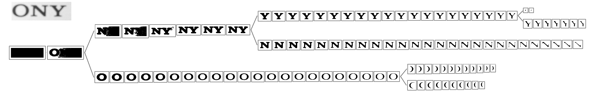

Scene Text Detection
====================

.. highlight:: cpp

Class-specific Extremal Regions for Scene Text Detection
--------------------------------------------------------

The scene text detection algorithm described below has been initially proposed by Lukás Neumann & Jiri Matas [Neumann12]. The main idea behind Class-specific Extremal Regions is similar to the MSER in that suitable Extremal Regions (ERs) are selected from the whole component tree of the image. However, this technique differs from MSER in that selection of suitable ERs is done by a sequential classifier trained for character detection, i.e. dropping the stability requirement of MSERs and selecting class-specific (not necessarily stable) regions.

The component tree of an image is constructed by thresholding by an increasing value step-by-step from 0 to 255 and then linking the obtained connected components from successive levels in a hierarchy by their inclusion relation:

The component tree may conatain a huge number of regions even for a very simple image as shown in the previous image. This number can easily reach the order of 1 x 10^6 regions for an average 1 Megapixel image. In order to efficiently select suitable regions among all the ERs the algorithm make use of a sequential classifier with two differentiated stages.

In the first stage incrementally computable descriptors (area, perimeter, bounding box, and euler number) are computed (in O(1)) for each region r and used as features for a classifier which estimates the class-conditional probability p(r|character). Only the ERs which correspond to local maximum of the probability p(r|character) are selected (if their probability is above a global limit p_min and the difference between local maximum and local minimum is greater than a \delta_min value).

In the second stage, the ERs that passed the first stage are classified into character and non-character classes using more informative but also more computationally expensive features. (Hole area ratio, convex hull ratio, and the number of outer boundary inflexion points).

This ER filtering process is done in different single-channel projections of the input image in order to increase the character localization recall.

After the ER filtering is done on each input channel, character candidates must be grouped in high-level text blocks (i.e. words, text lines, paragraphs, ...). The grouping algorithm used in this implementation has been proposed by Lluis Gomez and Dimosthenis Karatzas in [Gomez13] and basically consist in finding meaningful groups of regions using a perceptual organization based clustering analisys (see :ocv:func:`erGrouping`).

To see the text detector at work, have a look at the textdetection demo: https://github.com/Itseez/opencv/blob/master/samples/cpp/textdetection.cpp

.. [Neumann12] Neumann L., Matas J.: Real-Time Scene Text Localization and Recognition, CVPR 2012. The paper is available online at http://cmp.felk.cvut.cz/~neumalu1/neumann-cvpr2012.pdf

.. [Gomez13] Gomez L. and Karatzas D.: Multi-script Text Extraction from Natural Scenes, ICDAR 2013. The paper is available online at http://158.109.8.37/files/GoK2013.pdf

ERStat
------
.. ocv:struct:: ERStat

The ERStat structure represents a class-specific Extremal Region (ER).

An ER is a 4-connected set of pixels with all its grey-level values smaller than the values in its outer boundary. A class-specific ER is selected (using a classifier) from all the ER's in the component tree of the image. ::

    struct CV_EXPORTS ERStat
    {
    public:
        //! Constructor
        explicit ERStat(int level = 256, int pixel = 0, int x = 0, int y = 0);
        //! Destructor
        ~ERStat(){};

        //! seed point and threshold (max grey-level value)
        int pixel;
        int level;

        //! incrementally computable features
        int area;
        int perimeter;
        int euler;                 //!< euler number
        Rect rect;                 //!< bounding box
        double raw_moments[2];     //!< order 1 raw moments to derive the centroid
        double central_moments[3]; //!< order 2 central moments to construct the covariance matrix
        std::deque<int> *crossings;//!< horizontal crossings
        float med_crossings;       //!< median of the crossings at three different height levels

        //! 2nd stage features
        float hole_area_ratio;
        float convex_hull_ratio;
        float num_inflexion_points;

        //! probability that the ER belongs to the class we are looking for
        double probability;

        //! pointers preserving the tree structure of the component tree
        ERStat* parent;
        ERStat* child;
        ERStat* next;
        ERStat* prev;
    };

computeNMChannels
-----------------
Compute the different channels to be processed independently in the N&M algorithm [Neumann12].

.. ocv:function:: void computeNMChannels(InputArray _src, OutputArrayOfArrays _channels, int _mode = ERFILTER_NM_RGBLGrad)

    :param _src: Source image. Must be RGB ``CV_8UC3``.
    :param _channels: Output vector<Mat> where computed channels are stored.
    :param _mode: Mode of operation. Currently the only available options are: **ERFILTER_NM_RGBLGrad** (used by default) and **ERFILTER_NM_IHSGrad**.

In N&M algorithm, the combination of intensity (I), hue (H), saturation (S), and gradient magnitude channels (Grad) are used in order to obtain high localization recall. This implementation also provides an alternative combination of red (R), green (G), blue (B), lightness (L), and gradient magnitude (Grad).

ERFilter
--------
.. ocv:class:: ERFilter : public Algorithm

Base class for 1st and 2nd stages of Neumann and Matas scene text detection algorithm [Neumann12]. ::

    class CV_EXPORTS ERFilter : public Algorithm
    {
    public:

        //! callback with the classifier is made a class.
        //! By doing it we hide SVM, Boost etc. Developers can provide their own classifiers
        class CV_EXPORTS Callback
        {
        public:
            virtual ~Callback(){};
            //! The classifier must return probability measure for the region.
            virtual double eval(const ERStat& stat) = 0;
        };

        /*!
        the key method. Takes image on input and returns the selected regions in a vector of ERStat
        only distinctive ERs which correspond to characters are selected by a sequential classifier
        */
        virtual void run( InputArray image, std::vector<ERStat>& regions ) = 0;

        (...)

    };

ERFilter::Callback
------------------
Callback with the classifier is made a class. By doing it we hide SVM, Boost etc. Developers can provide their own classifiers to the ERFilter algorithm.

.. ocv:class:: ERFilter::Callback

ERFilter::Callback::eval
------------------------
The classifier must return probability measure for the region.

.. ocv:function:: double ERFilter::Callback::eval(const ERStat& stat)

    :param  stat:          The region to be classified

ERFilter::run
-------------
The key method of ERFilter algorithm. Takes image on input and returns the selected regions in a vector of ERStat only distinctive ERs which correspond to characters are selected by a sequential classifier

.. ocv:function:: void ERFilter::run( InputArray image, std::vector<ERStat>& regions )

    :param image: Sinle channel image ``CV_8UC1``
    :param regions: Output for the 1st stage and Input/Output for the 2nd. The selected Extremal Regions are stored here.

Extracts the component tree (if needed) and filter the extremal regions (ER's) by using a given classifier.

createERFilterNM1
-----------------
Create an Extremal Region Filter for the 1st stage classifier of N&M algorithm [Neumann12].

.. ocv:function:: Ptr<ERFilter> createERFilterNM1( const Ptr<ERFilter::Callback>& cb, int thresholdDelta = 1, float minArea = 0.00025, float maxArea = 0.13, float minProbability = 0.4, bool nonMaxSuppression = true, float minProbabilityDiff = 0.1 )

    :param  cb:               Callback with the classifier. Default classifier can be implicitly load with function :ocv:func:`loadClassifierNM1`, e.g. from file in samples/cpp/trained_classifierNM1.xml
    :param  thresholdDelta:   Threshold step in subsequent thresholds when extracting the component tree
    :param  minArea:          The minimum area (% of image size) allowed for retreived ER's
    :param  minArea:          The maximum area (% of image size) allowed for retreived ER's
    :param  minProbability:   The minimum probability P(er|character) allowed for retreived ER's
    :param  nonMaxSuppression: Whenever non-maximum suppression is done over the branch probabilities
    :param  minProbability:   The minimum probability difference between local maxima and local minima ERs

The component tree of the image is extracted by a threshold increased step by step from 0 to 255, incrementally computable descriptors (aspect_ratio, compactness, number of holes, and number of horizontal crossings) are computed for each ER and used as features for a classifier which estimates the class-conditional probability P(er|character). The value of P(er|character) is tracked using the inclusion relation of ER across all thresholds and only the ERs which correspond to local maximum of the probability P(er|character) are selected (if the local maximum of the probability is above a global limit pmin and the difference between local maximum and local minimum is greater than minProbabilityDiff).

createERFilterNM2
-----------------
Create an Extremal Region Filter for the 2nd stage classifier of N&M algorithm [Neumann12].

.. ocv:function:: Ptr<ERFilter> createERFilterNM2( const Ptr<ERFilter::Callback>& cb, float minProbability = 0.3 )

    :param  cb:               Callback with the classifier. Default classifier can be implicitly load with function :ocv:func:`loadClassifierNM2`, e.g. from file in samples/cpp/trained_classifierNM2.xml
    :param  minProbability:   The minimum probability P(er|character) allowed for retreived ER's

In the second stage, the ERs that passed the first stage are classified into character and non-character classes using more informative but also more computationally expensive features. The classifier uses all the features calculated in the first stage and the following additional features: hole area ratio, convex hull ratio, and number of outer inflexion points.

loadClassifierNM1
-----------------
Allow to implicitly load the default classifier when creating an ERFilter object.

.. ocv:function:: Ptr<ERFilter::Callback> loadClassifierNM1(const std::string& filename)

    :param filename: The XML or YAML file with the classifier model (e.g. trained_classifierNM1.xml)

returns a pointer to ERFilter::Callback.

loadClassifierNM2
-----------------
Allow to implicitly load the default classifier when creating an ERFilter object.

.. ocv:function:: Ptr<ERFilter::Callback> loadClassifierNM2(const std::string& filename)

    :param filename: The XML or YAML file with the classifier model (e.g. trained_classifierNM2.xml)

returns a pointer to ERFilter::Callback.

erGrouping
----------
Find groups of Extremal Regions that are organized as text blocks.

.. ocv:function:: void erGrouping( InputArrayOfArrays src, std::vector<std::vector<ERStat> > &regions, const std::string& filename, float minProbablity, std::vector<Rect > &groups)

    :param src: Vector of sinle channel images CV_8UC1 from wich the regions were extracted
    :param regions: Vector of ER's retreived from the ERFilter algorithm from each channel
    :param filename: The XML or YAML file with the classifier model (e.g. trained_classifier_erGrouping.xml)
    :param minProbability: The minimum probability for accepting a group
    :param groups: The output of the algorithm are stored in this parameter as list of rectangles.

This function implements the grouping algorithm described in [Gomez13]. Notice that this implementation constrains the results to horizontally-aligned text and latin script (since ERFilter classifiers are trained only for latin script detection).

The algorithm combines two different clustering techniques in a single parameter-free procedure to detect groups of regions organized as text. The maximally meaningful groups are fist detected in several feature spaces, where each feature space is a combination of proximity information (x,y coordinates) and a similarity measure (intensity, color, size, gradient magnitude, etc.), thus providing a set of hypotheses of text groups. Evidence Accumulation framework is used to combine all these hypotheses to get the final estimate. Each of the resulting groups are finally validated using a classifier in order to assess if they form a valid horizontally-aligned text block.
