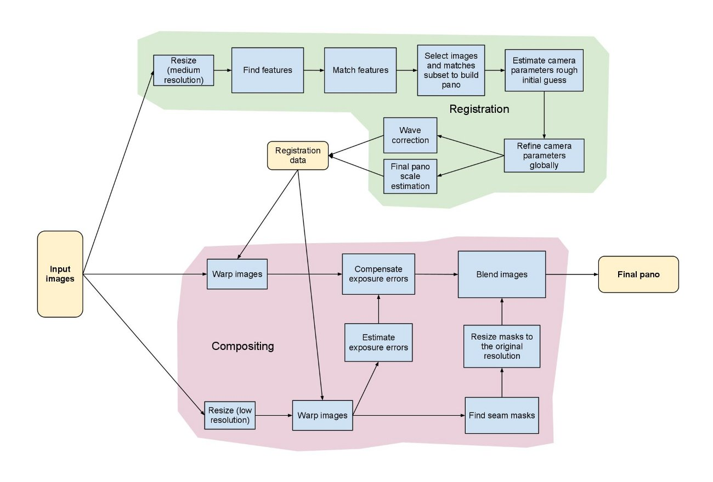

.. _stitching-pipeline:

Stitching Pipeline
==================

This figure illustrates the stitching module pipeline implemented in the :ocv:class:`Stitcher` class. Using that class it's possible to configure/remove some steps, i.e. adjust the stitching pipeline according to the particular needs. All building blocks from the pipeline are available in the ``detail`` namespace, one can combine and use them separately.

The implemented stitching pipeline is very similar to the one proposed in [BL07]_.

References
==========

.. [BL07] M. Brown and D. Lowe. Automatic Panoramic Image Stitching using Invariant Features. International Journal of Computer Vision, 74(1), pages 59-73, 2007.

.. [RS10] Richard Szeliski. Computer Vision: Algorithms and Applications. Springer, New York, 2010.

.. [RS04] Richard Szeliski. Image alignment and stitching: A tutorial. Technical Report MSR-TR-2004-92, Microsoft Research, December 2004.

.. [SS00] Heung-Yeung Shum and Richard Szeliski. Construction of panoramic mosaics with global and local alignment. International Journal of Computer Vision, 36(2):101-130, February 2000. Erratum published July 2002, 48(2):151-152.

.. [V03] Vivek Kwatra, Arno Schödl, Irfan Essa, Greg Turk and Aaron Bobick. Graphcut Textures: Image and Video Synthesis Using Graph Cuts. To appear in Proc. ACM Transactions on Graphics, SIGGRAPH 2003.

.. [UES01] M. Uyttendaele, A. Eden, and R. Szeliski. Eliminating ghosting and exposure artifacts in image mosaics. In Proc. CVPR’01, volume 2, pages 509–516, 2001

.. [WJ10] Wei Xu and Jane Mulligan. Performance evaluation of color correction approaches for automatic multiview image and video stitching. In Intl. Conf on Computer Vision and Pattern Recognition (CVPR10), San Francisco, CA, 2010

.. [BA83] Burt, P., and Adelson, E. H., A Multiresolution Spline with Application to Image Mosaics. ACM Transactions on Graphics, 2(4):217-236, 1983.
