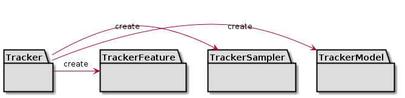
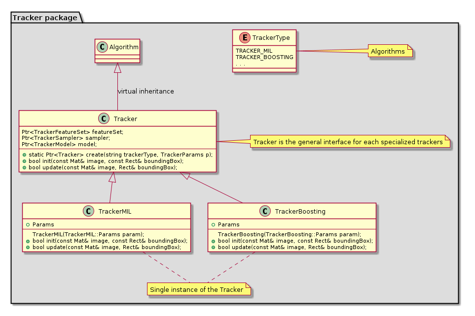
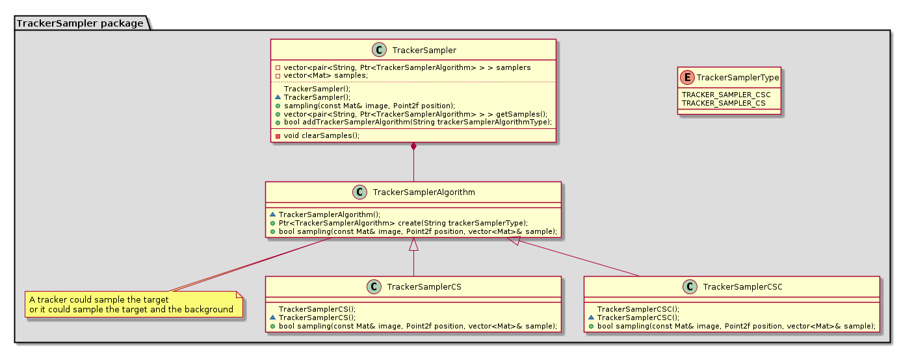
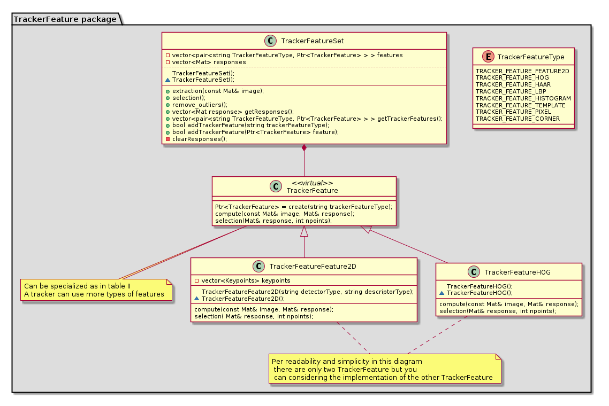
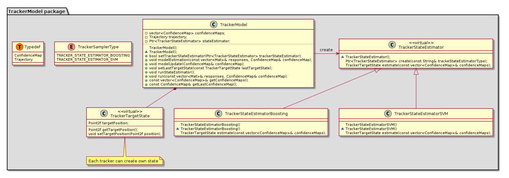

Tracking API
============

.. highlight:: cpp

Long-term optical tracking API
------------------------------
Long-term optical tracking is one of most important issue for many computer vision applications in real world scenario.
The development in this area is very fragmented and this API is an unique interface useful for plug several algorithms and compare them.
This work is partially based on [AAM]_ and [AMVOT]_.

This algorithms start from a bounding box of the target and with their internal representation they avoid the drift during the tracking.
These long-term trackers are able to evaluate online the quality of the location of the target in the new frame, without ground truth.

There are three main components: the TrackerSampler, the TrackerFeatureSet and the TrackerModel. The first component is the object that computes the patches over the frame based on the last target location.
The TrackerFeatureSet is the class that manages the Features, is possible plug many kind of these (HAAR, HOG, LBP, Feature2D, etc).
The last component is the internal representation of the target, it is the appearence model. It stores all state candidates and compute the trajectory (the most likely target states). The class TrackerTargetState represents a possible state of the target.
The TrackerSampler and the TrackerFeatureSet are the visual representation of the target, instead the TrackerModel is the statistical model.

A recent benchmark between these algorithms can be found in [OOT]_.

UML design:
-----------

**General diagram**

**Tracker diagram**

**TrackerSampler diagram**

**TrackerFeatureSet diagram**

**TrackerModel diagram**

To see how API works, try tracker demo:
https://github.com/lenlen/opencv/blob/tracking_api/samples/cpp/tracker.cpp

.. note:: This Tracking API has been designed with PlantUML. If you modify this API please change UML files under modules/video/misc/

The following reference was used in the API

.. [AAM] S Salti, A Cavallaro, L Di Stefano, Adaptive Appearance Modeling for Video Tracking: Survey and Evaluation, IEEE Transactions on Image Processing, Vol. 21, Issue 10, October 2012, pp. 4334-4348

.. [AMVOT] X Li, W Hu, C Shen, Z Zhang, A Dick, A van den Hengel, A Survey of Appearance Models in Visual Object Tracking, ACM Transactions on Intelligent Systems and Technology (TIST), 2013

.. [OOT] Yi Wu and Jongwoo Lim and Ming-Hsuan Yang, Online Object Tracking: A Benchmark, The IEEE Conference on Computer Vision and Pattern Recognition (CVPR), 2013

Tracker classes:
----------------

.. toctree::
    :maxdepth: 2

    common_interfaces_tracker
    common_interfaces_tracker_sampler
    common_interfaces_tracker_feature_set
    common_interfaces_tracker_model
