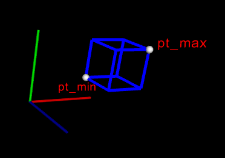

Widget
======

.. highlight:: cpp

In this section, the widget framework is explained. Widgets represent
2D or 3D objects, varying from simple ones such as lines to complex one such as
point clouds and meshes.

Widgets are **implicitly shared**. Therefore, one can add a widget to the scene,
and modify the widget without re-adding the widget.

.. code-block:: cpp

    ...
    /// Create a cloud widget
    viz::WCloud cw(cloud, viz::Color::red());
    /// Display it in a window
    myWindow.showWidget("CloudWidget1", cw);
    /// Modify it, and it will be modified in the window.
    cw.setColor(viz::Color::yellow());
    ...

viz::Widget
-----------
.. ocv:class:: Widget

Base class of all widgets. Widget is implicitly shared. ::

    class CV_EXPORTS Widget
    {
    public:
        Widget();
        Widget(const Widget& other);
        Widget& operator=(const Widget& other);
        ~Widget();

        //! Create a widget directly from ply file
        static Widget fromPlyFile(const String &file_name);

        //! Rendering properties of this particular widget
        void setRenderingProperty(int property, double value);
        double getRenderingProperty(int property) const;

        //! Casting between widgets
        template<typename _W> _W cast();
    private:
        /* hidden */
    };

viz::Widget::fromPlyFile
------------------------
Creates a widget from ply file.

.. ocv:function:: static Widget fromPlyFile(const String &file_name)

    :param file_name: Ply file name.

viz::Widget::setRenderingProperty
---------------------------------
Sets rendering property of the widget.

.. ocv:function:: void setRenderingProperty(int property, double value)

    :param property: Property that will be modified.
    :param value: The new value of the property.

    **Rendering property** can be one of the following:

    * **POINT_SIZE**
    * **OPACITY**
    * **LINE_WIDTH**
    * **FONT_SIZE**
    * **REPRESENTATION**: Expected values are
        * **REPRESENTATION_POINTS**
        * **REPRESENTATION_WIREFRAME**
        * **REPRESENTATION_SURFACE**
    * **IMMEDIATE_RENDERING**:
        * Turn on immediate rendering by setting the value to ``1``.
        * Turn off immediate rendering by setting the value to ``0``.
    * **SHADING**: Expected values are
        * **SHADING_FLAT**
        * **SHADING_GOURAUD**
        * **SHADING_PHONG**

viz::Widget::getRenderingProperty
---------------------------------
Returns rendering property of the widget.

.. ocv:function:: double getRenderingProperty(int property) const

    :param property: Property.

    **Rendering property** can be one of the following:

    * **POINT_SIZE**
    * **OPACITY**
    * **LINE_WIDTH**
    * **FONT_SIZE**
    * **REPRESENTATION**: Expected values are
        * **REPRESENTATION_POINTS**
        * **REPRESENTATION_WIREFRAME**
        * **REPRESENTATION_SURFACE**
    * **IMMEDIATE_RENDERING**:
        * Turn on immediate rendering by setting the value to ``1``.
        * Turn off immediate rendering by setting the value to ``0``.
    * **SHADING**: Expected values are
        * **SHADING_FLAT**
        * **SHADING_GOURAUD**
        * **SHADING_PHONG**

viz::Widget::cast
-----------------
Casts a widget to another.

.. ocv:function:: template<typename _W> _W cast()

.. code-block:: cpp

    // Create a sphere widget
    viz::WSphere sw(Point3f(0.0f,0.0f,0.0f), 0.5f);
    // Cast sphere widget to cloud widget
    viz::WCloud cw = sw.cast<viz::WCloud>();

.. note:: 3D Widgets can only be cast to 3D Widgets. 2D Widgets can only be cast to 2D Widgets.

viz::WidgetAccessor
-------------------
.. ocv:class:: WidgetAccessor

This class is for users who want to develop their own widgets using VTK library API. ::

    struct CV_EXPORTS WidgetAccessor
    {
        static vtkSmartPointer<vtkProp> getProp(const Widget &widget);
        static void setProp(Widget &widget, vtkSmartPointer<vtkProp> prop);
    };

viz::WidgetAccessor::getProp
----------------------------
Returns ``vtkProp`` of a given widget.

.. ocv:function:: static vtkSmartPointer<vtkProp> getProp(const Widget &widget)

    :param widget: Widget whose ``vtkProp`` is to be returned.

.. note:: vtkProp has to be down cast appropriately to be modified.

    .. code-block:: cpp

        vtkActor * actor = vtkActor::SafeDownCast(viz::WidgetAccessor::getProp(widget));

viz::WidgetAccessor::setProp
----------------------------
Sets ``vtkProp`` of a given widget.

.. ocv:function:: static void setProp(Widget &widget, vtkSmartPointer<vtkProp> prop)

    :param widget: Widget whose ``vtkProp`` is to be set.
    :param prop: A ``vtkProp``.

viz::Widget3D
-------------
.. ocv:class:: Widget3D

Base class of all 3D widgets. ::

    class CV_EXPORTS Widget3D : public Widget
    {
    public:
        Widget3D() {}

        //! widget position manipulation, i.e. place where it is rendered.
        void setPose(const Affine3d &pose);
        void updatePose(const Affine3d &pose);
        Affine3d getPose() const;

        //! updates internal widget data, i.e. points, normals, etc.
        void applyTransform(const Affine3d &transform);

        void setColor(const Color &color);

    };

viz::Widget3D::setPose
----------------------
Sets pose of the widget.

.. ocv:function:: void setPose(const Affine3d &pose)

    :param pose: The new pose of the widget.

viz::Widget3D::updateWidgetPose
-------------------------------
Updates pose of the widget by pre-multiplying its current pose.

.. ocv:function:: void updateWidgetPose(const Affine3d &pose)

    :param pose: The pose that the current pose of the widget will be pre-multiplied by.

viz::Widget3D::getPose
----------------------
Returns the current pose of the widget.

.. ocv:function:: Affine3d getWidgetPose() const

viz::Widget3D::applyTransform
-------------------------------
Transforms internal widget data (i.e. points, normals) using the given transform.

.. ocv:function::  void applyTransform(const Affine3d &transform)

    :param transform: Specified transformation to apply.

viz::Widget3D::setColor
-----------------------
Sets the color of the widget.

.. ocv:function:: void setColor(const Color &color)

    :param color: color of type :ocv:class:`Color`

viz::Widget2D
-------------
.. ocv:class:: Widget2D

Base class of all 2D widgets. ::

    class CV_EXPORTS Widget2D : public Widget
    {
    public:
        Widget2D() {}

        void setColor(const Color &color);
    };

viz::Widget2D::setColor
-----------------------
Sets the color of the widget.

.. ocv:function:: void setColor(const Color &color)

    :param color: color of type :ocv:class:`Color`

viz::WLine
----------
.. ocv:class:: WLine

This 3D Widget defines a finite line. ::

    class CV_EXPORTS WLine : public Widget3D
    {
    public:
        WLine(const Point3f &pt1, const Point3f &pt2, const Color &color = Color::white());
    };

viz::WLine::WLine
-----------------
Constructs a WLine.

.. ocv:function:: WLine(const Point3f &pt1, const Point3f &pt2, const Color &color = Color::white())

    :param pt1: Start point of the line.
    :param pt2: End point of the line.
    :param color: :ocv:class:`Color` of the line.

viz::WPlane
-----------
.. ocv:class:: WPlane

This 3D Widget defines a finite plane. ::

    class CV_EXPORTS WPlane : public Widget3D
    {
    public:
        //! created default plane with center point at origin and normal oriented along z-axis
        WPlane(const Size2d& size = Size2d(1.0, 1.0), const Color &color = Color::white());

        //! repositioned plane
        WPlane(const Point3d& center, const Vec3d& normal, const Vec3d& new_plane_yaxis,const Size2d& size = Size2d(1.0, 1.0), const Color &color = Color::white());
    };

viz::WPlane::WPlane
-------------------
Constructs a default plane with center point at origin and normal oriented along z-axis.

.. ocv:function:: WPlane(const Size2d& size = Size2d(1.0, 1.0), const Color &color = Color::white())

    :param size: Size of the plane
    :param color: :ocv:class:`Color` of the plane.

viz::WPlane::WPlane
-------------------
Constructs a repositioned plane

.. ocv:function:: WPlane(const Point3d& center, const Vec3d& normal, const Vec3d& new_yaxis,const Size2d& size = Size2d(1.0, 1.0), const Color &color = Color::white())

    :param center: Center of the plane
    :param normal: Plane normal orientation
    :param new_yaxis: Up-vector. New orientation of plane y-axis.
    :param color: :ocv:class:`Color` of the plane.

viz::WSphere
------------
.. ocv:class:: WSphere

This 3D Widget defines a sphere. ::

    class CV_EXPORTS WSphere : public Widget3D
    {
    public:
        WSphere(const cv::Point3f &center, double radius, int sphere_resolution = 10, const Color &color = Color::white())
    };

viz::WSphere::WSphere
---------------------
Constructs a WSphere.

.. ocv:function:: WSphere(const cv::Point3f &center, double radius, int sphere_resolution = 10, const Color &color = Color::white())

    :param center: Center of the sphere.
    :param radius: Radius of the sphere.
    :param sphere_resolution: Resolution of the sphere.
    :param color: :ocv:class:`Color` of the sphere.

viz::WArrow
----------------
.. ocv:class:: WArrow

This 3D Widget defines an arrow. ::

    class CV_EXPORTS WArrow : public Widget3D
    {
    public:
        WArrow(const Point3f& pt1, const Point3f& pt2, double thickness = 0.03, const Color &color = Color::white());
    };

viz::WArrow::WArrow
-----------------------------
Constructs an WArrow.

.. ocv:function:: WArrow(const Point3f& pt1, const Point3f& pt2, double thickness = 0.03, const Color &color = Color::white())

    :param pt1: Start point of the arrow.
    :param pt2: End point of the arrow.
    :param thickness: Thickness of the arrow. Thickness of arrow head is also adjusted accordingly.
    :param color: :ocv:class:`Color` of the arrow.

Arrow head is located at the end point of the arrow.

viz::WCircle
-----------------
.. ocv:class:: WCircle

This 3D Widget defines a circle. ::

    class CV_EXPORTS WCircle : public Widget3D
    {
    public:
        //! creates default planar circle centred at origin with plane normal along z-axis
        WCircle(double radius, double thickness = 0.01, const Color &color = Color::white());

        //! creates repositioned circle
        WCircle(double radius, const Point3d& center, const Vec3d& normal, double thickness = 0.01, const Color &color = Color::white());
    };

viz::WCircle::WCircle
-------------------------------
Constructs default planar circle centred at origin with plane normal along z-axis

.. ocv:function:: WCircle(double radius, double thickness = 0.01, const Color &color = Color::white())

    :param radius: Radius of the circle.
    :param thickness: Thickness of the circle.
    :param color: :ocv:class:`Color` of the circle.

viz::WCircle::WCircle
-------------------------------
Constructs repositioned planar circle.

.. ocv:function:: WCircle(double radius, const Point3d& center, const Vec3d& normal, double thickness = 0.01, const Color &color = Color::white())

    :param radius: Radius of the circle.
    :param center: Center of the circle.
    :param normal: Normal of the plane in which the circle lies.
    :param thickness: Thickness of the circle.
    :param color: :ocv:class:`Color` of the circle.

viz::WCone
-------------------------------
.. ocv:class:: WCone

This 3D Widget defines a cone. ::

    class CV_EXPORTS WCone : public Widget3D
    {
    public:
        //! create default cone, oriented along x-axis with center of its base located at origin
        WCone(double length, double radius, int resolution = 6.0, const Color &color = Color::white());

        //! creates repositioned cone
        WCone(double radius, const Point3d& center, const Point3d& tip, int resolution = 6.0, const Color &color = Color::white());
    };

viz::WCone::WCone
-------------------------------
Constructs default cone oriented along x-axis with center of its base located at origin

.. ocv:function:: WCone(double length, double radius, int resolution = 6.0, const Color &color = Color::white())

    :param length: Length of the cone.
    :param radius: Radius of the cone.
    :param resolution: Resolution of the cone.
    :param color: :ocv:class:`Color` of the cone.

viz::WCone::WCone
-------------------------------
Constructs repositioned planar cone.

.. ocv:function:: WCone(double radius, const Point3d& center, const Point3d& tip, int resolution = 6.0, const Color &color = Color::white())

    :param radius: Radius of the cone.
    :param center: Center of the cone base.
    :param tip: Tip of the cone.
    :param resolution: Resolution of the cone.
    :param color: :ocv:class:`Color` of the cone.

viz::WCylinder
--------------
.. ocv:class:: WCylinder

This 3D Widget defines a cylinder. ::

    class CV_EXPORTS WCylinder : public Widget3D
    {
    public:
        WCylinder(const Point3d& axis_point1, const Point3d& axis_point2, double radius, int numsides = 30, const Color &color = Color::white());
    };

viz::WCylinder::WCylinder
-----------------------------------
Constructs a WCylinder.

.. ocv:function:: WCylinder(const Point3f& pt_on_axis, const Point3f& axis_direction, double radius, int numsides = 30, const Color &color = Color::white())

    :param axis_point1: A point1 on the axis of the cylinder.
    :param axis_point2: A point2 on the axis of the cylinder.
    :param radius: Radius of the cylinder.
    :param numsides: Resolution of the cylinder.
    :param color: :ocv:class:`Color` of the cylinder.

viz::WCube
----------
.. ocv:class:: WCube

This 3D Widget defines a cube. ::

    class CV_EXPORTS WCube : public Widget3D
    {
    public:
        WCube(const Point3f& pt_min, const Point3f& pt_max, bool wire_frame = true, const Color &color = Color::white());
    };

viz::WCube::WCube
---------------------------
Constructs a WCube.

.. ocv:function:: WCube(const Point3f& pt_min, const Point3f& pt_max, bool wire_frame = true, const Color &color = Color::white())

    :param pt_min: Specifies minimum point of the bounding box.
    :param pt_max: Specifies maximum point of the bounding box.
    :param wire_frame: If true, cube is represented as wireframe.
    :param color: :ocv:class:`Color` of the cube.

viz::WCoordinateSystem
----------------------
.. ocv:class:: WCoordinateSystem

This 3D Widget represents a coordinate system. ::

    class CV_EXPORTS WCoordinateSystem : public Widget3D
    {
    public:
        WCoordinateSystem(double scale = 1.0);
    };

viz::WCoordinateSystem::WCoordinateSystem
---------------------------------------------------
Constructs a WCoordinateSystem.

.. ocv:function:: WCoordinateSystem(double scale = 1.0)

    :param scale: Determines the size of the axes.

viz::WPolyLine
--------------
.. ocv:class:: WPolyLine

This 3D Widget defines a poly line. ::

    class CV_EXPORTS WPolyLine : public Widget3D
    {
    public:
        WPolyLine(InputArray points, const Color &color = Color::white());
    };

viz::WPolyLine::WPolyLine
-----------------------------------
Constructs a WPolyLine.

.. ocv:function:: WPolyLine(InputArray points, const Color &color = Color::white())

    :param points: Point set.
    :param color: :ocv:class:`Color` of the poly line.

viz::WGrid
----------
.. ocv:class:: WGrid

This 3D Widget defines a grid. ::

    class CV_EXPORTS WGrid : public Widget3D
    {
    public:
        //! Creates grid at the origin and normal oriented along z-axis
        WGrid(const Vec2i &cells = Vec2i::all(10), const Vec2d &cells_spacing = Vec2d::all(1.0), const Color &color = Color::white());

        //! Creates repositioned grid
        WGrid(const Point3d& center, const Vec3d& normal, const Vec3d& new_yaxis,
              const Vec2i &cells = Vec2i::all(10), const Vec2d &cells_spacing = Vec2d::all(1.0), const Color &color = Color::white());
    };

viz::WGrid::WGrid
---------------------------
Constructs a WGrid.

.. ocv:function::  WGrid(const Vec2i &cells = Vec2i::all(10), const Vec2d &cells_spacing = Vec2d::all(1.0), const Color &color = Color::white())

    :param cells: Number of cell columns and rows, respectively.
    :param cells_spacing: Size of each cell, respectively.
    :param color: :ocv:class:`Color` of the grid.

.. ocv:function:  WGrid(const Point3d& center, const Vec3d& normal, const Vec3d& new_yaxis, Vec2i &cells, const Vec2d &cells_spacing, const Color &color;

    :param center: Center of the grid
    :param normal: Grid normal orientation
    :param new_yaxis: Up-vector. New orientation of grid y-axis.
    :param cells: Number of cell columns and rows, respectively.
    :param cells_spacing: Size of each cell, respectively.
    :param color: :ocv:class:`Color` of the grid..

viz::WText3D
------------
.. ocv:class:: WText3D

This 3D Widget represents 3D text. The text always faces the camera. ::

    class CV_EXPORTS WText3D : public Widget3D
    {
    public:
        WText3D(const String &text, const Point3f &position, double text_scale = 1.0, bool face_camera = true, const Color &color = Color::white());

        void setText(const String &text);
        String getText() const;
    };

viz::WText3D::WText3D
-------------------------------
Constructs a WText3D.

.. ocv:function:: WText3D(const String &text, const Point3f &position, double text_scale = 1.0, bool face_camera = true, const Color &color = Color::white())

    :param text: Text content of the widget.
    :param position: Position of the text.
    :param text_scale: Size of the text.
    :param face_camera: If true, text always faces the camera.
    :param color: :ocv:class:`Color` of the text.

viz::WText3D::setText
---------------------
Sets the text content of the widget.

.. ocv:function:: void setText(const String &text)

    :param text: Text content of the widget.

viz::WText3D::getText
---------------------
Returns the current text content of the widget.

.. ocv:function:: String getText() const

viz::WText
----------
.. ocv:class:: WText

This 2D Widget represents text overlay. ::

    class CV_EXPORTS WText : public Widget2D
    {
    public:
        WText(const String &text, const Point2i &pos, int font_size = 10, const Color &color = Color::white());

        void setText(const String &text);
        String getText() const;
    };

viz::WText::WText
-----------------
Constructs a WText.

.. ocv:function:: WText(const String &text, const Point2i &pos, int font_size = 10, const Color &color = Color::white())

    :param text: Text content of the widget.
    :param pos: Position of the text.
    :param font_size: Font size.
    :param color: :ocv:class:`Color` of the text.

viz::WText::setText
-------------------
Sets the text content of the widget.

.. ocv:function:: void setText(const String &text)

    :param text: Text content of the widget.

viz::WText::getText
-------------------
Returns the current text content of the widget.

.. ocv:function:: String getText() const

viz::WImageOverlay
------------------
.. ocv:class:: WImageOverlay

This 2D Widget represents an image overlay. ::

    class CV_EXPORTS WImageOverlay : public Widget2D
    {
    public:
        WImageOverlay(InputArray image, const Rect &rect);

        void setImage(InputArray image);
    };

viz::WImageOverlay::WImageOverlay
---------------------------------
Constructs an WImageOverlay.

.. ocv:function:: WImageOverlay(InputArray image, const Rect &rect)

    :param image: BGR or Gray-Scale image.
    :param rect: Image is scaled and positioned based on rect.

viz::WImageOverlay::setImage
----------------------------
Sets the image content of the widget.

.. ocv:function:: void setImage(InputArray image)

    :param image: BGR or Gray-Scale image.

viz::WImage3D
-------------
.. ocv:class:: WImage3D

This 3D Widget represents an image in 3D space. ::

    class CV_EXPORTS WImage3D : public Widget3D
    {
    public:
        //! Creates 3D image at the origin
        WImage3D(InputArray image, const Size2d &size);
        //! Creates 3D image at a given position, pointing in the direction of the normal, and having the up_vector orientation
        WImage3D(InputArray image, const Size2d &size, const Vec3d &position, const Vec3d &normal, const Vec3d &up_vector);

        void setImage(InputArray image);
    };

viz::WImage3D::WImage3D
-----------------------
Constructs an WImage3D.

.. ocv:function:: WImage3D(InputArray image, const Size2d &size)

    :param image: BGR or Gray-Scale image.
    :param size: Size of the image.

.. ocv:function:: WImage3D(InputArray image, const Size2d &size, const Vec3d &position, const Vec3d &normal, const Vec3d &up_vector)

    :param position: Position of the image.
    :param normal: Normal of the plane that represents the image.
    :param up_vector: Determines orientation of the image.
    :param image: BGR or Gray-Scale image.
    :param size: Size of the image.

viz::WImage3D::setImage
-----------------------
Sets the image content of the widget.

.. ocv:function:: void setImage(InputArray image)

    :param image: BGR or Gray-Scale image.

viz::WCameraPosition
--------------------
.. ocv:class:: WCameraPosition

This 3D Widget represents camera position in a scene by its axes or viewing frustum. ::

    class CV_EXPORTS WCameraPosition : public Widget3D
    {
    public:
        //! Creates camera coordinate frame (axes) at the origin
        WCameraPosition(double scale = 1.0);
        //! Creates frustum based on the intrinsic marix K at the origin
        WCameraPosition(const Matx33d &K, double scale = 1.0, const Color &color = Color::white());
        //! Creates frustum based on the field of view at the origin
        WCameraPosition(const Vec2d &fov, double scale = 1.0, const Color &color = Color::white());
        //! Creates frustum and display given image at the far plane
        WCameraPosition(const Matx33d &K, InputArray image, double scale = 1.0, const Color &color = Color::white());
        //! Creates frustum and display given image at the far plane
        WCameraPosition(const Vec2d &fov, InputArray image, double scale = 1.0, const Color &color = Color::white());
    };

viz::WCameraPosition::WCameraPosition
-------------------------------------
Constructs a WCameraPosition.

- **Display camera coordinate frame.**

    .. ocv:function:: WCameraPosition(double scale = 1.0)

        Creates camera coordinate frame at the origin.

    .. image:: images/cpw1.png
        :alt: Camera coordinate frame
        :align: center

- **Display the viewing frustum.**

    .. ocv:function:: WCameraPosition(const Matx33d &K, double scale = 1.0, const Color &color = Color::white())

        :param K: Intrinsic matrix of the camera.
        :param scale: Scale of the frustum.
        :param color: :ocv:class:`Color` of the frustum.

        Creates viewing frustum of the camera based on its intrinsic matrix K.

    .. ocv:function:: WCameraPosition(const Vec2d &fov, double scale = 1.0, const Color &color = Color::white())

        :param fov: Field of view of the camera (horizontal, vertical).
        :param scale: Scale of the frustum.
        :param color: :ocv:class:`Color` of the frustum.

        Creates viewing frustum of the camera based on its field of view fov.

    .. image:: images/cpw2.png
        :alt: Camera viewing frustum
        :align: center

- **Display image on the far plane of the viewing frustum.**

    .. ocv:function:: WCameraPosition(const Matx33d &K, InputArray image, double scale = 1.0, const Color &color = Color::white())

        :param K: Intrinsic matrix of the camera.
        :param img: BGR or Gray-Scale image that is going to be displayed on the far plane of the frustum.
        :param scale: Scale of the frustum and image.
        :param color: :ocv:class:`Color` of the frustum.

        Creates viewing frustum of the camera based on its intrinsic matrix K, and displays image on the far end plane.

    .. ocv:function:: WCameraPosition(const Vec2d &fov, InputArray image, double scale = 1.0, const Color &color = Color::white())

        :param fov: Field of view of the camera (horizontal, vertical).
        :param img: BGR or Gray-Scale image that is going to be displayed on the far plane of the frustum.
        :param scale: Scale of the frustum and image.
        :param color: :ocv:class:`Color` of the frustum.

        Creates viewing frustum of the camera based on its intrinsic matrix K, and displays image on the far end plane.

    .. image:: images/cpw3.png
        :alt: Camera viewing frustum with image
        :align: center

viz::WTrajectory
----------------
.. ocv:class:: WTrajectory

This 3D Widget represents a trajectory. ::

    class CV_EXPORTS WTrajectory : public Widget3D
    {
    public:
        enum {FRAMES = 1, PATH = 2, BOTH = FRAMES + PATH};

        //! Displays trajectory of the given path either by coordinate frames or polyline
        WTrajectory(InputArray path, int display_mode = WTrajectory::PATH, double scale = 1.0, const Color &color = Color::white(),;
    };

viz::WTrajectory::WTrajectory
-----------------------------
Constructs a WTrajectory.

.. ocv:function:: WTrajectory(InputArray path, int display_mode = WTrajectory::PATH, double scale = 1.0, const Color &color = Color::white())

    :param path: List of poses on a trajectory. Takes std::vector<Affine<T>> with T == [float | double]
    :param display_mode: Display mode. This can be PATH, FRAMES, and BOTH.
    :param scale: Scale of the frames. Polyline is not affected.
    :param color: :ocv:class:`Color` of the polyline that represents path. Frames are not affected.

    Displays trajectory of the given path as follows:

    * PATH : Displays a poly line that represents the path.
    * FRAMES : Displays coordinate frames at each pose.
    * PATH & FRAMES : Displays both poly line and coordinate frames.

viz::WTrajectoryFrustums
------------------------
.. ocv:class:: WTrajectoryFrustums

This 3D Widget represents a trajectory. ::

    class CV_EXPORTS WTrajectoryFrustums : public Widget3D
    {
    public:
        //! Displays trajectory of the given path by frustums
        WTrajectoryFrustums(InputArray path, const Matx33d &K, double scale = 1.0, const Color &color = Color::white());
        //! Displays trajectory of the given path by frustums
        WTrajectoryFrustums(InputArray path, const Vec2d &fov, double scale = 1.0, const Color &color = Color::white());
    };

viz::WTrajectoryFrustums::WTrajectoryFrustums
---------------------------------------------
Constructs a WTrajectoryFrustums.

.. ocv:function:: WTrajectoryFrustums(const std::vector<Affine3d> &path, const Matx33d &K, double scale = 1.0, const Color &color = Color::white())

    :param path: List of poses on a trajectory. Takes std::vector<Affine<T>> with T == [float | double]
    :param K: Intrinsic matrix of the camera.
    :param scale: Scale of the frustums.
    :param color: :ocv:class:`Color` of the frustums.

    Displays frustums at each pose of the trajectory.

.. ocv:function:: WTrajectoryFrustums(const std::vector<Affine3d> &path, const Vec2d &fov, double scale = 1.0, const Color &color = Color::white())

    :param path: List of poses on a trajectory. Takes std::vector<Affine<T>> with T == [float | double]
    :param fov: Field of view of the camera (horizontal, vertical).
    :param scale: Scale of the frustums.
    :param color: :ocv:class:`Color` of the frustums.

    Displays frustums at each pose of the trajectory.

viz::WTrajectorySpheres
-----------------------
.. ocv:class:: WTrajectorySpheres

This 3D Widget represents a trajectory using spheres and lines, where spheres represent the positions of the camera, and lines
represent the direction from previous position to the current. ::

    class CV_EXPORTS WTrajectorySpheres : public Widget3D
    {
    public:
        WTrajectorySpheres(InputArray path, double line_length = 0.05, double radius = 0.007,
                               const Color &from = Color::red(), const Color &to = Color::white());
    };

viz::WTrajectorySpheres::WTrajectorySpheres
-------------------------------------------
Constructs a WTrajectorySpheres.

.. ocv:function:: WTrajectorySpheres(InputArray path, double line_length = 0.05, double radius = 0.007, const Color &from = Color::red(), const Color &to = Color::white())

    :param path: List of poses on a trajectory. Takes std::vector<Affine<T>> with T == [float | double]
    :param line_length: Max length of the lines which point to previous position
    :param sphere_radius: Radius of the spheres.
    :param from: :ocv:class:`Color` for first sphere.
    :param to: :ocv:class:`Color` for last sphere. Intermediate spheres will have interpolated color.

viz::WCloud
-----------
.. ocv:class:: WCloud

This 3D Widget defines a point cloud. ::

    class CV_EXPORTS WCloud : public Widget3D
    {
    public:
        //! Each point in cloud is mapped to a color in colors
        WCloud(InputArray cloud, InputArray colors);
        //! All points in cloud have the same color
        WCloud(InputArray cloud, const Color &color = Color::white());
        //! Each point in cloud is mapped to a color in colors, normals are used for shading
        WCloud(InputArray cloud, InputArray colors, InputArray normals);
        //! All points in cloud have the same color, normals are used for shading
        WCloud(InputArray cloud, const Color &color, InputArray normals);
    };

viz::WCloud::WCloud
-------------------
Constructs a WCloud.

.. ocv:function:: WCloud(InputArray cloud, InputArray colors)

    :param cloud: Set of points which can be of type: ``CV_32FC3``, ``CV_32FC4``, ``CV_64FC3``, ``CV_64FC4``.
    :param colors: Set of colors. It has to be of the same size with cloud.

    Points in the cloud belong to mask when they are set to (NaN, NaN, NaN).

.. ocv:function:: WCloud(InputArray cloud, const Color &color = Color::white())

    :param cloud: Set of points which can be of type: ``CV_32FC3``, ``CV_32FC4``, ``CV_64FC3``, ``CV_64FC4``.
    :param color: A single :ocv:class:`Color` for the whole cloud.

    Points in the cloud belong to mask when they are set to (NaN, NaN, NaN).

.. ocv:function:: WCloud(InputArray cloud, InputArray colors, InputArray normals)

    :param cloud: Set of points which can be of type: ``CV_32FC3``, ``CV_32FC4``, ``CV_64FC3``, ``CV_64FC4``.
    :param colors: Set of colors. It has to be of the same size with cloud.
    :param normals: Normals for each point in cloud. Size and type should match with the cloud parameter.

    Points in the cloud belong to mask when they are set to (NaN, NaN, NaN).

.. ocv:function:: WCloud(InputArray cloud, const Color &color, InputArray normals)

    :param cloud: Set of points which can be of type: ``CV_32FC3``, ``CV_32FC4``, ``CV_64FC3``, ``CV_64FC4``.
    :param color: A single :ocv:class:`Color` for the whole cloud.
    :param normals: Normals for each point in cloud. Size and type should match with the cloud parameter.

    Points in the cloud belong to mask when they are set to (NaN, NaN, NaN).

.. note:: In case there are four channels in the cloud, fourth channel is ignored.

viz::WCloudCollection
---------------------
.. ocv:class:: WCloudCollection

This 3D Widget defines a collection of clouds. ::

    class CV_EXPORTS WCloudCollection : public Widget3D
    {
    public:
        WCloudCollection();

        //! Each point in cloud is mapped to a color in colors
        void addCloud(InputArray cloud, InputArray colors, const Affine3d &pose = Affine3d::Identity());
        //! All points in cloud have the same color
        void addCloud(InputArray cloud, const Color &color = Color::white(), Affine3d &pose = Affine3d::Identity());
        //! Repacks internal structure to single cloud
        void finalize();
    };

viz::WCloudCollection::WCloudCollection
---------------------------------------
Constructs a WCloudCollection.

.. ocv:function:: WCloudCollection()

viz::WCloudCollection::addCloud
-------------------------------
Adds a cloud to the collection.

.. ocv:function:: void addCloud(InputArray cloud, InputArray colors, const Affine3d &pose = Affine3d::Identity())

    :param cloud: Point set which can be of type: ``CV_32FC3``, ``CV_32FC4``, ``CV_64FC3``, ``CV_64FC4``.
    :param colors: Set of colors. It has to be of the same size with cloud.
    :param pose: Pose of the cloud.

    Points in the cloud belong to mask when they are set to (NaN, NaN, NaN).

.. ocv:function:: void addCloud(InputArray cloud, const Color &color = Color::white(), const Affine3d &pose = Affine3d::Identity())

    :param cloud: Point set which can be of type: ``CV_32FC3``, ``CV_32FC4``, ``CV_64FC3``, ``CV_64FC4``.
    :param colors: A single :ocv:class:`Color` for the whole cloud.
    :param pose: Pose of the cloud.

    Points in the cloud belong to mask when they are set to (NaN, NaN, NaN).

.. note:: In case there are four channels in the cloud, fourth channel is ignored.

viz::WCloudCollection::finalize
-------------------------------
Finalizes cloud data by repacking to single cloud. Useful for large cloud collections to reduce memory usage

.. ocv:function:: void finalize()

viz::WCloudNormals
------------------
.. ocv:class:: WCloudNormals

This 3D Widget represents normals of a point cloud. ::

    class CV_EXPORTS WCloudNormals : public Widget3D
    {
    public:
        WCloudNormals(InputArray cloud, InputArray normals, int level = 100, double scale = 0.02f, const Color &color = Color::white());
    };

viz::WCloudNormals::WCloudNormals
---------------------------------
Constructs a WCloudNormals.

.. ocv:function:: WCloudNormals(InputArray cloud, InputArray normals, int level = 100, double scale = 0.02f, const Color &color = Color::white())

    :param cloud: Point set which can be of type: ``CV_32FC3``, ``CV_32FC4``, ``CV_64FC3``, ``CV_64FC4``.
    :param normals: A set of normals that has to be of same type with cloud.
    :param level: Display only every ``level`` th normal.
    :param scale: Scale of the arrows that represent normals.
    :param color: :ocv:class:`Color` of the arrows that represent normals.

.. note:: In case there are four channels in the cloud, fourth channel is ignored.

viz::WMesh
----------
.. ocv:class:: WMesh

This 3D Widget defines a mesh. ::

    class CV_EXPORTS WMesh : public Widget3D
    {
    public:
        WMesh(const Mesh &mesh);
        WMesh(InputArray cloud, InputArray polygons, InputArray colors = noArray(), InputArray normals = noArray());
    };

viz::WMesh::WMesh
-----------------
Constructs a WMesh.

.. ocv:function:: WMesh(const Mesh &mesh)

    :param mesh: :ocv:class:`Mesh` object that will be displayed.

.. ocv:function:: WMesh(InputArray cloud, InputArray polygons, InputArray colors = noArray(), InputArray normals = noArray())

    :param cloud: Points of the mesh object.
    :param polygons: Points of the mesh object.
    :param colors: Point colors.
    :param normals: Point normals.

viz::WWidgetMerger
---------------------
.. ocv:class:: WWidgetMerger

This class allows to merge several widgets to single one. It has quite limited functionality and can't merge widgets with different attributes. For instance,
if widgetA has color array and widgetB has only global color defined, then result of merge won't have color at all. The class is suitable for merging large amount of similar widgets. ::

    class CV_EXPORTS WWidgetMerger : public Widget3D
    {
    public:
        WWidgetMerger();

        //! Add widget to merge with optional position change
        void addWidget(const Widget3D& widget, const Affine3d &pose = Affine3d::Identity());

        //! Repacks internal structure to single widget
        void finalize();
    };

viz::WWidgetMerger::WWidgetMerger
---------------------------------------
Constructs a WWidgetMerger.

.. ocv:function:: WWidgetMerger()

viz::WWidgetMerger::addCloud
-------------------------------
Adds a cloud to the collection.

.. ocv:function:: void addWidget(const Widget3D& widget, const Affine3d &pose = Affine3d::Identity())

    :param widget: Widget to merge.
    :param pose: Pose of the widget.

viz::WWidgetMerger::finalize
-------------------------------
Finalizes merger data and constructs final merged widget

.. ocv:function:: void finalize()
