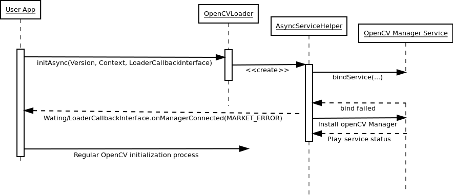
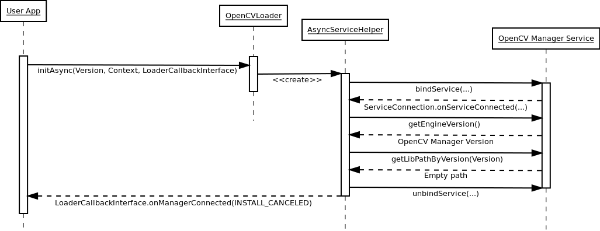

Manager Workflow
****************

.. _manager_selection:

.. include:: ../readme.txt

First application start
-----------------------

There is no OpenCV Manager or OpenCV libraries:

Additional library package installation
---------------------------------------

There is an OpenCV Manager service, but it does not contain appropriate OpenCV library.
If OpenCV library installation has been approved\:

.. image:: img/LibInstallAproved.png

If OpenCV library installation has been cancelled\:

Regular application start
-------------------------

OpenCV Manager and OpenCV library has been already installed.

.. image:: img/LibInstalled.png
