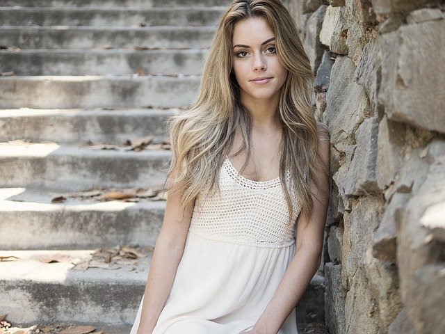

# Run PaddlePaddle model by OpenCV

This tutorial gives 2 demos show how to run PaddlePaddle model by opencv

## 1. Run PaddlePaddle ResNet50 by OpenCV

### Environment Setup

```shell
pip install paddlepaddle-gpu
pip install paddlehub
pip install paddle2onnx
```

### Run PaddlePaddle model demo

Run the example code as below, 

```shell
python paddle_resnet50.py
```

there are 3 part of this execution

* 1. Export PaddlePaddle ResNet50 model to onnx format; 
* 2. Use `cv2.dnn.readNetFromONNX` load model file; 
* 3. Preprocess image file and do inference.

## 2. Run PaddleSeg Portrait Segmentation by OpenCV

### Environment Setup

```shell
pip install paddlepaddle-gpu
pip install paddlehub
pip install paddle2onnx
```

### Convert to ONNX Model

#### Step1. get Paddle Inference model

Thanks for [PaddleSeg](https://github.com/PaddlePaddle/PaddleSeg), this Paddle Inference model convert from HRNet w18 small v1. For more details, please refer to [HumanSeg](https://github.com/PaddlePaddle/PaddleSeg/blob/release/2.1/contrib/HumanSeg/README.md).

```shell
wget 
unzip inference_model.zip
```

Notes:

* The exported Paddle Inference model has to be fixed input shape while dynamic shape is not supported by opencv now.

#### Step2. convert to ONNX model by paddle2onnx

Use the following command to convert

```
paddle2onnx --model_dir inference_model/humanseg_hrnet18_small_v1 \
            --model_filename model.pdmodel \
            --params_filename model.pdiparams \
            --opset_version 11 \
            --save_file humanseg_hrnet18_tiny.onnx
```

The converted model is the one under the current path `humanseg_hrnet18_tiny.onnx` .

### Run PaddleSeg Portrait Segmentation demo

Run the example code as below, 

```shell
python paddle_humanseg.py
```

there are 3 part of this execution

* 1. Use `cv2.dnn.readNetFromONNX` load model file; 
* 2. Preprocess image file and do inference.
* 3. Postprocess image file and visualization.

### Portrait segmentation visualization


