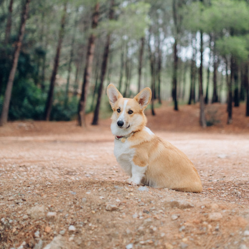
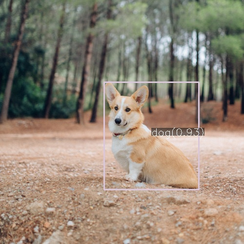

# Run ultralytics YOLOv8 model using OpenCV
This sample shows how to use ultralytics YOLOv8 model by OpenCV

## Environment Setup
`pip install ultralytics`

## 1. Run YOLOv8 model using OpenCV
### Run ultralytics YOLOv8 model demo
Run the follow sample code
`python yolov8_cv.py`

Here are three part for this process
1. export ultraytics YOLOv8 model to onnx model
2. load YOLOv8 onnx model by `cv2.dnn.readNetFromONNX`
3. predict all existing label and their bounding box in  testing image

### Demonstration

origin/prediction picture:

## problem:
OpenCV lincence is 2
ultralytics is 3
